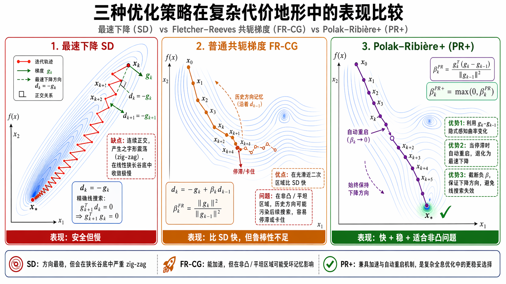

---
categories:
- Readings
date: 2026-04-09
title: "Continuous Gradient Method for SLM Optimization"
lang: en
bibliography: refs.bib
status: draft
---

# Introduction

The Rydberg Hamiltonian assumes a spatially uniform transverse field $|\Omega_i| = \Omega$ on a $16 \times 16$ array spanning $>100\;\mu\text{m}$ [@bernien2017probing], but an unshaped Gaussian beam produces large center-to-edge intensity variation. 
Furthermore, for two-photon Rydberg excitation, the effective Rabi frequency $\Omega_{\rm eff} = \Omega_{420}\Omega_{1013}/2\delta$ contains the product of two beam intensities. If the 420 nm beam has $x\%$ inhomogeneity and the 1013 nm beam has $y\%$, the effective Rabi frequency inhomogeneity is approximately $(x + y)/2\%$ — amplifying the individual beam imperfections.
A typical parameter of the uniformity is breifly reviewed [Here](/Experiments/posts/Lukin_timereview/singlezone_plan.html).

::: {.callout-note icon="false"}
## Performance Benchmarks

| Metric | Requirement | Source |
|--------|-------------|--------|
| Intensity non-uniformity (RMS) | ~2--3% (measured), peak-to-peak ~6--10% | @ebadi2021quantum |
| Flat-top coverage | 105 $\mu$m (flat width) $\times$ 25 $\mu$m (perpendicular Gaussian) | @ebadi2021quantum |
| Wavefront error (corrected) | $< \lambda/100$ | @ebadi2021quantum |
| Conversion efficiency | 30% (420 nm), 38% (1013 nm) | @ebadi2021quantum |
:::

The SLM operates in the Fourier plane, capable of converting the Rydberg excitation beams from Gaussian mode into 1D top-hat light sheets that homogeneously illuminate the atom plane [@ebadi2021quantum].

A phase-only SLM provides one real degree of freedom per pixel — the phase $\phi(\mathbf{r})$ — while the output field $E(\mathbf{r}') = |E|\,e^{i\varphi}$ has two independent quantities (amplitude and phase) at every point. By a simple counting argument, a single phase-only element cannot simultaneously and perfectly control both amplitude and phase across the entire output plane. Yet beam shaping for Rydberg experiments demands precisely this: uniform amplitude ($<3\%$ RMS variation) **and** flat wavefront ($<\lambda/100$ phase error) within the top-hat region. The system achieves this through three mechanisms that collectively circumvent the fundamental limitation:

1. **Complex-field cost function ([CGM cost](#sec-cgm)):** The optimization targets a complex field $\sqrt{I_{\rm target}}\,e^{i\phi_0}$, not just $I_{\rm target}$, while restricting the cost function to only the flat-top region $\Omega$。

2. **Continuous geometric ray-mapping (@sec-ray-mapping):** The optimized SLM phase is smooth and slowly varying — physically equivalent to a computed aspheric lens that redirects rays from the Gaussian center toward the edges. This smooth deflection naturally preserves wavefront continuity, unlike diffractive approaches that generate speckle.

3. **Active wavefront correction (@sec-wavefront-correction):** The algorithm produces an ideal phase $\phi_{\rm ideal}$, but real optical elements introduce $\phi_{\rm error}$. Overlaying $-\phi_{\rm error}$ on the SLM cancels physical aberrations at the atom plane, restoring the flat wavefront that the algorithm designed.

::: {.callout-note icon="false"}
## CGM benchmark results [@Bowman_2017]

| Pattern | Fidelity $F$ | Efficiency $\eta$ | Phase error $\epsilon_\Phi$ | Non-uniformity $\epsilon_{nu}$ |
|:--------|:---:|:---:|:---:|:---:|
| LG$^0_1$ mode | 0.999997 | 41.5% | 0.0003% | 0.005% |
| Flat top | 0.9998 | 11.3% | 0.2% | 0.007% |
| Gaussian line | 0.99999 | 20.4% | 0.01% | 0.002% |
| *Experimental* (Gaussian line) | 0.97 | 7.8% | 2.76% | 0.48% |

:::

The gap between theory and experiment is attributed to:

1. Camera cannot be put into UHV Chamber. Beam splitter outside the UHV Chamber have to be used to guide a small part of the light to the reference camera for correction. This leads to not corrected wavefront aberrations in the optical system — precisely the issue addressed by the active wavefront correction in @sec-wavefront-correction.
2. High-NA Lenses: inherently introduces severe spherical aberrations and coma compared to simple long-focal-length lenses, which cannot be corrected by a SLM with finite pixel pitch.
3. High Power Thermal Effects: The Rydberg beams require massive laser power, which causes thermal lensing and thus dynamically distorts the wavefront in ways a static algorithm struggles to compensate for.

---

# Conjugate Gradient Minimization algorithm sketch {#sec-cgm}

**Conjugate Gradient Minimization (CGM)** was first applied to holographic trap generation by Harte et al. [@harte2014slmcg] for amplitude-only control, then extended to simultaneous phase and amplitude control by Bowman et al. [@Bowman_2017]. The key idea is to reformulate hologram computation as minimization of a cost function that directly encodes the **complex-field** fidelity — not just the intensity.
The price is reduced **light-usage efficiency** $\eta$ (fraction of total output power falling within $\Omega$). For a flat-top beam, Bowman et al. report $\eta \approx 11\%$; for Rydberg experiments, Ebadi et al. achieve 30--38% [@ebadi2021quantum] by optimizing the beam size and measure region geometry.

Given the SLM input field $E^{\rm in}_{p,q} = S_{p,q}\,e^{i\phi_{p,q}}$ (where $S_{p,q}$ is the measured incident beam amplitude and $\phi_{p,q}$ are the SLM pixel phases to be optimized), the output field in the Fourier plane is:
$$
E^{\rm out}_{n,m} = \frac{1}{N_T}\sum_{p,q} S_{p,q}\,e^{i\phi_{p,q}}\,e^{-2\pi i(pn + qm)/N_T} = \sqrt{I_{n,m}}\,e^{i\varphi_{n,m}}.
$$ {#eq-cgm-eout}

The target field is specified as a complex field $\tau_{n,m} = \sqrt{T_{n,m}}\,e^{i\Phi_{n,m}}$, where $T_{n,m}$ is the desired intensity and $\Phi_{n,m}$ is the desired phase (e.g., $\Phi = \text{const}$ for a flat wavefront). 
Keeping normalization $\sum_{n,m} \tilde{T}_{n,m} = \sum_{n,m} \tilde{I}_{n,m} = 1$, the cost function is [@Bowman_2017]:
$$
C = 10^d \left(1 - \sum_{n,m} \sqrt{\tilde{I}_{n,m}\,\tilde{T}_{n,m}}\;\cos(\Phi_{n,m} - \varphi_{n,m})\right)^2,
$$ {#eq-cgm-cost}
where the tilde denotes normalization over a **measure region** $\Omega$ (region of interest), and $10^d$ is a steepness parameter that sharpens the cost landscape to avoid premature stagnation in local minima (typically $d = 9$).

The initial guess phase is chosen as:
$$
\phi_{p,q}^{(0)} = R\,(p^2 + q^2) + D\,(p\cos\theta + q\sin\theta),
$$ {#eq-cgm-init}
where the quadratic term $R$ controls the envelope size in the output plane (analogous to a defocus), and the linear term $(D, \theta)$ offsets the pattern away from the optical axis to avoid the undiffracted zeroth-order spot. This structured initialization suppresses the formation of **optical vortices** — phase singularities that cause the algorithm to stagnate in poor local minima [@Bowman_2017].

The conjugate gradient iteration then proceeds as follows, with convergence typically requiring $< 200$ iterations ($< 75$ s on a standard desktop) [@Bowman_2017].

1. Compute the gradient $g_i = \partial C / \partial \phi_{p,q}$ for each SLM pixel.
2. Update the conjugate descent direction: $\alpha_i = g_i + \frac{g_i \cdot g_i}{g_{i-1} \cdot g_{i-1}}\,\alpha_{i-1}$.
3. Minimize $C$ along $\alpha_i$ by line search.
4. Repeat until $C$ stagnates (change $< 10^{-5}$ between iterations) or a maximum iteration count is reached.

The quality of the computed hologram is characterized by three metrics [@Bowman_2017]:

**Fidelity** (complex-field overlap within $\Omega$):
$$
F = \left|\sum_{n,m \in \Omega} \tau_{n,m}^*\, E^{\rm out}_{n,m}\right|^2.
$$ {#eq-fidelity}

**Relative phase error** (within $\Omega$):
$$
\epsilon_\Phi = \frac{\sum_{n,m}|\Phi_{n,m} - \varphi_{n,m} + P|^2}{\sum_{n,m}|\Phi_{n,m}|^2},
$$ {#eq-phase-error}
where $P$ accounts for the cyclic nature of phase.

**Non-uniformity error** (for flat-intensity regions):
$$
\epsilon_{nu} = \frac{\sum_{n,m}|M_{n,m}(\tilde{I}_{n,m} - I_a)|^2}{\sum_{n,m}|M_{n,m}\,\tilde{T}_{n,m}|^2},
$$ {#eq-nu-error}
where $M_{n,m}$ is a binary mask selecting uniform-intensity regions and $I_a$ is the mean intensity in those regions.

## Method: Calculation of gradient

Defining:

- $E_{in} = A_{in} e^{i\phi}$ and $E_{out} = \mathcal{F}\{E_{in}\}$ to be the input and output fields.
- $B = M \cdot E_{out}$, where $M$ is the mask function.
- $A$ is the traget that only non-zero on $M$.
- $r = \langle A, B \rangle = \sum A^* B$, with $\Re(r)$ being the real part of the inner product.

A typical loss function is $C = S \cdot (1 - \text{Re}(O))^2$, where $O = \frac{\Re(r)}{\|A\| \|B\|}$ and $S$ is a steepness factor.
A gradient of $C$ with respect to SLM phases can be computed using the chain rule:
$$
\nabla_\phi J = \frac{\partial J}{\partial \phi} = -2S (1 - O) \frac{\partial O}{\partial \phi}
$$
Then we calculate the gradient of $O$. Noted that $\|A\|$ is a constant with respect to $\phi$, we have:
$$
\begin{align*}
\frac{\partial O}{\partial \phi} &= \frac{\partial}{\partial \phi} \left( \frac{\Re(r)}{\|A\| \|B\|} \right) = \frac{1}{\|A\|} \left( \frac{\frac{\partial \Re(r)}{\partial \phi} \|B\| - \Re(r) \frac{\partial \|B\|}{\partial \phi}}{\|B\|^2} \right)\\
&= \frac{1}{\|A\| \|B\|} \frac{\partial \Re(r)}{\partial \phi} - \frac{O}{\|B\|} \frac{\partial \|B\|}{\partial \phi}
\end{align*}
$$
where we reduced the problem to compute $\left(\frac{\partial \Re(r)}{\partial \phi}\right)$ and $\left(\frac{\partial \|B\|}{\partial \phi}\right)$.

#### Computation of $\left(\frac{\partial \Re(r)}{\partial \phi}\right)$

$$
\begin{align*}
r &= \langle A, M \cdot \mathcal{F}\{E_{in}\} \rangle  = \langle A, \mathcal{F}\{E_{in}\} \rangle \\
&= \langle \mathcal{F}^{-1}\{A\}, E_{in} \rangle = \sum \tilde{A}^* E_{in} = \sum \tilde{A}^* A_{in} e^{i\phi}\\
\frac{\partial \Re(r)}{\partial \phi} &= \Re\left( \frac{\partial}{\partial \phi} \sum \tilde{A}^* A_{in} e^{i\phi} \right) = \Re\left( \sum i \tilde{A}^* A_{in} e^{i\phi} \right) = \Re(i \cdot E_{in} \cdot \tilde{A}^*)
\end{align*}
$$

#### Computation of $\left(\frac{\partial \|B\|}{\partial \phi}\right)$

Noted that $\frac{\partial \|B\|}{\partial \phi} = \frac{1}{2\|B\|} \frac{\partial \|B\|^2}{\partial \phi}$. Then we use the same method to compute $\left(\frac{\partial \|B\|^2}{\partial \phi}\right)$.
$$
\begin{align*}
\|B\|^2& = \langle E_{in}, \mathcal{F}^{-1}\{B\} \rangle = \Re\left( \sum \tilde{B}^* E_{in} \right)\\
\frac{\partial \|B\|^2}{\partial \phi} &= 2 \cdot \Re(i \cdot E_{in} \cdot \tilde{B}^*)\\
\frac{\partial \|B\|}{\partial \phi} &= \frac{1}{2\|B\|} (2 \cdot \Re(i \cdot E_{in} \cdot \tilde{B}^*)) = \frac{\Re(i \cdot E_{in} \cdot \tilde{B}^*)}{\|B\|}
\end{align*}
$$

For the punish term $P = \sum |E_{out}|^2 = \sum |\mathcal{F}\{E_{in}\}|^2 = \sum |E_{in}|^2$, we have:
$$
\frac{\partial \eta}{\partial \phi} = \frac{1}{P} \frac{\partial \|B\|^2}{\partial \phi} = \frac{2 \cdot  \Re(i \cdot E_{in} \cdot \tilde{B}^*)}{P}
$$

## Method: Polak-Ribière+
CGM use gradient $d_k = -g_k + \beta_k d_{k-1}$ while the different choice of $\beta_k$ gives different conjugate gradient methods.
In the implementation, we use the Polak-Ribière+ method:
$$
\beta_k^{PR} = \frac{g_k^T (g_k - g_{k-1})}{\|g_{k-1}\|^2}, \beta_k^{PR+} = \max(0, \beta_k^{PR})
$$

- Standard SD $d_k \approx -g_k$ and Exact Line Search will Zig-zagging on Ill-conditioned Valleys.
- Ordinary Fletcher-Reeves (FR) use $\beta_k^{FR} = {\|g_k\|^2}/{\|g_{k-1}\|^2}$, which is ill-behaved if the problem is not quardratic and non-convex.
- Polak-Ribière (PR) conbines both:
  - When the gradient changes significantly and orthogonally ($g_k^T g_{k-1} \approx 0$), $\beta_k^{PR} \approx \beta_k^{FR}$, the algorithm shows perfect conjugate gradient acceleration, reaching the valley in a few steps.
  - When $g_k \approx g_{k-1}$, $\beta_k^{PR} \to 0$, this reduced to $d_k \approx -g_k$, which is the standard steepest descent direction.

For the line search, we use the exact line search method. This method is Derivative-free and only requires the cost function value.
The standard method such as Armijo-Wolfe:
$$
\begin{align*}
f(x_k + \alpha d_k) \le f(x_k) + c_1 \alpha \nabla f(x_k)^T d_k, \\
\nabla f(x_k + \alpha d_k)^T d_k \ge c_2 \nabla f(x_k)^T d_k,
\end{align*}
$$
requires the gradient value, which is time-consuming. The exact line search contains the following steps:

- The maximum search length is set such that $\alpha_{\max} \cdot \|d_k\|_{\infty} \leq {\pi}/{2}$ to avoid the search length being too large.
- Given this $\alpha_{\max}$, the first setup $9$ points $S =[10^{-3}, 3\times 10^{-3}, 10^{-2},3 \times 10^{-2}, 0.1, 0.3, 0.6, 1.0, 1.5]$ and find out the best $k \in S$ that minimizes the cost function. If this minimized value is still worse than the initial value, try another smaller $S'$
- after finding the best $k$, take the containing region (e.g., 0,1 gives region $[3\times 10^{-3}, 0.3]$) 
- Then using Golden-section Search.

# Other details

### Geometric Ray-Mapping Picture {#sec-ray-mapping}

The CGM-optimized SLM phase has a distinctive physical character: it is **smooth and slowly varying**, with no high-frequency speckle or sharp discontinuities. This is a direct consequence of the gradient-based optimization — unlike WGS which alternates hard projections between planes, CGM updates the phase by following the smooth gradient $\partial C / \partial \phi_{p,q}$, producing slowly varying solutions.

The smooth CGM phase is physically equivalent to a **computed aspheric lens**. Rather than relying on diffraction and interference, it works by geometric ray deflection:

- The local phase gradient $\nabla\phi(\mathbf{r})$ at each SLM pixel deflects the incoming ray by an angle proportional to $|\nabla\phi|$.
- The algorithm designs $\phi(\mathbf{r})$ so that rays from the high-intensity Gaussian center are steered outward toward the edges, while peripheral rays pass through with minimal deflection.
- The net effect is a smooth redistribution of energy from the Gaussian peak to fill the top-hat uniformly.

Because the ray deflection varies continuously across the SLM aperture, the wavefront of the redirected beam also varies continuously — there are no abrupt phase jumps to seed interference fringes or speckle. This geometric (refractive) picture explains why CGM naturally produces flat wavefronts, while WGS — which relies on diffractive superposition of many plane waves — cannot control the inter-site phase.

---

## Aberration Correction {#sec-wavefront-correction}

The CGM algorithm produces a phase $\phi_{\rm CGM}$ that would yield a perfect flat-top beam with flat wavefront — in a mathematically ideal optical system. In reality, every optical element in the beam path (lenses, mirrors, vacuum chamber windows) introduces phase distortions $\phi_{\rm error}(\mathbf{r})$. Without correction, the field arriving at the atom plane carries the accumulated aberration, destroying the flat wavefront that CGM was designed to produce.

The SLM provides a unique opportunity: since it already imposes a computed phase, it can simultaneously impose the **conjugate** of the measured aberration:
$$
\phi_{\rm SLM} = \phi_{\rm CGM} - \phi_{\rm error},
$$ {#eq-wavefront-cancel}
so that at the atom plane, the total accumulated phase is:
$$
\phi_{\rm CGM} - \phi_{\rm error} + \phi_{\rm error} = \phi_{\rm CGM},
$$
and the aberration is exactly canceled. The correction procedure:

1. **Wavefront measurement:** Characterize the aberrated beam using a wavefront sensor (e.g., Shack-Hartmann [@bowman2010shack]) or phase-retrieval from camera intensity images.
2. **Zernike decomposition:** Expand the measured wavefront error $\phi_{\rm error}(\rho, \theta) = \sum_j c_j Z_j(\rho, \theta)$ in Zernike modes to separate low-order (tilt, defocus, astigmatism) from high-order (coma, spherical, trefoil) contributions.
3. **Conjugate phase overlay:** Subtract $\phi_{\rm error}$ from the SLM hologram per @eq-wavefront-cancel.

This is conceptually identical to the [Zernike correction](wgs_based.qmd#sec-zernike) used for hologram alignment, but extended to high-order aberrations. Bowman et al. [@bowman2010shack] demonstrated SLM-based Shack-Hartmann sensing that corrects system aberrations from $0.8\lambda$ down to $\lambda/16$; the Ebadi et al. system pushes further to $\lambda/100$ by combining this with iterative camera feedback ([wavefront correction](#sec-wavefront-correction)). The residual floor is set by aberrations that vary faster than the SLM pixel pitch can resolve — primarily vacuum window defects.

Even after CGM optimization and wavefront correction, residual intensity non-uniformity remains due to higher-order optical effects (scattered light, pixel crosstalk, SLM phase response nonlinearity). Camera-based feedback closes this gap [@berto2023crosstalk]:

1. Display the CGM-computed hologram on the SLM.
2. Image the resulting beam profile on a high-resolution CMOS camera at the atom plane (or a conjugate plane).
3. Compute the residual error: $\Delta I(\mathbf{r}') = I_{\rm measured}(\mathbf{r}') - I_{\rm target}(\mathbf{r}')$.
4. Feed $\Delta I$ back into the CGM cost function as an updated initial guess, or directly adjust pixel-level weights.
5. Iterate until the RMS non-uniformity converges to the system floor (limited by vacuum window residual aberrations).

Berto et al. [@berto2023crosstalk] showed that explicitly modeling SLM pixel crosstalk — the fact that each pixel's effective phase is influenced by its neighbors due to fringing fields in the liquid crystal — significantly improves the accuracy of this feedback loop. Without crosstalk modeling, feedback iterations can oscillate or converge to a suboptimal solution.

---

## Iterative Fourier Transform Algorithms {#sec-ifta}

CGM belongs to the broader family of **Iterative Fourier Transform Algorithms (IFTA)** [@wyrowski1988iterative], which share the structure of alternating projections between the SLM and image planes. Wyrowski and Bryngdahl introduced the IFTA framework with "soft quantization" — gradually imposing phase-only constraints rather than hard-clamping at each iteration — which significantly improves diffraction efficiency for continuous beam profiles.

A comprehensive review of IFTA variants for beam shaping is provided by Ripoll et al. [@ripoll2004review], comparing:

- **Input-output (IO) algorithm:** Simple amplitude replacement (equivalent to GS), fast but poor uniformity.
- **Soft-quantization IFTA:** Gradual phase constraint enforcement, better efficiency.
- **Bidirectional IFTA:** Enforces constraints in both planes simultaneously, best uniformity for multilevel phase elements.

The [CGM approach](#sec-cgm) used in Rydberg experiments can be viewed as a gradient-descent variant of IFTA that replaces the heuristic projection steps with principled optimization of a differentiable cost function.

Compared to IFTA methods for similar continuous patterns, CGM achieves 6--20$\times$ lower non-uniformity $\epsilon_{nu}$ and 1--2 orders of magnitude lower phase error $\epsilon_\Phi$, at the cost of lower light efficiency (the fundamental trade-off of regional constraint) [@Bowman_2017].

