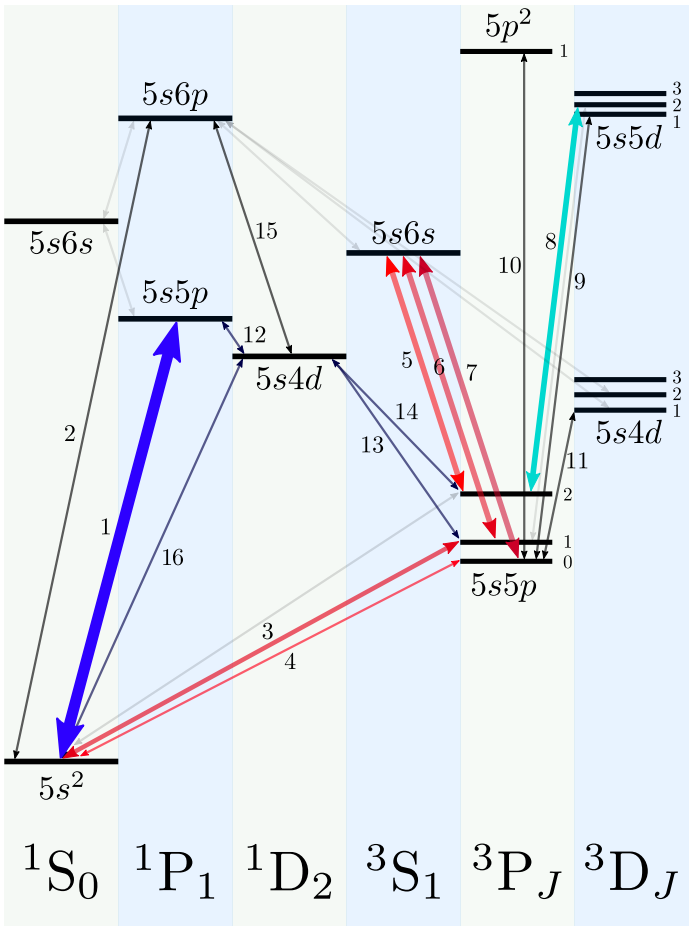
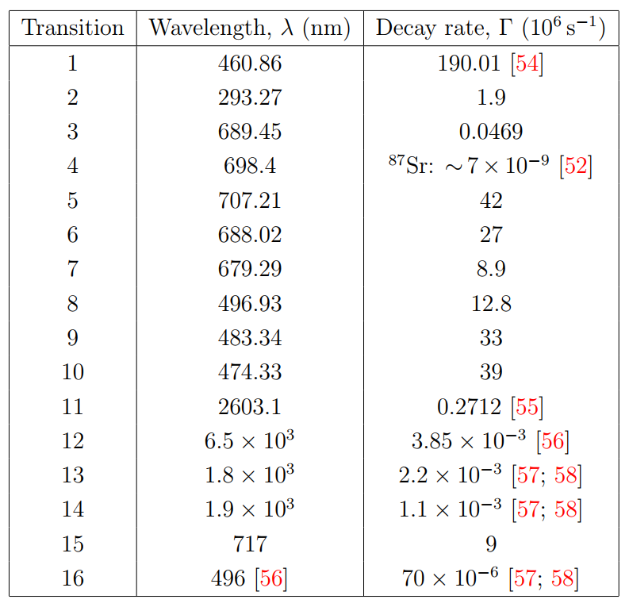

[← Back to Index](index.qmd)

# Overview

Rydberg quantum computing demands laser coherence at the level required to resolve sub-Hz clock-transition linewidths and to suppress phase noise below the gate error budget. This page covers the multi-wavelength laser system for $^{88}$Sr experiments and derives the Pound-Drever-Hall (PDH) locking scheme that achieves sub-Hz frequency stability.

---

# Laser System for $^{88}$Sr {#sec-sr-lasers}

The $^{88}$Sr level structure requires seven distinct wavelengths, each with a specific role in the experimental sequence:

| Wavelength | Transition | Role |
|:----------:|:----------:|:-----|
| **461 nm** | $^1S_0 \to {^1P_1}$ | Broad-line ($\Gamma/2\pi = 32$ MHz) Zeeman slowing and blue MOT |
| **689 nm** | $^1S_0 \to {^3P_1}$ | Narrow-line ($\Gamma/2\pi = 7.4$ kHz) red MOT and Sisyphus cooling |
| **707 nm** | $^3P_2 \to {^3S_1}$ | Repumper: returns atoms from metastable $^3P_2$ to $^3P_1 \to {^1S_0}$ |
| **679 nm** | $^3P_0 \to {^3S_1}$ | Repumper: extends blue-MOT lifetime from 50 ms to 500 ms |
| **813.4 nm** | (off-resonant) | Magic-wavelength optical tweezers: identical AC Stark shift on $|^1S_0\rangle$ and $|^3P_0\rangle$ |
| **1013 nm** | $6P_{3/2} \to 53S_{1/2}$ | Lower leg of two-photon Rydberg excitation (CW, constant $\Omega_{1013}$) |
| **420 nm** | $^1S_0 \to 6P_{3/2}$ | Upper leg of two-photon Rydberg excitation (shaped amplitude and phase via AWG-driven AOMs) |

The choice of 813.4 nm for the tweezers exploits a **magic wavelength** at which the scalar AC polarizabilities of $|^1S_0\rangle$ and $|^3P_0\rangle$ are equal [@ThesisMIT]. This suppresses the differential light shift on the clock qubit transition, which would otherwise cause dephasing.

{#fig-sr-lasers width=45%}

{#fig-sr-lasers-2 width=45%}

---

# Pound-Drever-Hall Locking {#sec-pdh}

PDH locking achieves sub-Hz linewidth by referencing the laser frequency to a high-finesse Fabry-Pérot (F-P) cavity through a phase-modulated error signal. The schematic is shown in @fig-pdh-lock.

{#fig-pdh-lock width=60%}

## Electro-Optic Modulation

The laser at carrier frequency $\omega_0$ passes through an electro-optic modulator (EOM) driven by $\beta\sin(\Omega_m t)$. For small modulation depth $\beta \ll 1$ (retaining only first-order Bessel functions):

$$
E_1 = E_0\,e^{i\omega_0 t + i\beta\sin(\Omega_m t)} \approx E_0\,e^{i\omega_0 t}\left[1 + \frac{J_1(\beta)}{2}e^{i\Omega_m t} - \frac{J_1(\beta)}{2}e^{-i\Omega_m t}\right].
$$ {#eq-EOM}

The field thus consists of a carrier at $\omega_0$ and two sidebands at $\omega_0 \pm \Omega_m$.

## Fabry-Pérot Reflection Coefficient

For a symmetric F-P cavity of length $L$ and mirror reflectivity $r$, the reflection coefficient for a field at frequency $\omega$ is

$$
F(\omega) = r\,\frac{1 - e^{-i\omega\cdot 2L/c}}{1 - r^2\,e^{-i\omega\cdot 2L/c}}.
$$ {#eq-FP}

At the resonance frequencies $\omega_n = n\pi c/L$ (free spectral range $\Delta\nu_{\rm FSR} = c/2L$), $F(\omega_n) = 0$ — no light is reflected back. Between resonances, $|F|$ is close to unity.

## Error Signal Derivation

The reflected intensity from the three-component field is

$$
\begin{aligned}
I_R &= E_0^2\bigl|F(\omega_0)\bigr|^2 + \tfrac{1}{4}J_1(\beta)^2 E_0^2\bigl|F(\omega_0{+}\Omega_m)\bigr|^2 + \tfrac{1}{4}J_1(\beta)^2 E_0^2\bigl|F(\omega_0{-}\Omega_m)\bigr|^2 \\
&\quad + J_1(\beta)E_0^2\,{\rm Re}\bigl[F(\omega_0)F^*(\omega_0{+}\Omega_m) - F^*(\omega_0)F(\omega_0{-}\Omega_m)\bigr]\cos(\Omega_m t) \\
&\quad + J_1(\beta)E_0^2\,{\rm Im}\bigl[F(\omega_0)F^*(\omega_0{+}\Omega_m) - F^*(\omega_0)F(\omega_0{-}\Omega_m)\bigr]\sin(\Omega_m t).
\end{aligned}
$$ {#eq-IR}

A photodetector (PD) converts $I_R$ to a voltage. Mixing with the local oscillator $\beta\sin(\Omega_m t + \Phi)$ and low-pass filtering (LPF) selects the demodulated amplitude of the $\cos(\Omega_m t)$ or $\sin(\Omega_m t)$ term. Choosing $\Phi$ appropriately, the error signal is

$$
\epsilon(\omega_0) \propto {\rm Re}\bigl[F(\omega_0)F^*(\omega_0{+}\Omega_m) - F^*(\omega_0)F(\omega_0{-}\Omega_m)\bigr].
$$ {#eq-error}

Near a cavity resonance $\omega_n$, one has $F(\omega_0) \approx iA(\omega_0 - \omega_n)$ (linear dispersion). Provided $\Omega_m$ is much larger than the cavity linewidth, $F(\omega_0 \pm \Omega_m) \approx \pm ir$ (off-resonant sideband). Then $\epsilon \propto \omega_0 - \omega_n$: the error signal is an odd function of the frequency offset, serving as the feedback signal for the servo loop. The shape of the error signal as a function of $\omega_0$ is shown in @fig-pdh-error.

{#fig-pdh-error width=80%}

PDH locking achieves frequency stability limited by the cavity linewidth (typically $\sim$kHz for a 10-cm Finesse $\sim 10^4$ cavity). With PDH feedforward, laser phase noise can be suppressed beyond the bandwidth limit of the feedback servo [@chao2023pounddreverhall]. This is critical for the 689 nm laser driving the $\sim$7 kHz linewidth $^3P_1$ transition.

---

# Phase Noise Model {#sec-phase-noise}

Despite PDH stabilization, residual laser phase noise remains a primary error source in Rydberg gates. The phase noise is characterized by its power spectral density (PSD). A realistic model combines white noise with servo bumps [@PhysRevA.107.042611]:

$$
S_{\delta\nu}(f) = h_0 + \sum_g \frac{s_g f_g^2}{\sqrt{8\pi}\,\sigma_g}\,e^{-(f - f_g)^2/2\sigma_g^2} + \frac{s_g f_g^2}{\sqrt{8\pi}\,\sigma_g}\,e^{-(f + f_g)^2/2\sigma_g^2},
$$ {#eq-PSD}

where $h_0$ is the white-noise floor, and each Gaussian bump (center $f_g$, width $\sigma_g$, amplitude $s_g$) represents a servo resonance. The relationship between frequency noise PSD $S_{\delta\nu}$ and phase noise PSD $S_\phi$ is $S_{\delta\nu}(f) = f^2 S_\phi(f)$.

For the 1040 nm Ti:Sa laser used in $^{87}$Rb experiments, locked to a 5 kHz linewidth cavity by PDH, the measured PSD is [@PhysRevA.107.042611]:

$$
S_{\delta\nu}(f) = 13 + 25\bigl[e^{-(f/1000 - 130)^2/2\times18^2} + e^{-(f/1000 + 130)^2/2\times18^2}\bigr] + 2000\bigl[e^{-(f/1000 - 234)^2/2\times1.5^2} + e^{-(f/1000 + 234)^2/2\times1.5^2}\bigr],
$$ {#eq-PSD-measured}

(in units of Hz$^2$/Hz, with $f$ in Hz). The servo bumps at $f_g = 130$ kHz and 234 kHz arise from the feedback servo's response. How phase noise enters gate error is derived in [Noise Analysis](noise_errors.qmd).
