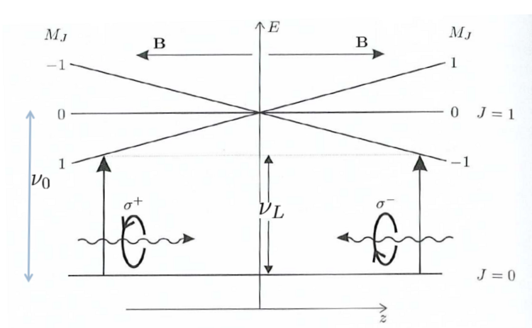
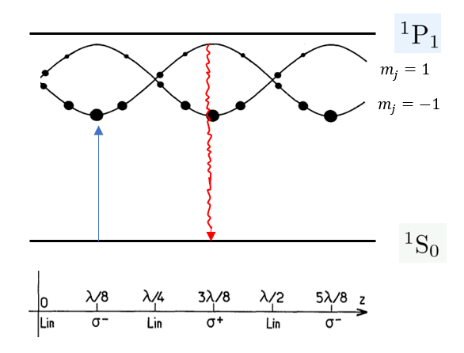

[← Back to Index](index.qmd)

# Overview

Preparing a register of individually-trapped, ground-state-cooled atoms is the prerequisite for any Rydberg gate experiment. This page describes the cooling and trapping sequence for $^{88}$Sr: Zeeman slowing, magneto-optical trapping, Sisyphus cooling in tweezers, single-atom production, and fluorescence imaging.

---

# Atomic Source and Zeeman Slower {#sec-zeeman}

$^{88}$Sr atoms are effused from an oven at 525°C, producing a flux of $3\times10^{11}$ atoms/s. The hot atomic beam travels at $v_{\rm oven}\sim400$ m/s, far above the capture velocity of a MOT ($\sim40$ m/s for the broad 461 nm line). A **Zeeman slower** decelerates the beam by shining a counter-propagating 461 nm laser tuned slightly below resonance. As atoms slow down, their Doppler shift changes, which would detune the laser out of resonance. A spatially varying magnetic field $B(z)$ creates a position-dependent Zeeman shift that compensates the changing Doppler shift, keeping the laser resonant throughout the deceleration region.

After transverse cooling by a two-dimensional optical molasses of linearly-polarized 461 nm light, the atoms enter the ultra-high-vacuum trapping chamber (connected to the oven by a differential pumping tube).

---

# Magneto-Optical Trap {#sec-MOT}

## Operation

In the trapping chamber, three pairs of counter-propagating circularly-polarized 461 nm beams at detuning $\delta = -40$ MHz, $1/e^2$ diameter 3 cm, total power 30 mW, combined with an anti-Helmholtz coil producing an axial field gradient, constitute the blue **magneto-optical trap (MOT)**. The MOT provides two restoring mechanisms:

1. **Doppler cooling**: the frequency-shifted scattering force decelerates moving atoms in all directions.
2. **Position-dependent force**: atoms displaced from the zero-field center experience a Zeeman shift that makes them preferentially absorb photons from the laser opposing their motion, providing spatial confinement.

{#fig-MOT width=50%}

## Repumping

During blue-MOT operation, radiative decay from $^1P_1$ populates the metastable $^3P_2$ and $^3P_0$ states (see @fig-sisyphus). Without repumping, atoms accumulate there and are lost. The repumping pathway is:

- $^3P_2 \xrightarrow{707\,\text{nm}} {^3S_1} \to {^3P_1} \to {^1S_0}$
- $^3P_0 \xrightarrow{679\,\text{nm}} {^3S_1} \to {^3P_1} \to {^1S_0}$

These repump lasers extend the blue-MOT lifetime from 50 ms to 500 ms with the existence of a 689 nm ($^1S_0 \to {^3P_1}$) red-MOT beam operating simultaneously.

---

# Sisyphus Cooling {#sec-sisyphus}

## Mechanism

Sisyphus cooling exploits the spatially periodic polarization of two counter-propagating linearly-polarized beams, producing sub-Doppler temperatures [@Covey_2019]. The mechanism is illustrated in @fig-sisyphus.

{#fig-sisyphus width=50%}

Two orthogonally-polarized plane waves $\hat\varepsilon_x e^{ikz}$ and $\hat\varepsilon_y e^{-ikz}$ produce a superposition

$$
\mathcal{E}^+(z) = \mathcal{E}_0\sqrt{2}\left[\cos(kz)\,\frac{\hat\varepsilon_x + \hat\varepsilon_y}{\sqrt{2}} - i\sin(kz)\,\frac{\hat\varepsilon_y - \hat\varepsilon_x}{\sqrt{2}}\right],
$$ {#eq-sisyphus-pol}

which rotates from linear along $(\hat x + \hat y)/\sqrt{2}$ at $z = 0$, to left-circular at $z = \lambda/8$, to linear along $(\hat x - \hat y)/\sqrt{2}$ at $z = \lambda/4$, to right-circular at $z = 3\lambda/8$, and so on with period $\lambda/2$. This spatial polarization structure is depicted in @fig-optical-molasses.

{#fig-optical-molasses width=50%}

## Cooling Criterion

The key condition for Sisyphus cooling in an optical tweezer is [@Covey_2019]:

1. **Differential light shift**: the excited state $^3P_1$ must experience a larger AC Stark shift from the tweezer than the ground state $^1S_0$. This is satisfied for linearly-polarized trapping wavelengths in $(700, 900)$ nm.
2. **Narrow 689 nm linewidth**: the $^3P_1$ linewidth ($\Gamma/2\pi = 7.4$ kHz) must be smaller than the differential light shift. This allows selective excitation of atoms near the bottom of the $^1S_0$ trap potential, where the 689 nm laser is on resonance.

Atoms excited near the potential minimum climb the steeper $^3P_1$ potential hill before spontaneously decaying back to $^1S_0$, losing kinetic energy each cycle. This iterative process cools atoms to temperatures well below the Doppler limit, reaching $\sim 5\,\mu$K.

---

# Sideband Cooling in Tweezers

After Sisyphus cooling, atoms in the tweezers occupy a thermal distribution over the motional states of the harmonic tweezer potential. Sideband cooling drives the red sideband transition (laser frequency $= \omega_{\rm clock} - \omega_{\rm trap}$), coupling the $|n_{\rm motional}\rangle|g\rangle$ state to $|n_{\rm motional} - 1\rangle|e\rangle$, followed by spontaneous emission that returns the atom to $|n_{\rm motional} - 1\rangle|g\rangle$. Repeating this cycle approaches the motional ground state, with residual occupation $\bar n \lesssim 0.1$ phonons.

---

# Single-Atom Production {#sec-pairwise-loss}

Loading a tweezer from a MOT typically produces 0 or 2 atoms (due to pairwise collisional loss) with roughly equal probability, giving $\sim50\%$ loading efficiency per site. Deterministic single-atom preparation uses the following 9-step protocol [@ThesisMIT]:

1. Transport atoms from red MOT into optical tweezers.
2. Introduce photoassociation laser to implement pairwise loss: two atoms combine into an excited molecular state and gain kinetic energy sufficient to escape the trap.
3. Image atoms in each tweezer to record which sites are occupied.
4. Excite all atoms in loaded tweezers to the clock state $|^3P_0\rangle$.
5. Reduce tweezer depth (via AOD amplitude) in sites containing atoms.
6. Reload ground-state atoms from the red MOT into tweezers; shallow sites (which had one clock-state atom) now also contain new ground-state atoms from the MOT.
7. Apply imaging and cooling light: ground-state atoms in shallow tweezers are heated out; clock-state atoms are unaffected.
8. Restore original tweezer depth.
9. Return to step 2.

This protocol achieves $>95\%$ deterministic single-atom loading per tweezer site.

---

# Single-Atom Fluorescence Imaging {#sec-imaging}

Imaging determines atom presence without ejecting the atom from the trap. The 461 nm laser drives $^1S_0 \to {^1P_1}$ fluorescence, collected by an EMCCD. Simultaneous 689 nm Sisyphus cooling prevents heating from photon recoil.

The angular distribution of scattered photons follows the dipole radiation pattern. For the transition $|J=0, m_J = 0\rangle \to |J=1, m_J = 0\rangle$:

$$
\mathcal{D}(\theta,\phi) = \frac{3}{8\pi}\sin^2\theta,
$$ {#eq-dipole-pattern}

where $\theta$ is measured from the quantization axis. For $m_J = \pm 1$ transitions:

$$
\mathcal{D}(\theta,\phi) = \frac{3}{16\pi}(1 + \cos^2\theta).
$$ {#eq-dipole-pm}

These angular patterns determine the optimal objective lens placement and collection efficiency. In $^{88}$Sr, the nuclear-spin-zero ground state eliminates dark hyperfine states, greatly simplifying imaging [@Covey_2019].

For $^{87}$Rb, the **push-out measurement** is used: a resonant 780 nm laser ejects atoms in $|F=2\rangle$ from the tweezers; remaining $|F=1\rangle$ atoms are detected by fluorescence [@PhysRevLett.123.170503]. This technique is described in detail in [Single-Qubit Gates and Qubit Encoding](single_qubit.qmd).
