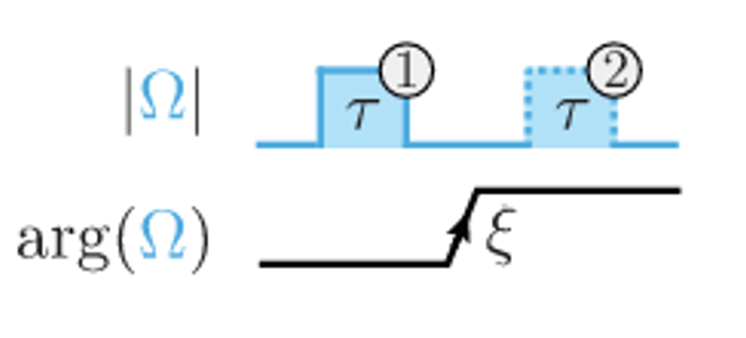
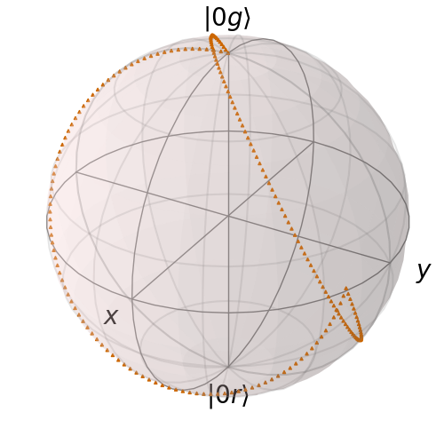
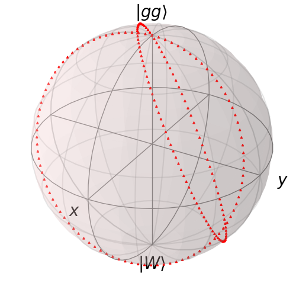
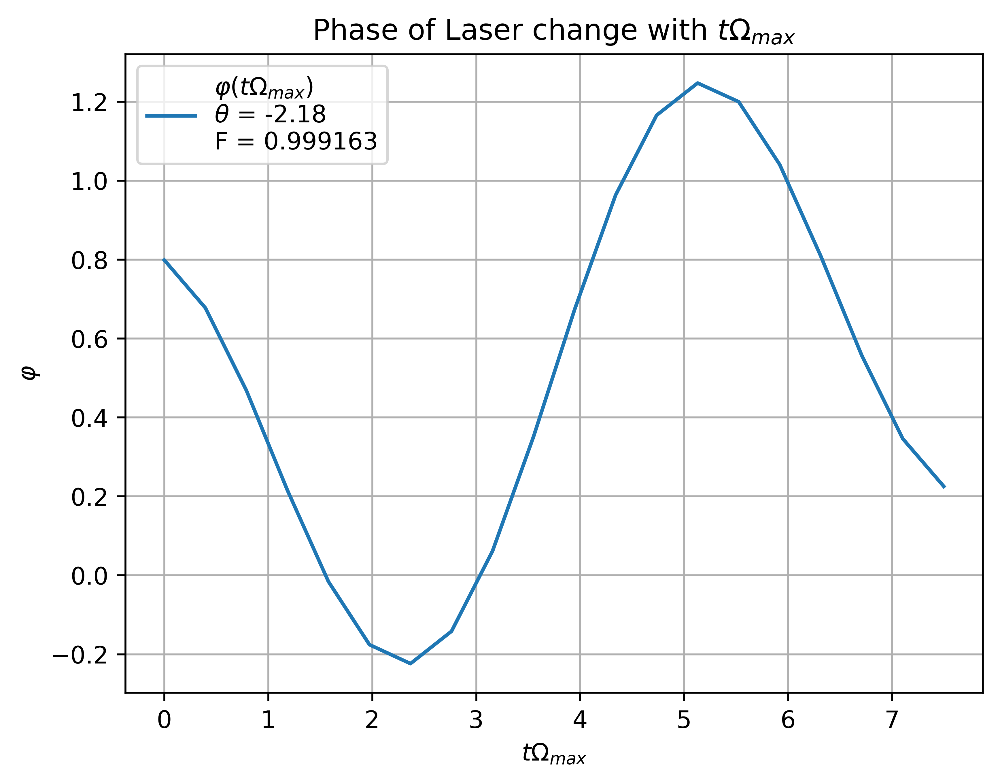
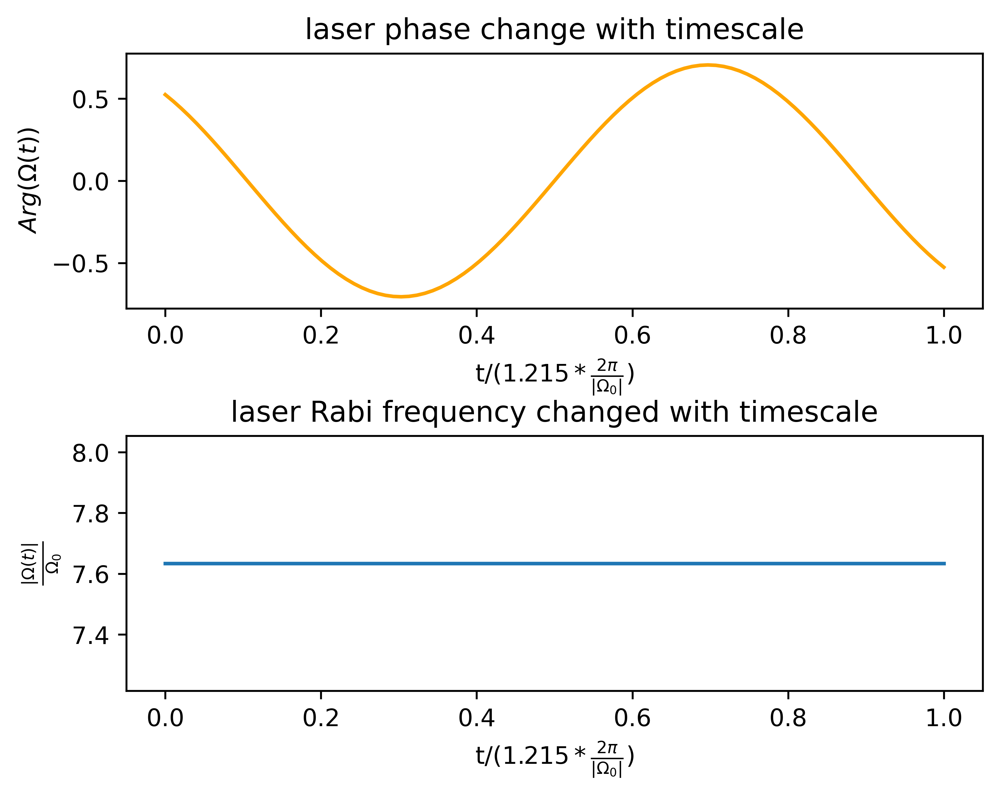
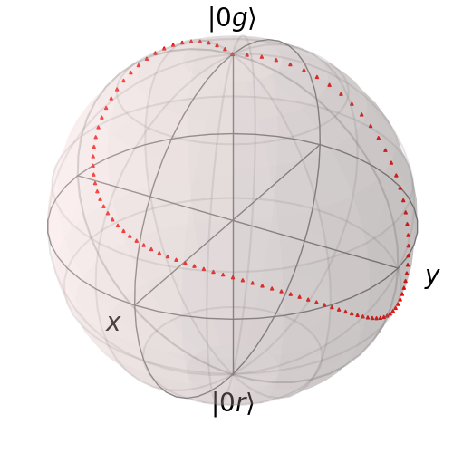
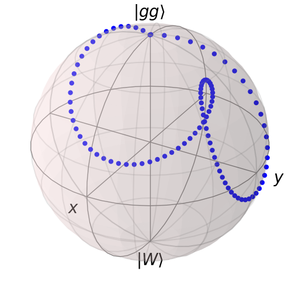

[← Back to Index](index.qmd)

# Overview

The Rydberg blockade provides the mechanism for entangling two qubits: simultaneous excitation of both atoms to the Rydberg state is energetically forbidden when the interaction $B_{12} \gg \Omega$. This page derives the two-qubit Hamiltonian under blockade, the average gate fidelity formula, and three progressively sophisticated gate protocols. The two-photon Raman scheme used in $^{87}$Rb experiments is derived in full.

---

# Single-Photon Gate Hamiltonian {#sec-hamiltonian}

## Full Two-Atom Hilbert Space

The qubit states are $|0\rangle_i, |1\rangle_i = |g\rangle_i$ (both ground-state hyperfine levels) and the auxiliary Rydberg state $|r\rangle_i$. Under a classical drive $E(t) = \vec E_0(t)\cos(\omega_L t + \phi(t))$, the total Hamiltonian is

$$
H_{\rm tot} = \sum_{i=1,2}\hbar(\omega_r - \omega_g)|r\rangle\langle r|_i + \bigl(\Omega(t)|r\rangle\langle g|_i + \text{h.c.}\bigr)\cos(\omega_L t + \phi(t)) + B_{12}|rr\rangle\langle rr|.
$$ {#eq-Htot}

Moving to the interaction picture with $U(t) = \exp[i(\omega_r - \omega_g)t\,|r\rangle\langle r|_1 \otimes \mathbb{I}_2 + \text{atom 2}]$, the Hamiltonian becomes

$$
H'_{\rm tot} = \sum_{i=1,2}\frac{\tilde\Omega(t)}{2}|g\rangle\langle r|_i + \text{h.c.} + B_{12}|rr\rangle\langle rr|,
$$ {#eq-Hrot}

where $\tilde\Omega(t) = e^{i\phi(t) + i[\omega_L - (\omega_r - \omega_g)]t}\,\langle r|\vec E_0(t)\cdot\hat\varepsilon\,r|g\rangle$ encodes the time-varying amplitude and phase of the drive.

## Blockade Approximation: Two Effective Subspaces

When $B_{12} \gg \max_t|\Omega(t)|$, the $|rr\rangle$ state is effectively inaccessible. The dynamics factorizes into two independent 2D subspaces:

$$
H_{01} = \frac{\tilde\Omega(t)}{2}|01\rangle\langle 0r| + \text{h.c.},
$$ {#eq-H01}

$$
H_{11} = \frac{\sqrt{2}\,\tilde\Omega(t)}{2}|11\rangle\langle W| + \text{h.c.},
$$ {#eq-H11}

where $|W\rangle = (|1r\rangle + |r1\rangle)/\sqrt{2}$ is the symmetric singly-excited Rydberg state. The $|00\rangle$ state is a dark state (decoupled from any Rydberg state). The $\sqrt{2}$ factor in $H_{11}$ is the Dicke state enhancement (see [Rydberg Properties](rydberg_properties.qmd#sec-blockade)).

Geometrically: $|01\rangle$ (or $|10\rangle$) traces a path on a Bloch sphere between $|0g\rangle$ and $|0r\rangle$; the $|11\rangle$ subspace traces a path between $|11\rangle$ and $|W\rangle$ on a separate Bloch sphere with doubled Rabi frequency $\sqrt{2}\Omega$.

---

# Average Gate Fidelity {#sec-fidelity}

## Definition

An imperfect gate is a CPTP map $\mathcal{E}$. Its average gate fidelity relative to the target unitary $U$ is [@Nielsen_2002]

$$
\bar F(\mathcal{E}, U) = \int d\psi\,\langle\psi|U^\dagger\mathcal{E}(|\psi\rangle\langle\psi|)U|\psi\rangle,
$$ {#eq-avg-fidelity}

where the integral is over the Haar measure on the qubit Hilbert space.

## CPHASE Gate Formula

For the two-qubit **CPHASE** gate, the average gate fidelity takes a compact form in terms of the final state overlaps [@Nielsen_2002]. Define $a_q = \langle q|U_{\rm target}^\dagger|\psi_q(T)\rangle$, the overlap of the evolved state with the target gate output, where $|\psi_q(T)\rangle$ is the state evolved from initial state $|q\rangle$ ($q \in \{01, 10, 11\}$) under $H'_{\rm tot}$ for duration $T$ and $U_{\rm target}$ is the target CPHASE gate. For a CZ target, this absorbs the $\pi$-phase on $|11\rangle$: explicitly, $a_{11} = -\langle 11|\psi_{11}(T)\rangle$ while $a_{01} = \langle 01|\psi_{01}(T)\rangle$. Then:

$$
\bar F = \frac{1}{20}\bigl(|1 + 2a_{01} + a_{11}|^2 + |a_{11}|^2 + 2|a_{01}|^2 + 1\bigr).
$$ {#eq-Fbar}

*Remark (numerical form).* For gate optimization it is convenient to use the 4-term expanded form [@Evered_2023]:
$$
\bar{F} = \frac{1}{20}\bigl(|1+2a_{01}+a_{11}|^2 + |1+2a_{01}-a_{11}|^2 + |1-2a_{01}+a_{11}|^2 + |1-2a_{01}-a_{11}|^2\bigr).
$$
Both forms are equivalent; the 4-term version follows by expanding $|\operatorname{tr}(M)|^2 + \operatorname{tr}(M^\dagger M)$ for $M = \operatorname{diag}(1,a_{01},a_{01},a_{11})$.

This formula follows from the Haar integral identity $\bar{F} = (|\text{tr}(M)|^2 + \text{tr}(M^\dagger M))/d(d{+}1)$ [@Nielsen_2002] with $d=4$ and $M = U_{\rm target}^\dagger V$ restricted to the computational subspace. Since $|00\rangle$ is dark and $|10\rangle$ is symmetric with $|01\rangle$, $M$ is diagonal with entries $(1, a_{01}, a_{01}, a_{11})$, giving $\text{tr}(M) = 1 + 2a_{01} + a_{11}$ and $\text{tr}(M^\dagger M) = 1 + 2|a_{01}|^2 + |a_{11}|^2$. **Consistency check:** for a perfect gate $a_q = 1$ for all $q$, yielding $\bar{F} = (16 + 4)/20 = 1$.

---

# Phase-Shift Protocol (Levine 2019) {#sec-phaseshift}

The first high-fidelity Rydberg CZ gate [@PhysRevLett.123.170503] uses two pulses with the same Rabi frequency $\Omega$, slight detuning $\Delta$ from resonance, and a relative phase shift $\xi$ between them.

**Mechanism.** On the $\{|01\rangle, |0r\rangle\}$ Bloch sphere (governed by $H_{01}$, @eq-H01), the two-pulse sequence traces a closed loop that returns to $|01\rangle$ with an accumulated geometric phase $\phi_{01}$. On the $\{|11\rangle, |W\rangle\}$ Bloch sphere (governed by $H_{11}$, @eq-H11, which runs at $\sqrt{2}\Omega$), the loop is different, accumulating phase $\phi_{11}$.

The Bloch sphere trajectories are shown in @fig-phaseshift.

::: {layout-ncol=3}
{#fig-phaseshift-ws}

{#fig-phaseshift-10}

{#fig-phaseshift-11}

Bloch sphere traces for the phase-shift CPHASE gate protocol.
:::

The resulting gate is $\text{CPHASE}(\phi_{11} - 2\phi_{01})$; choosing $(\Omega, \Delta, \xi)$ such that $\phi_{11} - 2\phi_{01} = \pi$ implements the CZ gate. The first experimental demonstration achieved $\bar F = 97.4\%$ for parallel two-qubit gates [@PhysRevLett.123.170503].

---

# Time-Optimal GRAPE Protocol (Jandura 2022) {#sec-grape}

For faster gates (minimizing Rydberg state exposure time reduces spontaneous emission errors), the Rabi frequency amplitude is fixed at its maximum: $|\tilde\Omega(t)| = \Omega_{\rm max}$ throughout the gate [@Jandura_2022]. Only the phase $\phi(t)$ is optimized.

**Optimization setup.** Discretize $\phi(t)$ into $N = 100$ piecewise-constant segments $\{c_1, \ldots, c_{100}\}$ over gate time $T$ fixed by $\Omega_{\rm max}T = 7.5$. Solve the Schrödinger equations in $H_{01}$ and $H_{11}$ numerically to obtain $a_{01}(c_1,\ldots,c_{100})$ and $a_{11}(c_1,\ldots,c_{100})$, then minimize the infidelity $J = 1 - \bar F$ by gradient ascent (GRAPE). The optimized phase waveform is shown in @fig-grape-waveform.

{#fig-grape-waveform width=55%}

**Gate form.** The optimized protocol realizes

$$
\text{CPHASE}(\theta) = \begin{pmatrix}
1 & 0 & 0 & 0 \\
0 & e^{i\theta} & 0 & 0 \\
0 & 0 & e^{i\theta} & 0 \\
0 & 0 & 0 & e^{i(2\theta + \pi)}
\end{pmatrix},
$$ {#eq-CPHASE}

which maps to a CZ gate via the local transformation $|1\rangle \to e^{-i\theta}|1\rangle$ on each qubit. The angle $\theta$ is an additional free parameter in the optimization.

---

# Ansatz-Based Protocol (Evered 2023) {#sec-ansatz}

The GRAPE waveform closely resembles a trigonometric function. This motivates a smooth 5-parameter ansatz [@Evered_2023]:

$$
\phi(t) = \delta_0\,t + A\cos(\omega_0 t - \varphi_0),
$$ {#eq-ansatz}

with parameters $\{\delta_0, A, \omega_0, \varphi_0, \theta\}$. This ansatz is nearly time-optimal, requires only 5 parameters instead of 100, and produces smooth laser waveforms that are easier to implement experimentally. The Bloch sphere trajectories are shown in @fig-ansatz-traces.

::: {layout-ncol=3}
{#fig-ansatz-ws}

{#fig-ansatz-10}

{#fig-ansatz-11}

Bloch sphere traces for the ansatz-based time-optimal gate protocol.
:::

The Evered 2023 experiment achieved $99.5\%$ two-qubit gate fidelity using this protocol on $^{87}$Rb atoms.

---

# Two-Photon Raman Excitation for $^{87}$Rb {#sec-two-photon}

## Three-Level Hamiltonian

Single-photon UV excitation to Rydberg states is technically demanding (high-power UV optics, large Rabi frequency requires very intense short-wavelength lasers). The two-photon route via an intermediate state $|e\rangle$ (with $420\,\text{nm} + 1013\,\text{nm}$ for Rb) provides higher effective Rabi frequency for given laser power. The energy level structure is shown in @fig-rb-levels.

{#fig-rb-levels width=55%}

The full three-level Hamiltonian in the lab frame is

$$
H = \hbar\omega_r|r\rangle\langle r| + \hbar\omega_e|e\rangle\langle e| + \hbar\omega_g|g\rangle\langle g| + \hbar\Omega_1(t)\cos[(\omega_e - \omega_g - \Delta)t + \phi_1(t)]|g\rangle\langle e| + \text{h.c.} + \hbar\Omega_2(t)\cos[(\omega_r - \omega_e + \Delta - \delta)t + \phi_2(t)]|e\rangle\langle r| + \text{h.c.}
$$ {#eq-two-photon-H}

Here $\Delta > 0$ is the red-detuning from the intermediate state (large, $\Delta = 7.8$ GHz for Rb), and $\delta$ is the small two-photon detuning from the Rydberg state. The 1013 nm laser is kept at constant power; the 420 nm laser amplitude and phase are shaped via tandem AOMs driven by an AWG [@Evered_2023].

## Two-Atom Subspaces

For two atoms inside the blockade radius, the two-photon Hamiltonian forms two subspaces. The subspace $\mathcal{H}_{0g}$, beginning from $|0g\rangle$ and spanned by $\{|0g\rangle, |0e\rangle, |0r\rangle\}$, has the $3\times3$ Hamiltonian

$$
H'_{\rm tot,0g}/\hbar = \begin{pmatrix}
0 & \tilde\Omega_1(t)/2 & 0 \\
\tilde\Omega_1^*(t)/2 & \Delta & \tilde\Omega_2(t)/2 \\
0 & \tilde\Omega_2^*(t)/2 & \delta
\end{pmatrix}.
$$ {#eq-H-0g}

The subspace $\mathcal{H}_{gg}$, beginning from $|gg\rangle$ and spanned by $\{|gg\rangle, (|ge\rangle + |eg\rangle)/\sqrt{2}, |ee\rangle, (|gr\rangle + |rg\rangle)/\sqrt{2}, (|er\rangle + |re\rangle)/\sqrt{2}\}$, has the $5\times5$ Hamiltonian

$$
H'_{\rm tot,gg}/\hbar = \begin{pmatrix}
0 & \sqrt{2}\tilde\Omega_1/2 & 0 & 0 & 0 \\
\sqrt{2}\tilde\Omega_1^*/2 & \Delta & \sqrt{2}\tilde\Omega_1/2 & \tilde\Omega_2/2 & 0 \\
0 & \sqrt{2}\tilde\Omega_1^*/2 & 2\Delta & 0 & \sqrt{2}\tilde\Omega_2/2 \\
0 & \tilde\Omega_2^*/2 & 0 & \delta & \tilde\Omega_1/2 \\
0 & 0 & \sqrt{2}\tilde\Omega_2^*/2 & \tilde\Omega_1^*/2 & \Delta + \delta
\end{pmatrix}.
$$ {#eq-H-gg}

## Adiabatic Elimination

Moving to the frame $U(t) = \exp[i\omega_g t|g\rangle\langle g| + i(\omega_e - \Delta)t|e\rangle\langle e| + i(\omega_r - \delta)t|r\rangle\langle r|]$, the rotating-frame Hamiltonian has $|e\rangle$ at energy $\Delta \gg \Omega_1, \Omega_2$. Writing the Schrödinger equation for the intermediate states:

$$
i\hbar\partial_t\psi_i = (H_{i1}\psi_1 + H_{i4}\psi_4) + \Delta_i\psi_i, \qquad \forall\;i = 2,3,5,
$$

::: {.callout-note collapse="true"}
## Derivation: explicit Schrödinger equations before elimination

Before eliminating the intermediate states, the full coupled equations for the 6-level system (ground $|g\rangle \equiv |1\rangle$, intermediate $|e_{2,3,4}\rangle$, Rydberg $|r\rangle \equiv |5\rangle$, and garbage Rydberg $|6\rangle$) are, in the rotating frame of @eq-two-photon-H:

$$
\begin{aligned}
i\hbar\partial_t \psi_i &= (H_{i1}\psi_1 + H_{i5}\psi_5) + \Delta\psi_i, \quad \forall\; i = 2,3,4, \\
i\hbar\partial_t \psi_5 &= \sum_{i=2,3,4} H_{5i}\psi_i, \\
i\hbar\partial_t \psi_1 &= \sum_{i=2,3,4} H_{1i}\psi_i.
\end{aligned}
$$

The intermediate states $\{|2\rangle, |3\rangle, |4\rangle\}$ are driven by the 420 nm laser ($H_{i1}$ matrix elements) and couple to the Rydberg state via the 1013 nm laser ($H_{i5}$ matrix elements). Setting $\partial_t\psi_i = 0$ for $i = 2,3,4$ decouples them:

$$
\psi_i \approx -\frac{H_{i1}\psi_1 + H_{i5}\psi_5}{\Delta}, \quad \forall\; i = 2,3,4,
$$

which substituted back gives the effective two-level equations below. Note that state $|6\rangle$ (the unwanted Rydberg state split by 24 MHz) is neglected throughout due to the large Zeeman splitting [@Evered_2023].
:::

Setting $\partial_t\psi_i = 0$ (adiabatic elimination, where $\Delta_i \in \{\Delta, 2\Delta, \Delta+\delta\}$ for $i = 2,3,5$ respectively) gives the effective two-level system between $|1\rangle$ and $|4\rangle$:

$$
i\hbar\partial_t\psi_4 = -\sum_{i=2,3,5}\frac{|H_{4i}|^2}{\Delta_i}\psi_4 - \left(\sum_{i=2,3,5}\frac{H_{i1}H_{4i}^*}{\Delta_i}\right)\psi_1,
$$
$$
i\hbar\partial_t\psi_1 = -\sum_{i=2,3,5}\frac{|H_{1i}|^2}{\Delta_i}\psi_1 - \left(\sum_{i=2,3,5}\frac{H_{i4}H_{1i}^*}{\Delta_i}\right)\psi_4.
$$

The effective light shifts and Rabi frequency are:

$$
\Delta_{\rm eff,r} = -\sum_i \frac{|H_{ir}|^2}{\Delta} = -\frac{\Omega_{1013}^2}{4\Delta},
$$ {#eq-eff-shift-r}

$$
\Delta_{\rm eff,g} = -\sum_i \frac{|H_{ig}|^2}{\Delta} = -\frac{4}{3}\frac{\Omega_{420}^2}{4\Delta},
$$ {#eq-eff-shift-g}

$$
\Omega_{\rm eff} = -\frac{\Omega_{1013}\,\Omega_{420}}{2\Delta}.
$$ {#eq-eff-Omega}

The factor $4/3$ in $\Delta_{\rm eff,g}$ arises from the specific CG-coefficient structure of the intermediate $6P_{3/2}$ states.

## Clebsch-Gordan Structure for $^{87}$Rb

In $^{87}$Rb, the qubit states $|0\rangle = |5S_{1/2}, F=1, m_F=0\rangle$ and $|1\rangle = |5S_{1/2}, F=2, m_F=0\rangle$ decompose in the $\{m_j, m_I\}$ basis as:

$$
|0\rangle = \frac{1}{\sqrt{2}}\bigl[-\{m_j=\tfrac12, m_I=-\tfrac12\} + \{m_j=-\tfrac12, m_I=\tfrac12\}\bigr],
$$
$$
|1\rangle = \frac{1}{\sqrt{2}}\bigl[\{m_j=\tfrac12, m_I=-\tfrac12\} + \{m_j=-\tfrac12, m_I=\tfrac12\}\bigr].
$$

The intermediate states accessed by the $\sigma_+$-polarized 420 nm laser are $|2\rangle, |3\rangle, |4\rangle = \{6P_{3/2}, F=1,2,3, m_F=+1\}$ (all with $m_F = +1$ due to $\Delta m_F = +1$ selection rule). These decompose in the $\{m_j, m_I\}$ basis as:

$$
\begin{aligned}
|2\rangle &= \sqrt{\tfrac{3}{10}}\{m_j{=}\tfrac32, m_I{=}{-}\tfrac12\} - \sqrt{\tfrac{2}{5}}\{m_j{=}\tfrac12, m_I{=}\tfrac12\} + \sqrt{\tfrac{3}{10}}\{m_j{=}{-}\tfrac12, m_I{=}\tfrac32\}, \\
|3\rangle &= \tfrac{1}{\sqrt{2}}\{m_j{=}\tfrac32, m_I{=}{-}\tfrac12\} - \tfrac{1}{\sqrt{2}}\{m_j{=}{-}\tfrac12, m_I{=}\tfrac32\}, \\
|4\rangle &= \tfrac{1}{\sqrt{5}}\{m_j{=}\tfrac32, m_I{=}{-}\tfrac12\} + \sqrt{\tfrac{3}{5}}\{m_j{=}\tfrac12, m_I{=}\tfrac12\} + \tfrac{1}{\sqrt{5}}\{m_j{=}{-}\tfrac12, m_I{=}\tfrac32\}.
\end{aligned}
$$

The Rydberg states are $|5\rangle = \{53S_{1/2}, m_j = +1/2\}$ and $|6\rangle = \{53S_{1/2}, m_j = -1/2\}$ (the latter is split by 24 MHz via an applied magnetic field and can be neglected).

Define $\Omega_{420}$ as the coupling coefficient $\langle 5S_{1/2}, m_j{=}1/2, m_I{=}{-}1/2|e\vec{E}_+\cdot\vec{r}|6P_{3/2}, m_j{=}3/2, m_I{=}{-}1/2\rangle/(\sqrt{2}\hbar)$, and $\gamma\Omega_{420}$ for the coupling involving $m_j = -1/2 \to m_j = 1/2$. Using CG coefficients, the 420 nm coupling matrix elements are:

$$
\begin{aligned}
\langle 2|H|1\rangle &= \sqrt{0.3}\,\Omega_{420}/2 - \sqrt{0.4}\,\gamma\,\Omega_{420}/2, \\
\langle 3|H|1\rangle &= \sqrt{0.5}\,\Omega_{420}/2, \\
\langle 4|H|1\rangle &= \sqrt{0.2}\,\Omega_{420}/2 + \sqrt{0.6}\,\gamma\,\Omega_{420}/2.
\end{aligned}
$$

Similarly, defining $\Omega_{1013} = \langle 53S_{1/2}, m_j{=}1/2|e\vec{E}_-\cdot\vec{r}|6P_{3/2}, m_j{=}3/2\rangle$ and $\beta\Omega_{1013}$ for the $m_j{=}1/2 \to m_j{=}-1/2$ channel, the 1013 nm couplings are:

$$
\begin{aligned}
\langle 5|H|2\rangle &= \sqrt{0.3}\,\Omega_{1013}/2, &\quad \langle 6|H|2\rangle &= -\sqrt{0.4}\,\beta\,\Omega_{1013}/2, \\
\langle 5|H|3\rangle &= \sqrt{0.5}\,\Omega_{1013}/2, &\quad \langle 6|H|3\rangle &= 0, \\
\langle 5|H|4\rangle &= \sqrt{0.2}\,\Omega_{1013}/2, &\quad \langle 6|H|4\rangle &= \sqrt{0.6}\,\beta\,\Omega_{1013}/2.
\end{aligned}
$$

The values $\gamma = \beta = \sqrt{1/3}$ are obtained from radial wavefunction integration (e.g., via the ARC package).

## Resonance Condition

Substituting into @eq-eff-Omega and evaluating the sums gives the effective parameters. The resonance condition requires equal light shifts on $|0\rangle$ and $|1\rangle$, i.e., $\Delta_{\rm eff,r} = \Delta_{\rm eff,g}$. Evaluating explicitly:

$$
\frac{\Omega_{1013}}{\Omega_{420}} = \left(\sqrt{0.3} - \sqrt{\frac{0.4}{3}}\right)^2 + \left(\sqrt{0.2} + \sqrt{\frac{0.6}{3}}\right)^2 + 0.5 = \frac{4}{3}.
$$ {#eq-resonance-condition}

This condition ensures that the effective two-level system has zero differential light shift between $|g\rangle$ and $|r\rangle$.

## Mapping Optimized Protocol to Physical Lasers

Given an abstract two-level gate protocol $\{f(x), \psi(x)\}$ for $x \in [0,1]$ (amplitude and phase functions) and physical parameters $\Omega_{1013}$, $\Delta$, $\Omega_{\rm max}$, the physical laser waveforms are

$$
\Omega_{420}(t) = -\frac{\Omega_{\rm max}}{f_m}\,f(t/T), \qquad
\phi_{420}(t) = \psi(t/T) - \frac{\Omega_{1013}^2}{4\Delta}\,t + \frac{\Omega_{\rm max}^2 T}{3\Delta f_m^2}\int_0^{t/T}dx\,f^2(x),
$$ {#eq-phys-laser}

where $T = 2\Delta f_m/(\Omega_{1013}\Omega_{\rm max})$ and $f_m = \max_x f(x)$. The 1013 nm power is kept constant; the 420 nm laser amplitude and phase are shaped via tandem AOMs driven by the AWG [@Evered_2023].

---

# Error-Robust Pulses {#sec-robust}

Time-optimal gates minimize gate duration but are sensitive to laser noise. Perturbative optimization yields **amplitude-noise robust (AR)** pulses [@PRXQuantum.4.020336].

Under amplitude noise $(1 + \varepsilon)\Omega_{\rm max}$, expand $|\psi_q\rangle = |\psi_q^{(0)}\rangle + \varepsilon|\psi_q^{(1)}\rangle + \mathcal{O}(\varepsilon^2)$, where:

$$
i\hbar\partial_t|\psi_q^{(0)}\rangle = H_q(t)|\psi_q^{(0)}\rangle, \qquad
i\hbar\partial_t|\psi_q^{(1)}\rangle = H_q(t)|\psi_q^{(1)}\rangle + H_q(t)|\psi_q^{(0)}\rangle.
$$ {#eq-perturb}

The modified cost function

$$
J = 1 - \bar F + \sum_{q\in\{01,11\}}\langle\psi_q^{(1)}|\psi_q^{(1)}\rangle
$$ {#eq-AR-cost}

penalizes both gate infidelity and first-order sensitivity to amplitude noise. Minimizing $J$ over the phase waveform $\{c_i\}$ yields AR pulses with suppressed leading-order dependence on $\varepsilon$.

Analogous perturbation analyses yield pulses robust to phase noise (entering as stochastic detuning $\delta(t) = -\dot\phi_n(t)$), differential Stark shifts, and Doppler broadening. See [Noise Analysis](noise_errors.qmd) for the physical noise model.
