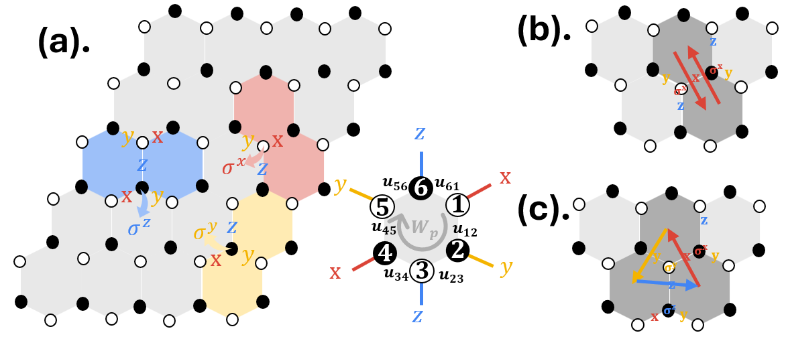
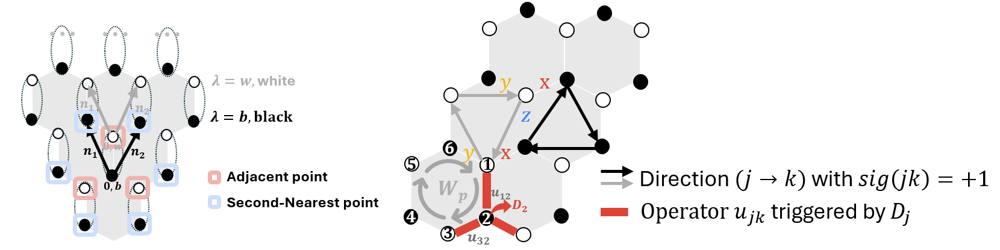
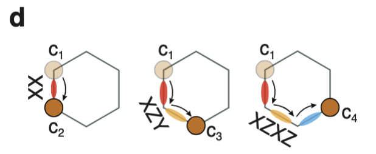
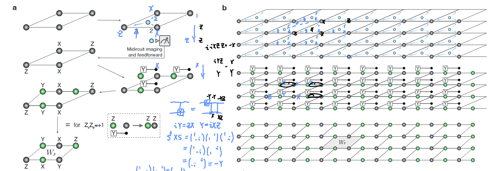
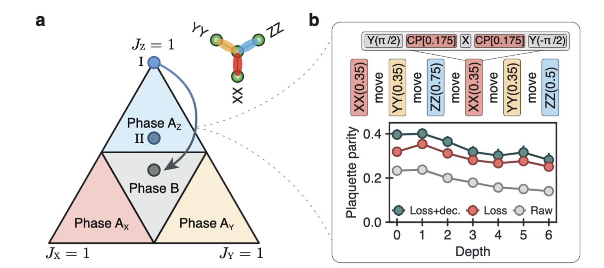
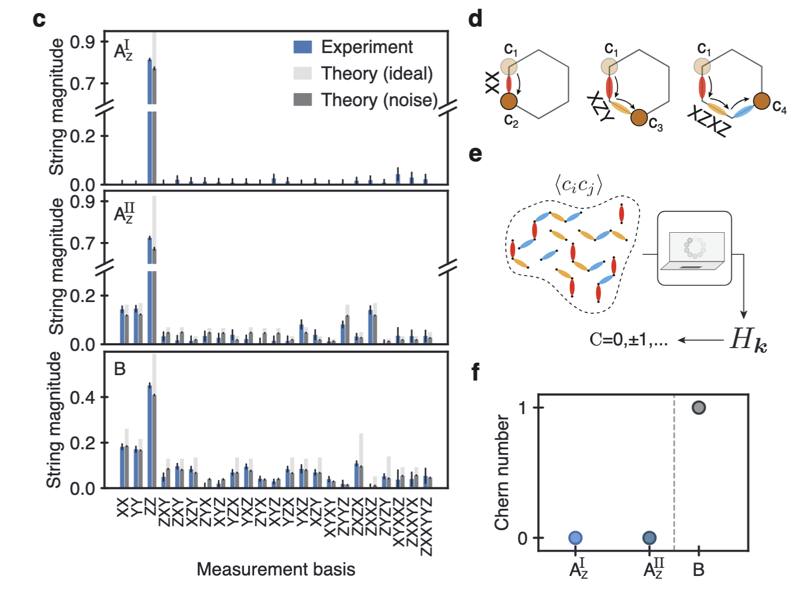
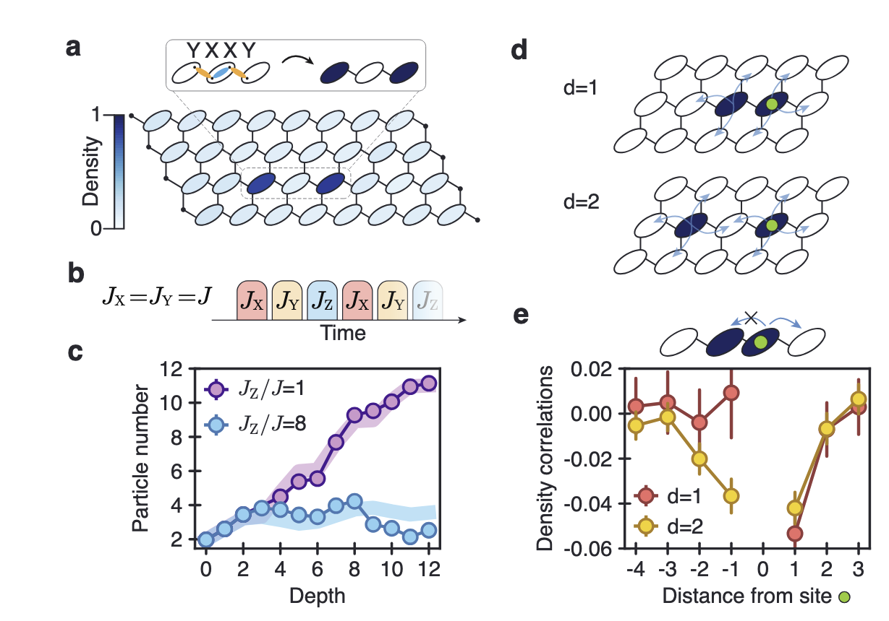

---
categories:
- Readings
date: 2026-03-03
description: 'Notes on the honeycomb model and its equivalence to a free Majorana fermion Hamiltonian.'
lang: en
title: 'Honeycomb Model'
bibliography: refs.bib
---

[← Back to Index](index.qmd)

The **Kitaev honeycomb model** is a bond-dependent spin-$\tfrac{1}{2}$ model whose gapped phase ($B_{\nu=\pm 1}$) hosts non-Abelian Ising anyons — the key ingredient for topological quantum computation.
The native Rydberg interaction ($V_{ij}\,n_i n_j$, Ising-type) does **not** directly produce the required bond-dependent $\sigma^\alpha_j \sigma^\alpha_k$ couplings; realization requires either Floquet-engineered dipolar exchange [@geier2023floquet], laser-assisted dipole–dipole (LADDI) mechanisms [@surface2024kitaev], or digital simulation [@evered2025probing].
This page derives the effective Hamiltonian under magnetic perturbation, establishes the Majorana fermion equivalence and Chern number, then surveys experimental progress.

:::{.callout-warning icon="false"}
## Notation: Kitaev model vs. Rydberg catalog conventions

Two symbols on this page differ from the [catalog-wide notation](index.qmd):

| Symbol | This page (Kitaev model) | Index / other sub-pages (Rydberg) |
|:------:|:-------------------------|:----------------------------------|
| $\sigma_j^\alpha$ | Spin-$\tfrac{1}{2}$ operator on honeycomb site $j$; the superscript $\alpha \in \{x,y,z\}$ labels the **bond type**, not the spatial direction | Pauli operator on the Rydberg qubit ($\lvert g\rangle \leftrightarrow \lvert r\rangle$) at site $j$ |
| $\Delta$ | **Vortex gap**: energy separation between vortex-free and two-vortex sectors of the unperturbed Kitaev model | **Laser detuning** from the Rydberg transition |

In the [Experiment Overview](#experiment-overview) section below, $\Delta$ reverts to the Rydberg detuning convention.
:::

# Derivation of Effective Hamiltonian
The Kitaev honeycomb model is given by:
$$
\begin{align}
    H_0 &= -J_x \sum_{(j,k)\mathrm{~is~}x\text{-links}} \sigma_j^x \sigma_k^x - J_y \sum_{(j,k)\mathrm{~is~}y\text{-links}} \sigma_j^y \sigma_k^y - J_z \sum_{(j,k)\mathrm{~is~}z\text{-links}} \sigma_j^z \sigma_k^z, \\
    V &= \frac{1}{2}\left(h_x \sigma^x_j + h_y \sigma^y_j + h_z \sigma^z_j\right).
\end{align}
$$

:::{#lem-conserve-W .callout-important icon="false"}
## (Conservation of vortex operators)
$[H_{0}, W_p] = 0$, where $W_p := \sigma_1^x \sigma_2^y \sigma_3^z \sigma_4^x \sigma_5^y \sigma_6^z$ is defined on an arbitrary hexagon $p: 123456$, as illustrated in @fig-perturbation-vortex(a).
:::

:::{.callout-note collapse="true"}
## Proof (Click to expand)
As illustrated by @fig-perturbation-vortex(a), the free parts are constituted by $\sigma_1^z \sigma_2^z, \sigma_2^x \sigma_3^x, \cdots$, and they both commute with $W_p$. We also noted that the three-body terms are composed of $\sigma_1^z \sigma_2^y \sigma_3^x, \cdots$ and also all commute with $W_p$. $\square$
:::

{#fig-perturbation-vortex width=70%}

We first consider the low-energy space as a vortex-free space, denoted as $\mathcal{P}_0 := \{\ket{\psi} \mid W_p \ket{\psi} = \ket{\psi}\}$, where $W_p = \sigma_1^x \sigma_2^y \sigma_3^z \sigma_4^x \sigma_5^y \sigma_6^z$ and $p: 1 \to 2 \to 3 \to 4 \to 5 \to 6 \to 1$ forms a hexagon.

We now apply the Schrieffer-Wolff effective Hamiltonian framework ([Lemma subspace-proximity](Effective_ham.qmd#lem-subspace-proximity), [Lemma direct-rotation](Effective_ham.qmd#lem-direct-rotation), [Lemma perturbation_expand](Effective_ham.qmd#lem-perturbation_expand)) to the Kitaev honeycomb model under a weak magnetic field perturbation [@kitaev2006anyons].

:::{#thm-perturbed-honeycomb .callout-important icon="false"}
## (Perturbed honeycomb effective Hamiltonian)
Under a weak magnetic field of the form $\mathbf{h} = (h_x, h_y, h_z)$, we denote that for the magnetic-free honeycomb model, the vortex-free section has energy spectrum $E_i^{(0)}$ and the two-vortex section has energy spectrum $E_j^{(2)}$. Assume that $E_i^{(0)} - E_j^{(2)} \approx \Delta \geq |E^{(0)}_j - E^{(0)}_k|, |E^{(2)}_j - E^{(2)}_k|$, then the *effective Hamiltonian* writes:
$$
H_{hc} = -J_x' \sum_{(j,k)\mathrm{~is~}x\text{-links}} \sigma_j^x \sigma_k^x - J_y' \sum_{(j,k)\mathrm{~is~}y\text{-links}} \sigma_j^y \sigma_k^y - J_z' \sum_{(j,k)\mathrm{~is~}z\text{-links}} \sigma_j^z \sigma_k^z - K \sum_{j,k,l} \sigma_j^x \sigma_k^y \sigma_l^z,
$$
where $K = h_x h_y h_z / \Delta^2$ and $J_\alpha' = J_\alpha + h_\alpha^2 / \Delta$.
:::

:::{.callout-note collapse="true"}
## Proof (Click to expand)

The first term $H_{\mathrm{eff}}^{(0)} = H_0 P_0$ is the spectrum of $H_0$, which can be exactly diagonalized by first solving a free fermion model $H(A) = \frac{i}{4}\sum_{j,k} A_{jk} c_j c_k$ and a gauge projection.

The second term is $H_{\mathrm{eff}}^{(1)} = P_0 V P_0$. To show the result $H_{\mathrm{eff}}^{(1)} = 0$, we prove that $\sigma_j^\alpha \ket{j} \notin \mathcal{P}_0, \forall \ket{j} \in \mathcal{P}_0$ and $\langle l | k \rangle = 0, \forall \ket{l} \notin \mathcal{P}_0, \ket{k} \in \mathcal{P}_0$.

The second-order term $H_{\mathrm{eff}}^{(2)}$ involves products of two spin operators, e.g., $\sigma_i^\alpha \sigma_j^\beta$, and is explicitly written as
$$
\begin{align}
    \frac{1}{2} P_0 \hat{S}_1(V_{od}) P_0 &= \sum_{\ket{j} \in \mathcal{P}_0} \ket{j}\!\bra{j} \frac{\mathcal{L}(V_{\mathrm{od}}) V_{\mathrm{od}} - V_{\mathrm{od}} \mathcal{L}(V_{\mathrm{od}})}{2} \sum_{\ket{k} \in \mathcal{P}_0} \ket{k}\!\bra{k} \\
    &= \frac{1}{2} \sum_{\ket{k} \in \mathcal{P}_0} \sum_{\ket{l} \notin \mathcal{P}_0} \sum_{\ket{j} \in \mathcal{P}_0} \left[\ket{j}\!\bra{j} \mathcal{L}(V_{\mathrm{od}}) \ket{l}\!\bra{l} V_{\mathrm{od}} \ket{k}\!\bra{k} - \ket{j}\!\bra{j} V_{\mathrm{od}} \ket{l}\!\bra{l} \mathcal{L}(V_{\mathrm{od}}) \ket{k}\!\bra{k}\right] \\
    &= \frac{1}{2} \sum_{\ket{k} \in \mathcal{P}_0} \sum_{\ket{l} \notin \mathcal{P}_0} \sum_{\ket{j} \in \mathcal{P}_0} \left[\ket{j} \frac{\bra{j} V \ket{l} \bra{l} V \ket{k}}{E_j - E_l} \bra{k} - \ket{j} \frac{\bra{j} V \ket{l}\!\bra{l} V \ket{k}}{E_l - E_k} \bra{k}\right] \\
    &= \frac{1}{2} \sum_{\ket{k} \in \mathcal{P}_0} \sum_{\ket{l} \notin \mathcal{P}_0} \sum_{\ket{j} \in \mathcal{P}_0} \left[\frac{\bra{j} V \ket{l} \bra{l} V \ket{k}}{E_j - E_l} \ket{j}\!\bra{k} + \frac{\bra{k} V \ket{l}\!\bra{l} V \ket{j}}{E_j - E_l} \ket{k}\!\bra{j}\right]
\end{align}
$$

Using the fact that $V = \sum_{j,\alpha} h_\alpha \sigma_j^\alpha$, $\sigma_j^\alpha \ket{j} \notin \mathcal{P}_0, \forall \ket{j} \in \mathcal{P}_0$ as illustrated in @fig-perturbation-vortex(a), the projection $\sum_{\ket{l} \notin \mathcal{P}_0} \ket{l}\!\bra{l}$ onto the complement of the space $\mathcal{P}_0$ can be replaced by $1/(E_j - H)$.
The state is also required to transform back into the vortex-free state because $\langle l | k \rangle = 0, \forall \ket{l} \notin \mathcal{P}_0, \ket{k} \in \mathcal{P}_0$. The only way to do this is illustrated in @fig-perturbation-vortex(b). If we further assume that the energy gap between the vortex-free section and the two-vortex section is $E_j - E_k \approx \Delta$ and not related to $j, k$, this proves
$$
H_{\mathrm{eff}}^{(2)} = \frac{1}{\Delta} \sum_{(j,k)\text{~adjacent}} h_x^2 \sigma_j^x \sigma_k^x + h_y^2 \sigma_j^y \sigma_k^y + h_z^2 \sigma_j^z \sigma_k^z.
$$

The third-order perturbation has the form
$$
H_{\mathrm{eff}}^{(3)} = (1/2) \cdot P_0 \left[V_{\mathrm{od}} \mathcal{L}(V_{\mathrm{d}} \mathcal{L}(V_{\mathrm{od}})) - V_{\mathrm{od}} \mathcal{L}(\mathcal{L}(V_{\mathrm{od}}) V_{\mathrm{d}}) - \mathcal{L}(V_{\mathrm{d}} \mathcal{L}(V_{\mathrm{od}})) V_{\mathrm{od}} + \mathcal{L}(\mathcal{L}(V_{\mathrm{od}}) V_{\mathrm{d}}) V_{\mathrm{od}}\right] P_0.
$$

Again only a specific sequence of operations can return the system to the flux-free sector. They are illustrated in @fig-perturbation-vortex(c) and described as:

1. $V$ acts on spin $k$ with $\sigma_k^\gamma$, creating a flux pair.
2. $V$ acts on spin $j$ with $\sigma_j^\beta$, which moves one of the fluxes in one step.
3. $V$ acts on spin $i$ with $\sigma_i^\alpha$, which annihilates the modified flux pair, returning the system to the $\mathcal{P}_0$ subspace.

If we further assume that the energy gap between the vortex-free section and the two-vortex section is $E_j - E_k \approx \Delta$ and not related to $j, k$, this "closed loop" process results in an effective three-body interaction. Using the fact that $P_0 V_{\mathrm{d}} P_0 = 0$, we note that $P_0 V_{\mathrm{od}} \mathcal{L}(\mathcal{L}(V_{\mathrm{od}}) V_{\mathrm{d}}) P_0 = 0$ and $P_0 \mathcal{L}(V_{\mathrm{d}} \mathcal{L}(V_{\mathrm{od}})) V_{\mathrm{od}} P_0 = 0$. The dominant term has the form:
$$
H_{\mathrm{eff}}^{(3)} \approx \frac{h_x h_y h_z}{\Delta^2} \sum_{\langle i,j,k \rangle} \sigma_i^x \sigma_j^y \sigma_k^z + \text{permutations},
$$
where $\langle i,j,k \rangle$ denotes a triplet of adjacent sites. This completes the proof of @thm-perturbed-honeycomb. $\square$
:::

# Equivalence to Free Majorana Fermion

This section first proves the equivalence of the spectrum of $H_{\mathrm{hc}}$ and a certain fermion Hamiltonian.

:::{#thm-equ-fermion .callout-important icon="false"}
## (Majorana fermion representation)
Consider two fermions $\{f_j^{(1)}, f_j^{(2)}\}$ and their four-dimensional Fock space and operators
$$
\begin{align}
\mathcal{F} := \bigotimes_{j=1}^N \{\ket{}, f_j^{(1),\dagger}\ket{}, f_j^{(2),\dagger}\ket{}, f_j^{(2),\dagger} f_j^{(1),\dagger}\ket{}\},
\end{align}
$$
$$
\begin{cases}
b^x = f^{(1)} + f^{\dagger,(1)}, \quad b^y = (f^{(1)} - f^{\dagger,(1)})/i, \\
b^z = f^{(2)} + f^{\dagger,(2)}, \quad c = (f^{(2)} - f^{\dagger,(2)})/i, \\
D_j := b_j^x b_j^y b_j^z c_j.
\end{cases}
$$

Restrained on the subspace $\mathcal{M} := \{\ket{v} \mid \forall j, D_j \ket{v} = \ket{v}\}$ and under the transformation $\sigma_j^\alpha \to \tilde{\sigma}_j^\alpha = i b_j^\alpha c_j$, the eigenvalue and eigenspaces of this transformed Majorana fermion Hamiltonian are identical to those of the third-order magnetic perturbed honeycomb model.
:::

:::{.callout-note collapse="true"}
## Proof (Click to expand)
We can express the constraint operator as:
$$
\begin{align*}
b_j^x b_j^y b_j^z c_j &= -(f_j^{(1)} + f_j^{\dagger(1)})(f_j^{(1)} - f_j^{\dagger(1)})(f_j^{(2)} + f_j^{\dagger(2)})(f_j^{(2)} - f_j^{\dagger(2)}) \\
&= [1 - 2\hat{n}_j^{(1)}][1 - 2\hat{n}_j^{(2)}],
\end{align*}
$$
where $\hat{n}_j^{(k)} := f_j^{\dagger(k)} f_j^{(k)}, \forall k = 1,2$ are the fermion number operators.
Thus, the subspace $\mathcal{M}$ is spanned by the states with an even total number of fermions, i.e., it is the vector space spanned by $\{\ket{0}, f_j^{(2)\dagger} f_j^{(1)\dagger}\ket{0}\}$. This is a two-dimensional space.

We can further verify that $\tilde{\sigma}_j^\alpha = i b_j^\alpha c_j$ satisfies all the group multiplication relations of the Pauli group within subspace $\mathcal{M} := \{\ket{v} \mid \forall j, D_j \ket{v} = \ket{v}\}$. That is,
$$
\begin{align}
    \tilde{\sigma}^x \tilde{\sigma}^y \tilde{\sigma}^z &= i^3 b^x c \, b^y c \, b^z c \\
    &= i b_j^x b_j^y b_j^z c_j = i\mathbb{I} \text{~within~} \mathcal{M},
\end{align}
$$
and therefore constitutes a representation of the Pauli group on the subspace $\mathcal{M}$.

It is straightforward to verify that this is an irreducible representation. Since all two-dimensional irreducible representations of the Pauli group are unitarily equivalent, $\tilde{H}$ and $H_{hc}$, being algebraic combinations of these representation matrices, are also unitarily equivalent. Therefore, they have the same eigenvalues and eigenspace structure. $\square$
:::

{#fig-K-illu}

We then show the equivalence of the spectrum of $H_{\mathrm{hc}}$ and a certain Majorana fermion Hamiltonian.
Before transfering the whole Hamiltonian, it is valuable to first consider the transformation rules for a product of Pauli strings based on the identity

$$
\begin{align}
&\hat{u}_{12} c_1 c_2 = ib_1^z b_2^z c_1 c_2 = i(ib_1^z c_1)(ib_2^z c_2) = i\tilde{\sigma}_1^z \tilde{\sigma}_2^z,\\
&c_1c_3 = (c_1c_2)(c_2c_3) = iu_{12}\sigma_1^z\sigma_2^z iu_{23}\sigma_2^x\sigma_3^x = iu_{12}u_{23}\sigma_1^z\sigma_2^y\sigma_3^x.
\end{align}
$$
For longer product of $c$, we can use the identity to transform it into a product of $\tilde{\sigma}$ operators.

{#fig-chop}

:::{#thm-cal-ferm .callout-important icon="false"}
## (Explicit Majorana form)
Use $\alpha_{jk} \in \{x,y,z\}$ to denote the edge type that links the adjacent points $j,k$. Define the notations $\hat{u}_{jk} := i b_j^{\alpha_{jk}} b_k^{\alpha_{jk}}$ and
$$
J_{jk} = \begin{cases} J_x & \text{if } (j,k) \text{ is } x\text{-links,} \\ J_y & \text{if } (j,k) \text{ is } y\text{-links,} \\ J_z & \text{if } (j,k) \text{ is } z\text{-links,} \\ 0 & \text{otherwise.} \end{cases}, \quad K_{jk} = \begin{cases} \mathrm{sgn}(jk) \cdot h_x h_y h_z / \Delta^2 & \text{if } (j,k) \text{ is SNN,} \\ 0 & \text{otherwise.} \end{cases}
$$
Here $\mathrm{sgn}(jk) = +1$ is decided by whether $\alpha_{jl} \to \alpha_{kl} \to \beta_l$ has the same parity of $x \to y \to z$, as illustrated in @fig-K-illu.

Restrained on the subspace $\mathcal{M} := \{\ket{v} \mid \forall j, D_j \ket{v} = \ket{v}\}$ and under the transformation $\sigma_j^\alpha \to \tilde{\sigma}_j^\alpha = i b_j^\alpha c_j$, the third-order magnetic perturbed honeycomb Hamiltonian and its conserved operators $W_p$ are transformed into the Majorana fermion Hamiltonian and operators according to
$$
\tilde{H} = \frac{i}{4} \sum_{j,k} (2J_{jk} \hat{u}_{jk} + 2K_{jk} \hat{u}_{jl} \hat{u}_{kl}) c_j c_k, $$ {#eq-trans-Ham}
$$
\tilde{W}_p = -\hat{u}_{12} \hat{u}_{23} \hat{u}_{34} \hat{u}_{45} \hat{u}_{56} \hat{u}_{61}, $$ {#eq-conser-q}
where $l$ is the unique mid-point of the second-nearest neighbor pair $(j,k)$.
:::

:::{.callout-note collapse="true"}
## Proof (Click to expand)
We use $\alpha_{jk} \in \{x,y,z\}$ to denote the edge type that links the adjacent points $j,k$ and $\beta_l$ to denote the edge type that is inserted at a point $l$.

Then the magnetic-free honeycomb model writes
$$
\begin{align}
H_{\mathrm{free}} &= -\sum_{(j,k)\mathrm{~adjacent}} J_{jk} (ib_j^{\alpha_{jk}} c_j)(ib_k^{\alpha_{jk}} c_k) = -\sum_{(j,k)\mathrm{~adjacent}} J_{jk} b_j^{\alpha_{jk}} b_k^{\alpha_{jk}} c_j c_k \\
&= \frac{i}{4} \sum_{j,k} (2J_{jk})(ib_j^{\alpha_{jk}} b_k^{\alpha_{jk}}) c_j c_k = \frac{i}{4} \sum_{j,k} (2J_{jk} \hat{u}_{jk}) c_j c_k.
\end{align}
$$
In the second equality, we use the fact that the summation $j,k$ over all spin positions will go over each adjacent pair twice $(j_0, k_0), (k_0, j_0)$.

For the third-order correction term, consider adjacent triples $\langle j,k,l \rangle$ that pair $(j,l)$ and $(k,l)$ adjacent and $\langle j,k \rangle$ are Second-Nearest Neighbor (SNN). In the hexagon lattice, the point $l$ is pinned down by $\langle j,k \rangle \in \text{SNN}$. In this case, the third-order interaction has the form: $\sigma^{\alpha_{jl}}_j \sigma^{\beta_l}_l \sigma^{\alpha_{kl}}_k$. We label $\mathrm{sgn}(jk) \in \{+1, -1\}$ such that $b_l^{\alpha_{jl}} b_l^{\alpha_{kl}} b_l^{\beta_l} c_l = \mathrm{sgn}(jk) D_l$. The direction where $\mathrm{sgn}(jk) = +1$ is decided by whether $\alpha_{jl} \to \alpha_{kl} \to \beta_l$ has the same parity of $x \to y \to z$, as illustrated in @fig-K-illu.

We write
$$
\begin{align}
    -K \sigma^{\alpha_{jl}}_j \sigma^{\beta_l}_l \sigma^{\alpha_{kl}}_k &\to -K \cdot ib_j^{\alpha_{jl}} c_j \cdot ib_k^{\alpha_{kl}} c_k \cdot ib_l^{\beta_l} c_l \\
    &= K(ib_j^{\alpha_{jl}}) \cdot (ib_k^{\alpha_{kl}}) \cdot (ib_l^{\beta_l}) c_j c_k c_l \\
    &= iK b_l^{\alpha_{jl}}(-ib_l^{\alpha_{jl}} b_j^{\alpha_{jl}}) \cdot b_l^{\alpha_{kl}}(-ib_l^{\alpha_{kl}} b_k^{\alpha_{kl}}) \cdot b_l^{\beta_l} c_l \, c_j c_k \\
    &= iK \cdot b_l^{\alpha_{jl}} b_l^{\alpha_{kl}} b_l^{\beta_l} c_l \cdot (ib_j^{\alpha_{jl}} b_l^{\alpha_{jl}}) \cdot (ib_k^{\alpha_{kl}} b_l^{\alpha_{kl}}) \cdot c_j c_k \\
    &= i\,\mathrm{sgn}(jk) \cdot K D_l \, \hat{u}_{jl} \hat{u}_{kl} \, c_j c_k.
\end{align}
$$
Using the fact that in the subspace $\mathcal{M}$, the condition $D_l = 1$ is always satisfied, we conclude that:
$$
\begin{align}
    \sum_{\langle j,k,l \rangle} -K \sigma^{\alpha_{jl}}_j \sigma^{\alpha_{kl}}_k \sigma^{\beta_l}_l &= \sum_{\langle j,k \rangle\text{~is SNN}} iK \cdot \mathrm{sgn}(jk) \cdot \hat{u}_{jl} \hat{u}_{kl} \, c_j c_k \\
    &= (i/4) \cdot \sum_{j,k} 2K_{jk} \hat{u}_{jl} \hat{u}_{kl} \, c_j c_k.
\end{align}
$$
Here in the second equality, we again use the fact that the summation $j,k$ over all spin positions will go over each second-nearest neighbor pair twice $(j_0, k_0), (k_0, j_0)$. The notation $K_{jk}$ is defined by
$$
K_{jk} = \begin{cases} \mathrm{sgn}(jk) \cdot h_x h_y h_z / \Delta^2 & \text{if } (j,k) \text{ is SNN,} \\ 0 & \text{otherwise.} \end{cases}
$$
Thus, we show @eq-trans-Ham.

In the space $\mathcal{M}$, it is shown that $\tilde{\sigma}^x \tilde{\sigma}^y \tilde{\sigma}^z = i\mathbb{I}$. Using the fact that
$$
\hat{u}_{12} c_1 c_2 = ib_1^z b_2^z c_1 c_2 = i(ib_1^z c_1)(ib_2^z c_2) = i\tilde{\sigma}_1^z \tilde{\sigma}_2^z,
$$
the second identity @eq-conser-q can be shown directly by calculating:
$$
\begin{align}
    \tilde{W}_p := \tilde{\sigma}_1^x \tilde{\sigma}_2^y \tilde{\sigma}_3^z \tilde{\sigma}_4^x \tilde{\sigma}_5^y \tilde{\sigma}_6^z &= -(i)^6 (\tilde{\sigma}_1^z \tilde{\sigma}_2^z)(\tilde{\sigma}_2^x \tilde{\sigma}_3^x)(\tilde{\sigma}_3^y \tilde{\sigma}_4^y)(\tilde{\sigma}_4^z \tilde{\sigma}_5^z)(\tilde{\sigma}_5^x \tilde{\sigma}_6^x)(\tilde{\sigma}_6^y \tilde{\sigma}_1^y) \\
    &= -\hat{u}_{12} c_1 c_2 \, \hat{u}_{23} c_2 c_3 \, \hat{u}_{34} c_3 c_4 \, \hat{u}_{45} c_4 c_5 \, \hat{u}_{56} c_5 c_6 \, \hat{u}_{61} c_6 c_1 \\
    &= -\hat{u}_{12} \hat{u}_{23} \hat{u}_{34} \hat{u}_{45} \hat{u}_{56} \hat{u}_{61}. \quad \square
\end{align}
$$
:::

#### Gauge Fixing

Now we search for states that satisfy both the eigenvalue equation $\tilde{H}\ket{\psi} = E\ket{\psi}$ and "Gauss's law" $D_j \ket{\psi} = \ket{\psi}$ for $D_j = b_j^x b_j^y b_j^z c_j$. This is still difficult because $\tilde{H}$ involves non-linear interaction between $\hat{u}_{ij}:= i b_j^{\alpha_{ij}} b_k^{\alpha_{ij}}$ and $c_j$.

Fortunately, it is observed that $[\tilde{H}, \hat{u}_{ij}] = 0$. Thus, we can first search for states $\ket{\phi}$ that satisfy the eigenvalue equation $\tilde{H}\ket{\phi} = E\ket{\phi}$ and a certain "gauge law" $\hat{u}_{jk}\ket{\phi} = u_{jk}\ket{\phi}$, where $u_{jk}$ is a valid $\mathbb{Z}_2$ field. Then the real state $\ket{\psi}$ can be found by simply projecting back into the physical subspace $\mathcal{M} = \{\ket{v} \mid \forall j, D_j \ket{v} = \ket{v}\}$. This procedure is validated by the lemma below:

:::{#lem-gauge .callout-important icon="false"}
## (Gauge projection)
Define the gauge subspace as $\mathcal{G}(u_{jk}) := \{\ket{v} \mid i b_j^{\alpha_{jk}} b_k^{\alpha_{jk}} \ket{v} = u_{jk}\ket{v}\}$, where $u_{jk}$ is a valid $\mathbb{Z}_2$ gauge field, i.e., an array of $\{+1, -1\}$ satisfying (i) skew-symmetry under the exchange of $j,k$, and (ii) it is non-zero only when $j,k$ are adjacent.
Define the physical subspace as $\mathcal{M} := \{\ket{v} \mid \forall j, b_j^x b_j^y b_j^z c_j \ket{v} = \ket{v}\}$.
Let $P_{\mathcal{G}}$ and $P_{\mathcal{M}}$ be the projectors onto these subspaces, respectively.
Then for any non-zero eigenvector $\ket{v}$ of $P_{\mathcal{G}} \tilde{H} P_{\mathcal{G}}$ with eigenvalue $\lambda_v$, we have $P_{\mathcal{M}}\ket{v} \neq 0$ and $P_{\mathcal{M}} \tilde{H} P_{\mathcal{M}} (P_{\mathcal{M}}\ket{v}) = \lambda_v P_{\mathcal{M}}\ket{v}$.
:::

:::{.callout-note collapse="true"}
## Proof (Click to expand)
Since $[\hat{u}_{jk}, \tilde{H}] = 0$, they have common eigenvectors.
Then for any non-zero eigenvector $\ket{v}$ of $P_{\mathcal{G}} \tilde{H} P_{\mathcal{G}}$ with eigenvalue $\lambda_v$, it must be a non-zero common eigenvector of the operator set $\{\tilde{H}, \hat{u}_{jk}\}$ with $\tilde{H}\ket{v} = \lambda_v \ket{v}$, $\hat{u}_{jk}\ket{v} = u_{jk}\ket{v}$.

For operator $D_j = b_j^x b_j^y b_j^z c_j$, notice that $[D_j, \tilde{H}] = 0$.
Thus, for any eigenvector $\ket{v}$ of $\tilde{H}$, the state $D_j \ket{v}$ is also an eigenvector of $\tilde{H}$ with the same eigenvalue $\lambda_v$.

Notice that the operator $\hat{u}_{jk} = i b_j^{\alpha_{jk}} b_k^{\alpha_{jk}}$ is anticommutative with $D_j$. This is because
$$
D_j (i b_j^x b_k^x) = i(b_j^x b_j^y b_j^z c_j)(b_j^x b_k^x) = i b_j^x (b_j^x b_k^x) b_j^y b_j^z c_j = -i(b_j^x b_k^x) D_j.
$$
Thus $D_j \ket{v}$ is an eigenvector of the link operators $\hat{u}_{jk}$ with $\hat{u}_{jk} D_{j_0}\ket{v} = u'_{jk}\ket{v}$ and $u'_{j_0 k} = -u_{j_0 k}$ for all $(k, j_0)$ adjacent.

In conclusion, $D_j\ket{v}$ is a non-zero common eigenvector of $\{\tilde{H}, \hat{u}_{jk}\}$ with $\tilde{H} D_j\ket{v} = \lambda_v D_j\ket{v}$, $\hat{u}_{jk} D_j\ket{v} = u'_{jk} D_j\ket{v}$.
Thus, the states $D_j \ket{v}$ and $\ket{v}$ belong to different eigenspaces of the operator set $\{\tilde{H}, \hat{u}_{jk}\}$ and are therefore linearly independent.

The same argument can be applied to $D_{j_1} \cdots D_{j_k} \ket{v}$ and show that they are linearly independent of each other.
Thus, we can construct the non-zero vector
$$
\prod_j \left(\frac{\mathbb{I} + D_j}{2}\right) \ket{v} = P_{\mathcal{M}}\ket{v}.
$$
Thus, this state is still an eigenvector of $\tilde{H}$ with the same eigenvalue, and it satisfies the property
$$
P_{\mathcal{M}} \tilde{H} P_{\mathcal{M}} (P_{\mathcal{M}}\ket{v}) = \lambda_v P_{\mathcal{M}}\ket{v}. \quad \square
$$
:::

Based on @lem-gauge, we are free to choose an arbitrary gauge subspace $\mathcal{G}(u_{jk})$ and replace the operator $\hat{u}_{ij}$ with a number $u_{ij} \in \{+1, -1\}$. This gives the Hamiltonian $\tilde{H}$ in the gauge subspace $\mathcal{G}(u_{jk})$ as
$$
\tilde{H}(\{u_{jk}\}) = \frac{i}{4} \sum_{j,k} A_{jk} c_j c_k, \quad A_{jk} = 2J_{jk} u_{jk} + 2K_{jk} u_{jl} u_{kl}, $$ {#eq-free-ferm}
where $A_{jk}$ is an anti-symmetric matrix, given that the $\mathbb{Z}_2$ gauge field $u_{jk}$ and constant $K_{jk}$ are both anti-symmetric.
This reduced the problem into a free Majorana fermion Hamiltonian and can be rigorously diagonalized, as shown in the next section.

#### Vortex sector
Given one gauge subspace $\mathcal{G}(u_{jk})$, the eigenspaces of the solvable operators $\tilde{H}(\{u_{jk}\})$ do not cover all eigenspaces of $H_{\mathrm{hc}}$.
It can be proved that if two gauge subspaces specified by $\{u_{jk}\}$ and $\{v_{jk}\}$ can be related by a certain sequence of $D_j$ operations, they will induce the same eigenspaces of $H_{\mathrm{hc}}$ after the projection into the physical subspace.
The operation of $D_j$, although transforms the gauge field $\{u_{jk}\}$ into gauge field $\{v_{jk}\}$, it preserves the vortex $w_p:= u_{12} u_{23} u_{34} u_{45} u_{56} u_{61}$ of the $\mathbb{Z}_2$ gauge field, as previously defined in @lem-vortex-reflect. These value of the vortexes actrually reflect the conserved quantity $W_p$ in the physical spin Hamiltonian $H_{\mathrm{hc}}$, as proved in @lem-conserve-W.

:::{#lem-vortex-reflect .callout-important icon="false"}
## (Vortex-gauge correspondence)
Consider a $\mathbb{Z}_2$ gauge field $\{u_{jk}\}$ and define its vortex field as $\{w_p\}_p$ where $w_p = u_{12} u_{23} u_{34} u_{45} u_{56} u_{61}$ is defined on an arbitrary hexagon $p: 123456$.
Then for the eigenvectors $\ket{v}$ of $\tilde{H}(\{u_{jk}\})$ in @eq-free-ferm such that $\tilde{H}\ket{v} = \lambda_v \ket{v}$, those $\ket{v}$ are one-to-one corresponding with those vectors such that $H_{\mathrm{hc}}\ket{\phi} = \lambda_v \ket{\phi}$ and $W_p \ket{\phi} = -w_p \ket{\phi}$.
:::

:::{.callout-note collapse="true"}
## Proof (Click to expand)
According to @thm-cal-ferm, $\tilde{W}_p = -\hat{u}_{12} \hat{u}_{23} \hat{u}_{34} \hat{u}_{45} \hat{u}_{56} \hat{u}_{61}$.
We note that $[\tilde{W}_p, D_j] = 0$ because for a hexagon $p$ that contains point $j$, $\tilde{W}_p$ will contain two operators $\hat{u}_{jk}, \hat{u}_{jk'}$ that are both anticommutative with $D_j$, as illustrated in @fig-K-illu.

Thus, $P_{\mathcal{M}}\ket{v} = \prod_j \left((\mathbb{I} + D_j)/2\right) \ket{v}$ still satisfies $\tilde{H} P_{\mathcal{M}}\ket{v} = \lambda_v P_{\mathcal{M}}\ket{v}$ and $\tilde{W}_p P_{\mathcal{M}}\ket{v} = -w_p P_{\mathcal{M}}\ket{v}$.

As shown in @thm-equ-fermion and @thm-cal-ferm, the state $P_{\mathcal{M}}\ket{v}$ within the subspace $\mathcal{M}$ now one-to-one corresponds to the eigenvector of $H_{\mathrm{hc}}$.
Because $\tilde{W}_p P_{\mathcal{M}}\ket{v} = -w_p P_{\mathcal{M}}\ket{v}$, it also satisfies $W_p \ket{\phi} = -w_p \ket{\phi}$. $\square$
:::

## The Vortex-Free Section and its Chern Number

The first result calculates the vortex-free region. In this case, we choose the **standard gauge field**
$$
u_{jk}^{\mathrm{std}} = \begin{cases}
    +1, & \forall j \in w, k \in b \text{~adjacent}, \\
    -1, & \forall j \in b, k \in w \text{~adjacent}.
\end{cases}
$$
Such a choice leads $w_p = u_{12} u_{23} u_{34} u_{45} u_{56} u_{61} = -1$ for an arbitrary hexagon $p: 123456$, as illustrated in @fig-perturbation-vortex.
Thus, according to @lem-vortex-reflect, the solution of @eq-free-ferm corresponds to the vortex-free section (i.e., $\forall p, W_p = +1$).

We then proceed to solve the free-Majorana model $\tilde{H}(\{u_{jk}^{\mathrm{std}}\})$ defined in @eq-free-ferm analytically. One critical function is the Fourier transformation of the matrix $A^{\mathrm{std}}$. We calculate it exactly and present it as @lem-fourier-A below.

:::{#lem-fourier-A .callout-important icon="false"}
## (Fourier transform of $A^{\mathrm{std}}$)
In the standard gauge, the translationally invariant matrix $A_{jk}^{\mathrm{std}}$ in the Hamiltonian $\tilde{H}(\{u_{jk}^{\mathrm{std}}\}) = (i/4) \cdot \sum_{j,k} A_{jk}^{\mathrm{std}} c_j c_k$ has the Fourier transformation:
$$
i\tilde{A}(\mathbf{q}) = \frac{1}{2}\begin{pmatrix} \Delta(\mathbf{q}) & if(\mathbf{q}) \\ -if^*(\mathbf{q}) & -\Delta(\mathbf{q}) \end{pmatrix},
$$
where $f(\mathbf{q}) = 2(J_x e^{i\mathbf{q}\cdot\mathbf{n}_1} + J_y e^{i\mathbf{q}\cdot\mathbf{n}_2} + J_z)$ and $\Delta(\mathbf{q}) = 4K[\sin(\mathbf{q}\cdot\mathbf{n}_1) - \sin(\mathbf{q}\cdot\mathbf{n}_2) - \sin(\mathbf{q}\cdot(\mathbf{n}_1 - \mathbf{n}_2))]$.
:::

:::{.callout-note collapse="true"}
## Proof (Click to expand)
As shown in @fig-K-illu, the honeycomb lattice can be regarded as a nesting of a triangular lattice $b$ (black dots) and a lattice $w$ (white dots). For each sublattice, we choose the two origins circled in the diagram and use the basis vectors $(\mathbf{n}_1, \mathbf{n}_2)$ as chosen in the figure to represent any point on it.

Let $A_{\mathbf{s}\lambda, \mathbf{t}\mu}$ be the matrix elements, where $\lambda, \mu \in \{b, w\}$ represent the sublattice, and $\mathbf{s}, \mathbf{t} \in \mathbb{Z}\mathbf{n}_1 + \mathbb{Z}\mathbf{n}_2$ represent the positions $s_1\mathbf{n}_1 + s_2\mathbf{n}_2$ and $t_1\mathbf{n}_1 + t_2\mathbf{n}_2$ in the lattice.

Define the following transformations:
$$
\tilde{A}_{\lambda,\mu}(\mathbf{q}) := \sum_{\mathbf{t}} e^{i\mathbf{q}\cdot\mathbf{t}} A_{\mathbf{0}\lambda, \mathbf{t}\mu}, \quad a_{\mathbf{q},\lambda} := \frac{1}{\sqrt{2N}} \sum_{\mathbf{s}} e^{-i\mathbf{q}\cdot\mathbf{s}} c_{\mathbf{s}\lambda}.
$$
Using $\{c_i, c_j\} = 2\delta_{ij}$, it is easy to verify that $a_{\mathbf{q},\lambda}$ constitute the creation and annihilation operators in the momentum space for fermions:
$$
\{a_{\mathbf{q},\lambda}, a_{\mathbf{q}',\lambda'}^\dagger\} = \frac{1}{2N} \sum_{\mathbf{s},\mathbf{s}'} e^{-i\mathbf{q}\cdot\mathbf{s} + i\mathbf{q}'\cdot\mathbf{s}'} \{c_{\mathbf{s}\lambda}, c_{\mathbf{s}'\lambda'}^\dagger\} = \delta_{\lambda,\lambda'} \delta_{\mathbf{q},\mathbf{q}'}.
$$
Then we have the following identity:
$$
\begin{align*}
\frac{1}{2}\sum_{\mathbf{q},\lambda,\mu} i\tilde{A}_{\lambda,\mu}(\mathbf{q}) a_{\mathbf{q},\lambda}^\dagger a_{\mathbf{q},\mu} &= \frac{1}{2}\sum_{\mathbf{q},\lambda,\mu} i\sum_{\mathbf{t}} e^{i\mathbf{q}\cdot\mathbf{t}} A_{\mathbf{0}\lambda,\mathbf{t}\mu} \cdot \frac{1}{\sqrt{2N}} \sum_{\mathbf{s}} e^{i\mathbf{q}\cdot\mathbf{s}} c_{\mathbf{s}\lambda}^\dagger \cdot \frac{1}{\sqrt{2N}} \sum_{\mathbf{s}'} e^{-i\mathbf{q}\cdot\mathbf{s}'} c_{\mathbf{s}'\mu} \\
&= \frac{i}{4N}\sum_{\mathbf{q},\lambda,\mu}\sum_{\mathbf{t}} \sum_{\mathbf{s}} \sum_{\mathbf{s}'} e^{i\mathbf{q}\cdot\mathbf{t} + i\mathbf{q}\cdot\mathbf{s} - i\mathbf{q}\cdot\mathbf{s}'} A_{\mathbf{0}\lambda,\mathbf{t}\mu} c_{\mathbf{s}\lambda}^\dagger c_{\mathbf{s}'\mu} \\
&= \frac{i}{4}\sum_{\lambda,\mu}\sum_{\mathbf{t}} \sum_{\mathbf{s}} \sum_{\mathbf{s}'} \delta(\mathbf{t} + \mathbf{s} - \mathbf{s}') A_{\mathbf{0}\lambda,\mathbf{t}\mu} c_{\mathbf{s}\lambda}^\dagger c_{\mathbf{s}'\mu} \\
&= \frac{i}{4}\sum_{\lambda,\mu,\mathbf{t},\mathbf{s}} A_{\mathbf{0}\lambda,\mathbf{t}\mu} c_{\mathbf{s}\lambda}^\dagger c_{\mathbf{t}+\mathbf{s},\mu} \\
&= \frac{i}{4}\sum_{\mathbf{s}\lambda, \mathbf{t}'\mu} A_{\mathbf{s}\lambda,\mathbf{t}'\mu} c_{\mathbf{s}\lambda}^\dagger c_{\mathbf{t}'\mu} = H(A).
\end{align*}
$$
This proves that in the basis $\{a_{\mathbf{q},b}^\dagger\ket{0}, a_{\mathbf{q},w}^\dagger\ket{0}\}$, the quadratic fermion Hamiltonian can be block-diagonalized into a series of $2 \times 2$ matrices:
$$
\tilde{H}(\mathbf{q}) = \frac{i}{2}\begin{pmatrix} \tilde{A}_{b,b}(\mathbf{q}) & \tilde{A}_{b,w}(\mathbf{q}) \\ \tilde{A}_{w,b}(\mathbf{q}) & \tilde{A}_{w,w}(\mathbf{q}) \end{pmatrix}.
$$

Now, we substitute the expression for $A_{\mathbf{s}\lambda, \mathbf{t}\mu}$ in the vortex-free, standard gauge to calculate $\tilde{A}_{\lambda,\mu}(\mathbf{q}) := \sum_{\mathbf{t}} e^{i\mathbf{q}\cdot\mathbf{t}} A_{\mathbf{0}\lambda,\mathbf{t}\mu}$.

Since the nearest-neighbor bonds are between the black and white sublattices, $b$ and $w$, and do not connect sites within the same sublattice, $A_{\mathbf{s}\lambda,\mathbf{t}\mu}$ is non-zero only when $\lambda \neq \mu$.

Take $\lambda = b, \mu = w$. For $\mathbf{s} = \mathbf{0}, \lambda = b$, we consider the origin of the black sublattice. Considering its nearest-neighbor sites, these are all white dots and satisfy $A_{jk} = 2J_{jk} u_{jk}$. It is only adjacent to the three surrounding white dots, corresponding to $\mathbf{t} = \mathbf{0}, -\mathbf{n}_1, -\mathbf{n}_2$ for $\mu = w$. The corresponding coupling coefficients are:
$$
\begin{cases}
A_{\mathbf{0}b, \mathbf{0}w} = 2J_{\mathbf{0}b, \mathbf{0}w} u_{\mathbf{0}b, \mathbf{0}w} = -2J_z, \\
A_{\mathbf{0}b, -\mathbf{n}_1 w} = 2J_{\mathbf{0}b, -\mathbf{n}_1 w} u_{\mathbf{0}b, -\mathbf{n}_1 w} = -2J_x, \\
A_{\mathbf{0}b, -\mathbf{n}_2 w} = 2J_{\mathbf{0}b, -\mathbf{n}_2 w} u_{\mathbf{0}b, -\mathbf{n}_2 w} = -2J_y.
\end{cases}
$$

Considering the next-nearest-neighbor sites to the black dot at $\mathbf{s} = \mathbf{0}, \lambda = b$, these are all black dots and satisfy $A_{jk} = 2K_{jk} u_{jl} u_{kl}$. It is connected to the six surrounding black dots, corresponding to $\mathbf{t} \in \{\mathbf{n}_1, \mathbf{n}_2, -\mathbf{n}_1, -\mathbf{n}_2, \mathbf{n}_1 - \mathbf{n}_2, \mathbf{n}_2 - \mathbf{n}_1\}$ for $\mu = b$. The corresponding coupling coefficients for the $bb$ component are:
$$
\begin{cases}
A_{\mathbf{0}b, \mathbf{n}_1 b} = 2K_{\mathbf{0}b, \mathbf{n}_1 b} u_{\mathbf{0}b, 0w} u_{\mathbf{0}w, \mathbf{n}_1 b} = -2K \cdot (-1) = 2K, \\
A_{\mathbf{0}b, \mathbf{n}_2 b} = 2K_{\mathbf{0}b, \mathbf{n}_2 w} u_{\mathbf{0}b, 0w} u_{\mathbf{0}w, \mathbf{n}_2 b} = -2K, \\
A_{\mathbf{0}b, -\mathbf{n}_1 b} = 2K_{\mathbf{0}b, -\mathbf{n}_1 b} u_{\mathbf{0}b, -\mathbf{n}_1 w} u_{-\mathbf{n}_1 w, -\mathbf{n}_1 b} = -2K, \\
A_{\mathbf{0}b, -\mathbf{n}_2 b} = -2K_{\mathbf{0}b, -\mathbf{n}_2 b} = 2K, \\
A_{\mathbf{0}b, (\mathbf{n}_1 - \mathbf{n}_2)b} = 2K_{\mathbf{0}b, (\mathbf{n}_1 - \mathbf{n}_2)b} = -2K, \\
A_{\mathbf{0}b, (\mathbf{n}_2 - \mathbf{n}_1)b} = -2K_{\mathbf{0}b, (\mathbf{n}_2 - \mathbf{n}_1)b} = 2K.
\end{cases}
$$

Considering the next-nearest-neighbor sites to the white dot at $\mathbf{s} = \mathbf{0}, \lambda = w$, similarly, the non-zero elements are:
$$
\begin{cases}
A_{\mathbf{0}w, \mathbf{n}_1 w} = -2K_{\mathbf{0}w, \mathbf{n}_1 w} = -2K, \\
A_{\mathbf{0}w, \mathbf{n}_2 w} = -2K_{\mathbf{0}b, \mathbf{n}_2 w} = 2K, \\
A_{\mathbf{0}w, -\mathbf{n}_1 w} = 2K_{\mathbf{0}b, -\mathbf{n}_1 b} = 2K, \\
A_{\mathbf{0}w, -\mathbf{n}_2 w} = -2K_{\mathbf{0}b, -\mathbf{n}_2 b} = -2K, \\
A_{\mathbf{0}w, (\mathbf{n}_1 - \mathbf{n}_2)w} = 2K_{\mathbf{0}b, (\mathbf{n}_1 - \mathbf{n}_2)b} = 2K, \\
A_{\mathbf{0}w, (\mathbf{n}_2 - \mathbf{n}_1)w} = -2K_{\mathbf{0}b, (\mathbf{n}_2 - \mathbf{n}_1)b} = -2K.
\end{cases}
$$

The non-zero elements can be obtained as:
$$
\begin{align*}
\tilde{A}_{b,w}(\mathbf{q}) &= -2J_z - 2J_x e^{-i\mathbf{q}\cdot\mathbf{n}_1} - 2J_y e^{-i\mathbf{q}\cdot\mathbf{n}_2} := -f^*(\mathbf{q}), \\
\tilde{A}_{b,b}(\mathbf{q}) &= 2Ke^{i\mathbf{q}\cdot\mathbf{n}_1} - 2Ke^{i\mathbf{q}\cdot\mathbf{n}_2} - 2Ke^{-i\mathbf{q}\cdot\mathbf{n}_1} + 2Ke^{-i\mathbf{q}\cdot\mathbf{n}_2} - 2Ke^{i\mathbf{q}\cdot(\mathbf{n}_1 - \mathbf{n}_2)} + 2Ke^{i\mathbf{q}\cdot(\mathbf{n}_2 - \mathbf{n}_1)} \\
&= 4iK\left(\frac{e^{i\mathbf{q}\cdot\mathbf{n}_1} - e^{-i\mathbf{q}\cdot\mathbf{n}_1}}{2i} - \frac{e^{i\mathbf{q}\cdot\mathbf{n}_2} - e^{-i\mathbf{q}\cdot\mathbf{n}_2}}{2i} - \frac{e^{i\mathbf{q}\cdot(\mathbf{n}_1 - \mathbf{n}_2)} - e^{-i\mathbf{q}\cdot(\mathbf{n}_1 - \mathbf{n}_2)}}{2i}\right) \\
&= 4iK\left[\sin(\mathbf{q}\cdot\mathbf{n}_1) - \sin(\mathbf{q}\cdot\mathbf{n}_2) - \sin(\mathbf{q}\cdot(\mathbf{n}_1 - \mathbf{n}_2))\right] \\
&:= i\Delta(\mathbf{q}), \\
\tilde{A}_{w,w}(\mathbf{q}) &= -2Ke^{i\mathbf{q}\cdot\mathbf{n}_1} + 2Ke^{i\mathbf{q}\cdot\mathbf{n}_2} + 2Ke^{-i\mathbf{q}\cdot\mathbf{n}_1} - 2Ke^{-i\mathbf{q}\cdot\mathbf{n}_2} + 2Ke^{i\mathbf{q}\cdot(\mathbf{n}_1 - \mathbf{n}_2)} - 2Ke^{i\mathbf{q}\cdot(\mathbf{n}_2 - \mathbf{n}_1)} \\
&= -i\Delta(\mathbf{q}).
\end{align*}
$$

Using $A_{\mathbf{0}\lambda, \mathbf{t}\mu} = -A_{\mathbf{0}\mu, -\mathbf{t}\lambda}$, we can obtain that $\tilde{A}_{\lambda,\mu}(\mathbf{q}) = -\tilde{A}_{\mu,\lambda}^*(-\mathbf{q})$. For a real structure, this simplifies, and we find that $\tilde{A}$ is an anti-Hermitian matrix, i.e., $\tilde{A}_{\lambda,\mu} = -\tilde{A}_{\mu,\lambda}^*$. It follows that $\tilde{A}_{w,b}(\mathbf{q}) = f(\mathbf{q})$.

Then
$$
i\tilde{A}(\mathbf{q}) = \frac{1}{2}\begin{pmatrix} \Delta(\mathbf{q}) & if(\mathbf{q}) \\ -if^*(\mathbf{q}) & -\Delta(\mathbf{q}) \end{pmatrix}
$$
is the matrix representation, block-diagonalized by $\mathbf{q}$, in the basis $\{b, w\}$. $\square$
:::

Now we can calculate the Chern number using @def-chern-number.

:::{#def-chern-number .callout-note icon="false"}
## (Chern number for projector bundles)
For a smooth family of rank-$r$ projectors $P(\mathbf{q})$ over the Brillouin zone torus $\mathbb{T}^2$, the first Chern number is defined as [@kitaev2006anyons]:
$$
\nu(P) = \frac{1}{2\pi i} \int_{\mathbb{T}^2} \mathrm{Tr}\left(P \, dP \wedge dP\right) = \frac{1}{2\pi i} \int_{\mathbb{T}^2} \mathrm{Tr}\left(P \left[\frac{\partial P}{\partial q_x}, \frac{\partial P}{\partial q_y}\right]\right) dq_x \, dq_y.
$$ {#eq-chern-def}
This integer-valued topological invariant classifies the equivalence classes of vector bundles over $\mathbb{T}^2$ and determines the number of chiral Majorana edge modes in the corresponding phase.
:::

:::{#lem-chern-honeycomb .callout-important icon="false"}
## (Chern number of the vortex-free sector)
For the projective matrix $P^{\mathrm{std}} := (1/2) \cdot \left(\mathbb{I} - \mathrm{sgn}\left[i \cdot A^{\mathrm{std}}(\mathbf{q})\right]\right)$, we have $\nu(P^{\mathrm{std}}) = 1$.
:::

:::{.callout-note collapse="true"}
## Proof (Click to expand)
The proof proceeds in two parts. First, we reduce the general formula for the Chern number to an integral over a vector field $\mathbf{m}(\mathbf{q})$. Second, we evaluate this integral by analyzing its geometric meaning as a winding number, using the properties of the system.

**Part 1: Algebraic Reduction of the Chern Number Formula**

According to @def-chern-number, the first Chern number $\nu$ is defined by the integral of the trace of the curvature two-form of the vector bundle specified by the projector $P(\mathbf{q})$ (@eq-chern-def).

For a $2 \times 2$ projector, it can be written in terms of a unit vector $\mathbf{m}(\mathbf{q}) \in \mathbb{R}^3$ and the vector of Pauli matrices $\boldsymbol{\sigma} = (\sigma_x, \sigma_y, \sigma_z)$ as:
$$
P(\mathbf{q}) = \frac{1}{2}(\mathbb{I} + \mathbf{m}(\mathbf{q}) \cdot \boldsymbol{\sigma}).
$$
The partial derivatives of the projector are:
$$
\frac{\partial P}{\partial q_i} = \frac{1}{2}\left(\frac{\partial \mathbf{m}}{\partial q_i} \cdot \boldsymbol{\sigma}\right), \quad i \in \{x, y\}.
$$
Next, we compute the commutator using the Pauli matrix algebra, $[\sigma_j, \sigma_k] = 2i\sum_l \epsilon_{jkl} \sigma_l$:
$$
\begin{align*}
\left[\frac{\partial P}{\partial q_x}, \frac{\partial P}{\partial q_y}\right] &= \left[\frac{1}{2}\left(\frac{\partial \mathbf{m}}{\partial q_x} \cdot \boldsymbol{\sigma}\right), \frac{1}{2}\left(\frac{\partial \mathbf{m}}{\partial q_y} \cdot \boldsymbol{\sigma}\right)\right] \\
&= \frac{1}{4}\sum_{j,k} \frac{\partial m_j}{\partial q_x} \frac{\partial m_k}{\partial q_y} [\sigma_j, \sigma_k] = \frac{1}{4}\sum_{j,k,l} \frac{\partial m_j}{\partial q_x} \frac{\partial m_k}{\partial q_y} (2i\epsilon_{jkl} \sigma_l) \\
&= \frac{i}{2}\left(\left(\frac{\partial \mathbf{m}}{\partial q_x} \times \frac{\partial \mathbf{m}}{\partial q_y}\right) \cdot \boldsymbol{\sigma}\right).
\end{align*}
$$
We then compute the trace of the product inside the integral. Let $\mathbf{V} = \frac{\partial \mathbf{m}}{\partial q_x} \times \frac{\partial \mathbf{m}}{\partial q_y}$.
$$
\begin{align*}
\mathrm{Tr}\left(P\left[\frac{\partial P}{\partial q_x}, \frac{\partial P}{\partial q_y}\right]\right) &= \mathrm{Tr}\left(\frac{1}{2}(\mathbb{I} + \mathbf{m} \cdot \boldsymbol{\sigma}) \cdot \frac{i}{2}(\mathbf{V} \cdot \boldsymbol{\sigma})\right) \\
&= \frac{i}{4}\mathrm{Tr}\left((\mathbf{V} \cdot \boldsymbol{\sigma}) + (\mathbf{m} \cdot \boldsymbol{\sigma})(\mathbf{V} \cdot \boldsymbol{\sigma})\right).
\end{align*}
$$
Using the identities $\mathrm{Tr}(\sigma_j) = 0$ and $\mathrm{Tr}(\sigma_j \sigma_k) = 2\delta_{jk}$, the first term in the trace vanishes. The second term gives:
$$
\mathrm{Tr}\left((\mathbf{m} \cdot \boldsymbol{\sigma})(\mathbf{V} \cdot \boldsymbol{\sigma})\right) = \sum_{j,k} m_j V_k \mathrm{Tr}(\sigma_j \sigma_k) = 2\sum_j m_j V_j = 2(\mathbf{m} \cdot \mathbf{V}).
$$
Thus, the trace of the full expression is $\frac{i}{4}(2(\mathbf{m} \cdot \mathbf{V})) = \frac{i}{2}\left(\mathbf{m} \cdot \left(\frac{\partial \mathbf{m}}{\partial q_x} \times \frac{\partial \mathbf{m}}{\partial q_y}\right)\right)$.

Substituting this back into @eq-chern-def, we arrive at the simplified formula for the Chern number:
$$
\nu(P) = \frac{1}{2\pi i}\int_{\mathbb{T}^2} \frac{i}{2}\left(\mathbf{m} \cdot \left(\frac{\partial \mathbf{m}}{\partial q_x} \times \frac{\partial \mathbf{m}}{\partial q_y}\right)\right) dq_x \, dq_y = \frac{1}{4\pi}\int_{\mathbb{T}^2} \mathbf{m} \cdot \left(\frac{\partial \mathbf{m}}{\partial q_x} \times \frac{\partial \mathbf{m}}{\partial q_y}\right) dq_x \, dq_y.
$$ {#eq-winding-formula}

**Part 2: Geometric Interpretation and Evaluation of the Integral**

The integral in @eq-winding-formula has a well-known geometric interpretation. The vector $\mathbf{m}(\mathbf{q})$ defines a map from the momentum space, which is a 2D torus $\mathbb{T}^2$, to the unit sphere $S^2$, since $|\mathbf{m}| = 1$. The integrand $\mathbf{m} \cdot (\partial_x \mathbf{m} \times \partial_y \mathbf{m})$ is the solid angle element subtended on the sphere. The integral, divided by the total solid angle of a sphere ($4\pi$), computes the winding number (or degree) of this map, which must be an integer.

The theorem considers the projector $P^{\text{std}}$ for the $B_{\nu=+1}$ phase, which corresponds to the case where the parameter $\Delta > 0$. @lem-fourier-A provides a qualitative description of the map $\mathbf{m}(\mathbf{q})$ for this specific case:

- The map takes the neighborhood of the point $\mathbf{q}_*$ in momentum space to the lower hemisphere of $S^2$.
- It maps the neighborhood of the point $-\mathbf{q}_*$ to the upper hemisphere of $S^2$.
- The rest of the momentum space torus is mapped onto the equator of the sphere.
- Crucially, in both cases, the orientation is preserved.

This description implies that the map from the torus $\mathbb{T}^2$ smoothly covers the entire sphere $S^2$ exactly once, preserving orientation. Therefore, the degree of the map is $+1$.

Evaluating the integral, we find:
$$
\nu(P^{\text{std}}) = \frac{1}{4\pi}\int_{\mathbb{T}^2}(\text{Solid Angle Element}) = \text{Degree of map } \mathbf{m}(\mathbf{q}) = 1.
$$
This completes the proof.
:::

# Digital Experiment Overview

#### Initialization and moving accrossing the phase
To ensure that the prepared state is the ground state of the Kitaev honeycomb model, we need to first prepare the state in the vortex free phase at $J_x = J_y = 0$ and $J_z = J$. That is, a state:

1. One of the ground state of the Hamiltonian $H =-\sum_{j,k} J\sigma^z_j\sigma_k^z$, whose ground state is degenerate and satisfies $\sigma_j^z\sigma_k^z = +1$.
2. Further pined down the ground state by requiring theconserved quantity $W_p := \sigma_1^x \sigma_2^y \sigma_3^z \sigma_4^x\sigma_5^y \sigma_6^z$ being $+1$, as the free section.

In [@evered2025probing], Lukin \textit{et.al.} proposed a method to prepare this state by projecting to the XZZX code space, as shown in the following figure and include the steps below:

:::{.callout-tip collapse="false"}
## Experiment protocol: Initialization circuit
1. Ancilla qubits are used to measure weight-4 operators on one sublattice of the data qubits, initially all prepared in $|0\rangle$. Note that the first $CZ$ gate can be omitted because all qubits are prepared in $|0\rangle$.
2. According to ancilla measurement outcomes, apply conditional local single-qubit Z gates.
3. Parallel controlled-Y gates between sublattices to spread the weight-4 operators to the weight-6 plaquette operators and $Z$ oeprators to $ZZ$ operators.
:::

To further achieve the state of $J_x = J_y = J_z$, one can adiabatically evolve slowly adjusting $J_x,J_y$, but referenced in @evered2025probing point out that this evolution requires too long time, and the accumulated system errors/noises are too large. Noticing that $Q_H=\langle \psi_B |U_D(\{\theta\})\ket{\psi_Z}$ can be efficiently calculated by matchgate simulation, where $\psi_Z,\psi_B$ are the ground states of $J_x= J_y = 0$ and $J_x=J_y=J_z$ (both satisfy $W_p = +1$), they use the variational circuit to achieve this point.

#### Probing the Chern number

The observable is the correlation function of majorana operators $\langle c_i c_j \rangle$ in each phase, which can be evaluated by estmating Pauli products based on the $c_ic_j \to \prod_k \sigma_k^{\alpha_k}$ rules that we proved before. 

Then we reconstruct the matrix $\Gamma_{ij} = \frac{i}{2}\braket{[c_i,c_j]}$, which can be used to reproduced the free-fermion model $H = \frac{i}{4} \sum c_i A_{ij} c_j$ accroding to the lemma below:

:::{#lem-reconstruct-matrix .callout-important icon="false"}
## (Reconstruction of the correlation matrix)
Given that the free-fermion model is $H = \frac{i}{4} \sum c_i A_{ij} c_j$, and the matrix $A$ is given by
$$
A = O \begin{pmatrix} \ddots & & \\ & \begin{matrix} 0 & \epsilon_m \\ -\epsilon_m & 0 \end{matrix} & \\ & & \ddots \end{pmatrix} O^T
$$
The matrix $\Gamma_{ij} = \frac{i}{2}\braket{[c_i,c_j]}$ then satisfied the condition:
$$
\Gamma = O \begin{pmatrix} \ddots & & \\ & \begin{matrix} 0 & 1 \\ -1 & 0 \end{matrix} & \\ & & \ddots \end{pmatrix} O^T
$$
:::

:::{.callout-note collapse="true"}
## Proof (Click to expand)
(todo: add proof)
:::

This means that the correlation matrix it self can be used to reproduce the chern number of the equivalent free-fermion model.

#### Construct free-fermions on the honeycomb lattice

Construct the complex composition $a_J = (c_j + i c_{j'})/2$, where $j,j'$ as the adjacent ZZ link.
Thus $c_j = a_J + a_J^\dagger, c_{j'} = -i(a_J - a_J^\dagger)$.
This generates a fermion operator $a_J^\dagger, a_J$ on the honeycomb lattice. Noticing that 
$$
\begin{align}
&\sigma_{j}^z \sigma_{j'}^z \propto c_j c_{j'} = a_J a_J^\dagger - a_J^\dagger a_J = 2 n_J -1 \\
&\sigma_{j}^{x/y} \sigma_{k'}^{x/y} \propto c_j c_{k'}  = a_J a_{K} - a_J^\dagger a_{K}^dagger + a_J^\dagger a_{K'} - a_J a_{K}^dagger.
\end{align}
$$
Thus we can rewrite the honeycomb Hamiltonian in terms of such ZZ-paired fermions, we got the equivalent fermion Hamiltonian:
$$
H = \sum_{\langle I,J \rangle_{X,Y}} J_{X/Y} \underbrace{(a_I^\dagger a_J + a_J^\dagger a_I)}_{\text{free Hopping}} + \sum_{\langle I,J \rangle_{X,Y}} J_{X/Y} \underbrace{(a_I a_J + a_J^\dagger a_I^\dagger)}_{\text{Pairing}} + \sum_{I} J_Z \underbrace{(2n_I - 1)}_{\text{Local potential}}
$$

In the experiment in @evered2025probing, they:

:::{.callout-tip collapse="false"}
## Experiment protocol: Fermion hopping
1. Set up $J_{X,Y} = J, J_Z = 8J$, which indicates no fermion pair generation
2. Set up the initial state at $(n_J, n_{J+1}) = (1,1)$ case and $(n_J, n_{J+2}) = (1,1)$ case. 
3. Evolve the initial state for steps $d = 11$ using floquet engineering 
4. Measure the density-density correlations $G_{ij} = \langle n_i n_j \rangle - \langle n_i \rangle \langle n_j \rangle$ for $j = J$ and $i = J \pm 1, J \pm 2,\cdots$.
:::

It is observed that near fermion are excluded. 

Notice that  $XZY \propto i c_I c_J = a_I^\dagger a_J + a_J^\dagger a_I + a_I a_J + a_I^\dagger a_J^\dagger$. Thus by implementing $XZY$ on the vacum state, we can generate a two-fermion state ( the effect of $a_I^\dagger a_J,  a_J^\dagger a_I, a_I a_J$ are canceled).
To exchange the two fermions, we notice that:

:::{.callout-tip collapse="false"}
## Experiment protocol: Fermion exchange statistics
1. Implementing $\sqrt{XZY}$ on the vacuum state.
2. Exchange the electrons with different patterns (exchange or not exchanged)
3. Implementing $\sqrt{XZY}$ again
4. Observe the $\langle Z_i Z_{i'}\rangle$ and $\langle Z_j Z_{j'}\rangle$ to get the fermion exchange statistics.
:::

$$
\begin{align}
&Z_{i'} Y_i Y_j Z_{j'} = (a_I^\dagger a_J + a_J^\dagger a_I) - (a_I a_J + a_I^\dagger a_J^\dagger),\\
& X_i X_j  = a_I^\dagger a_J + a_J^\dagger a_I + a_I a_J + a_I^\dagger a_J^\dagger.
\end{align}
$$
Thus we can realized the fermion exchange by implementing $(Z_{i'} Y_i Y_j Z_{j'}+X_i X_j)/2 =\exp(-i \frac{\pi}{4} (Z_{i'} Y_i Y_j Z_{j'}+X_i X_j))$. These two terms are commute, thus can be implemented separately.  For the four-body interaction, we can implement it by:
$$
\exp(-i \frac{\pi}{8} Z_{i'} Y_i Y_j Z_{j'}) = {\rm CZ}_{i'i} {\rm CZ}_{j'j} \cdot \exp(-i \frac{\pi}{8} X_i X_j) \cdot {\rm CZ}_{i'i} {\rm CZ}_{j'j}
$$

#### Simulating interacting fermions

To simulate the Fermi-Hubbard model, @evered2025probing use two lattice to encode $a_{\sigma = \uparrow,i}, a_{\sigma = \downarrow,i}$ separately.  The Hamiltonian is:
$$
H_{FH} =  \sum_{\sigma \in \uparrow, \downarrow} \sum_{\langle i,j \rangle} (a_{\sigma,i}^\dagger a_{\sigma,j} + a_{\sigma,j}^\dagger a_{\sigma,i}) + U \sum_{i} n_{\uparrow,i} n_{\downarrow,i},
$$
The free terms are realized by
$$
H_{\text{hopping}} = \sum_{\langle i,j \rangle, \sigma} \frac{1}{2} \Big( X_{\sigma,i} X_{\sigma,j} + Z_{\sigma,i'} Y_{\sigma,i} Y_{\sigma,j} Z_{\sigma,j'} \Big)
$$
The interaction terms are realized based on the decomposition of $H_{\text{interaction}} := n_{\uparrow,i} n_{\downarrow,i}$:
$$
\begin{align*}
H_{\text{interaction}} &= \frac{1 - Z_{i\uparrow}Z_{i'\uparrow}}{2} \cdot \frac{1 - Z_{i\downarrow}Z_{i'\downarrow}}{2} \\
&= \frac{1}{4} \Big( 1 - Z_{i\uparrow}Z_{i'\uparrow} - Z_{i\downarrow}Z_{i'\downarrow} + Z_{i\uparrow}Z_{i'\uparrow}Z_{i\downarrow}Z_{i'\downarrow} \Big)
\end{align*}
$$
Thus depending on the realizaiton of 4-body interaction $Z_{i\uparrow}Z_{i'\uparrow}Z_{i\downarrow}Z_{i'\downarrow}$. This is again compiled into $ZZ(\theta)$ gate as
$$
CNOT^{\otimes 2} \cdot \exp(-i \theta Z_{i\downarrow}Z_{i'\downarrow}) \cdot CNOT^{\otimes 2} \equiv \exp(-i \theta Z_{i\uparrow}Z_{i'\uparrow}Z_{i\downarrow}Z_{i'\downarrow})
$$

:::{.callout-tip collapse="false"}
## Experiment protocol: Fermion extension
1. Initial with $n_{i\uparrow} = Z_{i\uparrow} Z_{i'\uparrow} = 1$ and $n_{i\downarrow} =  Z_{i\downarrow} Z_{i'\downarrow} = 1$
2. Evolve the system under $H_{\text{hopping}}$ and $H_{\text{interaction}}$
3. Measure the observable $M_{\text{stagg}}$ 
4. Repeat the experiment for different interaction strength $U$
5. Plot the result of $\langle n_{i \uparrow} - n_{i \downarrow} \rangle$ as a function of $U$
:::

The observable they chose is
$$
M_{\text{stagg}} = \frac{1}{N} \sum_i \epsilon_i (n_{i\uparrow} - n_{i\downarrow}),
$$
which can be measured by measuring the $\langle Z_i Z_{i'}\rangle$ and $\langle Z_i Z_{i'}\rangle$ for $i' = i \pm 1, i \pm 2, \cdots$.
It has shown that in the free fermion case, $M_{\text{stagg}}$ will decrease to zero, while in the interacting case $U \gg J$, the $M_{\text{stagg}}$ will be kept large.

# Analog Experiment Overview

This section surveys analog Rydberg atom array experiments that probe quantum phases on the honeycomb lattice. The honeycomb geometry is naturally assembled using reconfigurable optical tweezer arrays of ${}^{87}\mathrm{Rb}$ atoms, where the Rydberg blockade mechanism $V_{ij} = C_6/|\mathbf{r}_i - \mathbf{r}_j|^6$ provides tunable spin–spin interactions. By varying the blockade radius $R_b/a$ relative to the lattice spacing $a$ and the laser detuning $\Delta/\Omega$, different ordered and disordered phases—including density-wave, spin-liquid, and topological phases—can be accessed, connecting directly to the theoretical phase structure of the Kitaev honeycomb model discussed above.

## Density-Wave-Ordered Phases on the Honeycomb Lattice

A systematic computational mapping of the ground-state phase diagram for Rydberg atoms on a honeycomb lattice was carried out in [@zhang2022density]. The system is governed by the standard Rydberg Hamiltonian
$$
H_{\mathrm{Ryd}} = \frac{\Omega}{2}\sum_i \sigma^x_i - \Delta \sum_i n_i + \sum_{i<j} V_{ij}\, n_i n_j,
$$
where $\Omega$ is the Rabi frequency, $\Delta$ the laser detuning, and $n_i = \ket{r_i}\!\bra{r_i}$ projects onto the Rydberg state.

- **Phase diagram:** By tuning $R_b/a$ (which selects whether nearest-neighbor, next-nearest-neighbor, or third-nearest-neighbor atoms fall within the blockade) and $\Delta/\Omega$, five distinct long-range density-wave-ordered phases were identified, plus one featureless disordered phase.
- **Observables:** Rydberg excitation density profiles, static structure factor $S(\mathbf{q})$, entanglement entropy, energy susceptibility, and fidelity susceptibility.
- **Parameter regimes:** The rich phase structure arises from the interplay of the honeycomb geometry with the $1/r^6$ interaction tail, producing ordered phases that are absent on square or triangular lattices at the same $R_b/a$.

## Trimer Quantum Spin Liquid

A trimer quantum spin liquid phase on a honeycomb Rydberg array was predicted in [@kornjaca2023trimer].

- **Setup:** Honeycomb array with $R_b/a$ tuned so that third-nearest-neighbor atoms lie within the Rydberg blockade radius. This creates an effective trimer constraint on the dual triangular lattice.
- **Ground state:** The ground state is a trimer spin liquid with emergent $U(1) \times U(1)$ local symmetry, formed from coherent superpositions of classical trimer coverings.
- **Observables:** Trimer order parameter, dimer–dimer correlation functions, and entanglement entropy scaling.
- **State preparation:** A dynamical preparation protocol via slow parameter ramp exploits the Rydberg-blockade projection mechanism to enhance fidelity.
- **Feasibility:** The proposal is readily implementable on current Rydberg platforms (e.g., QuEra, Pasqal) with standard tweezer array capabilities.

## Topological Spin Liquid on the Kagome Geometry

Although not directly on the honeycomb lattice, the landmark experiment by [@semeghini2021probing] realized a topological spin liquid on a closely related geometry: atoms placed on the *links* of the honeycomb lattice form a kagome lattice (the medial lattice of the honeycomb).

- **Platform:** 219-atom ${}^{87}\mathrm{Rb}$ Rydberg simulator in a programmable tweezer array.
- **Mechanism:** Rydberg blockade at nearest-neighbor distance enforces a dimer constraint, mapping the system onto a quantum dimer model on the kagome lattice.
- **Observables:** Topological string operators (detecting $\mathbb{Z}_2$ topological order) and quantum correlations.
- **Significance:** This was the first experimental evidence of a topological spin liquid phase in a programmable quantum system, demonstrating that the interplay of geometry and blockade constraints can stabilize exotic quantum phases closely connected to the honeycomb model's vortex sectors (@lem-vortex-reflect).

## Outlook: Digital Simulation and Proposals

Beyond analog approaches, digital quantum simulation has recently probed the Kitaev honeycomb model directly. [@evered2025probing] implemented 104 qubits (72 data + 32 ancilla) in a honeycomb lattice with periodic boundary conditions on a neutral-atom quantum computer. Using Floquet engineering with measurement-and-feedforward for fermion-to-qubit encoding, they prepared topological states across the Kitaev phase diagram, verified the non-Abelian spin-liquid phase via odd Chern number evaluation (cf. @lem-chern-honeycomb), and directly probed fermion exchange statistics.

Several theoretical proposals aim to realize the pure Kitaev model in analog settings:

- **LADDI mechanism** [@surface2024kitaev]: Laser-assisted dipole–dipole interactions on a deformed honeycomb array realize effective hopping and pairing terms for hard-core bosons, approaching the pure Kitaev Hamiltonian with van der Waals interactions.
- **Floquet-engineered spin exchange** [@geier2023floquet]: Periodic sequences of global microwave pulses and local light shifts generate bond-dependent Kitaev and Dzyaloshinskii–Moriya interactions, demonstrated for 10 atoms in two honeycomb plaquettes.
- **Non-Abelian Floquet spin liquids** [@kalinowski2023non]: Periodic quantum gate sequences in a digital Rydberg simulator realize the non-Abelian spin liquid Hamiltonian, combining coherent qubit transport with controlled-phase gates.

## Open problems

- **Pure Kitaev interactions in analog simulation.** All current analog proposals require either Floquet engineering [@geier2023floquet] or laser-assisted dipole–dipole mechanisms [@surface2024kitaev] to generate the bond-dependent $\sigma_j^\alpha \sigma_k^\alpha$ couplings—the native Rydberg $V_{ij} n_i n_j$ interaction is Ising-type and does not directly produce Kitaev exchange. Identifying a material or atomic platform with intrinsic bond-dependent interactions at experimentally accessible energy scales remains open.

- **Demonstrating non-Abelian anyon braiding.** The digital experiment of [@evered2025probing] confirmed odd Chern number and fermion exchange statistics, but has not yet demonstrated the full non-Abelian braiding protocol (creating, transporting, and fusing pairs of $\sigma$-type Ising anyons). This requires coherent manipulation of the degenerate ground-state subspace on a surface of genus $\geq 1$, which demands both high gate fidelity and real-time adaptive control conditioned on intermediate measurements.

- **Scaling to larger systems for a robust topological gap.** Current experiments (72 data qubits in [@evered2025probing]; 10 atoms in [@geier2023floquet]) operate near the threshold where finite-size effects and boundary contamination can close the bulk gap. Scaling to $\sim 200{-}500$ qubits while maintaining coherence and homogeneous couplings is necessary to observe a cleanly separated topological gap $\Delta_{\mathrm{topo}} \gg k_B T, \Gamma_{\mathrm{dec}}$.

- **Analog vs. digital: which path to fault-tolerant topological qubits?** The digital approach [@evered2025probing] offers full programmability and error-correction compatibility but requires deep circuits and high-fidelity gates. Analog approaches [@surface2024kitaev; @geier2023floquet] promise more direct Hamiltonian engineering with fewer control layers but face challenges in tunability and in isolating the Kitaev Hamiltonian from parasitic interactions. A quantitative comparison of resource overheads (atom number, coherence time, gate count) for reaching the same topological gap and anyon lifetime has not been performed.

- **Measuring topological entanglement entropy.** The topological entanglement entropy $\gamma = \ln \mathcal{D}$ (where $\mathcal{D}$ is the total quantum dimension) provides a smoking-gun signature of topological order, but extracting it experimentally requires high-precision measurements of Rényi or von Neumann entropy across multiple bipartitions of a large system. Randomized-measurement protocols and classical shadow tomography are promising but have not yet been demonstrated at the system sizes needed to resolve $\gamma = \ln 2$ for the Ising topological order of the Kitaev $B$ phase [@kitaev2006anyons].

# Rydberg-to-Kitaev mapping: physical mechanisms

The Kitaev Hamiltonian requires *bond-dependent* bilinear couplings — $\sigma_j^x \sigma_k^x$ on $x$-links, $\sigma_j^y \sigma_k^y$ on $y$-links, $\sigma_j^z \sigma_k^z$ on $z$-links — where the spin axis is dictated by the bond type.
Neither the native van der Waals interaction ($V_{ij}\, n_i n_j$, diagonal in the $|g\rangle, |r\rangle$ basis and bond-independent) nor the bare resonant dipolar exchange ($S_i^+ S_j^- + \text{h.c.}$, coupling the same spin components on every bond) can produce this structure: both are isotropic in bond space.
Bridging this gap requires engineering that breaks the equivalence between bond types *in spin space*.
The three known routes are summarized in the [proposals section](#outlook-digital-simulation-and-proposals) and derived below.

## Floquet route {#sec-floquet-kitaev}

The Floquet protocol of [@geier2023floquet] achieves bond-dependent exchange by combining a spin-exchange interaction, toggling-frame rotations, and bond-selective light shifts.

**Native interaction.**
Encode spin-$\frac{1}{2}$ in two magnetic sublevels of the same Rydberg $nS_{1/2}$ manifold: $|\!\uparrow\rangle \equiv |m_J{=}+\tfrac{1}{2}\rangle$, $|\!\downarrow\rangle \equiv |m_J{=}-\tfrac{1}{2}\rangle$.
The second-order dipole–dipole coupling between pairs of such atoms — mediated by virtual $nP$ intermediate states — takes the XXZ form
$$
H_{\text{pair}} = J_\perp(R)\bigl(\sigma_j^x \sigma_k^x + \sigma_j^y \sigma_k^y\bigr) + J_{zz}(R)\, \sigma_j^z \sigma_k^z,
$$ {#eq-floquet-native}
where $J_\perp, J_{zz} \propto 1/R^6$ are determined by the van der Waals coefficients for cross-sublevel ($C_6^{(\uparrow\downarrow)}$) and same-sublevel ($C_6^{(\uparrow\uparrow)}$) Rydberg pairs.
The ratio $J_\perp/J_{zz}$ depends on the Rydberg state quantum numbers and can be tuned by an external magnetic field.
Crucially, @eq-floquet-native couples the *same* spin axes on every bond — this is XXZ, not Kitaev.

**Toggling-frame rotations.**
A periodic sequence of global microwave $\pi/2$-pulses with period $T$ cyclically permutes the spin axes in the interaction picture (toggling frame).
During sub-period $k$ ($k = 1,2,3$), the cumulative rotation $R_k$ transforms the pair Hamiltonian as $\tilde{H}_k = R_k^\dagger\, H_{\text{pair}}\, R_k$:

- Sub-period 1 (identity): $\sigma_j^z \sigma_k^z$ remains $\sigma_j^z \sigma_k^z$.
- Sub-period 2 ($R_y(\pi/2)$): $\sigma_j^z \sigma_k^z \to \sigma_j^x \sigma_k^x$ (since $R_y(\pi/2)$ maps $\sigma^z \mapsto -\sigma^x$, the minus signs cancel in the bilinear product).
- Sub-period 3 ($R_x(-\pi/2)$): $\sigma_j^z \sigma_k^z \to \sigma_j^y \sigma_k^y$ (since $R_x(-\pi/2)$ maps $\sigma^z \mapsto -\sigma^y$).

A globally uniform pulse sequence would produce an anisotropic but still bond-*independent* XYZ model — not Kitaev.

**Bond-selective light shifts.**
To break the bond equivalence, focused laser beams apply site-dependent AC Stark shifts that detune selected atom pairs out of resonance during specific sub-periods.
In sub-period $k$, only bonds of type $\alpha_k$ participate in the exchange; atoms on the other bonds are shifted out of resonance and their interaction is suppressed.
Coordinating three sub-periods — each activating one bond type while the toggling-frame axis aligns to the corresponding Kitaev direction — yields the zeroth-order Floquet Hamiltonian

:::{.callout-note icon="false"}
## Result: Floquet → Kitaev Hamiltonian

$$
H_F^{(0)} = \sum_{\alpha \in \{x,y,z\}} J_\alpha^{\text{eff}} \sum_{\langle jk \rangle_\alpha} \sigma_j^\alpha \sigma_k^\alpha,
$$
where $J_\alpha^{\text{eff}} = f_\alpha \, J_\alpha^{(\text{toggled})}$ is set by the sub-period duty cycle $f_\alpha$ (with $\sum_\alpha f_\alpha = 1$) and the rotated interaction strength.
The couplings $J_x : J_y : J_z$ are freely tunable by adjusting the duty cycles, giving access to both the gapless $A$ phase and the gapped $B$ phase of the Kitaev model.
:::

**Validity and parasitic terms.**
The Magnus expansion is controlled when the drive frequency exceeds the interaction scale: $\hbar\omega \gg |J_\perp|, |J_{zz}|$ with $\omega = 2\pi/T$.
First-order corrections generate Dzyaloshinskii–Moriya (DM) terms $\propto \mathbf{D}_{jk} \cdot (\mathbf{S}_j \times \mathbf{S}_k)$ with $|\mathbf{D}| \sim J^2/\omega$; these break time-reversal symmetry similarly to the physical three-body perturbation $K = h_x h_y h_z / \Delta^2$ in @thm-perturbed-honeycomb, but are parasitic and uncontrolled.
At second order, three-body ring-exchange terms $\sim J^3/\omega^2$ appear.
For the experimental parameters in [@geier2023floquet] (10 atoms, two honeycomb plaquettes): $\omega/2\pi \sim 10$ MHz, $J^{\text{eff}}/2\pi \sim 0.1$–$1$ MHz, giving $\omega/J \gtrsim 10$ and $|\mathbf{D}|/J \lesssim 0.1$.

## LADDI route {#sec-laddi-kitaev}

The LADDI (laser-assisted dipole–dipole interaction) proposal [@surface2024kitaev] encodes spin-$\frac{1}{2}$ in two ground-state hyperfine levels $|0\rangle, |1\rangle$ and uses *virtual* Rydberg excitations to mediate exchange.
Off-resonant laser beams couple each ground state to a Rydberg level $|r\rangle$ with state-dependent Rabi frequencies $\Omega_0, \Omega_1$ and large single-photon detuning $\delta \gg \Omega$.
Fourth-order perturbation theory in $\Omega/\delta$ — involving virtual excitation of both atoms to the Rydberg manifold where they interact with strength $V_{jk}$ — generates an effective spin–spin coupling with exchange amplitude
$$
J_\alpha^{\text{eff}} \propto \frac{\Omega_0^2\, \Omega_1^2}{\delta^2\, V_{jk}}\, g_\alpha(\hat{\mathbf{R}}_{jk},\, \hat{\boldsymbol{\epsilon}}_L),
$$
where $g_\alpha$ is a geometric factor depending on the interatomic axis $\hat{\mathbf{R}}_{jk}$ relative to the laser polarization $\hat{\boldsymbol{\epsilon}}_L$ and propagation direction.
On a deformed honeycomb lattice where the three bond orientations subtend distinct angles with respect to the laser beams, $g_\alpha$ differs by bond type, producing the Kitaev coupling structure.

The LADDI mechanism requires the blockade regime ($V_{jk} \gg \delta$) to suppress real double Rydberg excitation.
The resulting exchange scale is significantly slower ($J^{\text{eff}}/2\pi \sim 1$–$10$ kHz for typical Rydberg parameters) than the Floquet route, but the ground-state encoding is naturally protected from Rydberg decay outside the virtual excitation window, and there is no Floquet heating.
See [@surface2024kitaev] for the full perturbative derivation and parameter optimization.

## Comparison of Rydberg-to-Kitaev routes

| | Floquet | LADDI | Digital |
|:---|:------|:------|:--------|
| **Spin encoding** | Rydberg Zeeman sublevels | Ground-state hyperfine | Ground + Rydberg |
| **Interaction source** | VdW exchange between Rydberg pairs | Virtual Rydberg-mediated exchange | Native CZ gates |
| **Bond selectivity** | Local AC Stark shifts | Laser beam geometry on deformed lattice | Circuit design |
| **$J^{\text{eff}}/2\pi$** | $0.1$–$1$ MHz | $1$–$10$ kHz | gate-based |
| **Main parasitic terms** | DM interactions $\sim J^2/\omega$ | Residual Ising $\sim \Omega^2/\delta$ | Gate errors |
| **Demonstrated?** | Yes, 10 atoms [@geier2023floquet] | Proposal [@surface2024kitaev] | Yes, 72+32 qubits [@evered2025probing] |
| **Key limitation** | Floquet heating at long times | Slow exchange rate | Deep circuits |