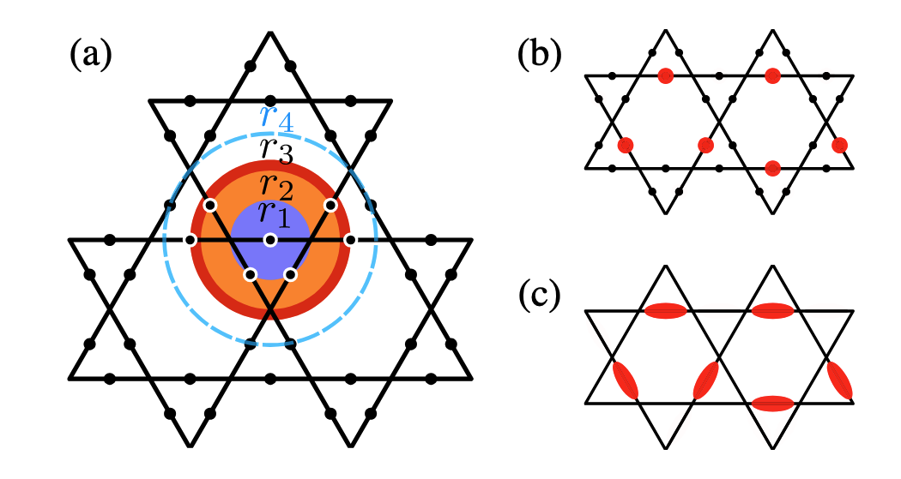
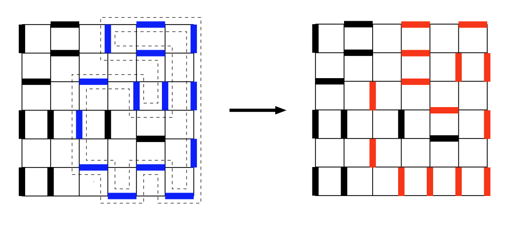

# Overview

Neutral-atom arrays with Rydberg interactions form a versatile analog quantum simulation platform.
Refer to the [Rydberg Atom Properties](../rydberg_qc/rydberg_properties.qmd) notes for an introduction to Rydberg interactions, blockade physics, and the underlying atomic structure.
Two fundamental interaction regimes underpin nearly all models realized to date:

1. **Van der Waals regime** — atoms excited to the *same* Rydberg state repel with $V(R) = C_6/R^6$ ($C_6 \propto n^{11}$). The blockade mechanism forbids simultaneous excitation of nearby atoms, naturally encoding **Ising-type** constraints.

2. **Resonant dipole–dipole regime** — atoms prepared in *two different* Rydberg states undergo flip-flop exchange $|rs\rangle \leftrightarrow |sr\rangle$ with strength $V(R) = C_3/R^3$ ($C_3 \propto n^4$). This directly realizes **XY and XXZ-type** spin exchange.

A third route, **Rydberg dressing**, uses off-resonant coupling to Rydberg states to imprint soft-core interactions on ground-state atoms in optical lattices, enabling extended Hubbard physics.

The catalog below is organized by physics theme; a [summary table](#sec-mechanism-table) at the end classifies every model by interaction mechanism.

---

# Preliminaries

#### Effective Hamiltonian (Schrieffer–Wolff)

Perturbative block-diagonalization that derives low-energy effective Hamiltonians from the full Rydberg Hamiltonian. All models below ultimately rest on this framework. See the [detailed notes](Effective_ham.qmd).

#### Rydberg Atom Platform

For the physical layer — atomic properties, laser systems, trapping, gate protocols, and noise analysis — see the [Rydberg Atoms for Fault-Tolerant QC](../rydberg_qc/index.qmd) topic.

---

# Spin Models {#sec-spin}

## Transverse-Field Ising Model (TFIM) {#sec-tfim}
$$
H = \frac{\Omega}{2}\sum_i \sigma^x_i - \Delta \sum_i n_i + \sum_{i<j} \frac{C_6}{R_{ij}^6}\, n_i n_j
$$ {#eq-tfim}
where $n_i = |r_i\rangle\langle r_i|$, $\Omega$ is the Rabi frequency, and $\Delta$ the laser detuning.
Ground $|g\rangle$ and Rydberg $|r\rangle$ states encode pseudo-spin-$1/2$.
Van der Waals repulsion provides the Ising $ZZ$ coupling; global laser driving provides the transverse field.
By tuning $\Delta/\Omega$ and the ratio of blockade radius to lattice spacing in the TFIM Hamiltonian (@eq-tfim), a cascade of commensurate ordered phases ($Z_2$, $Z_3$, $Z_4$, star, striped) appears, forming a devil's staircase.
See the [detailed notes](TFIM.qmd) and [detailed notes](density_wave.qmd) for more details.

- Realized on 1D chains [@bernien2017probing], 2D square, triangular, honeycomb, and kagome lattices [@ebadi2021quantum; @scholl2021quantum] up to 256 atoms.
- The largest demonstration probed density-wave order across 256 atoms on square, triangular, and kagome geometries [@ebadi2021quantum].
- Quantum Kibble–Zurek dynamics across the $Z_2$ transition were probed in 1D chains [@keesling2019quantum].
- Between commensurate phases, a quantum **floating phase** with incommensurate quasi-long-range order was observed on ladder arrays [@chen2025floating].
- A key open problem is quantitatively characterizing the incommensurate floating-phase boundaries and extracting critical exponents in 2D.
- The next milestone is resolving higher-order commensurate phases ($Z_5$ and beyond) and mapping the full devil's staircase in programmable arrays.

## PXP Model / Quantum Many-Body Scars {#sec-pxp}
$$
H_{\text{PXP}} = \frac{\Omega}{2}\sum_i P_{i-1}\,\sigma^x_i\, P_{i+1}
$$ {#eq-pxp}
where $P_i = |g_i\rangle\langle g_i|$ projects onto ground states, enforcing $\sigma^x_i$ can effact if and only if site $i-1$ and $i+1$ are both in the ground state, which is the strong-blockade limit of the TFIM. See the [detailed notes](dynamics.qmd) for more details.

- Starting from the Néel state $|Z_2\rangle = |rgrg\cdots\rangle$, anomalous revivals signal **quantum many-body scars** (QMBS) — non-thermal eigenstates in an otherwise ergodic spectrum [@bernien2017probing]. refer to the [detailed notes](/theory/Posts/ETH/index.html) for more details.
- Controlled scar dynamics and subharmonic response were demonstrated by periodic driving [@bluvstein2021controlling].
- The largest QMBS observation used 256 atoms on the QuEra Aquila processor, where position-noise-induced emergent disorder was found to compete with scar revivals [@maskara2025emergent].
- A key open problem is understanding the stability and structure of scar towers in 2D geometries beyond the PXP chain.
- The next experimental milestone is programmable engineering of scar subspaces to protect targeted quantum states from thermalization.

## Dipolar XY Model {#sec-xy}

$$
H_{\text{XXZ}} = \sum_{i<j} J_{ij}\!\left[\frac{1}{2}(S_i^+ S_j^- + S_i^- S_j^+) + \Delta_{\text{anis}}\, S_i^z S_j^z\right]
$$ {#eq-xxz}

Two Rydberg states (e.g.\ $|nS\rangle$, $|nP\rangle$) connected by dipolar transitions encode spin-$\tfrac12$.
The resonant dipole–dipole flip-flop directly realizes the XY exchange with long-range $1/r^3$ couplings.
Anisotropy term $\Delta_{\text{anis}}$ interpolates from the XY limit ($\Delta_{\text{anis}}=0$) through the isotropic Heisenberg point ($\Delta_{\text{anis}}=1$) to the Ising limit. See the [detailed notes](XY_XXZ.qmd) for more details.

**Spin Squeezing**

- Spectroscopy of spin-wave excitations confirmed the ferromagnetic dispersion relation [@chen2025spectroscopy].
- The largest dipolar XY system demonstrated scalable spin squeezing with ${\sim}200$ atoms, reaching $-3.5$ dB metrological gain ($-3.5$ dB below the standard quantum limit) via quench dynamics in $\sim\!200$-atom arrays [@bornet2023scalable].
- A central open problem is pushing the squeezing to the Heisenberg limit and understanding how long-range $1/r^3$ correlations modify entanglement scaling.

**Isotropic Heisenberg Point**

- Achieved by microwave engineering of resonant dipole–dipole interactions [@scholl2022microwave] or Rydberg dressing to add Ising coupling atop native XY exchange [@chen2024anisotropic].
- The most extreme anisotropy demonstrated so far spans the full range from XY to deep Ising limits in arrays of ${\sim}100$ dipolar Rydberg atoms [@chen2024anisotropic].
- The next milestone is mapping the full XXZ phase diagram — including spiral and valence-bond-solid phases — on frustrated 2D lattices
- A key open problem is accessing the isotropic Heisenberg point ($\Delta_{\text{anis}}=1$) at scale, where quantum fluctuations are strongest and classical simulation hardest.

---

# Hubbard Models {#sec-hubbard}

## Fermi-Hubbard Model {#sec-fhm}

Strong-coupling regime mapped to the Rydberg platform via slave-spin decomposition and mean-field decoupling.
See the [detailed notes](ferm_Hubbard.qmd).
$$
\begin{align*}
H = \sum_{\sigma=\{\uparrow,\downarrow\},i} t(c^\dagger_{\sigma,i}c_{\sigma,i+1} + c^\dagger_{\sigma,i+1}c_{\sigma,i}) + \sum_i Un_{i,\uparrow}n_{i,\downarrow} + V_1 \sum_{\langle i,j\rangle} \hat{n}_i \hat{n}_j,
\end{align*}
$$

- The hybrid classical-quantum slave-spin approach was demonstrated on the PASQAL Orion Alpha processor for a 2D Fermi-Hubbard model [@juliaFarre2025hybrid]. A key open problem is reaching system sizes where the analog Rydberg Ising solver outperforms classical mean-field self-consistency.
- [@evered2025probing] Simulate the Fermi-Hubbard model using Floquet engineering of the Rydberg Hamiltonian.

## Bose-Hubbard Model {#sec-bhm}
The original Bose-Hubbard model is given by:
$$
H_{\text{eBH}} = -J\sum_{\langle i,j\rangle} a_i^\dagger a_j + \frac{U}{2}\sum_i n_i(n_i - 1) + V\sum_{\langle i,j\rangle} n_i n_j
$$
Under the approximation $U \gg J$, and each site are half-filling, the model can be reduced to a two-component hard-core bosons with $t$-$J$ derivation. See the [detailed notes](Boson-Hubbard.qmd).
$$
\begin{align*}
\hat{H}_{tJ}^{(B)} &= \hat{H}_t + \hat{H}_J + \hat{H}_V \\
\hat{H}_t &= -t\sum_{\langle i,j\rangle,\sigma}\left(\hat{a}_{i,\sigma}^\dagger \hat{a}_{j,h}^\dagger \hat{a}_{i,h}\hat{a}_{j,\sigma} + \text{h.c.}\right) \\
\hat{H}_J &= J_z \sum_{\langle i,j\rangle} \hat{S}_i^z\hat{S}_j^z + \frac{J_\perp}{2}\sum_{\langle i,j\rangle}\left(\hat{S}_i^+\hat{S}_j^- + \text{h.c.}\right) \\
\hat{H}_V &= V\sum_{\langle i,j\rangle}\hat{n}_i^h\hat{n}_j^h,
\end{align*}
$$

- The Princeton experiment demonstrated the extended Bose-Hubbard model with controlled nearest-neighbor interactions using $^{87}$Rb atoms in an optical lattice [@guardado2024rydberg].
- The bosonic $t$-$J$-$V$ model has been realized with $^{87}$Sr Rydberg atoms in tweezer arrays, demonstrating antiferromagnetic correlations and dopant dynamics [@qiao2025doped].
- A key open problem is observing bosonic analogs of $d$-wave pairing correlations and distinguishing them from the fermionic case.

---

# Quantum Chemistry {#sec-chem}

## pUCCD (Paired Unitary Coupled-Cluster Doubles) {#sec-puccd}

Zero-seniority quantum chemistry ansatz implemented via Matsubara–Matsuda transformation, imaginary time evolution, and neutral-atom coherent transport. See the [detailed notes](puccd.qmd).
$$
\begin{align*}
\hat{H}_{qb} &= C +  \sum_{p} \frac{h^{(r1)}_{p}}{2} (\hat{I}_p - \hat{Z}_p)  +  \sum_{p \neq q} \frac{h^{(r1)}_{p,q}}{4} (\hat{X}_p \hat{X}_q + \hat{Y}_p \hat{Y}_q) \\
& +  \sum_{p \neq q} \frac{h^{(r2)}_{p,q}}{4} (\hat{I}_p - \hat{Z}_p - \hat{Z}_q + \hat{Z}_p \hat{Z}_q),
\end{align*}
$$

- The pUCCD-on-atoms proposal exploits coherent atom transport to achieve $\mathcal{O}(N)$ circuit depth, with transport dephasing subdominant to two-qubit gate errors on current hardware [@bluvstein2022quantum; @evered2023high].
- A key open problem is demonstrating chemical accuracy for a non-trivial molecular system using the neutral-atom pUCCD protocol.
- The next milestone is an experimental benchmark comparing pUCCD energy estimates against exact values for small molecules ($\mathrm{H}_2$, $\mathrm{LiH}$) on a Rydberg tweezer array.

---

# Topological Phases {#sec-topo}

## Honeycomb / Kitaev Model {#sec-honeycomb}

Effective Hamiltonian under magnetic perturbation on the honeycomb lattice, yielding Majorana fermion equivalence, gauge fixing, and non-trivial Chern number.
See the [detailed notes](honeycomb.qmd).

$$
\begin{align}
    H_0 &= -J_x \sum_{(j,k)\mathrm{~is~}x\text{-links}} \sigma_j^x \sigma_k^x - J_y \sum_{(j,k)\mathrm{~is~}y\text{-links}} \sigma_j^y \sigma_k^y - J_z \sum_{(j,k)\mathrm{~is~}z\text{-links}} \sigma_j^z \sigma_k^z, \\
    V &= \frac{1}{2}\left(h_x \sigma^x_j + h_y \sigma^y_j + h_z \sigma^z_j\right).
\end{align}
$$

- Digital simulation of the Kitaev model on 104 qubits (72 data + 32 ancilla) with periodic boundary conditions has been demonstrated on a neutral-atom quantum computer [@evered2025probing].
- A key open problem for the analog route is realizing bond-dependent Kitaev interactions without Floquet engineering, directly from native Rydberg couplings.
- The next milestone is experimentally probing non-Abelian anyon statistics in either the digital or analog setting.

## Quantum Spin Liquid / Toric Code ($\mathbb{Z}_2$ Topological Order) {#sec-qsl}

Atoms on the **ruby lattice** (links of a kagome) at the blockade radius encompassing six nearest neighbors. See the [detailed notes](topological.qmd) for more details.
The blockade constraint maps onto a quantum dimer model on kagome; Rabi oscillations generate quantum fluctuations of dimers, stabilizing $\mathbb{Z}_2$ topological order described by the toric code Hamiltonian
$$
H_{\text{TC}} = -\sum_v A_v - \sum_p B_p.
$$ {#eq-toric}

- Signatures of the spin-liquid phase — including topological string operators — were detected on a 219-atom simulator [@semeghini2021probing; @verresen2021prediction]. This 219-atom ruby-lattice experiment remains the largest system in which signatures of $\mathbb{Z}_2$ topological order have been observed on a programmable quantum device.
- A key open problem is unambiguously measuring topological entanglement entropy and confirming long-range entanglement beyond string-operator diagnostics.
- The next milestone is braiding $e$ and $m$ anyons and detecting the resulting non-trivial exchange statistics in a controlled setting.

## Bosonic SSH {#sec-spt}
$$
H_{\text{SSH}} = \sum_n \bigl(J_1\, c_{A,n}^\dagger c_{B,n} + J_2\, c_{B,n}^\dagger c_{A,n+1} + \text{h.c.}\bigr)
$$ 
Atoms in tweezers with **alternating interatomic spacings** realize a bosonic SSH model with alternating strong/weak dipolar hoppings. 
The hard-core constraint arises from Rydberg blockade.
The original demonstration used chains of ${\sim}14$ Rydberg atoms with dipolar flip-flop interactions and alternating spacings.

- Observation of robust ground-state degeneracy attributed to protected edge states confirmed an SPT phase of interacting bosons [@deleseleuc2019observation].
- A key open problem is scaling to longer chains where the bulk gap can be cleanly separated from finite-size effects and measuring the entanglement spectrum.
- The next milestone is demonstrating robustness of the SPT phase under controlled symmetry-breaking perturbations in programmable arrays.
See the [detailed notes](topological.qmd).

## Haldane Phase (Spin-1 Chain) {#sec-haldane}

Three Rydberg states near a Förster resonance encode effective spin-1.
Dipole–dipole and van der Waals interactions combine to produce a tunable spin-1 Heisenberg chain
$$
H_{\text{Haldane}} = J\sum_i \mathbf{S}_i \cdot \mathbf{S}_{i+1} + D\sum_i (S_i^z)^2 + \frac{1}{4}\sum_{i<j} \frac{C_6}{R_{ij}^6}\, (S_i^+)^2 (S_j^-)^2 + (S_i^z S_j^z-1) S_i^z S_j^z
$$
with a highly robust Haldane phase featuring fractionalized edge states.
See the [detailed notes](topological.qmd).

- An efficient adiabatic preparation scheme was proposed for current platforms [@fromonteil2025haldane], by identifing a feasible three-level Förster-resonance scheme for near-term platforms. But the Haldane phase has not yet been experimentally realized in a Rydberg array; 
- The key open problem is achieving the required three-body Rydberg-level control with sufficient coherence to resolve fractionalized edge modes and adiabatic preparation and spectroscopic detection of the string order parameter that distinguishes the Haldane phase from a trivial paramagnet.

---

# Lattice Gauge Theories {#sec-lgt}

## U(1) Lattice Gauge Theory / Schwinger Model {#sec-u1}
Many Lattice gauge theories can be realized on Rydberg arrays, such as the U(1) Lattice Gauge Theory / Schwinger Model and the $\mathbb{Z}_2$ Lattice Gauge Theory.
See the [detailed notes](LGT.qmd).

$$
\begin{align*}
H_{\text{Schwinger}} = w\sum_n \bigl(\sigma_n^+ U_n \sigma_{n+1}^- + \text{h.c.}\bigr) + \frac{m}{2}\sum_n (-1)^n \sigma_n^z + \frac{g^2}{2}\sum_n L_n^2,\\
H_{\mathbb{Z}_2} = -h\sum_{\ell} \tau^x_\ell - K\sum_\square \prod_{\ell \in \square} \tau^z_\ell - t\sum_{\langle i,j\rangle} \phi_i^\dagger \tau^z_{ij} \phi_j + m\sum_i (-1)^i \phi_i^\dagger \phi_i.
\end{align*}
$$ 

- In 1D, the PXP-type blockade constraint naturally enforces **Gauss's law**; domain-wall propagation maps onto charged-particle dynamics, and string-like excitations represent the electric flux tube [@surace2020lattice].
- On a 2D kagome geometry, local U(1) symmetry emerges from blockade. And the dynamical creation of particle–antiparticle pairs that screen a confining string — was observed on a $(2+1)$D Rydberg simulator [@observation2025string].
- Floquet-driven Rydberg arrays in tweezer ladders provide a scalable route to $(2+1)$D $\mathbb{Z}_2$ confinement [@homeier2023z2; @geier2023floquet].

## Quantum Dimer Models {#sec-dimer}

As intoduced in paper [@moessner2008quantumdimermodels], the quantum dimer models are superpositions of states that one edges are excited or not. For example, the Rokhsar–Kivelson Hamiltonian is a quantum dimer model on a square lattice.
$$
H_{\text{RK}} = -t\sum_\square \bigl(|{=}\rangle\langle{\|}\rangle + \text{h.c.}\bigr) + V\sum_\square \bigl(|{=}\rangle\langle{=}| + |{\|}\rangle\langle{\|}|\bigr)
$$
See the [detailed notes](LGT.qmd).

- It was recently proposed that the quantum dimer models can be realized on square and triangular geometries using Rydberg gadgets (auxiliary atoms that transform blockade into general constraints), with signatures of quantum spin-liquid states [@samajdar2020quantum; @dimer2025gadgets].
- The Rydberg-gadget approach is currently at the proposal/numerical stage; experimental demonstration of the auxiliary-atom construction has not yet been reported.

---

# Dynamical Phenomena {#sec-dynamics}

## Discrete Time Crystals {#sec-dtc}

Periodically driven (Floquet) Rydberg systems exhibiting subharmonic response: the system oscillates at a fraction of the drive frequency, breaking discrete time-translation symmetry.
Stabilized by quantum many-body scars in driven 1D arrays [@bluvstein2021controlling].
Higher-order and fractional discrete time crystals ($n$-DTCs with $n = 2, 3, \ldots, 14$) observed using cesium atoms with an EIT scheme and pulsed RF driving [@kongkhambut2024higher].
The cesium EIT experiment demonstrated the richest hierarchy of DTCs to date, with periods up to $n=14$ times the drive period.
A key open problem is establishing the thermodynamic stability of $n$-DTCs and understanding the role of dissipation versus many-body interactions in their protection.
The next milestone is realizing 2D discrete time crystals and probing their spatiotemporal order with site-resolved imaging.
See the [detailed notes](dynamics.qmd).

## Quantum Coarsening / Higgs Mode {#sec-coarsening}

After crossing the Ising quantum critical point, antiferromagnetically ordered domains coarsen driven by domain-boundary curvature, with dynamics accelerating near criticality.
Long-lived oscillations of the order parameter were identified as an **amplitude (Higgs) mode** [@bluvstein2025quantum].
The coarsening experiment used ${\sim}200$ atoms on a 2D square lattice, providing the first observation of a quantum Higgs mode in a programmable simulator.
A key open problem is measuring the universal coarsening exponent and comparing it to the classical Allen–Cahn prediction in the quantum regime.
The next milestone is probing coarsening dynamics across different universality classes by changing the lattice geometry.
See the [detailed notes](dynamics.qmd).

---

# Optimization and Other Models {#sec-other}

## Maximum Independent Set (MIS) {#sec-mis}

The blockade Hamiltonian is directly equivalent to the MIS problem on a unit-disk graph: find the maximum subset of vertices where no two are within the blockade radius.
Superlinear quantum speedup was observed on the hardest graph instances with up to 289 qubits [@ebadi2022quantum].
The 289-qubit MIS experiment is the largest combinatorial optimization demonstration on a Rydberg processor, with evidence of superlinear quantum speedup scaling on unit-disk graphs.
A key open problem is extending the speedup to non-unit-disk graph families and understanding the role of quantum tunneling versus thermal fluctuations in the observed advantage.
The next milestone is benchmarking Rydberg MIS solvers against state-of-the-art classical heuristics on industrially relevant graph instances.
See the [detailed notes](optimization.qmd).

## 3D Random Hopping / Anderson Localization {#sec-anderson}

A frozen Rydberg gas (random atom positions) realizes the XY model with disordered $1/r^3$ couplings.
Spectroscopic signatures of a localization–delocalization transition were observed [@lippe2021experimental].
The experiment used a frozen Rydberg gas with random atomic positions, providing natural positional disorder and $1/r^3$ dipolar couplings.
A key open problem is confirming the existence of a sharp mobility edge in 3D and measuring the critical exponent of the localization transition.
The next milestone is using programmable tweezer arrays to engineer controlled disorder landscapes and systematically tune through the localization transition.

## SSH via Rydberg Synthetic Dimensions {#sec-ssh-synthetic}

The SSH model with alternating hoppings realized in a synthetic dimension formed by Rydberg energy levels coupled by millimeter waves.
Topological edge states were demonstrated using ${}^{84}$Sr [@kanungo2022realizing].
The experiment used the Rydberg energy-level ladder of $^{84}$Sr coupled by millimeter waves to create a synthetic lattice dimension with alternating hoppings.
A key open problem is introducing interactions into the synthetic dimension to study interacting topological phases.
The next milestone is combining synthetic-dimension topology with spatial lattice degrees of freedom to realize higher-dimensional topological models.

---

# Interaction Mechanism Classification {#sec-mechanism-table}

| Model | Van der Waals | Dipole–Dipole | Rydberg Dressing | Floquet |
|:------|:---:|:---:|:---:|:---:|
| **TFIM** | $\checkmark$ | | | |
| **PXP / Scars** | $\checkmark$ | | | |
| **Density waves / Devil's staircase** | $\checkmark$ | | | |
| **Dipolar XY** | | $\checkmark$ | | |
| **XXZ Heisenberg** | | $\checkmark$ | | $\checkmark$ |
| **Quantum spin liquid / Toric code** | $\checkmark$ | | | |
| **SPT / Bosonic SSH** | | $\checkmark$ | | |
| **Haldane chain** | | $\checkmark$ | $\checkmark$ | |
| **U(1) LGT / Schwinger** | $\checkmark$ | | | |
| **$\mathbb{Z}_2$ LGT** | $\checkmark$ | | | $\checkmark$ |
| **Quantum dimer models** | $\checkmark$ | | | |
| **Fermi-Hubbard** | | $\checkmark$ | | |
| **Bose-Hubbard** | | $\checkmark$ | | |
| **Extended Bose-Hubbard** | | | $\checkmark$ | |
| **$t$-$J$-$V$** | | $\checkmark$ | | |
| **Honeycomb / Kitaev** | | $\checkmark$ | | |
| **Discrete time crystals** | $\checkmark$ | | | $\checkmark$ |
| **Coarsening / Higgs** | $\checkmark$ | | | |
| **MIS optimization** | $\checkmark$ | | | |
| **Random hopping / Anderson** | | $\checkmark$ | | |
| **SSH (synthetic dim.)** | | $\checkmark$ | | |

---

# Research Groups {#sec-groups}

| Group | Location | Species | Max $N$ | Key analog results |
|:------|:---------|:--------|--------:|:-------------------|
| Lukin | Harvard | $^{87}$Rb | 289 | TFIM QPT, QSL/toric code, MIS speedup, scars, coarsening/Higgs, string breaking [@bernien2017probing; @ebadi2021quantum; @semeghini2021probing; @ebadi2022quantum; @bluvstein2025quantum; @observation2025string] |
| Browaeys / Lahaye | IOGS, Palaiseau | $^{87}$Rb | ~200 | 2D Ising AF, XY spin squeezing, XXZ engineering, SPT, floating phase, $t$-$J$-$V$ (w/ MPQ) [@scholl2021quantum; @bornet2023scalable; @scholl2022microwave; @deleseleuc2019observation; @chen2025floating; @qiao2025doped] |
| Bloch / Gross / Zeiher | MPQ, Munich | $^{87}$Rb, $^{87}$Sr | ~20 | Rydberg-dressed Ising, 3D Anderson localization, bosonic $t$-$J$-$V$, doped antiferromagnet (w/ Palaiseau) [@zeiher2017coherent; @lippe2021experimental; @qiao2025doped] |
| Ahn | KAIST | $^{87}$Rb | ~20 | 3D tweezer arrays, Cayley-tree Ising, Platonic-graph MIS [@song2021quantum; @kim2022finding] |
| Bakr | Princeton | $^{6}$Li, $^{87}$Rb | 200+ | 2D Ising quench dynamics ($^{6}$Li lattice), extended Bose-Hubbard via Rydberg dressing [@guardadosanchez2018probing; @guardado2024rydberg] |
| Lin Li | HUST | $^{87}$Rb | ~20 | OTOC measurement, anomalous information scrambling [@chen2024collapse; @zhang2025anomalous] |
| QuEra | Boston | $^{87}$Rb | 256 | Cloud-accessible Aquila processor, emergent disorder in TFIM [@maskara2025emergent] |
| PASQAL | Massy | $^{87}$Rb | -- | Orion Alpha, hybrid Fermi-Hubbard slave-spin simulation [@juliaFarre2025hybrid] |

---

# Experiment Timeline {#sec-timeline}

Chronological listing of analog Rydberg quantum simulation experiments referenced in this review.

| Year | Group | $N$ | Model | Key result | Ref |
|:-----|:------|----:|:------|:-----------|:----|
| 2017 | Lukin | 51 | TFIM | First large-scale Rydberg simulator; many-body scars discovered | [@bernien2017probing] |
| 2017 | Bloch/Zeiher | ~20 | TFIM (dressed) | Coherent Rydberg-dressed Ising dynamics | [@zeiher2017coherent] |
| 2018 | Browaeys | 36 | TFIM | Correlation growth, Lieb–Robinson dynamics | [@lienhard2018observing] |
| 2018 | Bakr | 200+ | TFIM | 2D Ising quench dynamics ($^{6}$Li optical lattice) | [@guardadosanchez2018probing] |
| 2019 | Lukin | 51 | TFIM | Quantum Kibble–Zurek mechanism, critical exponents | [@keesling2019quantum] |
| 2019 | Lukin | 20 | TFIM | GHZ / Schrödinger cat states via optimal control | [@omran2019generation] |
| 2019 | Browaeys | ~14 | SPT / SSH | Symmetry-protected topological phase of interacting bosons | [@deleseleuc2019observation] |
| 2021 | Lukin | ~25 | PXP | Floquet-stabilized scars, subharmonic DTC | [@bluvstein2021controlling] |
| 2021 | Lukin | 256 | TFIM / density wave | 2D quantum phases on square, triangular, honeycomb, kagome | [@ebadi2021quantum] |
| 2021 | Lukin | 219 | QSL / toric code | First QSL signatures on a programmable simulator | [@semeghini2021probing] |
| 2021 | Browaeys | 196 | TFIM | 2D AF order on square and triangular lattices | [@scholl2021quantum] |
| 2021 | Ahn | ~20 | TFIM | 3D Cayley-tree Ising Hamiltonian | [@song2021quantum] |
| 2021 | Gross | -- | Anderson | 3D random hopping, localization–delocalization transition | [@lippe2021experimental] |
| 2022 | Lukin | 289 | MIS | Quantum optimization with superlinear speedup | [@ebadi2022quantum] |
| 2022 | Ahn | ~20 | MIS | MIS on all five Platonic graphs in 3D | [@kim2022finding] |
| 2022 | Browaeys | -- | XXZ | Microwave-engineered programmable XXZ Hamiltonians | [@scholl2022microwave] |
| 2022 | Kanungo/Killian | -- | SSH (synth. dim.) | Topological edge states in Rydberg synthetic dimension ($^{84}$Sr) | [@kanungo2022realizing] |
| 2023 | Browaeys | ~200 | XY | Scalable spin squeezing ($-3.5$ dB) via dipolar quench | [@bornet2023scalable] |
| 2023 | Geier/Browaeys | 10 | Floquet XXZ | Floquet-engineered spin exchange on honeycomb plaquettes | [@geier2023floquet] |
| 2024 | Browaeys | -- | XXZ | Full XY-to-Ising anisotropy in dipolar arrays | [@chen2024anisotropic] |
| 2024 | Bakr | -- | eBH | Rydberg-dressed extended Bose-Hubbard in optical lattice | [@guardado2024rydberg] |
| 2024 | Kongkhambut | -- | DTC | Higher-order DTCs up to $n=14$ (Cs, EIT) | [@kongkhambut2024higher] |
| 2024 | Lin Li | ~20 | PXP | OTOC measurement, quantum info collapse-and-revival | [@chen2024collapse] |
| 2025 | Browaeys | -- | XY | Spin-wave spectroscopy, ferromagnetic dispersion | [@chen2025spectroscopy] |
| 2025 | Browaeys/Lukin | -- | Density wave | Quantum floating phase on ladder arrays | [@chen2025floating] |
| 2025 | Lukin | ~200 | Coarsening | Quantum coarsening, Higgs mode after Ising QPT | [@bluvstein2025quantum] |
| 2025 | Lukin | -- | U(1) LGT | String breaking in $(2+1)$D Rydberg simulator | [@observation2025string] |
| 2025 | Lin Li | ~20 | PXP | Anomalous information scrambling, scar-induced periodicity | [@zhang2025anomalous] |
| 2025 | QuEra | 256 | TFIM / PXP | Emergent disorder from position noise, sub-ballistic dynamics | [@maskara2025emergent] |
| 2025 | Gross/Browaeys | -- | $t$-$J$-$V$ | Doped quantum antiferromagnet, bound hole pairs ($^{87}$Sr) | [@qiao2025doped] |
| 2025 | PASQAL/Browaeys | -- | Fermi-Hubbard | Hybrid slave-spin analog simulation on Orion Alpha | [@juliaFarre2025hybrid] |

::: {#refs}
:::
