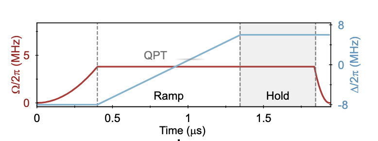

---
categories:
- Readings
date: 2026-03-18
description: 'quantum coarsening dynamics and Higgs mode observation on a 2D Rydberg array'
lang: en
title: 'Quantum Coarsening and Higgs Mode'
bibliography: refs.bib
draft: true
---

# Summary and Questions

This notes mainly follows this paper [@manovitz2025coarsening].
It is one of the 1-zone analog of Harvard lab.

## What was done

A 2D Rydberg array is driven across the (2+1)D Ising quantum phase transition to study collective dynamics of the ordered phase.

:::{.callout-tip icon="false"}
## Experimental protocol

1. **State preparation:** Adiabatic sweep from the disordered phase ($\Delta \ll 0$) to the antiferromagnetically ordered regime ($\Delta \gg 0$) on a **16×16 square lattice of 256 atoms** with blockade radius $R_b/a \approx 1.12$–$1.15$ (nearest-neighbor blockade only). Dimensionless sweep rate: $\Delta/(\Omega^2 T) \approx 3.0/(2\pi)$, where $\Delta$ is the total detuning range and $T$ is the sweep duration (i.e., the detuning changes by $\sim 3\,\Omega$ per Rabi period). Local light shifts $|\delta_i| \sim 4\Omega$ (**absolute magnitude 12(2) MHz**) from a 784 nm second SLM ($\sim$35 Hz scattering rate) pin boundary sites to the correct sublattice. Ground-state preparation fidelity on pinned sites: **93–95%** (limited by antiblockade effects at domain boundaries).
2. **Post-selection:** Shots with $>4$ defects are discarded ($\sim$93% retained); shots where the longest consecutive $|r\rangle$ chain in any single row or column exceeds 4 sites are also discarded ($\sim$92% retained). Combined with rearrangement filtering: **86% retention** at short hold times, dropping to **63%** at $t = 1.16\ \mu$s ($\Delta/\Omega = 4$) due to Rydberg-state decay.
3. **Quench dynamics:** Sudden quench deep into the ordered phase, then monitoring time evolution of the spatially resolved order parameter.
4. **Domain tracking:** Individual antiferromagnetic domains identified and tracked in real time from single-shot fluorescence images.
5. **Multi-spacing protocol:** Three different lattice spacings $a = 6.45, 6.8, 7.15$ μm with corresponding Rabi frequencies $\Omega/2\pi = 6.0, 3.8, 3.1$ MHz to access different points in the phase diagram.
:::

The experiment implement the time-depending Hamiltonian:
$$
H/\hbar = \Omega(t)/2 \sum_i \sigma_i^x - \sum_i n_i (\Delta(t) + \delta_i(t)) + \sum_{i<j} V_{ij} n_i n_j
$$
The parameter $\Omega(t)$ and $\Delta(t)$ change according to diagram below:

#### Measureing local phase order and correlation length
Given the observation result $n_{x,y} = 1,0$ at $(x, y)$ for $\ket{r}$ and $\ket{g}$ respectively, the order parameter is $m_s = \sum_{x,y} (-1)^{x+y} n_{x,y}$.
Consider hte coarsening matrix generated by
$$
\begin{align*}
C_{x,y} = (n * W)_{x,y} &= \sum_{i=-1}^{1} \sum_{j=-1}^{1} W_{i,j} n_{x+i, y+j}\\
& = n_{x, y-1} + n_{x-1, y} + n_{x+1, y} + n_{x, y+1} \in $\{0, 1, 2, 3, 4\}$
\end{align*}
$$
where $W_{i,j}$ is the 3x3 convolution kernel
$$
W = \begin{pmatrix} 0 & 1 & 0 \\ 1 & 0 & 1 \\ 0 & 1 & 0 \end{pmatrix}
$$

Thus the strict logic condition for filtering in the experiment is:

- Bulk (ordered domain): $(n_{x,y} = 1 \land C_{x,y} = 0)$(AF1) or $(n_{x,y} = 0 \land C_{x,y} = 4)$(AF2)
- Domain Wall (boundary): $(n_{x,y} = 1 \land C_{x,y} \neq 0)$ or $(n_{x,y} = 0 \land C_{x,y} \neq 4)$

Before the extraction of $C_{x,y}$, we need to correct the single-spin-flip errors following the procedure below:

1. Caculate $C_{x,y}^{\text{NNN}} = n_{x-1, y-1} + n_{x+1, y-1} + n_{x-1, y+1} + n_{x+1, y+1}$ and $C_{x,y}^{\text{NN}} = n_{x, y-1} + n_{x-1, y} + n_{x+1, y} + n_{x, y+1}$
2. If $n_{x,y} = 0 $ and $ C^{\text{NN}} = 0 $ and $ C^{\text{NNN}} = 4$, reset $n_{x,y}$ to 1.
3. If $n_{x,y} = 1 $ and $ C^{\text{NN}} = 4 $ and $ C^{\text{NNN}} = 0$, reset $n_{x,y}$ to 0.
4. Repeat the process for all positions $(x, y)$ in the lattice.

Besides the local phase order, the experiment also monitors the evolution of correlation length $\xi(t)$. 

:::{#lem-correlation-length .callout-note icon="false"}
The radius Fourier transformation of $(1+\xi^2 k^2)^{-3/2}$ gives $e^{-r/\xi}$.
:::

:::{.callout-note collapse="true"}
# Proof (Click to expand)
[todo: refine the calculation and the lemma statement]
In radius space, $$S(k) = 2\pi A \int_0^\infty r e^{-r/\xi} J_0(kr) dr$$
The equation $$\int_0^\infty e^{-ar} J_0(kr) dr = \frac{1}{\sqrt{a^2+k^2}}$$ gives that $$\int_0^\infty r e^{-ar} J_0(kr) dr = \frac{a}{(a^2+k^2)^{\frac{3}{2}}}$$ Plug in we get $$S(k) = \frac{2\pi A \xi^2}{(1 + \xi^2 k^2)^{\frac{3}{2}}}$$
:::

So the experiment choose to measured $G(\textbf{r}_1,\textbf{r}_2) = \braket{\tilde{Z}_{\textbf{r}_1}\tilde{Z}_{\textbf{r}_2}}-\braket{\tilde{Z}_{\textbf{r}_1}}\braket{\tilde{Z}_{\textbf{r}_2}}$ and then implement the Fourier transformation to get $S(k)$.

## Key observations

- **Curvature-driven coarsening:** After the quench, antiferromagnetically ordered domains form and evolve via curvature-driven coarsening — domain walls shrink under their own curvature, a quantum analog of the classical Allen-Cahn process. The characteristic domain size grows as $L(t) \propto t^{1/2}$.
- **Higgs (amplitude) mode:** Long-lived oscillations of the staggered magnetization (order parameter) are observed, identified as the Higgs mode. In a spontaneously broken symmetry phase, collective excitations come in two flavors: Goldstone modes (phase/angular fluctuations of the order parameter, massless) and the Higgs mode (amplitude fluctuations of the order parameter magnitude about its equilibrium value, massive). The name comes from the direct analogy to the Higgs mechanism in particle physics — the Higgs boson is the amplitude mode of the electroweak symmetry-breaking field. In this experiment, the "amplitude" is the staggered magnetization strength, which oscillates coherently after the quench. The Higgs frequency scales with the gap $\Delta_H \propto |\Delta - \Delta_c|^{z\nu}$, where the (2+1)D Ising critical exponents are $\nu \approx 0.629$ and $z = 1$ (used throughout the paper's scaling analysis).
- **Critical acceleration:** Coarsening dynamics accelerate as the system approaches the quantum critical point, consistent with critical slowing down operating in reverse (faster dynamics near criticality due to smaller energy gaps and enhanced quantum fluctuations).
- **Quantitative agreement with theory:** Domain size $\xi^2(t)$ grows linearly in time (consistent with $z_d = 2$, Allen-Cahn universality), measured over hold times up to ${\sim}0.4$–$0.5$ μs. The Higgs frequency ratio satisfies $\omega(-|\mathbf{q}|)/\omega(|\mathbf{q}|) > \sqrt{2}$, consistent with predictions for the (2+1)D Ising CFT; more precise calculations for the (2+1)D Ising CFT give $\approx 1.9$, exceeding the mean-field $\sqrt{2}$. The paper confirms consistency with $> \sqrt{2}$ but does not tabulate a specific measured ratio — the comparison is graphical (Fig. 5). Residual theory-experiment deviations are attributed primarily to **finite-size effects** (the 16×16 lattice truncates long-wavelength domain growth) and $\Delta/\Omega$-dependent domain-wall width, not to thermal position disorder.

## Scientific significance

**Hardware upgrade** The [Ebadi 2021 baseline](/Experiments/posts/1zone2021Ebadi_256atom/index.html) uses a single SLM at 852 nm for static trap generation plus AODs for rearrangement. Manovitz 2025 adds a **second SLM at 784 nm** to apply site-resolved detuning offsets; this is the optical subsystem that implements the $12(2)\mathrm{MHz}$ boundary light shifts. Without this second SLM, per-site detuning control at the required 93–95% fidelity level is not possible with the AOD-only architecture.

**Comparison with review bottleneck estimates:** The review (Bottleneck 1) quotes $\delta V/V \approx 30\%$ at $R = 4\ \mu$m nearest-neighbor spacing. This experiment uses $a = 6.45$–$7.15\ \mu$m, where the larger spacing reduces the fractional interaction spread to $\sim 17$–$19\%$ (since $\delta V/V \propto \sigma_x/a \cdot 6$). The two figures are therefore consistent — the review's 30% is the worst-case compact-lattice regime; Manovitz 2025 operates in a more favorable regime by design to minimize disorder effects on coarsening dynamics. Neither experiment uses sub-Doppler cooling, so $\sigma_{x,y} \approx 0.2\ \mu$m is the shared baseline.

## Critical technique analysis

**Primary bottleneck: SLM field-of-view and trap uniformity at >256 sites.**

:::{.callout-important icon="false"}
## Bottleneck summary

The physics limitation is clear: the 16×16 lattice truncates domain growth after $\xi(t) \gtrsim L/4 \approx 4a$, limiting coarsening to less than one decade in $\xi$. The **engineering technique** that must be optimized to overcome this is **SLM-based trap generation at larger atom counts** (32×32 = 1024 or 64×64 = 4096 sites).

**Specific SLM engineering constraints:**

- **Pixel budget:** Current-generation SLMs (e.g., Hamamatsu X13138-02, 1920×1152 pixels) allocate $\sim$45 pixels per trap site for a 256-site array. Scaling to 1024 sites reduces this to $\sim$11 pixels/site, and 4096 sites to $\sim$3 pixels/site. Below $\sim$10 pixels/site, the phase-freedom per trap drops and diffraction efficiency degrades (typically from $>$80% to $<$50%), reducing available trap depth and uniformity.
- **Phase computation:** The iterative Gerchberg-Saxton algorithm used to compute SLM phase patterns scales as $O(N_{\rm pix} \log N_{\rm pix})$ per iteration. At 1920×1152 pixels and $\sim$50 iterations for 1–2% uniformity, this takes $\sim$1 s on a GPU for 256 sites. For 4096 sites the convergence typically requires 2–3× more iterations to maintain the same uniformity, but remains computationally tractable ($\sim$few seconds).
- **Second SLM (784 nm) power scaling:** Boundary pinning currently delivers $\sim$160 μW/spot to $\sim$64 boundary sites (perimeter of 16×16). A 64×64 array has $\sim$252 boundary sites (4× more), requiring either 4× the total 784 nm laser power or acceptance of weaker pinning shifts (reducing the 93–95% ground-state fidelity on boundary sites).
- **Rearrangement time:** AOD-based rearrangement scales roughly linearly with atom count ($\sim$50 ms for 256 atoms). For 1024+ atoms, parallelized rearrangement strategies (multiple AOD passes or SLM-based rearrangement) are needed to keep cycle times below the $\sim$1 s vacuum-limited trap lifetime.
:::

The paper itself attributes residual deviations from universal scaling to (1) **finite-size truncation** and (2) **$\Delta/\Omega$-dependent domain-wall width** — both are fundamental physics constraints, not engineering deficiencies.

**Why finite size dominates over other candidates:**

- *Boundary pinning via second-SLM light shifts* achieves 93–95% ground-state fidelity on pinned sites (limited by antiblockade effects at domain boundaries, where $|\delta_i| \sim 4\Omega = 12(2)$ MHz competes with interaction-induced antiblockade). This is a secondary preparation-quality concern — it affects initial domain purity but does not limit the observable scaling range.
- *Thermal position disorder* ($\delta V/V \sim 18\%$) is subdominant because the coarsening exponent $z_d = 2$ is robust to weak disorder.
- *Rydberg lifetime decay* causes shot retention to drop from 86% to 63% at the longest hold time ($t = 1.16\ \mu$s), but this is a post-selection cost rather than a systematic bias on the coarsening signal.
- *Domain-wall width* depends on $\Delta/\Omega$ and introduces a non-universal length scale causing deviations from sharp-wall Allen-Cahn theory, particularly at moderate detuning.

> **Distinction between platform bottleneck and experiment-specific bottleneck:**
> Thermal position disorder ($\sigma_{x,y} \approx 0.2$ μm, $\delta V/V \sim 18\%$) is a persistent platform limitation (Bottleneck 1 in the review) but is *not* the dominant factor in *this* experiment. The dominant limitation is the finite lattice size (16×16), which caps the observable coarsening range regardless of preparation quality.

For the three lattice spacings used (thermal disorder reference):

| Spacing $a$ | $\delta V / V$ (thermal) | Hold time measured |
|-------------|--------------------------|-------------------|
| 6.45 μm | $\sim 19\%$ | linear $\xi^2$ regime: ${\sim}0.4$–$0.5\ \mu$s; max explored: $1.16\ \mu$s |
| 6.80 μm | $\sim 18\%$ | linear $\xi^2$ regime: ${\sim}0.4$–$0.5\ \mu$s; max explored: $1.16\ \mu$s |
| 7.15 μm | $\sim 17\%$ | linear $\xi^2$ regime: ${\sim}0.4$–$0.5\ \mu$s; max explored: $1.16\ \mu$s |

**Paths to improvement specific to this experiment:**

1. **Larger lattice:** Scaling to 32×32 or 64×64 atoms would allow $\xi(t)$ to grow over 2–3 decades before hitting the boundary, decisively separating universal coarsening from finite-size artifacts.
2. **Narrower quench protocol:** Reducing $\Delta/\Omega$-dependent domain-wall width by quenching deeper into the ordered phase ($\Delta \gg \Omega$) sharpens the coarsening front and improves agreement with Allen-Cahn theory.
3. **Sub-Doppler cooling (platform):** Reducing $\sigma_x$ to $\sim 0.05$ μm would cut $\delta V/V$ to $\sim 4\%$, making disorder truly subdominant and allowing cleaner tests of Higgs mode frequency ratios.

## Completeness check

### Higgs mode frequency

The (2+1)D Ising universality class critical exponents used throughout the paper's scaling analysis are $\nu \approx 0.629$ and $z = 1$ (dynamical exponent). These are standard literature values, not measured in this experiment.

The Higgs (amplitude) mode frequency ratio measured in this experiment satisfies:
$$\frac{\omega(-|\mathbf{q}|)}{\omega(|\mathbf{q}|)} > \sqrt{2}$$
where $\omega(\pm|\mathbf{q}|)$ are the Higgs frequencies at opposite momenta. The mean-field prediction is exactly $\sqrt{2} \approx 1.41$; more advanced calculations for the (2+1)D Ising CFT predict $\approx 1.9$, and the experiment is consistent with this. No direct MHz-scale frequency values are quoted in the paper text or captions — the paper states frequencies "closely match the numerically determined ground-state gap" and shows the comparison graphically in Fig. 5d, but does not tabulate specific values. The observable is the ratio extracted from time-domain oscillations of the staggered magnetization. From the figure, oscillation periods appear to be on the order of 0.3–0.5 μs, implying $\omega_H/2\pi \sim 2$–$3$ MHz, but this cannot be confirmed without digitizing the figure.

### Coarsening exponent and deviations

The characteristic domain size $\xi(t)$ grows as $\xi^2 \propto t$, directly confirming $z_d = 2$ (Allen-Cahn, nonconserved order parameter). Deviations from the universal scaling amplitude $b(\xi)$ in the structure factor are attributed by the paper to:
1. **Finite-size truncation** (dominant): the 16×16 lattice ($L = 16a$) cuts off modes with $\lambda > L$.
2. **$\Delta/\Omega$-dependent domain-wall width**: thicker domain walls at smaller detuning slow down curvature-driven dynamics relative to sharp-wall Allen-Cahn theory.

No explicit percentage deviation is quoted in the paper.

### Kibble-Zurek connection

The Kibble-Zurek mechanism [@keesling2019kibble] predicts that defect density after a ramp through a quantum phase transition scales as $n_{\rm def} \sim \tau_Q^{-\nu/(1+z\nu)}$ for ramp time $\tau_Q$. Coarsening is the *post-quench* dynamics that follows Kibble-Zurek defect formation: the initial domain configuration set by Kibble-Zurek then evolves under the Allen-Cahn $L \propto t^{1/2}$ law. The experiments use an adiabatic ramp (not a fast quench), so Kibble-Zurek defect formation is minimized during preparation; the quench is then applied to a high-fidelity ordered state to study clean coarsening dynamics.

### Parameters not quoted in this paper

The following parameters are **not stated** in [@manovitz2025coarsening] but are relevant context from the platform baseline:

- **Rydberg state lifetime ($70S_{1/2}$):** Not quoted. The calculated radiative lifetime is $\sim 150\ \mu$s; the effective blackbody-limited lifetime at 300 K is shorter. In practice, the relevant timescale is the hold-time-dependent atom loss: retention drops from 86% to 63% over $t = 1.16\ \mu$s. **Note:** the $1/e$ loss time of $\sim 2.4\ \mu$s is *estimated here* from these two retention values assuming exponential decay ($0.86 \cdot e^{-1.16/\tau} \approx 0.63 \Rightarrow \tau \approx 3.8\ \mu$s for per-atom loss, or $\sim 2.4\ \mu$s effective ensemble $1/e$ time); this value is **not stated in the paper** and the exponential assumption may not hold. Loss is dominated by Rydberg decay and off-resonant scattering from the 784 nm SLM at $\sim$35 Hz.
- **Detection fidelity:** Not quoted. The 1-zone platform baseline from [@ebadi2021quantum] is $\sim 97\%$ single-atom detection fidelity.
- **Shots per data point:** Not stated in the main text, methods, or supplementary materials.

### SLM phase configurations

Three separate SLM phase patterns were prepared, one for each lattice spacing $a \in \{6.45, 6.80, 7.15\}$ μm, each satisfying the standard uniformity requirements (site-to-site intensity variance 1–2%, Strehl > 0.90, ghost suppression to 0.1% — these are platform-level specs from the review, not quoted in this paper). The corresponding Rabi frequencies $(\Omega/2\pi, a) = (6.0~\text{MHz}, 6.45~\mu\text{m}),\ (3.8~\text{MHz}, 6.8~\mu\text{m}),\ (3.1~\text{MHz}, 7.15~\mu\text{m})$ maintain approximately constant blockade radius across configurations: $R_b/a = 1.12,\ 1.15,\ 1.13$ respectively (nearest-neighbor blockade only).
