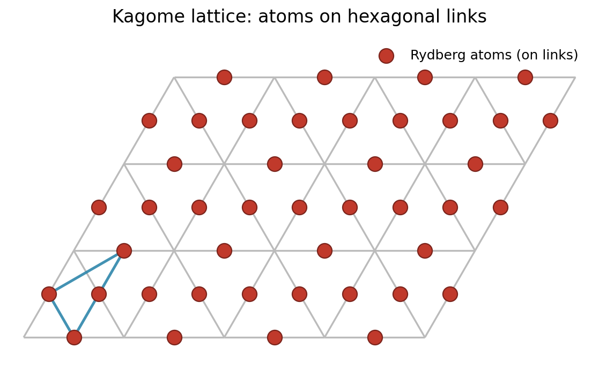

---
categories:
- Readings
date: 2026-03-18
description: 'string breaking on a Rydberg quantum simulator'
lang: en
title: 'String Breaking on a Rydberg Quantum Simulator'
bibliography: refs.bib
status: draft
---

# Summary and Questions

# What was done

They first prepare a Rydberg array on a Kagome lattice, which is a 2D lattice with a hexagonal structure.
{#fig-kagome-lattice width=70%}

:::{.callout-tip title="Experiment Protocol"}
1. **Gauge theory mapping:** Atoms on a kagome array encode a (2+1)D $U(1)$ lattice gauge theory. Rydberg blockade enforces Gauss's law; van der Waals interactions $V(r) = C_6/r^6$ (with $C_6/2\pi = 862{,}690\,\text{MHz}\cdot\mu\text{m}^6$, $^{87}$Rb $70S_{1/2}$) generate the linear confining potential.
2. **Static-charge preparation:** A local detuning beam pins a pair of test charges; adiabatic sweep ($\sim 2.5\,\mu$s) prepares the flux-string ground state.
3. **Phase-diagram scan:** Global detuning swept over $R_b/a \in [1.2, 1.8]$ ($a$ tuned 4.7–7 µm) and $\delta/\Omega \in [2.3,\, 3.67]$ on a **59-atom** kagome patch to map the confinement–deconfinement phase diagram. (Fig. 2e–f use a cut at fixed $\delta/\Omega = 3.67$.)
4. **Resonance scan ($d = 3$):** **39-atom** array; local detuning $\delta_0$ scanned to find the string-breaking resonance at $2\delta_0 = V_1$.
5. **Quench dynamics ($d = 2$):** **31-atom** array; sudden quench from string state to deconfined regime; main-text snapshots at $t = 0.4\,\mu$s (Fig. 3f). <!-- TODO: verify maximum quench observation time from Extended Data Fig. 1; main text only shows t = 0.4 µs explicitly -->
6. **Readout:** per-atom fluorescence imaging; fidelity $\sim 0.95$ (Rydberg), $\sim 0.99$ (ground state) — values from the Aquila platform spec [@wurtz2023aquila], not reported in this paper.
:::

Simulation of a (2+1)D $U(1)$ lattice gauge theory using native Rydberg interactions on a kagome lattice to observe string breaking — a fundamental phenomenon in understanding quark confinement. Three experimental configurations were used with different atom counts optimized for each measurement (see protocol callout above).

## Key observations

- **String confinement:** In the confined phase, charges are connected by a flux string whose energy grows linearly with separation — direct analog of the QCD flux tube.
- **String substructure:** Among the six topologically distinct unbroken string configurations of equal Manhattan length, their occurrence probabilities are *not* equal. Corner-hugging paths (configurations 1 and 6) are significantly more probable than straight-line paths due to geometry-dependent long-range Rydberg interactions — a direct probe of the microscopic gauge-theory Hamiltonian that has no analog in 1D systems.
- **String breaking via pair creation:** When the string energy exceeds the pair-creation threshold, a quench triggers particle-antiparticle pair creation from the vacuum, breaking the original string into shorter segments — direct analog of quark pair production in QCD.
- **Many-body resonance:** String breaking exhibits a resonance when the energy balance $2m \approx (\sigma(R_b) + \delta_0) \cdot d$ is satisfied (where $m$ is the particle mass set by $\Omega$, $\sigma(R_b)$ is the interaction energy density, and $d$ is the string length); informally, the detuning cost of creating a particle-antiparticle pair matches the string energy released.

## Scientific significance

| Aspect | Assessment |
|--------|-----------|
| **Novelty** | First observation of string breaking in any (2+1)D quantum system. Previous LGT quantum simulations were limited to (1+1)D. The (2+1)D case is qualitatively different because transverse string fluctuations (roughening) are absent in 1D. |
| **Practical value** | No direct technological application, but provides a new experimental tool for studying strong-coupling, non-perturbative dynamics inaccessible to lattice Monte Carlo (which suffers from a sign problem for real-time dynamics). |
| **Verification value** | Validates theoretical predictions for string breaking in (2+1)D LGT: the resonance condition $2m \approx (\sigma(R_b)+\delta_0)\cdot d$ (experiment peak $\delta_0/\Omega = 1.4(1)$ vs. theory 1.0 for $d=2$; experiment $1.0(1)$ vs. theory 0.7 for $d=3$), and the unequal string-path probabilities due to long-range interactions. These predictions had only been studied via small-scale exact diagonalization. |

## Architecture comparison: relative to 1-zone/3-zone/4-zone review benchmarks

| Parameter | González-Cuadra 2025 (Aquila) | SOTA 1-zone Aquila [@darbha2025prethermal] | SOTA 1-zone Harvard lab [@manovitz2025honeycomb] | Notes |
|-----------|-------------------------------|----------------------------------|----------------------------------------|-------|
| Atom count | 31–59 (kagome, 3 configurations) | up to 180 | ~200–300 (square) | Aquila has 256-site ceiling; Harvard lab is unbounded |
| Blockade radius | $R_b = 8.4\,\mu$m ($70S_{1/2}$) | Similar | Similar | Same Rb platform |
| Lattice constant | $a \approx 4.7$–$7\,\mu$m ($R_b/a \in [1.2, 1.8]$) | ~5 µm | ~5 µm | Tuned to scan phase diagram |
| Readout fidelity | $\sim 0.95$ / $\sim 0.99$ (from [@wurtz2023aquila]) | ~0.99 | ~0.99 | Values from Aquila white paper, not this paper |
| Evolution time | $0.4\,\mu$s quench snapshots (main text); $3\,\mu$s total adiabatic | Comparable | Comparable | Main-text quench snapshots at $t = 0.4\,\mu$s |
| Local addressing | Yes — local detuning beams | No (global) | Yes | Required for charge creation; AC Stark decoherence |
| Platform | QuEra Aquila (cloud) | QuEra Aquila (cloud) | Harvard lab | Cloud vs. lab apparatus |

**Key architectural feature:** This experiment requires *local* detuning control (to create the initial charge pair), which triggers Bottleneck 2 (AC Stark shift decoherence from local beam gradients).

## Critical technique analysis

**Most important technique needing optimization: Local detuning beam quality and thermal atom stability.**

Two coupled bottlenecks dominate:

1. **Bottleneck 1 ($1/R^6$ curse):** The string-breaking resonance requires precise knowledge of the nearest-neighbor interaction energy $V_1 \propto C_6/a^6$ (entering the energy-balance condition $2m \approx (\sigma(R_b)+\delta_0)\cdot d$). Thermal position fluctuations ($\sigma_x \sim 300$ nm for Rb in a 1 µK trap) give $\delta V_1 / V_1 \approx 6\sigma_x/a \approx 20$–$30\%$, directly broadening the resonance. This is visible quantitatively: the measured resonance peaks are significantly shifted from theory predictions: experiment finds $\delta_0/\Omega = 1.4(1)$ ($d=2$) and $1.0(1)$ ($d=3$) vs. theory predictions of 1.0 and 0.7 respectively — a systematic offset likely due to next-nearest-neighbor interaction corrections.

2. **Bottleneck 2 (local detuning decoherence):** The local detuning beams needed to create the initial charge pair have Gaussian spatial profiles, so intensity gradients at neighboring atom sites produce differential AC Stark shifts that dephase the register. Stronger local detuning (needed for sharper charge localization) means a larger gradient, faster dephasing, and shorter effective $T_2$. The Aquila platform's ensemble $T_2^*$ is on the order of a few µs (the paper does not report a $T_2$ value; the Aquila white paper [@wurtz2023aquila] gives $T_2^* \approx 5.5\,\mu$s); the actual quench window ($t = 0.4\,\mu$s in main-text figures) is well within this limit but is already constrained by the adiabatic sweep budget. Both effects compound.

**Why Bottleneck 1 is primary:** The resonance broadening ($\Delta\delta_0/\Omega \approx 0.9$) smears out the contrast between string and broken-string phases. Even if $T_2$ were infinite, the experiment would still fail to resolve the sharp resonance feature predicted by theory.

**Paths to improvement:**

- Sub-Doppler cooling (e.g., Raman sideband to motional ground state) to reduce position uncertainty from $\sigma_x \sim 300$ nm to $< 50$ nm, cutting $\delta V_1/V_1$ to $< 5\%$
- Top-hat local addressing beams to minimize $\nabla I$ at atom positions and suppress Bottleneck 2
- 3-zone architecture enabling mid-circuit measurements to track string evolution snapshot-by-snapshot

## Completeness check

**Concrete parameters (arXiv:2410.16558):**

| Quantity | Value |
|----------|-------|
| Kagome patch (phase diagram) | 59 atoms ($L_0 = L_1 = 5$ unit cells) |
| Kagome patch ($d=3$ resonance) | 39 atoms ($L_0 = 6$, $L_1 = 3$ unit cells) |
| Kagome patch ($d=2$ dynamics) | 31 atoms ($L_0 = 5$, $L_1 = 3$ unit cells) |
| Lattice constant $a$ | 4.7–7 µm (computed from $R_b/a \in [1.2, 1.8]$ with $R_b = 8.4\,\mu$m; paper reports $R_b/a$ range, not $a$ directly) |
| Phase-diagram detuning range | $\delta/\Omega \in [2.3,\, 3.67]$ (Fig. 2e–f cut at $\delta/\Omega = 3.67$) |
| Blockade radius $R_b$ | 8.4 µm ($^{87}$Rb $70S_{1/2}$) |
| $C_6/2\pi$ | $862{,}690\,\text{MHz}\cdot\mu\text{m}^6$ |
| Readout fidelity (Rydberg / ground) | $\sim 0.95$ / $\sim 0.99$ (from Aquila white paper [@wurtz2023aquila]; not reported in this paper) |
| $\Omega_\text{max}/2\pi$ | 2.5 MHz |
| $T_2^*$ (Aquila platform) | $\approx 5.5\,\mu$s (from Aquila white paper [@wurtz2023aquila]; not reported in this paper) |
| Adiabatic prep time | <!-- TODO: verify 2.5 µs linear sweep + 0.5 µs ramp from Extended Data Fig. 1; not in main text --> |
| Quench evolution window | Main-text snapshots at $t = 0.4\,\mu$s (Fig. 3f) <!-- TODO: verify maximum quench time from Extended Data --> |
| Resonance width $\Delta\delta_0/\Omega$ | Not quantitatively reported in main text |
| Resonance peak $\delta_0/\Omega$ ($d=2$) | 1.4(1) exp. vs. 1.0 theory |
| Resonance peak $\delta_0/\Omega$ ($d=3$) | 1.0(1) exp. vs. 0.7 theory |

**Theoretical comparison method:** Theory curves are computed via tensor-network (DMRG) simulations using the TeNPy library. These provide the ground-state string configurations and resonance predictions against which the experimental data are compared.

**Post-selection:** The paper computes probabilities $p_i$ for each classical string configuration from measured snapshots, relying on the Rydberg blockade to enforce Gauss's-law constraints natively rather than explicit post-selection filtering. Shot counts per parameter point are not reported in the main text.

**Gauss's law enforcement and violations:** The $U(1)$ gauge symmetry is enforced by the Rydberg blockade: every valid state $|\psi\rangle$ satisfies $G_x|\psi\rangle = q_x|\psi\rangle$ at each vertex $x$, where $G_x$ is the local Gauss's-law operator and $q_x$ is the static charge. The paper does *not* report a quantitative Gauss's-law satisfaction fraction (i.e., what percentage of experimental snapshots satisfy the ice rule at every vertex). However, Extended Data Fig. 6 attributes the dominant discrepancy between experiment and DMRG numerics to **Rydberg blockade violations** and **thermal atomic motion** — both of which break the gauge constraint. The absence of a reported violation rate means the reader cannot independently assess the fidelity of the gauge-theory mapping. For context, at $R_b/a = 1.5$ ($a \approx 5.6\,\mu$m), the blockade energy is $V_1/2\pi \approx C_6/(2\pi \cdot a^6) \approx 28\,\text{MHz}$, which is $\sim 11\times \Omega_\text{max}$; thermal position fluctuations ($\sigma_x \sim 300$ nm) reduce the effective blockade ratio to $\sim 7$–$8\times$, making occasional violations plausible.

**Note on Lüscher corrections:** The paper does *not* report a Lüscher roughening coefficient or a logarithmic fit to string width. The key 2D-specific observation is **string substructure**: among the six topologically distinct unbroken paths of equal length, occurrence probabilities are unequal due to geometry-dependent long-range $1/R^6$ interactions. This has no 1D analog and is a direct probe of the microscopic Hamiltonian.
