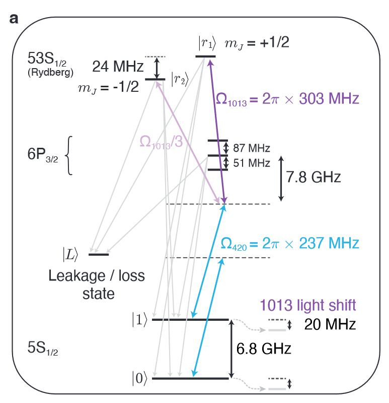

---
categories:
- Readings
date: 2026-03-30
description: 'Simulation of the Rydberg-blockade CZ gate for 87Rb: two-photon Hamiltonian, adiabatic elimination, robust phase modulation, and spontaneous emission.'
lang: en
title: 'Simulation of Rydberg CZ Gate Protocol'
bibliography: refs.bib
draft: true
---

## Introduction

High-fidelity entangling gates are a central requirement for fault-tolerant quantum computation. In the neutral-atom platform, two-qubit gates exploit the **Rydberg blockade mechanism**: when two atoms are separated by less than the blockade radius $R_b$, simultaneous excitation to the Rydberg state is energetically forbidden due to the strong van der Waals interaction $V = C_6/R^6$ [@jaksch2000fast; @saffman2010quantum]. This conditional dynamics underpins the controlled-phase (CPHASE or CZ) gate.

Early demonstrations of Rydberg-mediated entanglement achieved modest fidelities, limited by intermediate-state scattering, finite Rydberg lifetime, and laser phase noise [@levine2018highfidelity]. A significant breakthrough was reported by Evered *et al.* [@evered2023highfidelity], who demonstrated parallel entangling gates on a neutral-atom quantum computer with two-qubit Bell state fidelities exceeding $99.5\%$. Their protocol relies on a **two-photon Raman excitation** of $^{87}$Rb atoms to the Rydberg state $70S_{1/2}$, combined with optimized laser phase modulation to achieve robustness against amplitude fluctuations.

This article presents a detailed simulation of the Evered *et al.* CZ gate protocol. We derive the full multi-level Hamiltonian for the two-photon excitation process in $^{87}$Rb, perform the Clebsch--Gordan decomposition to obtain explicit coupling matrix elements, carry out adiabatic elimination of the intermediate states to arrive at an effective two-level description, and analyze the robust phase modulation scheme. We additionally derive the spontaneous emission master equation from first principles, establishing the fundamental decoherence limit on gate fidelity.

## Experimental Setting

::: {#def-qubit-encoding .callout-note icon="false"}
### Definition: Qubit Encoding

The computational basis states are encoded in the hyperfine clock states of the $^{87}$Rb ground-state manifold:
$$
\lvert 0 \rangle \equiv \{5S_{1/2},\, F = 1,\, m_F = 0\}, \qquad \lvert 1 \rangle \equiv \{5S_{1/2},\, F = 2,\, m_F = 0\}.
$$
These states are first-order insensitive to magnetic field fluctuations, providing long coherence times.
:::

{#fig-rb-levels width="50%"}

The two-photon excitation pathway proceeds as follows. A $420\,\text{nm}$ laser ($\sigma_-$ polarization) with large blue-detuning $\Delta = 6.1\,\text{GHz}$ couples the ground states to three intermediate levels split by the hyperfine structure of $6P_{3/2}$:
$$
\lvert 2 \rangle,\, \lvert 3 \rangle,\, \lvert 4 \rangle = \{6P_{3/2},\, F = 1, 2, 3,\, m_F = -1\}.
$$
A $1013\,\text{nm}$ laser ($\sigma_+$ polarization) then drives the transition from these intermediate states to the target Rydberg level $\lvert 5 \rangle = \{70S_{1/2},\, m_j = -1/2\}$.

::: {.callout-note icon="false"}
### Why $m_j$ Representation for Rydberg States

For Rydberg levels, the dominant term in the electronic Hamiltonian is the Zeeman coupling $\vec{B} \cdot (\vec{L} + \vec{S})$, which far exceeds the hyperfine coupling $\vec{I} \cdot (\vec{L} + \vec{S})$. Treating the nuclear spin interaction as a perturbation, the unperturbed Hamiltonian commutes with $L^2$, $S^2$, $J^2$, and $J_z$, making $m_j$ the appropriate quantum number. This is in contrast to the low-lying states, where the total angular momentum $F = J + I$ and $m_F$ are good quantum numbers.
:::

A subtlety arises from the intermediate-state structure. The states $\{6P_{3/2},\, F = 1, 2, 3,\, m_F = -1\}$ contain both $m_j = -3/2$ and $m_j = -1/2$ components. Consequently, the $\sigma_+$ laser inevitably couples to $\lvert 6 \rangle = \{70S_{1/2},\, m_j = +1/2\}$ in addition to the target state $\lvert 5 \rangle$. In the experiment, a magnetic field induces a $24\,\text{MHz}$ Zeeman splitting between $\lvert 5 \rangle$ and $\lvert 6 \rangle$, which is sufficient to make this parasitic excitation off-resonant and negligible during gate operation.

## Two-Photon Hamiltonian Derivation

A key motivation for the two-photon Raman scheme is the difficulty of achieving high Rabi frequencies with single-photon Rydberg excitation: the transition wavelengths involved (typically UV) are challenging to amplify to the required intensities. The two-photon pathway via an intermediate state allows the use of more accessible laser wavelengths while maintaining fast gate speeds, which is essential for suppressing decay errors from the finite Rydberg-state lifetime.

### General Formalism

Consider an atom with energy levels grouped into three manifolds --- ground states $\{\lvert g_j \rangle\}_{j=0}^{m_g}$ with energies $\{\omega_{g_j}\}$, excited (intermediate) states $\{\lvert e_j \rangle\}_{j=0}^{m_e}$ with energies $\{\omega_{e_j}\}$, and Rydberg states $\{\lvert r_j \rangle\}_{j=0}^{m_r}$ with energies $\{\omega_{r_j}\}$. Two laser fields with electric field vectors
$$
\mathbf{E}^{(j)}(t) = \frac{\mathbf{E}^{(j)}_-}{2}\, e^{i(\omega^{(j)} t + \phi^{(j)}(t))} + \frac{\mathbf{E}^{(j)}_+}{2}\, e^{-i(\omega^{(j)} t + \phi^{(j)}(t))},
$$ {#eq-laser-field}
where $\mathbf{E}^{(j)}_-  = E^{(j)} \cdot \{\mathbf{e}_x + i\mathbf{e}_y,\, \mathbf{e}_x - i\mathbf{e}_y,\, \mathbf{e}_z\}$ correspond to the three circular/linear polarizations $\{\sigma_-,\, \sigma_+,\, \pi\}$, couple the atom to the light field. The full Hamiltonian is $H = H_0 + e\mathbf{r}\cdot\mathbf{E}^{(1)}(t) + e\mathbf{r}\cdot\mathbf{E}^{(2)}(t)$, which takes the explicit form:
$$
\begin{aligned}
H &= \sum_{j=0}^{m_r} \hbar\omega_{r_j} \lvert r_j \rangle\!\langle r_j \rvert + \sum_{j=0}^{m_e} \hbar\omega_{e_j} \lvert e_j \rangle\!\langle e_j \rvert + \sum_{j=0}^{m_g} \hbar\omega_{g_j} \lvert g_j \rangle\!\langle g_j \rvert \\
&+ \left(\sum_{j=0}^{m_g}\sum_{k=0}^{m_e} \frac{\hbar\,\Omega^{(1)}_{jk,-}(t)}{2}\, e^{i(\omega_{e_0} - \omega_{g_0} - \Delta)t + i\phi_1(t)}\right) \lvert g_j \rangle\!\langle e_k \rvert + \text{c.c.} \\
&+ \left(\sum_{j=0}^{m_g}\sum_{k=0}^{m_e} \frac{\hbar\,\Omega^{(1)}_{jk,+}(t)}{2}\, e^{-i(\omega_{e_0} - \omega_{g_0} - \Delta)t - i\phi_1(t)}\right) \lvert g_j \rangle\!\langle e_k \rvert + \text{c.c.} \\
&+ \left(\sum_{j=0}^{m_e}\sum_{k=0}^{m_r} \frac{\hbar\,\Omega^{(2)}_{jk,-}(t)}{2}\, e^{i(\omega_{r_0} - \omega_{e_0} + \Delta - \delta)t + i\phi_2(t)}\right) \lvert e_j \rangle\!\langle r_k \rvert + \text{c.c.} \\
&+ \left(\sum_{j=0}^{m_e}\sum_{k=0}^{m_r} \frac{\hbar\,\Omega^{(2)}_{jk,+}(t)}{2}\, e^{-i(\omega_{r_0} - \omega_{e_0} + \Delta - \delta)t - i\phi_2(t)}\right) \lvert e_j \rangle\!\langle r_k \rvert + \text{c.c.}
\end{aligned}
$$ {#eq-two-photon-H}
Here the two laser frequencies are chosen as $\omega^{(1)} = \omega_{e_0} - \omega_{g_0} - \Delta$ and $\omega^{(2)} = \omega_{r_0} - \omega_{e_0} + \Delta - \delta$, defining the intermediate-state detuning $\Delta$ and two-photon detuning $\delta$. The coupling parameters are given by the dipole matrix elements:
$$
\Omega^{(1)}_{jk,\pm} = \langle g_j \rvert\, e\mathbf{r}\cdot\mathbf{E}^{(1)}_\pm\, \lvert e_k \rangle / \hbar, \qquad \Omega^{(2)}_{jk,\pm} = \langle e_j \rvert\, e\mathbf{r}\cdot\mathbf{E}^{(2)}_\pm\, \lvert r_k \rangle / \hbar.
$$ {#eq-rabi-coupling}

### Rotating Frame and RWA

We transform to the rotating frame defined by the unitary
$$
U(t) = \exp\!\left[i\omega_{g_0} t \sum_{j=0}^{m_g} \lvert g_j \rangle\!\langle g_j \rvert + i(\omega_{e_0} - \Delta)t \sum_{j=0}^{m_e} \lvert e_j \rangle\!\langle e_j \rvert + i(\omega_{r_0} - \delta)t \sum_{j=0}^{m_r} \lvert r_j \rangle\!\langle r_j \rvert\right].
$$ {#eq-rotating-frame}

::: {#thm-rwa-hamiltonian .callout-important icon="false"}
### Theorem: Rotating-Frame Hamiltonian under RWA

Applying the rotating wave approximation (discarding terms oscillating at frequencies $\sim 2\omega^{(1,2)}$), the transformed Hamiltonian $H' = i\hbar\,\dot{U}\,U^\dagger + U H U^\dagger$ becomes:
$$
\begin{aligned}
H' &= \sum_{j=0}^{m_r} \hbar(\delta + \omega_{r_j} - \omega_{r_0})\, \lvert r_j \rangle\!\langle r_j \rvert + \sum_{j=0}^{m_e} \hbar(\Delta + \omega_{e_j} - \omega_{e_0})\, \lvert e_j \rangle\!\langle e_j \rvert \\
&\quad + \sum_{j=0}^{m_g} \hbar(\omega_{g_j} - \omega_{g_0})\, \lvert g_j \rangle\!\langle g_j \rvert \\
&\quad + \sum_{j=0}^{m_g}\sum_{k=0}^{m_e} \frac{\hbar\,\Omega^{(1)}_{jk,-}(t)\, e^{i\phi_1(t)}}{2}\, \lvert g_j \rangle\!\langle e_k \rvert + \text{c.c.} \\
&\quad + \sum_{j=0}^{m_e}\sum_{k=0}^{m_r} \frac{\hbar\,\Omega^{(2)}_{jk,-}(t)\, e^{i\phi_2(t)}}{2}\, \lvert e_j \rangle\!\langle r_k \rvert + \text{c.c.}
\end{aligned}
$$ {#eq-rwa-hamiltonian}

The diagonal terms encode the detunings: $\delta$ for the Rydberg states, $\Delta$ (plus hyperfine splittings) for the intermediate states, and ground-state splittings. Only the co-rotating coupling terms survive the RWA.
:::

For two atoms within the Rydberg blockade radius, we supplement the single-atom Hamiltonian with the van der Waals interaction:
$$
H'_{\mathrm{int}} = \sum_{j,k=0}^{m_r} C_6(jk) \cdot R^{-6}\, \lvert r_j\, r_k \rangle\!\langle r_j\, r_k \rvert,
$$ {#eq-rydberg-interaction}
where $C_6(jk)$ are the dispersion coefficients for the relevant Rydberg pair states and $R$ is the interatomic separation.

## Clebsch--Gordan Decomposition for $^{87}$Rb

To evaluate the coupling matrix elements in @eq-rabi-coupling for the specific case of $^{87}$Rb, we must express the atomic states --- originally labeled by hyperfine quantum numbers $(F, m_F)$ --- in the uncoupled basis $\{L^2, S^2, J^2, I^2, m_J, m_I\}$, where the electric dipole selection rules are diagonal. This is accomplished through the standard Clebsch--Gordan (CG) decomposition $\langle j_1, m_1, j_2, m_2 \vert j_1, j_2, j_3, m_3 \rangle$.

In the experiment, two laser polarizations are used: $E^{(1)}$ at $420\,\text{nm}$ with $\sigma_-$ polarization, and $E^{(2)}$ at $1013\,\text{nm}$ with $\sigma_+$ polarization. The laser intensities are held constant, with only the $420\,\text{nm}$ phase $\phi^{(1)}(t)$ varied during the gate protocol.

### Basis States in the Uncoupled Representation

The seven relevant states, expressed through their CG decompositions, are:
$$
\begin{aligned}
\lvert 0 \rangle = \lvert g_1 \rangle &= (5S_{1/2})\; \tfrac{1}{\sqrt{2}}\bigl[-\{m_j = \tfrac{1}{2},\, m_I = -\tfrac{1}{2}\} + \{m_j = -\tfrac{1}{2},\, m_I = \tfrac{1}{2}\}\bigr], \\
\lvert 1 \rangle = \lvert g_0 \rangle &= (5S_{1/2})\; \tfrac{1}{\sqrt{2}}\bigl[\{m_j = \tfrac{1}{2},\, m_I = -\tfrac{1}{2}\} + \{m_j = -\tfrac{1}{2},\, m_I = \tfrac{1}{2}\}\bigr], \\
\lvert 2 \rangle = \lvert e_1 \rangle &= (6P_{3/2})\; \sqrt{\tfrac{3}{10}}\{m_j = -\tfrac{3}{2},\, m_I = \tfrac{1}{2}\} - \sqrt{\tfrac{2}{5}}\{m_j = -\tfrac{1}{2},\, m_I = -\tfrac{1}{2}\} \\
&\qquad\qquad + \sqrt{\tfrac{3}{10}}\{m_j = \tfrac{1}{2},\, m_I = -\tfrac{3}{2}\}, \\
\lvert 3 \rangle = \lvert e_0 \rangle &= (6P_{3/2})\; \tfrac{1}{\sqrt{2}}\{m_j = -\tfrac{3}{2},\, m_I = \tfrac{1}{2}\} - \tfrac{1}{\sqrt{2}}\{m_j = \tfrac{1}{2},\, m_I = -\tfrac{3}{2}\}, \\
\lvert 4 \rangle = \lvert e_2 \rangle &= (6P_{3/2})\; \tfrac{1}{\sqrt{5}}\{m_j = -\tfrac{3}{2},\, m_I = \tfrac{1}{2}\} + \sqrt{\tfrac{3}{5}}\{m_j = -\tfrac{1}{2},\, m_I = -\tfrac{1}{2}\} \\
&\qquad\qquad + \tfrac{1}{\sqrt{5}}\{m_j = \tfrac{1}{2},\, m_I = -\tfrac{3}{2}\}, \\
\lvert 5 \rangle = \lvert r_0 \rangle &= (70S_{1/2})\; \{m_j = -\tfrac{1}{2},\, m_I = \tfrac{1}{2}\}, \\
\lvert 6 \rangle = \lvert r_1 \rangle &= (70S_{1/2})\; \{m_j = \tfrac{1}{2},\, m_I = -\tfrac{1}{2}\}.
\end{aligned}
$$

### Coupling via the $420\,\text{nm}$ Laser

We define the reference Rabi frequency $\Omega_{420}$ and the ratio $\gamma$ through the dipole matrix elements:
$$
\begin{aligned}
\Omega_{420} &\;:=\; \frac{\langle\{6P_{3/2},\, m_j = -\tfrac{3}{2},\, m_I = \tfrac{1}{2}\}\rvert\, e\mathbf{r}\cdot\mathbf{E}^{(1)}_-\, \lvert\{5S_{1/2},\, m_j = -\tfrac{1}{2},\, m_I = \tfrac{1}{2}\}\rangle}{\sqrt{2}\,\hbar}, \\
\gamma\,\Omega_{420} &\;=\; \frac{\langle\{6P_{3/2},\, m_j = -\tfrac{1}{2},\, m_I = -\tfrac{1}{2}\}\rvert\, e\mathbf{r}\cdot\mathbf{E}^{(1)}_-\, \lvert\{5S_{1/2},\, m_j = \tfrac{1}{2},\, m_I = -\tfrac{1}{2}\}\rangle}{\sqrt{2}\,\hbar}.
\end{aligned}
$$ {#eq-omega420}

Using the notation $\mathrm{CG}(j_1, m_1, j_2, m_2, j_3, m_3) \equiv \langle j_1, m_1, j_2, m_2 \vert j_1, j_2, j_3, m_3 \rangle$, the coupling matrix elements for the $420\,\text{nm}$ laser evaluate to:
$$
\begin{aligned}
\langle 2 \rvert H \lvert 1 \rangle &= \mathrm{CG}(\tfrac{3}{2},-\tfrac{3}{2},\tfrac{3}{2},\tfrac{1}{2},1,-1)\,\frac{\Omega_{420}}{2} + \mathrm{CG}(\tfrac{3}{2},-\tfrac{1}{2},\tfrac{3}{2},-\tfrac{1}{2},1,-1)\,\frac{\gamma\,\Omega_{420}}{2} \\
&= \sqrt{0.3}\;\frac{\Omega_{420}}{2} - \sqrt{0.4}\;\frac{\gamma\,\Omega_{420}}{2}, \\[4pt]
\langle 3 \rvert H \lvert 1 \rangle &= \mathrm{CG}(\tfrac{3}{2},-\tfrac{3}{2},\tfrac{3}{2},\tfrac{1}{2},2,-1)\,\frac{\Omega_{420}}{2} + \mathrm{CG}(\tfrac{3}{2},-\tfrac{1}{2},\tfrac{3}{2},-\tfrac{1}{2},2,-1)\,\frac{\gamma\,\Omega_{420}}{2} \\
&= -\sqrt{0.5}\;\frac{\Omega_{420}}{2}, \\[4pt]
\langle 4 \rvert H \lvert 1 \rangle &= \mathrm{CG}(\tfrac{3}{2},-\tfrac{3}{2},\tfrac{3}{2},\tfrac{1}{2},3,-1)\,\frac{\Omega_{420}}{2} + \mathrm{CG}(\tfrac{3}{2},-\tfrac{1}{2},\tfrac{3}{2},-\tfrac{1}{2},3,-1)\,\frac{\gamma\,\Omega_{420}}{2} \\
&= \sqrt{0.2}\;\frac{\Omega_{420}}{2} + \sqrt{0.6}\;\frac{\gamma\,\Omega_{420}}{2}.
\end{aligned}
$$

### Coupling via the $1013\,\text{nm}$ Laser

Analogously, define the reference Rabi frequency $\Omega_{1013}$ and ratio $\beta$:
$$
\begin{aligned}
\Omega_{1013} &\;:=\; \frac{\langle\{70S_{1/2},\, m_j = -\tfrac{1}{2},\, m_I = \tfrac{1}{2}\}\rvert\, e\mathbf{r}\cdot\mathbf{E}^{(2)}_-\, \lvert\{6P_{3/2},\, m_j = -\tfrac{3}{2},\, m_I = \tfrac{1}{2}\}\rangle}{\hbar}, \\
\beta\,\Omega_{1013} &\;:=\; \frac{\langle\{70S_{1/2},\, m_j = \tfrac{1}{2},\, m_I = -\tfrac{1}{2}\}\rvert\, e\mathbf{r}\cdot\mathbf{E}^{(2)}_-\, \lvert\{6P_{3/2},\, m_j = -\tfrac{1}{2},\, m_I = -\tfrac{1}{2}\}\rangle}{\hbar}.
\end{aligned}
$$ {#eq-omega1013}

The resulting matrix elements are:
$$
\begin{aligned}
\langle 5 \rvert H \lvert 2 \rangle &= \sqrt{0.3}\;\frac{\Omega_{1013}}{2}, &\quad
\langle 6 \rvert H \lvert 2 \rangle &= -\sqrt{0.4}\;\frac{\beta\,\Omega_{1013}}{2}, \\
\langle 5 \rvert H \lvert 3 \rangle &= -\sqrt{0.5}\;\frac{\Omega_{1013}}{2}, &\quad
\langle 6 \rvert H \lvert 3 \rangle &= 0, \\
\langle 5 \rvert H \lvert 4 \rangle &= \sqrt{0.2}\;\frac{\Omega_{1013}}{2}, &\quad
\langle 6 \rvert H \lvert 4 \rangle &= \sqrt{0.6}\;\frac{\beta\,\Omega_{1013}}{2}.
\end{aligned}
$$

::: {.callout-note icon="false"}
### Note: Dipole Matrix Elements from ARC

The specific values of $\gamma$ and $\beta$ require integration of the radial wavefunctions, which depend on the quantum defects of the relevant states. Using the **ARC** (Alkali Rydberg Calculator) library [@sibalic2017arc] --- an open-source package that computes single-electron wavefunctions and matrix elements for alkali atoms --- one obtains:
$$
\gamma = \beta = \sqrt{1/3}.
$$
This equality reflects the Wigner--Eckart theorem: both ratios are determined by the same reduced matrix element, with only the geometric (CG) factors differing.
:::

## Adiabatic Elimination of Intermediate States

The preceding analysis established the coupling structure of the seven-level system. We now reduce it to an effective two-level problem by **adiabatic elimination** of the intermediate states $\lvert 2 \rangle$, $\lvert 3 \rangle$, and $\lvert 4 \rangle$ [@brionmolmer2007].

### Physical Motivation

The validity of adiabatic elimination rests on a **timescale separation**: the intermediate-state detuning $\Delta = 6.1\,\text{GHz}$ is much larger than the Rabi frequencies $\Omega_{420}$, $\Omega_{1013}$ (typically $\sim$MHz). The intermediate-state population therefore remains negligible at all times --- these states are "virtually" occupied and their amplitudes adiabatically follow the ground and Rydberg amplitudes. Formally, this amounts to setting $\partial_t \psi_i \approx 0$ for $i = 2, 3, 4$ in the Schrödinger equation.

We also neglect the parasitic Rydberg state $\lvert 6 \rangle$ due to the $24\,\text{MHz}$ Zeeman splitting from $\lvert 5 \rangle$, which renders it far off-resonance from the two-photon transition. Using the shorthand $H_{ij} := \langle i \rvert H \lvert j \rangle$, the Schrödinger equation from @eq-rwa-hamiltonian reads:
$$
\begin{aligned}
i\hbar\,\partial_t \psi_i &= (H_{i1}\,\psi_1 + H_{i5}\,\psi_5) + \Delta\,\psi_i, \qquad \forall\; i = 2, 3, 4, \\
i\hbar\,\partial_t \psi_5 &= \sum_{i=2,3,4} H_{5i}\,\psi_i, \\
i\hbar\,\partial_t \psi_1 &= \sum_{i=2,3,4} H_{1i}\,\psi_i.
\end{aligned}
$$ {#eq-schrodinger-7level}

Setting $\partial_t \psi_i = 0$ for $i = 2, 3, 4$ gives $\psi_i = -(H_{i1}\,\psi_1 + H_{i5}\,\psi_5)/\Delta$. Substituting back:
$$
\begin{aligned}
i\hbar\,\partial_t \psi_5 &= -\sum_{i=2,3,4} \frac{|H_{5i}|^2}{\Delta}\,\psi_5 - \left(\sum_{i=2,3,4} \frac{H_{i1}\,H_{5i}}{\Delta}\right)\psi_1, \\
i\hbar\,\partial_t \psi_1 &= -\sum_{i=2,3,4} \frac{|H_{1i}|^2}{\Delta}\,\psi_1 - \left(\sum_{i=2,3,4} \frac{H_{i5}\,H_{1i}}{\Delta}\right)\psi_5.
\end{aligned}
$$ {#eq-adiabatic-eliminated}

::: {#thm-effective-params .callout-important icon="false"}
### Theorem: Effective Two-Level Parameters

After adiabatic elimination, the dynamics of the qubit state $\lvert 1 \rangle$ and Rydberg state $\lvert 5 \rangle$ are governed by an effective two-level Hamiltonian with parameters:

**Effective light shifts (AC Stark shifts):**
$$
\begin{aligned}
\Delta_{\mathrm{eff},5} &= -\sum_{i=2,3,4} \frac{|H_{5i}|^2}{\Delta} = -\frac{\Omega_{1013}^2}{4\Delta}, \\
\Delta_{\mathrm{eff},1} &= -\sum_{i=2,3,4} \frac{|H_{1i}|^2}{\Delta} = -\frac{4}{3}\,\frac{\Omega_{420}^2}{4\Delta}.
\end{aligned}
$$ {#eq-light-shifts}

**Effective Rabi frequency:**
$$
\Omega_{\mathrm{eff}} = -2\,\frac{\sum_{i=2,3,4} H_{i1}\,H_{5i}}{\Delta} = -\frac{\Omega_{1013}\,\Omega_{420}}{2\Delta}.
$$ {#eq-omega-eff}

The factor $4/3$ in $\Delta_{\mathrm{eff},1}$ arises from the CG coefficients summed over the three intermediate states, and the effective Rabi frequency has the standard form for a two-photon Raman transition.
:::

::: {.callout-note collapse="true"}
### Proof: Derivation of the $4/3$ Factor

We verify the light shift $\Delta_{\mathrm{eff},1}$ by explicit evaluation. Using $\gamma = \sqrt{1/3}$ and the matrix elements computed above:

$$
\begin{aligned}
\sum_{i=2,3,4} |H_{1i}|^2 &= \left|\sqrt{0.3} - \sqrt{\tfrac{0.4}{3}}\right|^2 \frac{\Omega_{420}^2}{4} + \left|\sqrt{0.5}\right|^2 \frac{\Omega_{420}^2}{4} + \left|\sqrt{0.2} + \sqrt{\tfrac{0.6}{3}}\right|^2 \frac{\Omega_{420}^2}{4}.
\end{aligned}
$$

Computing each term: $\sqrt{0.4/3} = \sqrt{2/15}$ and $\sqrt{0.6/3} = \sqrt{1/5} = \sqrt{0.2}$, so

$$
\begin{aligned}
&\left(\sqrt{0.3} - \sqrt{2/15}\right)^2 + 0.5 + \left(2\sqrt{0.2}\right)^2 \\
&= \left(\sqrt{3/10} - \sqrt{2/15}\right)^2 + 0.5 + 0.8 \\
&= \frac{3}{10} + \frac{2}{15} - 2\sqrt{\frac{6}{150}} + 1.3 \\
&= \frac{3}{10} + \frac{2}{15} - \frac{2}{\sqrt{25}} + 1.3 = \frac{3}{10} + \frac{2}{15} - \frac{2}{5} + 1.3.
\end{aligned}
$$

Evaluating: $\frac{3}{10} + \frac{2}{15} - \frac{2}{5} = \frac{9 + 4 - 12}{30} = \frac{1}{30}$, giving a total of $\frac{1}{30} + 1.3 = \frac{1}{30} + \frac{39}{30} = \frac{40}{30} = \frac{4}{3}$.

Therefore $\Delta_{\mathrm{eff},1} = -\frac{4}{3}\,\frac{\Omega_{420}^2}{4\Delta}$.

Similarly, for $\Delta_{\mathrm{eff},5}$: $\sum_{i=2,3,4} |H_{5i}|^2 = (0.3 + 0.5 + 0.2)\,\Omega_{1013}^2/4 = \Omega_{1013}^2/4$, confirming $\Delta_{\mathrm{eff},5} = -\Omega_{1013}^2/(4\Delta)$.
:::

## Robust Phase Modulation for the CZ Gate

::: {#def-cz-blockade .callout-note icon="false"}
### Definition: CZ Gate via Rydberg Blockade

In the blockade regime ($V = C_6/R^6 \gg \Omega_{\mathrm{eff}}$), the CZ gate is realized by driving a $2\pi$ rotation on the $\lvert 1 \rangle \leftrightarrow \lvert r \rangle$ transition of one atom, conditioned on the state of a neighboring atom. The truth table is:
$$
\lvert 00 \rangle \to \lvert 00 \rangle, \quad \lvert 01 \rangle \to \lvert 01 \rangle, \quad \lvert 10 \rangle \to \lvert 10 \rangle, \quad \lvert 11 \rangle \to -\lvert 11 \rangle.
$$
The minus sign on $\lvert 11 \rangle$ arises because both atoms individually undergo the $\lvert 1 \rangle \to \lvert r \rangle \to \lvert 1 \rangle$ cycle (each acquiring a $\pi$ phase), but the blockade prevents simultaneous excitation, so only one atom cycles and the global phase is $e^{i\pi} = -1$.
:::

### The Optimization Problem

A naive implementation of the CZ gate uses a simple resonant pulse of area $2\pi$, but this approach is highly sensitive to fluctuations in the laser intensity (and hence $\Omega_{\mathrm{eff}}$). In practice, shot-to-shot and spatial variations in the Rabi frequency limit the gate fidelity. The key insight of Evered *et al.* [@evered2023highfidelity] is to introduce a **time-dependent phase modulation** $\varphi(t)$ on the $420\,\text{nm}$ laser during the pulse, which effectively shapes the trajectory on the Bloch sphere to create a path that is robust against amplitude errors.

This approach builds on the general framework of **time-optimal robust control** for Rydberg gates developed by Jandura and Pupillo [@jandura2022timeoptimal], who showed that smooth phase modulation can simultaneously achieve short gate times and high robustness. The idea is closely related to composite pulse sequences in NMR and trapped-ion systems, adapted to the continuous-driving regime relevant for Rydberg excitation [@theis2016highfidelity].

### Phase Modulation Ansatz

The optimized phase modulation function is parametrized as a truncated Fourier series:
$$
\varphi(t) = A_1 \sin(\omega t + \phi_1) + A_2 \sin(2\omega t + \phi_2) + \delta\, t,
$$ {#eq-phase-modulation}
with the following optimized parameters:

| Parameter | Value |
|-----------|-------|
| $\omega$ | $8.71374888 \times 10^{-1}\;\Omega_{\mathrm{eff}}$ |
| $A_1$ | $8.89646230 \times 10^{-1}$ |
| $\phi_1$ | $-8.93893845 \times 10^{-1}$ |
| $A_2$ | $-6.67698078 \times 10^{-1}$ |
| $\phi_2$ | $1.35391702$ |
| $\delta$ | $-1.97859545 \times 10^{-2}\;\Omega_{\mathrm{eff}}$ |
| $t_{\mathrm{gate}}$ | $2.62170756 \cdot (2\pi / \Omega_{\mathrm{eff}})$ |

The linear term $\delta\, t$ accounts for a residual detuning offset, while the sinusoidal terms at frequencies $\omega$ and $2\omega$ provide the error-cancellation mechanism. The gate time $t_{\mathrm{gate}} \approx 2.62 \times (2\pi/\Omega_{\mathrm{eff}})$ is slightly longer than the minimum $2\pi$-pulse duration, the overhead being the cost of the robustness-enhancing trajectory.

### Robustness Mechanism

The physical intuition is as follows. At the nominal Rabi frequency $\Omega_{\mathrm{eff}}$, the Bloch vector traces a closed path returning to $\lvert 1 \rangle$ with the accumulated geometric + dynamic phase equal to $\pi$. When $\Omega_{\mathrm{eff}}$ fluctuates by $\delta\Omega$, a simple $2\pi$ pulse fails to close the loop, resulting in residual Rydberg population and phase errors. The optimized phase modulation reshapes the Bloch-sphere trajectory so that the **first-order sensitivity** $\partial\mathcal{F}/\partial\Omega$ vanishes at the operating point, where $\mathcal{F}$ is the gate fidelity. This is analogous to a spin-echo canceling dephasing errors, but applied to amplitude noise in the driving field [@levine2019parallel; @pagano2022error].

## Spontaneous Emission and Master Equation

The finite lifetime of the Rydberg state $\lvert r \rangle$ imposes a fundamental limit on gate fidelity. During the gate operation of duration $t_{\mathrm{gate}}$, the atom may spontaneously decay from the Rydberg level, an irreversible process that destroys the coherent gate operation. We now derive the spontaneous emission rate from the quantum-optical master equation [@scullyzubairy1997].

### Single-Mode Atom-Light Coupling

Consider a two-level atom with states $\lvert g \rangle$, $\lvert e \rangle$ coupled to a single-mode quantized radiation field at frequency $\omega$. The dipole interaction Hamiltonian, projected onto the relevant subspace, is:
$$
\mathcal{V} = e\,(\langle e \rvert \vec{r} \lvert g \rangle\,\sigma_- + \langle g \rvert \vec{r} \lvert e \rangle\,\sigma_+) \cdot \left[\sqrt{\frac{\hbar\omega}{2\varepsilon_0}}\,(\vec{f}(\vec{r})\,a + \vec{f}^*(\vec{r})\,a^\dagger)\right].
$$ {#eq-dipole-coupling}
Here $\sigma_\pm$ are the atomic raising/lowering operators, $a^\dagger, a$ are the photon creation/annihilation operators, and $\vec{f}(\vec{r})$ is the mode function. The diagonal matrix elements $\langle g \rvert \vec{r} \lvert g \rangle = \langle e \rvert \vec{r} \lvert e \rangle = 0$ vanish by parity.

In the interaction picture, the rotating wave approximation yields:
$$
\mathcal{V}(t) = \hbar\left[g(\vec{r})\,a^\dagger\,\sigma_-\, e^{-i\delta t} + g^*(\vec{r})\,a\,\sigma_+\, e^{i\delta t}\right], \qquad \delta = \Delta E/\hbar - \omega,
$$ {#eq-jc-interaction}
where $g(\vec{r}) = e\sqrt{\frac{\omega}{2\hbar\varepsilon_0}}\,\vec{f}(\vec{r}) \cdot \langle g \rvert \vec{r} \lvert e \rangle$.

### Multi-Mode Extension and Born--Markov Master Equation

For a multi-mode radiation field, the coupling generalizes to:
$$
\mathcal{V}(t) = \sum_{k,\zeta} \hbar\left[g_{k,\zeta}(\vec{r})\,a^\dagger_{k,\zeta}\,\sigma_-\, e^{-i\delta_k t} + g^*_{k,\zeta}(\vec{r})\,a_{k,\zeta}\,\sigma_+\, e^{i\delta_k t}\right],
$$ {#eq-multimode-coupling}
where $k$ labels wavevector, $\zeta$ labels polarization, and $\delta_k = \Delta E/\hbar - \omega_k$.

Assuming the photon reservoir is (i) large (Markov approximation), (ii) weakly coupled to the atom (Born approximation), and (iii) initially in a thermal state at temperature $T$ with density matrix $\rho_R = Z^{-1} e^{-\beta \sum_{k,\zeta} \hbar\omega_k a^\dagger_{k,\zeta} a_{k,\zeta}}$, the evolution of the reduced atomic density matrix is given by:
$$
\dot{\rho}_a(t) = -\frac{i}{\hbar}\operatorname{Tr}_R\!\left[\mathcal{V}(t),\, \rho_a(t_i) \otimes \rho_R(t_i)\right] - \int_{t_i}^{t}\!dt'\;\frac{1}{\hbar^2}\operatorname{Tr}_R\!\left[\mathcal{V}(t),\, \bigl[\mathcal{V}(t'),\, \rho_a(t) \otimes \rho_R(t_i)\bigr]\right].
$$ {#eq-born-markov}

::: {.callout-note collapse="true"}
### Proof: Evaluation of the Reservoir Trace

**First-order term.** Expanding the commutator and using the cyclic property of the trace:
$$
-\frac{i}{\hbar}\operatorname{Tr}_R[\mathcal{V}(t),\, \rho_a \otimes \rho_R] = -i\sum_{k,\zeta} g_{k,\zeta}(\vec{r})\,\langle a^\dagger_{k,\zeta} \rangle\, e^{-i\delta_k t}\,[\sigma_-,\, \rho_a(t_i)] + \text{c.c.}
$$
For a thermal state, $\langle a^\dagger_{k,\zeta} \rangle = 0$, so this term vanishes.

**Second-order term.** After expanding the double commutator and evaluating the reservoir expectation values, the key thermal averages are:
$$
\operatorname{Tr}[\rho_R\, a^\dagger_{k_1,\zeta_1}\, a_{k_2,\zeta_2}] = \delta_{k_1 k_2,\zeta_1\zeta_2}\,\bar{n}_{k,\zeta}, \qquad \operatorname{Tr}[\rho_R\, a_{k_2,\zeta_2}\, a^\dagger_{k_1,\zeta_1}] = \delta_{k_1 k_2,\zeta_1\zeta_2}\,(\bar{n}_{k,\zeta} + 1),
$$
where $\bar{n}_{k,\zeta} = (e^{\beta\hbar\omega_k} - 1)^{-1}$ is the Bose--Einstein distribution. The terms $\langle a_{k_1} a_{k_2} \rangle$ and $\langle a^\dagger_{k_1} a^\dagger_{k_2} \rangle$ vanish for a thermal state.

After lengthy but straightforward algebra (expanding all double commutators and collecting terms), the second-order contribution becomes:
$$
\begin{aligned}
\dot{\rho}_a &= -\int_{t_i}^{t}\!dt'\;\sum_{k,\zeta} |g_{k,\zeta}(\vec{r})|^2\, e^{i\delta_k(t-t')}\,(\bar{n}_{k,\zeta}+1)\,[\sigma_+\sigma_-\,\rho_a - \sigma_-\,\rho_a\,\sigma_+] \\
&\quad -\int_{t_i}^{t}\!dt'\;\sum_{k,\zeta} |g_{k,\zeta}(\vec{r})|^2\, e^{i\delta_k(t-t')}\,\bar{n}_{k,\zeta}\,[\rho_a\,\sigma_-\sigma_+ - \sigma_+\,\rho_a\,\sigma_-] + \text{c.c.}
\end{aligned}
$$

**Continuum limit.** For free-space modes, $\vec{f}_{k,\zeta}(\vec{r}) = V^{-1/2}\, e^{i\vec{k}\cdot\vec{r}}$ and the polarization sum gives $\sum_\zeta \varepsilon^i_{k,\zeta}\,\varepsilon^{j*}_{k,\zeta} = \delta^{ij} - \hat{k}^i\hat{k}^j$. Converting the mode sum to an integral:
$$
\sum_{k,\zeta} |g_{k,\zeta}|^2 = \frac{|\langle g \rvert e\vec{r} \lvert e \rangle|^2}{6\pi^2 \varepsilon_0 c^3}\int_0^\infty\! d\omega\;\omega^3,
$$
where the factor $4/3$ arises from the angular integration $\int d\Omega\,(1 - \cos^2\theta) = 8\pi/3$.

**Wigner--Weisskopf limit.** Taking $t_i \to -\infty$:
$$
\lim_{t\to\infty} \int_{t_i}^{t}\!dt'\; e^{i\delta_k(t-t')} \approx \pi\,\delta(\omega_k - \omega_0) + i\,\mathcal{P}\!\left(\frac{1}{\omega_0 - \omega_k}\right).
$$
The imaginary principal-value term contributes to the **Lamb shift** after appropriate renormalization, and is neglected here. The $\delta$-function selects $\omega_k = \omega_0$, completing the evaluation.
:::

::: {#thm-lindblad .callout-important icon="false"}
### Theorem: Spontaneous Emission Master Equation

The reduced atomic density matrix obeys the Lindblad master equation:
$$
\dot{\rho}_a = -\frac{\Gamma}{2}\,(\bar{n}+1)\,[\sigma_+\sigma_-\,\rho_a - 2\sigma_-\,\rho_a\,\sigma_+ + \rho_a\,\sigma_+\sigma_-] - \frac{\Gamma}{2}\,\bar{n}\,[\sigma_-\sigma_+\,\rho_a - 2\sigma_+\,\rho_a\,\sigma_- + \rho_a\,\sigma_-\sigma_+],
$$ {#eq-lindblad}
where $\bar{n} = \bar{n}_{k_0}$ is the thermal photon number at the transition frequency $\omega_0$, and the **spontaneous emission rate** (Einstein $A$ coefficient) is:
$$
\Gamma = \frac{|\langle g \rvert e\vec{r} \lvert e \rangle|^2\,\omega_0^3}{3\pi\varepsilon_0\hbar c^3}.
$$ {#eq-decay-rate}
At room temperature and optical/UV frequencies, $\bar{n} \ll 1$, so the stimulated emission and absorption terms (proportional to $\bar{n}$) are negligible, and the master equation reduces to the standard amplitude damping channel.
:::

::: {.callout-note icon="false"}
### Note: Rydberg Lifetime and Gate Fidelity Limit

For $^{87}$Rb in the $70S_{1/2}$ state, the radiative lifetime is $\tau \sim 150\,\mu\text{s}$ at room temperature (with blackbody-radiation-induced transitions reducing the effective lifetime to $\sim 100\,\mu\text{s}$) [@saffman2010quantum]. The gate time for the Evered *et al.* protocol is $t_{\mathrm{gate}} \sim 400\,\text{ns}$ (for $\Omega_{\mathrm{eff}}/2\pi \sim 4\,\text{MHz}$), giving a decay error of order:
$$
\epsilon_{\mathrm{decay}} \sim \frac{t_{\mathrm{gate}}}{\tau} \sim 4 \times 10^{-3}.
$$
This sets the fundamental floor for the CZ gate infidelity from Rydberg decay alone, consistent with the error budgets reported in [@evered2023highfidelity; @pagano2022error]. Minimizing $t_{\mathrm{gate}}$ (through higher $\Omega_{\mathrm{eff}}$, i.e. higher laser power) directly reduces this error, which is the primary motivation for the two-photon scheme and the time-optimal pulse design discussed in the preceding section.
:::

## Appendix: Estimating Rabi Frequency from Light Shift {.appendix}

The effective Rabi frequency $\Omega_{\mathrm{eff}}$ can be calibrated experimentally by measuring the **AC Stark shift** (light shift) induced by each laser independently [@grimm2000optical]. When a single laser is far-detuned from all transitions (i.e., the laser frequency deviates significantly from any resonance), the dominant effect is a scalar light shift proportional to the laser intensity:
$$
\Delta E_{\mathrm{AC}} = -\frac{|\Omega|^2}{4\Delta},
$$
where $\Omega$ is the single-photon Rabi frequency and $\Delta$ is the detuning from the nearest transition. By measuring $\Delta E_{\mathrm{AC}}$ spectroscopically (e.g., via Ramsey interferometry on the qubit transition) and knowing $\Delta$, one extracts $|\Omega|$. The individual Rabi frequencies $\Omega_{420}$ and $\Omega_{1013}$ so obtained then determine $\Omega_{\mathrm{eff}}$ through @eq-omega-eff.
