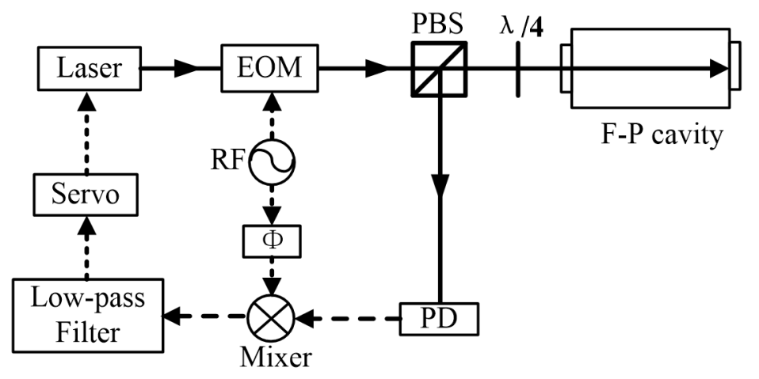
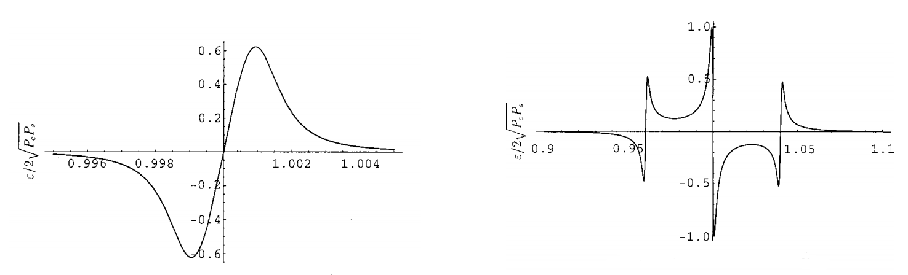

---
categories:
- Lasers
date: '2026-01-08'
lang: en
title: PDH锁频
---

## Principles of Laser Frequency Locking

In cold atom experiments, lasers need to interact with the atoms' hyperfine energy levels, thus requiring extremely high stability and absolute precision in laser frequency. Typically, **active frequency stabilization** methods are employed to ensure long-term stability of the laser's frequency.

Frequency locking is based on the principle of **negative feedback control**. First, a stable reference frequency is established, and through specific optical and electronic means, the laser frequency is compared with this reference frequency to obtain an **error signal**. The magnitude and sign of this error signal indicate the extent to which the laser frequency deviates from the reference frequency. Subsequently, the feedback control circuit adjusts the laser in real-time based on this error signal to minimize frequency deviation.

::: {#fig-PDHlock fig-cap="Schematic diagram of PDH frequency locking experimental setup (cited from laboratory notes)" fig-align="center"}

:::

::: {#fig-PDHerror fig-cap="Diagram of the error signal generated by PDH frequency locking" fig-align="center"}

:::

This article primarily introduces **Pound–Drever–Hall (PDH) frequency-locking technology**. This method can achieve laser frequency stability at the sub-Hertz ($\mathrm{Hz}$) level, making it highly valuable in clock state transitions and high-precision atomic spectroscopy experiments. The basic process is illustrated in Figure @fig-PDHlock.

A laser with a frequency of $\omega_0$ first passes through an **electro-optic modulator (EOM)**. The EOM is driven by a radio-frequency signal 
$\beta \sin(\Omega t)$, causing phase modulation of the laser field:
\begin{align}
E_1 &= E_0 e^{i \omega_0 t + i \beta \sin(\Omega t)} \\
&\approx E_0 e^{i \omega_0 t}
+ \frac{1}{2} J_1(\beta) E_0 e^{i(\omega_0 + \Omega)t}
- \frac{1}{2} J_1(\beta) E_0 e^{i(\omega_0 - \Omega)t},
\end{align}
where $J_\alpha$ is the first kind of Bessel function. Due to the modulation depth $\beta \ll 1$, higher-order sidebands can be neglected.

The modulated laser is coupled into a Fabry–Pérot cavity (F-P cavity) and reflected at the input mirror of the cavity. It can be proven that the complex amplitude of light with frequency $\omega$ in the cavity is
\begin{align}
F(\omega)
= r \frac{1 - e^{-i \omega 2L / c}}{1 - r^2 e^{-i \omega 2L / c}},
\end{align}
where $r$ is the reflectivity of the cavity mirrors, and $L$ is the length of the cavity.
When
\begin{align}
\omega_n = n \times \frac{2\pi c}{2L},
\end{align}
i.e., when the laser frequency matches the resonance condition of the cavity mode, we have $F(\omega_n)=0$, and ideally, the reflected light intensity is zero.
To achieve efficient coupling, the waist position of the incident Gaussian beam must coincide with the input plane mirror of the cavity, and a stable resonant mode is formed through an internal concave mirror. In experiments, charge-coupled devices (CCD) are typically used to observe and optimize the spatial mode of the reflected light, and finally, photodetectors (PD) measure the intensity of the reflected light.

Considering the effect of EOM modulation, the total intensity of the reflected light can be expressed as
\begin{align}
I_R &= E_0^2 |F(\omega_0)|^2
+ \frac{1}{4} J_1^2(\beta) E_0^2 |F(\omega_0 + \Omega)|^2
+ \frac{1}{4} J_1^2(\beta) E_0^2 |F(\omega_0 - \Omega)|^2 \notag \\
&\quad + J_1(\beta) E_0^2
\operatorname{Re}\!\left[
F(\omega_0) F^*(\omega_0 + \Omega)
- F^*(\omega_0) F(\omega_0 - \Omega)
\right] \cos(\Omega t) \notag \\
&\quad + J_1(\beta) E_0^2
\operatorname{Im}\!\left[
F(\omega_0) F^*(\omega_0 + \Omega)
- F^*(\omega_0) F(\omega_0 - \Omega)
\right] \sin(\Omega t).
\end{align}

Subsequently, the PD output signal is sent to a radio-frequency mixer and multiplied with a reference signal $\beta \sin(\Omega t + \Phi)$ from the same RF source but with phase delay $\Phi$. After low-pass filtering, only the DC component remains, whose amplitude is proportional to 
\begin{align}
F(\omega_0)F^*(\omega_0 + \Omega)- F^*(\omega_0)F(\omega_0 - \Omega)
\end{align}
This quantity exhibits an approximately linear and monotonic zero-crossing behavior near $\omega_0 = \omega_n$, as shown in Figure @fig-PDHerror, thus serving as the error signal for feedback control loops to achieve stable locking of the laser frequency.

## Related Experimental Equipment Information