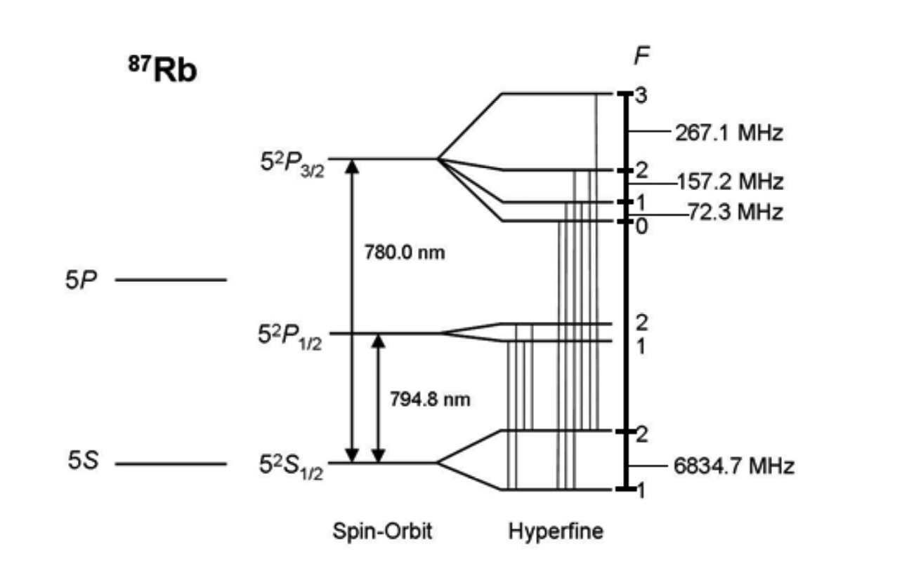
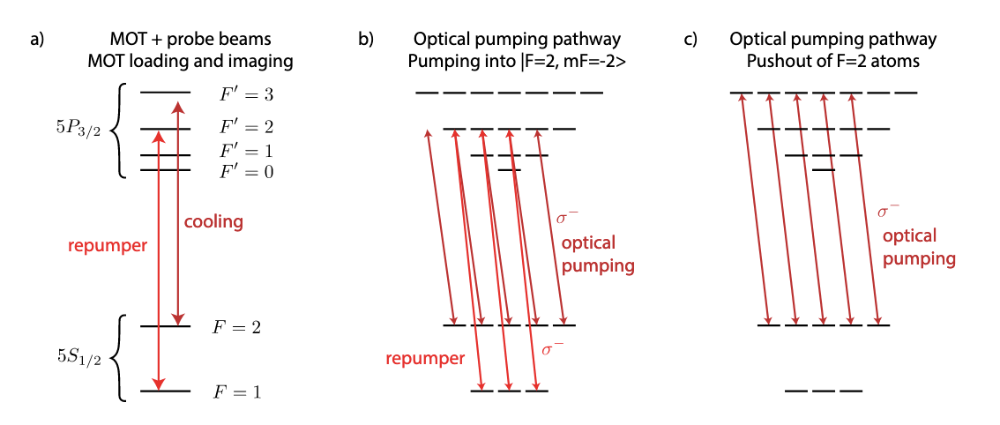
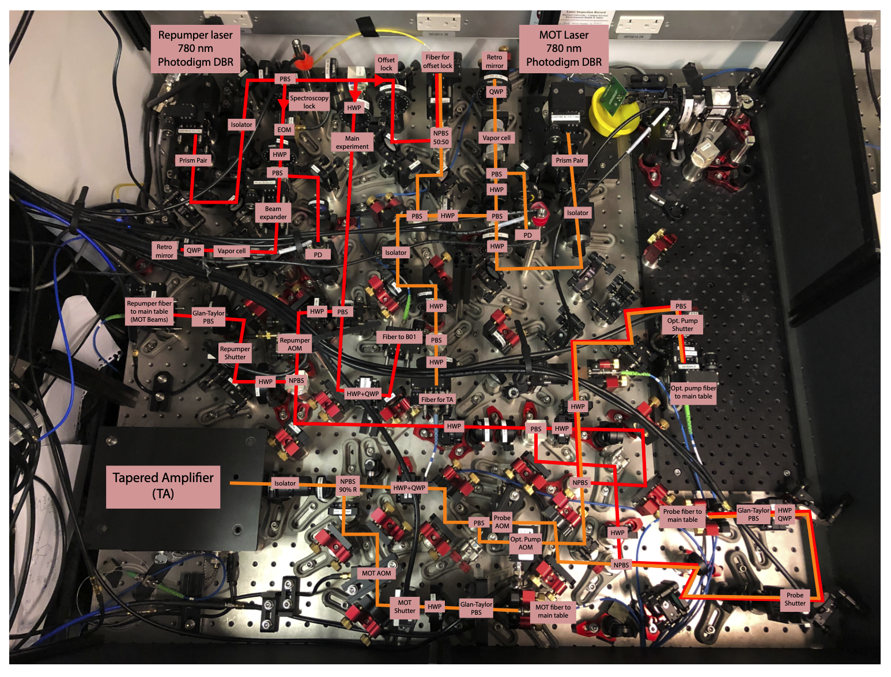

---
categories:
- Lasers
date: '2026-01-08'
lang: en
resources:
- Rb87_properties.pdf
title: Rb87实验激光汇总
---

## Summary of Rb Properties

<object data="Rb87_properties.pdf" type="application/pdf" width="100%" height="800px">
    
Your browser cannot display PDF directly, please <a href="Rb87_properties.pdf">click here to download</a> and view.

</object>

::: {#fig-Rbproperties fig-cap="" fig-align="center"}

:::

The current MOT optical path in the Hefeilab is shown in Figure @fig-MOThefei:

::: {#fig-MOThefei fig-cap="" fig-align="center"}

:::

## Cooling Laser Setup

::: {#fig-coolingdemo fig-cap="" fig-align="center"}

:::

The involved laser wavelength is 780 nm, mainly used for:

### 1. Repumper Light

* **Transition**: Drives the transition from ground state $5S_{1/2}, F=1$ to excited state $5P_{3/2}, F' = 2$.
* **Function**: Pumps atoms that have fallen into a dark state ($F=1$) back into the cycling transition ($F=2$).

::: {.callout-note appearance="simple"}
**Technical Implementation Details**:
The laser is first locked onto the **crossover peak (Crossover)** between $F = 1 \to F' = 1$ and $F = 1 \to F' = 2$, then shifted in frequency by **+78.5 MHz** via an acousto-optic modulator (AOM) to precisely match the resonance at $F = 1 \to F' = 2$.
:::

### 2. Cooling Light

* **Transition**: Drives a cycling transition from ground state $5S_{1/2}, F=2$ to excited state $5P_{3/2}, F' = 3$, used in conjunction with the Repumper.
* **Function**: MOT capture and Doppler cooling.

::: {.callout-tip appearance="simple"}
**Principle**:
Utilizes laser cooling principles (Doppler cooling) by generating scattering forces through red-detuned beams to slow down and trap atoms in a potential well center.
:::

### 3. Optical Pumping Light

* **Transition**: Drives the transition from ground state $5S_{1/2}, F=2$ to excited state $5P_{3/2}, F' = 2$, $\sigma^+$ (+1 polarization) or $\sigma^-$, used in conjunction with the Repumper.
* **Function**: Quantum state initialization.

::: {.callout-note appearance="simple"}
**Physical Process**:
Forces the magnetic quantum number of atoms to a specific state (dark state).
For example: Using $\sigma^+$ circularly polarized light pumps atoms into the $|F=2, m_F=2\rangle$ state (as shown in Figure (b)).
:::

### 4. Depumping Light

* **Transition**: Drives the transition from ground state $5S_{1/2}, F=2$ to excited state $5P_{3/2}, F' = 2$, no polarization requirement, not used with Repumper.
* **Function**: Used for state cleaning and auxiliary readout. Transfers all $F=2$ state atoms to the $F=1$ state.

::: {.callout-warning appearance="simple"}
**Readout Verification Logic**:
Quantum bits are encoded in $F=1$ (dark) and $F=2$ (bright).
To distinguish between "atom is in F=1" and "atom lost", double imaging verification is typically used:

1.  **First Image**: Direct imaging. Seeing a bright spot $\rightarrow$ confirms the atom is in $F=2$.

2.  **Operation**: Use Depumping light to force all $F=2$ atoms into $F=1$.

3.  **Second Image**: Re-imaging. This should theoretically be completely dark.
    * This image is used for **subtracting background noise** (such as glass reflections).
    * If there are still bright spots, it indicates stray light rather than atomic signals.
:::

### 5. Push-out / Blow-away Light

* **Transition**: Drives the transition from ground state $5S_{1/2}, F=2$ to excited state $5P_{3/2}, F' = 3$ (resonant), not used with Repumper.
* **Function**: State-selective removal.

::: {.callout-important appearance="simple"}
**Mechanism**:
During the readout phase, to distinguish between atoms in the $F=2$ state and those in the $F=1$ state:
A strong beam resonant at $F=2 \to F' = 3$ is used to illuminate the atoms without adding repumping light.
* $F=2$ atoms: Experience intense scattering and are pushed away.
* $F=1$ atoms: Remain due to large detuning.
:::

<!-- Schematic diagram from Lukin's article as shown in Figure @fig-MOTlukin:

::: {#fig-MOTlukin fig-cap="" fig-align="center"}

::: -->