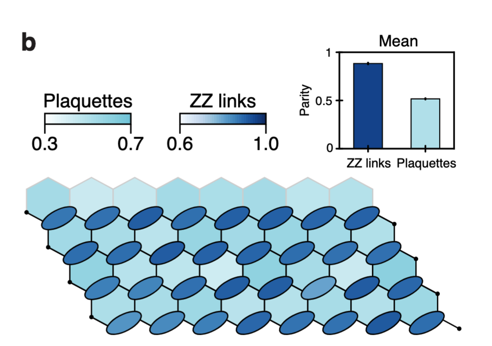
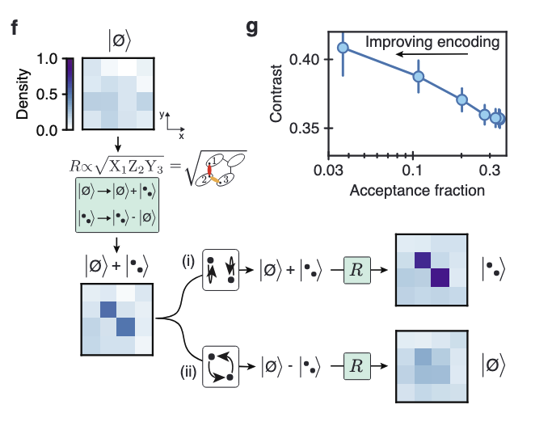
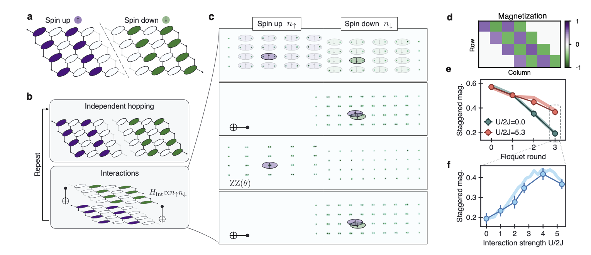

---
categories:
- Readings
date: 2026-03-16
description: 'Notes on the honeycomb model and its equivalence to a free Majorana fermion Hamiltonian.'
lang: en
title: 'Digital Experiment on Honeycomb Model'
bibliography: refs.bib
---

# Summary and questions

For those who are interested in the theoretical background of the honeycomb model, you may refer to the [Honeycomb Model](/theory/Posts/topo_matter/honeycomb.qmd) page for more details.

The Kitaev honeycomb model is defined on a hexagonal lattice with spin-1/2 degrees of freedom and bond-dependent Ising interactions:
$$
H = -J_x \sum_{\text{x-links}} \sigma_i^x \sigma_j^x - J_y \sum_{\text{y-links}} \sigma_i^y \sigma_j^y - J_z \sum_{\text{z-links}} \sigma_i^z \sigma_j^z,
$$
where each bond type ($x$, $y$, $z$) appears on one of the three orientations of the honeycomb. The model has an extensive set of conserved plaquette operators $W_p = \sigma_1^x \sigma_2^y \sigma_3^z \sigma_4^x \sigma_5^y \sigma_6^z$ (one per hexagon), which reduces the problem to free Majorana fermions in each flux sector. The phase diagram has two regimes: gapped Abelian phases (A) when one coupling dominates, and a gapless non-Abelian phase (B) in the interior of the triangle $|J_\alpha| \leq |J_\beta| + |J_\gamma|$ for all permutations — the latter hosts Chern number $C = \pm 1$ when a time-reversal-breaking perturbation opens a gap.

# Digital Experiment Overview

#### Initialization and moving across the phase
To ensure that the prepared state is the ground state of the Kitaev honeycomb model, we need to first prepare the state in the vortex free phase at $J_x = J_y = 0$ and $J_z = J$. That is, a state:

1. One of the ground state of the Hamiltonian $H =-\sum_{j,k} J\sigma^z_j\sigma_k^z$, whose ground state is degenerate and satisfies $\sigma_j^z\sigma_k^z = +1$.
2. Further pinned down the ground state by requiring the conserved quantity $W_p := \sigma_1^x \sigma_2^y \sigma_3^z \sigma_4^x\sigma_5^y \sigma_6^z$ being $+1$, as the free section.

In [@evered2025probing], Lukin *et al.* proposed a method to prepare this state by projecting to the XZZX code space, as shown in the following figure and include the steps below:

:::{.callout-tip collapse="false"}
## Experiment protocol: Initialization circuit
1. Ancilla qubits are used to measure weight-4 operators on one sublattice of the data qubits, initially all prepared in $|0\rangle$. Note that the first $CZ$ gate can be omitted because all qubits are prepared in $|0\rangle$.
2. According to ancilla measurement outcomes, apply conditional local single-qubit Z gates.
3. Parallel controlled-Y gates between sublattices to spread the weight-4 operators to the weight-6 plaquette operators and $Z$ operators to $ZZ$ operators.
:::

To further achieve the state of $J_x = J_y = J_z$, one can adiabatically evolve slowly adjusting $J_x,J_y$, but @evered2025probing point out that this evolution requires too long time, and the accumulated system errors/noises are too large. Noticing that $Q_H=\langle \psi_B |U_D(\{\theta\})\ket{\psi_Z}$ can be efficiently calculated by matchgate simulation, where $\psi_Z,\psi_B$ are the ground states of $J_x= J_y = 0$ and $J_x=J_y=J_z$ (both satisfy $W_p = +1$), they use a **numerically optimized depth-6 Floquet unitary circuit** to traverse the phase diagram — sufficient at this system size to probe all points of interest [@evered2025probing].

#### Probing the Chern number

The observable is the correlation function of majorana operators $\langle c_i c_j \rangle$ in each phase, which can be evaluated by estimating Pauli products based on the $c_ic_j \to \prod_k \sigma_k^{\alpha_k}$ rules that we proved before. 

Then we reconstruct the matrix $\Gamma_{ij} = \frac{i}{2}\braket{[c_i,c_j]}$, which can be used to reproduced the free-fermion model $H = \frac{i}{4} \sum c_i A_{ij} c_j$ according to the lemma below:

:::{#lem-reconstruct-matrix .callout-important icon="false"}
## (Reconstruction of the correlation matrix)
Given that the free-fermion model is $H = \frac{i}{4} \sum c_i A_{ij} c_j$, and the matrix $A$ is given by
$$
A = O \begin{pmatrix} \ddots & & \\ & \begin{matrix} 0 & \epsilon_m \\ -\epsilon_m & 0 \end{matrix} & \\ & & \ddots \end{pmatrix} O^T
$$
The matrix $\Gamma_{ij} = \frac{i}{2}\braket{[c_i,c_j]}$ then satisfied the condition:
$$
\Gamma = O \begin{pmatrix} \ddots & & \\ & \begin{matrix} 0 & 1 \\ -1 & 0 \end{matrix} & \\ & & \ddots \end{pmatrix} O^T
$$
:::

:::{.callout-note collapse="true"}
## Proof (Click to expand)
The free-fermion Hamiltonian $H = \frac{i}{4}\sum_{ij} A_{ij} c_i c_j$ with real antisymmetric $A$ can be brought to canonical form via an orthogonal transformation $O$:
$$
A = O \begin{pmatrix} \ddots \\ & \begin{matrix} 0 & \epsilon_m \\ -\epsilon_m & 0 \end{matrix} \\ & & \ddots \end{pmatrix} O^T,
$$
so that $H = \sum_m \frac{\epsilon_m}{2}(2 b_m^\dagger b_m - 1)$ where $b_m = (d_{2m} + i d_{2m+1})/2$ are the normal-mode fermions in the rotated Majorana basis $d = O^T c$.

At zero temperature the ground state fills all negative-energy modes: $\langle b_m^\dagger b_m \rangle = \theta(-\epsilon_m)$. In the normal-mode basis the correlation matrix is diagonal:
$$
\tilde{\Gamma}_{2m,2m+1} = \frac{i}{2}\langle [d_{2m}, d_{2m+1}] \rangle = i\langle d_{2m} d_{2m+1}\rangle = -\text{sgn}(\epsilon_m).
$$
For the ground state of a gapped system all $\text{sgn}(\epsilon_m) = +1$ (choosing the convention $\epsilon_m > 0$), giving $\tilde{\Gamma}_{2m,2m+1} = -1$ and $\tilde{\Gamma}_{2m+1,2m} = +1$. Rotating back to the original basis $\Gamma = O \tilde{\Gamma} O^T$ yields the claimed block-diagonal form with entries $\pm 1$ instead of $\pm \epsilon_m$. Geometrically, $\Gamma$ is the "flattened" version of $A$: it retains the eigenvectors (band topology) but replaces each eigenvalue by its sign. This is exactly why the Chern number computed from $\Gamma$ equals that of $A$.
:::

This means that the correlation matrix it self can be used to reproduce the chern number of the equivalent free-fermion model.

#### Construct free-fermions on the honeycomb lattice

Construct the complex composition $a_J = (c_j + i c_{j'})/2$, where $j,j'$ as the adjacent ZZ link.
Thus $c_j = a_J + a_J^\dagger, c_{j'} = -i(a_J - a_J^\dagger)$.
This generates a fermion operator $a_J^\dagger, a_J$ on the honeycomb lattice. Noticing that 
$$
\begin{align}
&\sigma_{j}^z \sigma_{j'}^z \propto c_j c_{j'} = a_J a_J^\dagger - a_J^\dagger a_J = 2 n_J -1 \\
&\sigma_{j}^{x/y} \sigma_{k'}^{x/y} \propto c_j c_{k'}  = a_J a_{K} - a_J^\dagger a_{K}^\dagger + a_J^\dagger a_{K'} - a_J a_{K}^\dagger.
\end{align}
$$
Thus we can rewrite the honeycomb Hamiltonian in terms of such ZZ-paired fermions, we got the equivalent fermion Hamiltonian:
$$
H = \sum_{\langle I,J \rangle_{X,Y}} J_{X/Y} \underbrace{(a_I^\dagger a_J + a_J^\dagger a_I)}_{\text{free Hopping}} + \sum_{\langle I,J \rangle_{X,Y}} J_{X/Y} \underbrace{(a_I a_J + a_J^\dagger a_I^\dagger)}_{\text{Pairing}} + \sum_{I} J_Z \underbrace{(2n_I - 1)}_{\text{Local potential}}
$$

In the experiment in @evered2025probing, they:

:::{.callout-tip collapse="false"}
## Experiment protocol: Fermion hopping
1. Set up $J_{X,Y} = J, J_Z = 8J$, which indicates no fermion pair generation
2. Set up the initial state at $(n_J, n_{J+1}) = (1,1)$ case and $(n_J, n_{J+2}) = (1,1)$ case. 
3. Evolve the initial state for steps $d = 12$ using floquet engineering
4. Measure the density-density correlations $G_{ij} = \langle n_i n_j \rangle - \langle n_i \rangle \langle n_j \rangle$ for $j = J$ and $i = J \pm 1, J \pm 2,\cdots$.
:::

It is observed that near fermion are excluded. 

Notice that  $XZY \propto i c_I c_J = a_I^\dagger a_J + a_J^\dagger a_I + a_I a_J + a_I^\dagger a_J^\dagger$. Thus by implementing $XZY$ on the vacuum state, we can generate a two-fermion state ( the effect of $a_I^\dagger a_J,  a_J^\dagger a_I, a_I a_J$ are canceled).
To exchange the two fermions, we notice that:

:::{.callout-tip collapse="false"}
## Experiment protocol: Fermion exchange statistics
1. Implementing $\sqrt{XZY}$ on the vacuum state.
2. Exchange the electrons with different patterns (exchange or not exchanged)
3. Implementing $\sqrt{XZY}$ again
4. Observe the $\langle Z_i Z_{i'}\rangle$ and $\langle Z_j Z_{j'}\rangle$ to get the fermion exchange statistics.
:::

$$
\begin{align}
&Z_{i'} Y_i Y_j Z_{j'} = (a_I^\dagger a_J + a_J^\dagger a_I) - (a_I a_J + a_I^\dagger a_J^\dagger),\\
& X_i X_j  = a_I^\dagger a_J + a_J^\dagger a_I + a_I a_J + a_I^\dagger a_J^\dagger.
\end{align}
$$
Thus we can realized the fermion exchange by implementing $(Z_{i'} Y_i Y_j Z_{j'}+X_i X_j)/2 =\exp(-i \frac{\pi}{4} (Z_{i'} Y_i Y_j Z_{j'}+X_i X_j))$. These two terms are commute, thus can be implemented separately.  For the four-body interaction, we can implement it by:
$$
\exp(-i \frac{\pi}{8} Z_{i'} Y_i Y_j Z_{j'}) = {\rm CZ}_{i'i} {\rm CZ}_{j'j} \cdot \exp(-i \frac{\pi}{8} X_i X_j) \cdot {\rm CZ}_{i'i} {\rm CZ}_{j'j}
$$

#### Simulating interacting fermions

To simulate the Fermi-Hubbard model, @evered2025probing split the array into two halves representing spin-up and spin-down, encoding a **16-site square lattice** using **32 physical qubits** (each fermion site maps to 2 qubits via ZZ-pairing, 16 sites × 2 qubits/site = 32) to encode $a_{\sigma = \uparrow,i}, a_{\sigma = \downarrow,i}$ separately.  The Hamiltonian is:
$$
H_{FH} =  \sum_{\sigma \in \uparrow, \downarrow} \sum_{\langle i,j \rangle} (a_{\sigma,i}^\dagger a_{\sigma,j} + a_{\sigma,j}^\dagger a_{\sigma,i}) + U \sum_{i} n_{\uparrow,i} n_{\downarrow,i},
$$
The free terms are realized by
$$
H_{\text{hopping}} = \sum_{\langle i,j \rangle, \sigma} \frac{1}{2} \Big( X_{\sigma,i} X_{\sigma,j} + Z_{\sigma,i'} Y_{\sigma,i} Y_{\sigma,j} Z_{\sigma,j'} \Big)
$$
The interaction terms are realized based on the decomposition of $H_{\text{interaction}} := n_{\uparrow,i} n_{\downarrow,i}$:
$$
\begin{align*}
H_{\text{interaction}} &= \frac{1 - Z_{i\uparrow}Z_{i'\uparrow}}{2} \cdot \frac{1 - Z_{i\downarrow}Z_{i'\downarrow}}{2} \\
&= \frac{1}{4} \Big( 1 - Z_{i\uparrow}Z_{i'\uparrow} - Z_{i\downarrow}Z_{i'\downarrow} + Z_{i\uparrow}Z_{i'\uparrow}Z_{i\downarrow}Z_{i'\downarrow} \Big)
\end{align*}
$$
Thus depending on the realization of 4-body interaction $Z_{i\uparrow}Z_{i'\uparrow}Z_{i\downarrow}Z_{i'\downarrow}$. This is again compiled into $ZZ(\theta)$ gate as
$$
CNOT^{\otimes 2} \cdot \exp(-i \theta Z_{i\downarrow}Z_{i'\downarrow}) \cdot CNOT^{\otimes 2} \equiv \exp(-i \theta Z_{i\uparrow}Z_{i'\uparrow}Z_{i\downarrow}Z_{i'\downarrow})
$$

:::{.callout-tip collapse="false"}
## Experiment protocol: Fermion extension
1. Initial with $n_{i\uparrow} = Z_{i\uparrow} Z_{i'\uparrow} = 1$ and $n_{i\downarrow} =  Z_{i\downarrow} Z_{i'\downarrow} = 1$
2. Evolve the system under $H_{\text{hopping}}$ and $H_{\text{interaction}}$
3. Measure the observable $M_{\text{stagg}}$ 
4. Repeat the experiment for different interaction strength $U$
5. Plot the result of $\langle n_{i \uparrow} - n_{i \downarrow} \rangle$ as a function of $U$
:::

The observable they chose is
$$
M_{\text{stagg}} = \frac{1}{N} \sum_i \epsilon_i (n_{i\uparrow} - n_{i\downarrow}),
$$
which can be measured by measuring the $\langle Z_{i\uparrow} Z_{i'\uparrow}\rangle$ and $\langle Z_{i\downarrow} Z_{i'\downarrow}\rangle$ for each site $i$, since $n_{i\sigma} = (1 - Z_{i\sigma}Z_{i'\sigma})/2$.
It has shown that in the free fermion case, $M_{\text{stagg}}$ will decrease to zero, while in the interacting case $U \gg J$, the $M_{\text{stagg}}$ will be kept large.

# Scientific Significance and Architecture Assessment

## What was observed and its value

| Aspect | Assessment |
|--------|-----------|
| **Novelty** | First digital quantum simulation of the Kitaev honeycomb model; first measurement of odd Chern number on a quantum processor; first direct probe of fermion exchange statistics in a synthetic topological system. |
| **Practical value** | Demonstrates that neutral atom digital circuits can prepare and probe non-Abelian topological phases — a prerequisite for topological quantum computation schemes. The Fermi-Hubbard simulation establishes the platform for correlated electron physics. |
| **Verification value** | Validates the free-fermion mapping of the Kitaev model experimentally; confirms that constant-depth measurement-feedforward circuits can prepare topological ground states. |

## Architecture comparison: Evered 2025 vs. Bluvstein 2024 (3-zone baseline)

The appropriate baseline is **Bluvstein 2024** [@bluvstein2024logical], which introduced the 3-zone architecture used here. Mid-circuit measurement and FPGA feedforward were already present in Bluvstein 2024; the new elements in Evered 2025 are tunable-angle CPHASE gates and the spin-to-position readout upgrade.

| Parameter | Evered 2025 | Bluvstein 2024 (3-zone baseline) | Impact on this experiment |
|-----------|-------------|----------------------------------|--------------------------|
| **Total atoms** | 104 (72 data + 32 ancilla) | 280 physical / 48 logical | 72 data qubits tile a cylindrical honeycomb; 32 ancilla enable mid-circuit measurement |
| **1Q gate fidelity** | Not independently benchmarked; "roughly similar to our other works" [@evered2025probing] | ~99.5% | No dedicated benchmark reported; inherited from prior generations |
| **CZ fidelity** | Not independently benchmarked; "roughly similar to our other works" [@evered2025probing] | 99.5% | Expected slight regression from closer intermediate-state detuning (3.3 GHz); each Floquet layer compounds this |
| **Tunable-angle CPHASE** | Numerically optimized per angle; **no standalone fidelity number reported** — only stated as "comparable to prior work" | N/A (fixed CZ only) | Fidelity likely similar to CZ but uncharacterized independently |
| **Rydberg state** | $n = 53$ (two-photon: 420 nm + 1013 nm) | $n = 70$ ($\lvert 70S_{1/2}\rangle$) | Lower $n$ enables closer atom spacing via smaller blockade radius |
| **Intermediate-state detuning** | 3.3 GHz | ~12 GHz [@bluvstein2024logical] | Closer detuning enables higher Rabi frequency at tighter atom spacing |
| **Reference readout fidelity** | 99.8% | 99.5% | Improved reference; in-run value degraded to ~96–97% (see below) |
| **Tunable-angle gates** | $ZZ(\theta)$ via shaped Rydberg pulses | Fixed CZ | **New in Evered 2025** — required for Trotterized Floquet evolution across the Kitaev phase diagram |
| **Mid-circuit measurement** | Yes (32 ancilla, FPGA feedforward) | Yes | Enables deterministic plaquette preparation; carries over from Bluvstein 2024 |
| **Circuit depth achieved** | Depth-12 (fermion quench dynamics) | Depth ~50–66 (logical) | Physical circuit depth here limited by readout degradation, not gate count |
| **Hyperfine $T_2$** | >1 s (clock states) | ~1 s | Coherence is not the limiting factor; readout degradation dominates |

The key **new** hardware capability in Evered 2025 over Bluvstein 2024 is the **tunable-angle CPHASE gate** — this is what makes continuous Hamiltonian parameter sweeps across the Kitaev phase diagram possible.

## Critical technique needing optimization

**Dominant bottleneck: In-run readout fidelity degradation.**

The single most important limiting factor in this experiment is not gate fidelity but **readout fidelity degradation** during the experimental run. The trap laser power decreased over the course of data collection, reducing the operational imaging fidelity from the reference value of 99.8% to **~96–97%** [@evered2025probing, Methods]. This directly caps the acceptance fraction in postselected protocols:

- The fermion exchange statistics protocol requires sequential loss-radius postselection across multiple ancilla rounds; with ~96–97% per-shot readout fidelity over 32 ancilla qubits, the acceptance fraction drops to **1–7%** per shot.
- This is not improvable by increasing circuit depth — the degradation worsens over time, making longer experiments less accurate, not more.

**Gate fidelity accumulation is secondary.** The deepest circuit in the experiment is depth-12 (fermion quench dynamics), operating on 72 data qubits arranged so each Floquet step involves $O(72)$ parallel 2-qubit gates, not all qubits simultaneously. Evered 2025 does not report a standalone CZ fidelity, stating only that gate fidelities are "roughly similar to our other works" [@evered2025probing]. Assuming ~99.5% (the Bluvstein 2024 value) with maximum depth-12:

$$
(0.995)^{12} \approx 94\%
$$

per qubit per Floquet layer — still substantially better than the readout budget. Gate fidelity is not the limiting factor at current depths.

**Path to improvement:** Stabilizing the trap laser power over the experimental run would recover ~3–4% per-shot readout fidelity and substantially increase exchange measurement acceptance fractions. Gate fidelity improvements would become the limiting factor only once readout degradation is addressed.

## Completeness check

**Circuit depths** (from [@evered2025probing] §III):

| Sub-experiment | Circuit depth |
|----------------|--------------|
| Initialization (weight-4 stabilizers) | Depth-3 |
| Initialization (full, including CY) | Depth-4 |
| Floquet phase diagram | Depth-6 |
| Fermion quench dynamics | Depth-12 |
| Fermi-Hubbard dynamics | Depth-11 |

**Chern number result:** The paper reports $C = 1$ in the non-Abelian phase B and $C = 0$ in the Abelian phase A. Critically, this is **not a direct topological invariant measurement** — the Chern number is inferred indirectly via a three-step procedure [@evered2025probing, Methods]:

1. Measure real-space two-point Majorana correlators $\langle c_i c_j \rangle$ (equivalently, the correlation matrix $\Gamma_{ij}$) on the quantum processor.
2. From $\Gamma$, reconstruct a momentum-space parent Hamiltonian $H_k$ using the reconstruction lemma (see @lem-reconstruct-matrix above): the eigenvalues of $\Gamma$ encode the BdG band structure of the equivalent free-fermion model.
3. Numerically evaluate the Chern number from the reconstructed $H_k$ on a discretized Brillouin zone.

The result $C = 1$ thus reflects the topology of the *reconstructed* Hamiltonian, validated against classically simulable system sizes. It rules out the trivial ($C=0$) phase and is consistent with non-Abelian topological order in the B phase.

**Key quantitative benchmarks** from [@evered2025probing]:

| Observable | Value |
|------------|-------|
| Plaquette parity $\langle W_p \rangle$ (raw) | 0.444(4) |
| Plaquette parity $\langle W_p \rangle$ (post error detection) | 0.57(1) |
| ZZ-link parity benchmark | 0.883(8) |
| Initial background fermion density | 5.9(5)% |

**Postselection acceptance fractions** by sub-experiment:

| Sub-experiment | Acceptance fraction |
|----------------|-------------------|
| String observables | 3–25% |
| Fermion quench dynamics | 65–86% |
| Fermion density correlations | ~61% |
| Exchange statistics | 1–7% |
| Fermi-Hubbard dynamics | 2–5% per round |

**Fermion exchange statistics:** The exchange protocol uses $\sqrt{XZY}$ sandwiching with loss-radius postselection. The acceptance fraction ranges from **1–7%** per shot depending on the number of ancilla rounds. The contrast between "exchanged" and "not exchanged" trajectories provides the signature of fermionic ($\pi$-phase) exchange statistics.

**Fermi-Hubbard $M_\text{stagg}$:** The simulation encodes spin-up and spin-down on **two halves of the array**, representing a **16-site square lattice** (32 physical qubits via ZZ-pairing). The circuit uses depth-11 Floquet rounds with the dimensionless interaction ratio $U/J$ varied up to 8 (with explicit benchmarks at $U/J = 1$ and $U/J = 8$). The staggered magnetization $M_\text{stagg}$ shows **non-monotonic behavior**: it decays rapidly at $U/J \to 0$ (free fermions spread out), is suppressed at intermediate coupling, and is partially recovered at large $U/J \gg 1$ where double-occupancy is energetically suppressed. This non-monotonic dependence on the interaction strength is the key signature of Hubbard physics.

Neutral atoms have a structural advantage for the honeycomb geometry: mid-circuit atom rearrangement provides native non-local connectivity, eliminating the SWAP overhead that would add $O(N)$ depth on a fixed grid. On trapped-ion platforms the limiting factor is gate clock speed (not fidelity), while on superconducting platforms the bottleneck is connectivity-limited routing (not coherence time).
