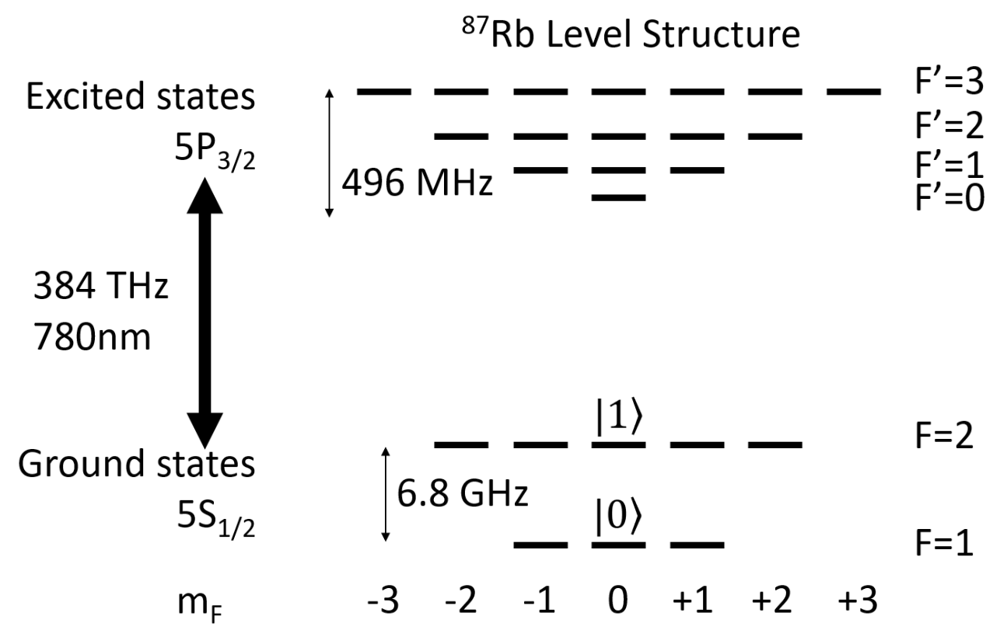
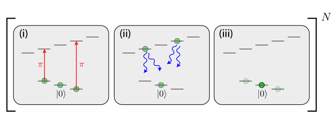

[← Back to Index](index.qmd)

# Overview

This page covers the two dominant neutral-atom qubit encodings — the optical clock qubit in $^{88}$Sr and the hyperfine qubit in $^{87}$Rb — and derives the single-qubit gate unitary, the Euler decomposition for universality, and the measurement protocols.

---

# Qubit Encodings {#sec-qubit-encoding}

## $^{88}$Sr: Optical Clock Qubit

:::{#def-sr-qubit .callout-note icon="false"}
## Definition: $^{88}$Sr qubit

$$
|g\rangle = 5s^2\,{^1S_0}, \qquad |c\rangle = 5s5p\,{^3P_0}.
$$

The $^1S_0 \to {^3P_0}$ clock transition at 698 nm has a natural linewidth $\Gamma_c/2\pi \approx 1$ mHz (lifetime $\sim100$ s). The transition is driven via two-photon excitation or direct single-photon coupling with a highly stabilized laser.
:::

Because $^{88}$Sr has zero nuclear spin ($I = 0$), the ground state has no hyperfine structure. The clock-state qubit is thus immune to the first-order Zeeman effect, and both qubit states experience identical trapping potentials at the magic wavelength 813.4 nm (see [Tweezer Arrays](tweezer_arrays.qmd)). These properties minimize two common dephasing channels: magnetic field noise and differential AC Stark shifts.

## $^{87}$Rb: Hyperfine Qubit

:::{#def-rb-qubit .callout-note icon="false"}
## Definition: $^{87}$Rb qubit

$$
|0\rangle = |5S_{1/2},\, F=1,\, m_F=0\rangle, \qquad |1\rangle = |5S_{1/2},\, F=2,\, m_F=0\rangle.
$$

The hyperfine splitting is 6.834 GHz. Both states are magnetically insensitive ($m_F = 0$) to first order in the applied field.
:::

The hyperfine qubit is manipulated by microwave radiation or two-photon Raman transitions. Rydberg excitation from $|1\rangle$ uses a two-photon process: a 420 nm laser drives $|5S_{1/2}\rangle \to |6P_{3/2}\rangle$ (detuned by $\Delta = 7.8$ GHz), and a 1013 nm laser completes $|6P_{3/2}\rangle \to |53S_{1/2}\rangle$. The intermediate states $|6P_{3/2}, F=1,2,3, m_F=+1\rangle$ are resolved by their hyperfine structure, requiring careful CG-coefficient bookkeeping (see [Two-Qubit Gates](two_qubit_gates.qmd)).

---

# Single-Qubit Gate Unitary {#sec-single-qubit-gate}

## Gate from Rabi Oscillations

From the interaction-picture Hamiltonian in [Light-Atom Interaction](light_atom.qmd#eq-H-interaction), the time-evolution operator over duration $t$ (with constant $\Omega$ and $\delta$) in the rotating frame is

$$
U(\theta, \phi) = \begin{pmatrix}
\cos\theta & -i\sin\theta\, e^{i\phi} \\
-i\sin\theta\, e^{-i\phi} & \cos\theta
\end{pmatrix},
$$ {#eq-single-qubit-U}

where $\theta = \Omega t/2$ is the rotation angle and $\phi = \delta t$ is the accumulated phase. In the rotating frame, $|0\rangle = e^{-i\delta t/2}|g\rangle$ and $|1\rangle = e^{i\delta t/2}|c\rangle$, so the measurement of these basis states is equivalent to measuring the ground and clock states.

## Euler Decomposition: Universal Single-Qubit Gates

Standard choices generate $X$- and $Y$-rotations:

$$
R_x(\alpha) = U\!\left(\frac{\alpha}{2}, 0\right), \qquad R_y(\alpha) = U\!\left(\frac{\alpha}{2}, -\frac{\pi}{2}\right).
$$

Any $\text{SU}(2)$ gate admits an Euler decomposition:

$$
U = e^{i\psi}\, R_z(-\beta)\, R_y(\gamma)\, R_z(-\delta_E),
$$ {#eq-euler}

where $R_z(\varphi) = e^{-i\varphi\sigma_z/2}$. Since $R_z(\varphi) = R_y(-\pi/2)\,R_x(\varphi)\,R_y(\pi/2)$, any arbitrary single-qubit gate is decomposable into a sequence of $R_x$ and $R_y$ rotations, both of which are directly accessible via @eq-single-qubit-U.

The AOMs and AODs used to deliver the gate laser are driven by arbitrary waveform generators (AWGs) that control $\Omega(t)$ and $\delta(t)$ with nanosecond resolution. Single-qubit addressing with low inter-site crosstalk has been demonstrated [@PhysRevLett.119.053202].

---

# Measurement Protocols {#sec-measurement}

## $^{87}$Rb: Destructive Measurement

The most direct measurement method utilizes the difference in $780\,\text{nm}$ laser scattering rates between the two hyperfine levels (@fig-measurement). For the transition from $|1\rangle, |0\rangle$ to $5P_{3/2}$, $F' = 3$, the photon scattering rates are on the order of $10^6\,\text{s}^{-1}$ and $1\,\text{s}^{-1}$ respectively. A threshold $n_{\rm th}$ for detected photons can be set, with counts below this threshold classified as the $|0\rangle$ state.

{#fig-measurement width=50%}

This simple protocol has practical limitations: (i) the $|1\rangle$ state can be heated by the detection light, leading to rapid atom loss from shallow optical traps — and since lost atoms produce no fluorescence, they are indistinguishable from $|0\rangle$ state; (ii) atoms excited to $5P_{3/2}$ have a non-zero probability of decaying to dark states or back to other computational states, causing measurement errors.

## $^{87}$Rb: Push-Out Measurement

The push-out protocol [@PhysRevLett.123.170503] addresses these issues:

1. A resonant 780 nm laser drives the $|F=2\rangle \to |F'=3\rangle$ cycling transition, rapidly heating $|1\rangle$-state atoms until they escape the tweezer.
2. The remaining $|0\rangle$-state atoms are detected by fluorescence imaging (analogous to [imaging](trapping_cooling.qmd#sec-imaging)).

**Error sources.** (i) Atom loss during the gate sequence is indistinguishable from $|0\rangle$ occupation. (ii) The 780 nm laser has non-zero scattering on dark $5P_{3/2}$ states, causing occasional misclassification. (iii) Re-loading from the background gas during the push-out step.

A fast, non-destructive alternative using the quantum Zeno effect and strong coupling cavities is discussed in [@Shea_measurement].

## $^{88}$Sr: Two-Color Imaging

For $^{88}$Sr, both qubit states are trapped identically (magic wavelength), so push-out is less applicable. Instead, the clock-state population is shelved: atoms in $|c\rangle = {^3P_0}$ are invisible to the 461 nm imaging light (which drives $|g\rangle \to {^1P_1}$). Applying 461 nm simultaneously with 689 nm Sisyphus cooling, only $|g\rangle$-state atoms scatter photons and are detected. The detected signal directly measures $\langle P_{|g\rangle}\rangle$, from which the qubit state is inferred.

## Initialization

**$^{87}$Rb**: optical pumping transfers all atoms in the ground state manifold $5S_{1/2}$ into the hyperfine state $|0\rangle = |5S_{1/2}, F=1, m_F=0\rangle$ via $\sigma_+/\sigma_-$ cycling, as demonstrated in [@PhysRevLett.123.170503]. The process is shown in @fig-initialization.

{#fig-initialization width=50%}

**$^{88}$Sr**: atoms load into $|g\rangle = {^1S_0}$ naturally (the ground state); a preparation step may optionally apply an $R_x(\pi)$ pulse to initialize in $|c\rangle$.
