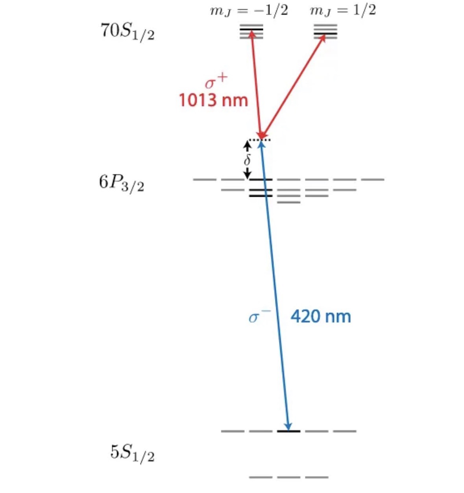

## Introduction

In this section, we give the real simulation of $\text{CPHASE}$ gate used by Evered \emph{et.al.}~\cite{Evered_2023}, based on $^{87}Rb$ atoms.
Experimental setting is shown in Figure @fig-Real_Rb_Elevel:

::: {#fig-Real_Rb_Elevel fig-cap="" fig-align="center"}

:::

We sequentially choose the basis states $\ket{0}: \{5S_{1/2}, F = 1, m_F = 0\}$ and $\ket{1}: \{5S_{1/2}, F = 2, m_F = 0\}$ as the qubit space. The intermediate states, obtained through $420\text{nm}$  $\sigma_-$ light with large blue-detuning $\Delta = 6.1 \text{GHz}$, consist of three levels split by hyperfine structure:
$$
\ket{2}, \ket{3}, \ket{4} = \{6P_{3/2}, F = 1, 2, 3, m_F = -1\}
$$
For Rydberg levels, the dominant term in the electronic Hamiltonian is $\vec{B} \cdot (\vec{L} + \vec{S})$, far greater than the coupling term of nuclear spin $\vec{I} \cdot (\vec{L} + \vec{S})$. Viewing nuclear spin coupling as a perturbation, the unperturbed Hamiltonian commutes with $L^2$, $S^2$, $J^2$, and $J_z$, hence the choice of the $m_j$ representation.
We aim to excite atoms to $\ket{5} = \{70S_{1/2}, m_j = -1/2\}$ using $1013\text{nm}$ $\sigma_+$ light. However, the intermediate state $\{6P_{3/2}, F = 1, 2, 3, m_F = -1\}$ have components $\{6P_{3/2}, m_j = -3/2\}$ and components $\{6P_{3/2}, m_j = -1/2\}$, atoms will inevitably be excited to $\ket{6} = \{70S_{1/2}, m_j = +1/2\}$. In the experiment, a magnetic field is applied to induce a $24$ MHz splitting between $\ket{5}$ and $\ket{6}$ to mitigate this effect.


### The derivation of the Hamiltonian
In protocols of Control-Z gate, the decreasing of the gate time will not only speed up the computation but also mitigate the decay error on the Rydberg states. 
However, For most one-photon process of the the Rydberg excitation, the frequency of the laser is high thus hard to increase the intensity. 
Considering one atom with energy level $\{\omega_{r_j}\}_{j =0}^{m_r}, \{\omega_{e_j}\}_{j = 0}^{m_e}$ and $\{\omega_{g_j}\}_{j = 0}^{m_g}$ and eigenstate
 $\{\ket{r_j}\}_{j =0}^{m_r}, \{\ket{e_j}\}_{j = 0}^{m_e}$ and $\{\ket{g_j}\}_{j = 0}^{m_g}$. Two laser light has electric vector $\mathbf{E}^{(1)}(t)$ and $\mathbf{E}^{(2)}(t)$ with 
 $$
 \mathbf{E}^{(j)}(t) = \left({\mathbf{E}^{(j)}_-}/{2}\right) e^{i \left(\omega^{(j)} t + \phi^{(j)}(t)\right)} + \left({\mathbf{E}_+^{(j)}}/{2}\right)e^{-i\left(\omega^{(j)} t + \phi^{(j)}(t)\right) },
 $$
 where $\mathbf{E}^{(j)}_- =E^{(j)} \cdot\{\mathbf{e}_x + i \mathbf{e}_y,\mathbf{e}_x - i \mathbf{e}_y,\mathbf{e}_z\}$ corresponds to three types of polarization $\{\sigma_{-}, \sigma_{+}, \sigma_{z}\}$. The Hamiltonian then can be written as:
 $$
 \begin{align*}
    H &= H_0  + e\mathbf{r} \cdot \mathbf{E}^{(1)}(t) + e\mathbf{r} \cdot \mathbf{E}^{(2)}(t)\\
    &= \sum_{j = 0}^{m_r}\hbar \omega_{r_j} \ket{r_j}\!\bra{r_j} + \sum_{j = 0}^{m_e}\hbar \omega_{e_j} \ket{e_j}\!\bra{e_j} +\sum_{j = 0}^{m_g}\hbar \omega_{g_j} \ket{g_j}\!\bra{g_j}  \\
    &+ \left(\sum_{j = 0}^{m_{g}}\sum_{jk= 0}^{m_e}\hbar \Omega_{jk,-}^{(1)}(t)/2 \exp[i(\omega_{e_0} - \omega_{g_0} -\Delta)t + i\phi_1(t)] \right)\ket{g_j}\bra{e_k} + c.c. \\
    &+ \left(\sum_{j = 0}^{m_{g}}\sum_{jk= 0}^{m_e}\hbar \Omega_{jk,+}^{(1)}(t)/2 \exp[-i(\omega_{e_0} - \omega_{g_0} -\Delta)t - i\phi_1(t)] \right)\ket{g_j}\bra{e_k} + c.c. \\
    &+\left(\sum_{j = 0}^{m_{e}}\sum_{jk= 0}^{m_r}\hbar \Omega^{(2)}_{jk,-}(t)/2 \exp[i(\omega_{r_0} - \omega_{e_0} +\Delta -\delta)t + i\phi_2(t)] \right)\ket{e_j}\bra{r_k} + c.c.\\
    &+\left(\sum_{j = 0}^{m_{e}}\sum_{jk= 0}^{m_r}\hbar \Omega^{(2)}_{jk,+}(t)/2 \exp[-i(\omega_{r_0} - \omega_{e_0} +\Delta -\delta)t - i\phi_2(t)] \right)\ket{e_j}\bra{r_k} + c.c.
    \end{align*}
 $$ {#eq-two_photon_H}
Here we use $\omega^{(1)} = \omega_{e_0} - \omega_{g_0} - \Delta$ and $\omega^{(2)} =  \omega_{r_0} - \omega_{e_0} + \Delta - \delta$ to represent two red-detuning laser frequency.
The parameter $\Omega^{(1,2)}_{jk,\pm}$ are decided by
$$
    \Omega^{(1)}_{jk,\pm} = \bra{g_j}e\mathbf{r} \cdot \mathbf{E}^{(1)}_{\pm}\ket{e_k}/\hbar,\quad \Omega^{(2)}_{jk,\pm} = \bra{e_j}e\mathbf{r} \cdot \mathbf{E}^{(2)}_{\pm}\ket{r_k}/\hbar.
$$
Consider the time-dependent unitary transition 
$$
    U(t) = \exp\left[{ i\omega_{g_0} t \sum_{j = 0}^{m_g} \ket{g_j}\!\bra{g_j} + i(\omega_{e_0} - \Delta)t \sum_{j = 0}^{m_e}\ket{e_j}\!\bra{e_j} + i(\omega_{r_0} - \delta)t \sum_{j = 0}^{m_r}\ket{r_j}\!\bra{r_j}}\right].
$$
Using the rotating wave approximation, we ignore the fast oscillating term and gives the Hamiltonian:
$$
\begin{align*}
    &H' = i \hbar \frac{dU}{dt} U^{\dagger} + UHU^\dagger\\
    &= \sum_{j = 0}^{m_r}\hbar (\delta + \omega_{r_j} - \omega_{r_0}) \ket{r_j}\!\bra{r_j} + \sum_{j = 0}^{m_e}\hbar (\Delta + \omega_{e_j} - \omega_{{e_0}}) \ket{e_j}\!\bra{e_j} + \sum_{j = 0}^{m_g}\hbar(\omega_{g_j} - \omega_{g_0})\ket{g_j}\!\bra{g_j}\\
    &\quad+ \sum_{j = 0}^{m_{g}}\sum_{jk= 0}^{m_e}\frac{\hbar \Omega_{jk,-}^{(1)}(t) e^{i \phi_1(t)}}{2} \ket{g_j}\!\bra{e_k} + c.c. + \sum_{j = 0}^{m_{e}}\sum_{jk= 0}^{m_r}\frac{\hbar \Omega^{(2)}_{jk,-}(t) e^{i \phi_2(t)}}{2} \ket{e_j}\!\bra{r_k} + c.c.~.
\end{align*}
$${#eq-two_photon_H}
For two atoms inside the Rydberg radius, we add the Rydberg interaction Hamiltonian 
$$
    H'_{\rm{int}} =\sum_{j,k = 0}^{m_r} C_6(jk)\cdot R^{-6} \ket{r_jr_k}\bra{r_jr_k}.
$$

In the case of $^{87}Rb$, we imposed two laser light $E^{(1)}, \sigma_{-}$ with wavelength $420~\mathrm{nm}$ and $E^{(2)},\sigma_{+}$ with wavelength $1013~\mathrm{nm}$.
 We keep the intensity $E^{(1)},E^{(2)}$ of both the laser unchanged and allow $420~nm$ light change its phase $\phi^{(1)}(t)$.
Using the notation $\text{CG}(j_1,m_1,j_2,m_2,j_3,m_3) = \langle j_1,m_1, j_2,m_2\ket{j_1,j_2,j_3,m_3}$, we are able to transfer from the hyperfine-basis $\{L^2,S^2,J^2,I^2,F^2,m_F\}$ into $\{L^2,S^2,J^2,I^2,m_J,m_I\}$ basis. For simplicity, we only specify the indexes $\{(J,I)F,m_F\} \to \{(J,I)m_J,m_I\}$ in the following.

$$
\begin{align*}
\ket{0} &= \ket{g_1} =\ket{5S_{1/2},F=1,m_F=0} \\
&= CG(1/2,1/2,1/2,-1/2,1,0)\ket{m_J = 1/2, m_I = -1/2} + CG(1/2,-1/2,1/2,1/2,1,0)\ket{ m_J = -1/2, m_I = 1/2}, \\
\ket{1} &= \ket{g_0} =\ket{5S_{1/2},F=2,m_F=0} \\
&= CG(1/2,1/2,1/2,-1/2,2,0)\ket{m_J = 1/2, m_I = -1/2} + CG(1/2,-1/2,1/2,1/2,2,0)\ket{ m_J = -1/2, m_I = 1/2}, \\
\ket{2} &= \ket{e_1} =\ket{6P_{3/2},F=1,m_F=-1} \\
&= CG(3/2,-3/2,3/2,1/2,1,-1)\ket{m_J = -3/2, m_I = 1/2} + CG(3/2,-1/2,3/2,-1/2,1,-1)\ket{ m_J = -1/2, m_I = -1/2} + CG(3/2,1/2,3/2,-3/2,1,-1)\ket{ m_J = 1/2, m_I = -3/2}, \\
\ket{3} &= \ket{e_0} =\ket{6P_{3/2},F=2,m_F=-1} \\
&= CG(3/2,-3/2,3/2,1/2,2,-1)\ket{m_J = -3/2, m_I = 1/2} + CG(3/2,-1/2,3/2,-1/2,2,-1)\ket{ m_J = -1/2, m_I = 1/2} + CG(3/2,1/2,3/2,-3/2,2,-1)\ket{ m_J = 1/2, m_I = -3/2}, \\
\ket{4} &= \ket{e_2} =\ket{6P_{3/2},F=3,m_F=-1} \\
&= CG(3/2,-3/2,3/2,1/2,3,-1)\ket{m_J = -3/2, m_I = 1/2} + CG(3/2,-1/2,3/2,-1/2,3,-1)\ket{ m_J = -1/2, m_I = 1/2} + CG(3/2,1/2,3/2,-3/2,3,-1)\ket{ m_J = 1/2, m_I = -3/2}, \\
\ket{5} &= \ket{r_0} =\ket{70S_{1/2}} = \ket{m_J = -1/2, m_I = 1/2}, \\
\ket{6} &= \ket{r_1} =\ket{70S_{1/2}} = \ket{m_J = 1/2, m_I = -1/2}.
\end{align*}
$$
The CG-coefficients involved can be calculated using python package directly, as shown below:
<!-- ```{python}
import sympy as sp
from sympy.physics.quantum import ClebschGordan

j1, m1, j2, m2, j3, m3 = sp.symbols('j1 m1 j2 m2 j3 m3')
CG = ClebschGordan(j1, m1, j2, m2, j3, m3)
print(CG.doit())
``` -->
We labeled $\Omega_{420}$ as the coupling coefficient:
$$
\begin{align*}
    \Omega_{420} =: {\langle \{6P_{3/2}, m_j = -3/2, m_I = 1/2\}| e\mathbf{r}\cdot \mathbf{E}_-^{(1)}|\{5S_{1/2}, m_j = -1/2, m_I = 1/2\} \rangle}/{\sqrt{2}\hbar},\\
    \gamma \Omega_{420} = {\langle \{6P_{3/2}, m_j = -1/2, m_I = -1/2\} | e\mathbf{r}\cdot\mathbf{E}_-^{(1)} | \{5S_{1/2}, m_j = 1/2, m_I = -1/2\}\rangle}/{\sqrt{2}\hbar} .
\end{align*}
$$

$$
\begin{align*}
\langle 2| H | 1 \rangle &= \text{CG}(3/2,-3/2,3/2,1/2,1,-1)\Omega_{420}/2 +\text{CG}(3/2,-1/2,3/2,-1/2,1,-1) \gamma \Omega_{420}/2 \\
&=\sqrt{0.3}\Omega_{420}/2 - \sqrt{0.4}\gamma \Omega_{420}/2 \\
\langle 3| H | 1 \rangle &= \text{CG}(3/2,-3/2,3/2,1/2,2,-1)\Omega_{420}/2 +\text{CG}(3/2,-1/2,3/2,-1/2,2,-1) \gamma \Omega_{420}/2 \\
&=-\sqrt{0.5}\Omega_{420}/2 \\
\langle 4| H | 1 \rangle &= \text{CG}(3/2,-3/2,3/2,1/2,3,-1)\Omega_{420}/2 +\text{CG}(3/2,-1/2,3/2,-1/2,3,-1) \gamma \Omega_{420}/2 \\
&=\sqrt{0.2}\Omega_{420}/2 + \sqrt{0.6}\gamma \Omega_{420}/2 
\end{align*}
$$
Similarly, the action of $1013~\mathrm{nm}$-laser can be expressed analogously. Define:
$$
\begin{align}
\Omega_{1013} &=: \langle\{70S_{1/2},m_j = -1/2,,m_I = 1/2\}| e\mathbf{r}\cdot \mathbf{E}_-^{(2)} |\{6P_{3/2},m_j = -3/2,m_I = 1/2\}\rangle/\hbar, \\
\beta \Omega_{1013} &=: \langle\{70S_{1/2},m_j = 1/2,m_I = -1/2\}| e\mathbf{r}\cdot \mathbf{E}_-^{(2)}|\{6P_{3/2},m_j = -1/2,,m_I = -1/2\}\rangle/\hbar,
\end{align}
$$
and we get the result
$$
\begin{align*}
\langle 5| H | 2 \rangle &= \text{CG}(3/2,-3/2,3/2,1/2,1,-1)\Omega_{1013}/2 = \sqrt{0.3}\Omega_{1013}/2   \\
\langle 5| H | 3 \rangle &= \text{CG}(3/2,-3/2,3/2,1/2,2,-1)\Omega_{1013}/2= -\sqrt{0.5}\Omega_{1013}/2   \\
\langle 5| H | 4 \rangle &= \text{CG}(3/2,-3/2,3/2,1/2,3,-1)\Omega_{1013}/2= \sqrt{0.2}\Omega_{1013}/2  \\
\langle 6| H | 2 \rangle &= \text{CG}(3/2,-1/2,3/2,-1/2,1,-1) \beta \Omega_{1013}/2= -\sqrt{0.4}\beta\Omega_{1013}/2  \\
\langle 6| H | 3 \rangle &= \text{CG}(3/2,-1/2,3/2,-1/2,2,-1) \beta \Omega_{1013}/2= 0  \\
\langle 6| H | 4 \rangle &= \text{CG}(3/2,-1/2,3/2,-1/2,3,-1) \beta \Omega_{1013}/2= \sqrt{0.6}\beta\Omega_{1013}/2 \\
\end{align*}
$$
The specific value of $\gamma,\beta$ can be obtained by integrating the wave function. Here, we directly use \verb|Arc| to obtain the result: $\gamma = \beta = \sqrt{1/3}$.
For simplicity,  we denote $\bra{i}H\ket{j} =: H_{ij}$. The process in Figure @fig-Real_Rb_Elevel is stimulated Raman transitions concerning three intermediate states $\{\ket{2},\ket{3},\ket{4}\}$. Noted that due to the detuning between two Rydberg states, we ignore the influence of state $\ket{6}$. We then write the Schrodinger equation according to @eq-two_photon_H.
$$
\begin{align}
    i\hbar \partial_t \psi_i &= (H_{i1} \psi_1 + H_{i5}\psi_5) + \Delta \psi_i \quad \forall~i = 2,3,4, \\ 
    i\hbar\partial_t \psi_5 &= \sum_{i = 2,3,4} H_{5i} \psi_i,\\
    i\hbar\partial_t \psi_1 &=  \sum_{i = 2,3,4} H_{1i} \psi_i.
\end{align}
$$
We can adiabatically eliminate the intermediate states through setting $\partial_t \psi_i = 0,~\forall~i = 3,4,5$. This then give the effective two-level transition between state $\ket{1}$ and state $\ket{5}$.
$$
\begin{align}
    i\hbar\partial_t \psi_5&=  -\sum_{i = 2,3,4} \frac{|H_{5i}|^2}{\Delta} \psi_5 - \left(\sum_{i = 2,3,4} \frac{H_{i1} H_{5i}}{\Delta}\right) \psi_1  ,\\
      i\hbar\partial_t \psi_1 &=  -\sum_{i = 2,3,4} \frac{|H_{1i}|^2}{\Delta} \psi_1 - \left(\sum_{i = 2,3,4} \frac{H_{i5} H_{1i}}{\Delta}\right) \psi_5  .
\end{align}
$$
Then the effective light-shift and the effective Rabi frequency write:
$$
\begin{align}
    \Delta_{\text{eff,5}} &= -\sum_{i = 2,3,4} \frac{|H_{5i}|^2} {\Delta} = -\frac{\Omega_{1013}^2}{4\Delta},\\
     \Delta_{\text{eff,1}} &= -\sum_{i = 2,3,4} \frac{|H_{1i}|^2} {\Delta} =-\left[ (\sqrt{0.3} - \sqrt{\frac{0.4}{3}})^2+(\sqrt{0.2} + \sqrt{\frac{0.6}{3}})^2 +0.5\right]\frac{\Omega_{420}^2}{4\Delta} =- \frac{4}{3} \frac{\Omega_{420}^2}{4\Delta},\\
    \Omega_{\text{eff}} &= -2\frac{\sum_{i = 2,3,4} H_{i1} H_{5i}}{\Delta} = -\frac{\Omega_{1013}\Omega_{420}}{2\Delta}.
\end{align}
$$

## Results
 I don't want to re-optimized the parameters. Do you think the  average fidelity's 
     setting where a00 are default as 1 can be understood as ignoring the global phase? i.e., in the current gate parameters, we 
     already get a gate 1,e^{i theta},e^{itheta},e^{i2\theta + \pi} however up to an unknown global phase. We may adjust the 
     12-sss, bell fidelity's behavior such that it find the global phase by calculating the 00's phase first and then compared 
     the realized gate with the (e^{i2\phi0},e^{i\phi1 + i \phi0},e^{i\phi1 + i\phi_0 },-e^{i2\phi1}). Note that we expect theta 
     in the priginal optimization is just \phi1 - \phi0.

To optimized the protocol, we note that in general, the Rydberg interaction implement a gate
$$
\begin{align}
    \ket{00} \to e^{i 2\phi_0} \ket{00}, \ket{01} \to e^{i (\phi_1 + \phi_0)} \ket{01}, \ket{10} \to e^{i (\phi_1 + \phi_0)} \ket{10}, \ket{11} \to -e^{i 2\phi_{11}} \ket{11}.
\end{align}
$$
To optimize. we simulate the whole process given input state $\ket{01}, ket{11}$ and evaluate their overlaps with the evovled states, then we denote $a_{01} =e^{-i \theta}\langle 01 | \psi(t) \rangle, a_{11} =e^{-i2 \theta} \langle 11 | \psi(t) \rangle$. Then the loss function is defined as:
$$
 \text{avg}_F = \frac{1}{20} * (|1 + 2 * a01 + a11|^2 + |1 + 2 * a01 - a11|^2 + |1 - 2 * a01 + a11|^2 + |1 - 2 * a01 - a11|^2)
 $$
This loss function turns out to be the average fidelity between

The result is shown in the figure below.
Then we test the Time-optimal strategy, as proposed in @jandura2022time. The time-optimal function can be written as:
$$
\begin{align}
    \varphi(t) = A_1 \sin(\omega t + \phi_1) + A_2 \cdot \sin(2 \omega t + \phi_2) + \delta t,
\end{align}
$$
with $\omega = 8.71374888 \times 10^{-1} \Omega_{\mathrm{eff}}, A_1 = 8.89646230 \times 10^{-1}, \phi_1 = -8.93893845\times 10^{-1}, A_2 = -6.67698078 \times 10^{-1}, \phi_2 = 1.35391702, \delta =  -1.97859545 \times 10^{-2} \Omega_{\mathrm{eff}}$. The gate time is chosen as $t_{\mathrm{gate}} = 2.62170756 \cdot ({2 \pi}/{\Omega_{\mathrm{eff}}})$. 


