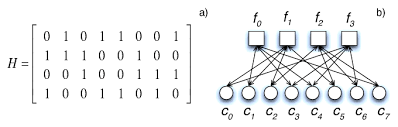

# Binary linear codes

All vector spaces in this note are over the binary field $\mathbb{F}_2$. Addition is componentwise XOR, so $1+1=0$. For $x\in\mathbb{F}_2^n$, its **Hamming weight** $|x|$ is the number of nonzero coordinates, and the Hamming distance is

$$
d_H(x,y)=|x-y|=|x+y|.
$$

::: {#def-classical-linear-code .callout-note icon="false"}
## Definition: linear code

An $[n,k,d]$ binary linear code is a $k$-dimensional subspace $C\subseteq\mathbb{F}_2^n$ with minimum distance

$$
d=\min_{c\in C\setminus\{0\}}|c|.
$$

A full-rank generator matrix $G\in\mathbb{F}_2^{k\times n}$ satisfies $C=\{uG:u\in\mathbb{F}_2^k\}$. A parity-check matrix $H\in\mathbb{F}_2^{m\times n}$ satisfies

$$
C=\ker H=\{c\in\mathbb{F}_2^n:Hc^{\mathsf T}=0\}.
$$
:::

Only the rank of $H$ determines the number of independent constraints. Consequently,

$$
k=n-\operatorname{rank}H,
$$

even when $H$ contains redundant rows.

## Repetition-code example

The $[3,1,3]$ repetition code has

$$
H=
\begin{pmatrix}
1&1&0\\
0&1&1
\end{pmatrix},
\qquad
C=\{000,111\}.
$$

The nonzero codeword has weight three, hence $d=3$. More generally, a code of distance $d$ detects every error of weight at most $d-1$ and uniquely corrects every error of weight at most $\lfloor(d-1)/2\rfloor$ [@hamming1950error].

# Channels, syndromes, and decoding objectives

Suppose a codeword $c$ is transmitted and an additive error $e$ occurs. The received word is $r=c+e$, and its syndrome is

$$
s=Hr^{\mathsf T}=H(c+e)^{\mathsf T}=He^{\mathsf T}.
$$

Thus a syndrome identifies an affine space of compatible errors,

$$
\mathcal E_s=\{e\in\mathbb{F}_2^n:He^{\mathsf T}=s\}.
$$

::: {#def-classical-bsc .callout-note icon="false"}
## Definition: binary symmetric channel

On a binary symmetric channel with crossover probability $p$, the coordinates of $e$ are independent and

$$
\Pr(e)=p^{|e|}(1-p)^{n-|e|}.
$$
:::

For $p<1/2$, maximizing $\Pr(e)$ over $\mathcal E_s$ is equivalent to minimizing $|e|$. For independent but nonidentical probabilities $p_i<1/2$, the exact negative-log-likelihood objective is, up to a constant independent of $e$,

$$
W(e)=\sum_{i=1}^n e_i\log\frac{1-p_i}{p_i}.
$$

::: {#def-classical-decoding-objectives .callout-note icon="false"}
## Definition: two likelihood conventions

**Error maximum-likelihood decoding** selects the most probable compatible error,

$$
\widehat e_{\mathrm{EML}}\in\arg\max_{e\in\mathcal E_s}\Pr(e).
$$

**Codeword maximum-likelihood decoding** selects the codeword most likely to have produced the received word. For a memoryless symmetric channel and a uniform prior on codewords, the two formulations are equivalent after translating by $r$.
:::

The analogous distinction becomes essential for quantum codes: the optimal logical decoder maximizes the total probability of an entire stabilizer coset, not the probability of one physical Pauli representative. See [Quantum Error-Correction Preliminaries](quantum-error-correction-preliminaries.qmd).

# Tanner graphs and factorization

::: {#def-classical-tanner-graph .callout-note icon="false"}
## Definition: Tanner graph

The Tanner graph of $H$ is the bipartite graph with

- variable nodes $v_1,\ldots,v_n$, one per column;
- check nodes $a_1,\ldots,a_m$, one per row; and
- an edge $(a_i,v_j)$ exactly when $H_{ij}=1$.

Write $N(a_i)=\{v_j:H_{ij}=1\}$ and $N(v_j)=\{a_i:H_{ij}=1\}$.
:::

{#fig-classical-tanner-graph fig-alt="A parity-check matrix next to its bipartite Tanner graph."}

For a prior $\pi_j(e_j)$ and observed syndrome $s$, the posterior has the factorization

$$
\Pr(e\mid s)\propto
\prod_{j=1}^n\pi_j(e_j)
\prod_{i=1}^m
\mathbf 1\!\left[
\bigoplus_{j\in N(a_i)}e_j=s_i
\right].
$$

This is a factor graph: variable nodes carry the $e_j$, while each check node carries a parity factor. Sum-product belief propagation exploits precisely this factorization.

# Low-density parity-check codes

::: {#def-classical-ldpc .callout-note icon="false"}
## Definition: LDPC family

A family $\{C_n\}$ is low-density parity-check (LDPC) if each $C_n$ admits a parity-check matrix whose row and column weights are bounded independently of block length $n$.
:::

Sparsity makes one round of local message passing linear in the number of Tanner-graph edges. Gallager introduced LDPC codes and their iterative decoding principles [@gallager1962low]; modern treatments connect them to graphical-model inference and density evolution [@mackay2003information; @richardson2008modern]. Sparse does not mean tree-like globally: finite-length Tanner graphs contain cycles, and short cycles correlate messages that belief propagation treats as independent.

# Decoder map

The notes in this section separate three computational ideas:

1. [Maximum-likelihood decoding and MWPM](../decoding/maximum-likelihood-and-mwpm.qmd) exploit a graph-like syndrome map.
2. [Belief propagation](../decoding/belief-propagation.qmd) approximates posterior marginals on a sparse factor graph.
3. [Ordered-statistics decoding](../decoding/ordered-statistics-decoding.qmd) uses soft information to solve the syndrome equation and search nearby candidates.

These algorithms solve related but not identical objectives. A valid correction only needs the right syndrome; a successful quantum correction must additionally lie in the correct logical coset.
