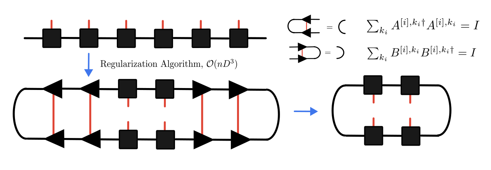

[<- Back to TN Simulation](index.qmd)

# Summary and questions

:::{.callout-important icon="false"}
## Questions
Given $|\Psi_{\mathrm{target}}\rangle=e^{-iH\Delta t}|\psi\rangle,$
the ideal fixed-bond-dimension projection would be
$$
|\phi_\star\rangle= \arg\min_{|\phi\rangle\in\mathcal{M}_\chi} \||\Psi_{\mathrm{target}}\rangle-|\phi\rangle\|^2 .
$$
However, a single TEBD/DMRG SVD only solves the local one-bond problem $\min_{\operatorname{rank}(\widetilde{\Theta})\le \chi}\|\Theta-\widetilde{\Theta}\|_F^2$ .
This is optimal for the current center tensor in orthonormal left and right bases, but not obviously the globally closest point on the full MPS manifold $\mathcal{M}_\chi$. Is this gap real, and has it been addressed systematically?
:::

:::{.callout-note icon="false" collapse="true"}
## Answer (Click to expand)
Yes. Canonical form makes the local metric correct, but it does not remove the non-convexity of the fixed-bond-dimension MPS manifold. Thus a local SVD is an exact Schmidt/Eckart--Young truncation for one active bond, not a general solution of the global projection problem on $\mathcal{M}_\chi$. Paeckel et al. explicitly distinguish successive SVD compression from variational compression: the former is fast and locally optimal at each bond, while the latter directly optimizes the Hilbert-space distance but is still a nonlinear sweep problem [@paeckel2019timeevolution]. Schollwöck makes the same distinction between SVD compression and variational compression for MPS [@schollwock2011dmrg].

For time evolution, the systematic fixes are:

1. **Variational compression / variational MPO-MPS application.** Instead of accepting the greedy SVD result, one directly solves
$$
\min_{|\phi\rangle\in\mathcal{M}_\chi}
\||\phi\rangle-\hat U(\Delta t)|\psi(t)\rangle\|^2
$$
by DMRG-like sweeps. This is the right global objective for a fixed time step, but the optimization remains non-convex, so sweeps generally guarantee only a stationary point rather than a certified global minimum [@schollwock2011dmrg; @paeckel2019timeevolution].

2. **TDVP.** The time-dependent variational principle avoids the "leave the manifold and truncate back" logic. It projects the Schrödinger equation onto the tangent space of the MPS manifold,
$$
\partial_t|\psi(A)\rangle
=
-iP_{T_\psi\mathcal{M}_\chi}H|\psi(A)\rangle .
$$
The one-site version evolves at fixed bond dimension; the two-site version allows bond-dimension growth and truncation. This gives a variational time-evolution framework rather than a sequence of independent greedy SVD projections [@haegeman2011tdvp; @haegeman2016unifying; @paeckel2019timeevolution].

For DMRG, the analogous issue is that a local eigensolve is an exact block-coordinate minimization, not a convex global minimization over all tensors. Practical algorithms enlarge or perturb the local variational space to reduce trapping:

- **Two-site DMRG** optimizes two neighboring tensors and allows the bond dimension and symmetry sectors on the intermediate bond to change.
- **Density-matrix correction/noise** modifies the reduced density matrix so that single-site DMRG can escape metastable configurations [@white2005singlecenter].
- **Subspace expansion** enriches the local basis using information from $H|\Psi\rangle$, giving a strictly single-site algorithm designed to avoid local minima at lower cost than two-site DMRG [@hubig2015subspace].
- **Controlled bond expansion** expands only the parts of the bond space whose components in the orthogonal complement have significant weight in $H|\Psi\rangle$, aiming for two-site convergence at single-site cost [@gleis2023controlled].

Thus the gap is real and well studied. The available methods improve the local variational space or replace greedy projection by a variational principle, but there is no general efficient algorithm that certifies the globally optimal point of $\mathcal{M}_\chi$ for arbitrary Hamiltonians or target states.
:::

# Optimal truncated approximation of matrices

The construction of MPS is based on the Schmidt decomposition.

:::{#def-schmidt .callout-note icon="false"}
## Schmidt decomposition
Let $\mathcal{H}=\mathcal{H}_A\otimes\mathcal{H}_B$ be a finite-dimensional bipartite Hilbert space. Any pure state $|\Psi\rangle\in\mathcal{H}$ can be written as $|\Psi\rangle=\sum_{\alpha=1}^{r}s_\alpha |u_\alpha\rangle_A\otimes |v_\alpha\rangle_B,$
where $s_\alpha\ge 0$, $\{|u_\alpha\rangle_A\}$ and $\{|v_\alpha\rangle_B\}$ are orthonormal sets, and $r\le \min(\dim\mathcal{H}_A,\dim\mathcal{H}_B)$ is the Schmidt rank.
:::

In a product basis, a bipartite state is $|\Psi\rangle=\sum_{i,j} C_{ij}\, |i\rangle_A |j\rangle_B .$
The Schmidt decomposition can be calculated by the singular-value decomposition of the coefficient matrix $[C]_{ij} = C_{ij}$, $C=U\Sigma V^\dagger$,
with $U^\dagger U=I$ and $V^\dagger V=I$. 
The singular values in $\Sigma$ are the Schmidt coefficients. They quantify bipartite entanglement: if only one singular value is nonzero, the state factorizes; if many singular values are needed, the two subsystems are strongly entangled.

Given a matrix $C\in\mathbb{C}^{m\times n}$ with SVD decomposition $C=U\Sigma V^\dagger$,
the rank-$D$ truncated approximation is $C_D= U\Sigma'_D V^\dagger$, where $\Sigma'_D$ is the diagonal matrix with the first $D$ singular values.
If $D\ll \min(m,n)$ and the singular values decay quickly, $C_D$ stores the important part of $C$ with much lower memory cost. This is the same idea behind image compression.

:::{#lem-truncated-svd .callout-important icon="false"}
## (Eckart–Young–Mirsky theorem)
Among all rank-$D$ matrices, i.e., matrix with at most $D$ non-zero singular values, 
$C_D$ is the optimal approximation in the Frobenius norm sense: $\|C-C_D\|_F^2=\sum_{\alpha>D}s_\alpha^2$.
:::

# Optimal truncated approximation of quantum states
The key question for tensor-network methods is how to repeat this idea for a tensor product of many Hilbert spaces, which leads to the @thm-exact-obc-mps .

:::{#thm-exact-obc-mps .callout-important icon="false"}
## Exact OBC-MPS representation
For a finite $n$-site state $\mathcal{H}^{\otimes n}$ with $\dim \mathcal{H}=d$, every vector $|\Psi\rangle\in\mathcal{H}$ has an exact open-boundary MPS representation
$$
|\Psi\rangle
=
\sum_{k_1,\ldots,k_n} A^{[1],k_1}A^{[2],k_2}\cdots A^{[n],k_n}
|\psi_{1,k_1}\rangle\otimes\cdots\otimes|\psi_{n,k_n}\rangle ,
$$
where the worst-case maximum bond dimension is $d^{\lfloor n/2\rfloor}$.
:::

:::{.callout-note collapse="true"}
## Proof (Click to expand)
In a product basis, write
$$
|\Psi\rangle=
\sum_{k_1=1}^{p_1}\cdots\sum_{k_n=1}^{p_n}
c_{k_1\cdots k_n}\,
|\psi_{1,k_1}\rangle\otimes\cdots\otimes|\psi_{n,k_n}\rangle ,
$$
and view $c_{k_1\cdots k_n}$ as a matrix for the first cut:
$$
c_{k_1,(k_2,\ldots,k_n)}.
$$
Take its singular-value decomposition and keep all nonzero singular values:
$$
c_{k_1,(k_2,\ldots,k_n)}
=
\sum_{a_1=1}^{D_1}
A^{[1],k_1}_{1,a_1}\,
c^{[1]}_{a_1,(k_2,\ldots,k_n)} .
$$
Here $D_1$ is the rank of the first flattening, equivalently the Schmidt rank across $1\mid(2,\ldots,n)$.
Now combine the previous virtual index and the next physical index into one row index and repeat:
$$
c^{[1]}_{(a_1,k_2),(k_3,\ldots,k_n)}
=
\sum_{a_2=1}^{D_2}
A^{[2],k_2}_{a_1,a_2}\,
c^{[2]}_{a_2,(k_3,\ldots,k_n)} .
$$
Iterating this from left to right gives
$$
c_{k_1,\ldots,k_n}
=
\sum_{a_1,\ldots,a_{n-1}}
A^{[1],k_1}_{1,a_1}
A^{[2],k_2}_{a_1,a_2}\cdots
A^{[n],k_n}_{a_{n-1},1}.
$$
The virtual indices $a_i$ are the bond indices. Because no singular values have been discarded, the representation is exact.

At the $i$-th step, the previously constructed tensors form an isometry from the current virtual space into the left block Hilbert space. Therefore the rank of the residual matrix is the rank of the original coefficient tensor flattened across
$[1,\ldots,i]\mid[i+1,\ldots,n]$, i.e. the Schmidt rank across that cut. This rank is bounded by the dimension of the smaller Hilbert space on either side of the cut, which gives
$$
D_i\le \min\left(\prod_{j=1}^i p_j,\prod_{j=i+1}^n p_j\right).
$$
For $p_i=d$, the largest possible value occurs near the middle cut and scales as $d^{\lfloor n/2\rfloor}$.

The same construction also explains why this is not an efficient algorithm for a generic state. The input tensor has
$\prod_i p_i$ coefficients, and for a uniform chain the middle SVD involves a matrix of size roughly
$d^{n/2}\times d^{n/2}$. Thus this theorem is an existence proof, not the polynomial-time canonicalization algorithm used after an MPS with small bond dimension has already been found.
:::

We show the 1d-MPS admits an exact regularization, which is widely used in DMRG and TEBD to rigrously cancel the environment tensor[@schollwock2011dmrg; @paeckel2019timeevolution].

{#fig-mps-schematic width="70%"}

:::{#thm-efficient-canonical-mps .callout-important icon="false"}
## Efficient canonicalization of an OBC-MPS

- Left-canonical tensors as $\sum_{k_i}A^{[i],k_i\dagger}A^{[i],k_i}=I$, 
- Right-canonical tensors as $\sum_{k_i}B^{[i],k_i}B^{[i],k_i\dagger}=I$,
- Canonical tensors as 
$$
|\Psi\rangle=
\sum_{k_1,\ldots,k_n}
A^{[1],k_1}\cdots A^{[t],k_t}\,
S\,
B^{[t+1],k_{t+1}}\cdots B^{[n],k_n}
|\psi_{1,k_1}\rangle\otimes\cdots\otimes|\psi_{n,k_n}\rangle ,
$$
Given a MPS with bond dimension at most $D$, the total cost in transforming it to left-canonical, right-canonical, or mixed-canonical form is
$O(ndD^3)$.
:::

:::{.callout-note collapse="true"}
## Proof (Click to expand)
The gauge freedom of an OBC-MPS is the identity
$$
\cdots M_i^{k_i}M_{i+1}^{k_{i+1}}\cdots
=
\cdots (M_i^{k_i}G)(G^{-1}M_{i+1}^{k_{i+1}})\cdots ,
$$
for any invertible matrix $G$ on the shared bond. Canonicalization uses this freedom with $G$ supplied by QR or SVD factorizations.
For a left sweep, reshape the $i$-th tensor into the matrix
$$
\widetilde{M}_i\in \mathbb{C}^{(D_{i-1}d)\times D_i},
\qquad
[\widetilde{M}_i]_{(\alpha_{i-1},k_i),\alpha_i}
=
[M_i^{k_i}]_{\alpha_{i-1},\alpha_i}.
$$
Compute an economy QR decomposition $\widetilde{M}_i=Q_iR_i$, 
Reshape $Q_i$ back into $A^{[i],k_i}_{\alpha_{i-1},\alpha_i}$. Since $Q_i^\dagger Q_i=I$, this tensor satisfies
$$
\sum_{\alpha_{i-1},k_i}
\overline{A^{[i],k_i}_{\alpha_{i-1},\alpha_i}}
A^{[i],k_i}_{\alpha_{i-1},\alpha_i'}
=\delta_{\alpha_i,\alpha_i'},
$$
which is the left-canonical condition $\sum_{k_i}A^{[i],k_i\dagger}A^{[i],k_i}=I$.
Absorb $R_i$ into the next tensor through $M_{i+1}^{k_{i+1}}\leftarrow R_iM_{i+1}^{k_{i+1}},$
which leaves the product of matrices, and therefore the state, unchanged. Repeating this from the left boundary produces left-canonical tensors.
The right sweep and mixed-canonical form are the same argument with the opposite grouping.
Both are $O(dD^3)$ in the uniform upper bounds, and the final SVD of $C_t$ costs $O(D^3)$. Summing over $n$ sites gives $O(ndD^3)$.
:::

The importance of the canonical form is that it turns a physical Hilbert-space norm into an ordinary Frobenius norm on the center tensor. This indicates that:

- For DMRG, this reduced the generalized eigenvalue problem $H_{\mathrm{eff}}\theta=E N_{\mathrm{eff}}\theta$ to oridinary one by setting $N = \mathbb{I}$
- For TEBD, canonical form ensures that after a local two-site gate, the SVD truncation at the active bond is the exact Schmidt best approximation for that one-bond truncation problem.
- For approximating local observables, the canonical form ensures environment tensors are exactly canceled.

This theorem is specific to open-boundary MPS. A periodic MPS already contains a loop, so the same local QR sweep does not produce an exact identity environment on every bond.

# Iterative Variational Compression

Directly truncating a very large exact decomposition can be expensive because it requires high-dimensional SVDs. Iterative compression avoids this by solving a smaller variational problem. Let $|\psi\rangle$ be the original MPS with bond dimension $D'$ and $|\tilde{\psi}\rangle$ be the compressed MPS with bond dimension $D<D'$. We minimize
$$
\||\psi\rangle-|\tilde{\psi}\rangle\|^2 .
$$
This is nonlinear in all tensors of $|\tilde{\psi}\rangle$ at once, but it is linear in one tensor if all other compressed tensors are fixed.

Fix all tensors except $\tilde{M}^{[i],\sigma_i}_{a_{i-1},a_i}$. The stationarity condition gives the local normal equation
$$
\sum_{a_{i-1}',a_i'}
\tilde{O}_{a_{i-1}a_i,a_{i-1}'a_i'}
\tilde{M}^{[i],\sigma_i}_{a_{i-1}'a_i'}
=
\sum_{a_{i-1}',a_i'}
T_{a_{i-1}a_i,a_{i-1}'a_i'}
M^{[i],\sigma_i}_{a_{i-1}'a_i'} .
$$
The environment metric on the left-hand side factorizes as
$$
\tilde{O}_{a_{i-1}a_i,a_{i-1}'a_i'}
=
\tilde{L}_{a_{i-1},a_{i-1}'}
\tilde{R}_{a_i,a_i'} ,
$$
where
$$
\tilde{L}_{a_{i-1},a_{i-1}'}
=
\left(
\sum_{\sigma_{i-1}}\tilde{M}^{[i-1],\sigma_{i-1}\dagger}
\left(\cdots
\left(\sum_{\sigma_1}\tilde{M}^{[1],\sigma_1\dagger}\tilde{M}^{[1],\sigma_1}\right)
\cdots\right)
\tilde{M}^{[i-1],\sigma_{i-1}}
\right)_{a_{i-1},a_{i-1}'},
$$
and
$$
\tilde{R}_{a_i,a_i'}
=
\left(
\sum_{\sigma_{i+1}}\tilde{M}^{[i+1],\sigma_{i+1}}
\left(\cdots
\left(\sum_{\sigma_L}\tilde{M}^{[L],\sigma_L}\tilde{M}^{[L],\sigma_L\dagger}\right)
\cdots\right)
\tilde{M}^{[i+1],\sigma_{i+1}\dagger}
\right)_{a_i,a_i'} .
$$
The tensor $T$ on the right-hand side is the mixed overlap environment between $|\psi\rangle$ and $|\tilde{\psi}\rangle$: it has the same contraction pattern as $\tilde{O}$, but the non-dagger compressed tensors on the ket side are replaced by the corresponding tensors of the original MPS.

{#fig-onepoint-iterative width="70%"}

### Mixed-Canonical Simplification

If all compressed tensors left of site $i$ are left-canonical and all compressed tensors right of site $i$ are right-canonical, then
$$
\tilde{L}=I,\qquad \tilde{R}=I,\qquad \tilde{O}=I .
$$
The optimal local update is therefore just the right-hand-side overlap tensor:
$$
\tilde{M}^{[i],\sigma_i}\leftarrow
\text{environment overlap of }|\psi\rangle\text{ with }|\tilde{\psi}\rangle
\text{ after removing }\tilde{M}^{[i],\sigma_i}.
$$
After updating the tensor, an SVD or QR step shifts the orthogonality center and restores left- or right-canonical form. Sweeping this procedure through all sites repeatedly gives the variationally optimal compressed MPS within the chosen bond dimension, up to local-minimum and convergence issues.

The same algorithm compresses MPOs by replacing each physical index $\sigma_i$ with a pair $(\sigma_i,\sigma_i')$:
$$
M^{[i],\sigma_i}_{a_{i-1},a_i}
\quad\longrightarrow\quad
M^{[i],\sigma_i\sigma_i'}_{a_{i-1},a_i}.
$$

# Matrix Product Operators

The same SVD logic applies to operators. For a one-dimensional chain, write
$$
|\vec{\sigma}\rangle=|\sigma_1\cdots\sigma_L\rangle,\qquad
\hat{O}=c_{\vec{\sigma},\vec{\sigma}'}
|\vec{\sigma}\rangle\langle\vec{\sigma}'|.
$$
After reshaping the physical pair $(\sigma_i,\sigma_i')$ as one compound physical index, the coefficient tensor can be decomposed as
$$
\hat{O}=
\sum_{\vec{\sigma},\vec{\sigma}'}
W^{[1],\sigma_1\sigma_1'}\cdots
W^{[L],\sigma_L\sigma_L'}
|\vec{\sigma}\rangle\langle\vec{\sigma}'|.
$$
For fixed physical indices, $W^{[i],\sigma_i\sigma_i'}$ is a matrix on virtual MPO indices. Without truncation, a repeated SVD gives virtual sizes that can grow like
$$
1\times d^2,\quad d^2\times d^4,\quad \ldots,\quad d^4\times d^2,\quad d^2\times 1.
$$
Local Hamiltonians are useful because their MPO bond dimensions remain small.

Equivalently, each tensor can be seen as a matrix whose entries are local operators,
$$
[W^{[i]}]_{a_{i-1},a_i}
=\sum_{\sigma_i,\sigma_i'}
W^{[i],\sigma_i\sigma_i'}_{a_{i-1},a_i}
|\sigma_i\rangle\langle\sigma_i'|.
$$
This compact operator-valued-matrix notation turns local sums of product operators into finite-state paths through the virtual index.

#### Heisenberg MPO

For the nearest-neighbor Heisenberg model
$$
H=\sum_{i=1}^{L-1}
\left(
\frac{J}{2}S_i^+S_{i+1}^-
+\frac{J}{2}S_i^-S_{i+1}^+
+J_z S_i^zS_{i+1}^z
\right)
+h\sum_{i=1}^{L}S_i^z ,
$$
the source note uses the open-boundary MPO bulk tensor
$$
W^{[i]}=
\begin{pmatrix}
I & 0 & 0 & 0 & 0\\
S^+&0&0&0&0\\
S^-&0&0&0&0\\
S^z&0&0&0&0\\
-hS^z&\frac{J}{2}S^-&\frac{J}{2}S^+&J_zS^z&I
\end{pmatrix}.
$$
Open boundaries are enforced by keeping only the last row at the left boundary and only the first column at the right boundary. This selects paths that either insert a local field term or start a nearest-neighbor interaction on one site and close it on the next.

#### Operator Elements and Contraction Order

Let
$$
\hat{O}=
\sum_{\vec{\sigma},\vec{\sigma}'}
O^{[1],\sigma_1\sigma_1'}\cdots
O^{[L],\sigma_L\sigma_L'}
|\sigma_1\cdots\sigma_L\rangle
\langle\sigma_1'\cdots\sigma_L'|
$$
and let
$$
|\psi\rangle=
\sum_{\vec{k}}M^{[1],k_1}\cdots M^{[L],k_L}
|k_1\cdots k_L\rangle,\qquad
|\phi\rangle=
\sum_{\vec{k}}N^{[1],k_1}\cdots N^{[L],k_L}
|k_1\cdots k_L\rangle .
$$
Then
$$
\langle\psi|\hat{O}|\phi\rangle
=
\sum_{\vec{k},\vec{k}'}
M^{[L],k_L\dagger}\cdots M^{[1],k_1\dagger}
O^{[1],k_1k_1'}\cdots O^{[L],k_Lk_L'}
N^{[1],k_1'}\cdots N^{[L],k_L'}.
$$
The efficient contraction order is iterative. Define an environment map
$$
F_{b_i,b_{i-1},O_i}[X]
=
\sum_{\sigma_i,\sigma_i'}
O^{[i],\sigma_i\sigma_i'}_{b_{i-1},b_i}
M^{[i],\sigma_i\dagger}\,X\,N^{[i],\sigma_i'} .
$$
With $b_0=b_L=1$, the matrix element is
$$
\langle\psi|\hat{O}|\phi\rangle
=
\sum_{b_1,\ldots,b_{L-1}}
F_{b_L=1,b_{L-1},O_L}
\left[\cdots
F_{b_2,b_1,O_2}
\left[
F_{b_1,b_0=1,O_1}[I]
\right]\cdots\right].
$$
This is the algebraic form of the usual left-to-right MPO-MPS contraction.

#### Two-Point Functions and Transfer Maps

For a two-point observable,
$$
\langle\phi|\hat{O}_i\hat{O}_j|\phi\rangle,
$$
all sites except $i$ and $j$ carry the identity operator, meaning
$$
O^{[k],\sigma_k\sigma_k'}=\delta_{\sigma_k,\sigma_k'}I .
$$
If $|\phi\rangle$ is left-canonical, then
$$
F_{b_i,b_{i-1},I}[I]
=
\sum_{\sigma_i}
A^{[i],\sigma_i\dagger}A^{[i],\sigma_i}
\delta_{b_{i-1},b_i}
=I\,\delta_{b_{i-1},b_i}.
$$
Identity segments outside the operator insertions can therefore collapse immediately.

If the left-canonical tensors are also translationally invariant,
$$
A^{[i],\sigma}=A^\sigma,
$$
the identity environment is governed by a single transfer map
$$
F[X]=\sum_\sigma A^{\sigma\dagger}X A^\sigma .
$$
The two-point function takes the schematic form
$$
\langle\phi|\hat{O}_i\hat{O}_j|\phi\rangle
=
F^{L-j}\,F_{O_j}\,F^{j-i-1}\,F_{O_i}[I],
$$
with the appropriate MPO virtual-index sums understood. In canonical form, $F$ is a completely positive trace-preserving map in Kraus form. Its eigenvalues satisfy $|\lambda_\alpha|\le 1$, and the leading eigenvalue gives the constant long-distance contribution. Expanding in eigenvectors gives
$$
\langle\phi|\hat{O}_i\hat{O}_j|\phi\rangle
=c_0+\sum_{\alpha>0}c_\alpha \lambda_\alpha^{|i-j|}
=c_0+\sum_{\alpha>0}c_\alpha e^{-|i-j|/\xi_\alpha}.
$$
This is the precise version of the source note's statement that simple translationally invariant MPS have exponentially decaying correlations.

# MPS, Area Laws, and PEPS

MPS are efficient when the physically relevant Schmidt spectra decay rapidly across every one-dimensional cut. For gapped one-dimensional local Hamiltonians, this is expected from the area law: the entanglement entropy across a cut remains bounded independently of system length [@hastings2007area]. This is the structural reason DMRG and finite-bond-dimension MPS work so well for gapped 1D chains.

The source note also points out the limitation: states with higher-dimensional area laws are not naturally captured by one-dimensional MPS without large bond dimension. In two dimensions the boundary of a region grows with its perimeter, so the tensor-network ansatz should attach virtual bonds along the two-dimensional lattice geometry. This leads to projected entangled pair states, or PEPS, which generalize the MPS construction to two and higher dimensions [@verstraete2004renormalization; @orus2014practical].
