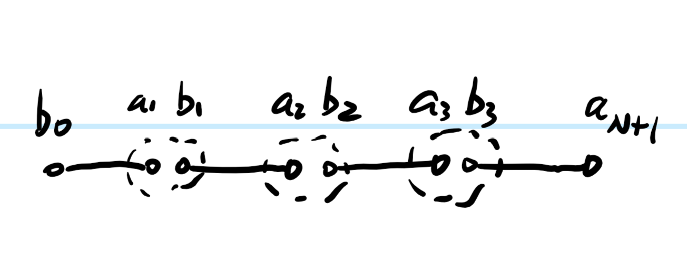

[<- Back to TN Simulation](index.qmd)

# AKLT Model as an Explicit MPS

Appendix B of the source note uses the one-dimensional spin-1 AKLT model as a concrete example of an exactly known MPS ground state. The AKLT construction is the canonical valence-bond-solid example: split each spin-1 into two virtual spin-$1/2$ degrees of freedom, place singlets on neighboring virtual spins, then project each pair of on-site virtual spins back into the physical spin-1 subspace [@affleck1987rigorous].

## Projector Hamiltonian

The Hilbert space consists of an $N$-site spin-1 chain with two spin-$1/2$ boundary particles at sites $0$ and $N+1$. The Hamiltonian is proportional to a sum of local projectors:

- $P_2(i,i+1)$ projects the bulk pair $\mathrm{spin}(1)\otimes\mathrm{spin}(1)$ into its total-spin-2 subspace.
- $P_{3/2}(i,i+1)$ projects the boundary pair $\mathrm{spin}(1)\otimes\mathrm{spin}(1/2)$ into its total-spin-$3/2$ subspace.

For two neighboring spin-1 sites,
$$
\begin{aligned}
P_2(i,i+1)
&=\prod_{j=0,1}
\frac{(S_i+S_{i+1})^2-j(j+1)}
{2(2+1)-j(j+1)}\\
&=
\frac{(S_i+S_{i+1})^2}{2\cdot3}
\frac{(S_i+S_{i+1})^2-2}{2\cdot3-1\cdot2}\\
&=
\frac{1}{3}+\frac{1}{2}S_i\cdot S_{i+1}
+\frac{1}{6}(S_i\cdot S_{i+1})^2 .
\end{aligned}
$$
For the boundary spin-1 and spin-$1/2$ pair,
$$
\begin{aligned}
P_{3/2}(i,i+1)
&=
\prod_{j=1/2}
\frac{(S_i+S_{i+1})^2-j(j+1)}
{\frac{3}{2}\left(\frac{3}{2}+1\right)-j(j+1)}\\
&=\frac{2}{3}\left(1+S_i\cdot S_{i+1}\right).
\end{aligned}
$$
Thus the Hamiltonian in the source note is
$$
H=
\sum_{i=1}^{N-1}
\left[
\frac{1}{3}+\frac{1}{2}S_i\cdot S_{i+1}
+\frac{1}{6}(S_i\cdot S_{i+1})^2
\right]
+\frac{2}{3}(1+S_0\cdot S_1)
+\frac{2}{3}(1+S_N\cdot S_{N+1}).
$$

## Valence-Bond Construction

The AKLT ground state is constructed in three steps:

1. Build a chain with $2(N+1)$ virtual spin-$1/2$ particles.
2. Put neighboring virtual spins into singlet bonds,
   $$
   |\mathrm{bond}\rangle=\frac{|01\rangle-|10\rangle}{\sqrt{2}} .
   $$
3. Project each unbonded on-site pair into the physical spin-1 subspace and identify it with the spin-1 degree of freedom of the AKLT chain.

{#fig-aklt-vbs width="70%"}

The projected state avoids the spin-2 bulk sector. Before applying the on-site projection $P$, the relevant adjacent structure is
$$
D\left(\frac{1}{2}\right)\otimes D(0)\otimes D\left(\frac{1}{2}\right)
=D(0)\oplus D(1),
$$
so there is no total-spin-2 component. The same representation-theoretic argument applies at the spin-$1/2$ boundaries.

## Explicit MPS Form

First write the product of singlet states:
$$
\begin{aligned}
|\phi\rangle
&=
\bigotimes_{i=0}^{N}
\sum_{b_i,a_{i+1}}\Sigma_{b_i,a_{i+1}}
|b_i,a_{i+1}\rangle\\
&=
\Sigma_{b_0,a_1}\Sigma_{b_1,a_2}\cdots\Sigma_{b_N,a_{N+1}}
|b_0\rangle
|a_1b_1a_2b_2\cdots a_Nb_N\rangle
|a_{N+1}\rangle ,
\end{aligned}
$$
where $a_i,b_i\in\{-\frac{1}{2},\frac{1}{2}\}$ and
$$
\Sigma=
\begin{pmatrix}
0&\frac{1}{\sqrt{2}}\\
-\frac{1}{\sqrt{2}}&0
\end{pmatrix}.
$$
The physical spin-1 projector is written as
$$
P|a_i b_i\rangle=\sum_{\sigma_i}P_{a_i b_i}^{\sigma_i}|\sigma_i\rangle,
\qquad
\sigma_i\in\{-1,0,1\}.
$$
The source gives
$$
P^{\sigma_i=-1}=
\begin{pmatrix}
1&0\\
0&0
\end{pmatrix},
\qquad
P^{\sigma_i=0}=
\begin{pmatrix}
0&\frac{1}{\sqrt{2}}\\
\frac{1}{\sqrt{2}}&0
\end{pmatrix},
\qquad
P^{\sigma_i=1}=
\begin{pmatrix}
0&0\\
0&1
\end{pmatrix}.
$$
Apply the projector on each physical site:
$$
\begin{aligned}
|gs\rangle=P|\phi\rangle
&=
\Sigma_{b_0,a_1}\Sigma_{b_1,a_2}\cdots\Sigma_{b_N,a_{N+1}}
|b_0\rangle
P|a_1b_1\rangle
P|a_2b_2\rangle
\cdots
P|a_Nb_N\rangle
|a_{N+1}\rangle\\
&=
\Sigma_{b_0,a_1}
P_{a_1b_1}^{\sigma_1}\Sigma_{b_1,a_2}
P_{a_2b_2}^{\sigma_2}\cdots
P_{a_Nb_N}^{\sigma_N}\Sigma_{b_N,a_{N+1}}
|b_0\rangle|\sigma_1\cdots\sigma_N\rangle|a_{N+1}\rangle\\
&=
\Sigma_{b_0,a_1}
A_{a_1a_2}^{\sigma_1}
A_{a_2a_3}^{\sigma_2}\cdots
A_{a_Na_{N+1}}^{\sigma_N}
|b_0\rangle|\sigma_1\cdots\sigma_N\rangle|a_{N+1}\rangle .
\end{aligned}
$$
The MPS tensor is
$$
A^{\sigma_i}=P^{\sigma_i}\Sigma .
$$
After normalization into left-canonical form, the source obtains
$$
A^{\sigma=-1}=
\begin{pmatrix}
0&\frac{\sqrt{2}}{\sqrt{3}}\\
0&0
\end{pmatrix},
\qquad
A^{\sigma=0}=
\begin{pmatrix}
-\frac{1}{\sqrt{3}}&0\\
0&\frac{1}{\sqrt{3}}
\end{pmatrix},
\qquad
A^{\sigma=1}=
\begin{pmatrix}
0&0\\
-\frac{\sqrt{2}}{\sqrt{3}}&0
\end{pmatrix}.
$$
The boundary antisymmetric tensor is normalized as
$$
\Sigma=
\begin{pmatrix}
0&1\\
-1&0
\end{pmatrix}.
$$
This is an MPS with bond dimension $2$ and explicit translational symmetry. It is the concrete example anticipated in the transfer-map discussion: all bulk tensors are identical, so correlation functions can be analyzed using a single MPS transfer operator.

## Simulation and Hubbard Placeholders

The source note contains a heading for an "iTensor simulation part" after the AKLT derivation, but no simulation details are provided. It also ends with a "Habbard Model" heading, again without equations or results. These placeholders are preserved here as open slots rather than expanded into unrelated material.
