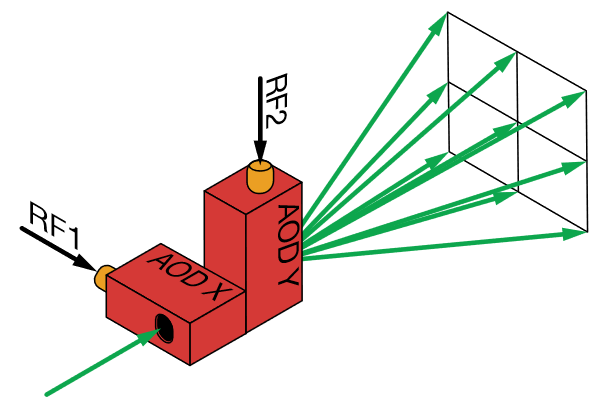

[← Back to Index](index.qmd)

# Overview

Neutral-atom quantum processors trap individual atoms in arrays of optical tweezers. This page covers the physics of single tweezers (Gaussian focus, trapping depth, magic wavelength), and the two hardware approaches to creating programmable arrays: acousto-optic deflectors (AODs) and spatial light modulators (SLMs) combined with the Weighted Gerchberg-Saxton (WGS) algorithm.

---

# Single Optical Tweezer {#sec-single-tweezer}

## 2D Fourier Transform

The amplitude distributions on the front and back focal planes of an ideal lens are related by a Fourier transform. For an input amplitude $\epsilon_i(x',y')$ at the front focal plane, the amplitude at a plane displaced by $z$ from the back focal plane is

$$
\epsilon(x,y,z) = e^{ikz}\,\frac{k}{2\pi f}\int dx'\,dy'\;\epsilon_i(x',y')\,e^{-ik(xx'+yy')/f}\,e^{-ikz(x'^2+y'^2)/2f^2}.
$$ {#eq-2d-fourier}

At the exact back focal plane ($z = 0$), this reduces to the standard 2D Fourier transform. This relationship is the foundation for both AOD and SLM approaches to tweezer array generation.

## Focus Amplitude

For a Gaussian input beam of waist $w_i$ and aperture radius $R$ at the entrance pupil of a lens with focal length $f$, the amplitude distribution at a plane displaced by $z$ from the back focal plane is

$$
\epsilon(r, z) = e^{ikz}\,\frac{k\epsilon_i}{f}\int_0^R dr'\,r'\,e^{-r'^2/w_i^2}\,J_0\!\left(\frac{k}{f}rr'\right)e^{-ikz\,r'^2/2f^2}.
$$ {#eq-focus-amplitude}

The on-axis, in-focus intensity $|\epsilon(0,0)|^2$ determines the **trapping depth**. Numerical evaluation shows that the depth is maximized when $w_i \approx R$, i.e., when the input Gaussian fills the aperture [@ThesisMIT]. This is shown in @fig-twzdepth.

{#fig-twzdepth width=50%}

**Harmonic approximation near the focus.** Close to the potential minimum, the trapping potential is approximately harmonic with distinct radial and axial trap frequencies:

$$
\omega_r \approx \sqrt{\frac{4U_0}{m w_0^2}}, \qquad \omega_z \approx \sqrt{\frac{2U_0}{m z_R^2}},
$$

where $U_0 = -\alpha_s I_0/(2c\varepsilon_0)$ is the trap depth, $w_0$ is the beam waist at focus, and $z_R = \pi w_0^2/\lambda$ is the Rayleigh range. Typically $\omega_z \ll \omega_r$ since $z_R \gg w_0$. The ratio $\omega_z/\omega_r \approx w_0/(\sqrt{2}\,z_R)$ motivates choosing small $w_0$ for sideband cooling, which requires large motional frequency splitting.

---

# Trapping and the Magic Wavelength {#sec-magic}

The interaction of the tweezer field with the atom is described by the effective light-shift Hamiltonian

$$
H_{\rm eff} = -\frac{I}{2c\varepsilon_0}\alpha(\vec J, \hat\varepsilon),
$$ {#eq-light-shift}

where $\alpha(\vec J, \hat\varepsilon) = \alpha_s + \frac{i\alpha_v}{J}(\hat\varepsilon^*\times\hat\varepsilon)\cdot\vec J + \frac{\alpha_t}{2J(2J-1)}\bigl(3\{\hat\varepsilon\cdot\vec J,\,\hat\varepsilon^*\cdot\vec J\} - 2J(J+1)\bigr)$ contains scalar ($\alpha_s$), vector ($\alpha_v$), and tensor ($\alpha_t$) polarizabilities.

For linearly polarized light, the vector term vanishes and the tensor contribution is small for $J = 0$ states. The **magic wavelength** $\lambda_m = 813.4$ nm for $^{88}$Sr is defined by

$$
\alpha_s(^1S_0,\, \lambda_m) = \alpha_s(^3P_0,\, \lambda_m),
$$ {#eq-magic}

ensuring that both qubit states experience identical trapping potentials. This eliminates differential AC Stark shifts on the $|g\rangle \leftrightarrow |c\rangle$ clock transition — a critical requirement for maintaining qubit coherence during gate operations [@ThesisMIT].

---

# AOD-Based Arrays {#sec-AOD}

Acousto-optic deflectors (AODs) steer laser beams by Bragg scattering from an acoustic phonon grating. For a photon momentum $\vec k_o$ and phonon momentum $\vec k_a$ in the perpendicular geometry, the Bragg condition gives

$$
\Delta\theta = \frac{c}{c_s}\,\frac{n\omega_a}{\omega_o}, \qquad n = 0, \pm1, \pm2, \ldots
$$ {#eq-Bragg}

where $c_s$ is the acoustic velocity and $\omega_a$ is the RF drive frequency. A multi-tone RF drive simultaneously creates multiple diffraction orders, each at a distinct frequency and angle.

Placing the AOD exit plane at the front focal plane of a lens maps each diffraction angle to a distinct tweezer position at the back focal plane — a uniformly spaced array, as illustrated in @fig-aodprin.

{#fig-aodprin width=50%}

The key **limitation** of AODs: different traps are generated by different RF frequencies, giving slightly different optical frequencies. This creates differential AC Stark shifts between traps, causing site-dependent qubit frequencies. Additionally, when traps are closely spaced ($\Delta x \lesssim \lambda f/w_i$), the frequency offset induces heating at trap edges during sideband cooling.

---

# SLM-Based Arrays {#sec-SLM}

Spatial light modulators (SLMs) impose an arbitrary phase pattern on the laser beam at the front focal plane of a lens. The amplitude at the back focal plane is the discrete Fourier transform of the SLM field.

## DFT Relationship

Since the SLM liquid crystal plane is finite and functions on it can only be sampled at discrete pixel points, the algorithm sets the sampling interval to be the pixel size $\Delta$. The finite and discrete phase distribution on the SLM screen is periodically extended to the entire front focal plane. Approximating the phase distribution as a sum of delta functions at sampling points, the continuous Fourier integral becomes:

$$
\epsilon(x,y) = A\sum_{q=0,\pm1,\ldots} e^{-2\pi i q(L_x' x + L_y' y)/\lambda f}\sum_{m',n'}\epsilon_{m',n'}\,e^{-2\pi i(xm'\Delta + yn'\Delta)/\lambda f},
$$ {#eq-SLM-periodic}

where $L_x' = N_x'\Delta$, $L_y' = N_y'\Delta$. For points on the back focal plane where $L_x' x/(\lambda f) = 0, \pm1, \ldots$, the first sum produces coherent reinforcement (maximum intensity). These points are the approximate centers of the optical tweezers. The periodicity extension on the front focal plane is therefore equivalent to retaining only the coherently reinforced points on the back focal plane.

With SLM pixel size $\Delta$ and sampling numbers $N_x, N_y$, the back-focal-plane amplitude at grid point $(m, n)$ is

$$
\epsilon_{m,n} = A\sum_{m'=0}^{N_x-1}\sum_{n'=0}^{N_y-1}\epsilon_{m',n'}\,\exp\!\left[-2\pi i\!\left(\frac{mm'}{N_x'} + \frac{nn'}{N_y'}\right)\right],
$$ {#eq-DFT}

and the tweezer positions are

$$
(m, n) \;\mapsto\; (x_m, y_n) = \left(\frac{\lambda f m}{N_x\Delta},\;\frac{\lambda f n}{N_y\Delta}\right).
$$ {#eq-tweezer-positions}

While $m$ and $n$ can take any values, the distribution $\epsilon_{m,n}$ is periodic with periods $N_x$ and $N_y$. Therefore, one typically chooses $m \in (-N_x/2, N_x/2)$ and $n \in (-N_y/2, N_y/2)$ to ensure accurate representation of the intensity distribution around the lens center. In practice, computational software often takes $m = 0, \ldots, N_x - 1$ and $n = 0, \ldots, N_y - 1$, corresponding to positions in $x, y \in [0, \lambda f/\Delta)$, with a subsequent translation to center the pattern.

## WGS Algorithm

A naive inverse FFT of the desired intensity pattern on the SLM does not reproduce the correct tweezer field, due to periodicity artifacts and the constraint that the SLM imposes only a phase (not amplitude) modulation. The **Weighted Gerchberg-Saxton (WGS)** algorithm (@fig-wgs) iteratively finds the SLM phase pattern that generates a uniform-intensity tweezer array:

{#fig-wgs width=55%}

:::{.callout-note icon="false"}
## Algorithm: WGS (Weighted Gerchberg-Saxton)

**Input:** Sampling numbers $N_x, N_y$; initial SLM field $L_0$ (randomly phased Gaussian); desired right-focal-plane intensity $E$; iteration count $N$; uniformity threshold $t$.

**Output:** SLM phase distribution $\text{phase}(L_N)$ generating intensity pattern $E$.

Initialize: $i = 0$, $g = 1$, $E_{\rm mask} = \mathbf{MASK}(E)$ (binary mask of target positions).

**Repeat** until $i = N$:

1. $R_i \gets \mathbf{FFT}(L_i)$
2. $R_{{\rm mask},i} \gets E_{\rm mask} \odot R_i$ (elementwise)
3. $g_i \gets g \odot |R_{{\rm mask},i}| / \bar R_{{\rm mask},i}$, where $\bar R_{{\rm mask},i}$ is the mean of nonzero elements
4. **If** $\max|R_{{\rm mask},i}|/\bar R_{{\rm mask},i} - 1 > t$ **and** $i > 0$: $\;{\rm phase}_i \gets \text{phase}(R_{{\rm mask},i})$; **else**: freeze ${\rm phase}_i \gets {\rm phase}_{i-1}$
5. $R_i' \gets E \odot g_i \odot {\rm phase}_i$
6. $L_{i+1}' \gets \mathbf{IFFT}(R_i')$
7. $L_{i+1} \gets |L_0| \odot \text{phase}(L_{i+1}')$ (Gaussian amplitude, updated phase)
8. $i \gets i + 1$
:::

**Convergence.** The adaptive weighting in step 3 redistributes intensity toward underperforming sites. Freezing the right-focal-plane phase (step 4) when uniformity is sufficiently good prevents oscillation. The algorithm typically achieves $<1\%$ intensity variation across a $10\times10$ tweezer array within $\sim100$ iterations.

The SLM approach has the advantage of generating traps at identical optical frequencies (only the phase profile differs between sites), eliminating the differential frequency shift problem of AODs. The trade-off is lower update rate (SLMs typically $\sim100$ Hz vs. AOD at $\sim$MHz).

---

# Array Rearrangement {#sec-rearrangement}

After loading from the MOT, each tweezer site is probabilistically occupied. An image of the array identifies occupied and empty sites. The AOD beam (or a second movable tweezer beam) then shuttles atoms from randomly occupied sites to fill a contiguous, defect-free sub-array used for computation. This rearrangement is performed before each experimental sequence and requires $\sim10$ ms. The resulting filled array serves as the input for gate operations.
