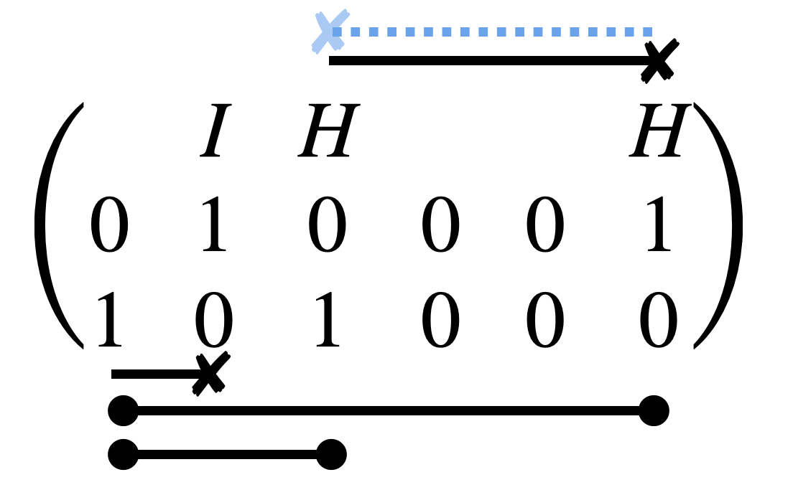

**Abstract.** We review two amplitude estimators for stabilizer states: the **CH** (Classical-Hadamard) simulator of Bravyi *et al.* [@bravyi2019simulation] and the **Affine** simulator [@bravyi2016improved]. Both store stabilizer states in compact classical data structures and support efficient amplitude computation, weak simulation, and strong simulation. The CH simulator separates Clifford gates into coherence-preserving classical gates $\{S, CZ, CX\}$ and the Hadamard gate $H$, while the Affine simulator represents stabilizer states as exponential sums over affine subspaces with quadratic phase functions. These are the foundational building blocks for the stabilizer rank decomposition approach to Clifford+T simulation covered in [Clifford+T Decomposition](clifford_T.qmd).

---

## 1. The CH Simulator

The stabilizer simulation problem restricts the circuit $C$ to Clifford gates. In this section we review the **CH** simulator, which efficiently (i) stores a stabilizer state, (ii) updates it under Clifford gates, and (iii) calculates amplitudes with respect to the computational basis.

The Classical-Hadamard (**CH**) simulator is a phase-sensitive simulator proposed by Bravyi *et al.* [@bravyi2019simulation]. It separates Clifford gates into coherence non-increasing parts $\{S, CZ, CX\}$ and the $H$ gate. The advantage of the **CH** simulator is its simplicity in computing inner products with computational basis states and updating states under classical Clifford gates.

### 1.1 Data Structure

To trace the change of the global phase, one must track the quantum state rather than its stabilizers alone. The **CH** simulator shows that all stabilizer states can be written in the form $\ket{\psi} = \omega\, U_C\, U_H \ket{\mathbf{s}}$.

::: {#def-CH-data .callout-note icon="false"}
## Definition (CH Data Structure)
The **CH** simulator stores the quantum state in the format $\{G, F, M, \mathbf{c}, \mathbf{v}, \mathbf{s}, \omega\}$, where $\ket{\psi} = \omega\, U_C\, U_H \ket{\mathbf{s}}$:

- $\mathbf{s} \in \{0,1\}^n$ is a computational basis bit-string.
- $U_C$ consists of almost-classical Clifford gates $\{CZ, CX, S\}$, each of which preserves the computational basis. We record its action on Pauli operators via the tableaus $\{G, F, M \in \mathbb{F}_2^{n \times n},\; \mathbf{c} \in \mathbb{Z}_4^n\}$, such that
$$
U_C^\dagger Z_p U_C = \prod_{j=1}^n Z_j^{G_{p,j}}, \qquad U_C^\dagger X_p U_C = i^{c_p} \prod_{j=1}^n X_j^{F_{p,j}} Z_j^{M_{p,j}}.
$$
- $U_H$ contains single-qubit Hadamard gates encoded by $\mathbf{v} \in \{0,1\}^n$, where $H(\mathbf{v}) := \bigotimes_i H_i^{v_i}$.
:::

### 1.2 Amplitude Estimation {#sec-amplitude}

Consider measuring the **CH**-form state in the computational basis $\ket{\mathbf{x}}$. This amounts to computing $\langle \mathbf{x} | U_C U_H | \mathbf{s} \rangle$. Since $U_C |0\rangle^{\otimes n} = |0\rangle^{\otimes n}$, we perform the update:
$$
\langle \mathbf{x} | U_C U_H | \mathbf{s} \rangle = \langle 0^n | U_C^\dagger X^{\mathbf{x}} U_C U_H | \mathbf{s} \rangle = \langle 0^n | Q\, U_H | \mathbf{s} \rangle,
$$
where $Q = \prod_{p=1}^n (U_C^\dagger X_p U_C)^{x_p}$. This $Q$ can be computed in $O(n^2)$ time using $n$ additions of the length-$n$ rows of tableaus $M, F$. We can then write $Q = i^\mu Z(\mathbf{t})\, X(\mathbf{u})$ for some $\mu \in \mathbb{Z}_4$ and binary strings $\mathbf{t} = \mathbf{x}M,\; \mathbf{u} = \mathbf{x}F$. The amplitude is then:

$$
\langle 0^n | i^\mu Z(\mathbf{t})\, X(\mathbf{u})\, U_H | \mathbf{s} \rangle = i^\mu \prod_{j:\, v_j=1} \frac{(-1)^{u_j s_j}}{\sqrt{2}} \times \prod_{j:\, v_j=0} \langle u_j | s_j \rangle.
$$ {#eq-CH-amplitude}

The term $\prod_{j:\, v_j=0} \langle u_j | s_j \rangle$ evaluates to $1$ if $u_j = s_j$ for all $j$ where $v_j = 0$, and $0$ otherwise. If we only care about the probability, we denote $W$ as the set $W = \{\mathbf{w} \mid w_j = s_j,\; \forall j \text{ s.t. } v_j = 0\}$, which has $2^{|\mathbf{v}|}$ elements:

$$
|\langle \mathbf{x} | U_C U_H | \mathbf{s} \rangle|^2 = \begin{cases}
0 & \text{if } \mathbf{x}F = \mathbf{w} \notin W, \\
2^{-|\mathbf{v}|} & \text{if } \mathbf{x}F = \mathbf{w} \in W.
\end{cases}
$$ {#eq-comp-amplit}

Stabilizer state amplitudes can be calculated by first applying the gate update rules and then the amplitude estimation on the computational basis.

### 1.3 Weak Simulation

Although strong simulation implies weak simulation, stabilizer states admit a simpler sampling method since their distribution on the computational basis is uniform on a certain subset.

Based on @eq-comp-amplit, and using the fact that the commutation relation $X_pZ_{p'}=(-1)^{\delta_{p,p'}}Z_{p'}X_p$ implies $\sum_{j}G_{p,j}F_{p',j} = (GF^T)_{p,p'} = \delta_{p,p'}$, we get $\mathbf{x}F = \mathbf{w} \Leftrightarrow \mathbf{x} = \mathbf{w}G^T$ for $\mathbf{w} \in W$.

So we can sample $\mathbf{x}$ by:

1. Take $\mathbf{w} \in W$ randomly by setting $\mathbf{w} = \mathbf{s}$ and uniformly shifting all components $j$ such that $v_j = 1$.
2. Output $\mathbf{x} = \mathbf{w}G^T$.

### 1.4 Classical Gate Rules

When acting with $g \in \{S, CZ, CX\}$ on the CH state, the updated state $g\ket{\psi} = \omega \cdot g\, U_C\, U_H \ket{\mathbf{s}}$ is obtained simply by updating $U_C \mapsto g U_C$. Thus, the update rules for $\{G, F, M, \mathbf{c}\}$ under $\{S, CZ, CX\}$ are given by left operations $\{\mathcal{L}[S_q],\, \mathcal{L}[CZ_{q,r}],\, \mathcal{L}[CX_{q,r}]\}$. Right operations are also required in the $H$-gate update.

::: {#lem-gate-rules .callout-important icon="false"}
## Lemma (Classical Gate Update Rules)
Given $g \in \{S, CZ, CX\}$ and $U_C$ represented by tableaus $\{G, F, M \in \mathbb{F}_2^{n \times n},\; \mathbf{c} \in \mathbb{Z}_4^n\}$, the left operation $U_C \mapsto g U_C$ and right operation $U_C \mapsto U_C g$ follow the update rules:

**$S$-gate:**
$$
\mathcal{L}[S_q]: \begin{cases} M_{q,j} \leftarrow M_{q,j} \oplus G_{q,j} \\ c_q \leftarrow c_q - 1 \end{cases} \qquad
\mathcal{R}[S_q]: \begin{cases} M_{p,j} \leftarrow M_{p,j} \oplus F_{p,j} \\ c_p \leftarrow c_p - F_{p,q} \end{cases}
$$

**$CZ$-gate:**
$$
\mathcal{L}[CZ_{q,r}]: \begin{cases} M_{q,p} \leftarrow M_{q,p} \oplus G_{r,p} \\ M_{r,p} \leftarrow M_{r,p} \oplus G_{q,p} \end{cases} \quad
\mathcal{R}[CZ_{q,r}]: \begin{cases} M_{p,q} \leftarrow M_{p,q} \oplus F_{p,r} \\ M_{p,r} \leftarrow M_{p,r} \oplus F_{p,q} \\ c_p \leftarrow c_p + 2 F_{p,q} F_{p,r} \end{cases}
$$

**$CX$-gate:**
$$
\mathcal{R}[CX_{q,r}]: \begin{cases} G_{p,q} \leftarrow G_{p,q} \oplus G_{p,r} \\ F_{p,r} \leftarrow F_{p,r} \oplus F_{p,q} \\ M_{p,q} \leftarrow M_{p,q} \oplus M_{p,r} \end{cases} \quad
\mathcal{L}[CX_{q,r}]: \begin{cases} c_q \leftarrow c_q + c_r + 2(MF^T)_{q,r} \\ G_{r,p} \leftarrow G_{r,p} \oplus G_{q,p} \\ F_{q,p} \leftarrow F_{q,p} \oplus F_{r,p} \\ M_{q,p} \leftarrow M_{q,p} \oplus M_{r,p} \end{cases}
$$
:::

::: {.callout-note collapse="true"}
## Proof
For the $S$-gate left action, we use $S^\dagger Z S = Z$ and $S^\dagger X S = -Y = X(-iZ)$:
$$
\begin{aligned}
U_C^\dagger S_q^\dagger Z_p S_q U_C &= \prod_{j=1}^n Z_j^{G_{p,j}}, \\
U_C^\dagger S_q^\dagger X_p S_q U_C &= U_C^\dagger X_p (-iZ_p)^{\delta_{pq}} U_C \\
&= \left(i^{c_p} \prod_j X_j^{F_{p,j}} Z_j^{M_{p,j}}\right) \left(-i \prod_j Z_j^{G_{p,j}}\right)^{\delta_{pq}} \\
&= i^{c_p - \delta_{pq}} \prod_j X_j^{F_{p,j}} Z_j^{M_{p,j} + G_{p,j}\delta_{pq}}.
\end{aligned}
$$

For the $S$-gate right action:
$$
\begin{aligned}
S_q^\dagger U_C^\dagger Z_p U_C S_q &= \prod_{j=1}^n Z_j^{G_{p,j}}, \\
S_q^\dagger U_C^\dagger X_p U_C S_q &= S_q^\dagger\, i^{c_p} \prod_j X_j^{F_{p,j}} Z_j^{M_{p,j}}\, S_q \\
&= i^{c_p} \prod_j \bigl(X_j (-iZ_j)^{\delta_{jq}}\bigr)^{F_{p,j}} Z_j^{M_{p,j}} \\
&= i^{c_p - F_{p,q}} \prod_j X_j^{F_{p,j}} Z_j^{M_{p,j} + F_{p,j}\delta_{jq}}.
\end{aligned}
$$
The $CZ$ and $CX$ rules follow by analogous conjugation calculations. $\square$
:::

### 1.5 H-Gate Rule {#sec-H-gate}

The update rule of $H_p$ is more involved. We first note that $H_p = 2^{-1}(X_p + Z_p)$ and compute:
$$
\begin{aligned}
H_p U_C U_H \ket{\mathbf{s}} &= U_C U_H \cdot \tfrac{1}{2}\left(U_H^\dagger U_C^\dagger X_p U_C U_H + U_H^\dagger U_C^\dagger Z_p U_C U_H\right)\ket{\mathbf{s}} \\
&= \tfrac{1}{2}\, U_C U_H \bigotimes_{j=1}^n \Big[i^{c_p} (-1)^{M_{p,j}\bar{v}_j s_j + F_{p,j} v_j(s_j + M_{p,j})} \ket{s_j \oplus M_{p,j} v_j \oplus F_{p,j} \bar{v}_j} \\
&\qquad\qquad\qquad + (-1)^{G_{p,j}\bar{v}_j s_j} \ket{s_j \oplus G_{p,j} v_j}\Big].
\end{aligned}
$$
Here in the second line we use the definition, $U_C^\dagger Z_p U_C = \prod_{j=1}^n Z_j^{G_{p,j}},~U_C^\dagger X_p U_C = i^{c_p} \prod_{j=1}^n X_j^{F_{p,j}} Z_j^{M_{p,j}}$.

The quantum state now has the form $U_C U_H (\ket{\mathbf{t}} + i^\delta \ket{\mathbf{u}})$. This can be transformed into **CH**-form efficiently:

::: {#lem-CH-transform .callout-important icon="false"}
## Lemma (Transformation to CH-form)
We can always find a **CH** representation $\{W_C, W_H, \omega, \mathbf{s}'\}$ in $O(n)$ time such that $W_C$ consists of $O(n)$ gates from the classical Clifford gate set $\{CX, CZ, S\}$ and
$$
U_H(\ket{\mathbf{t}} + i^\delta \ket{\mathbf{u}}) = \omega\, W_C\, W_H \ket{\mathbf{s}'}.
$$
:::

::: {.callout-note collapse="true"}
## Proof (Algorithmic)
We construct a C-type circuit $V_C$ satisfying $U_H \ket{\mathbf{t}} = V_C U_H \ket{\mathbf{y}}$ and $U_H \ket{\mathbf{u}} = V_C U_H \ket{\mathbf{z}}$, where the bit strings $\mathbf{y}, \mathbf{z} \in \{0,1\}^n$ differ on exactly one bit $q$, i.e., $y_j \oplus z_j = \delta_{j,q}$.

Then:
$$
U_H(\ket{\mathbf{t}} + i^\delta \ket{\mathbf{u}}) = V_C U_{H/q} \left[\ket{\phi} \otimes (H_q^{v_q} \ket{y_q} + i^\delta H_q^{v_q} \ket{z_q})\right].
$$

The single-qubit state on $q$ can be decomposed as $(H_q^{v_q} \ket{y_q} + i^\delta H_q^{v_q} \ket{z_q}) = \omega\, S^a H^b \ket{c}$ for $a, b, c \in \{0,1\}$. Therefore:
$$
U_H(\ket{\mathbf{t}} + i^\delta \ket{\mathbf{u}}) = \omega \cdot (V_C S_q^a)(U_{H/q} H_q^{b \oplus v_q}) \ket{\mathbf{s}'},
$$
giving the **CH**-form parameters $W_C = V_C S_q^a$, $W_H = U_H H_q^{b \oplus v_q}$, and $\mathbf{s}'_i = y_i = z_i$ for $i \neq q$, $\mathbf{s}'_q = c$.

**Construction of $V_C$:** Define the index sets $\mathcal{V}_b = \{i \in [n] : v_i = b \text{ and } t_i \neq u_i\}$ for $b \in \{0,1\}$. Since $\mathbf{t} \neq \mathbf{u}$, at least one set is non-empty.

- If $\mathcal{V}_0 = \{q_0, \ldots, q_k\} \neq \emptyset$: Let $q = q_0$ be the first index.

  

  Define:
  $$
  V_C = \left(\prod_{i \in \mathcal{V}_0 \setminus \{q_0\}} CX_{q_0,i}\right) \cdot \left(\prod_{i \in \mathcal{V}_1} CZ_{q_0,i}\right).
  $$
  Here, $CX_{q,i}$ acts with control $q$ and target $i$. This ensures that $U_H V_C U_H$ maps $\mathbf{t}$ and $\mathbf{u}$ to strings differing only at index $q$.

- If $\mathcal{V}_0 = \emptyset$: Then $\mathcal{V}_1 \neq \emptyset$. Let $q$ be its first index. Define:
  $$
  V_C = \prod_{i \in \mathcal{V}_1 \setminus \{q\}} CX_{i,q}.
  $$

Both constructions use at most $O(n)$ gates and $O(n)$ time. $\square$
:::

### 1.6 Strong Simulation {#sec-strong-sim}

Strong simulation requires computing the marginal amplitudes:
$$
\forall k \leq n, \quad \mathrm{Prob}(s_1, \ldots, s_k) := \left\|\bigotimes_{i=1}^k \frac{\mathbb{I} + (-1)^{s_i} Z}{2} \otimes \mathbb{I}^{\otimes(n-k)} \ket{\phi}\right\|^2.
$$

It suffices to show that the state $\Gamma\, U_C U_H \ket{\mathbf{s}}$ for $\Gamma = (\mathbb{I} + (-1)^s P)/2$ can be efficiently updated into the **CH**-form $\sqrt{2^{-1}}\, U_C' U_H' \ket{\mathbf{s}'}$ or zero. The marginal probability is then computed by $k$ sequential updates, tracking whether each gives $0$ or $2^{-1}$.

More generally, using the method above we can compute
$$
\mathrm{Pr}(\sigma_1, \ldots, \sigma_u) := \langle \psi | \prod_{k=1}^u \frac{\mathbb{I} + \sigma_k P_k}{2} | \phi \rangle
$$
for two **CH**-form states $\ket{\phi} = U_C' U_H' \ket{\mathbf{s}'}$ and $\ket{\psi} = U_C U_H \ket{\mathbf{s}}$ in $\mathcal{O}(n^2)$ time. This is essential for the extension to Clifford+T circuits discussed in [Clifford+T Decomposition](clifford_T.qmd).

---

## 2. The Affine Simulator {#sec-affine}

To calculate the inner product between two stabilizer states $U_C U_H \ket{\mathbf{s}}$ and $U_C' U_H' \ket{\mathbf{s}'}$ in the **CH** form, one must update $U_H^\dagger U_C^\dagger U_C' U_H' \ket{\mathbf{s}'}$ into **CH** form and then evaluate its amplitude on $\ket{\mathbf{s}}$. This takes time $\mathcal{O}(n^3)$.

A more efficient alternative is to reduce the problem entirely to exponential sums associated with quadratic forms [@bravyi2016improved; @bravyi2019simulation], which we call the **Affine simulator**.

### 2.1 Data Structure

Given binary vectors $\mathbf{h}, \mathbf{g}_i \in \mathbb{F}_2^n$, the affine subspace is defined as:
$$
\mathbb{A}_k := \{\mathbf{x} \mid \mathbf{x} = \mathbf{h} + \textstyle\sum_{i=1}^k x_i \cdot \mathbf{g}_i,\; x \in \mathbb{F}_2^k\}.
$$

A quadratic function $\mathbb{F}_2^n \to \mathbb{Z}_8$ has the form:
$$
q(\mathbf{x}) = Q + \mathbf{D} \cdot \mathbf{x} + \mathbf{x}^T \mathbf{J}\, \mathbf{x}.
$$

::: {#lem-affine-form .callout-important icon="false"}
## Lemma (Affine Representation of Stabilizer States)
An $n$-qubit state stabilized by $n$ Pauli operators can always be represented in **Affine form**:
$$
\ket{S} = 2^{-k/2} \sum_{\mathbf{x} \in \mathbb{A}} e^{i(\pi/4)\, q(\mathbf{x})} \ket{\mathbf{x}},
$$
where $\mathbb{A} \subset \mathbb{F}_2^n$ is an affine subspace and $q : \mathbb{F}_2^n \to \mathbb{Z}_8$ is a quadratic map restricted to $\mathbb{A}$.
:::

For example, there exists a subset of $n$-qubit stabilizer states $\mathrm{Equa}_n$ (the **equatorial states**) whose Affine form can be written as:
$$
2^{-n/2} \sum_{\mathbf{x} \in \{0,1\}^n} e^{i(\pi/4) \cdot 2 \cdot f(\mathbf{x})} \ket{\mathbf{x}},
$$
with $f(\mathbf{x}) = \mathbf{D} \cdot \mathbf{x} + \mathbf{x}^T J \mathbf{x}$ for $\mathbf{D}$ being an $\mathbb{F}_4$ vector and $J$ a symmetric off-diagonal matrix with entries in $\{0,1\}$. These equatorial states play a key role in the Monte Carlo estimation of stabilizer overlaps, as discussed in [Clifford+T Decomposition](clifford_T.qmd).

---

## References
