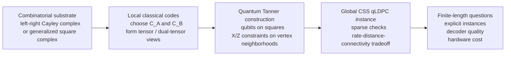

# Review: Quantum Tanner Codes

This note surveys the quantum Tanner code (QTC) line through **May 18, 2026**, grounded in the project knowledge base and focusing on three questions: how the codes are constructed, what finite-size instances have actually been built, and how the decoder story has evolved from provable asymptotic algorithms to practical finite-length heuristics [@leverrier_2022_quantum; @xiao_2026_lead].

## 1. What Is It

Quantum Tanner codes are a family of CSS quantum LDPC codes built by placing qubits on the squares of a left-right Cayley complex, or more generally on related square-complex constructions, and enforcing local tensor-code constraints at vertices. The original construction of Leverrier and Zemor can be read as a higher-dimensional Tanner-code recipe: one combinatorial object simultaneously defines the local views for the X and Z checks, and carefully matched local classical codes make the two sides commute while preserving sparsity [@leverrier_2022_quantum]. In the broader post-2020 qLDPC landscape, QTCs sit next to balanced-product and lifted-product codes, but with a more explicitly Tanner-style local-code viewpoint [@breuckmann_2021_balanced; @panteleev_2022_almost; @leverrier_2022_quantum].

At a practical level, the construction is attractive because it is not "search over arbitrary sparse CSS matrices." Instead, it exposes a parameterized design space: choose a group or graph-action substrate, choose generator sets or coverings, choose local classical codes, and derive the global CSS instance from that structure. That makes QTCs unusually suitable for finite-length search, because successes and failures can often be traced back to interpretable choices rather than opaque matrix accidents [@mostad_2024_generalizing; @leverrier_2025_small].

One useful way to think about the recipe is:

1. Choose a combinatorial substrate: originally a left-right Cayley complex from a finite group and two symmetric generator sets; later generalized to group actions, Schreier graphs, and broader square complexes [@leverrier_2022_quantum; @mostad_2024_generalizing].
2. Choose local classical codes on the two generator sets, then form the corresponding tensor and dual-tensor constraints that define the local X- and Z-type views [@leverrier_2022_quantum].
3. Put qubits on squares and impose local code constraints on the two diagonal graph projections, yielding a sparse CSS code with constant-weight checks [@leverrier_2022_quantum].
4. Use expansion and robustness of the local ingredients to obtain the asymptotic guarantees; then separately study finite-size instances and decoder quality, which are now the main practical bottlenecks [@leverrier_2023_decoding; @radebold_2025_explicit].

Relative to the dominant surface-code baseline, QTCs trade geometric locality for much better parameter potential. Relative to generic qLDPC search, they trade brute-force freedom for a more structured and scientifically legible design space. That combination is the main reason they have become a serious finite-length research target rather than only an asymptotic existence theorem [@leverrier_2022_quantum; @guemard_2025_moderate; @leverrier_2025_small].

## 2. Pros and Cons

| # | Advantages | Matching limitations |
|---:|---|---|
| 1 | **Strong asymptotic backbone.** QTCs are one of the cleanest explicit routes to asymptotically good qLDPC codes, and they emerged from the same breakthrough wave as balanced- and lifted-product constructions [@breuckmann_2021_balanced; @panteleev_2022_almost; @leverrier_2022_quantum]. | **Connectivity is intrinsically harder than in 2D-local codes.** The gain comes from nonlocal combinatorial structure rather than planar geometry, so implementation costs are usually less transparent than for surface-code-style layouts [@leverrier_2022_quantum; @radebold_2025_explicit]. |
| 2 | **The construction space is structured enough to search.** Group choice, generator sets, coverings, and local codes provide meaningful knobs for finite-length exploration instead of undirected sparse-matrix sampling [@mostad_2024_generalizing; @leverrier_2025_small]. | **Finite-length quality is highly sensitive to those knobs.** Good asymptotic logic does not tell you which small groups, lifts, or local codes will produce the best few-hundred-qubit instances [@guemard_2025_moderate; @leverrier_2025_small]. |
| 3 | **Decoder theory exists, and it is unusually strong.** QTCs have dedicated decoders with provable correction of linear-weight adversarial errors and a single-shot fault-tolerance story, which is rare in qLDPC [@leverrier_2023_decoding; @leverrier_2025_efficient; @gu_2024_single]. | **Practical decoders are still unsettled.** The 2026 literature is active precisely because standard BP-style baselines are not yet a satisfactory endpoint for finite-length QTCs [@mostad_2026_improved; @rapp_2026_efficient; @xiao_2026_lead]. |
| 4 | **Finite-size implementations are now real.** There are explicit dihedral-group instances, lifted moderate-length families, and small-group search results with nontrivial `[[n,k,d]]` parameters and simulation data [@guemard_2025_moderate; @radebold_2025_explicit; @leverrier_2025_small]. | **The finite-size evidence is still thin and heterogeneous.** Different papers use different constructions, local codes, decoders, and noise models, which makes cross-paper conclusions fragile [@radebold_2025_explicit; @mostad_2026_improved; @xiao_2026_lead]. |
| 5 | **The family generalizes cleanly.** QTCs are no longer tied only to left-right Cayley complexes from groups; the Schreier-graph and square-complex generalization substantially enlarges the design space [@mostad_2024_generalizing]. | **Generalization does not yet come with a standard engineering pipeline.** The broader the construction family becomes, the more urgent it is to have reproducible search heuristics and benchmark conventions [@mostad_2024_generalizing; @leverrier_2025_small; @radebold_2025_explicit]. |
| 6 | **They now admit multiple decoder paradigms.** The field has moved from mismatch-based provable decoders to generalized BP, SOGRAND-based decoding, and locality-aware ensemble methods [@leverrier_2023_decoding; @mostad_2026_improved; @rapp_2026_efficient; @xiao_2026_lead]. | **No single decoder-stack is yet the consensus default.** The best decoder depends on whether one optimizes proof guarantees, logical error rate, iteration count, or implementation latency [@leverrier_2025_efficient; @rapp_2026_efficient; @xiao_2026_lead]. |

## 3. State of the Art

### Milestone Table

| Milestone | Result | Group | Year |
|---|---|---|---:|
| [Balanced-product context @breuckmann_2021_balanced] | Established the product/quotient viewpoint that helped define the modern nonlocal qLDPC design space into which QTCs later fit. | Breuckmann, Eberhardt | 2021 |
| [Quantum Tanner codes @leverrier_2022_quantum] | Introduced the core QTC construction from left-right Cayley complexes and proved asymptotically good parameters. | Leverrier, Zemor | 2022 |
| [Decoding Quantum Tanner Codes @leverrier_2023_decoding] | Gave dedicated sequential and parallel mismatch-style decoders for QTCs. | Leverrier, Zemor | 2023 |
| [Single-shot decoding of good QLDPC codes @gu_2024_single] | Showed that QTCs admit single-shot decoding against adversarial noise, extending the relevance of the family to repeated syndrome-extraction settings. | Gu, Tang, Caha, Choe, He, Kubica | 2024 |
| [Generalizing Quantum Tanner Codes @mostad_2024_generalizing] | Extended QTCs from groups/Cayley complexes to group actions, Schreier graphs, and a broader square-complex framework. | Mostad, Rosnes, Lin | 2024 |
| [Moderate-length lifted quantum Tanner codes @guemard_2025_moderate] | Built new explicit lifted QTC families, including moderate-length examples with distance exceeding `sqrt(n)` and low check weight. | Guemard, Zemor | 2025 |
| [Explicit instances of QTCs @radebold_2025_explicit] | Constructed dihedral-group QTC instances with 36-250 qubits and benchmarked them under phenomenological and circuit-level noise with BP+OSD. | Radebold, Bartlett, Doherty | 2025 |
| [Small QTCs from left-right Cayley complexes @leverrier_2025_small] | Recast finite-size QTCs through a lifting lens and reported searched instances such as `[[144,12,11]]`, `[[432,20,<=22]]`, and `[[576,28,<=24]]`. | Leverrier, Rozendaal, Zemor | 2025 |
| [Linear-time linear-weight decoding @leverrier_2025_efficient] | Strengthened the decoding story to efficient correction of adversarial errors of linear weight for QTCs and related lifted-product families. | Leverrier, Zemor | 2022/2025 |
| [Generalized-check-node BP @mostad_2026_improved] | Used grouped local checks and MAP-based generalized BP to materially improve finite-length decoding performance for QTCs. | Mostad, Rosnes, Lin | 2026 |
| [SOGRAND-enhanced decoding @rapp_2026_efficient] | Treated QTCs as generalized LDPC codes and reported up to three orders of magnitude improvement over a BP+OSD baseline on studied instances. | Rapp, Medard, Tang, Duffy | 2026 |
| [LEAD local ensemble decoding @xiao_2026_lead] | Introduced a locality-aware, highly parallel decoder that aggregates local subcode estimates into a global prior and reduces latency/iteration count. | Xiao, Shi, Huang, Wang, Wang | 2026 |

### Construction and Finite-Size Status

The construction story is no longer only asymptotic. Three finite-size directions now matter:

1. **Lifted/moderate-length QTCs.** Guemard and Zemor move beyond the original left-right Cayley presentation and use coverings of 2D complexes plus lifted local-code configurations to generate moderate-length families, including a `[[96,2,12]]` example with low check weights and distance above `sqrt(n)` [@guemard_2025_moderate].
2. **Explicit small hardware-scale instances.** Radebold, Bartlett, and Doherty build concrete dihedral-group QTCs with sizes from 36 to 250 qubits, rates around 20% for the smaller examples, BP+OSD decoding, and both phenomenological and circuit-level simulations. This is the clearest current paper showing a full finite-size construction-to-benchmark loop [@radebold_2025_explicit].
3. **Small-group search and lift characterization.** Leverrier, Rozendaal, and Zemor reinterpret finite-size QTCs through a base-code and lift formalism, then search over small groups and local codes to produce concrete parameter points such as `[[144,12,11]]` and `[[576,28,<=24]]` [@leverrier_2025_small].

This means the field has crossed an important threshold: there is now a real finite-length implementation program for QTCs, not just asymptotic theory. What is still missing is a stable, shared design pipeline that lets different groups compare construction choices on equal terms [@guemard_2025_moderate; @radebold_2025_explicit; @leverrier_2025_small].

### Decoder Landscape

The decoder story has split into two partially separate tracks.

First, there is the **provable-decoding track**. The original mismatch-based decoders gave QTC-specific sequential and parallel algorithms [@leverrier_2023_decoding]. The later linear-time analysis strengthened this to efficient decoding of adversarial linear-weight errors [@leverrier_2025_efficient]. On top of that, the single-shot work showed that QTCs can tolerate noisy syndrome measurements without requiring a distance-scaling number of measurement rounds [@gu_2024_single].

Second, there is the **finite-length practical-decoding track**. In 2026 this moved quickly. Mostad, Rosnes, and Lin grouped local checks into stronger generalized check nodes and used MAP processing within BP iterations [@mostad_2026_improved]. Rapp, Medard, Tang, and Duffy instead treated QTCs as generalized LDPC codes and used SOGRAND to soft-decode component codes, reporting very large improvements over a BP+OSD baseline on their target instances [@rapp_2026_efficient]. Xiao and coauthors introduced LEAD, which decomposes the global problem into overlapping local subcodes, decodes them in parallel, and regularizes the aggregated soft information before global decoding [@xiao_2026_lead].

The net picture is encouraging but not settled: QTC decoding is now one of the most active subproblems in the family, which is good news for practical relevance but also evidence that the default decoder question is still open [@mostad_2026_improved; @rapp_2026_efficient; @xiao_2026_lead].

## 4. Key Problems

| # | Problem | Why it matters | Who could solve it | Urgency |
|---:|---|---|---|---|
| 1 | Finite-size design priors for groups, lifts, and local codes | The field knows the broad recipe, but not yet a reliable rulebook for which small-to-medium constructions dominate in the `10^2-10^3` qubit regime [@mostad_2024_generalizing; @guemard_2025_moderate; @leverrier_2025_small]. | Code constructors plus automated search projects | Critical |
| 2 | Standardized decoder benchmarking across noise models | QTC decoder papers currently compare different decoder stacks under different assumptions, which makes "best decoder" claims harder to transport across papers [@radebold_2025_explicit; @mostad_2026_improved; @rapp_2026_efficient; @xiao_2026_lead]. | Benchmark-suite builders and decoder groups | Critical |
| 3 | Bridging provable decoders and low-latency practical decoders | The asymptotic decoder story is unusually strong, but the fastest practical finite-length decoders are now coming from more heuristic or generalized-LDPC-style ideas [@leverrier_2023_decoding; @leverrier_2025_efficient; @rapp_2026_efficient; @xiao_2026_lead]. | Decoder theorists and systems-oriented implementers | High |
| 4 | Hardware-aware accounting for connectivity, checks, and syndrome extraction | QTCs may win on rate-distance metrics but still lose if long-range couplers, measurement schedules, and circuit overhead are not modeled honestly [@gu_2024_single; @radebold_2025_explicit]. | Architecture and fault-tolerance teams | High |
| 5 | Explicit deterministic constructions with reproducible search spaces | The most interesting finite-size instances still depend heavily on search, random local codes, or special small-group choices; the field needs cleaner deterministic families with predictable behavior [@leverrier_2022_quantum; @mostad_2024_generalizing; @leverrier_2025_small]. | Construction theorists | High |
| 6 | Fair comparison to other nonlocal qLDPC baselines | For the short-to-medium blocklength regime, the real question is not whether QTCs are good in principle, but when they beat bicycle-, lifted-product-, or other structured competitors on the same benchmark harness [@guemard_2025_moderate; @radebold_2025_explicit; @mostad_2026_improved]. | Cross-family evaluation efforts | Medium |

## Bottom Line

Quantum Tanner codes have moved decisively beyond the "beautiful asymptotic theorem" stage. The core construction is now broader than the original Cayley-complex presentation, finite-size instances at tens to hundreds of qubits exist, and the decoder literature accelerated sharply in 2026 with generalized BP, SOGRAND-based decoding, and locality-aware parallel frameworks [@mostad_2024_generalizing; @radebold_2025_explicit; @leverrier_2025_small; @rapp_2026_efficient; @xiao_2026_lead].

The strongest current case for QTCs is therefore not that they have already won the finite-length race, but that they now offer a coherent research stack: interpretable construction knobs, provable decoder theory, real finite-size instances, and rapidly improving practical decoders. The weakest current point is also clear: there is still no consensus best finite-size construction/decoder pair, and there is not yet a standardized benchmark story strong enough to close that question. For an AutoQEC-style program, that makes QTCs one of the highest-value families to search, but only if the search loop scores candidate instances jointly by parameters, decoder behavior, and implementation cost rather than by `[[n,k,d]]` alone [@leverrier_2023_decoding; @radebold_2025_explicit; @rapp_2026_efficient].
