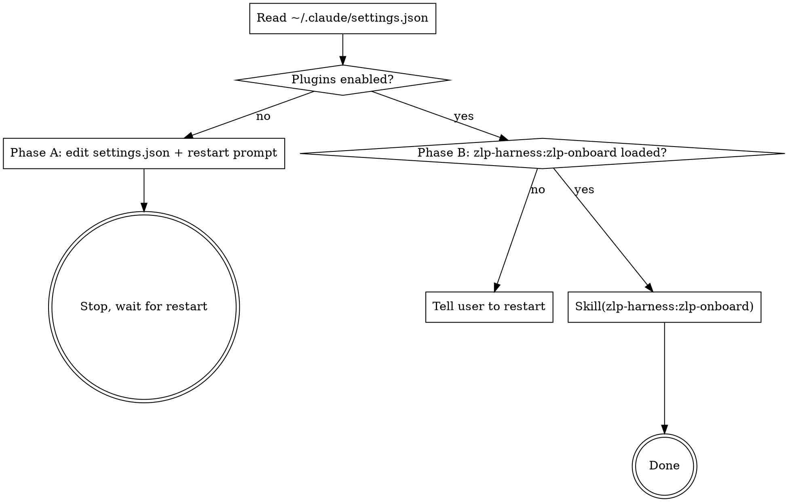

# onboard — AutoQEC

This is a thin two-phase skill. Its only jobs are (A) installing/enabling the [`zlp-harness`](https://github.com/GiggleLiu/zlp-harness) and [`sci-brain`](https://github.com/QuantumBFS/sci-brain) plugins in the user's global Claude Code settings, and (B) delegating Zulip setup to `zlp-harness:zlp-onboard` once the plugins are loaded. All site-specific values (Zulip URL, default credential directory, stream name) come from this repo's `make zulip-config`.

## When to use

- The user just cloned this repo and is running `/onboard` for the first time.
- `make zulip-whoami` errors out (`command not found: zlp`, missing `zuliprc`, etc.) and the user wants help.

Do NOT use:

- For an existing setup hitting a transient error — debug it first.
- To install these plugins for an unrelated harness — let that harness's own `/onboard` do it.

## Workflow



### Step 0 — Detect which phase to run

```sh
python3 - <<'PY'
import json, pathlib, sys
p = pathlib.Path.home() / ".claude/settings.json"
if not p.exists():
    print("PHASE_A"); sys.exit(0)
try:
    data = json.loads(p.read_text())
except json.JSONDecodeError as e:
    print(f"PARSE_ERROR: {e}"); sys.exit(0)
enabled = data.get("enabledPlugins", {})
markets = data.get("extraKnownMarketplaces", {})
ok = (
    enabled.get("zlp-harness@zlp-harness") is True
    and enabled.get("sci-brain@sci-brain") is True
    and "zlp-harness" in markets
    and "sci-brain" in markets
)
print("PHASE_B" if ok else "PHASE_A")
PY
```

- `PHASE_A` → run **Phase A**
- `PHASE_B` → run **Phase B**
- `PARSE_ERROR: ...` → abort and ask the user to fix `~/.claude/settings.json` manually before re-running `/onboard`

### Phase A — Enable the plugins

The user is editing their global Claude Code config. Show the diff before applying it.

```
The /onboard flow is going to add this to your ~/.claude/settings.json:

  "extraKnownMarketplaces": {
    "zlp-harness": {
      "source": { "source": "github", "repo": "GiggleLiu/zlp-harness" }
    },
    "sci-brain": {
      "source": { "source": "github", "repo": "QuantumBFS/sci-brain" }
    }
  },
  "enabledPlugins": {
    "zlp-harness@zlp-harness": true,
    "sci-brain@sci-brain": true
  }

This enables both plugins globally. `zlp-harness` provides the Zulip bridge
workflow used here, and `sci-brain` provides the research-literature workflows
used for the local knowledge base. Continue? (yes / no)
```

If the user agrees, do the merge while preserving unrelated keys:

```sh
python3 - <<'PY'
import json, pathlib
p = pathlib.Path.home() / ".claude/settings.json"
data = json.loads(p.read_text()) if p.exists() else {}
data.setdefault("extraKnownMarketplaces", {})
data["extraKnownMarketplaces"]["zlp-harness"] = {
    "source": {"source": "github", "repo": "GiggleLiu/zlp-harness"}
}
data["extraKnownMarketplaces"]["sci-brain"] = {
    "source": {"source": "github", "repo": "QuantumBFS/sci-brain"}
}
data.setdefault("enabledPlugins", {})
data["enabledPlugins"]["zlp-harness@zlp-harness"] = True
data["enabledPlugins"]["sci-brain@sci-brain"] = True
p.parent.mkdir(parents=True, exist_ok=True)
p.write_text(json.dumps(data, indent=2) + "\n")
print(f"updated {p}")
PY
```

Then stop and tell the user to restart:

```
✓ zlp-harness and sci-brain are enabled in ~/.claude/settings.json.

Now restart Claude Code so the plugins load:

  1. Run /exit in this session.
  2. Re-launch `claude` from this directory.
  3. Run /onboard again.
```

Do not attempt to invoke `zlp-harness:zlp-onboard` in the same session.

### Phase B — Delegate to the plugin

1. Confirm the plugin skill is actually loaded. Look for `zlp-harness:zlp-onboard` in the available skill list at session start. If it is missing, the user enabled the plugins in settings but did not restart. Tell them to restart and stop.

2. Invoke:

   ```
   Skill("zlp-harness:zlp-onboard")
   ```

   It reads `make zulip-config` from this repo's Makefile to learn the site URL, default credential directory, and stream name, then walks the user through `zlp-cli` install, `zuliprc` placement, verification with `make zulip-whoami`, and the initial `make zulip-pull IMPORT_HISTORY=1` sync.

3. After `zlp-harness:zlp-onboard` finishes, point the user at `sci-brain:download-ref`, `sci-brain:survey`, and `zlp-advisor` for next steps.

## Done checklist

- [ ] `~/.claude/settings.json` contains both marketplace entries and both enabled plugin keys
- [ ] A fresh Claude Code session lists `zlp-harness:zlp-onboard`, `zlp-harness:zulip-reply`, `zlp-harness:zlp-advisor`, and `sci-brain` skills
- [ ] `make zulip-whoami` from the repo root prints the user's account
- [ ] `make zulip-pull IMPORT_HISTORY=1` completed, or the user was told the stream currently has no messages
- [ ] User was pointed at `sci-brain` workflows for populating `.knowledge/`

## Common mistakes

| Mistake | Fix |
| --- | --- |
| Trying to invoke `zlp-harness:zlp-onboard` in Phase A | Plugins only load at session start. Phase A always ends with a restart prompt. |
| Overwriting a syntactically invalid `~/.claude/settings.json` | Abort on `PARSE_ERROR` and ask the user to fix the JSON manually. |
| Clobbering unrelated `enabledPlugins` entries | Use `setdefault(...)` and assign only the required keys. |
| Running `/onboard` from outside the repo root | The delegated skill needs this repo's `make zulip-config` contract. |
