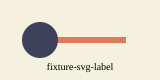

# Nested Render Topic

Inline mathematics renders as $\sigma_x^2 = I$.

$$
e^{i\pi} + 1 = 0.
$$

The bibliography fixture is cited here [@fixture2026].



```{python}
#| echo: false
print("EXECUTED_SENTINEL_OUTPUT")
```

## Reading map

No child pages have been promoted.
