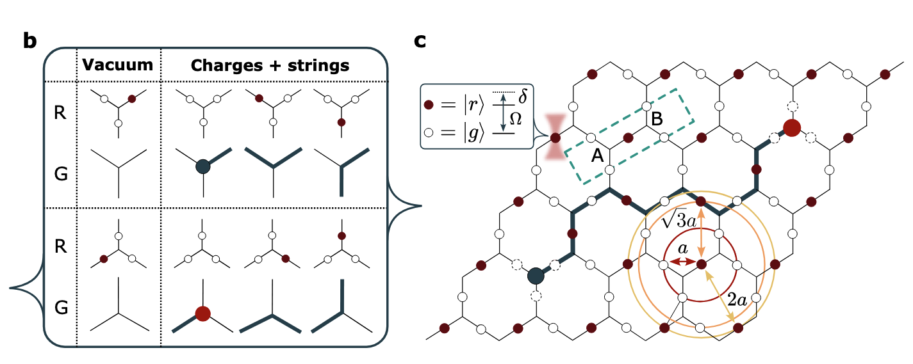

---
categories:
- Theory
date: 2026-04-20
lang: en
title: 'Kagome Lattice'
bibliography: refs.bib
status: draft
---

# Summary and Questions

# Kagome Lattice
Kagome Lattice are point generated by $\mathbf{v}(n_1,n_2) = n_1 \mathbf{a}_1 + n_2 \mathbf{a}_2$, with $n_1,n_2 \in \mathbb{Z}$ while $n_1,n_2$ cannot simultaneously be odd.
Here $\mathbf{a}_1 = (2a, 0)$ and $\mathbf{a}_2 = (a, \sqrt{3}a)$, where $a$ is the lattice spacing. 

$$
H_{\text{Ryd}} = 2\Omega \sum_\ell X_\ell - \delta \sum_\ell n_\ell + \frac{1}{2}\sum_{(\ell, \ell')} V_{\ell,\ell'} n_\ell n_{\ell'}.
$$
Here $l$ is the link index and the atoms are put on the links of the hexagonal lattice.
The typical phased is summarized in the following figure:

{#fig-kagome-lattice width=100%}

# blockade regime

A quantum linking model involves hardcore Boson $[a_x, a_y^\dagger] = \delta_{x,y}$ and  spin-$1/2$ operators $S^\pm_\ell, S^z_\ell$ with $x,y,z$ supporting on two sublattices $A$ and $B$.
Defining $s_x = 0$ for $x \in A$ and $s_x = 1$ for $x \in B$, the Hamiltonian and restriction are:
$$
\begin{align}
H_{\mathrm{QL}} &= \frac{\Omega}{2} \sum_{\langle x,y\rangle} \left[a^\dagger_x S^+_{\langle x,y \rangle}a_y + \text{H.c.}\right] + \frac{\delta}{2}\sum_x (-1)^{s_x} a^\dagger_x a_x,\\
\nabla_x S^z &= Q_x + q_x, \quad Q_x := a^\dagger_x a_x - [1 - (-1)^{s_x}]/2.
\end{align}
$$
The operator $Q_x$ shall be understood as the charge operator.

- For excitation on $A$, $Q_x = a_x^\dagger a_x$, which means excitation brings a positive charged particle to $x$.
- For excitation on $B$, $Q_x = a_x^\dagger a_x - 1$, which means cancels a pre-existing negative charged particle to $x$.

This menas that even at vacuum, we have $Q_x = -\frac{1 - (-1)^{s_x}}{2}$.
To ensure that when vacuum, the total charge takes no charges anywhere, we need to set up background charge $q_x = \frac{1 - (-1)^{s_x}}{2}$.
Such a Hamiltonian corresponds to the quantum link representation of the continuous Abelian Higgs model.
[todo: In the follwing we set up $q_x = (-1)^{s_x}/2$ instead. Add detailed discussion about this.]

It turns out that this Hamiltonian is equivalent to the Rydberg Hamiltonian on kagome-lattice under the Rydberg blockade regime.

{#fig-kagome-lattice width=100%}

We first consider the dual lattice of the kagome lattice, which is a hexagonal lattice with link $\ell$ that corresponds to real atoms and site $x$ corresponds to effective bosons.
Then the hexagon site is splited into two sublattices $A$ and $B$, thus the resign cefficient $(-1)^{s_x}$.

In the regime of Rydberg blockade, each triangle side only contains single atom in the Rydberg state, i.e., $\sum_{\ell \in x} \ket{r_\ell}\bra{r_\ell} := N_x$ with state constraint at $\{N_x \ket{\psi} = n_x \ket{\psi},n_x \in \{0, 1\}\}$.
We further define:
$$
\begin{align}
&\nabla_x S^z = Q_x + q_x = -(-1)^{s_x} ( N_x- \frac{3}{2})
\end{align}
$$
One can verify that $a_x^\dagger a_x$ and the charge operator and $Q_x$ satsified:
$$
\begin{align}
Q_x \ket{\psi} &=\left[(-1)^{s_x} (\frac{3}{2} - N_x) - q_x\right]\ket{\psi}\\
a_x^\dagger a_x \ket{\psi} &= (Q_x + \frac{1 - (-1)^{s_x}}{2})\ket{\psi}.
\end{align}
$$

The restriction to the subspace $\{N_x \ket{\psi} = n_x \ket{\psi},n_x \in \{0, 1\}\}$, is then equivalnent to $q_x = (-1)^{s_x}/2$ such that:

- When $N_x = 0$, $Q_x = (-1)^{s_x}$ and $a_x^\dagger a_x = \frac{1 + (-1)^{s_x}}{2}$; This means that site $x$ has a positive(negative) charged particle if $x$ is in $A$($B$).
- When $N_x = 1$, $Q_x = 0$ and $a_x^\dagger a_x = \frac{1 - (-1)^{s_x}}{2}$.

To ensures $\nabla_x S^z =- (-1)^{s_x} ( N_x- \frac{3}{2})$, we need to define the gauge field $S^z$ as:
$$
S^z_\ell = (-1)^{s_\ell} (n_\ell - 1/2)
$$
where $s_\ell = 0$ for intra-cell links and $s_\ell = 1$ for inter-cell links.
This transformed the Rydberg Hamiltonian to:
$$
\begin{align}
H_{\rm eff} &= \frac{\Omega}{2} \sum_{\langle x,y\rangle} \left[a^\dagger_x S^+_{\langle x,y \rangle}a_y + \text{H.c.}\right] + \frac{\delta}{2}\sum_x (-1)^{s_x} a^\dagger_x a_x \\
&+ \frac{1}{2}\sum_{(\ell, \ell^\prime)\neq \langle\ell, \ell^\prime\rangle}V_{\ell,\ell^\prime}\left[(-1)^{s_\ell}S^z_\ell + \frac{1}{2}\right]\left[(-1)^{s_{\ell^\prime}}S^z_{\ell^\prime} + \frac{1}{2}\right]
\end{align}
$$ 