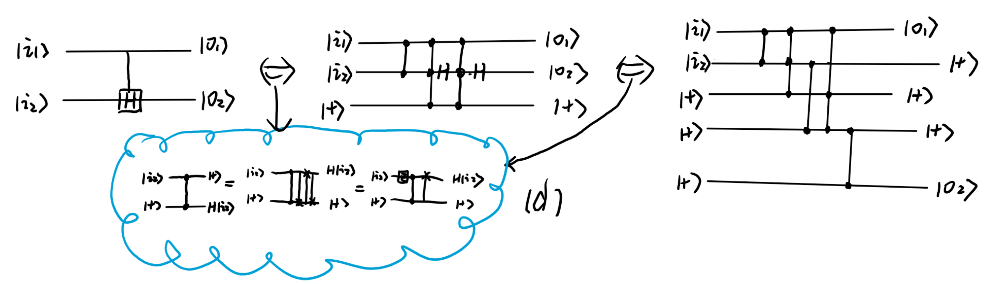

---
categories:
- Readings
date: '2026-01-13'
lang: en
title: Generalized Stabilizer Formalism
bibliography: refs.bib
jupyter: python3
keep-ipynb: false
code-fold: true
---

**Abstract**: Is there an advantage to using Clifford formalism in a vectorized space compared to using it directly? This is an on-going research topic. refer to [here](/workspace/OSF_research/index.qmd) for more details.

## GSF and Its Advantages

We know that Clifford $C$ performs a swap between Pauli operators $P \to CPC^\dagger$.
Consider the Choi state of a Pauli operator $|P\rangle\!\rangle \in \mathcal{H} \otimes \mathcal{H}^*$, which undergoes a transformation under the action of $C \otimes C^{*}$:
$$
|P\rangle\!\rangle \to |Q\rangle\!\rangle = C \otimes C^{*}|P\rangle\!\rangle 
$$
If we can map the Choi state of a Pauli operator $|P\rangle\!\rangle$ through a unitary transformation $U \in \mathcal{H} \otimes \mathcal{H}^*$ to the computational basis one-to-one, then all Clifford operations' transformations $U C \otimes C^* U^\dagger$ become coherence non-increasing gates.
We find that such a transformation $U$ exists:

$$
\begin{align*}
    &\{I/\sqrt{2},Z/\sqrt{2},X/\sqrt{2},Y/\sqrt{2}\} \\
    &\xrightarrow{\mathcal{V}}\{\frac{\ket{00}_{ab}+\ket{11}_{ab}}{\sqrt{2}},\frac{\ket{00}_{ab}-\ket{11}_{ab}}{\sqrt{2}},\frac{\ket{01}_{ab}+\ket{10}_{ab}}{\sqrt{2}},\frac{-i\ket{01}_{ab}+i\ket{10}_{ab}}{\sqrt{2}}\}\\
    &\xrightarrow{U = CS_{ba}^\dagger H_bCNOT_{ba}}\{\ket{0}_a\ket{0}_b, \ket{0}_a\ket{1}_b, \ket{1}_a\ket{0}_b,\ket{1}_a\ket{1}_b\},\\
    &\xrightarrow{\mathcal{V}^{-1}}\{\ket{0}\!\bra{0}, \ket{0}\!\bra{1}, \ket{1}\!\bra{0},\ket{1}\!\bra{1}\}.
\end{align*}
$$

Here, each single-qubit Pauli operator becomes a two-qubit system with qubits $a,b$, and $\{I,X,Y,Z\}$ correspond to $\ket{\mathbf{P}} \in \{\ket{00},\ket{10},\ket{01},\ket{11}\}$ respectively.

:::{.callout-important icon="false"}
## Question: (Symplectic Representation)
This corresponds to the sympletic representation of the Pauli operators. Is there a way to understand this from the symplectic geometry perspective?
:::

:::{#lem-gsf_pauli_to_computational .callout-note icon="false"}
## (GSF Pauli to Computational Basis)
Under this substitution, it can be shown that common Clifford gates transform as follows:
$$
\begin{align*}
    CNOT_{12}(\cdot)CNOT_{12} &\to \textbf{CCZ}_{a_1b_2b_1}\textbf{CCZ}_{a_1b_2a_2} \textbf{CZ}_{a_1b_2}\textbf{CNOT}_{a_1a_2} \textbf{CNOT}_{b_2b_1}(\cdot), \\
    S^\dagger(\cdot)S &\to \mathbf{CZ}_{ab}\mathbf{CNOT}_{ab}(\cdot),\\
    H(\cdot)H &\to \mathbf{CZ}_{ab}\textbf{SWAP}_{ab}(\cdot),\\
    T^\dagger(\cdot)T &\to \textbf{CZ}_{ab}\textbf{CH}_{ab}(\cdot),
\end{align*}
$$
:::

::: {.callout-note collapse="true"}
## Proof
Noted that:
$$
\begin{align*}
&\mathbf{CZ}_{ab}\mathbf{CH}_{ab}(\cdot)
\left\{
\begin{aligned}
\ket{00}\to I \to T^\dagger IT &= I\to \ket{00}\\
\ket{01}\to Z \to T^\dagger ZT &= Z\to \ket{01}\\
\ket{10}\to X \to T^\dagger XT &= \frac{X + Y}{\sqrt{2}}\to \ket{1+}\\
\ket{11}\to Y \to T^\dagger YT &= -\frac{X - Y}{\sqrt{2}}\to -\ket{1-}\\
\end{aligned}
\right.
\\
&\mathbf{CZ}_{ab}\mathbf{SWAP}_{ab}(\cdot)
\left\{
\begin{aligned}
\ket{00}\to I \to H^\dagger IH &= I\to \ket{00}\\
\ket{01}\to Z \to H^\dagger ZH &= X\to \ket{10}\\
\ket{10}\to X \to H^\dagger XH &= Z\to \ket{01}\\
\ket{11}\to Y \to H^\dagger YH &= -Y\to -\ket{11}\\
\end{aligned}
\right.
\\
&\mathbf{CZ}_{ab}\mathbf{CNOT}_{ab}(\cdot)
\left\{
\begin{aligned}
\ket{00}\to I \to S^\dagger IS &= I\to \ket{00}\\
\ket{01}\to Z \to S^\dagger ZS &= Z\to \ket{01}\\
\ket{10}\to X \to S^\dagger XS &= -Y\to -\ket{11}\\
\ket{11}\to Y \to S^\dagger YS &= X\to \ket{10}\\
\end{aligned}
\right.
\end{align*}
$$
Here the dual circuit of $CNOT_{12}$ is more complex, as show as:
$$
\left\{
\begin{aligned}
&\ket{0000}\to II \to CNOT_{12}^\dagger II CNOT_{12} = II\to \ket{0000}\\
&\ket{0001}\to IZ \to CNOT_{12}^\dagger ZZ CNOT_{12} = ZZ\to \ket{0101}\\
&\ket{0010}\to IX \to CNOT_{12}^\dagger IX CNOT_{12} = IX\to \ket{0010}\\
&\ket{0011}\to IY \to CNOT_{12}^\dagger ZY CNOT_{12} = ZY\to \ket{0111}\\
&\ket{0100}\to ZI \to CNOT_{12}^\dagger ZI CNOT_{12} = ZI\to \ket{0100}\\
&\ket{0110}\to ZX \to CNOT_{12}^\dagger ZX CNOT_{12} = ZX\to \ket{0110}\\
&\ket{0111}\to ZY \to CNOT_{12}^\dagger ZY CNOT_{12} = IY\to \ket{0011}\\
&\ket{0101}\to ZZ \to CNOT_{12}^\dagger ZZ CNOT_{12} = IZ\to \ket{0001}\\
&\ket{1000}\to XI \to CNOT_{12}^\dagger XX CNOT_{12} = XX\to \ket{1010}\\
&\ket{1010}\to XX \to CNOT_{12}^\dagger XX CNOT_{12} = XI\to \ket{1000}\\
&\ket{1011}\to XY \to CNOT_{12}^\dagger XY CNOT_{12} = YZ\to \ket{1101}\\
&\ket{1001}\to XZ \to CNOT_{12}^\dagger XZ CNOT_{12} = -YY\to -\ket{1111}\\
&\ket{1100}\to YI \to CNOT_{12}^\dagger YI CNOT_{12} = YX\to \ket{1110}\\
&\ket{1110}\to YX \to CNOT_{12}^\dagger YX CNOT_{12} = YI\to \ket{1100}\\
&\ket{1111}\to YY \to CNOT_{12}^\dagger YY CNOT_{12} = -XZ\to -\ket{1001}\\
&\ket{1101}\to YZ \to CNOT_{12}^\dagger YZ CNOT_{12} = XY\to \ket{1011}\\
\end{aligned}
\right.
$$
The binary string exchange can be equivalent realized through the gate $\textbf{CNOT}_{a_1a_2} \textbf{CNOT}_{b_2b_1}$. But we hav to pick out $1001,1111$ string and add $-1$ signal there. Noted that this is equivalent to the function $(-1)^{f(a_1b_1a_2b_2)}$ where $f = a_1b_2 ( 1 + b_1 + a_2)$ is a Boolean funtion. The rank-3 term in $f(x)$ means that $CCZ$ gate is necessary to tracing this phase change. In this case we have $\textbf{CCZ}_{a_1b_2b_1}\textbf{CCZ}_{a_1b_2a_2} \textbf{CZ}_{a_1b_2}\textbf{CNOT}_{a_1a_2} \textbf{CNOT}_{b_2b_1}$.
:::

```{python}
import matplotlib.pyplot as plt
from qiskit import QuantumCircuit, QuantumRegister, ClassicalRegister
from qiskit.circuit import Qubit, Clbit

class DualCircuitConverter:
    def __init__(self, original_circuit: QuantumCircuit, 
                 input_state: str = None, 
                 output_pauli: str = None):
        self.orig_qc = original_circuit
        self.n_qubits = original_circuit.num_qubits

        self.input_state_str = input_state
        self.output_pauli_str = output_pauli

        self.q_map = {q: i for i, q in enumerate(original_circuit.qubits)}
        
        self.dual_qc = None
        self._build_dual_circuit()

    def _build_dual_circuit(self):
        reg_a = QuantumRegister(self.n_qubits, 'a')
        reg_b = QuantumRegister(self.n_qubits, 'b')
        registers = [reg_a, reg_b]
        if self.input_state_str:
            creg = ClassicalRegister(2 * self.n_qubits, 'meas')
            registers.append(creg)
        
        self.dual_qc = QuantumCircuit(*registers)
        
        if self.output_pauli_str:
            if len(self.output_pauli_str) != self.n_qubits:
                raise ValueError("Output Pauli string length must match num_qubits.")

            for i, p_char in enumerate(self.output_pauli_str):
                p_char = p_char.upper()
                if p_char == 'Z':   # |0>_a |1>_b
                    self.dual_qc.x(reg_b[i])
                elif p_char == 'X': # |1>_a |0>_b
                    self.dual_qc.x(reg_a[i])
                elif p_char == 'Y': # |1>_a |1>_b
                    self.dual_qc.x(reg_a[i])
                    self.dual_qc.x(reg_b[i])
            
            self.dual_qc.barrier(label='Dual Input')

        for instruction in reversed(self.orig_qc.data):
            op_name = instruction.operation.name
            qubits = instruction.qubits
            
            indices = [self.q_map[q] for q in qubits]
            
            if op_name == 'h':
                # H -> CZ_ab * SWAP_ab
                idx = indices[0]
                self.dual_qc.swap(reg_a[idx], reg_b[idx])
                self.dual_qc.cz(reg_a[idx], reg_b[idx])
                
            elif op_name == 's':
                # S -> CZ_ab * CNOT_ab
                idx = indices[0]
                self.dual_qc.cx(reg_a[idx], reg_b[idx])
                self.dual_qc.cz(reg_a[idx], reg_b[idx])
                
            elif op_name == 't':
                # T -> Z_b * CH_ab
                idx = indices[0]
                self.dual_qc.ch(reg_a[idx], reg_b[idx]) 
                self.dual_qc.cz(reg_a[idx], reg_b[idx])
                
            elif op_name == 'cx':
                # CNOT -> CNOT_a * CNOT_b (reverse direction)
                c_idx, t_idx = indices[0], indices[1]
                self.dual_qc.ccz(reg_a[c_idx], reg_b[t_idx], reg_a[t_idx])
                self.dual_qc.ccz(reg_a[c_idx], reg_b[t_idx], reg_b[c_idx])
                self.dual_qc.cz(reg_a[c_idx], reg_b[t_idx])
                self.dual_qc.cx(reg_a[c_idx], reg_a[t_idx]) # a: control -> target
                self.dual_qc.cx(reg_b[t_idx], reg_b[c_idx]) # b: target -> control

                
            elif op_name == 'barrier':
                mapped_qubits = []
                for idx in indices:
                    mapped_qubits.append(reg_a[idx])
                    mapped_qubits.append(reg_b[idx])
                self.dual_qc.barrier(*mapped_qubits)

        if self.input_state_str:
            self.dual_qc.barrier(label='Dual Output')
            if len(self.input_state_str) != self.n_qubits:
                raise ValueError("Input state string length must match num_qubits.")
            for i, s_char in enumerate(self.input_state_str):
                if s_char == '0':
                    self.dual_qc.h(reg_b[i])
                elif s_char == '1':

                    self.dual_qc.h(reg_b[i]) 
            
            self.dual_qc.measure(reg_a, creg[:self.n_qubits])
            self.dual_qc.measure(reg_b, creg[self.n_qubits:])

    def draw_comparison(self, scale=0.5):

        fig, axes = plt.subplots(2, 1, figsize=(12 * scale, 10 * scale))
        self.orig_qc.draw('mpl', ax=axes[0], style='iqp')
        
        in_txt = f"|{self.input_state_str}>" if self.input_state_str else "State"
        out_txt = f"<{self.output_pauli_str}>" if self.output_pauli_str else "Pauli"
        axes[0].set_title(f"Original Circuit: Input {in_txt} $\\rightarrow$ Measure {out_txt}", fontsize=13)
        axes[0].set_ylabel("Time $\\rightarrow$")

        self.dual_qc.draw('mpl', ax=axes[1], style='iqp', fold=-1)
        
        dual_in_txt = f"State({self.output_pauli_str})" if self.output_pauli_str else "Input"
        dual_out_txt = f"Project({self.input_state_str})" if self.input_state_str else "Output"
        axes[1].set_title(f"Dual Circuit: Input {dual_in_txt} $\\rightarrow$ Measure {dual_out_txt}", fontsize=13)
        axes[1].set_ylabel("Time $\\leftarrow$ (Reversed)")
        
        plt.tight_layout()
        plt.show()
        plt.close(fig)
```

:::{.callout-note icon="false"}
## Note 1 (Pauli average to amplitude estimation)

- Dual circuit's inputs is converted from the original physical circuit's outputs, for example $X \to \sqrt{2} \ket{X} = \sqrt{2}\ket{10}$.
- Dual circuit's projection amplitude is converted from the original physical circuit's computational basis inputs, for example $|0\rangle \to \frac{\mathbb{I} + Z}{2} \to \sqrt{2^{-1}}(\ket{00} + \ket{01}) = \ket{0}\ket{+}$.
- Thus, the problem of computing $\mathrm{tr}(P C\ket{0}\!\bra{0}^{\otimes n}C^\dagger)$ on the original circuit is now transformed into calculating $2^{n/2} \bra{0+}^{\otimes n } \mathbf{C} \ket{\mathbf{P}}$ on the dual circuit.
:::

:::{.callout-note icon="false"}
## Note 2 (Non-linearity of dual circuit)

- Clifford gate $CNOT$ will generate a non-Clifford gate $CCZ$ in the dual circuit. This is because the non-linear changing of the Pauli phases. This phased gate can be reduced to a Clifford gate when the target qubit is in computational basis.
- This non-linearty derived from the degeneracy of sympletic representation in the $d = 2$ case. So we expect for general prime $d > 2$, this non-linearity will be removed @heinrich2021stabiliser.
$$
\begin{align*}
&\sigma_{\mathbf{r}} \sigma_{\mathbf{s}} = i^{[v_r,v_s]} (-1)^{d(v_r, v_s)} \sigma_{\mathbf{r} \oplus \mathbf{s}}, \forall \mathbf{r}, \mathbf{s} \in \mathbb{F}_2^n \\ 
&\sigma_{\mathbf{r}} \sigma_{\mathbf{s}} = \omega^{2^{-1}[v_r,v_s]} \sigma_{\mathbf{r} \oplus \mathbf{s}} \forall \mathbf{r}, \mathbf{s} \in \mathbb{F}_d^n, d \text{~is prime and~} d>2
\end{align*}
$$
:::

Based on this, we can demonstrated three types of previous circuits that are difficult to handle with ordinary Stabilizer Formalism but are simple within the GSF framework.

## Circuit with low T-depth

#### Previous Results
For circuit with T-depth one, computing $\bra{0^n} U^\dagger P U \ket{0^n}$(i.e., the **Pauli expectation value of the circuit**) has complexity $\mathcal{O}(n^3)$.
This is because $T$ is on the third ordinary Clifford hierarchy, and $T^\dagger P T$ turns out been the Clifford gate.

In [@zhang2025classical], it is further shown that:

:::{#lem-t1_to_iqp .callout-important icon="false"}
## （T depth one to IQP）
 Any degree-3 IQP circuit (IQP circuit with gate set $\{Z,CZ,CCZ\}$) can be compiled into T-depth one circuit, after appending $\mathcal{O}(nd)$ pure ancillas initialized to $\ket{0}$. 
:::

 This means that **Amplitude estimation** (i.e., estimating $\bra{0^n} U^\dagger \ket{0^n}\!\bra{0^n} U \ket{0^n}$) and **weak simulation** of T-depth one circuit is hardest than that of the degree-3 IQP circuits, which is Gap-P complete and believed to cause $\Delta_3 P = PH$ under plausible conjusture You may refer to [this](/theory/supermacy/IQPs/iqp_supremacy.qmd)  for a walkthrough understanding of IQP's hardness.

:::{.callout-important icon="false"}
## Question: 
Can we interpolate this sharp transition by taking $O = \ket{0}\!\bra{0}^{\otimes n_1} \otimes Z^{\otimes n_2}$ as the input state for $\bra{0^n} U^\dagger O U \ket{0^n}$?
:::
 
#### T-depth one structure in GSF framework
In the GSF framework, the T-depth one structure has a natural explanation. 

- All Clifford gates map to incoherent operations in the dual circuit, the only gates introducing superposition are $\mathbf{CH}_{ab}$ from T gates. Both $\mathbf{CCZ}$ and $\mathbf{CH}$ may introduce magic.
- When the target qubit is in computational basis, $\mathbf{CH}_{ab}$ reduces to either $\mathbf{H}_b$ (when $a = \ket{1}$) or $\mathbf{I}$ (when $a = \ket{0}$), making the entire dual circuit a Clifford circuit.
- When on of the qubit in $\mathbf{CCZ}$ is in computational basis, $\mathbf{CCZ}$ reduces to $\mathbf{CZ}$ or $\mathbf{I}$, making the entire dual circuit a Clifford circuit.
- When T gates appear in a single layer, all $\mathbf{CH}, \mathbf{CCZ}$ gates can be reduced to Clifford gates at the first time they appear.
- The circuit reduced to a Clifford circuit and the amplitude estimation can be done in $\mathcal{O}(n^3)$ via method in [@bravyi2016improved].

```{python}
from qiskit.quantum_info import Statevector, SparsePauliOp
qc = QuantumCircuit(2)
# Bell State
qc.h(0)
qc.s(1)
qc.cx(0, 1)
qc.barrier() 
# Phase gates
qc.t(0)      # S on q0
qc.t(1)      # T on q1
qc.barrier() 
# Interference
qc.cx(1, 0)
qc.h(1)
Paulis = ["ZZ","IZ","IX","IY","ZX","ZY","XY","XX","YY","YZ","XZ"]
state_orig = Statevector.from_instruction(qc)
for pauli in Paulis:
    converter = DualCircuitConverter(qc, input_state="00", output_pauli = pauli)
    if pauli == "ZZ":
        converter.draw_comparison()
    converter.dual_qc.remove_final_measurements()
    state = Statevector(converter.dual_qc)
    amplitude_00 =  state.data[0]
    n = converter.n_qubits
    dual_value = (2**(n/2)) * amplitude_00
    expectation_value = state_orig.expectation_value(SparsePauliOp(pauli[::-1]))
    print(f" {pauli} : original {expectation_value:.4f} vs dual {dual_value:.4f}")
    print("-"*100)
```
We hope the above property holds for circuits containing single layer of third level non-Clifford gate.

:::{#lem-d1c3_on_gsf .callout-important icon="false"}
## (Depth one of third level non-Clifford gate on GSF)
Given a Clifford circuit $U$ on the third level of the Clifford hierarchy, its dual circuit will reduced to a Clifford circuit given certain qubits are in computational basis. 
:::

:::{.callout-note collapse="true"}
## Proof (click to expand)
The gate $U$ third level of the Clifford hierarchy always has the representation $U = e^{i \frac{\pi}{8} P}$ for certain Pauli operator $P$ with vectorization $v_P$. Then given another Pauli operator $Q$ with vecorization $v_Q$, we have:
$$
\begin{align*}
U^\dagger Q U  &= \left\{ \begin{aligned}
    &e^{-i \frac{\pi}{4} P} Q  = \cos(\frac{\pi}{4}) Q - i \sin(\frac{\pi}{4})PQ  \text{~if~} [v_Q,v_P] = 1 \\
    &Q  \text{~if~} [v_Q,v_P] =0
\end{aligned} \right.
\end{align*}
$$
Then use the fact that $PQ$ has vectorization $v_Q+ v_P \mod 2$ up to a global non-linear phase $i^{[v_Q,v_P]} (-1)^{d(v_Q, v_P)}$ (The exact proof of this identity may refer to here [#eq-pauli-multiplication](/theory/Shadow_tomography/3desgin_multi_local_shadow.qmd#eq-pauli-multiplication)).
Thus in the GSF framework, we have:
$$
\begin{align*}
\mathbf{U} \ket{Q} &= \left\{ \begin{aligned}
    &\frac{1}{\sqrt{2}} \left(\ket{v_Q} - i \sin(\frac{\pi}{4})i^{[v_Q,v_P]} (-1)^{d(v_Q, v_P)}\ket{v_Q+ v_P}\right) \text{~if~} [v_Q,v_P] = 1 \\
    &\ket{v_Q}  \text{~if~} [v_Q,v_P] =0
\end{aligned} \right.
\end{align*}
$$
This is definitely a controlled Clifford gate up to a global non-linear phase.
:::


## Super-Clifford Circuits

Blake and Linden [@blake2020superClifford] introduced "super-Clifford circuits" where operator scrambling within a specific subspace can be classically simulated, despite generating extensive operator entanglement. The GSF framework provides a natural explanation for this phenomenon.

:::{#lem-superClifford .callout-note icon="false"}
## (Super-Clifford Gate Set)
Given a gate on three qubits $\{0,1,2\}$, define $C_3 := CX_{10} CX_{20} CZ_{01} S_0^3 S_1^3$.
Then the composition of $C_3, SWAP, T$ gates forms a circuit for which $X,Y$ Pauli averages can be computed efficiently.
:::

In our GSF framework, the dual circuit of the above circuit is show below:
```{python}
qc = QuantumCircuit(3)
qc.cx(1, 0)
qc.cx(2, 0)
qc.cz(0, 1)
qc.s(0)
qc.s(0)
qc.s(0)
qc.s(1)
qc.s(1)
qc.s(1)
qc.barrier() 
Paulis = ["XYX","IZZ","IXZ","IYZ","ZXZ","ZYZ","XZZ","YZZ","ZIZ","ZIZ","ZIX","ZIY","ZXZ","ZYZ","XZZ","YZZ"]
state_orig = Statevector.from_instruction(qc)
for pauli in Paulis:
    converter = DualCircuitConverter(qc, input_state="000", output_pauli = pauli)
    if pauli == "XYX":
        converter.draw_comparison()
    converter.dual_qc.remove_final_measurements()
    state = Statevector(converter.dual_qc)
    amplitude_00 =  state.data[0]
    n = converter.n_qubits
    dual_value = (2**(n/2)) * amplitude_00
    expectation_value = state_orig.expectation_value(SparsePauliOp(pauli[::-1]))
    print(f" {pauli} : original {expectation_value:.4f} vs dual {dual_value:.4f}")
    print("-"*100)
    

```

The efficiency can be interpreted as: the $a$-type qubits are always keeps in $\ket{1}$ computational basis under the action of the $C_3,SWAP,T$ gates.

:::{.callout-important icon="false"}
## Question: Extension to Local Operators
The Blake-Linden construction applies to operators with support on every site (X-Y strings). Can GSF identify similar simplifications for local operators containing identity factors?
:::

<!-- ```{.runpy height="400px"}
import matplotlib
matplotlib.use('Agg')  # Non-interactive backend for server
import matplotlib.pyplot as plt
from qiskit import QuantumCircuit, QuantumRegister, ClassicalRegister

class DualCircuitConverter:
    def __init__(self, original_circuit, input_state=None, output_pauli=None):
        self.orig_qc = original_circuit
        self.n_qubits = original_circuit.num_qubits
        self.input_state_str = input_state
        self.output_pauli_str = output_pauli
        self.q_map = {q: i for i, q in enumerate(original_circuit.qubits)}
        self.dual_qc = None
        self._build_dual_circuit()

    def _build_dual_circuit(self):
        reg_a = QuantumRegister(self.n_qubits, 'a')
        reg_b = QuantumRegister(self.n_qubits, 'b')
        registers = [reg_a, reg_b]
        if self.input_state_str:
            creg = ClassicalRegister(2 * self.n_qubits, 'meas')
            registers.append(creg)
        self.dual_qc = QuantumCircuit(*registers)
        
        # 1. Set Dual Input (corresponds to Original Output Pauli)
        if self.output_pauli_str:
            for i, p_char in enumerate(self.output_pauli_str):
                p_char = p_char.upper()
                if p_char == 'Z': self.dual_qc.x(reg_b[i])
                elif p_char == 'X': self.dual_qc.x(reg_a[i])
                elif p_char == 'Y':
                    self.dual_qc.x(reg_a[i])
                    self.dual_qc.x(reg_b[i])
            self.dual_qc.barrier(label='Dual Input')

        # 2. Traverse and build Unitary in reverse
        for instruction in reversed(self.orig_qc.data):
            op_name = instruction.operation.name
            indices = [self.q_map[q] for q in instruction.qubits]
            if op_name == 'h':
                self.dual_qc.swap(reg_a[indices[0]], reg_b[indices[0]])
                self.dual_qc.cz(reg_a[indices[0]], reg_b[indices[0]])
            elif op_name == 's':
                self.dual_qc.cx(reg_a[indices[0]], reg_b[indices[0]])
                self.dual_qc.cz(reg_a[indices[0]], reg_b[indices[0]])
            elif op_name == 't':
                self.dual_qc.ch(reg_a[indices[0]], reg_b[indices[0]]) 
                self.dual_qc.z(reg_b[indices[0]])
            elif op_name == 'cx':
                self.dual_qc.cx(reg_a[indices[0]], reg_a[indices[1]])
                self.dual_qc.cx(reg_b[indices[1]], reg_b[indices[0]])

        # 3. Set Dual Output
        if self.input_state_str:
            self.dual_qc.barrier(label='Dual Output')
            for i, s_char in enumerate(self.input_state_str):
                self.dual_qc.h(reg_b[i])
            self.dual_qc.measure(reg_a, creg[:self.n_qubits])
            self.dual_qc.measure(reg_b, creg[self.n_qubits:])

    def print_circuits(self):
        print("=" * 60)
        print("ORIGINAL CIRCUIT")
        print("=" * 60)
        print(self.orig_qc.draw(output='text'))
        print("\n" + "=" * 60)
        print("DUAL CIRCUIT (GSF Transformation)")
        print("=" * 60)
        print(self.dual_qc.draw(output='text', fold=80))

# Test: Create a circuit with Bell state + T gates
qc = QuantumCircuit(2)
qc.h(0)
qc.s(1)
qc.cx(0, 1)
qc.t(0)
qc.t(1)
qc.cx(1, 0)
qc.h(1)

# Transform: input |00>, measure YZ expectation
converter = DualCircuitConverter(qc, input_state="00", output_pauli="YZ")
converter.print_circuits()

print("\n" + "=" * 60)
print("INTERPRETATION")
print("=" * 60)
print("The dual circuit computes: 2^(n/2) * <0+|^n @ C @ |P>")
print("where |P> encodes the Pauli operator YZ")
print("Y -> (a=1, b=1), Z -> (a=0, b=1)")
``` -->

## A proposal for general circuits

:::{.callout-important icon="false"}
## Question: Why is this transformation useful?
A reasonable question is: For general circuits, how do we identify unnecessary T-gates and eliminate them?
:::

For general circuits, $\mathbf{CH}_{ab}$ gates may act on superposition states in the $a$-register, and cannot be trivially reduced to $\mathbf{H}$ or $\mathbf{I}$. The following algorithm systematically identifies and eliminates superfluous $\mathbf{CH}$ gates, reducing the simulation cost.

Let $t$ denote the number of T gates in the original circuit (equivalently, the number of $\mathbf{CH}$ gates in the dual circuit).

**Step 1 (Recompile $\mathbf{CH}$)**: Decompose each $\mathbf{CH}_{ab}$ gate into incoherent operations $\mathrm{CCZ}$, at the cost of introducing 3 ancilla qubits per $\mathbf{CH}$ gate.



**Step 2 (Commute $\mathbf{CNOT}$ gates)**: Move all $\mathbf{CNOT}$ gates to the beginning of the circuit. By the generalized Clifford hierarchy, diagonal phase gates ($\mathbf{CZ}$, $\mathbf{CCZ}$) can be commuted past $\mathbf{CNOT}$ gates with phase gate corrections.

**Step 3 (Eliminate non-ancilla qubits)**: All non-ancilla qubits now pass only through incoherent operations and can be classically traced and eliminated. The remaining circuit acts on $3t$ ancilla qubits, each initialized to $(\ket{0} + \ket{1})/\sqrt{2}$.

**Step 4 (Find minimum cover set)**: On this $3t$-qubit circuit of diagonal phase gates, find the *minimum vertex cover set* $S$ for the $\mathbf{CCZ}$ gates — the smallest set of qubits such that every $\mathbf{CCZ}$ gate acts on at least one qubit in $S$.

**Step 5 (Decompose into Clifford circuits)**: Expand each qubit in $S$ in the computational basis $\{\ket{0}, \ket{1}\}$. This transforms the circuit into $2^{|S|}$ distinct Clifford circuits (since all $\mathbf{CCZ}$ gates become at most $\mathbf{CZ}$ gates on the fixed branches).

**Step 6 (Simulate and sum)**: Simulate each Clifford circuit independently and sum the results.


The total complexity is:
$$
T \sim 2^{|S|} \cdot \mathcal{O}((3t)^3)
$$
where $|S|$ is the minimum vertex cover size and $t$ is the T-count. The exponential cost depends only on the structure of the $\mathbf{CCZ}$ interaction graph, not on the total number of qubits $n$. For circuits where T gates have sparse interactions, $|S|$ can be significantly smaller than $t$.

## Generalized Clifford Formalism

The GSF construction above is an instance of a broader algebraic structure: the *generalized Clifford group* on different matrix bases. For the full treatment with proofs, see [Magic based on Pauli spectrum](operator_magic.qmd).

:::{#def-matrix_basis_ring .callout-note icon="false"}
## Definition (Matrix Basis Ring)
A matrix basis ring is a set of linearly independent matrices $\mathcal{B}=\{B_j\}_{j = 1}^{N} \cup \{0\}$ closed under multiplication and adjoint: $B_j \cdot B_k \in \mathcal{B}$ and $B_j^\dagger \in \mathcal{B}$. A unitary $U$ satisfying $U^\dagger B_i U = \alpha_i B_{\pi(i)}$ is called a **generalized Clifford** of $\mathcal{B}$, denoted $\mathcal{C}(\mathcal{B})$. If additionally $U^\dagger B_i U = \alpha_i B_i$ (i.e., $\pi = \text{id}$), then $U \in \mathcal{P}(\mathcal{B})$ is a **generalized Pauli** of $\mathcal{B}$.
:::

Two important examples:

- **Pauli basis**: $\mathcal{B}_{\text{Pauli}}:=\{\pm i,\pm1\} \times \{I,Z,X,Y\}^{\otimes n} \cup \{0\}$. Its Clifford group $\mathcal{C}(\mathcal{B}_{\text{Pauli}}) \sim \langle CNOT,S,H \rangle$ is the standard Clifford group [@gottesman1998heisenberg], and $\mathcal{P}(\mathcal{B}_{\text{Pauli}}) = \mathcal{B}_{\text{Pauli}}$.
- **Computational basis**: $\mathcal{B}_{\text{comp}} = \{\pm i, \pm 1\} \times \{\ket{i}\!\bra{j}\}_{i,j = 0,1}^{\otimes n}\cup \{0\}$. Its Clifford group $\mathcal{C}(\mathcal{B}_{\text{comp}})\sim \langle CX,S,CCX \rangle$ consists of permutation-phase gates $\sum_{j}e^{i\phi(j)} \ket{\pi(j)}\!\bra{j}$, and its Pauli group $\mathcal{P}(\mathcal{B}_{\text{comp}}) = \sum_{j}e^{i\phi(j)} \ket{j}\!\bra{j}$ consists of diagonal phase gates.

:::{#def-gen_cliff_hierarchy .callout-note icon="false"}
## Definition (Generalized Clifford Hierarchy)
The $k$-th level of the generalized Clifford hierarchy is defined recursively:
$$
\mathcal{C}_{k}(\mathcal{B}):=\{U \mid U^\dagger P U \in \mathcal{C}_{k-1}(\mathcal{B}),\ \forall P \in \mathcal{P}(\mathcal{B}) \}, \quad \mathcal{C}_{1}(\mathcal{B}) := \mathcal{C}(\mathcal{B}).
$$
:::

For $\mathcal{B}_{\text{comp}}$, this hierarchy implies that diagonal phase gates ($CZ$, $CCZ$) can be commuted past $CNOT$ gates with phase 
gate corrections — a property that will be essential for the general circuit algorithm below.

The vectorization of $\mathcal{B}_{\text{Pauli}}$ and $\mathcal{B}_{\text{comp}}$ are related by the unitary $U = CS_{ba}^\dagger H_b CNOT_{ba}$ in the doubled Hilbert space. This is precisely the GSF transformation defined above. The question then becomes the questionbelow:

:::{.callout-important icon="false"}
## Question: (Equivalence of Clifford Structures)
Is all generalized Clifford circuits are equivalent in the vectorization space up to a unitary transformation.
:::

:::{.callout-tip icon="false"}
## Key Observation
Examining @lem-gsf_pauli_to_computational, we note that except for $\mathbf{CH}_{ab}$ (arising from T gates), **all** GSF dual gates — $\mathbf{SWAP}$, $\mathbf{CNOT}$, $\mathbf{CZ}$, $\mathbf{CCZ}$ — are incoherent operations in the computational basis. They do not generate superposition. The $\mathbf{CH}_{ab}$ gate is the **sole source of non-classicality** in the dual circuit.
:::

This observation is the foundation for all the applications that follow.

## Simulating Noisy Circuits

Consider whether the above setup can be used for noisy circuits.
This type of noise has been studied extensively, including:

1. Pauli-path simulation truncation
2. [Random percolation based on graph states](/theory/arXiv-2212.08677v2/index.qmd)

:::{.callout-important icon="false"}
## Question: (Noisy Circuit Simulation)
Given $\sum_{i  =1}^m K_i \rho K_i^\dagger$ 

Can This be used to 
:::

Consider the simplest form of Pauli noise, $\Lambda(\rho) = \sum_{\mathbf{r} \in \mathbb{F}_{2}^{2n}} 2^{-n}\lambda_{\mathbf{r}} \sigma_{\mathbf{r}} \mathrm{tr}\left[\rho \sigma_{\mathbf{r}} \right]$, which corresponds to a non-unitary matrix: $\mathbf{\Lambda} := \sum_{P} 2^{-n}\lambda_{\mathbf{r}} \ket{\mathbf{r}} \!\bra{\mathbf{r}}$. For local noise, it can even be written in the form $\mathbf{\Lambda} = \bigotimes_{i=1}^n \Omega_i$.

This matrix operation on quantum states is not a Clifford operation; forcing its use within the Clifford formalism would decompose it into an exponentially large sum of Cliffords, which introduces too much magic to the circuit and makes simulation exponentially hard.

If we adopt method 2 above, for the mean $\langle P \rangle = \mathrm{tr}(\Lambda\circ\mathcal{U}_d \cdots \Lambda\circ\mathcal{U}_1[\rho] \cdot P)$:

1. First, convert it to an amplitude of a computational circuit using GSF: $\langle P \rangle  =\bra{0+}^{\otimes n} 2^{n/2} \prod_{i=1}^d (\mathbf{\Lambda} \cdot \mathbf{U}_i)\ket{\mathbf{P}}$
2. Then, move all the noise to act last:
$$
\langle P \rangle  = 2^{n/2}\bra{0+}^{\otimes n} \left(\prod_{i=1}^d \mathbf{\Lambda}_i \right) \cdot \left(\prod_{i=1}^d \mathbf{U}_i\right) \ket{\mathbf{P}}, \mathbf{\Lambda}_i := \left(\prod_{k = 1}^i \mathbf{U}_k \right)\mathbf{\Lambda} \left(\prod_{k = 1}^i \mathbf{U}_k \right)^\dagger
$$

If the circuit $\mathcal{U}_i$ does not contain a $T$ gate, then it is manageable because each $\mathbf{U}_i$ is an operation that does not generate superposition, and matrix $\mathbf{\Lambda}_i$ will remain diagonal with each mapping $\lambda^{(i)}_{\mathbf{r}}: \mathbf{r} \in \mathbb{F}_2^{2n}  \to \mathbb{R}$ being efficiently computable. This is entirely equivalent to tracking Pauli operators and updating the suppression of Pauli noise on these operators.

When a $\mathbf{CH}$ gate exists in the circuit, it can be seen as splitting the computational basis $\ket{P}$. However, this is completely equivalent to method 1 above. Another approach is to examine updates:
$$
\mathbf{CH} \cdot \mathbf{\Lambda} \cdot \mathbf{CH}
$$

However, note that this difficulty is **purely classical**. Consider introducing **classical randomness** into the GSF to accomplish this task.
