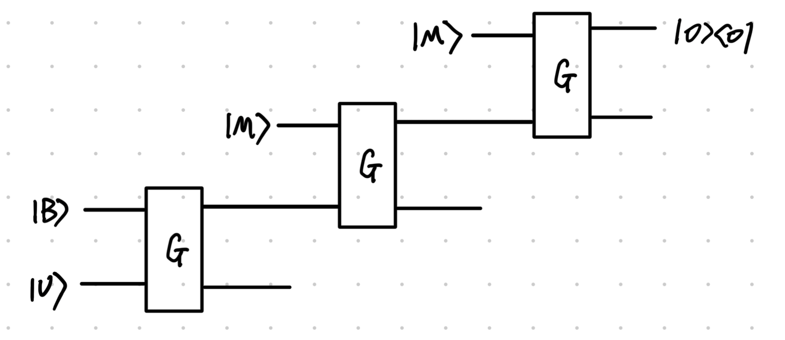

---
categories:
- Readings
date: '2026-02-17'
lang: en
title: OTOC and its simulation
bibliography: refs.bib
jupyter: python3
code-fold: true
draft: true
---

# Summarize


# Basic concepts
## Time-ordered correlation
Consider a randomized unitary circuit $U$ on $n$ qubits with $D = 2^n$. Let $M$ being a Pauli operator satisfying $\mathrm{tr}(M) = 0$. Let $B$ be another traceless Pauli operator, which we called the betterfly operator, and its evolution under $U$ is $B(t) = U^\dagger B U$. In the real experiment, for simplicity, $B$ and $M$ both only support on constant number of qubit @abanin2025constructive. 

:::{#def-time-ordered-correlator .callout-note icon="false"}
## (Time-ordered correlator)
Define the **time-ordered correlator operator** $C = U^\dagger B U M$. Then the inifinite temperature time-ordered correlation and zero-temperature time-ordered correlation (with respect to $\ket{0^n}$) are respectively:
$$
2^{-n}\mathrm{tr}(C) =  2^{-n}\sum_{\mathbf{s}}\langle \mathbf{s}|C|\mathbf{s}\rangle    \quad \text{and} \quad   \langle 0^n|C|0^n\rangle.
$$
:::

To estimate time-ordered correlation, we shall set up initial state $\ket{\mathbf{s}}$ as the eigenbasis of $M$ and then implement the circuit $U$, end with a measurement of observable $M$.

For example, if $M = Z^{\otimes n}$, then the initial state can be chosen as $\ket{0^n}$. 
$\langle 0^n|C|0^n\rangle $ then can be estimated by preparing $\ket{0^n}$ and evolve under circuit $U^\dagger Z^{\otimes n} U$, finnally calculate the probability that gives $\mathbf{s}$.

For infinite temperature case, since $M\ket{\mathbf{s}} = (-1)^{|\mathbf{s}|}\ket{\mathbf{s}}$, the correlation then can be calculated as:
$$
2^{-n}\sum_{\mathbf{s}}\langle \mathbf{s}|C|\mathbf{s}\rangle =2^{-n}\sum_{\mathbf{s}}(-1)^{|\mathbf{s}|} \langle \mathbf{s}|U^\dagger B U|\mathbf{s}\rangle.
$$
Thus on a quantum computer, time-ordered correlation can be realized by sampling $\mathbf{s}$ from $2^n$ choices and evolve under circuit $U^\dagger B U$, finnally calculate the probability that gives $\mathbf{s}$.
 
Then what's the expected value of correlation given $U$?

:::{#lem-correlator_avg .callout-important icon="false"}
## (Correlator Average)
If $U$ is sampled from a 2-design, then
given $B$ a traceless Pauli operator and $M$ a Pauli-$Z$ operator, the time-ordered correlator average $\langle 0^n|U^\dagger B U M|0^n\rangle$ is $0$, with variance $1/(2^n + 1)$. 
:::

::: {.callout-note collapse="true"}
## Proof (Click to expand)
The integral of a projector over the Haar measure yields the maximally mixed state, given $\langle 0^n|U^\dagger B U M|0^n\rangle = x$, we have
$$
\mathbb{E}[x] = \mathrm{tr}\left(O \frac{I}{D}\right) = \frac{\mathrm{tr}(O)}{D}
$$
Because Pauli operators (like the single-qubit observable $A$, or the butterfly operator $B$ mentioned in the text) are traceless, $\mathrm{tr}(O) = 0$. Therefore, the mean expectation value is strictly 0. To compute the variance, we need to compute the second moment of the correlator average.
$$
\begin{align*}
\mathbb{E}[x^2] &= \mathbb{E}_{U} \mathrm{tr} \left(B^{\otimes 2} U^{\otimes 2} |0^{2n}\rangle \! \langle 0^{2n}|U^{\dagger, \otimes 2}\right)\\
&= \mathrm{tr}\left[B^{\otimes 2} \frac{\mathbb{I}_n^{\otimes 2} + \mathrm{SWAP}^{\otimes n}}{2^n(2^n + 1)}\right] = \frac{1}{2^n + 1}
\end{align*}
$$

:::

This means that "guessing zero" is a good classical simulation strategy for the time-ordered correlator if $U$ forms a $2$-design.

## OTOCs

To probe genuine scrambling, we need the **out-of-time-order correlator** (OTOC). 

:::{#def-otoc .callout-note icon="false"}
## (Out-of-time-order correlator)
Given definition $B(t) = U^\dagger B U, C = B(t)M$, the zero-temperator OTOCs with respect to $\ket{0^n}$ are respectively:
$$
\begin{align*}
&\mathrm{OTOC}^{1} := \langle 0^n | C^2 | 0^n \rangle = \langle 0^n | U^\dagger B U M U^\dagger B U M | 0^n \rangle\\
&\mathrm{OTOC}^{2} := \langle 0^n | C^4 | 0^n \rangle = \langle 0^n | U^\dagger B U M U^\dagger B U M U^\dagger B U M U^\dagger B U M | 0^n \rangle\\
&\mathrm{OTOC}^{k} :=\langle 0^n | C^{2k} | 0^n \rangle = \cdots
\end{align*}
$$
:::

Usually, it is set that $M\ket{0^n} = \ket{0^n}$, the trailing $M$ acts trivially and $\mathrm{OTOC}^{1} = \langle 0^n|U^\dagger B U M U^\dagger B U M|0^n\rangle$ and can be estimated on qunautm computer through preparing initial state $\ket{0^n}$ and evolve under circuit $U^\dagger B U M U^\dagger B U M$, finnally calculate the probability that gives $0^n$.

:::{#lem-otoc .callout-important icon="false"}
## (OTOC Average)[@maldacena2016bound; @roberts2017chaos]

1. If $U$ is shallow such that $[B(t), M] = 0$, then $\langle 0^n|C^2|0^n\rangle = 1$.
2. If $U$ is drawn from a **unitary 2-design**, then $\mathbb{E}[\langle 0^n|C^2|0^n\rangle] = -\dfrac{1}{D^2 - 1}$.
3. Computing $\mathrm{Var}[\langle 0^n|C^2|0^n\rangle]$ requires a **4-design** (since $U$ appears at degree 4 in $\mathbb{E}[x^2]$).
:::


::: {.callout-note collapse="true"}
## Proof (Click to expand)

**Part 1 (Shallow circuit).** When $[\tilde{A}, M] = 0$:
$$
C^2 = \tilde{A} M \tilde{A} M = \tilde{A}^2 M^2 = I
$$
since $\tilde{A}^2 = (U^\dagger B U)^2 = U^\dagger B^2 U = I$ and $M^2 = I$ (both are Pauli operators). Therefore $\langle 0^n|C^2|0^n\rangle = 1$.

**Part 2 (2-design average).** Let $x = \langle 0^n|\tilde{A} M \tilde{A}|0^n\rangle$ and $\rho_0 = \ket{0^n}\!\bra{0^n}$.

*Step 1 (Replica trick).* Using the trace identity $\mathrm{tr}_{12}(\mathrm{SWAP} \cdot (X \otimes Y)) = \mathrm{tr}(XY)$:
$$
x = \mathrm{tr}(\rho_0\, \tilde{A}\, M\, \tilde{A}) = \mathrm{tr}_{12}\!\left(\mathrm{SWAP} \cdot (\rho_0 \otimes M) \cdot (\tilde{A} \otimes \tilde{A})\right)
$$ {#eq-replica}

*Step 2 (Factor).* $\tilde{A} \otimes \tilde{A} = (U^\dagger)^{\otimes 2}(B \otimes B)\, U^{\otimes 2}$.

*Step 3 (2-design twirl).* Over a unitary 2-design, the Weingarten calculus gives:
$$
\mathbb{E}\!\left[(U^\dagger)^{\otimes 2} X\, U^{\otimes 2}\right] = \sum_{\sigma,\tau \in S_2} \mathrm{Wg}(\sigma^{-1}\tau,\, D)\; \mathrm{tr}(P_\sigma\, X)\; P_\tau
$$
with $\mathrm{Wg}(e, D) = 1/(D^2-1)$ and $\mathrm{Wg}((12), D) = -1/(D(D^2-1))$. For $X = B \otimes B$:

- $\mathrm{tr}(B \otimes B) = \mathrm{tr}(B)^2 = 0$ (tracelessness of $B$)
- $\mathrm{tr}(\mathrm{SWAP} \cdot B \otimes B) = \mathrm{tr}(B^2) = D$ (Pauli unitarity)

Substituting:
$$
\mathbb{E}[\tilde{A} \otimes \tilde{A}] = \frac{-\,I^{\otimes 2} + D\;\mathrm{SWAP}}{D^2 - 1}
$$ {#eq-twirl}

*Step 4 (Evaluate).* Inserting @eq-twirl into @eq-replica:
$$
\begin{aligned}
\mathbb{E}[x] &= \frac{1}{D^2-1}\Big(-\,\mathrm{tr}_{12}\!\big(\mathrm{SWAP}\cdot(\rho_0 \otimes M)\big) + D\;\mathrm{tr}_{12}\!\big(\mathrm{SWAP}\cdot(\rho_0 \otimes M)\cdot\mathrm{SWAP}\big)\Big)\\[4pt]
&= \frac{-\,\mathrm{tr}(\rho_0 M) \;+\; D\;\mathrm{tr}(M)\,\mathrm{tr}(\rho_0)}{D^2-1} = \frac{-1 + 0}{D^2-1} = \boxed{-\frac{1}{D^2-1}}
\end{aligned}
$$
where we used $\mathrm{tr}_{12}(\mathrm{SWAP}\cdot(A \otimes B)) = \mathrm{tr}(AB)$ for the first term, and $\mathrm{SWAP}(A \otimes B)\mathrm{SWAP} = B \otimes A$ (so the second term factorizes as $\mathrm{tr}(M)\,\mathrm{tr}(\rho_0)$), together with $\mathrm{tr}(\rho_0 M) = \bra{0^n}M\ket{0^n} = 1$ and $\mathrm{tr}(M) = 0$.

**Part 3 (Variance requires 4-design).** The second moment $\mathbb{E}[x^2]$ involves $U$ at degree 4 (and $U^\dagger$ at degree 4), since $x$ itself is degree 2 in $U$. The Weingarten integral over $S_4$ has $|S_4| = 24$ permutation pairs. The full computation is omitted; the result scales as $\mathrm{Var}[x] = O(1/D^2)$.

:::

#### Numerical verification

Sample Haar-random unitaries and compare the empirical OTOC mean to $-1/(D^2-1)$.

```{python}
import numpy as np
from qiskit.quantum_info import random_unitary
import matplotlib.pyplot as plt

np.random.seed(42)

fig, axes = plt.subplots(1, 2, figsize=(10, 4))

for idx, n_qubits in enumerate([1, 2]):
    D = 2**n_qubits
    n_samples = 5000

    # |0^n>
    psi = np.zeros(D, dtype=complex)
    psi[0] = 1.0

    # B: traceless Pauli (X on first qubit, I on rest)
    X = np.array([[0, 1], [1, 0]], dtype=complex)
    I2 = np.eye(2, dtype=complex)
    B = X if n_qubits == 1 else np.kron(X, np.eye(D // 2, dtype=complex))

    # M: Pauli-Z measurement (Z on all qubits), M|0^n> = |0^n>, tr(M) = 0
    Z = np.array([[1, 0], [0, -1]], dtype=complex)
    M = Z
    for _ in range(n_qubits - 1):
        M = np.kron(M, Z)

    otoc_values = []
    for _ in range(n_samples):
        U = random_unitary(D).data
        A_tilde = U.conj().T @ B @ U  # U†BU
        x = psi.conj() @ A_tilde @ M @ A_tilde @ psi
        otoc_values.append(x.real)

    theory_mean = -1 / (D**2 - 1)
    emp_mean = np.mean(otoc_values)

    print(f"n = {n_qubits}, D = {D}")
    print(f"  Empirical mean:     {emp_mean:.6f}")
    print(f"  Theory -1/(D²-1):  {theory_mean:.6f}")
    print(f"  |Difference|:       {abs(emp_mean - theory_mean):.6f}")
    print()

    axes[idx].hist(otoc_values, bins=50, density=True, alpha=0.7, color="steelblue")
    axes[idx].axvline(theory_mean, color="red", linestyle="--", linewidth=2,
                      label=f"$-1/(D^2-1) = {theory_mean:.4f}$")
    axes[idx].axvline(emp_mean, color="orange", linestyle="-", linewidth=2,
                      label=f"empirical = {emp_mean:.4f}")
    axes[idx].set_xlabel("OTOC value")
    axes[idx].set_ylabel("Density")
    axes[idx].set_title(f"$n = {n_qubits}$, $D = {D}$")
    axes[idx].legend(fontsize=8)

plt.tight_layout()
plt.show()
```

# CBE algorithm for OTOC

In the experiment, 

We already see that the OTOC is defined recursivly. For example, $\mathrm{OTOC}^{2} = \langle 0^n | U^\dagger B U M U^\dagger B U M U^\dagger B U M U^\dagger B U | 0^n \rangle$ consider the conjugated operation of $U^{(2)}:= U^\dagger B U M U^\dagger B U$ on $M$. To get $U^{(2)}$, we have to calculate the conjugate operation of $U^{(1)}:= U^\dagger B U$ on $M$. At last, to get  $U^{(1)}$, this is reduced to conjugate operation of $U$ on $B$.

In the current GSF framework, we manually find gate's dual circuit. For example, by replacing each gate in $U$ to its dual to get the whole dual circuit $\mathbf{U}$. 
However, to take advantage of the recursive structure of OTOC, we note that the $U^{(k)}$ is encoded in quantum state.
That is, a result of the dual circuit of conjugate operation $U^{(k-1)} M U^{(k-1),\dagger}$, which is a $2n$-qubit quantum state under the correspondence $\{I,X,Y,Z\} \to \{\ket{00},\ket{10},\ket{11},\ket{01}\}$. 

Based on this analysis, a key question is, if $U$ is given as a encoded quantum state $\ket{U}$, how to generate the dual circuit of $U^{\dagger} M U$ without first measuring the encoded state $\ket{U}$? To be specific, we hope to transform the $OTOC^{2}$ into the following recursive ciruit, where $G$ is the gadget that accept input $\ket{U}, \ket{M}$ and output $\ket{U^\dagger M U}$ and $ \ket{0}$ through incomputation.


