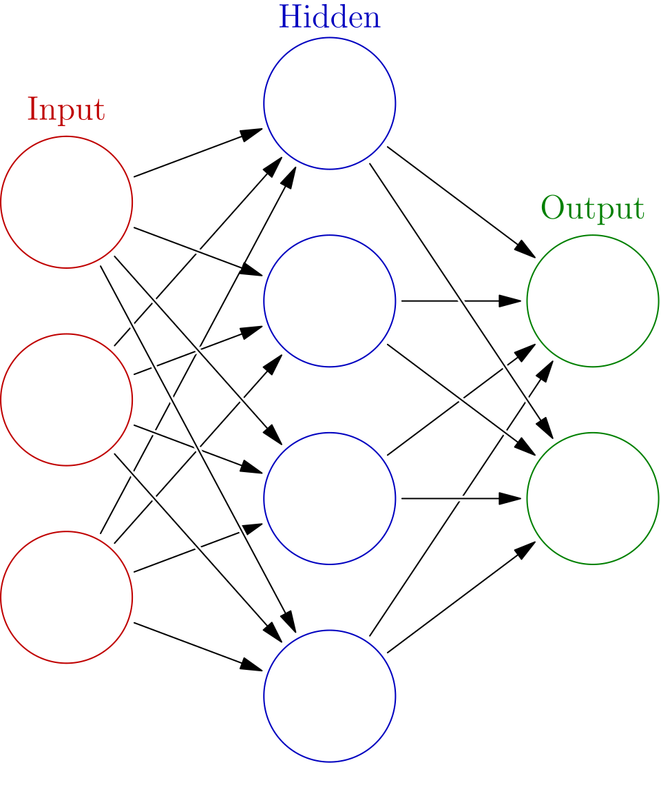

**Citation**: Hsin-Yuan Huang, et al., 2022, arXiv:2106.12627

## Abstract and My Thoughts
本文设定一族哈密顿量$\{H(x): x \in [-1,1]^m\}$，其中参数$x$是可以连续变化的实数且变化区域内$H$的Gap常数地大，$H(x)$的基态记为$\rho(x)$，。作者证明了如下两个结论：

-  如果可以接触到制备量子态$\{\{\rho(x), x\}| x \in \mathcal{S}\}$，接着用它的classical shadow来训练神经网络，则可以用处于Lazy zone的一个神经网络学习出任意少体算符在任意$x \in \mathcal{S}$下的基态均值的变化行为。这种操作在论文[@Wei_2024]中也有提到。
-  如果试图用经典算法$\mathcal{A}$去学出任意的二维$H(x)$的基态上，单体算符均值的行为是NP-hard的

有意思的细节/值得学习的技术是：

1. 如何严格证明某个平滑的函数的学习是神经网络可行的？
2. 如果将这件事推广到用classical shadow的量子态，进而变成一些关于量子态的线性/非线性函数呢？
3. ”计算平滑Gapped的Hamiltonian的基态上的单体算符的均值“这件事居然平均意义上都是难的？文中是如何证明的呢？

## ANN and the Neural Tangent Kernel
::: {.callout-note icon="false"}
## Definition: ANN
神经网络是如下的复合映射，其中 $\alpha^{(0)}(x) = x$，$x \in \mathbb{R}^{n_0}$是输入，它对应Input层的节点数量。权重矩阵$W^{(l)} \in \mathbb{R}^{n_{l+1} \times n_l}$ 和偏置向量 $b^{(l)} \in \mathbb{R}^{n_{l+1}}$对应的是图中的有向箭头，暗示下一层的参数如何由上一层计算得来，而$l=0, \dots, L-1$代表的是层数，$\frac{1}{\sqrt{n_l}}$的缩放因子为了抵消了宽度 $n_l \to \infty$ 带来的求和爆炸。
$$
\begin{aligned}
  \tilde{\alpha}^{(l+1)}(x) &= \frac{1}{\sqrt{n_l}} W^{(l)} \alpha^{(l)}(x) + \beta b^{(l)} \quad (\text{预激活}) \\
  \alpha^{(l+1)}(x) &= \sigma(\tilde{\alpha}^{(l+1)}(x)) \quad (\text{激活})
  \end{aligned}
$$
:::

{#fig-ANN width=40% fig-align="center"}

将所有的权重矩阵和偏置向量统一记为一个维度为$\sum_{l} n_l(n_{l+1} + 1)$的向量$\theta \in \mathbb{R}^P$。
这样最终生成的函数实际上是由$n_L$个$\mathcal{F}:=\{f|f:\mathbb{R}^{n_0} \to \mathbb{R}\}$拼成的向量取值的函数族。
取函数的第$k$个取值，$k = 1,\cdots,n_L$，定义$\alpha_{\theta}^{(L)}(\cdot) := F_k^{(L)}(\cdot,\theta) \in \mathcal{F}$，这里$F_k^{(L)}$为一个实数参数到函数空间的映射$F^{(L)}:\mathbb{R}^P \to \mathcal{F}$。
Cost Function是$C:\mathcal{F} \to \mathbb{R}$的映射，他和$\mathbf{F}^{(L)}$复合得到参数到实数的映射$C \circ \mathbf{F}^{(L)}: \mathbb{R}^{P} \to \mathbb{R}$。

::: {.callout-important icon="false"}
## Lemma:Optimization Evolution of ANN 
给定参数化为$\theta$的ANN, 设定步长是微小均匀的连续变化的，loss funciton取为2-norm，整个梯度下降过程参数的变化为$\theta(t)$，则ANN在t时刻，x输入下的输出$\mathbf F(x,t)$满足如下微分方程的演化：
$$
\begin{aligned}
\frac{\partial \mathbf F(x,t)}{\partial t} = \eta \sum_{i} \mathbf \Theta^{(L)}(\theta(t)) (x,x_i) 2[ \mathbf y_i - \mathbf F(x_i,t)],
\end{aligned}
$$
其中 $\mathbf \Theta^{(L)}(\theta)(x, x') = \sum_{p=1}^P \partial_{\theta_p} \mathbf F^{(L)}(x; \theta) \left[\partial_{\theta_p} \mathbf F^{(L)}(x'; \theta)\right]^T$ 是Neural Tangent Kernel(**NTK**)，它只取决于神经网络的结构，而和输入的数据无关。
:::

::: {.callout-note collapse="true"}
## Proof (点击展开)
当我们说“训练神经网络”时，我们优化的目标函数是 $\mathcal{L}(\theta) = C( \mathbf{F}^{(L)}(\theta) )$，其对 $\theta$ 的导数为
$$
\left.\nabla_{\theta}\mathcal{L}\right|_{\theta_0}
= \sum_{k = 1}^{n_L}\left.\frac{\delta C}{\delta f_k}\right|_{\mathbf{f}_{\theta_0}} \cdot \left.\frac{\partial F_k^{(L)}(\cdot,\theta)}{\partial \theta}\right|_{\theta_0} 
$$
其中${\delta C}/{\delta f_k}$是通过对第$k$个输出求变分导数诱导出来的函数，而$\cdot$表示两个函数的内积。$C(\mathbf f)$一般取为$C(\mathbf f) = \sum_{i} \|\mathbf{f}(x_i) - \mathbf{y}_i\|^2_2$是$n_L$维向量的差的2-norm的平方，其泛函导数计算如下：
$$
\begin{aligned}
\sum_{i} [\mathbf f(x_i) + \varepsilon \mathbf e(x_i) - \mathbf y_i]^2 &= \sum_{i}2[\mathbf f(x_i)- \mathbf y_i]\mathbf e(x_i) \varepsilon + O(\varepsilon^2)\\
&= \int_{x} dx \left[\sum_{i}2[\mathbf f(x_i)- \mathbf y_i]\delta(x, x_i)\right] \mathbf e(x),\\
\left.\frac{\delta C}{\delta \mathbf f}\right|_{\mathbf f_0}&= \sum_{i}2[\mathbf f_0(x_i)- \mathbf y_i]\delta(x, x_i).
\end{aligned}
$$
因此导数为：
$$
\begin{aligned}
\left.\nabla_{\theta}\mathcal{L}\right|_{\theta_0}
&= \int dx \sum_{i}2[\mathbf F^{(L)}(x_i,\theta)- \mathbf y_i]\delta(x, x_i) \cdot \left.\frac{\partial \mathbf F^{(L)}(x,\theta)}{\partial \theta}\right|_{\theta_0} \\
&=\sum_{i}2[\mathbf F^{(L)}(x_i,\theta)- \mathbf y_i] \cdot \left.\frac{\partial \mathbf F^{(L)}(x_i,\theta)}{\partial \theta}\right|_{\theta_0},
\end{aligned}
$$
其中的$\cdot$指$n_L$维向量的内积。接着，我们关心在参数更新$\theta_{t} \to \theta_{t+1}= \theta_{t} - \eta_t \left.\nabla_{\theta}\mathcal{L}\right|_{\theta = \theta_t}$下，函数$F^{(L)}(x,\theta)$的取值如何改变。因此我们计算到$\eta_t$的一阶项：
$$
\begin{aligned}
 &{\mathbf F^{(L)}(x,\theta_{t+1}) - \mathbf F^{(L)}(x,\theta_t) }\approx  -\eta_t\left.\frac{\partial \mathbf F^{(L)}(x,\theta) }{ \partial \theta}\right|_{\theta_t} \cdot  \left.\nabla_{\theta}\mathcal{L}\right|_{\theta_{t}}\\
&(k\text{-th term})= -\eta_t\left.\frac{\partial F_k^{(L)}(x,\theta) }{ \partial \theta}\right|_{\theta_t} \cdot  \sum_{i,r}2[F_r^{(L)}(x_i,\theta)- y_{i,r}] \cdot \left.\frac{\partial F_r^{(L)}(x_i,\theta)}{\partial \theta}\right|_{\theta_t}\\
&= \sum_{i,r}\left. \left\langle\frac{\partial F_k^{(L)}(x,\theta) }{ \partial \theta}, \frac{\partial F_r^{(L)}(x_i,\theta)}{\partial \theta} \right\rangle \cdot 2\eta_t[y_{i,r} - F_r^{(L)}(x_i,\theta)]\right|_{\theta_t}\\
&(\text{all terms})= \eta_t\left.\sum_{i}\mathbf \Theta^{(L)}(\theta)(x, x_i)  \cdot \mathbf d_i(\theta)\right|_{ \theta = \theta_t}
\end{aligned}
$$
可以看到$x$点函数值在更新过程中的变化由如下Neural Tangent Kernel(**NTK**)所链接：
$$
\mathbf \Theta^{(L)}(\theta)(x, x') = \sum_{p=1}^P \partial_{\theta_p} \mathbf F^{(L)}(x; \theta) \left[\partial_{\theta_p} \mathbf F^{(L)}(x'; \theta)\right]^T
$$
如果进一步设定步长是微小且均匀的，整个梯度下降过程等价于如下微分方程的演化：
$$
\begin{aligned}
\frac{\partial \mathbf F(x,t)}{\partial t} = \eta \sum_{i} \mathbf \Theta^{(L)}(t) (x,x_i) 2[ \mathbf y_i - \mathbf F(x_i,t)]
\end{aligned}
$$
:::

##### The Lazy Zone (惰性训练区域)
考虑 $n_L = 1$ 的情况（即标量输出），定义训练集上的模型输出向量 $\mathbf{u}(t) \in \mathbb{R}^P$，其中 $[\mathbf u(t)]_{i} := F(x_i,t)$。同理，定义测试点 $x$ 与训练集数据的核向量 $\mathbf{k}(x,t) \in \mathbb{R}^P$，其元素为 $[\mathbf{k}(x,t)]_{i} = \Theta^{(L)}(t) (x,x_i)$；以及训练集上的核矩阵（Gram Matrix）$\mathbf{H}^{(L)}(t) \in \mathbb{R}^{P \times P}$，其元素为 $\mathbf{H}^{(L)}_{jk}(t):= \Theta^{(L)}(t)(x_j,x_k)$。根据上述引理，参数更新导致的函数演化满足如下微分方程组：
$$
\left\{\begin{aligned}
\frac{d\mathbf{u}(t) }{dt} &= 2\eta \mathbf{H}^{(L)}(t)[\mathbf{y}- \mathbf{u}(t)]\\
\frac{\partial F(x,t)}{\partial t} &= 2\eta \mathbf{k}(x,t)^\top [\mathbf{y}- \mathbf{u}(t)]
\end{aligned}\right.
$$

::: {.callout-note icon="false"}
## Definition: Lazy Zone
如果在整个训练演化过程中，Neural Tangent Kernel (NTK) 几乎保持不变，即满足近似：$$\sup_{t \ge 0} \|\Theta^{(L)}(\theta_t) - \Theta^{(L)}(\theta_0)\| \approx 0$$则称该神经网络处于 Lazy zone（或 Linear regime）。
:::
可以证明，当ANN是无限宽的，且参数更新方式是归一化的，Lazy zone就会出现[@jacot2018neural]。
此时可认为 $\mathbf{H}^{(L)}(t) \equiv \mathbf{H}$ 和 $\mathbf{k}(x,t) \equiv \mathbf{k}(x)$ 为常数矩阵/向量。在这种线性化假设下，上述微分方程组退化为线性常微分方程。首先求解第一个方程（训练集误差演化）：
$$
\frac{d}{dt}(\mathbf{u}(t) - \mathbf{y}) = -2\eta \mathbf{H} (\mathbf{u}(t) - \mathbf{y}) \implies \mathbf{u}(t) - \mathbf{y} = e^{-2\eta \mathbf{H} t} (\mathbf{u}(0) - \mathbf{y})
$$
即误差项按指数衰减：$\mathbf{y} - \mathbf{u}(t) = e^{-2\eta \mathbf{H} t} (\mathbf{y} - \mathbf{u}(0))$。将其代入第二个方程并对时间 $t$ 积分，可求出任意测试点 $x$ 处的函数变动：
$$
\begin{aligned}
F(x,t) - F(x,0) &= \int_0^t 2\eta \mathbf{k}(x)^\top e^{-2\eta \mathbf{H} \tau} (\mathbf{y} - \mathbf{u}(0)) d\tau \\
&= \mathbf{k}(x)^\top (2\eta \mathbf{H})^{-1} (I - e^{-2\eta \mathbf{H} t}) (2\eta \mathbf{H}) (\mathbf{H}^{-1} (\mathbf{y} - \mathbf{u}(0))) \\
&= \mathbf{k}(x)^\top \mathbf{H}^{-1} (I - e^{-2\eta \mathbf{H} t}) (\mathbf{y} - \mathbf{u}(0))
\end{aligned}$$
取 $t \to \infty$ 的极限（假设 $\mathbf{H}$ 正定，则 $e^{-2\eta \mathbf{H} t} \to 0$），得到梯度下降的最终收敛解：
$$
\begin{aligned}
F(x,\infty) &= F(x,0) + \mathbf{k}(x)^\top \mathbf{H}^{-1}(\mathbf{y} - \mathbf{u}(0)) \\
&= \underbrace{\mathbf{k}(x)^\top \mathbf{H}^{-1} \mathbf{y}}_{\text{I. 纯核回归项 (Signal)}} + \underbrace{\left( F(x, 0) - \mathbf{k}(x)^\top \mathbf{H}^{-1} \mathbf{u}(0) \right)}_{\text{II. 初始化残留项 (Noise)}}
\end{aligned}
$$
上述解析解揭示了处于 Lazy zone 的神经网络训出的最终模型由两部分组成。第一部分（Signal） 是标准的 核岭回归（Kernel Ridge Regression, KRR） 解（在正则化系数趋于0时）。这部分完全由网络结构诱导的核函数 $\Theta$ 和训练标签 $\mathbf{y}$ 决定，与具体的随机初始化无关。第二部分（Noise） 是初始化的残留。这实际上反映了神经网络的初始化对最终结果的影响。
在无限宽极限下，如果对所有可能的初始化进行系综平均（Ensemble Average），由于 $\mathbb{E}[F(x,0)]=0$，这一项会消失，模型将完美收敛到纯核回归解。
在"Lazy"区，参数几乎没有离开初始位置，网络没有学习新的“特征表示”，而是利用初始化时随机形成的特征（即固定的 Kernel）对数据进行了简单的线性组合。

N虽然 NTK 理论完美地解释了过参数化网络的收敛性和泛化性（不随时间过拟合），但它无法解释现代深度学习在复杂任务（如 ImageNet、NLP）上的巨大成功。

-   **在 NTK 区域：** Kernel 是静态的，模型像是一个甚至不需要看数据的“预设字典”，仅通过查字典（计算相似度）来做预测。这对于低维、平滑的函数（如某些量子物理量）非常有效且稳定。
-   **在特征学习区域：** Kernel $\Theta(t)$ 随时间剧烈演化。这使得模型能够根据数据自适应地学习新的核函数。现代神经网络通过调整初始化方差和增大学习率，刻意打破 Lazy zone 的限制，参数发生大幅迁移。

进一步要求非线性函数$\sigma$满足:(i).Lipschitz 连续条件$|\sigma(u) - \sigma(v)| \le K |u - v|$，(ii)二阶可微：$\sigma$ 的一阶导数 $\sigma'$ 和二阶导数 $\sigma''$ 在定义域 $\mathbb{R}$ 上处处存在，(iii)二阶导数有界:$|\sigma''(x)| \le C$ 。

## References

::: {#refs}
:::