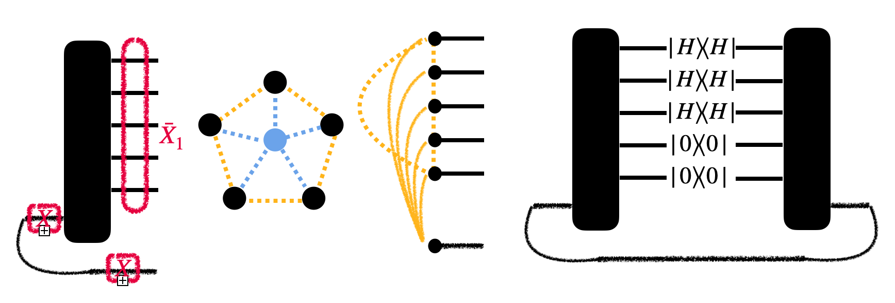

---
categories:
- Readings
date: '2026-02-25'
lang: en
title: "Stabilizer Rank Decomposition for Clifford+T Circuits"
bibliography: refs.bib
---

**Abstract.** We review the stabilizer rank framework for classically simulating Clifford+T circuits. The output state $\ket{\psi} = U\ket{0}^{\otimes n}$ is decomposed as a linear combination of stabilizer states $\ket{\psi} = \sum_\alpha b_\alpha \ket{\phi_\alpha}$, where the number of terms (the stabilizer rank $\chi$) governs the simulation cost. Strong simulation via **CH** marginals costs $\mathcal{O}(n^3 \chi^2)$, reducible to $\mathcal{O}(n^3 \chi)$ via Monte Carlo sampling [@bravyi2016improved]. We describe three decomposition algorithms: gadget-based, sum-over-Clifford [@bravyi2019simulation], and sparsification [@bravyi2019simulation]. This post builds on [CH and Affine Simulators](CH_affine.qmd) and provides the decomposition framework used in [Combining Simulation Methods](graph_combine.qmd).

---

## 1. Stabilizer Rank Framework

A Clifford+T simulation problem restricts the circuit $U$ to contain $t$ non-Clifford $T$ gates. The output state can be decomposed as a linear combination of stabilizer states:
$$
\ket{\psi} := U\ket{0}^{\otimes n} = \sum_{\alpha=1}^k b_\alpha\, U_\alpha \ket{0}^{\otimes n} = \sum_\alpha b_\alpha \ket{\phi_\alpha},
$$
where $U_\alpha$ are Clifford gates and $\ket{\phi_\alpha}$ are stabilizer states in **CH**-form, Affine form, or **DGS** form. The minimum number of terms $k$ is the **stabilizer rank**, denoted $\chi(\ket{\psi})$.

### 1.1 Strong Simulation via CH Marginals

This decomposition induces a strong simulation method: the marginal probabilities can be computed by:
$$
\mathrm{Prob}(s_1, \ldots, s_q) = \bra{\psi} \prod_{j=1}^q \frac{\mathbb{I}_j + (-1)^{s_j} Z_j}{2} \ket{\psi} = \sum_{\alpha,\beta=1}^{\chi(\ket{\psi})} b_\alpha b_\beta \bra{\phi_\alpha} \prod_{j=1}^q \frac{\mathbb{I}_j + (-1)^{s_j} Z_j}{2} \ket{\phi_\beta}.
$$

This can be calculated in time $\mathcal{O}(n^3\, \chi(\ket{\psi})^2)$ using measurement update algorithms ($\mathcal{O}(n^2)$) for $n$ iterations for each pair $(\phi_\alpha, \phi_\beta)$ in **CH** form.

### 1.2 Monte Carlo Acceleration {#sec-MC}

Utilizing randomness [@bravyi2016improved] reduces the complexity to $\mathcal{O}(n^3\, \chi(\ket{\psi}))$. Since
$$
\mathrm{Prob}(s_1, \ldots, s_q) = \left\|\prod_{j=1}^q \frac{\mathbb{I}_j + (-1)^{s_j} Z_j}{2} \ket{\psi}\right\|^2 = \left\|\sum_\alpha b_\alpha \ket{\phi_\alpha'}\right\|^2,
$$
where $\ket{\phi_\alpha'}$ are unnormalized stabilizer states in **CH** form generated in $\chi(\psi) \cdot \mathcal{O}(n^3)$ time.

Instead of evaluating $\|\ket{\psi}\|^2$ directly, use a Monte Carlo strategy:

1. Draw a stabilizer state $\ket{\theta}$ uniformly from $n$-qubit stabilizer states.
2. Compute $|\langle\theta|\psi\rangle|^2$.
3. Average over $m$ samples.

Total cost: $m \cdot \chi(\psi) \cdot \mathcal{O}(n^3)$. Since the Clifford group forms a 2-design, this is an unbiased estimator for $\|\ket{\psi}\|^2$. One can even restrict sampling to the **equatorial stabilizer states** $\mathrm{Equa}_n$:

::: {#lem-MC-estimator .callout-important icon="false"}
## Lemma (Monte Carlo Norm Estimator)
Given a quantum state $\ket{\psi}$, the random variable $2^n \|\langle\theta|\psi\rangle\|^2$ for $\ket{\theta} \sim \mathrm{Stab}_n$ has mean $\|\ket{\psi}\|^2$ and variance $\mathrm{Var} \leq \|\ket{\psi}\|^4$. This holds even if $\ket{\theta} \sim \mathrm{Equa}_n$.
:::

---

## 2. Stabilizer Decomposition Algorithms

We now describe three algorithms that realize exact or approximate decompositions of the Clifford+T output state.

<!-- TODO: Add gadget_based.png diagram when available -->

### 2.1 Gadget-Based Method

The gadget-based method replaces the $T$ gates in $C$ by **T-gadgets**. Decomposing the magic state $\ket{H}^{\otimes t} = \sum_{\alpha=1}^{\chi(H^t)} c_\alpha \ket{\phi_\alpha}$, we get:
$$
U\ket{0}^{\otimes n} = 2^{t/2} (\mathbb{I}_{n-t} \otimes \bra{0}^{\otimes t})\, C\, \ket{0}^{\otimes n} \ket{H}^{\otimes t} = 2^{t/2} \sum_{\alpha=1}^{\chi(H^t)} c_\alpha (\mathbb{I}_{n-t} \otimes \bra{0}^{\otimes t})\, C\, \ket{0}^{\otimes n} \ket{\phi_\alpha} = \sum_\alpha \beta_\alpha \ket{\psi_\alpha}.
$$

Any polynomial-depth quantum circuit can be compiled into a sequence of non-adaptive T-state measurements on a stabilizer state. This pins down the amplitude estimation problem on the computational basis for Clifford+T circuits.

### 2.2 Computationally Tractable States {#sec-CT}

Following Van den Nest [@nest2009simulating]:

::: {#def-CT .callout-note icon="false"}
## Definition (Computationally Tractable State)
An $n$-qubit state $\ket{\psi}$ is **Computationally Tractable** (CT) if:

1. **Condition (a):** One can sample in $\mathrm{poly}(n)$ time from $\mathrm{Prob}(a) = |\langle a|\psi\rangle|^2$, where $a \in \{0,1\}^n$.
2. **Condition (b):** For any $a$, the amplitude $\langle a|\psi\rangle$ can be computed classically in $\mathrm{poly}(n)$ time with relative error.
:::

::: {#lem-CT-inner .callout-important icon="false"}
## Lemma (CT Inner Products)
There exists a randomized algorithm that estimates $\langle\psi|\phi\rangle$ within $\mathrm{poly}(n)$ additive error if both $\ket{\psi}, \ket{\phi}$ are CT.
:::

::: {.callout-note collapse="true"}
## Proof
Given two CT states $\ket{\psi}$ and $\ket{\phi}$, the inner product can be written as $\langle\psi|\phi\rangle = \sum_{a \in \{0,1\}^n} \langle\psi|a\rangle \langle a|\phi\rangle$. By importance sampling using $p(a) = |\langle a|\psi\rangle|^2$ (efficiently sampleable by Condition (a)):
$$
\langle\psi|\phi\rangle = \mathbb{E}_{a \sim p}\left[\frac{\langle a|\phi\rangle}{\langle a|\psi\rangle^*}\right].
$$

Each sample requires computing $\langle a|\phi\rangle$ and $\langle a|\psi\rangle$ ($\mathrm{poly}(n)$ by Condition (b)). The variance is bounded by:
$$
\mathrm{Var} = \mathbb{E}_{a \sim p}\left[\left|\frac{\langle a|\phi\rangle}{\langle a|\psi\rangle^*}\right|^2\right] - |\langle\psi|\phi\rangle|^2 \leq \sum_a |\langle a|\phi\rangle|^2 = 1.
$$

By Chebyshev's inequality, $m = \mathcal{O}(1/\epsilon^2)$ samples suffice for additive error $\epsilon$, giving total cost $\mathrm{poly}(n)/\epsilon^2$. $\square$
:::

### 2.3 Sum-Over-Clifford Method {#sec-sum-over-clifford}

The sum-over-Clifford method [@bravyi2019simulation] provides the most efficient known stabilizer decomposition for Clifford+T circuits. The core idea is to decompose the non-Clifford part as a sum over diagonal Clifford operators acting on $\ket{+}^{\otimes t}$.

**Stabilizer extent.** The **stabilizer extent** $\xi(\ket{\psi})$ is the minimum of $\|c\|_1^2 = \left(\sum_j |c_j|\right)^2$ over all stabilizer decompositions $\ket{\psi} = \sum_j c_j \ket{\phi_j}$. This governs the simulation cost more tightly than the stabilizer rank.

**Decomposition of $T\ket{+}$.** The T-gate magic state $\ket{T} = \frac{1}{\sqrt{2}}(\ket{0} + e^{i\pi/4}\ket{1})$ has stabilizer rank $\chi(\ket{T}) = 2$. For $\ket{H}^{\otimes t}$:

1. **Multiplicativity:** $\xi(\ket{T}^{\otimes t}) = \xi(\ket{T})^t$.
2. **Single-copy extent:** $\xi(\ket{T}) = 1/F_S(\ket{T})^2 = \sec^2(\pi/8)$, where $F_S$ is the stabilizer fidelity.
3. **Scaling:**
$$
\xi(\ket{T}^{\otimes t}) = \sec^{2t}(\pi/8) = 2^{\alpha t}, \qquad \alpha = \log_2(\sec^2(\pi/8)) \approx 0.228.
$$

**Optimal decomposition.** The circuit is rewritten so all T-gates are absorbed into a diagonal gate $D$ acting on $\ket{+}^{\otimes t}$. Then $D\ket{+}^{\otimes t}$ is expanded as a sum over equatorial stabilizer states $K_j \ket{+}^{\otimes t}$, where $K_j$ are diagonal Clifford operators. Each term is propagated through the remaining Clifford circuit in $\mathrm{poly}(n)$ time.

**Improved bounds.** Seddon *et al.* [@seddon2021quantifying] improved bounds using tighter magic monotones (dyadic negativity), matching $\alpha \approx 0.228$ for the $T$ state but providing significant improvements for other non-Clifford gates and mixed states.

### 2.4 Sparsification Method {#sec-sparsify}

An exact stabilizer decomposition of $\ket{T}^{\otimes t}$ may have exponentially many terms. The **SPARSIFY** procedure [@bravyi2019simulation] reduces the term count:

::: {#thm-sparsify .callout-important icon="false"}
## Theorem (Sparsification Lemma)
Let $\ket{\psi} = \sum_i c_i \ket{\phi_i}$ where each $\ket{\phi_i}$ is a normalized stabilizer state. For any integer $k > 0$ there is an efficient randomized procedure **SPARSIFY** that outputs an unnormalized state $\ket{\Omega}$ of stabilizer rank at most $k$ such that:
$$
\mathbb{E}\left\|\ket{\psi} - \ket{\Omega}\right\|^2 \leq \frac{\|c\|_1^2}{k}.
$$
:::

::: {.callout-note collapse="true"}
## Proof and Algorithm
**Algorithm (SPARSIFY):** Given $\ket{\psi} = \sum_{j=1}^\chi c_j \ket{\phi_j}$ with $\|c\|_1 = \Lambda$:

1. Choose target sparsity $k$.
2. For each of $k$ independent samples, draw index $j$ with probability $|c_j|/\Lambda$.
3. Form the re-weighted term $\frac{\Lambda}{k} \frac{c_j}{|c_j|} \ket{\phi_j}$.
4. Sum the $k$ terms to form $\ket{\Omega}$.

**Analysis:** Let $X_i$ be the i.i.d. random vectors from step 3. Then $\mathbb{E}[\ket{\Omega}] = \ket{\psi}$ (unbiased estimator) and:
$$
\mathbb{E}\|\ket{\Omega} - \ket{\psi}\|^2 = k \cdot \mathrm{Var}(X_i) \leq k \cdot \frac{\Lambda^2}{k^2} = \frac{\Lambda^2}{k}.
$$

Choosing $k = \Lambda^2/\delta^2 = \xi(\ket{\psi})/\delta^2$ gives a $\delta$-approximate decomposition with $\mathcal{O}(\xi/\delta^2)$ terms. For $t$ T-gates: $\mathcal{O}(2^{0.228t}/\delta^2)$ stabilizer terms. $\square$
:::

**Complexity.** Total simulation cost per output sample:
$$
\mathrm{poly}(n, m) \cdot \frac{2^{0.228t}}{\delta^2},
$$
where $n$ = qubits, $m$ = gates, $t$ = T-count, $\delta$ = approximation error.

**Lower bounds.** Mehraban and Tahmasbi [@mehraban2024quadratic] established $\chi_\delta(\ket{T}^{\otimes t}) = \Omega(t^2)$ for constant $\delta$, partially validating that exponential scaling in $t$ is unavoidable.

---

## References
