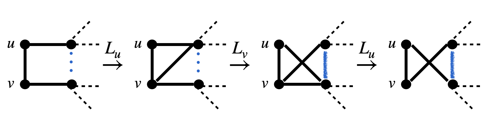

---
categories:
- Readings
date: '2026-02-25'
lang: en
title: "Stabilizer Simulation: Graph Simulator and Stabilizer Codes"
bibliography: refs.bib
---

**Abstract.** We review the **graph simulator** for stabilizer states, which represents every stabilizer state as a decorated graph state (**DGS**) and further canonicalizes it into a **CDGS** via H-sliding and S-merging operations. The graph representation admits efficient two-qubit gate rules, Pauli measurement updates, inner product computation, and graph merging. We then extend the formalism to stabilizer codes via the Choi-Jamiołkowski isomorphism, arriving at the canonical decorated graph code (**CDGC**). This post builds on the amplitude estimators from [CH and Affine Simulators](CH_affine.qmd) and provides the graph-state foundation used in [Combining Simulation Methods](graph_combine.qmd).

---

## 1. Data Structure: DGS and CDGS

Each stabilizer state $\ket{S}$ can be transformed into a canonical decorated graph state (**CDGS**).

::: {#def-DGS-CDGS .callout-note icon="false"}
## Definition (DGS and CDGS)
We define two subsets of stabilizer states:

- **DGS** (Decorated Graph State): A state of the form $\ket{S} = \bigotimes_{v=1}^n c_v z_v \ket{G}$, where (i) $\ket{G}$ is a graph state with graph $G = (E, V)$, (ii) $c_v \in \{I, S, H, SH, HS, HSH\}$, and $z_v \in \{I, Z\}$.
- **CDGS** (Canonical Decorated Graph State): A state of the form $\ket{S} = \bigotimes_{v=1}^n c_v z_v \ket{G}$, where (i) $\ket{G}$ is a graph state with graph $G = (E, V)$, (ii) $c_v \in \{I, S, H\}$, $z_v \in \{I, Z\}$, and (iii) if $((u,v) \in E) \wedge (v < u)$, then either $c_v = H, c_u \neq H$ or $c_v \neq H, c_u \neq H$.
:::

### 1.1 Stabilizer Tableaus to DGS

::: {#lem-DGS .callout-important icon="false"}
## Lemma (Tableaus to DGS)
Every stabilizer state $\ket{S}$ supported on ordered qubits $V = \{1, 2, \ldots, n\}$ can be transformed into **DGS** form $\ket{S} = C\ket{G}$ in $\mathcal{O}(n^3)$ time.
:::

::: {.callout-note collapse="true"}
## Proof (Algorithmic)
Denote the stabilizer as tableaus $(X|Z)$ and sign $s \in \{-1, +1\}^n$, where $X_{ij}, Z_{ij}$ are both $n \times n$ $\mathbb{F}_2$-valued matrices encoding the Pauli operator at location $j$ of the $i$-th stabilizer generator. Then the following sequence of transformations can be implemented:

$$
(X|Z), s \xrightarrow{\mathrm{Gauss}} \left(\begin{array}{cc|cc}\mathbb{I} & A & B & 0 \\ 0 & 0 & A^T & \mathbb{I}\end{array}\right), s' \xrightarrow{H_{n-r}} \left(\begin{array}{cc|cc}\mathbb{I} & 0 & B & A \\ 0 & \mathbb{I} & A^T & 0\end{array}\right), s' \xrightarrow{Z_{s'}, S_B^\dagger} \left(\begin{array}{cc|cc}\mathbb{I} & 0 & B_0 & A \\ 0 & \mathbb{I} & A^T & 0\end{array}\right), +1.
$$ {#eq-stab2graph}

Here $H_{n-r}$ applies Hadamard gates $H$ on all vertices $\{r+1, \ldots, n\}$, $Z_{s'}$ applies Pauli-$Z$ gates on vertices with $s'_i = -1$, and $S_B^\dagger$ applies inverse $S$-gates on vertices $\{1, \ldots, r\}$ at which the diagonal element of $B$ is nonzero. Since $S^\dagger Y S = X$, this transforms stabilizer component $(a_x, a_z) = (1,1)$ to $(a_x, a_z) = (1,0)$ while preserving the stabilizers' signs. Inverting this process gives $\ket{S} = \bigotimes_{v=1}^n c_v z_v \ket{G}$. $\square$
:::

---

## 2. Single-Qubit Gate Rules

Local Clifford gates on a **DGS** can be implemented in $O(1)$ time. For Pauli operations $\{\mathbb{I}, X, Y, Z\}$, we shift them through the decoration $c_v, z_v$ with a $(-1)^{s_v}$ phase correction and exchange of Pauli operators. By definition of the graph state, we have the identity:

$$
X_v \ket{G} = \left(\prod_{u \in N(v)} Z_u\right) \ket{G}, \qquad Y_v \ket{G} = \left(i Z_v \prod_{u \in N(v)} Z_u\right) \ket{G}.
$$ {#eq-G-XZupdate}

For general Clifford gates, since every $g \in \mathrm{Cliff}_1$ can be generated by $S, H$, we trace the decoration by listing the multiplication rules of $\{I, S, H, SH, HS, HSH\}$:

$$
\begin{array}{|c|c|c|c|c|c|c|}
\hline
D & I & S & H & SH & HS & HSH \\
\hline
S \cdot D & S & Z & SH & HX & \tfrac{1+i}{\sqrt{2}}HSHX & \tfrac{1+i}{\sqrt{2}}HSZ \\
\hline
H \cdot D & H & SH & I & HSH & S & SH \\
\hline
\end{array}
$$

Here we use the identity:
$$
HSH = \frac{1+i}{2}\begin{pmatrix}1 & -i \\ -i & 1\end{pmatrix} = \frac{1+i}{\sqrt{2}} S^3 H S^3 = \frac{1-i}{\sqrt{2}} SHSX.
$$

The updated $\{X, Z\}$ Pauli corrections can be merged into $z_v' \leftarrow z_v$ using @eq-G-XZupdate.

---

## 3. Two-Qubit Gates and Measurements

For two-qubit Clifford gates $\{CX, CZ\}$, we first state the rule when $c_v, c_u = \mathbb{I}$. The $CZ_{u,v}$ gate trivially alternates the edge $(u,v)$. The $CX$ gate follows:
$$
CX_{u,v} \ket{G} = \left(\prod_{w \in N(v)} CZ_{u,w}\right) \ket{G}, \qquad CY_{u,v} = i\, CX_{u,v}\, CZ_{u,v}.
$$

In the case with $c_v, z_v \neq \mathbb{I}$, we note that:
$$
CR_{u,v} = \frac{\mathbb{I}_u + Z_u}{2} \otimes \mathbb{I}_v + \frac{\mathbb{I}_u - Z_u}{2} \otimes R_v \xrightarrow{z^\dagger c^\dagger(\cdot)cz} \frac{\mathbb{I}_u + P_u}{2} \otimes \mathbb{I}_v + \frac{\mathbb{I}_u - P_u}{2} \otimes Q_v.
$$

Thus, it suffices to trace $P_u, Q_v$ and list all graph updating rules under the projective operations $\frac{\mathbb{I}_u + P_u}{2} \otimes \mathbb{I}_v + \frac{\mathbb{I}_u - P_u}{2} \otimes Q_v$. Since Pauli gates on a graph state can always be reduced to tensor products of Pauli-$Z$ gates, it suffices to prove:

::: {#thm-Pauli-G-merge .callout-important icon="false"}
## Theorem (Pauli Projection on Graph States)
Given a graph state $\ket{G}$, let $B \subset \{1, \ldots, n\}$ be an arbitrary subset of qubits. Let $v \in B$ and $A(v) := \{v\} \cup N(v)$. Then $\forall k \in \mathbb{Z}_{\geq 0}$:
$$
\frac{1}{\sqrt{2}}\left(\mathbb{I}_n + i^k \bigotimes_{u \in B} Z_u\right) \ket{G} = H_v Z_v \left(\prod_{u,w \in A} \mathrm{CS}^k_{u,w}\right)\left(\prod_{u \in A,\, w \in B} \mathrm{CZ}_{u,w}\right) \ket{G}.
$$

Specifically, when $k = 2m+1$ is odd, the subset $B$ itself determines the entanglement structure:
$$
\frac{1}{\sqrt{2}}\left(\mathbb{I} + i^{2m+1} \prod_{u \in B} Z_u\right) \ket{G} = \frac{1+i^{2m+1}}{\sqrt{2}} \left(\prod_{u \in B} Z_u^{m+1}\right)\left(\prod_{u,v \in B} \mathrm{CS}_{u,v}\right) \ket{G}.
$$
:::

### 3.1 Pauli Measurement on Graph States

Using @thm-Pauli-G-merge, we list the updating rules for all possible two-qubit gate rules. This is also equivalent to certain vertex removal rules for the graph [@mor2023noisy]:

::: {#lem-Pauli-measurement .callout-important icon="false"}
## Lemma (Pauli Measurement on Graph States)
The graph state $\ket{G}$ undergoing a Pauli measurement at vertex $a$ results in a new graph state $\ket{G'}$ that is locally Clifford equivalent. Specifically:

- After a **$Z$-measurement**, the graph is modified by deleting all edges incident to vertex $a$.
- For a **$Y$-measurement**, the neighborhood of $a$ is flipped (local complementation), and then all edges incident to $a$ are removed.
- For an **$X$-measurement**, choose a neighboring vertex $b$ of $a$. First flip the neighborhood of $b$, then flip the neighborhood of $a$, followed by removing the edges incident to $a$, and finally flip the neighborhood of $b$ again.
:::

::: {.callout-note collapse="true"}
## Proof
The $Z$-measurement result follows directly from the stabilizer update rules: measuring $Z_a$ on a graph state with stabilizer $K_a = X_a \prod_{u \in N(a)} Z_u$ projects onto the $\pm 1$ eigenspace of $Z_a$. Since $Z_a$ anticommutes only with $K_a$, the post-measurement stabilizer group replaces $K_a$ with $\pm Z_a$, which decouples vertex $a$ from all neighbors.

For $Y$-measurement, the operator $Y_a$ anticommutes with $K_a$ and commutes with all other generators. The post-measurement state is stabilized by generators updated via $K_b \to K_b K_a^{[a,b]}$ for $b \neq a$, followed by replacing $K_a$ with $\pm Y_a$. The update $K_b \to K_b K_a$ for $b \in N(a)$ corresponds to local complementation at $a$ (toggling edges within $N(a)$), after which $a$ is disconnected.

For $X$-measurement, we use the pivot operation: choose $b \in N(a)$, apply local complementation at $b$, then at $a$, disconnect $a$, then complement at $b$ again. This is the **pivot** operation $\tau_{(a,b)}$ of Van den Nest *et al.* [@van2004graphical]. $\square$
:::

---

## 4. DGS to CDGS: H-Sliding and S-Merging

We show algorithms that transform an arbitrary **DGS** to **CDGS**. This is realized by two elementary operations: the **H-sliding** operation and the **S-merging** operation.

### 4.1 H-Sliding {#sec-H-sliding}

::: {#thm-H-slide .callout-important icon="false"}
## Theorem (H-Sliding Identity)
Given a graph $G$ and vertices $u, v$ with neighborhoods $N(u), N(v)$ respectively, we have:
$$
H_u H_v \ket{G} = Z_u Z_v \left(\prod_{\substack{p \in N(u) \cup \{u\} \\ q \in N(v) \cup \{v\}}} \mathrm{CZ}_{p,q}\right) \ket{G} = \left(\prod_{r \in N(u) \cap N(v)} Z_r\right) \ket{L_{(u,v)}(G)}.
$$
:::

::: {.callout-note collapse="true"}
## Proof
Given $(u,v) \in E$, define four subsets:
$$
S := \{u,v\}, \quad I := N(u) \cap N(v), \quad M := N(u) \setminus (N(v) \cup \{v\}), \quad N := N(v) \setminus (N(u) \cup \{u\}).
$$

We denote $(m,n) \subset A$ as an internal edge of subset $A$ iff $m, n \in A$ and $(m,n) \in E$, and $\delta(A,B) := \{(a,b) \in E : a \in A, b \in B\}$ as the edge set between subsets $A$ and $B$.

Since $V = S \cup I \cup M \cup N$, every edge $e = (m,n)$ satisfies one of: (i) $e \subset S$; (ii) $e \subset M$, $e \subset N$, or $e \subset I$; (iii) $e \in \delta(M,N)$, $e \in \delta(M,I)$, or $e \in \delta(N,I)$; (iv) $e \in \delta(S, V \setminus S)$.

The CZ-flip product $\prod_{\substack{p \in N(u) \cup \{u\} \\ q \in N(v) \cup \{v\}}} \mathrm{CZ}_{p,q}$ toggles edges between the closed neighborhoods $\bar{N}(u)$ and $\bar{N}(v)$. By the local complementation rules of Van den Nest *et al.* [@van2004graphical], this is precisely the **edge local complementation** (pivot) $L_{(u,v)}$, which toggles all edges in $\delta(M, I)$, $\delta(N, I)$, and $\delta(M, N)$, toggles the edge $(u,v)$ itself, and swaps the neighborhoods of $u$ and $v$ within the remaining vertices.

The $Z$-corrections on $N(u) \cap N(v)$ arise because vertices in $I$ are in both closed neighborhoods, producing a $Z$-phase correction on each. $\square$
:::

### 4.2 Example: Tableaus to CDGS {#sec-example}

We define four stabilizers $\{ZZZI, XXIX, XIXX, IZZZ\}$ on a 4-qubit state. Starting from the tableaus representation, we use @eq-stab2graph and @thm-H-slide to reform into **CDGS** representation:

$$
\left(\begin{array}{cccc|cccc}
0 & 0 & 0 & 0 & 1 & 1 & 1 & 0 \\
1 & 1 & 0 & 1 & 1 & 1 & 1 & 0 \\
1 & 0 & 1 & 1 & 0 & 0 & 0 & 0 \\
0 & 0 & 0 & 0 & 0 & 1 & 1 & 1
\end{array}\right)
\xrightarrow{\text{Eq.~(stab2graph)}} \text{Graph: } 0 - 1_H - 2,\; 0 - 3_H
$$

**Step 1 (Gauss + DGS):** After Gaussian elimination and Hadamard/phase corrections, we obtain a graph with edges $\{(0,1), (0,3), (1,2)\}$ and $H$-decorations on vertices 1 and 3.

**Step 2 ((0,1)-H sliding):** Apply H-sliding on the edge $(0,1)$. The result has edges $\{(0,1), (0,2), (1,3), (2,3)\}$ with $H$ on vertex 0 and 3.

**Step 3 ((3,1)-H sliding):** Apply H-sliding on edge $(3,1)$ to eliminate the remaining adjacent $H$-pair. The final **CDGS** has edges $\{(0,3), (1,2), (1,3)\}$ with $H$ on vertices 0 and 1, corresponding to stabilizers $\{ZIIZ, XXIX, IZZZ, IXXI\}$.

### 4.3 S-Merging {#sec-S-merging}

::: {#thm-S-merge .callout-important icon="false"}
## Theorem (S-Merging Identity)
$$
\begin{aligned}
S_v H_v \ket{G} &= H_v \left(\prod_{u \in N(v)} S_u\right) \ket{L_v(G)}, \\
H_v S_v \ket{G} &= \frac{1+i}{\sqrt{2}} \left(\prod_{u \in N(v) \cup \{v\}} S_u^3\right) \ket{L_v(G)}.
\end{aligned}
$$
:::

::: {.callout-note collapse="true"}
## Proof
For the first identity, recall that the graph state stabilizer at vertex $v$ is $K_v = X_v \prod_{u \in N(v)} Z_u$. Under local complementation $L_v$, the graph state transforms as $\ket{L_v(G)} = \prod_{u \in N(v)} \sqrt{-iZ_u} \cdot \sqrt{iX_v} \ket{G}$ (see Van den Nest *et al.* [@van2004graphical; @van2005local]).

Computing $S_v H_v \ket{G}$ and applying $S_v$ using the local complementation formula, we verify that:
$$
S_v H_v \ket{G} = H_v \prod_{u \in N(v)} S_u \cdot \prod_{u \in N(v)} \sqrt{-iZ_u} \cdot \sqrt{iX_v} \ket{G} = H_v \left(\prod_{u \in N(v)} S_u\right) \ket{L_v(G)}.
$$

The $S$-gate on vertex $v$ combined with $H_v$ acts as a rotation absorbed into local complementation at $v$, distributing $S$-phases to the neighbors. For the second identity, an analogous calculation yields the result with overall phase $\frac{1+i}{\sqrt{2}}$ and $S^3$ on all vertices in $N(v) \cup \{v\}$. $\square$
:::

### 4.4 CDGS Construction Algorithm

With H-sliding and S-merging, we transform **DGS** to **CDGS** as follows:

1. Begin from the vertex with the largest label $u$, and check its connections with smaller-label edges $v$.
2. Go over all edges $(u,v) \in E$. If $c_v$ contains $H$ gates, check whether $H$ gates only appear on the smaller-label side.
3. For edges with $c_v \neq S, c_u \neq S$: apply the H-sliding theorem to move $H$ gates from large labels to small labels or eliminate adjacent $H$ gates.
4. For the case $c_v = S, c_u = H$ and $v < u$ (an exception to condition (iii)): first apply H-sliding, then use S-merging.

---

## 5. Graph Merging

An advantage of the graph simulator is the simplicity of merging two graph states. The simplest merging algorithm uses the fact that post-selected Pauli measurement on a stabilizer state gives another stabilizer state. Beyond Pauli-connected states, stabilizers can also be linearly dependent if they are sufficiently adjacent:

::: {#thm-graph-merge .callout-important icon="false"}
## Theorem (Stabilizer Sum Conditions)
Given two non-parallel normalized stabilizer states $\ket{\psi_1}, \ket{\psi_2}$, their sum $\ket{\psi_1} + \ket{\psi_2}$ is proportional to a stabilizer state $\ket{\psi_3}$ if and only if one of the following holds:

- $\langle\psi_1|\psi_2\rangle = 0$, and $\ket{\psi_1}, \ket{\psi_2}$ are **Pauli-related**, i.e., they share the same stabilizer group up to signs.
- $\langle\psi_1|\psi_2\rangle = (i-1)/2$.
- $\langle\psi_1|\psi_2\rangle = -1/2$.
:::

::: {.callout-note collapse="true"}
## Proof
Take $U\ket{0}^{\otimes n} = \ket{\psi_1}$ and define $\ket{\psi} = U^\dagger \ket{\psi_2}$, $\ket{\phi} = U^\dagger \ket{\psi_3}$. Suppose the stabilizer state $\ket{\psi}$ has Affine form $\sqrt{|V|^{-1}} \sum_{\mathbf{x} \in V} i^{l(\mathbf{x})} (-1)^{q(\mathbf{x})} \ket{\mathbf{x}}$. It suffices to show that $\exists\, \alpha, \beta \in \mathbb{C} \setminus \{0\}$ such that:
$$
\sqrt{|V|^{-1}}\, \ket{0}^{\otimes n} + \alpha \ket{\psi} = \beta \ket{\phi}.
$$

**Step 1 (Support set constraint):** $\ket{\phi}$ must have the same support set $V$, and $|V| > 1$ with $\mathbf{0} \in V$ must hold. Otherwise, $\ket{0}^{\otimes n}, \ket{\phi}, \ket{\psi}$ are related by Pauli shift (the first case).

**Step 2 (Inner product constraint):** Restricted to $|V| > 1$ and $V$ being the support set of both $\ket{\phi}$ and $\ket{\psi}$, we show that $\exists P$ such that $\langle\phi| P |\phi\rangle = |V|^{-1}(|V|+1)$. The stabilizer state condition constrains amplitudes to $|V|^{-1/2} e^{i\theta_x}$ with $\theta_x \in \{0, \pi/2, \pi, 3\pi/2\}$. The requirement that $\ket{0}^{\otimes n} + \alpha\ket{\psi}$ be a stabilizer state forces the overlap to take specific values, yielding exactly the two non-trivial cases: $(i-1)/2$ and $-1/2$. $\square$
:::

---

## 6. Inner Products

Another advantage of **CDGS** is simplicity of computing inner products with the computational basis:
$$
\begin{aligned}
\langle 0|^{\otimes n} \ket{S} &= \langle 0|^{\otimes n} \bigotimes_v c_v \bigotimes_v z_v \prod_{(l,m) \in E} CZ_{l,m}\, H^{\otimes n} \ket{0}^{\otimes n} \\
&= \langle 0|^{\otimes n} \bigotimes_{v:\, c_v = H} H_v z_v H^{\otimes n} \ket{0}^{\otimes n} \\
&= \begin{cases}
0 & \text{if } \exists\, v,\; (c_v = H) \wedge (z_v = Z), \\
\left(\frac{1}{\sqrt{2}}\right)^{\#\{v \mid c_v \neq H\}} & \text{otherwise.}
\end{cases}
\end{aligned}
$$

::: {#thm-inner-product .callout-important icon="false"}
## Theorem (CDGS Inner Product)
Given $\ket{S_1} = C_1 \ket{G_1}$ and $\ket{S_2} = C_2 \ket{G_2}$, we can calculate $\langle S_1 | S_2 \rangle$ in time $\mathcal{O}(n d^2)$, where $d < n$ is the maximum degree encountered during the algorithm.
:::

---

## 7. Extension to Stabilizer Codes (CDGC) {#sec-CDGC}

The discussion above is limited to stabilizer states. Extension to a stabilizer code can be realized by the **Choi-Jamiołkowski isomorphism**.

A stabilizer code is represented as an incomplete stabilizer tableau with $n-k < n$ Pauli strings $S := \{\mathbf{s}_1, \ldots, \mathbf{s}_{n-k}\}$. We first find the **logical operators**: a set of strings $\bar{Z} = \{\mathbf{v}_1, \ldots, \mathbf{v}_k\}$ and $\bar{X} = \{\mathbf{u}_1, \ldots, \mathbf{u}_k\}$ such that $[\mathbf{v}_i, \mathbf{s}_j] = 0$, $[\mathbf{u}_i, \mathbf{s}_j] = 0$ but $[\mathbf{v}_i, \mathbf{u}_j] = \delta_{i,j}$. This can be efficiently found by transforming the $(n-k) \times 2n$ matrix $(X|Z) := (\mathbf{s}_1^T, \ldots, \mathbf{s}_{n-k}^T)^T$ into reduced row-echelon form.

We then construct an $(n+k) \times 2(n+k)$ tableau:
$$
(X'|Z') = \left(\begin{array}{cc|cc}
\mathbf{0} & \mathbf{s}_{j,x} & \mathbf{0} & \mathbf{s}_{j,z} \\
\mathbf{0} & \mathbf{v}_{i,x} & \mathbf{e}_i & \mathbf{v}_{i,z} \\
\mathbf{e}_i & \mathbf{u}_{i,x} & \mathbf{0} & \mathbf{u}_{i,z}
\end{array}\right)
$$
for $j = 1, \ldots, n-k$ and $i = 1, \ldots, k$.

The $(n+k)$-qubit stabilizer state represented by this tableau is the **Choi representation** $J_C$ of the encoding circuit $C$ that maps $\{X_i, Z_i\}_{i=1}^k$ to $\{\bar{X}_i, \bar{Z}_i\}$. We label the input qubits as $\mathcal{I} = \{1, \ldots, k\}$ and the output qubits as $\mathcal{O} := \{k+1, \ldots, k+n\}$.

We can directly apply the **CDGS** algorithm to this stabilizer tableau. Although a given stabilizer state has a unique **CDGS**, different choices of logical operators $\{\bar{X}, \bar{Z}\}$ lead to different Choi states $J_C$ and thus different graphs.

Clifford operations on inputs will not change critical code parameters such as code distance. (Although this will change the operations that can be realized transversally/fault-tolerantly.) Thus, we say two **DGS** $\ket{G}$ and $\ket{G'}$ both representing tableau $S$ are **equivalent** if they can be transformed into each other by Clifford gates on input qubits $\mathcal{I}$. We then show that this equivalence relation fully captures the freedom of logical operators.

### 7.1 Three Equivalent Operations

::: {#lem-three-equiv .callout-important icon="false"}
## Lemma (Three Equivalent Operations)
Three operations below preserve the equivalence class:

- **(a)** Implementing a $\mathrm{CNOT}$ gate on inputs $a, b$ updates the $\mathcal{I}$-$\mathcal{O}$ adjacency matrix by adding row $b$ to row $a$.
- **(b)** If input vertices are not connected, implementing $\sqrt{X} = HSH$ on input vertex $u$ is equivalent to adding $S$ gates on $N(u)$ and then flipping the connection relation only on the output set.
- **(c)** If $\exists \{p_1, \ldots, p_k\} \subset \mathcal{O}$ one-to-one connected to $\mathcal{I} = \{1, \ldots, k\}$ respectively, then gate $H_u H_v \mathrm{CZ}_{u,v}$ on input vertices $v, u$ alternates connections between $p_u, p_v$ while (i) keeping $\{p_1, \ldots, p_k\}$ one-to-one connected to $\mathcal{I}$ and (ii) keeping the phase on $\{p_1, \ldots, p_k\}$ clean.
:::

::: {.callout-note collapse="true"}
## Proof
**(a)** By @thm-Pauli-G-merge, $\mathrm{CNOT}_{a,b}$ on a graph state alternates connections between $a$ and $N(b)$. Since $\mathrm{CZ}$ gates on input vertices keep the **DGS** equivalent, we can add appropriate $\mathrm{CZ}$ gates so that the net effect is $N(a) \cap \mathcal{O} \gets (N(a) \cap \mathcal{O})\, \Delta\, (N(b) \cap \mathcal{O})$.

**(b)** Since input vertices are not connected, $N(u) \subset \mathcal{O}$. By @thm-S-merge, gate $HSH$ includes the $L_u(G)$ operation, which only alternates connections within $N(u) \subset \mathcal{O}$.

**(c)** Based on @thm-H-slide, the operation $H_u H_v \mathrm{CZ}_{u,v}$ is equivalent to first connecting $u, v$, then implementing $L_{(u,v)}$. Corrected $Z$ gates appear on $N(v) \cap N(u)$, but this correction cannot be on $\{p_1, \ldots, p_k\}$ (otherwise $\exists p_j$ connecting to both $u$ and $v$, a contradiction). The edge complementation $L_{(u,v)}$ keeps the pivot structure:

$\square$
:::

### 7.2 CDGC Definition and Construction

::: {#def-CDGC .callout-note icon="false"}
## Definition (CDGS for Stabilizer Codes)
Given a stabilizer code $S$, its **CDGC** is an $(n+k)$-qubit **CDGS** with $\mathcal{I} := \{1, \ldots, k\}$ as input nodes and $\mathcal{O} := \{k+1, \ldots, n+k\}$ as output nodes satisfying:

- **Pivot exists:** $\exists\, \mathcal{P} := \{p_1, \ldots, p_k\} \subset \mathcal{O}$ one-to-one connected to $\mathcal{I}$ respectively.
- **Pivot rule:** No local Clifford gates on $\mathcal{P}$ and $\mathcal{I}$, and no $\mathcal{P}$-$\mathcal{P}$ or $\mathcal{I}$-$\mathcal{I}$ edges.
:::

::: {.callout-note collapse="true"}
## Proof (Algorithmic Construction)
The labels of input qubits $\mathcal{I}$ are smaller than output qubits $\mathcal{O}$. As a **CDGS**, if an output qubit is decorated by $H$, it cannot connect to any input vertex.

**Algorithm** (Post-processing canonical Choi state graph to canonical code graph):

**Input:** Canonical graph $G = (V, E)$ representing the CJ state of an encoder, with node decorations $D$, qubit number $n$, logical qubit number $k$.

**Output:** A canonical code graph $G'$ satisfying Edge, Hadamard, RREF, and Clifford rules.

1. **Partitioning:** Define $\mathcal{I} \gets \{0, \ldots, k-1\}$ and $\mathcal{O} \gets \{k, \ldots, n+k-1\}$.
2. **Clean inputs:** $\forall u \in \mathcal{I}$, set $D(u) \gets I$.
3. **RREF:** Construct the $k \times n$ adjacency matrix with $M_{ij} = 1 \Leftrightarrow (i, j+k) \in E$, perform Gaussian elimination to RREF. Identify pivot nodes $\mathcal{P} = \{p_0, \ldots, p_{k-1}\} \subset \mathcal{O}$. *(Operation (a).)*
4. **Clean pivot phases:** $\forall p \in \mathcal{P}$ with $D(p) \in \{Z, S, ZS\}$, apply $\sqrt{X} = HSH$ on associated input $v$ until $D(p) = I$ for all pivots. *(Operation (b).)*
5. **Strip pivot-pivot edges:** $\forall p_a, p_b \in \mathcal{P}$ with $(p_a, p_b) \in E$, implement $H_{v_a} H_{v_b} CZ_{v_a, v_b}$ on associated inputs until pivots are disconnected. *(Operation (c).)*
6. **Return** $G$.

Complexity: $\mathcal{O}(n^2)$. This equivalences a quantum code to a unique graph. $\square$
:::

---

## References
