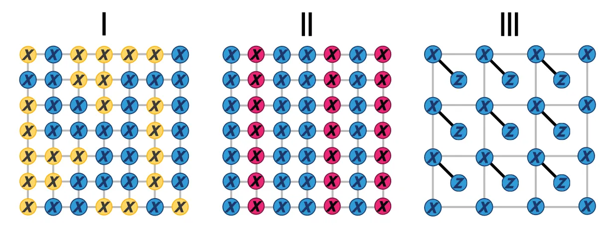

---
categories:
- Readings
date: 2026-02-02
lang: en
title: "MBQC-IQP"
bibliography: refs.bib
---

[← Back to Index](../index.qmd)

# Background

This section covers measurement-based quantum computing (MBQC) implementations of IQP circuits. 

- The MBQC-IQP experimental scheme is proposed in @bermejovega2018architectures, which gives detailed proofs of computational hardness and selects verification methods. 
- A corresponding trapped-ion experiment is reported in @ringbauer2023verifiable. 
- An alternative verification approach exploiting the fact that IQP states are phase states (yielding more efficient fidelity estimation, but assuming error-free single-qubit measurements) is given in @takeuchi2019verifying.

## Experimental Setups

<!-- TODO: Figure showing experimental setups I-III (original figure from external source) -->

Three measurement schemes on grid cluster states:

**(I)** Atoms are initialized in a grid cluster state, then **randomly** measured in either $\{|+\rangle, |-\rangle\}$ (blue) or $\{T|+\rangle, T|-\rangle\}$ (yellow).

**(II)** Atoms are initialized in a grid cluster state, then measured **column-randomly** in $\{|+\rangle, |-\rangle\}$ (blue) or $\{\sqrt{T}|+\rangle, \sqrt{T}|-\rangle\}$ (red).

**(III)** Atoms are initialized in a grid cluster state where gray edges are CZ gates and solid black edges are controlled-$T$ gates, then uniformly measured in $\{|+\rangle, |-\rangle\}$ and $\{|0\rangle, |1\rangle\}$.

## Supremacy Proof Sketch

### 1. Multiplicative-Error Hardness

Post-selecting measurement outcomes can be made equivalent to any post-BQP circuit.

::: {#thm-mbqc-postselection .callout-important icon="false"}
## Post-Selection Universality of MBQC-IQP

Let $V$ be any $n$-qubit Clifford+T circuit of depth $D$ with one-dimensional locality. For an $\mathcal{O}(n) \times \mathcal{O}(Dn)$ grid with measurement schemes (I)--(III), one can post-select measurement outcomes to place the final column of atoms in the state $|\psi\rangle = (V|0\rangle^{\otimes n}) \otimes |0\rangle^{\otimes r}$ [@bermejovega2018architectures, Lemma 3].
:::

::: {.callout-note collapse="true"}
## Proof (Click to expand)

*Proof.* First, setups (III) and (I) are equivalent via teleportation circuits.

For setup (I): an $n \times \mathcal{O}(Dn)$ grid with $\{X, X_{\pm\pi/4}\}$ MBQC measurements can reproduce the output of any $n$-qubit, depth-$D$, one-dimensional Clifford+T circuit $V|0\rangle^{\otimes n}$. Under post-selection, the extra $X$ operators generated by measurements can be avoided—there is no need to propagate $X$ past subsequent $X_{\pm\pi/4}$ measurements (i.e., no need to switch the measurement operator to $X_{\mp\pi/4}$). This means $\{X, X_{\pi/4}\}$ combined with post-selection suffices for universality. $\square$
:::

::: {#lem-dense-iqp-local .callout-important icon="false"}
## Dense IQP is 1D-Local

A dense $n$-qubit IQP circuit containing $\mathcal{O}(n^2)$ phase gates can be compiled into a SWAP+IQP one-dimensional nearest-neighbor architecture with circuit depth $Dn$ [@bermejovega2018architectures, Lemma 6].
:::

<!-- TODO: Figure showing 1D compilation of dense IQP (original figure from external source) -->

Combining the two results, an $\mathcal{O}(n) \times \mathcal{O}(Dn^2)$ grid with measurements (I)--(III) can post-select any dense IQP circuit. The hardness of strong simulation can also be seen through the following Ising model equivalence:

::: {#thm-ising-hardness .callout-important icon="false"}
## Ising Model Hardness

Given measurement angles $\theta$, computing the output distribution $q_\theta(r)$ for $r \in \{0,1\}^N$ is equivalent to computing the following Ising partition function [@bermejovega2018architectures, Lemma 2]:

$$
\begin{aligned}
q_\theta(r) &= \frac{|Z[\pi r, \theta]|^2}{2^N}, \\
H[a,b] &= \sum_{(i,j) \in \text{adj}} \frac{\pi}{4} Z_i Z_j - \sum_i \left(\frac{\pi}{4} - \frac{a_i + b_i}{2}\right) Z_i, \\
Z[a,b] &= \text{tr}(e^{iH[a,b]}).
\end{aligned}
$$

For an $n \times \mathcal{O}(n^2)$ grid, with the above choices of $a, b$, approximating $|Z[a,b]|^2$ to multiplicative error $1/4$ is \#P-hard.
:::

### 2. Anti-Concentration and Hiding

**Conjecture** [@bermejovega2018architectures, Appendix C]: The $\mathcal{O}(n) \times \mathcal{O}(Dn^2)$ grid with measurements (I)--(III) is equivalent to measuring the output of the following circuit projected onto $\{|0\rangle, |1\rangle\}$ on the final qubits:

$$
p_\theta(x) = \langle x| \prod_{t=1}^{Dn^2} \bigotimes_{i=1}^{n-1} CZ_{i,i+1} \bigotimes_{i=1}^n e^{i\theta_{i,t,b} Z_i} \bigotimes_{i=1}^n H_i |0\rangle^{\otimes n},
$$

where $\theta$ depends on the random measurement choices and the measurement outcomes of previous layers. Furthermore, if this circuit satisfies anti-concentration $\Pr_{\theta \sim \mathcal{C}}[p_\theta(x) \geq \alpha/2^n] \geq \gamma(\alpha)$, then the distribution of measurement results $q_\theta(x,y)$ for $x \in \{0,1\}^n$, $y \in \{0,1\}^{N-n}$ satisfies the anti-concentration condition $\Pr_{\theta \sim \mathcal{C}}[q_\theta(x,y) \geq \alpha/2^n] \geq \gamma(\alpha)$ and the hiding condition $\mathbb{E}_{\theta \sim \mathcal{C}} q_\theta(x,y) = \mathbb{E}_{\theta \sim \mathcal{C}} q_\theta(0,0)$.

<!-- TODO: Figure showing numerical evidence (original figure from external source) -->

No proof—this is supported by numerical evidence only.

### 3. Average-Case Hardness

**Conjecture** [@bermejovega2018architectures]:

$$
\begin{aligned}
H[a,b] &= \sum_{(i,j) \in \text{adj}} \frac{\pi}{4} Z_i Z_j - \sum_i \left(\frac{\pi}{4} - \frac{a_i + b_i}{2}\right) Z_i, \\
Z[a,b] &= \text{tr}(e^{iH[a,b]}).
\end{aligned}
$$

For an $n \times \mathcal{O}(n^2)$ grid, approximating $|Z[a,b]|^2$ to multiplicative error $1/4$ for $30\%$ of instances is also \#P-hard.

Based on these conjectures and the non-collapse of the polynomial hierarchy, the measurement output distribution has a computational complexity guarantee.

## Certification Protocols

$|p(x) - q(x)|_{\text{TV}} < \delta$ $\xrightarrow{\text{noiseless measurement}}$ verifying the cluster state satisfies $1 - F(\psi, \sigma) \leq \delta^2$.

There are many schemes that can achieve pure-state fidelity certification.

### Parent Hamiltonian Certification

::: {#thm-parent-hamiltonian .callout-important icon="false"}
## Parent Hamiltonian Certification

Given a Hamiltonian $H$ with spectral gap $\Delta > 0$ and unique ground state $\psi$. Let the ground-state energy $E_0 = 0$ and the maximum energy $E_m$. For a given state $\rho$, if $a = \text{tr}(H\rho) < \Delta$, then [@bermejovega2018architectures]:

$$
1 - \frac{a}{E_m} \leq \text{tr}(\psi\, \rho) \leq 1 - \frac{a}{\Delta}.
$$

By estimating the energy under the parent Hamiltonian, one obtains a lower bound on the fidelity.
:::

### Graph State Verification

An alternative approach based on graph coloring [@takeuchi2019verifying]:

<!-- TODO: Figure showing graph coloring for verification (original figure from external source) -->

**Algorithm:**

1. **Graph coloring:** Color the vertices of the graph such that no two adjacent vertices share the same color. Let $m$ be the chromatic number of $G$.
2. **Measurement:** Given the coloring, randomly select one of the $m$ colors. Measure vertices of that color in $X$; measure all others in $Z$.
3. **Repetition:** Repeat $N$ times. Count the frequency $f$ of obtaining the $+1$ outcome. Set $\varepsilon > (1-f)m$. Claim $F > 1 - \varepsilon$ with confidence $\delta = e^{-D(f \| 1 - \varepsilon/m) N}$.

## Open Questions

MBQC-based IQP circuits require no coherent transfer and have reduced local addressing requirements. Some possible questions:

1. Does gate noise produce an efficient classical simulation algorithm for MBQC-IQP?
2. Is there practical difficulty in local addressing of single-qubit measurements?
3. If next-nearest-neighbor effects and lattice inhomogeneity are taken into account, what are the complexity guarantees for the above sampling?
