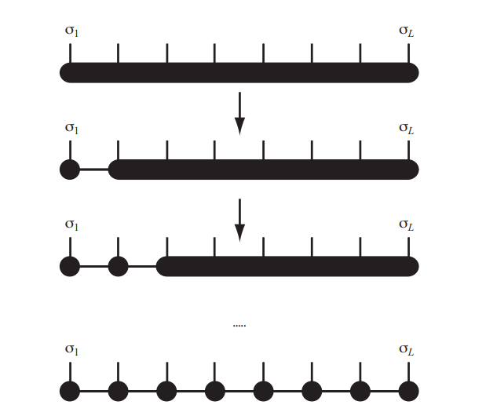

---
categories:
- Readings
tags:
- reading
- tensor-networks
- mps
date: '2026-06-08'
description: 'Basic MPS notes extracted from the previous Tensor Network Method report: Schmidt decomposition, canonical MPS forms, MPOs, contraction order, transfer maps, correlation decay, and the MPS to PEPS motivation.'
lang: en
title: MPS Basics
bibliography: refs.bib
---

[<- Back to TN Simulation](index.qmd)

# MPS Basics

The construction of MPS is based on the Schmidt decomposition.

:::{#def-schmidt .callout-note icon="false"}
## Schmidt decomposition
Let $\mathcal{H}=\mathcal{H}_A\otimes\mathcal{H}_B$ be a finite-dimensional bipartite Hilbert space. Any pure state $|\Psi\rangle\in\mathcal{H}$ can be written as
$$
|\Psi\rangle=\sum_{\alpha=1}^{r}s_\alpha |u_\alpha\rangle_A\otimes |v_\alpha\rangle_B,
$$
where $s_\alpha\ge 0$, $\{|u_\alpha\rangle_A\}$ and $\{|v_\alpha\rangle_B\}$ are orthonormal sets, and $r\le \min(\dim\mathcal{H}_A,\dim\mathcal{H}_B)$ is the Schmidt rank.
:::

In a product basis, a bipartite state is
$$
|\Psi\rangle=\sum_{i,j} C_{ij}\, |i\rangle_A |j\rangle_B .
$$
The Schmidt decomposition is just the singular-value decomposition of the coefficient matrix,
$$
C=U\Sigma V^\dagger,
$$
with $U^\dagger U=I$ and $V^\dagger V=I$. The singular values in $\Sigma$ are the Schmidt coefficients. They quantify bipartite entanglement: if only one singular value is nonzero, the state factorizes; if many singular values are needed, the two subsystems are strongly entangled.

The key question for tensor-network methods is how to repeat this idea for a tensor product of many Hilbert spaces.

{#fig-mps-schematic width="45%"}

#### Left-Canonical MPS

For an $n$-site chain
$$
\mathcal{H}=\mathcal{H}_1\otimes\mathcal{H}_2\otimes\cdots\otimes\mathcal{H}_n,
$$
a general state is
$$
|\Psi\rangle
=\sum_{k_1=1}^{p_1}\cdots\sum_{k_n=1}^{p_n}
c_{k_1\cdots k_n}\,
|\psi_{1,k_1}\rangle\otimes\cdots\otimes|\psi_{n,k_n}\rangle .
$$
Apply SVD to the bipartition $1|(2,\ldots,n)$, then to $(a_1,2)|(3,\ldots,n)$, and continue from left to right:
$$
\begin{aligned}
c_{k_1,k_2,\ldots,k_n}
&=c_{k_1,(k_2,\ldots,k_n)}\\
&=\sum_{a_1}A^{[1]}_{k_1,a_1}\,c^{[1]}_{a_1,(k_2,\ldots,k_n)}\\
&=\sum_{a_1,a_2}A^{[1]}_{k_1,a_1}
A^{[2]}_{(a_1,k_2),a_2}\,
c^{[2]}_{a_2,(k_3,\ldots,k_n)}\\
&=\sum_{a_1,\ldots,a_{n-1}}
A^{[1],k_1}_{1,a_1}A^{[2],k_2}_{a_1,a_2}\cdots
A^{[n],k_n}_{a_{n-1},1}.
\end{aligned}
$$
Thus
$$
|\Psi\rangle=
\sum_{k_1,\ldots,k_n}
A^{[1],k_1}A^{[2],k_2}\cdots A^{[n],k_n}
|\psi_{1,k_1}\rangle\otimes\cdots\otimes|\psi_{n,k_n}\rangle .
$$
The virtual indices $a_i$ are the geometric or bond indices. Their dimensions are the bond dimensions.

In the orientation used in the source note, the SVD isometry condition gives
$$
\sum_{k_i} A^{[i],k_i\dagger}A^{[i],k_i}=I,\qquad i=1,\ldots,n-1.
$$
For $i=n$, the same relation follows if the whole state is normalized. This is the left-canonical form in the source convention.

#### Right-Canonical MPS

The same decomposition can be run from right to left:
$$
|\Psi\rangle=
\sum_{k_1,\ldots,k_n}
B^{[1],k_1}B^{[2],k_2}\cdots B^{[n],k_n}
|\psi_{1,k_1}\rangle\otimes\cdots\otimes|\psi_{n,k_n}\rangle ,
$$
with the right-isometry condition
$$
\sum_{k_i}B^{[i],k_i}B^{[i],k_i\dagger}=I,\qquad i=1,\ldots,n .
$$
Different books place the dagger on the opposite side depending on whether tensors are drawn as maps from left-to-right or right-to-left. The invariant statement is that the tensor, after grouping one physical and one virtual leg, is an isometry.

#### Mixed-Canonical MPS

The mixed-canonical form decomposes both sides of a chosen bond and keeps the Schmidt spectrum at the center:
$$
|\Psi\rangle=
\sum_{k_1,\ldots,k_n}
A^{[1],k_1}\cdots A^{[t],k_t}\,
S\,
B^{[t+1],k_{t+1}}\cdots B^{[n],k_n}
|\psi_{1,k_1}\rangle\otimes\cdots\otimes|\psi_{n,k_n}\rangle .
$$
Here $S=\operatorname{diag}(s_1,\ldots,s_r)$ is diagonal, while the tensors to the left and right obey their canonical isometry conditions.

Define the left block states
$$
|a_\ell\rangle_A=
\sum_{k_1,\ldots,k_t}
A^{[1],k_1}_{1,a_1}\cdots A^{[t],k_t}_{a_{t-1},a_\ell}
|\psi_{1,k_1}\rangle\otimes\cdots\otimes|\psi_{t,k_t}\rangle ,
$$
and the right block states
$$
|a_\ell\rangle_B=
\sum_{k_{t+1},\ldots,k_n}
B^{[t+1],k_{t+1}}_{a_\ell,a_{t+1}}\cdots
B^{[n],k_n}_{a_{n-1},1}
|\psi_{t+1,k_{t+1}}\rangle\otimes\cdots\otimes|\psi_{n,k_n}\rangle .
$$
The canonical conditions make both sets orthonormal. Therefore the mixed-canonical MPS is precisely a Schmidt decomposition across the selected bond:
$$
|\Psi\rangle=\sum_{\ell=1}^{r}s_\ell |a_\ell\rangle_A\otimes |a_\ell\rangle_B .
$$
This is why MPS algorithms can move an orthogonality center through the chain and read off the entanglement spectrum bond by bond.

# Matrix Product Operators

The same SVD logic applies to operators. For a one-dimensional chain, write
$$
|\vec{\sigma}\rangle=|\sigma_1\cdots\sigma_L\rangle,\qquad
\hat{O}=c_{\vec{\sigma},\vec{\sigma}'}
|\vec{\sigma}\rangle\langle\vec{\sigma}'|.
$$
After reshaping the physical pair $(\sigma_i,\sigma_i')$ as one compound physical index, the coefficient tensor can be decomposed as
$$
\hat{O}=
\sum_{\vec{\sigma},\vec{\sigma}'}
W^{[1],\sigma_1\sigma_1'}\cdots
W^{[L],\sigma_L\sigma_L'}
|\vec{\sigma}\rangle\langle\vec{\sigma}'|.
$$
For fixed physical indices, $W^{[i],\sigma_i\sigma_i'}$ is a matrix on virtual MPO indices. Without truncation, a repeated SVD gives virtual sizes that can grow like
$$
1\times d^2,\quad d^2\times d^4,\quad \ldots,\quad d^4\times d^2,\quad d^2\times 1.
$$
Local Hamiltonians are useful because their MPO bond dimensions remain small.

Equivalently, each tensor can be seen as a matrix whose entries are local operators,
$$
[W^{[i]}]_{a_{i-1},a_i}
=\sum_{\sigma_i,\sigma_i'}
W^{[i],\sigma_i\sigma_i'}_{a_{i-1},a_i}
|\sigma_i\rangle\langle\sigma_i'|.
$$
This compact operator-valued-matrix notation turns local sums of product operators into finite-state paths through the virtual index.

#### Heisenberg MPO

For the nearest-neighbor Heisenberg model
$$
H=\sum_{i=1}^{L-1}
\left(
\frac{J}{2}S_i^+S_{i+1}^-
+\frac{J}{2}S_i^-S_{i+1}^+
+J_z S_i^zS_{i+1}^z
\right)
+h\sum_{i=1}^{L}S_i^z ,
$$
the source note uses the open-boundary MPO bulk tensor
$$
W^{[i]}=
\begin{pmatrix}
I & 0 & 0 & 0 & 0\\
S^+&0&0&0&0\\
S^-&0&0&0&0\\
S^z&0&0&0&0\\
-hS^z&\frac{J}{2}S^-&\frac{J}{2}S^+&J_zS^z&I
\end{pmatrix}.
$$
Open boundaries are enforced by keeping only the last row at the left boundary and only the first column at the right boundary. This selects paths that either insert a local field term or start a nearest-neighbor interaction on one site and close it on the next.

#### Operator Elements and Contraction Order

Let
$$
\hat{O}=
\sum_{\vec{\sigma},\vec{\sigma}'}
O^{[1],\sigma_1\sigma_1'}\cdots
O^{[L],\sigma_L\sigma_L'}
|\sigma_1\cdots\sigma_L\rangle
\langle\sigma_1'\cdots\sigma_L'|
$$
and let
$$
|\psi\rangle=
\sum_{\vec{k}}M^{[1],k_1}\cdots M^{[L],k_L}
|k_1\cdots k_L\rangle,\qquad
|\phi\rangle=
\sum_{\vec{k}}N^{[1],k_1}\cdots N^{[L],k_L}
|k_1\cdots k_L\rangle .
$$
Then
$$
\langle\psi|\hat{O}|\phi\rangle
=
\sum_{\vec{k},\vec{k}'}
M^{[L],k_L\dagger}\cdots M^{[1],k_1\dagger}
O^{[1],k_1k_1'}\cdots O^{[L],k_Lk_L'}
N^{[1],k_1'}\cdots N^{[L],k_L'}.
$$
The efficient contraction order is iterative. Define an environment map
$$
F_{b_i,b_{i-1},O_i}[X]
=
\sum_{\sigma_i,\sigma_i'}
O^{[i],\sigma_i\sigma_i'}_{b_{i-1},b_i}
M^{[i],\sigma_i\dagger}\,X\,N^{[i],\sigma_i'} .
$$
With $b_0=b_L=1$, the matrix element is
$$
\langle\psi|\hat{O}|\phi\rangle
=
\sum_{b_1,\ldots,b_{L-1}}
F_{b_L=1,b_{L-1},O_L}
\left[\cdots
F_{b_2,b_1,O_2}
\left[
F_{b_1,b_0=1,O_1}[I]
\right]\cdots\right].
$$
This is the algebraic form of the usual left-to-right MPO-MPS contraction.

#### Two-Point Functions and Transfer Maps

For a two-point observable,
$$
\langle\phi|\hat{O}_i\hat{O}_j|\phi\rangle,
$$
all sites except $i$ and $j$ carry the identity operator, meaning
$$
O^{[k],\sigma_k\sigma_k'}=\delta_{\sigma_k,\sigma_k'}I .
$$
If $|\phi\rangle$ is left-canonical, then
$$
F_{b_i,b_{i-1},I}[I]
=
\sum_{\sigma_i}
A^{[i],\sigma_i\dagger}A^{[i],\sigma_i}
\delta_{b_{i-1},b_i}
=I\,\delta_{b_{i-1},b_i}.
$$
Identity segments outside the operator insertions can therefore collapse immediately.

If the left-canonical tensors are also translationally invariant,
$$
A^{[i],\sigma}=A^\sigma,
$$
the identity environment is governed by a single transfer map
$$
F[X]=\sum_\sigma A^{\sigma\dagger}X A^\sigma .
$$
The two-point function takes the schematic form
$$
\langle\phi|\hat{O}_i\hat{O}_j|\phi\rangle
=
F^{L-j}\,F_{O_j}\,F^{j-i-1}\,F_{O_i}[I],
$$
with the appropriate MPO virtual-index sums understood. In canonical form, $F$ is a completely positive trace-preserving map in Kraus form. Its eigenvalues satisfy $|\lambda_\alpha|\le 1$, and the leading eigenvalue gives the constant long-distance contribution. Expanding in eigenvectors gives
$$
\langle\phi|\hat{O}_i\hat{O}_j|\phi\rangle
=c_0+\sum_{\alpha>0}c_\alpha \lambda_\alpha^{|i-j|}
=c_0+\sum_{\alpha>0}c_\alpha e^{-|i-j|/\xi_\alpha}.
$$
This is the precise version of the source note's statement that simple translationally invariant MPS have exponentially decaying correlations.

# MPS, Area Laws, and PEPS

MPS are efficient when the physically relevant Schmidt spectra decay rapidly across every one-dimensional cut. For gapped one-dimensional local Hamiltonians, this is expected from the area law: the entanglement entropy across a cut remains bounded independently of system length [@hastings2007area]. This is the structural reason DMRG and finite-bond-dimension MPS work so well for gapped 1D chains.

The source note also points out the limitation: states with higher-dimensional area laws are not naturally captured by one-dimensional MPS without large bond dimension. In two dimensions the boundary of a region grows with its perimeter, so the tensor-network ansatz should attach virtual bonds along the two-dimensional lattice geometry. This leads to projected entangled pair states, or PEPS, which generalize the MPS construction to two and higher dimensions [@verstraete2004renormalization; @orus2014practical].
