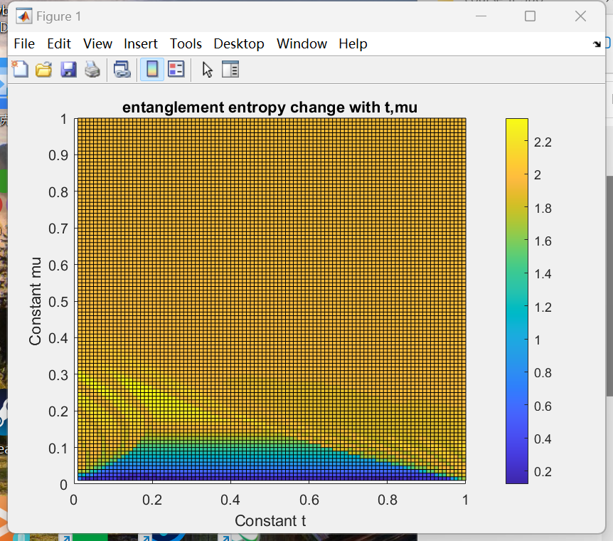
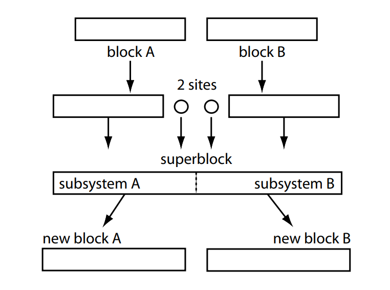
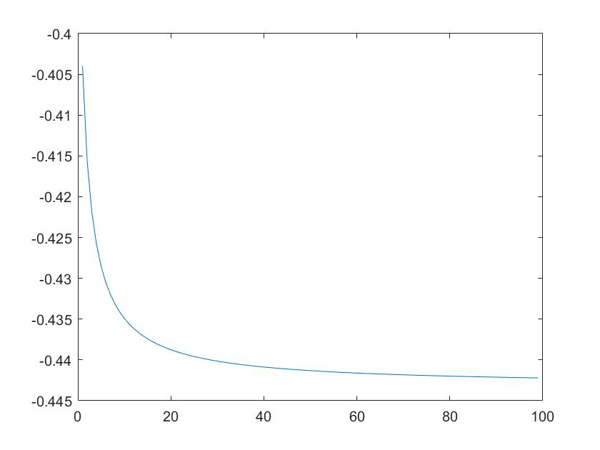
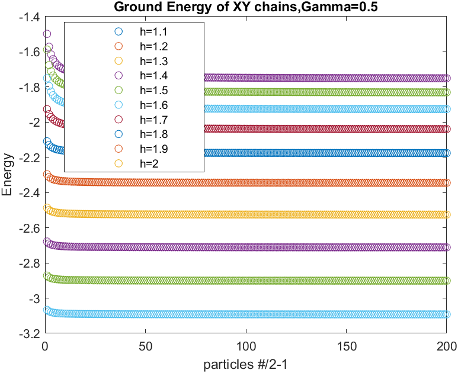
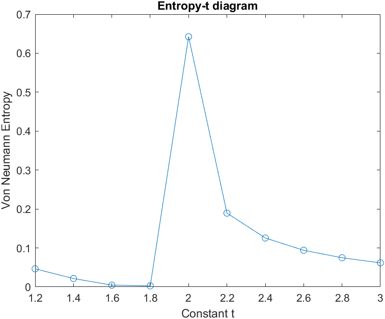
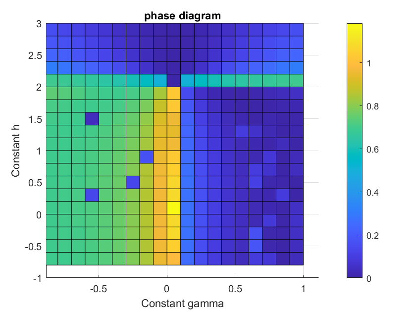
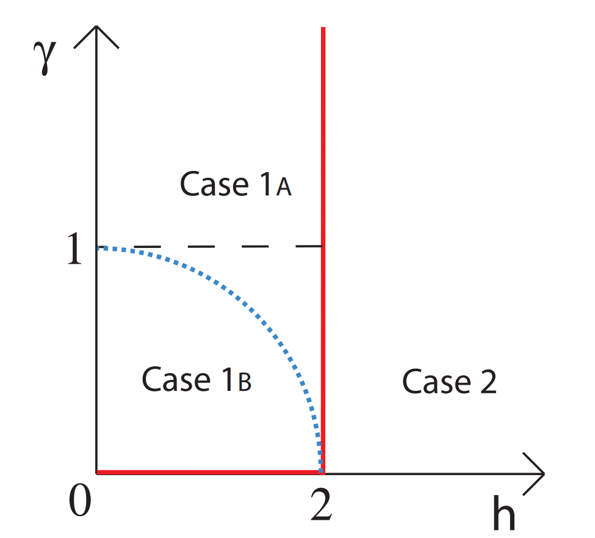
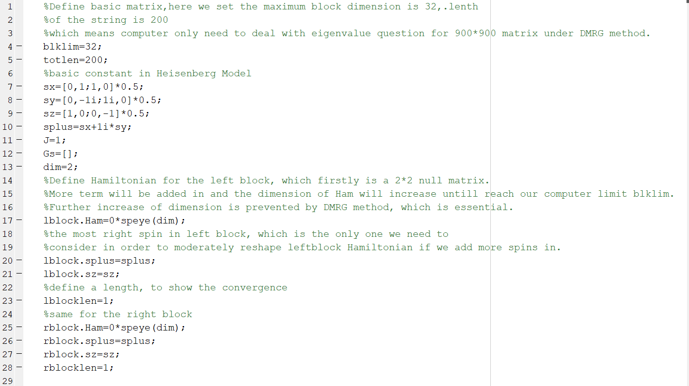
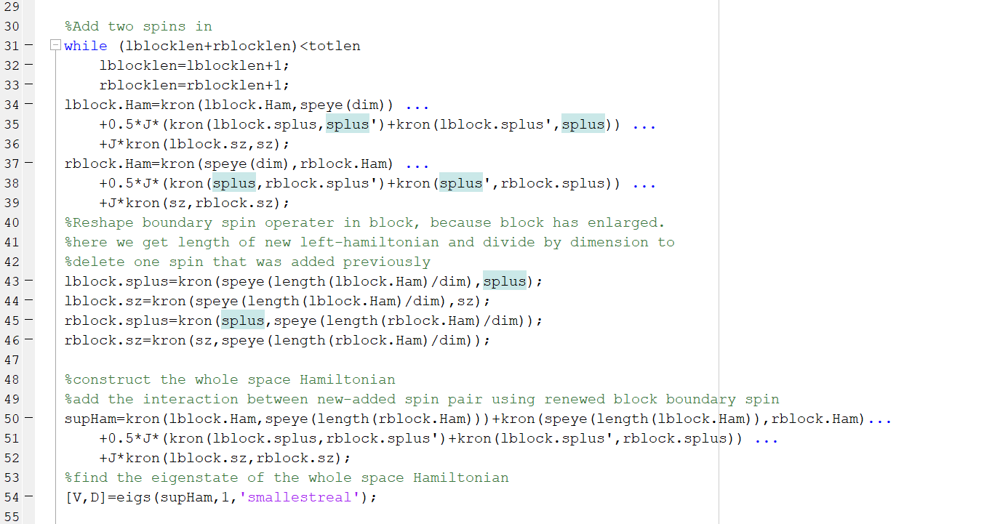
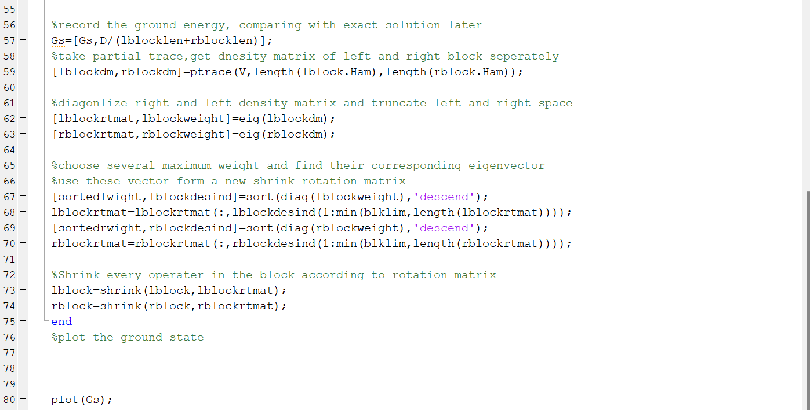

---
categories:
- Readings
date: '2026-06-08'
description: 'DMRG and vMPS notes extracted from the previous report: finite-MPS ground-state search, MPO construction for Bose-Hubbard, Heisenberg and XY models, iDMRG truncation logic, and the original simulation figures.'
lang: en
title: DMRG and Variational MPS Algorithms
bibliography: refs.bib
---

[<- Back to TN Simulation](index.qmd)

# DMRG and Variational MPS Algorithms

The source note frames ground-state search through two standard routes:

1. variational optimization,
2. imaginary-time evolution.

DMRG is the MPS version of the variational route. Instead of optimizing over the full Hilbert space, one optimizes over the manifold of MPS with controlled bond dimension. Historically, DMRG was introduced through reduced-density-matrix truncation [@white1992density; @white1993density]; the modern formulation treats finite DMRG as a variational MPS algorithm [@schollwock2011dmrg].

## vMPS Ground-State Search

For a Hamiltonian represented as an MPO, the variational problem is
$$
E_0(D)=\min_{|\psi(A)\rangle\in\mathcal{M}_D}
\frac{\langle\psi(A)|H|\psi(A)\rangle}
{\langle\psi(A)|\psi(A)\rangle},
$$
where $\mathcal{M}_D$ is the set of MPS with maximum bond dimension $D$. Holding all tensors fixed except one site or two adjacent sites turns the global nonlinear minimization into a local effective eigenvalue problem. A DMRG sweep solves these local problems while moving the orthogonality center through the chain.

The algorithmic structure is therefore parallel to iterative compression:

1. keep the MPS in mixed-canonical form,
2. build left and right environments for the Hamiltonian MPO,
3. solve the local effective ground-state problem,
4. split the optimized one-site or two-site tensor by SVD,
5. truncate by retained Schmidt weight or maximum bond dimension,
6. sweep until energy, variance, and observables converge.

## Bose-Hubbard MPO: Open Boundaries

The finite Bose-Hubbard Hamiltonian in the source note is
$$
\begin{aligned}
H
&=\sum_{i=1}^{N-1}\left(-t\,b_i^\dagger b_{i+1}
-t\,b_{i+1}^\dagger b_i\right)
+\sum_{i=1}^{N}
\left[
\frac{U}{2}n_i n_i-\left(\frac{U}{2}+\mu\right)n_i
\right]\\
&=\sum_{i=1}^{N-1}\left(-t\,b_i^\dagger b_{i+1}
-t\,b_{i+1}^\dagger b_i\right)
+\sum_{i=1}^{N}\Omega_i ,
\end{aligned}
$$
where
$$
\Omega_i=\frac{U}{2}n_i n_i-\left(\frac{U}{2}+\mu\right)n_i
=\frac{U}{2}n_i(n_i-1)-\mu n_i .
$$
For open boundary conditions, the source constructs the operator-valued matrix
$$
W_i=
\begin{bmatrix}
I&0&0&0\\
b_i^\dagger&0&0&0\\
b_i&0&0&0\\
\Omega_i&-t b_i&-t b_i^\dagger&I
\end{bmatrix}.
$$
Then
$$
H=(W_1W_2\cdots W_N)_{4,1}.
$$
The nonzero virtual paths contributing to this matrix element are
$$
\begin{aligned}
&W_{44}^{1}W_{44}^{2}\cdots W_{43}^{i}W_{31}^{i+1}W_{11}^{i+2}\cdots W_{11}^{N},\\
&W_{44}^{1}W_{44}^{2}\cdots W_{42}^{i}W_{21}^{i+1}W_{11}^{i+2}\cdots W_{11}^{N},\\
&W_{44}^{1}W_{44}^{2}\cdots W_{41}^{i}W_{11}^{i+1}W_{11}^{i+2}\cdots W_{11}^{N}.
\end{aligned}
$$
They generate, respectively,
$$
-t\,b_i^\dagger b_{i+1},\qquad
-t\,b_{i+1}^\dagger b_i,\qquad
\Omega_i .
$$
Summing over all possible path-start positions $i$ reconstructs the Bose-Hubbard Hamiltonian.

## Bose-Hubbard MPO: Periodic Boundaries

For the same bulk tensor, the open-boundary matrix product has the schematic form
$$
W_1W_2\cdots W_N=
\begin{bmatrix}
I_1&0&0&0\\
b_1^\dagger&0&0&0\\
b_1&0&0&0\\
H_O&-t b_N&-t b_N^\dagger&I_N
\end{bmatrix},
$$
where $H_O=(W_1\cdots W_N)_{4,1}$ is the open-boundary Hamiltonian. Under periodic boundary conditions,
$$
H_P=H_O-t\,b_N^\dagger b_1-t\,b_1^\dagger b_N .
$$
The source represents the boundary-closing terms as
$$
\begin{aligned}
H_P
&=
\begin{pmatrix}
0&-t b_N&-t b_N^\dagger&I_N
\end{pmatrix}
(W_1W_2\cdots W_N)
\begin{pmatrix}
I\\0\\0\\0
\end{pmatrix}\\
&=\operatorname{Tr}\left[(W_1W_2\cdots W_N)T\right],
\end{aligned}
$$
with
$$
T=
\begin{pmatrix}
0&-t b_N&-t b_N^\dagger&I_N\\
0&0&0&0\\
0&0&0&0\\
0&0&0&0
\end{pmatrix}.
$$
This turns the OBC matrix product into a ring-like MPO by adding the end correction $T$.

{#fig-bose-hubbard-entropy width="55%"}

## Heisenberg MPO

The supplementary `name.tex` file repeats the Heisenberg MPO and adds the periodic-boundary closure. For
$$
H=\sum_{i=1}^{L-1}
\left(
\frac{J}{2}S_i^+S_{i+1}^-
+\frac{J}{2}S_i^-S_{i+1}^+
+J_z S_i^zS_{i+1}^z
\right)
+h\sum_{i=1}^{L}S_i^z ,
$$
an OBC bulk tensor is
$$
W^{[i]}=
\begin{pmatrix}
I & 0 & 0 & 0 & 0\\
S^+&0&0&0&0\\
S^-&0&0&0&0\\
S^z&0&0&0&0\\
-hS^z&\frac{J}{2}S^-&\frac{J}{2}S^+&J_zS^z&I
\end{pmatrix}.
$$
At open boundaries the last row and first column are kept separately.

For the periodic construction in `name.tex`, the boundary row is
$$
\begin{pmatrix}
0&\frac{J}{2}S^-&\frac{J}{2}S^+&J_zS^z&I
\end{pmatrix},
$$
so the periodic Hamiltonian is represented as
$$
H_P=
\operatorname{Tr}\left[
(W_1W_2\cdots W_N)T
\right],
$$
where
$$
T=
\begin{pmatrix}
0&\frac{J}{2}S^-&\frac{J}{2}S^+&J_zS^z&I\\
0&0&0&0&0\\
0&0&0&0&0\\
0&0&0&0&0\\
0&0&0&0&0
\end{pmatrix}.
$$
The original note says no simulation data were included for this Heisenberg case and suggests first checking whether the ground state converges.

## XY Model and Infinite DMRG

Appendix A of the source uses the XY chain as the explicit infinite-DMRG example. The Hamiltonian is written in terms of $\sigma^z,\sigma^+,\sigma^-$ and $I$:
$$
\begin{aligned}
H
&=-\sum_n
\left[
\sigma_n^x\sigma_{n+1}^x+\sigma_n^y\sigma_{n+1}^y
\right]
-\gamma
\left[
\sigma_n^x\sigma_{n+1}^x-\sigma_n^y\sigma_{n+1}^y
\right]
-h\sigma_n^z\\
&=\sum_n
-\frac{1}{2}
\left[
\sigma_n^+\sigma_{n+1}^-
+\sigma_n^-\sigma_{n+1}^+
\right]
-\frac{\gamma}{2}
\left[
\sigma_n^+\sigma_{n+1}^+
+\sigma_n^-\sigma_{n+1}^-
\right]
-h\sigma_n^z .
\end{aligned}
$$
The corresponding MPO in `name.tex` is
$$
W^{[i]}=
\begin{pmatrix}
I&0&0&0&0&0\\
\sigma^-&0&0&0&0&0\\
\sigma^+&0&0&0&0&0\\
\sigma^+&0&0&0&0&0\\
\sigma^-&0&0&0&0&0\\
-h\sigma^z&-\frac{1}{2}\sigma^+&-\frac{1}{2}\sigma^-&
-\frac{\gamma}{2}\sigma^+&-\frac{\gamma}{2}\sigma^-&I
\end{pmatrix}.
$$

### Step 1: Divide and Enlarge

iDMRG divides the system into left and right blocks and adds one new site to each block at every iteration. The starting boundary Hamiltonians are
$$
H_L=-h\sigma_1^z,\qquad
H_R=-h\sigma_n^z .
$$
After adding a site to the left block,
$$
\begin{aligned}
H_L
&=
-h\sigma_1^z\otimes I_{\mathrm{new}}
-\frac{1}{2}
\left[
\sigma_1^+\sigma_{\mathrm{new}}^-
+\sigma_1^-\sigma_{\mathrm{new}}^+
\right]\\
&\quad
-\frac{\gamma}{2}
\left[
\sigma_1^+\sigma_{\mathrm{new}}^+
+\sigma_1^-\sigma_{\mathrm{new}}^-
\right]
-h I_1\otimes\sigma_{\mathrm{new}}^z .
\end{aligned}
$$
Similarly, after adding a site to the right block,
$$
\begin{aligned}
H_R
&=
-hI_{\mathrm{new}}\otimes\sigma_n^z
-\frac{1}{2}
\left[
\sigma_{\mathrm{new}}^+\sigma_n^-
+\sigma_{\mathrm{new}}^-\sigma_n^+
\right]\\
&\quad
-\frac{\gamma}{2}
\left[
\sigma_{\mathrm{new}}^+\sigma_n^+
+\sigma_{\mathrm{new}}^-\sigma_n^-
\right]
-h\sigma_{\mathrm{new}}^z\otimes I_n .
\end{aligned}
$$
In block notation this is the recursive update
$$
H_L\leftarrow H_L\otimes I+\cdots,\qquad
H_R\leftarrow I\otimes H_R+\cdots .
$$

{#fig-idmrg-enlarge width="55%"}

### Step 2: Cut Off by Entanglement

The block dimension grows exponentially as sites are added. Once it exceeds a target dimension $D$, truncation begins:

1. find the ground state of the enlarged superblock,
2. compute the reduced density matrix $\rho_L$ or $\rho_R$,
3. diagonalize it to obtain eigenvalues and eigenvectors,
4. keep the eigenvectors associated with the largest $D$ eigenvalues,
5. rotate all block operators and states into the retained subspace.

This is the original DMRG truncation rule: keep the block basis that carries the largest entanglement weight with the environment.

{#fig-dmrg-method width="55%"}

## XY Results and Phase Transition

The source includes ground-state and entanglement-entropy plots for the XY chain. It reports qualitative agreement between the numerical DMRG result and the analytic phase-diagram result shown in the original reference figure, attributed there to arXiv:0707.2534v4. That arXiv paper is Franchini, Its, and Korepin on Renyi entropy of the XY spin chain [@franchini2008renyi].

{#fig-xy-gs width="46%"}

{#fig-xy-entropy width="46%"}

{#fig-xy-phase width="46%"}

{#fig-xy-analytic width="46%"}

## Why iDMRG Works and Where It Fails

The source conclusion is:

- iDMRG succeeds for one-dimensional gapped models because correlations decay approximately as $e^{-\ell/\xi}$.
- Entanglement is concentrated near the boundary between the two blocks.
- Therefore most eigenvalues of the reduced density matrix are small and can be discarded.

This is the numerical counterpart of the one-dimensional area-law picture [@hastings2007area]. The same note then asks three natural generalization questions:

1. Can the method be used for finite chains? Yes. Finite DMRG and variational MPS sweeps are exactly the finite-chain version.
2. Can it handle one-dimensional chains with nonlocal interactions such as $S_iS_{i+p}$? Yes, but the MPO bond dimension and contraction cost grow with the range or with the quality of a long-range approximation.
3. Can it be generalized to higher-dimensional lattices? The MPS itself becomes inefficient for generic 2D area-law states; PEPS is the natural higher-dimensional ansatz.

## From DMRG to Renormalization Group

The source leaves a final heading, "DMRG to Renormalization group." The essential point is that DMRG is a real-space renormalization method whose truncation criterion is not local block energy but entanglement with the environment. Each block-enlargement step forms a larger Hilbert space and then projects it back to a retained subspace:
$$
\mathcal{H}_{\mathrm{block}}\otimes\mathcal{H}_{\mathrm{site}}
\longrightarrow
\operatorname{span}\{|\ell_1\rangle,\ldots,|\ell_D\rangle\}.
$$
The retained basis is determined by the reduced density matrix of the superblock ground state. This is why DMRG avoids the failure mode of early real-space RG methods, where keeping low-energy states of an isolated block can discard states that are crucial once the block is coupled to its environment.

## Efficient State Preparation

The source contains only the opening sentence of this topic, but its placement after DMRG indicates the intended MPS point: if a target state has small bond dimension $D$, then it can be prepared sequentially by applying isometries that realize the Schmidt decomposition bond by bond. In tensor-network language, each MPS tensor is an isometry from an incoming virtual index and a local ancilla into an outgoing virtual index and physical site. The preparation cost scales polynomially in $L$, $d$, and $D$, rather than in the full Hilbert-space dimension $d^L$.

This is also why MPS are useful as compressed classical descriptions and as circuit-compilation targets: low entanglement implies small virtual memory.

## Original MATLAB Screenshots

The source note says an explicit MATLAB code for the DMRG-style Heisenberg or XY simulation was attached in Appendix A. The original directory contained three code screenshots, retained here as archival figures.

{#fig-code1 width="80%"}

{#fig-code2 width="80%"}

{#fig-code3 width="80%"}
