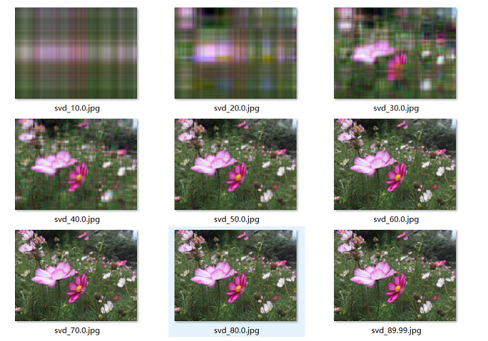
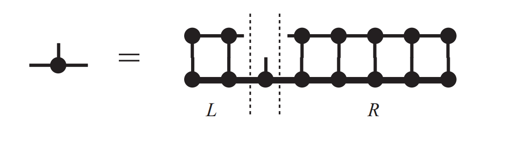
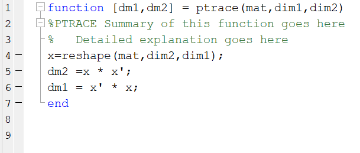
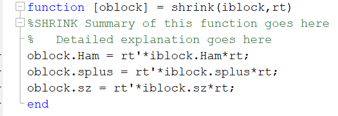

---
categories:
- Readings
tags:
- reading
- tensor-networks
- mps
- compression
date: '2026-06-08'
description: 'MPS compression notes extracted from the previous report: Schmidt cutoff, MPS bond-dimension truncation, iterative compression, and the information-theoretic interpretation of discarded Schmidt weight.'
lang: en
title: MPS Compression Algorithms
bibliography: refs.bib
---

[<- Back to TN Simulation](index.qmd)

# MPS Compression Algorithms

The compression part of the original note has three layers:

1. ordinary SVD cutoff for matrices,
2. Schmidt cutoff for a bipartite quantum state and then for every MPS bond,
3. iterative variational compression, where a high-bond-dimension MPS or MPO is projected into a lower-bond-dimension ansatz by local sweeps.

The common object is always the Schmidt spectrum. Large singular values define the subspace that carries most of the state norm, while discarded singular values quantify the approximation error [@schollwock2011dmrg; @orus2014practical].

## Matrix SVD Cutoff

For a matrix $C\in\mathbb{C}^{m\times n}$,
$$
C=U\Sigma V^\dagger,\qquad
\Sigma=\operatorname{diag}(s_1,s_2,\ldots),\qquad
s_1\ge s_2\ge \cdots\ge 0 .
$$
The rank-$D$ truncated approximation is
$$
C_D=\sum_{\alpha=1}^{D}s_\alpha u_\alpha v_\alpha^\dagger .
$$
If $D\ll \min(m,n)$ and the singular values decay quickly, $C_D$ stores the important part of $C$ with much lower memory cost. This is the same idea behind image compression.

{#fig-svd-compression width="45%"}

:::{#lem-truncated-svd .callout-important icon="false"}
## Optimality of the rank-$D$ SVD cutoff
For the Frobenius norm,
$$
\|C-C_D\|_F^2=\sum_{\alpha>D}s_\alpha^2
$$
is minimal among all rank-$D$ matrices. Therefore the discarded singular weight is the natural local error measure for SVD compression.
:::

The same statement becomes the Schmidt-truncation principle for quantum states.

## Schmidt Cutoff for Quantum States

Across a bipartition $A|B$,
$$
|\Psi\rangle=\sum_{\alpha=1}^{r}s_\alpha |a_\alpha\rangle_A|b_\alpha\rangle_B,
\qquad
\sum_{\alpha=1}^{r}s_\alpha^2=1 .
$$
Keeping the largest $D$ Schmidt coefficients gives
$$
|\Psi_D\rangle=
\frac{1}{\sqrt{1-\epsilon_D}}
\sum_{\alpha=1}^{D}s_\alpha |a_\alpha\rangle_A|b_\alpha\rangle_B,
\qquad
\epsilon_D=\sum_{\alpha>D}s_\alpha^2 .
$$
The truncation error $\epsilon_D$ is the probability weight discarded from the reduced density matrix. If only $s_1,s_2,s_3$ are retained, then subspace $A$ is represented by the three dominant Schmidt vectors $|a_1\rangle_A,|a_2\rangle_A,|a_3\rangle_A$, and similarly for $B$. Operators and reduced density matrices on $A$ can then be rotated into this three-dimensional basis.

This is exactly the density-matrix truncation logic of DMRG: diagonalize a reduced density matrix, keep the eigenvectors with largest eigenvalues, and project block operators into that retained subspace [@white1992density; @schollwock2011dmrg].

## MPS Bond-Dimension Cutoff

For an $L$-site chain with local Hilbert-space dimension $d$, a generic state needs $d^L$ amplitudes. An exact left-to-right MPS decomposition without truncation has bond dimensions that grow until the middle of the chain. Schematically, the source note describes the tensor shapes as
$$
1\times d,\quad d\times d^2,\quad d^2\times d^3,\quad \ldots,\quad d^2\times d,\quad d\times 1 .
$$
MPS compression chooses a maximum bond dimension $D$ and keeps only the largest $D$ singular values at every SVD step. Once the exact Schmidt dimension exceeds $D$, the internal tensors have shapes of order
$$
1\times d,\quad d\times d^2,\quad d^2\times D,\quad
D\times D,\quad \ldots,\quad D\times d^3,\quad d^2\times d,\quad d\times 1 .
$$
Thus storage drops from exponential,
$$
O(d^L),
$$
to MPS storage
$$
O(LdD^2),
$$
up to boundary factors. The physical meaning is that every geometric bond index is a controlled Schmidt cut, so the ansatz can keep the dominant entanglement channel at many places in the chain.

## Iterative Variational Compression

Directly truncating a very large exact decomposition can be expensive because it requires high-dimensional SVDs. Iterative compression avoids this by solving a smaller variational problem. Let $|\psi\rangle$ be the original MPS with bond dimension $D'$ and $|\tilde{\psi}\rangle$ be the compressed MPS with bond dimension $D<D'$. We minimize
$$
\||\psi\rangle-|\tilde{\psi}\rangle\|^2 .
$$
This is nonlinear in all tensors of $|\tilde{\psi}\rangle$ at once, but it is linear in one tensor if all other compressed tensors are fixed.

Fix all tensors except $\tilde{M}^{[i],\sigma_i}_{a_{i-1},a_i}$. The stationarity condition gives the local normal equation
$$
\sum_{a_{i-1}',a_i'}
\tilde{O}_{a_{i-1}a_i,a_{i-1}'a_i'}
\tilde{M}^{[i],\sigma_i}_{a_{i-1}'a_i'}
=
\sum_{a_{i-1}',a_i'}
T_{a_{i-1}a_i,a_{i-1}'a_i'}
M^{[i],\sigma_i}_{a_{i-1}'a_i'} .
$$
The environment metric on the left-hand side factorizes as
$$
\tilde{O}_{a_{i-1}a_i,a_{i-1}'a_i'}
=
\tilde{L}_{a_{i-1},a_{i-1}'}
\tilde{R}_{a_i,a_i'} ,
$$
where
$$
\tilde{L}_{a_{i-1},a_{i-1}'}
=
\left(
\sum_{\sigma_{i-1}}\tilde{M}^{[i-1],\sigma_{i-1}\dagger}
\left(\cdots
\left(\sum_{\sigma_1}\tilde{M}^{[1],\sigma_1\dagger}\tilde{M}^{[1],\sigma_1}\right)
\cdots\right)
\tilde{M}^{[i-1],\sigma_{i-1}}
\right)_{a_{i-1},a_{i-1}'},
$$
and
$$
\tilde{R}_{a_i,a_i'}
=
\left(
\sum_{\sigma_{i+1}}\tilde{M}^{[i+1],\sigma_{i+1}}
\left(\cdots
\left(\sum_{\sigma_L}\tilde{M}^{[L],\sigma_L}\tilde{M}^{[L],\sigma_L\dagger}\right)
\cdots\right)
\tilde{M}^{[i+1],\sigma_{i+1}\dagger}
\right)_{a_i,a_i'} .
$$
The tensor $T$ on the right-hand side is the mixed overlap environment between $|\psi\rangle$ and $|\tilde{\psi}\rangle$: it has the same contraction pattern as $\tilde{O}$, but the non-dagger compressed tensors on the ket side are replaced by the corresponding tensors of the original MPS.

{#fig-onepoint-iterative width="70%"}

### Mixed-Canonical Simplification

If all compressed tensors left of site $i$ are left-canonical and all compressed tensors right of site $i$ are right-canonical, then
$$
\tilde{L}=I,\qquad \tilde{R}=I,\qquad \tilde{O}=I .
$$
The optimal local update is therefore just the right-hand-side overlap tensor:
$$
\tilde{M}^{[i],\sigma_i}\leftarrow
\text{environment overlap of }|\psi\rangle\text{ with }|\tilde{\psi}\rangle
\text{ after removing }\tilde{M}^{[i],\sigma_i}.
$$
After updating the tensor, an SVD or QR step shifts the orthogonality center and restores left- or right-canonical form. Sweeping this procedure through all sites repeatedly gives the variationally optimal compressed MPS within the chosen bond dimension, up to local-minimum and convergence issues.

The same algorithm compresses MPOs by replacing each physical index $\sigma_i$ with a pair $(\sigma_i,\sigma_i')$:
$$
M^{[i],\sigma_i}_{a_{i-1},a_i}
\quad\longrightarrow\quad
M^{[i],\sigma_i\sigma_i'}_{a_{i-1},a_i}.
$$

## Information-Theoretic View

The source note leaves a heading for "More Theoretical Discuss" and points toward quantum Shannon theory. The precise connection is:

- The squared Schmidt coefficients $p_\alpha=s_\alpha^2$ are the eigenvalues of both reduced density matrices $\rho_A$ and $\rho_B$.
- The entanglement entropy
  $$
  S_A=-\operatorname{Tr}\rho_A\log\rho_A
  =-\sum_\alpha p_\alpha\log p_\alpha
  $$
  measures how many Schmidt states are effectively needed across that cut.
- The discarded weight
  $$
  \epsilon_D=\sum_{\alpha>D}p_\alpha
  $$
  is the failure probability of projecting the bipartite state onto the retained Schmidt subspace.

For gapped one-dimensional local systems, area-law behavior implies that the entanglement entropy across a cut does not grow with system length [@hastings2007area]. Such states usually have rapidly decaying Schmidt spectra and are naturally compressible by MPS. Critical 1D systems may need larger $D$ because entanglement grows logarithmically, and higher-dimensional area laws generally require tensor networks matched to the geometry, such as PEPS.

## Original Code Fragments

The original folder also contained small code screenshots related to partial traces and subspace projection. They are retained here as archival figures because the TeX source refers to attached MATLAB routines for the DMRG-style truncation.

{#fig-ptrace-code width="55%"}

{#fig-shrink-code width="55%"}
