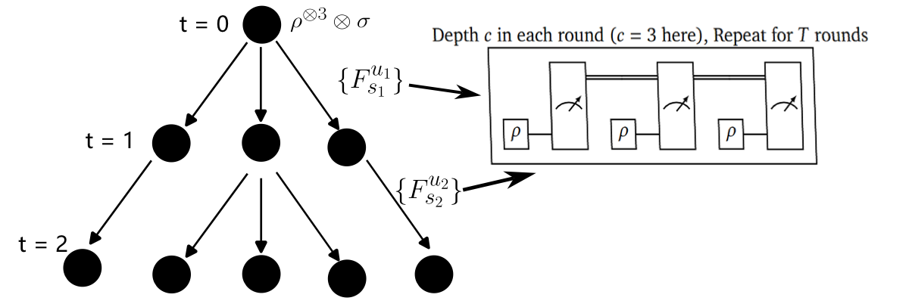

[← Back to Index](index.qmd)

# Tree Representation of Adaptive Strategies {#sec-tree-rep}

Consider a restricted POVM set $\mathcal{M} = \{\{F_s\} \mid \{F_s\} \text{ satisfies the restriction}\}$.
In practice, we can apply POVMs from $\mathcal{M}$ multiple times, choose their ordering strategically, and even select later measurements based on earlier outcomes. 
We call any such protocol an **$\mathcal{M}$-restrained adaptive strategy**.

A key insight from [@chen2021exponential] is that every adaptive strategy admits a natural *tree representation*.
The idea is simple: since each measurement outcome determines which measurement to perform next, the entire protocol can be encoded as a decision tree $\mathcal{T}$.
Specifically, each internal node $u$ corresponds to a measurement step, and its outgoing edges $\{(u,v_1),\ldots,(u,v_{s_u})\}$ correspond to the possible outcomes of some POVM $\{F^{u}_{v_{i}}\}_{i = 1}^{s_u} \in \mathcal{M}$.

Given this tree structure, any $c$-copy state $\rho \in \mathcal{H}(d^c)$ induces a probability distribution $p_{\rho,\mathcal{T}}(v)$ over the vertices of $\mathcal{T}$, where the probability of reaching vertex $v$ is determined by the product of transition probabilities along the path from the root to $v$.

::: {.callout-note icon="false"}
## Definition

Consider an adaptive learning strategy with $T$-rounds of $c$-replica
POVMs restrained on $\mathcal{M}$. The tree representation of it is

- A T-level decision tree $\mathcal{T}$ with root node $r$.

- Edges between node $u$ and its child nodes $s_1,\cdots,s_{N_u}$
  represents a POVM $\{F^{u}_s\}_{s =1}^{N_u} \in \mathcal{M}$ with the
  measurement outcomes $\{1,\cdots,N_u\}$.

- Each node $u$ is assigned a probability $p_{\mathcal{T},\rho}(u)$
  based on the updating rule $p_{\rho}(u) = p_{\rho}(u|s)p_{\rho}(s)$,
  where $p_{\rho}(s|u) = \text{tr}(F^u_{s} \rho)$ and $p_{\rho}(r) = 1$.
:::

{#fig-ill-learnstrat width="80%"}

To prove that any $\mathcal{M}$-restrained adaptive strategy
$\mathcal{T}$ cannot distinguish the states $\rho$ from a set of state
$\mathcal{S}$ with $1/2 + \varepsilon$ successful rate, it is sufficient
to show that $\forall \mathcal{T}$, the distribution
$p_{\rho,\mathcal{T}}(l)$ and the distribution ensemble
$\{p_{\sigma,\mathcal{T}}(l)\}_{\sigma \in \mathcal{E}}$ cannot be
distinguished $\varepsilon/2$ better than random guessing. This recasts
the problem in a form that is solvable by applying the TVD bounds below.
Thus, the distinguishability between
$\rho$ and $\mathcal{S}$ is tightly lower-bounded by **TVD** as
$$
\begin{align}
    \delta_{\mathrm{tvd}} :=\max_{\mathcal{T}}\min_{\mathcal{E}}\|p_{\rho,\mathcal{T}}-\mathbb{E}_{\sigma \sim\mathcal{E}} p_{\sigma,\mathcal{T}}\|_{\mathrm{TV}},
\end{align}
$$
where $\mathcal{E}$ is an arbitrary distribution on the
set $\mathcal{S}$. The analysis of $\delta_{\mathrm{tvd}}$ requires
brute-force calculation of leaves distribution
$p_{\rho,\mathcal{T}}(l),\mathbb{E}_{\sigma \sim\mathcal{E}} p_{\sigma,\mathcal{T}}(l)$
on a deep decision tree. We can eschew this by constructing upper-bounds
for **TVD** using the *Leaves Likelihood* $L(l)$ and the *Edges
Likelihood* $L(u,s)$ of the decision tree. 
$$
\begin{align}
    L_{\sigma}(l) := \frac{p_{\sigma,\mathcal{T}}(l)}{p_{\rho,\mathcal{T}}(l)} ,\quad L_{\sigma}(u,s):= \frac{p_{\sigma,\mathcal{T}}(s|u)}{p_{\rho,\mathcal{T}}(s|u)}.
\end{align}
$$

::: {#lem-UB_TVD .callout-important icon="false"}
## (TVD Upper Bound)
Given distribution $p^{(0)}(l)$
and distribution ensemble $p^{(a)}(l),a \sim \mathcal{E}$ with
$L_a(l):=p^{(a)}(l)/p^{(0)}(l)$, then for any $\beta \in (0,1)$, the
**TVD** satisfied 
$$
\begin{align}
    &\|p^{(0)}-\mathbb{E}_a p^{(a)}\|_{\mathrm{TV}} \leq 1 - \min_{l}\mathbb{E}_a L_a(l),\\
    &\|p^{(0)}-\mathbb{E}_a p^{(a)}\|_{\mathrm{TV}} \leq \text{Pr}_{a\sim \mathcal{E},l \sim p^{(0)}}[L_a(l) \leq \beta] + (1 - \beta).
\end{align}
$$
:::

::: {.callout-note collapse="true"}
## Proof (Click to expand)
By definition, we have 
$$
\begin{align*}
        &\|p^{(0)}-\mathbb{E}_a p^{(a)}\|_{\mathrm{TV}} := \frac{1}{2}\sum_{l \in \text{leaf}} |p^{(0)}(l) - \mathbb{E}_a p^{(a)}(l)| \\
        &= \sum_{l \in \text{leaf}} p^{(0)}(l)\cdot \max\{0, 1 -\mathbb{E}_a p^{(a)}(l)/p^{(0)}(l)\}\\
        &\leq \mathbb{E}_a \sum_{l \in \text{leaf}} p^{(0)}(l)\cdot \max\{0, 1 -p^{(a)}(l)/p^{(0)}(l)\}\\
        &= \!\!\!  \!\!\! \sum_{\substack{a,l \in \text{leaf}\\\text{~s.t.~}L_a(l)\leq \beta}} \!\!\!  \!\!\! p^{(0)}(l)\cdot \max \{0,1 - L_a(l)\}+ \!\!\! \!\!\!  \sum_{\substack{a,l \in \text{leaf}\\\text{~s.t.~}L_a(l)>\beta}} \!\!\!  \!\!\!  p^{(0)}(l)\cdot \max \{0,1 - L_a(l)\}.
\end{align*}
$$ 
Here in the first line, we directly get the first
inequality because 
$$
\begin{align}
        &\sum_{l \in \text{leaf}} p^{(0)}(l)\cdot \max\{0, 1 -\mathbb{E}_a p^{(a)}(l)/p^{(0)}(l)\} \\
        &\leq \sum_{l \in \text{leaf}} p^{(0)}(l)\cdot \left( 1 - \min_{l}\mathbb{E}_a L_a(l) \right) \\
        &= 1 - \min_{l}\mathbb{E}_a L_a(l).
\end{align}
$$ 
In the second line, we use the fact that
$\max \{0, 1- x\}$ is a convex function, thus
$f(\mathbb{E}_a x_a) \leq \mathbb{E}_a f(x_a)$. Because for any
$\beta \in (0,1)$, we have 
$\begin{cases}
        \max\{0, 1 - L_a(l)\} \leq 1 - \beta, &\text{for } l \text{ s.t. } L_a(l) > \beta,\\
        \max\{0, 1 - L_a(l)\} \leq 1, &\text{for } l \text{ s.t. } L_a(l) \leq \beta,
    \end{cases}$
we obtain 
$$
\begin{align*}
        &\|p^{(0)}-\mathbb{E}_a p^{(a)}\|_{\mathrm{TV}} \leq \sum_{\substack{a,l \in \text{leaf}\\L_a(l)\leq \beta}} p^{(0)}(l) +  (1 - \beta) \sum_{\substack{a,l \in \text{leaf}\\L_a(l)> \beta}} p^{(0)}(l)\\
        &=  \text{Pr}_{a\sim \mathcal{E},l \sim p^{(0)}}[L_a(l) \leq \beta] +(1 - \beta)\cdot \text{Pr}_{a\sim \mathcal{E},l \sim p^{(0)}}[L_a(l) > \beta]\\
        &\leq \text{Pr}_{a\sim \mathcal{E},l \sim p^{(0)}}[L_a(l) \leq \beta] + (1 - \beta).
\end{align*}
$$
:::

Then we can simply prove that
$\forall l, \mathbb{E}_{\sigma\sim \mathcal{E}} L_{\sigma}(l) \geq 1 - \delta$.
By the first inequality in @lem-UB_TVD, we have
$\|p_{\rho,\mathcal{T}}-\mathbb{E}_{\sigma \sim\mathcal{E}} p_{\sigma,\mathcal{T}}\|_{\mathrm{TV}} \leq \delta$.
Alternatively, we can prove a fine-tuned upper bound for the probability
$\text{Pr}_{\sigma\sim \mathcal{E}, l \sim p_{\rho,\mathcal{T}}(l)}[L_{\sigma}(l) \leq \beta]$
by bounding the edge-wise likelihood $L_{\sigma}(u,s)$,
as shown in @lem-treesim.

::: {#lem-treesim .callout-important icon="false"}
## (Tree Simulation)
If $\forall u$ satisfied
$\mathbb{E}_{a\sim \mathcal{E}}\mathbb{E}_{s \sim p^{(0)}(s|u)}[(L_{a}(u,s) - 1)^2] \leq \delta$,
then for every constant $c_1 \in (0,1/3), c_2 >0$, there exists a
constant $c_3>0$ such that 
$$
\begin{align}
       \mathrm{Pr}_{a\sim \mathcal{E}, l \sim p^{(0)}}[L_a(l) \leq 1 - c_1] \leq c_2+ c_3\delta T.
\end{align}
$$
:::

::: {.callout-note collapse="true"}
## Proof (Click to expand)

*t.b.c* ◻
:::

Now we are set to give a lower bound on
Eq.~(eq:tvd),
which immediately lower bounding the measurement times $T$ of the
adaptive strategy $\mathcal{T}$, as shown in
Theorem blow:

::: {.callout-important icon="false"}
## Theorem
To distinguish $\rho$ and a set of state $\mathcal{S}$ for a constant
success rate $1/2 + \varepsilon$, with restrained POVMs $\mathcal{M}$
and classical adaptive strategy, the adaptive measurement rounds $T$
must be lower bounded by chi-squared divergence
$T > c \cdot \delta_{\mathcal{M},\rho,\mathcal{S}}^{-1}$, where
$$
\begin{align}
        \delta_{\mathcal{M},\rho,\mathcal{S}} = \min_{\mathcal{E} \text{~on~} \mathcal{S}} \mathbb{E}_{\sigma \sim \mathcal{E}} \max_{\{F_s\}_s \in \mathcal{M}}\mathbb{E}_{s \sim \mathrm{tr}(\rho F_{s})} \left[\frac{\mathrm{tr}(\sigma F_{s})}{\mathrm{tr}(\rho F_{s})} - 1\right]^2.
\end{align}
$$
Sometimes we use a loosing lower bound
$T > c \cdot \delta_{\mathcal{M},\rho,\mathcal{S} \sim \mathcal{E}}^{-1}$
where 
$$
\begin{align}
     \delta_{\mathcal{M},\rho,\mathcal{S} \sim \mathcal{E}} := \max_{\{F_s\}_s \in \mathcal{M}}\mathbb{E}_{s \sim \mathrm{tr}(\rho F_{s})} \mathbb{E}_{\sigma \sim \mathcal{E}} \left[\frac{\mathrm{tr}(\sigma F_{s})}{\mathrm{tr}(\rho F_{s})} - 1\right]^2.
\end{align}
$$
:::

::: {.callout-note collapse="true"}
## Proof (Click to expand)

**Step 1: Define the likelihood function.** 
We first define the maximum edge-wise chi-squared divergence:
$$
\begin{align}
  \mathcal{F}(\mathcal{T},\mathcal{E},\rho)
   &:= \max_{u}\mathbb{E}_{\sigma \sim \mathcal{E}} \mathbb{E}_{s \sim p_{\rho,\mathcal{T}}(s|u)} \left[\frac{p_{\sigma,\mathcal{T}}(s|u)}{p_{\rho,\mathcal{T}}(s|u)} - 1\right]^2\\
  & = \mathbb{E}_{\sigma \sim \mathcal{E}} \max_{u}\mathbb{E}_{s \sim \mathrm{tr}(\rho F_{s}^{u})} \left[\frac{\mathrm{tr}(\sigma F_{s}^{u})}{\mathrm{tr}(\rho F_{s}^{u})} - 1\right]^2.
\end{align}
$$

**Step 2: Upper-bound the TVD.**
Combining @lem-UB_TVD (second inequality with $\beta = 1 - c_1$) and @lem-treesim, we obtain:
$$
\begin{align*}
    &\forall \mathcal{T},\mathcal{E},c_1 \in (0,1/3),c_2>0,\\
    &\|p_{\rho,\mathcal{T}} - \mathbb{E}_{\sigma \sim \mathcal{E}} p_{\sigma,\mathcal{T}}\|_{\mathrm{TV}} \leq c_2 + c_3 \cdot \mathcal{F}(\mathcal{T},\mathcal{E},\rho) \cdot T + c_1,\\
    &\Rightarrow \forall c_1 \in (0,1/3),c_2>0, \delta_{\mathrm{tvd}} \leq c_2 + c_3 \cdot \max_{\mathcal{T}}\min_{\mathcal{E}}\mathcal{F}(\mathcal{T},\mathcal{E},\rho) \cdot T + c_1.
\end{align*}
$$

**Step 3: Lower-bound $T$.**
Using [Lemma (Le Cam's Bound)](lecam_method.qmd#lem-TV_bound) (the relation between distinguishing probability and TVD), the correct probability
$1/2 + \varepsilon$ to distinguish $p_{\rho, \mathcal{T}}$ from
$\{p_{\sigma,\mathcal{T}}\}_{\sigma \in \mathcal{E}}$ must satisfy
$$
\begin{align}
    &1/2 + \varepsilon < 1/2 + \delta_{\mathrm{tvd}}/2 \\
    &\leq 1/2+{(c_1+c_2)}/{2} + (1/2)c_3\cdot\max_{\mathcal{T}}\min_{\mathcal{E}}\mathcal{F}(\mathcal{T},\mathcal{E},\rho)T\\
    & \Rightarrow T > \frac{2 \varepsilon - c_1 -c_2}{c_3}\left[\max_{\mathcal{T}}\min_{\mathcal{E}}\mathcal{F}(\mathcal{T},\mathcal{E},\rho)\right]^{-1} \\
    &\geq c \cdot \left[\min_{\mathcal{E}}\max_{\mathcal{T}}\mathcal{F}(\mathcal{T},\mathcal{E},\rho)\right]^{-1}.
\end{align}
$$ 
Here in the last inequality we use the max-min inequality
$\max_{\mathcal{T}}\min_{\mathcal{E}}\mathcal{F} \leq \min_{\mathcal{E}}\max_{\mathcal{T}}\mathcal{F}$.
As long as $\varepsilon$ is a constant, we can always tune the value 
$c_1 \in (0,1/3),c_2>0$ such that the lower bound:
$$
T > c\cdot \max_{\mathcal{T}}\min_{\mathcal{E}}\mathcal{F}^{-1}(\mathcal{T},\mathcal{E}, \rho)
$$
is meaningful (i.e., $c>0$). Plug in the definition of $\mathcal{F}$, we
get the equation
$T \geq c \cdot \delta_{\mathcal{M},\rho,\mathcal{S}}^{-1}$, where
$$
\begin{align}
    \delta_{\mathcal{M},\rho,\mathcal{S}} &= \min_{\mathcal{E}}\max_{\mathcal{T}}\mathcal{F}(\mathcal{T},\mathcal{E}, \rho)\\
    &=\min_{\mathcal{E}} \mathbb{E}_{\sigma \sim \mathcal{E}} \max_{\mathcal{T}}\max_{u}\mathbb{E}_{s \sim \mathrm{tr}(\rho F_{s}^{u})} \left[\frac{\mathrm{tr}(\sigma F_{s}^{u})}{\mathrm{tr}(\rho F_{s}^{u})} - 1\right]^2 \\
    &=\min_{\mathcal{E}} \mathbb{E}_{\sigma \sim \mathcal{E}} \max_{\{F_s\}_s \in \mathcal{M}}\mathbb{E}_{s \sim \mathrm{tr}(\rho F_{s})} \left[\frac{\mathrm{tr}(\sigma F_{s})}{\mathrm{tr}(\rho F_{s})} - 1\right]^2.
\end{align}
$$ 
In the last line, since every node $u$ in any tree $\mathcal{T}$ is labeled by some POVM in $\mathcal{M}$, maximizing over all trees and all nodes is equivalent to maximizing over $\mathcal{M}$ directly.

**Remark (Looser bound):** Sometimes we fix a specific ensemble $\mathcal{E}$ instead of optimizing over it, yielding a looser but more tractable bound:
$$
\begin{align}
    \delta_{\mathcal{M},\rho,\mathcal{S}} \leq \delta_{\mathcal{M},\rho,\mathcal{S} \sim \mathcal{E}} := \max_{\{F_s\}_s \in \mathcal{M}}\mathbb{E}_{s \sim \mathrm{tr}(\rho F_{s})} \mathbb{E}_{\sigma \sim \mathcal{E}} \left[\frac{\mathrm{tr}(\sigma F_{s})}{\mathrm{tr}(\rho F_{s})} - 1\right]^2.
\end{align}
$$
:::

[← Previous: POVM Restrictions](povm_restrictions.qmd) | [Back to Index](index.qmd) | [Next: Operator Mixed Ensembles →](operator_mixed.qmd)
