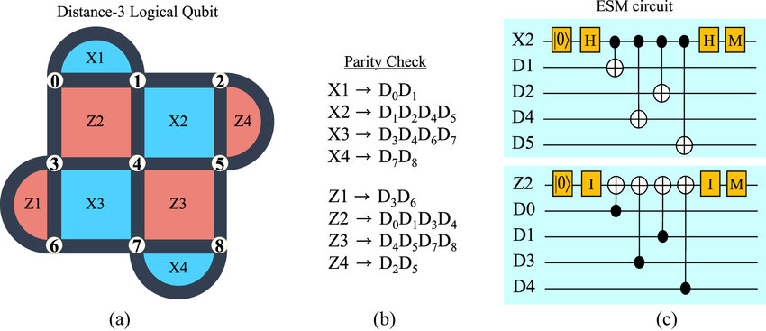
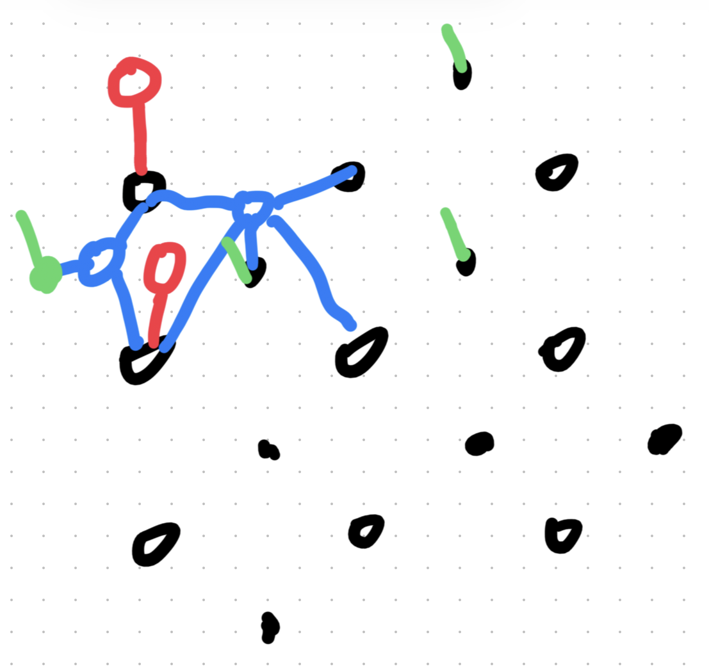

---
categories:
- Quantum Error Correction
- Tensor Network
date: 2026-01-07
description: 'Notes on the application of Tensor Networks in quantum error correction.'
format:
  html:
    number-sections: true
    toc: true
lang: en    
title: 'BP-OSD Decoding'
---

# BP Algorithm

The [MLD algorithm](/PMdecoder.qmd) has the following shortcomings:

1. Knowing the probability of each error occurring a priori, as in MLD, is not a natural assumption.
2. The occurrence of each error is mutually unrelated. In quantum error correction codes, this means assuming two Pauli errors are independent.
3. MLD remains NP-hard for arbitrary error correction codes.

The Belief Propagation algorithm is an approximate decoding algorithm that performs approximate decoding by iteratively updating the probabilities of each vertex.

# Decoding Problems and Surface code
In the real system, we have the following realization of d=3 rotated surface code graph:

{#fig-rotatedd3 width=50% fig-align="center"}

Such a quantum circuit can be realized in python code using stim package:

```python
    if task not in {"x", "z"}:
        raise ValueError("task must be 'x' or 'z'")
    if not 0.0 < p < 1.0:
        raise ValueError("p must be in (0, 1)")

    name = f"surface_code:rotated_memory_{task}"
    return stim.Circuit.generated(
        name,
        distance=distance,
        rounds=rounds,
        after_clifford_depolarization=p,
        before_round_data_depolarization=p,
        before_measure_flip_probability=p,
        after_reset_flip_probability=p,
    )
```

Consider the simplest case where each qubits takes a storage Pauli error $X,Y,Z$, this trigger the detectors in the circuit.
The stim package automatically trace how those Pauli errors propagate through the circuit and trigger each detectors. Then it recorded the syndrome in a .dem file, with form:

```python
error(0.01911873511075362) D0 D1
[...]
detector(0, 4, 0) D0
```
The first line means that occurence of certain error is 01911873511075362, and the detectors D0 and D1 are triggered by this error.
This .dem data is use as piroi knowledge for the BP decoder.


# UAI and BPs

After generating the .dem file, we can reform it to generate the .uai file. It traces the tensor network of the probability.

{#fig-rotatedd3 width=50% fig-align="center"}

```python
MARKOV
24
2 2 2 2 2 2 2 2 2 2 2 2 2 2 2 2 2 2 2 2 2 2 2 2
286
1 0
2 0 1
2 0 8
```

## The Message Passing Mechanism

Belief Propagation, often called the *sum-product algorithm*, is an iterative message-passing algorithm on a factor graph.


::: {.callout-tip}
### Goal
The objective is to compute the **marginal probability** for each bit $j$:
$$P_1(e_j) = P(e_j = 1 | \mathbf{s})$$
Given that $\mathbf{s} = H \cdot \mathbf{e}$ is the syndrome of the error. This "soft decision" indicates how likely a specific bit is to be flipped.
:::

### Log-Likelihood Ratios (LLR)
To ensure numerical stability during computation, BP operates using **Log-Likelihood Ratios** rather than raw probabilities.

$$\text{LLR}(e_j) = \log \left( \frac{P(e_j = 0)}{P(e_j = 1)} \right)$$

* **LLR > 0:** $e_j = 0$ is more likely (the bit is probably correct).
* **LLR < 0:** $e_j = 1$ is more likely (the bit is probably flipped).
* **|LLR|:** The magnitude indicates the confidence level of the decision.

For a channel with error probability $p$, the initial **channel LLR** is:
$$p_l = \frac{\log(1 - p)}{p}$$

## BP Algorithm: Step-by-Step

The algorithm iterates through specific phases to update beliefs.

### Step 1: Initialization
Before any message passing occurs, the only information available is the channel prior. We initialize all messages from data nodes ($v_j$) to parity nodes ($u_i$) with the channel LLR.

$$m_{v_j \to u_i} := p_l \quad \text{for all edges } (v_j, u_i)$$

### Step 2: Parity-to-Data Messages
Each parity node $u_i$ sends a message to each connected data node $v_j$. This step enforces the parity constraints (XOR logic).


$$m_{u_i \to v_j} = (-1)^{s_i} \cdot \alpha \cdot \prod_{v'_j \in V(u_i) \setminus v_j} \text{sign}(m_{v'_j \to u_i}) \cdot \min_{v'_j \in V(u_i) \setminus v_j} |m_{v'_j \to u_i}|$$

**Where:**
* $s_i$ is the $i$-th syndrome bit.
* $\alpha = 1 - 2^{-t}$ is a damping factor at iteration $t$ to aid convergence.
* The message excludes the target node $v_j$ (extrinsic information).

### Step 3: Data-to-Parity Messages
Each data node $v_j$ collects evidence from the channel and its neighboring parity checks to send an update back to the parity nodes.


$$m_{v_j \to u_i} = p_l + \sum_{u'_i \in U(v_j) \setminus u_i} m_{u'_i \to v_j}$$

**Intuition:** Why exclude $u_i$? This prevents "echo effects." If $v_j$ simply returned the information $u_i$ just gave it, positive feedback loops would artificially inflate confidence without adding new evidence.

### Step 4: Compute Soft Decisions
We calculate the total posterior belief for bit $j$ by summing the channel prior and *all* incoming messages (no exclusion).

$$P_1(e_j) = p_l + \sum_{u_i \in U(v_j)} m_{u_i \to v_j}$$

### Step 5: Make Hard Decisions
We convert the soft LLR beliefs into binary estimates.

$$ e_j^{\text{BP}} = \begin{cases} 
1 & \text{if } P_1(e_j) < 0 \quad (\text{likely flipped}) \\
0 & \text{otherwise} \quad (\text{likely correct})
\end{cases} $$

### Step 6: Convergence Check
Finally, we verify if the estimated error vector satisfies the syndrome equation.

$$H \cdot \mathbf{e}^{\text{BP}} = \mathbf{s} \quad ?$$

* **If Yes:** The algorithm has converged; return $\mathbf{e}^{\text{BP}}$.
* **If No:** Return to Step 2 and repeat until the maximum iteration count is reached.


## 4. Detailed Code Implementation

Below is the Python implementation of the core logic. The code has been modularized to separately handle model loading, BP inference, and OSD post-processing.

### 4.1 Environment Preparation and Data Loading

First, we need to load the error physical model (DEM) and the test data.

```python
import numpy as np
from bpdecoderplus.pytorch_bp import (
    read_model_file, BeliefPropagation,
    belief_propagate, compute_marginals, apply_evidence
)
from bpdecoderplus.dem import load_dem, build_parity_check_matrix
from bpdecoderplus.syndrome import load_syndrome_database
from bpdecoderplus.osd import OSDDecoder

# 1. Load factor graph model (.uai) and error model (.dem)
model = read_model_file('datasets/sc_d3_r3_p0010_z.uai')
dem = load_dem('datasets/sc_d3_r3_p0010_z.dem')

# 2. Load pre-generated Syndrome dataset
syndromes, observables, _ = load_syndrome_database('datasets/sc_d3_r3_p0010_z.npz')

print(f"Test set size: {len(syndromes)}")

```

### 4.2 Initialize Decoder

Here, we construct the parity check matrix  and initialize the BP and OSD decoder instances.

```python
# Initialize BP decoder
bp = BeliefPropagation(model)

# Construct parity check matrix H, which is the basis for OSD equation solving
H, priors, obs_flip = build_parity_check_matrix(dem)

# Initialize OSD decoder
# Note: This is the Robust OSD module we rewrote specifically to solve the "rank deficiency" problem
osd = OSDDecoder(H)

print(f"Parity check matrix shape: {H.shape}")

```

### 4.3 Decoding Loop (The Loop)

This is the core of the entire program. For each test sample, we sequentially execute BP and OSD.

```python
predictions = []
# Iterate through the first 1000 samples
for idx, syndrome in enumerate(syndromes[:1000]):
    
    # --- Step 1: Run BP (Detective Phase) ---
    # Inject Syndrome into the factor graph
    evidence = {i+1: int(syndrome[i]) for i in range(len(syndrome))}
    bp_ev = apply_evidence(bp, evidence)
    
    # Iteratively calculate marginal probabilities (Marginals)
    state, _ = belief_propagate(bp_ev, max_iter=20, tol=1e-6, damping=0.2)
    marginals = compute_marginals(state, bp_ev)
    
    # --- Step 2: Run OSD (Judge Phase) ---
    # Determine the index range of error variables
    num_detectors = len(syndromes[0])
    error_var_start = num_detectors + 1

    # Call OSD solver
    # osd.solve will sort columns based on marginals and solve the linear equation system
    # osd_order=0 indicates the basic OSD-0 algorithm
    estimated_errors = osd.solve(syndrome, marginals, error_var_start, osd_order=0)
    
    # --- Step 3: Verification ---
    # Check if a logical error occurred
    predictions.append(np.dot(estimated_errors, obs_flip) % 2)

# Calculate accuracy
logical_error_rate = np.mean(np.array(predictions) != observables[:1000])
print(f"Logical error rate: {logical_error_rate:.4f}")
print(f"Decoder accuracy: {(1 - logical_error_rate):.4f}")

```

## 5. Current Progress and Next Steps

### Current Progress

```python
(bpdecoderplus) chance@chancemacbook-air BPDecoderPlus % /Users/chance/BPdecoder/BPDecoderPlus/.venv/bin/python /Users/chance/BPdecoder/BPDecoderPlus/run_demo.py
Loaded 1000 syndromes
Syndrome shape: (1000, 24)
Observable shape: (1000,)
H matrix shape: (24, 286)
Number of error mechanisms: 286

Evaluating on 1000 test samples...
  Processed 0/1000 samples...
  Processed 100/1000 samples...
  Processed 200/1000 samples...
  Processed 300/1000 samples...
  Processed 400/1000 samples...
  Processed 500/1000 samples...
  Processed 600/1000 samples...
  Processed 700/1000 samples...
  Processed 800/1000 samples...
  Processed 900/1000 samples...

Logical error rate: 0.1930
Decoder accuracy: 0.8070
(bpdecoderplus) chance@chancemacbook-air BPDecoderPlus % 
```


* **Code Operational**: Successfully ran the `datasets/sc_d3_r3_p0010_z` dataset.
* **Module Integration**: Achieved seamless integration between `pytorch_bp` (for probability inference) and `osd` (for linear algebra solving).
* **Deprecated Hard Decision**: The commented-out parts of the code show that we have abandoned the simple `if p > 0.5` hard decision in favor of the mathematically more rigorous `osd.solve`.

### Next Steps

Currently, the code uses `osd_order=0` (i.e., the OSD-0 algorithm). Experiments show that for  Surface Code, there is still room for improvement using only OSD-0.

The focus of the upcoming work is:

1. **Enable OSD-CS**: Increase `osd_order` (e.g., to 10 or 15) to enable **Combination Sweep**. This will allow the decoder to perform "trial and error" in boundary cases where BP is uncertain, thereby significantly reducing the logical error rate.
2. **Benchmark on GPUs**.
3. **Extensions:** Combining BP+OSD decoder with MWPM decoders? A better choice of error type? A rigrous proof for performance on long-loop LDPC-code? A q-LDPC code that ensures a rigrous decoder?

