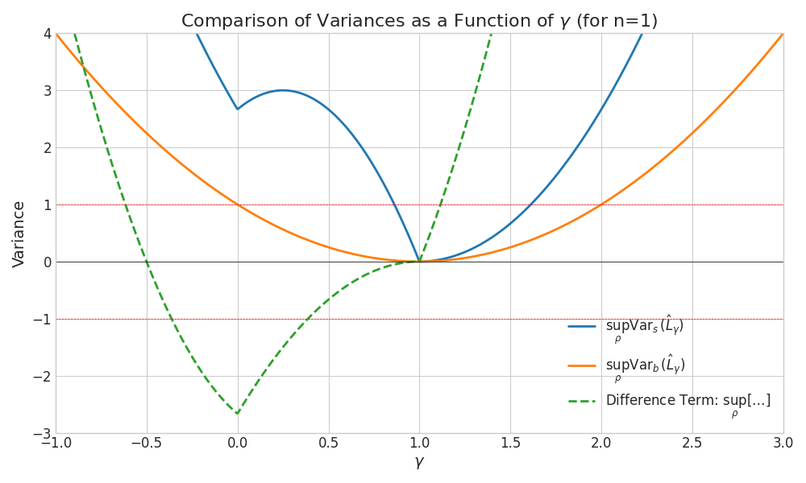

---
categories:
- Readings
date: '2026-01-19'
lang: en
title: 3-design Multi-copy Local Shadow
bibliography: refs.bib
---

# Local k-copy 3-design shadow.

Now we consider the case that we can put $\rho^{\otimes k}$ in quantum
memory and then implement randomized k-qubits Clifford gate
$U = {U_i}^{\otimes n}$ with $U_i \in \mathbf{D}_{3}(2^k)$ the
$k$-qubits gate and forms $3$-design. After this, we measured each qubit
in the computational basis.

::: {#lem-LC-shadow-kcopy .callout-important icon="false"}
## (Local k-Copy Shadow Variance)
In the case of local k-copy randomized measurements on $\rho^{\otimes k}$, let the
observable $O^{(k)}$ acting on $n\cdot k$ qubits have decomposition
$O^{(k)} = \sum_{W} \alpha_{W} W$, where $W = \bigotimes_{i=1}^n W_i$
and $W_i \in \{I,X,Y,Z\}^{\otimes k}$. Denoting $\mathcal{C}(W)$ as the
set of $k$-qubit Pauli operator that commute with $W$ and
$\delta_{e,S} = 1$ iff $e\in S$, we define a function
$R:\mathcal{P}_k^{\otimes n} \to \mathbb{R}$ as 
$$
\begin{align*}
        R(W,W') &= \prod_{i = 1}^n r(W_i,W'_i), r(W_i,W'_i) \\
        &:= \begin{cases}
            1 &\text{if~}W_i = \mathbb{I}_k \text{~or~}W'_i = \mathbb{I}_k ,\\
            (2^k+1) \cdot \frac{2^{k-1}\delta_{W_i,W'_i} +\delta_{W_i, \mathcal{C}(W'_i)\backslash \mathbb{I}_k } }{2^{k-1}+1} &\text{if~}W_i \neq \mathbb{I}_k \text{~and~} W'_i \neq \mathbb{I}_k .
        \end{cases}
\end{align*}
$$
 we have
$\langle (\hat{o}^{(k)})^2 \rangle_{\rho} =\text{tr} \left(\rho^{\otimes k} \cdot \mathbf{V}(O^{(k)}) \right)$,
where
$\mathbf{V}(O^{(k)}) := \sum_{W,W'}\alpha_W \alpha_{W'} R(W,W')W W'$.
Specifically, if we take a local operator
$O^{(k)} = \bigotimes_{i = 1}^n \left(\sum_{W_i \in \mathcal{P}_k}\alpha_{W_i} W_i\right)$,
we have
$\mathbf{V}(O^{(k)}) :=\bigotimes_{i = 1}^n  \sum_{W_i,W_i'}\alpha_{W_i} \alpha_{W_i'} r(W_i,W_i')W_i W_i'$.
:::

::: {.callout-note collapse="true"}
## Proof (Click to expand)

*Proof.* By
Lemma (onsite_2design)
$\mathcal{D}_{1/(2^k + 1)}^{-1}(\cdot) = (2^k + 1)(\cdot) - \text{tr}(\cdot) \mathbb{I}_k$
constitute an unbiased estimator of $\rho^{\otimes k}$ through the
transformation
$\hat{\rho}^{\otimes k} =\mathcal{M}^{-1}(U^\dagger \ket{\mathbf r}\!\bra{\mathbf r} U)=\bigotimes_{i =1}^n\left((2^k + 1)U_i^{\dagger} \ket{\mathbf{r}_{i}}\bra{\mathbf{r}_{i}} U_i - \mathbb{I}_k\right).$
The second moment is given by
$\langle (\hat{o}^{(2)})^2 \rangle_{\rho} =\mathbb{E}_{U \sim \mathbf{D}_3(2^k)^{\otimes n}}\sum_{\mathbf r}\bra{\mathbf r}U \rho^{\otimes k} U^\dagger \ket{\mathbf{r}} \bra{\mathbf r}U\mathcal{M}^{-1}(O^{(k)}) U^\dagger\ket{\mathbf r}^2$.
Similar to the proof in
Lemma (LC_shadow)
the Pauli product basis $W_i \in \{I,X,Y,Z\}^{\otimes k}$ that supports
on those k qubits located at site $i$. By denoting $W = W_1\cdots W_n$,
we have $O^{(k)} = \sum_{W} \alpha_{W} W$. According to
Lemma (onsite_2design)
$\mathcal{M}^{-1}$ acts locally as
$\mathcal{M}_i^{-1}(W_i) = g(W_i) W_i$, where the scaling factor
$g(W_i)$ is determined by
$g(W_i) = \begin{cases} (2^k+1) & \text{if~} W_i \neq \mathbb{I}_k \\ 1 &\text{if~} W_i = \mathbb{I}_k \end{cases}.$
Use this decomposition and again supposed
$\rho^{\otimes k} = \sum_{s} \beta_s \bigotimes_{i=1}^n \rho_i^{(s)}$,
where $\rho_i^{(s)} \in \mathcal{D}(\mathcal{H}_k)$, the result involves
averaging over the k-qubit 3-design $U_i \sim \mathbf{D}_3(2^k)$ as:
$$
\begin{align*}
        \langle (\hat{o}^{(k)})^2 \rangle_{\rho} &= \sum_{W,W'}\alpha_{W}\alpha_{W'}\sum_{s}\beta_s\prod_{i = 1}^n g(W_i)g(W'_i)\sum_{\mathbf{r}_i \in \{0,1\}^k} \left[({\rho}^{(s)}_i \otimes W_i \otimes W'_i) \cdot \mathbb{E}_{U_i} U_i^{\otimes 3}\ket{\mathbf{r}_i}\!\bra{\mathbf{r}_i}^{\otimes 3}U_i^{\otimes 3,\dagger}\right] \\
        &= \sum_{W,W'}\alpha_{W}\alpha_{W'}\sum_s \beta_s\prod_{i = 1}^n 2^k p \cdot g(W_i)g({W'}_i) \Bigl[ \text{tr}(W_i)\text{tr}(W'_i)\text{tr}({\rho}^{(s)}_i) + \text{tr}({\rho}^{(s)}_i W_i)\text{tr}(W'_i) \notag\\
        & \qquad\qquad\qquad + \text{tr}(W_i)\text{tr}({\rho}^{(s)}_i W'_i)+\text{tr}({\rho}^{(s)}_i)\text{tr}(W_iW'_i) + \text{tr}(W_i {\rho}^{(s)}_i W'_i) + \text{tr}(W'_i {\rho}^{(s)}_i W_i) \Bigr].
\end{align*}
$$

Here we use the fact that the term $\ket{E} :=U_i\ket{\mathbf{r}_i}$ is
average over the 3-design states, yielding terms based on the formula
$\mathbb{E} [E^{\otimes 3}] ={d^{-1}(d+1)^{-1}(d+2)^{-1}} \sum_{\pi \in S_3} \mathbb{P}_{\pi}^{(d)}$
according to
Lemma (state_trajectory)
site is $p = 1/(2^k \cdot (2^k+1) \cdot (2^k+2))$. We evaluate the
expression by considering terms for each site $i$, analogous to the
single-copy proof of
Lemma (LC_shadow)
$$\begin{align*}
        \langle (\hat{o}^{(2)})^2 \rangle_{\rho} &= 
        \sum_{W,W'}\alpha_{W}\alpha_{W'}\sum_{s}\beta_s\prod_{i = 1}^n 2^k p \cdot \begin{cases}
         1\cdot 1\cdot [2^{2k}+3\cdot 2^k+2]\text{tr}{\rho}^{(s)}_i  &\text{if~} W_i=W_i' = \mathbb I_k,\\
         1 \cdot (2^k+1) \cdot[2^k + 2]\cdot \text{tr}({\rho}^{(s)}_i W'_i)&\text{if~} W_i = \mathbb I_k \neq W'_i,\\
         (2^k+1) \cdot 1 \cdot[2^k + 2]\cdot \text{tr}({\rho}^{(s)}_i W_i)&\text{if~} W'_i = \mathbb I_k \neq W_i,\\
         (2^k+1)^2 \cdot[2^k\delta_{W_i, W'_i}\text{tr}{\rho}^{(s)}_i  + \text{tr}({\rho}^{(s)}_i\{W_i,W_i'\})]&\text{if~} W_i, W'_i \neq \mathbb I_k.
     \end{cases}\\
    %  &=\sum_{W,W'}\alpha_{W}\alpha_{W'}\sum_{s}\beta_s\prod_{i = 1}^n \begin{cases}
    %     \text{tr}{\rho}^{(s)}_i  &\text{if~} W_i=W_i' = \mathbb I_k,\\
    %      \text{tr}({\rho}^{(s)}_i W'_i)&\text{if~} W_i = \mathbb I_k\neq W'_i,\\
    %      \text{tr}({\rho}^{(s)}_i W_i)&\text{if~} W'_i = \mathbb I_k\neq W_i,\\
    %     \frac{2^k+1}{2^k+2} \cdot\text{tr}\left[(2^k\delta_{W_i, W'_i}\mathbb{I}_k  +2\delta_{W_i, \mathcal{C}(W'_i)\backslash \mathbb{I}_k}  W_iW_i'){\rho}^{(s)}_i\right]&\text{if~} W_i, W'_i \neq \mathbb I_k.
    %  \end{cases}\\
     &= \sum_{W,W'}\alpha_{W}\alpha_{W'}\cdot \sum_{s}\beta_s\prod_{i = 1}^n \begin{cases}
        \text{tr}({\rho}^{(s)}_i W_iW'_i)  &\text{if~} W_i=W_i' = \mathbb I_k,\\
         \text{tr}({\rho}^{(s)}_i W_i W'_i)&\text{if~} W_i = \mathbb I_k\neq W'_i,\\
         \text{tr}({\rho}^{(s)}_i W_i W'_i)&\text{if~} W'_i = \mathbb I_k\neq W_i,\\
         \frac{2^k+1}{2^k+2} \cdot\text{tr}\left[{\rho}^{(s)}_i(2^k\delta_{W_i, W'_i}+2\delta_{W_i, \mathcal{C}(W'_i)\backslash \mathbb{I}_k})W_iW_i'\right]&\text{if~} W_i, W'_i \neq \mathbb I_k.
     \end{cases}\\
     &=\text{tr}\left( \rho^{\otimes k}\cdot \sum_{W,W' \in \mathcal{P}_k^{\otimes n}} \alpha_{W}\alpha_{W'} R(W,W') W W'\right).
\end{align*}$$ To prove the second equality, we first defined
$\mathcal{C}(W)$ as the set of k-qubit Pauli operator that commute with
$W$ and $\delta_{e,S} = 1$ iff $e\in S$, otherwise $\delta(e,S) = 0$.
Then we use the fact that $$\begin{align*}
        \forall W_i, W'_i \neq \mathbb I_k, \text{tr}({\rho}^{(s)}_i\{W_i,W_i'\}) = \begin{cases}0 \!\!\!&\text{if~} W'_i \notin \mathcal{C}(W_i)\backslash \mathbb{I}_k\\2\text{tr}(\tilde{\rho}^{(s)}_i W_iW'_i)  \!\!\!&\text{if~} W_i \in \mathcal{C}(W'_i)\backslash \mathbb{I}_k \end{cases} = 2\delta_{W_i, \mathcal{C}(W'_i)\backslash \mathbb{I}_k} \text{tr}(\tilde{\rho}^{(s)}_i W_iW'_i),
\end{align*}$$ In the last equality, we use the definition
$$\begin{align*}
    R(W,W') &= \prod_{i = 1}^n r(W_i,W'_i),  r(W_i,W'_i) 
    &:= \begin{cases}
        1 &\text{if~}W_i = \mathbb{I}_k \text{~or~}W'_i = \mathbb{I}_k ,\\
        (2^k+1) \cdot \frac{2^{k-1}\delta_{W_i,W'_i} +\delta_{W_i, \mathcal{C}(W'_i)\backslash \mathbb{I}_k } }{2^{k-1}+1} &\text{if~}W_i \neq \mathbb{I}_k \text{~and~} W'_i \neq \mathbb{I}_k .
    \end{cases}
\end{align*}$$ ◻
:::

The inherient difference between the single-copy local Clifford strategy
contained in the term $\delta_{W_i, \mathcal{C}(W'_i)}$. In the
single-copy case, the center of $P_i \in \{X,Y,Z\}$ satisfied
$\mathcal{C}(P_i) = \{P_i, \mathbb{I}\}$. However, for example, for the
two-qubit Pauli operators, more terms involved. We denote the $n$-qubit
Pauli operators as
$\sigma_{\mathbf{r}} = \bigotimes_{i=1}^n \sigma_{{r}_{x,i},{r}_{z,i}} \in \mathcal{P}_n$
with
$\mathbf{r} = (\mathbf{r}_x = ({r}_{x,1},\cdots,{r}_{x,n}),\mathbf{r}_z = ({r}_{z,1},\cdots,{r}_{z,n})) \in (\mathbb{F}_2^n)^2$
and
$\{\sigma_{00},\sigma_{01},\sigma_{10},\sigma_{11}\} = \{\mathbb{I}, Z,X,Y = iXZ\}$.
We denote $a \oplus b = a + b \mathrm{~mod~}2 = a + b - 2a\cdot b$ and
$\mathbf{a} \odot \mathbf{b} = (a_1\cdot b_1,\cdots,a_n\cdot b_n)$ with
$a,b \in \{0,1\}$. In the following, we follow the Pauli multiplication
rule as proved below 
$$
\begin{align*}
         \sigma_{\mathbf{s}}\sigma_{\mathbf{s}'} &= \bigotimes_{j = 1}^n i^{s_{x,j} s_{z,j}} X^{s_{x,j}}Z^{s_{z,j}} \cdot i^{s'_{x,j} s'_{z,j}} X^{s'_{x,j}}Z^{s'_{z,j}} \\
         &=  \bigotimes_{j = 1}^n X^{s_{x,j}+s_{x,j}'}Z^{s_{z,j}+s_{z,j}'} (-1)^{s_{z,j}\cdot s_{x,j}'} \cdot i^{s_{x,j}s_{z,j}+s_{x,j}'s_{z,j}'} \notag \\
         &= \sigma_{\mathbf{s}\oplus \mathbf{s}'} (-i)^{(\mathbf{s}_x+ \mathbf{s}_x'-2\mathbf{s}_x\odot\mathbf{s}_x')(\mathbf{s}_z+\mathbf{s}_z' - 2\mathbf{s}_z\odot\mathbf{s}_z')} i^{\mathbf{s}_x\mathbf{s}_z + \mathbf{s}_x'\mathbf{s}_z'}(i)^{2\mathbf{s}_z\mathbf{s}_x'} \\
         &=i^{\mathbf{s}_x'\mathbf{s}_z - \mathbf{s}_z'\mathbf{s}_x} (-1)^{(\mathbf{s}_x + \mathbf{s}_x') \cdot (\mathbf{s}_z \odot \mathbf{s}_z') + (\mathbf{s}_z + \mathbf{s}_z') \cdot (\mathbf{s}_x \odot \mathbf{s}_x')}\sigma_{\mathbf{s}+ \mathbf{s}'} := i^{\mathbf{s}' J \mathbf{s}} (-1)^{d(\mathbf{s},\mathbf{s}')}\sigma_{\mathbf{s}+ \mathbf{s}'} .
\end{align*}
$$
Defined
$[\mathbf{s}', \mathbf{s}]:= \mathbf{s}_x'\cdot \mathbf{s}_z - \mathbf{s}_z'\cdot \mathbf{s}_x \text{~mod~} 2$
as the binary symplectic product. Use this rule, we calculate
$\sigma_{\mathbf{s}}\cdot \sigma_{\mathbf{s}'}=i^{2\mathbf{s}_x'\cdot \mathbf{s}_z - 2\mathbf{s}_z'\cdot \mathbf{s}_x }  (\sigma_{\mathbf{s}'} \cdot \sigma_{\mathbf{s}}) \Rightarrow [\mathbf{s}, \mathbf{s}'] = 0,$
and show that
$\mathcal{C}(\sigma_{\mathbf{u}} )\backslash \mathbb{I}_k= \{\sigma_{\mathbf{v}}|\mathbf{v}\in \mathbb{F}_2^k,\mathbf{v}\neq \mathbf{0},[\mathbf{v},\mathbf{u}] = 0\}.$
This means that
$\delta_{\sigma_{\mathbf{s},\mathcal{C}(\sigma_{\mathbf{s}'} )\backslash \mathbb{I}_k}} = \delta_{\mathbf{s}, \{\mathbf{v}\in \mathbb{F}_2^k|\mathbf{v}\neq \mathbf{0},[\mathbf{v},\mathbf{s}'] = 0\}} = {\left(1 + (-1)^{[\mathbf{s},\mathbf{s}']}\right)}/{2}$
and 
$$
\begin{align*}
&r({\mathbf{s}},{\mathbf{s}'}):=r(\sigma_{\mathbf{s}},\sigma_{\mathbf{s}'}) := \begin{cases}
            1 &\text{if~}\mathbf{s} = \mathbf{0}\text{~or~}\mathbf{s}' = \mathbf{0} ,\\
            \frac{2^k+1}{2^{k}+2} \cdot \left[2^{k}\delta_{\mathbf{s},\mathbf{s}'} +1+ (-1)^{[\mathbf{s}',\mathbf{s}]}\right]  &\text{if~}\mathbf{s} \neq \mathbf{0}\text{~and~}\mathbf{s}' \neq \mathbf{0} .
        \end{cases}
\end{align*}
$$

A generalization of the variance operator $\mathbf{V}(O^{(k)})$ is to
applied it to two operators $O_\alpha,O_\beta$, as defined below:

::: {#def-cov-oper .callout-note icon="false"}
## Definition (Covariance Operator)
Given two operators with decomposition
$O_\alpha = \sum_{W} \alpha_{W} W, O_\beta = \sum_{W} \beta_{W} W$ with
$W \in \{\mathbb{I},X,Y,Z\}^{\otimes k}$, the we defined the covariance
operator as $$\begin{align*}
        \mathbf{V}(O_\alpha,O_\beta) = \sum_{W,W'} \alpha_{W} \beta_{W'} R(W,W') WW',
\end{align*}$$ where $R(W,W')$ is defined in
@lem-LC-shadow-kcopy
:::

The covariance operator is important due to the Lemma below

::: {#lem-covariance-decomp .callout-important icon="false"}
## (Covariance Decomposition)
Given a k-copy operator
$O = \lambda_{\alpha} O_{\alpha} + \lambda_{\beta} O_{\beta}$, we have
$$\begin{align*}
        \mathbf{V}(O,O) = \lambda_{\alpha}^2 \mathbf{V}(O_{\alpha},O_{\alpha}) + 2 \lambda_{\alpha} \lambda_{\beta} \mathbf{V}(O_{\alpha},O_{\beta}) + \lambda_{\beta}^2 \mathbf{V}(O_{\beta},O_{\beta}).
\end{align*}$$
:::

::: {.callout-note collapse="true"}
## Proof (Click to expand)

Supposed the decomposition
$O_\alpha = \sum_{W} \alpha_{W} W, O_\beta = \sum_{W} \beta_{W} W$, we
noted that 
$$
\begin{align*}
        \mathbf{V}(O,O) &=  \sum_{W,W'} (\lambda_{\alpha}\alpha_{W} + \lambda_{\beta} \beta_{W})(\lambda_{\alpha}\alpha_{W'} + \lambda_{\beta} \beta_{W'}) R(W,W') WW',\\
        &=  \sum_{W,W'} \lambda^2_{\alpha}\alpha_{W}\alpha_{W'}R(W,W') WW' +\sum_{W,W'}  \lambda_{\alpha}\lambda_{\beta} \alpha_{W}\beta_{W'}R(W,W') WW' \notag\\
        & +\sum_{W,W'}  \lambda_{\beta} \lambda_{\alpha}\beta_{W}\alpha_{W'}R(W,W') WW' + \sum_{W,W'} \lambda^2_{\beta}\beta_{W}\beta_{W'}R(W,W') WW'\\
        &=\lambda_{\alpha}^2 \mathbf{V}(O_{\alpha},O_{\alpha}) + 2 \lambda_{\alpha} \lambda_{\beta} \mathbf{V}(O_{\alpha},O_{\beta}) + \lambda_{\beta}^2 \mathbf{V}(O_{\beta},O_{\beta}).
\end{align*}
$$
 Here at the last line, we use @def-cov-oper and the fact that $R(W,W') = R(W',W)$. ◻
:::

### Application to $\text{tr}(O \rho^k)$.

A critical application of this local multi-copy shadow is to use it to
estimate the non-linear term $\text{tr}(O \rho^k)$ for arbitrary
operator $O \in \text{Herm}(\mathcal{H}_n)$. In the case of $k  =2$,
$\text{tr}((O \otimes \mathbb{I}_n) \text{SWAP}^{\otimes n}\cdot (\rho \otimes \rho))$
is an unbiased estimator for $\text{tr}(O \rho^2)$. If we decomposed the
operator $O$ on the Pauli basis, it turns out
$(O \otimes \mathbb{I}_n)\text{SWAP}^{\otimes n} = \sum_{\mathbf{r} \in \mathbb{F}_2^{2n}} (\sigma_{\mathbf{r}} \otimes  \mathbb{I}_n)\text{SWAP}^{\otimes n}:= \sum_{\mathbf{r} \in \mathbb{F}_2^{2n}} O_{\mathbf{r}}$
Here below we use
@lem-LC-shadow-kcopy
of $O_{\mathbf{r}}$ explicitly.

::: {#lem-covar-pauli .callout-important icon="false"}
## (Covariance Operator of Non-local Pauli Shadow)
For the $k=2$ local shadow, consider the observable $O_{\mathbf{r}}= (\sigma_{\mathbf{r}} \otimes \mathbb{I}_n) \cdot \text{SWAP}^{\otimes n}$ where $\sigma_{\mathbf{r}} = \bigotimes_{j=1}^n \sigma_{\mathbf{r}_j}$ is an $n$-qubit Pauli operator with $\mathbf{r} = (\mathbf{r}_1, \ldots, \mathbf{r}_n) \in (\mathbb{F}_2^2)^n$. Let $\text{wt}(\sigma_{\mathbf{r}})$ denote the Pauli weight (number of non-identity single-qubit factors). Then the covariance operator factorizes as $\mathbf{V}(O_{\mathbf{r}}, O_{\mathbf{r}'}) = \bigotimes_{j = 1}^n v(\mathbf{r}_j, \mathbf{r}_j')$ with
$$
    \begin{align}
        v(\mathbf{r}_j, \mathbf{r}_j') = 
        \left\{\begin{aligned}
            &\frac{5}{6}\left(\sigma_{\mathbf{r}_j}\otimes \sigma_{\mathbf{r}'_j} +\sigma_{\mathbf{r}'_j}\otimes \sigma_{\mathbf{r}_j} \right)\text{~if~} \mathbf{r}_j, \mathbf{r}_j'  \neq \mathbf{0},\\
            &\frac{11\mathbb{I}_4}{3} \hspace{5em}\text{~if~} \mathbf{r}_j=\mathbf{r}_j'= \mathbf{0}, \\
            &\left(\frac{1}{2}\mathbb{I}_2 \otimes \sigma_{\mathbf{r}_j}+ \frac{5}{6}\sigma_{\mathbf{r}_j}\otimes\mathbb{I}_2\right) \text{~if~} \mathbf{r}'_j = \mathbf{0},  \mathbf{r}_j\neq \mathbf{0},\\
            &\left(\frac{1}{2}\mathbb{I}_2 \otimes \sigma_{\mathbf{r}'_j} + \frac{5}{6}\sigma_{\mathbf{r}'_j}\otimes\mathbb{I}_2\right)\text{~if~} \mathbf{r}_j = \mathbf{0},  \mathbf{r}'_j\neq \mathbf{0}.
        \end{aligned}\right.
    \end{align}
$$
In particular, $\mathbf{V}(O_{\mathbf{r}},O_{\mathbf{r}}) =  \left({11}/{3}\right)^{n}\cdot \left({5}/{11}\right)^{\text{wt}(\sigma_{\mathbf{r}})} \sigma_{\mathbf{r}} \otimes \sigma_{\mathbf{r}}.$
:::

::: {.callout-note collapse="true"}
## Proof (Click to expand)

**Step 1: Pauli expansion of the observable.**
We express the observable using the identity $\text{SWAP} = 2^{-1}\sum_{\mathbf{p} \in \mathbb{F}_2^{2}} \sigma_{\mathbf{p}} \otimes \sigma_{\mathbf{p}}$, which extends to $\text{SWAP}^{\otimes n} = 2^{-n}\sum_{\mathbf{p} \in (\mathbb{F}_2^{2})^n} \sigma_{\mathbf{p}} \otimes \sigma_{\mathbf{p}}$. This gives the Pauli decomposition:
$$
\begin{align}
    O_{\mathbf{r}}=  2^{-n}\sum_{\mathbf{p} \in (\mathbb{F}_2^{2})^n} \sigma_{\mathbf{r}}\sigma_{\mathbf{p}}\otimes \sigma_{\mathbf{p}},\quad O_{\mathbf{r}'}=  2^{-n}\sum_{\mathbf{p}' \in (\mathbb{F}_2^{2})^n} \sigma_{\mathbf{r}'}\sigma_{\mathbf{p}'}\otimes \sigma_{\mathbf{p}'}.
\end{align}
$$
The operators $O_{\mathbf{r}}, O_{\mathbf{r}'}$ admit a local decomposition with $W_j \propto \sigma_{\mathbf{r}_j + \mathbf{p}_j} \otimes \sigma_{\mathbf{p}_j}$ and $W'_j \propto \sigma_{\mathbf{r}'_j + \mathbf{p}'_j} \otimes \sigma_{\mathbf{p}'_j}$. Below we suppress the site index $j$ for clarity.

**Step 2: Applying the covariance operator definition.**
By @def-cov-oper, the covariance operator involves the rescaling function $r(W,W')$ from @lem-LC-shadow-kcopy. For $k=2$, when both $W_j, W'_j \neq \mathbb{I}_2$:
$$
r(W_j,W'_j) = 5 \cdot \frac{2\delta_{W_j,W'_j} + \delta_{W_j, \mathcal{C}(W'_j)\setminus \mathbb{I}_2}}{3}.
$$
For Pauli operators, two non-identity Paulis either commute ($[\mathbf{a},\mathbf{b}] = 0$) or anticommute ($[\mathbf{a},\mathbf{b}] = 1$), where $[\mathbf{a},\mathbf{b}] := a_1 b_2 + a_2 b_1 \mod 2$ is the symplectic inner product. This gives:
$$
r(\sigma_\mathbf{a} \otimes \sigma_\mathbf{b}, \sigma_\mathbf{c} \otimes \sigma_\mathbf{d}) = \frac{5}{3}\left[2\delta_{\mathbf{a},\mathbf{c}}\delta_{\mathbf{b},\mathbf{d}} + \frac{1 + (-1)^{[\mathbf{a},\mathbf{c}]+[\mathbf{b},\mathbf{d}]}}{2}\right], \quad \text{if } \mathbf{a}\mathbf{b}, \mathbf{c}\mathbf{d} \neq \mathbf{00}.
$$

Using Pauli commutation $\sigma^{\otimes 2}_{\mathbf{p}}\sigma^{\otimes 2}_{\mathbf{p}'} = (-1)^{[\mathbf{p},\mathbf{p}']}\sigma^{\otimes 2}_{\mathbf{p}+\mathbf{p}'}$ (up to phase), the covariance operator factorizes:
$$
  \begin{align*}
        &\mathbf{V}(O_{\mathbf{r}}, O_{\mathbf{r}'}) = 4^{-n} \bigotimes_{j=1}^n \left(\sum_{\mathbf{p}, \mathbf{p}'} (-1)^{[\mathbf{p},\mathbf{r}']}r\left((\mathbf{r}+\mathbf{p})\mathbf{p},(\mathbf{r}'+\mathbf{p}')\mathbf{p}'\right)\sigma_{\mathbf{r}} \sigma_{\mathbf{r}'}\sigma_{\mathbf{p}} \sigma_{\mathbf{p}'} \otimes \sigma_{\mathbf{p}}\sigma_{\mathbf{p}'} \right) \\
        &=4^{-n} \bigotimes_{j=1}^n \left(\sum_{\mathbf{p}, \mathbf{p}'} (-1)^{[\mathbf{p},\mathbf{r}']+[\mathbf{p},\mathbf{p}']}r\left((\mathbf{r}+\mathbf{p})\mathbf{p},(\mathbf{r}'+\mathbf{p}')\mathbf{p}'\right)\sigma_{\mathbf{r}} \sigma_{\mathbf{r}'}\sigma_{\mathbf{p}+\mathbf{p}'}\otimes \sigma_{\mathbf{p}+\mathbf{p}'} \right) \\
        &= \bigotimes_{j=1}^n \left( \left\{\begin{aligned}
            &\frac{5}{24}\sum_{\mathbf{p}, \mathbf{p}'}(-1)^{[\mathbf{p},\mathbf{r}']+[\mathbf{p},\mathbf{p}']} \left[4\delta_{\mathbf{r},\mathbf{r}' }\delta_{\mathbf{p},\mathbf{p}' }+ 1 + (-1)^{[\mathbf{r}+\mathbf{p},\mathbf{r}'+\mathbf{p}']+[\mathbf{p},\mathbf{p}']}\right]\sigma_{\mathbf{r}} \sigma_{\mathbf{r}'}\sigma_{\mathbf{p}+\mathbf{p}'} \otimes \sigma_{\mathbf{p}+\mathbf{p}'} \text{~if~} \mathbf{r},\mathbf{r}' \neq 0\\
            &4^{-1}\sum_{\mathbf{p}, \mathbf{p}'}(-1)^{[\mathbf{p},\mathbf{p}']} r((\mathbf{r}+\mathbf{p})\mathbf{p},\mathbf{p}'\mathbf{p}')\sigma_{\mathbf{r}} \sigma_{\mathbf{p}+\mathbf{p}'} \otimes \sigma_{\mathbf{p}+\mathbf{p}'}\text{~if~} \mathbf{r}' =0\neq \mathbf{r}\\
            &4^{-1}\sum_{\mathbf{p}, \mathbf{p}'}(-1)^{[\mathbf{p},\mathbf{r}']+[\mathbf{p},\mathbf{p}']} r(\mathbf{p}\mathbf{p},(\mathbf{r}' + \mathbf{p}')\mathbf{p}') \sigma_{\mathbf{r}'}\sigma_{\mathbf{p}+\mathbf{p}'}\otimes \sigma_{\mathbf{p}+\mathbf{p}'}\text{~if~} \mathbf{r} =0\neq \mathbf{r}'\\
            &4^{-1}\sum_{\mathbf{p}, \mathbf{p}'}(-1)^{[\mathbf{p}', \mathbf{p}]} r(\mathbf{p}\mathbf{p},\mathbf{p}'\mathbf{p}')\sigma_{\mathbf{p} + \mathbf{p}'} \otimes \sigma_{\mathbf{p}+\mathbf{p}'}\text{~if~} \mathbf{r} = \mathbf{r}'  = 0
        \end{aligned}\right. \right)\\
        &:= \bigotimes_{j=1}^n v(\mathbf{r}_j, \mathbf{r}_j')
        % = \frac{5}{3} \sigma_{\mathbf{r}_j}^{\otimes 2}
    \end{align*}
$$ {#eq-mid-V-Orho2}

**Step 3: Case analysis for the local factor $v(\mathbf{r}, \mathbf{r}')$.**

*Case 1: $\mathbf{r}, \mathbf{r}' \neq \mathbf{0}$.* When both Pauli indices are non-trivial, we have $\mathbf{r}+\mathbf{p} \neq \mathbf{0}$ or $\mathbf{p} \neq \mathbf{0}$ for all $\mathbf{p}$, so we can apply the rescaling formula from @lem-LC-shadow-kcopy. The expression separates into three terms:
$$
\begin{align}
    \text{Term 1} &= \sum_{\mathbf{p}} (-1)^{[\mathbf{p},\mathbf{r}']}\cdot \frac{5}{6} \delta_{\mathbf{r},\mathbf{r}'}\sigma_{\mathbf{r}}\sigma_{\mathbf{r}'} \otimes \mathbb{I}_2 = 0, \\
    \text{Term 2} &= \sum_{\mathbf{p}, \mathbf{p}'}(-1)^{[\mathbf{p},\mathbf{r}']+[\mathbf{p},\mathbf{p}']} \frac{5}{24} \sigma_{\mathbf{r}} \sigma_{ \mathbf{r}'}\sigma_{\mathbf{p} + \mathbf{p}'} \otimes \sigma_{\mathbf{p}+\mathbf{p}'}.
\end{align}
$$
Substituting $\mathbf{u} = \mathbf{p} + \mathbf{p}'$ and using $\sum_{\mathbf{p}} (-1)^{[\mathbf{p}, \mathbf{r}'+\mathbf{u}]} = 4\delta_{\mathbf{r}',\mathbf{u}}$:
$$
\text{Term 2} = \sum_{\mathbf{u}}\delta_{\mathbf{r}',\mathbf{u}} \frac{5}{6} \sigma_{\mathbf{r}} \sigma_{ \mathbf{r}'}\sigma_{\mathbf{u}} \otimes \sigma_{\mathbf{u}} = \frac{5}{6} \sigma_{\mathbf{r}} \otimes \sigma_{\mathbf{r}'}.
$$
For Term 3 involving $(-1)^{[\mathbf{r}+\mathbf{p},\mathbf{r}'+\mathbf{p}']+[\mathbf{p},\mathbf{p}']}$, expanding and summing over $\mathbf{p}$ yields:
$$
\text{Term 3} = \sum_{\mathbf{u}}\frac{5}{6}\delta_{\mathbf{r},\mathbf{u}}(-1)^{[\mathbf{r},\mathbf{r}']+[\mathbf{r},\mathbf{u}]}\sigma_{\mathbf{r}}\sigma_{ \mathbf{r}'}\sigma_{\mathbf{u}} \otimes \sigma_{\mathbf{u}} = \frac{5}{6}\sigma_{\mathbf{r}'} \otimes \sigma_{\mathbf{r}}.
$$
Combining these:
$$
\begin{align}
   v(\mathbf{r}, \mathbf{r}') = \frac{5}{6}\left(\sigma_{\mathbf{r}}\otimes \sigma_{\mathbf{r}'} + \sigma_{\mathbf{r}'}\otimes \sigma_{\mathbf{r}} \right), \quad \text{if } \mathbf{r}, \mathbf{r}'  \neq \mathbf{0}.
\end{align}
$$ {#eq-V-case1}

*Case 2: $\mathbf{r} = \mathbf{r}' = \mathbf{0}$.* We enumerate all 16 terms with $\mathbf{p}, \mathbf{p}' \in \mathbb{F}_2^2 = \{00, 01, 10, 11\}$. The rescaling function takes values $r(\mathbf{p}\mathbf{p}, \mathbf{p}'\mathbf{p}') \in \{1, 5, 5/3\}$ depending on whether one or both arguments are $\mathbf{00}$, or whether the two Paulis commute or anticommute. Direct calculation yields:
$$
\begin{align}
    v(\mathbf{0}, \mathbf{0}) &= 4^{-1}\sum_{\mathbf{p},\mathbf{p}'} (-1)^{[\mathbf{p},\mathbf{p}']} r(\mathbf{p}\mathbf{p}, \mathbf{p}'\mathbf{p}')\sigma_{\mathbf{p}+\mathbf{p}'} \otimes \sigma_{\mathbf{p}+\mathbf{p}'} \notag \\
    &= 4\, \mathbb{I}_2^{\otimes 2} - \frac{1}{3}(X^{\otimes 2}+Z^{\otimes 2}+Y^{\otimes 2}) = \frac{11\mathbb{I}_4 + 4\Pi_{\mathrm{asym}}}{3},
\end{align}
$$
where $\Pi_{\mathrm{asym}} = (\mathbb{I}_4 - \text{SWAP})/2 = (\mathbb{I}_4 - X^{\otimes 2} - Z^{\otimes 2} - Y^{\otimes 2})/4$.

*Case 3: $\mathbf{r}' = \mathbf{0}$, $\mathbf{r} \neq \mathbf{0}$.* Naively applying @eq-V-case1 would give $v(\mathbf{r}, \mathbf{0}) = \frac{5}{6}(\sigma_{\mathbf{r}}\otimes \mathbb{I}_2 + \mathbb{I}_2\otimes \sigma_{\mathbf{r}})$. However, this overcounts when $\mathbf{p}' = \mathbf{0}$, since the rescaling function satisfies $r((\mathbf{r}+\mathbf{p})\mathbf{p}, \mathbf{0}\mathbf{0}) = 1$ rather than the non-trivial formula. The correction term is:
$$
\Delta = -\frac{1}{4}\cdot\frac{5}{6}\sum_{\mathbf{p}} 2\, \sigma_{\mathbf{r}}\sigma_{\mathbf{p}} \otimes \sigma_{\mathbf{p}} + \frac{1}{4} \sum_{\mathbf{p}} \sigma_{\mathbf{r}}\sigma_{\mathbf{p}} \otimes \sigma_{\mathbf{p}} = -\frac{1}{3}(\sigma_{\mathbf{r}} \otimes \mathbb{I}_2)\text{SWAP}.
$$
Thus:
$$
v(\mathbf{r}, \mathbf{0}) = \frac{5}{6}(\mathbb{I}_2 \otimes \sigma_{\mathbf{r}} + \sigma_{\mathbf{r}}\otimes\mathbb{I}_2) - \frac{1}{3}(\sigma_{\mathbf{r}} \otimes \mathbb{I}_2)\text{SWAP}.
$$
Using $\Pi_{\mathrm{sym}} + \Pi_{\mathrm{asym}} = \mathbb{I}_4$ and $\Pi_{\mathrm{sym}} - \Pi_{\mathrm{asym}} = \text{SWAP}$:
$$
v(\mathbf{r}, \mathbf{0}) = \left(\frac{1}{2}\Pi_{\mathrm{sym}} + \frac{7}{6}\Pi_{\mathrm{asym}}\right)(\mathbb{I}_2 \otimes \sigma_{\mathbf{r}}) + \frac{5}{6}\sigma_{\mathbf{r}}\otimes\mathbb{I}_2.
$$
By symmetry, $v(\mathbf{0}, \mathbf{r}') = \left(\frac{1}{2}\Pi_{\mathrm{sym}} + \frac{7}{6}\Pi_{\mathrm{asym}}\right)(\mathbb{I}_2 \otimes \sigma_{\mathbf{r}'}) + \frac{5}{6}\sigma_{\mathbf{r}'}\otimes\mathbb{I}_2$.

**Step 4: Restriction to symmetric subspace.**
Since the input state is $\rho \otimes \rho$, which lies in the symmetric subspace, we have $\text{tr}(\rho \otimes \rho \cdot \Pi_{\mathrm{asym}}) = 0$. Therefore, terms proportional to $\Pi_{\mathrm{asym}}$ do not contribute, and we can simplify:
$$
\begin{align}
    v(\mathbf{r}_j, \mathbf{r}_j') = 
    \left\{\begin{aligned}
        &\frac{5}{6}\left(\sigma_{\mathbf{r}_j}\otimes \sigma_{\mathbf{r}'_j} +\sigma_{\mathbf{r}'_j}\otimes \sigma_{\mathbf{r}_j} \right) &\text{if } \mathbf{r}_j, \mathbf{r}_j'  \neq \mathbf{0},\\
        &\frac{11\mathbb{I}_4}{3} &\text{if } \mathbf{r}_j=\mathbf{r}_j'= \mathbf{0}, \\
        &\frac{1}{2}\mathbb{I}_2 \otimes \sigma_{\mathbf{r}_j}+ \frac{5}{6}\sigma_{\mathbf{r}_j}\otimes\mathbb{I}_2 &\text{if } \mathbf{r}'_j = \mathbf{0},  \mathbf{r}_j\neq \mathbf{0},\\
        &\frac{1}{2}\mathbb{I}_2 \otimes \sigma_{\mathbf{r}'_j} + \frac{5}{6}\sigma_{\mathbf{r}'_j}\otimes\mathbb{I}_2 &\text{if } \mathbf{r}_j = \mathbf{0},  \mathbf{r}'_j\neq \mathbf{0}.
    \end{aligned}\right.
\end{align}
$$

**Step 5: Diagonal case $\mathbf{r} = \mathbf{r}'$.**
When $\mathbf{r} = \mathbf{r}'$, each local factor simplifies to:
$$
v(\mathbf{r}_j, \mathbf{r}_j) = \begin{cases} \frac{5}{3}\sigma_{\mathbf{r}_j}^{\otimes 2} & \text{if } \sigma_{\mathbf{r}_j} \neq \mathbb{I}_2, \\ \frac{11}{3}\mathbb{I}_4 & \text{if } \sigma_{\mathbf{r}_j} = \mathbb{I}_2. \end{cases}
$$
Hence:
$$
\mathbf{V}(O_\mathbf{r},O_\mathbf{r}) = \bigotimes_{j=1}^n v(\mathbf{r}_j, \mathbf{r}_j) = \left(\frac{11}{3}\right)^{n}\left(\frac{5}{11}\right)^{\text{wt}(\sigma_{\mathbf{r}})}\sigma_{\mathbf{r}}^{\otimes 2}. \quad \square
$$
:::

We consider the estimation of the simplest operator
$O^{(2)} = \text{SWAP}^{\otimes n} = 2^{-n}(\mathbb{I}\mathbb{I}+XX+YY+ZZ)^{\otimes n}$.
Based on @lem-covar-pauli, $\text{Var}=(11/3)^n$, which still requires exponentially large sampling
numbers. For the single copy local Clifford shadow, the variance is
calculated through: 
$$
\begin{align*}
    &\hspace{-1.5cm}\mathbf{V}:= \sum_{W,W' \in \mathcal{P}_2^{\otimes n}} \alpha_{W}\alpha_{W'} R(W,W') W W'= 4^{-n}\bigotimes_{i =1}^n \left(\sum_{W_i,W_i' \in \{\mathbb{I}\mathbb{I},XX,YY,ZZ\}} R(W_i,W'_i) W_i W_i'\right).\notag\\
   = 4^{-n} &\left( \mathbb{I}\mathbb{I}+XX+YY+ZZ+ XX+9\mathbb{I}\mathbb{I} + YY + 9\mathbb{I}\mathbb{I} +ZZ+ 9\mathbb{I}\mathbb{I}\right)^{\otimes n}\notag\\
  & \hspace{-1.15cm}= \left(7 \mathbb{I}\mathbb{I} + \frac{1}{2}(XX+YY+ZZ)\right)^{\otimes n}= \left(\frac{13\mathbb{I}\mathbb{I}+2\text{SWAP}}{2}\right)^{\otimes n} = \left(\frac{11\mathbb{I}\mathbb{I}+ 4\Pi_{\mathrm{sym}}}{2}\right)^{\otimes n}. 
\end{align*}
$$
 This gives the variance scaling of $7.5^n$, which being
improved to $4.67^n$ in the 2-replica local shadow. Noted that the
purity estimation strategy using Bell measurements already reach the
$\mathcal{O}(1)$ sampling complexity.

:::{.callout-important}
## Question:
Can this be generalized to the high-rank case?
:::

::: {.callout-note collapse="false"}
## Proof (Click to expand)
In generalized $\text{tr}(O \rho^2)$ to the high-rank case
$\text{tr}(O \rho^k)$, we first write the decomposition of $k$-cycle
permutation based on the indentity $\mathrm{SWAP}_{(1,\cdots,k)} = \mathrm{SWAP}_{(1,2)}\mathrm{SWAP}_{(2,3)}\cdots \mathrm{SWAP}_{(k-1,k)}$ and $\mathrm{SWAP}_{(r,r+1)} = \sigma_{\mathbf{p}^{(r)}}\otimes \sigma_{\mathbf{p}^{(r)}}$ for $r = 1,\cdots,k-1$, we conclude that:
$$
\begin{align*}
    \text{SWAP}_{(1\cdots k)} = 2^{-k+1}\sum_{\mathbf{p}^{(i)} \in \mathbb{F}_2^2} \sigma_{\mathbf{p}^{(1)}}\otimes \left(\sigma_{\mathbf{p}^{(1)}} \sigma_{\mathbf{p}^{(2)}}\right)\otimes \left(\sigma_{\mathbf{p}^{(2)}} \sigma_{\mathbf{p}^{(3)}}\right)\otimes \cdots \otimes \left(\sigma_{\mathbf{p}^{(k-1)}}\right),
\end{align*}
$$
 This gives the decomposition of the estimator
$O_{\mathbf{r}}^{(k)} := \sigma_{\mathbf{r}} \otimes \mathbb{I}_{n}^{\otimes (k-1)} \cdot \text{SWAP}^{\otimes n}$
on $k$-copies of $n$-qubits states as 
$$
\begin{align*}
    O^{(k)}_{\mathbf{r}} &= 2^{-(k-1)n}\sum_{\mathbf{p}^{(l>0)} \in \mathbb{F}_2^{2n}}  (\sigma_{\mathbf{r}}\sigma_{\mathbf{p}^{(1)}})\otimes \left(\sigma_{\mathbf{p}^{(1)}} \sigma_{\mathbf{p}^{(2)}}\right)\otimes \left(\sigma_{\mathbf{p}^{(2)}} \sigma_{\mathbf{p}^{(3)}}\right)\otimes \cdots \otimes \left(\sigma_{\mathbf{p}^{(k-2)}} \sigma_{\mathbf{p}^{(k-1)}}\right)\otimes \sigma_{\mathbf{p}^{(k-1)}}.
\end{align*}
$$
The local operator $O_{\mathbf{r}}^{(k)}$ satisfied the local decomposition:
$W_{\mathbf{u}_{\mathbf{r}}} \propto \sigma_{\mathbf{u}_{\mathbf{r}}}$.
Here we denote 
$$
\begin{align*}
\mathbf{u}_{\mathbf{r}} &:= \mathbf{u}(\mathbf{r},\mathbf{p}^{(1)},\cdots,\mathbf{p}^{(k-1)}) \\
&= (\mathbf{r} + \mathbf{p}^{(1)},\mathbf{p}^{(1)}+\mathbf{p}^{(2)}, \cdots, \mathbf{p}^{(k-2)}+\mathbf{p}^{(k-1)},\mathbf{p}^{(k-1)}) \in (\mathbb{F}_{2}^{2})^k.\\
\mathbf{u}_{\mathbf{r}'} &:= \mathbf{u}(\mathbf{r}',\mathbf{p}^{',(1)},\cdots,\mathbf{p}^{',(k-1)}) \\
&= (\mathbf{r}' + \mathbf{p}^{',(1)},\mathbf{p}^{',(1)}+\mathbf{p}^{',(2)}, \cdots, \mathbf{p}^{',(k-2)}+\mathbf{p}^{',(k-1)},\mathbf{p}^{',(k-1)}) \in (\mathbb{F}_{2}^{2})^k.
\end{align*}
$$
We then set two different vectors of such a vector $\mathbf{u}_{\mathbf{r}}$ and
$\mathbf{u}_{\mathbf{r}'}$. 
 Based on @lem-LC-shadow-kcopy, we get: 
$$
\begin{align*}
    &v(O^{(k)}_{\mathbf{r}}, O^{(k)}_{\mathbf{r}'}) =4^{-k+1} \sum_{\mathbf{p}^{(l>0)},\mathbf{p}^{',(l>0)} \in \mathbb{F}_2^{2n}}r(\mathbf{u}_{\mathbf{r}},\mathbf{u}_{\mathbf{r}'})(\sigma_{\mathbf{r}}\sigma_{\mathbf{p}^{(1)}}\sigma_{\mathbf{r}'}\sigma_{\mathbf{p}^{',(1)}})\\
    & \quad\otimes \left(\sigma_{\mathbf{p}^{(1)}} \sigma_{\mathbf{p}^{(2)}}\sigma_{\mathbf{p}^{',(1)}} \sigma_{\mathbf{p}^{',(2)}}\right)\otimes \cdots
     \otimes \left(\sigma_{\mathbf{p}^{(k-2)}} \sigma_{\mathbf{p}^{(k-1)}}\sigma_{\mathbf{p}^{',(k-2)}} \sigma_{\mathbf{p}^{',(k-1)}}\right)\otimes \sigma_{\mathbf{p}^{(k-1)}}\sigma_{\mathbf{p}^{',(k-1)}} 
\end{align*}
$$

- **In the case $r(\mathbf{u}_{\mathbf{r}},\mathbf{u}_{\mathbf{r}'}) \equiv 1$**
The variance operator gives back to the product of $\sigma_{\mathbf{r}} \otimes \mathbb{I}^{\otimes (k-1)} \cdot \mathrm{SWAP}_{k}$ and $\sigma_{\mathbf{r}'} \otimes \mathbb{I}^{\otimes (k-1)} \cdot \mathrm{SWAP}_{k}$ and gives result $\sigma_{\mathbf{r}} \otimes \sigma_{\mathbf{r}'} \otimes \mathbb{I}^{\otimes (k-2)}$.

- **In the case $r(\mathbf{u}_{\mathbf{r}},\mathbf{u}_{\mathbf{r}'}) = (-1)^{[\mathbf{u}_{\mathbf{r}},\mathbf{u}_{\mathbf{r}'}]}$.**

The variance operator gives:
$$
\begin{align*}
    &v(O^{(k)}_{\mathbf{r}}, O^{(k)}_{\mathbf{r}'}) =4^{-k+1} \sum_{\mathbf{p}^{(l>0)},\mathbf{p}^{',(l>0)} \in \mathbb{F}_2^{2n}}(\sigma_{\mathbf{r}'}\sigma_{\mathbf{p}^{',(1)}}\sigma_{\mathbf{r}}\sigma_{\mathbf{p}^{(1)}})\\
    & \quad\otimes \left(\sigma_{\mathbf{p}^{',(1)}} \sigma_{\mathbf{p}^{',(2)}}\sigma_{\mathbf{p}^{(1)}} \sigma_{\mathbf{p}^{(2)}}\right)\otimes \cdots
     \otimes \left(\sigma_{\mathbf{p}^{',(k-2)}} \sigma_{\mathbf{p}^{',(k-1)}}\sigma_{\mathbf{p}^{(k-2)}} \sigma_{\mathbf{p}^{(k-1)}}\right)\otimes \sigma_{\mathbf{p}^{',(k-1)}}\sigma_{\mathbf{p}^{(k-1)}}\\
     &= \sigma_{\mathbf{r}'} \otimes \sigma_{\mathbf{r}} \otimes \mathbb{I}^{\otimes (k-2)}
\end{align*}
$$

- **In the case $r(\mathbf{u}_{\mathbf{r}},\mathbf{u}_{\mathbf{r}'}) = \delta_{\mathbf{u}_{\mathbf{r}},\mathbf{u}_{\mathbf{r}'}}$.**

By definition of $\mathbf{u}_{\mathbf{r}},\mathbf{u}_{\mathbf{r}'}$, it equivalent to the delta function $\delta_{\mathbf{r},\mathbf{r}'}\prod_{m=1}^{k-1}\delta_{\mathbf{p}^{(m)}, \mathbf{p}^{',(m)}}$. Then we have:
$$
\begin{align*}
    &v(O^{(k)}_{\mathbf{r}}, O^{(k)}_{\mathbf{r}'}) =4^{-k+1} \sum_{\mathbf{p}^{(l>0)} }(-1)^{[\mathbf{r},\mathbf{p}^{(1)}]} \sigma_{\mathbf{r}'} \sigma_{\mathbf{r}}\otimes (-1)^{[\mathbf{p}^{(1)}, \mathbf{p}^{(2)}]} \mathbb{I}\otimes \cdots
     \otimes (-1)^{[\mathbf{p}^{(k-2)}, \mathbf{p}^{(k-1)}]} \mathbb{I}\otimes \mathbb{I}.\\
     &=4^{-k+1} \sum_{\mathbf{p}^{(l>0)}}(-1)^{[\mathbf{r},\mathbf{p}^{(1)}] + \sum_{m = 1}^{k-2} [\mathbf{p}^{(m)}, \mathbf{p}^{(m+1)}]} \sigma_{\mathbf{r}'} \sigma_{\mathbf{r}}\otimes  \mathbb{I}^{\otimes (k-1)} \\
     &:=4^{-k+1} \text{sum}_{1,k-1} \cdot \sigma_{\mathbf{r}'} \sigma_{\mathbf{r}} \otimes \mathbb{I}^{\otimes (k-1)}.
\end{align*}
$$
To evaluate the summation, we calculate this recursively:
$$
\begin{align*}
\text{sum}_{1,k-1} &= \sum_{\mathbf{p}^{(l>0)}}(-1)^{[\mathbf{r},\mathbf{p}^{(1)}] + [\mathbf{p}^{(1)}, \mathbf{p}^{(2)}]+\sum_{m = 2}^{k-2} [\mathbf{p}^{(m)}, \mathbf{p}^{(m+1)}]}  = 4\sum_{\mathbf{p}^{(l>1)}}\delta_{\mathbf{r},\mathbf{p}^{(2)}}(-1)^{\sum_{m = 2}^{k-2} [\mathbf{p}^{(m)}, \mathbf{p}^{(m+1)}]}\\
&=4\sum_{\mathbf{p}^{(l>2)}}(-1)^{ [\mathbf{r}, \mathbf{p}^{(3)}] + \sum_{m = 3}^{k-2} [\mathbf{p}^{(m)}, \mathbf{p}^{(m+1)}]} = 4\text{sum}_{3,k-1}.
\end{align*}
$$
**Case Analysis:**
We analyze the case analysis for the summation $\text{sum}_{1,k-1}$ in two cases:

- **Case 1: $k = 2s+1$ (odd).** There are $(k-1) = 2s$ variables $\mathbf{p}^{(1)}, \ldots, \mathbf{p}^{(2s)}$, which can be eliminated in $s$ complete rounds. After summing over all $\mathbf{p}^{(l)}$, we get $\text{sum}_{1,k-1} =  4^{s} = 2^{k-1}.$
- **Case 2: $k = 2s+2$ (even).** There are $(k-1) = 2s+1$ variables. After $s$ complete rounds, the first $2s$ variable cancled and gives $4^s$. While one variable $\mathbf{p}^{(2s+1)}$ remains as term $\sum_{\mathbf{p}^{2s+1}}(-1)^{[\mathbf{r}, \mathbf{p}^{2s+1}]} = \delta_{\mathbf{r}, \mathbf{0}}$. The final sum becomes $\text{sum}_{1,k-1} =  4^{s+1} \delta_{\mathbf{r}, \mathbf{p}^{2s+1}} = 2^{k} \delta_{\mathbf{r}, \mathbf{0}}$.

In conclusion, we get the identity:
$$
v(O^{(k)}_{\mathbf{r}}, O^{(k)}_{\mathbf{r}'}) = \left\{
\begin{aligned}
    & 2^{-k+1} \sigma_{\mathbf{r}'} \sigma_{\mathbf{r}} \otimes \mathbb{I}^{\otimes (k-1)} \text{~if~} k \text{~is odd}\\
    & 2^{-k+2} \delta_{\mathbf{r}, \mathbf{0}} \sigma_{\mathbf{r}'} \sigma_{\mathbf{r}} \otimes \mathbb{I}^{\otimes (k-1)} \text{~if~} k \text{~is even}
\end{aligned}\right.
$$

For $k$-copy 3-design local shadow, as proved in the @lem-LC-shadow-kcopy, we have the equality:
$$
\begin{align*}
r(\mathbf{u}_{\mathbf{r}},\mathbf{u}_{\mathbf{r}'}) &= \left\{ 
    \begin{aligned}
        & \frac{2^k + 1}{2^k + 2} \left[\underbrace{2^k \delta_{\mathbf{r}, \mathbf{r}'} \prod_{m = 1}^{k-1} \delta_{\mathbf{p}^{(m)}, \mathbf{p}^{',(m)}}}_{\text{1st}} + \underbrace{1}_{\text{2nd}} + \underbrace{(-1)^{[\mathbf{u}_{\mathbf{r}},\mathbf{u}_{\mathbf{r}'}]}}_{\text{3rd}}\right] \text{~if~}\mathbf{u}_{\mathbf{r}},\mathbf{u}_{\mathbf{r}'} \neq 0\\
        &1 \text{~if else}
    \end{aligned}\right.
    \end{align*}
$$
**Case $\mathbf{r} = \mathbf{r}' \neq \mathbf{0}$.**
In this case $\mathbf{u}_{\mathbf{r}},\mathbf{u}_{\mathbf{r}'} \neq \mathbf{0}$ is always satisfied and each term is calculate before. Combining previous result gives:
$$
v(O^{(k)}_{\mathbf{r}}, O^{(k)}_{\mathbf{r}'}) = \left\{
    \begin{aligned}
        & 2^{-k+1}\frac{2^k + 1}{2^k + 2} \left[2^k \delta_{\mathbf{r}, \mathbf{r}'} \prod_{m = 1}^{k-1} \delta_{\mathbf{w}^{(m)}, \mathbf{0}} + 1 \right] \cdot (-1)^{\text{phase}_{\mathbf{w}}} &\text{~if~} k \text{~is odd},\\
        & 2^{k}4^{-k+1}\frac{2^k + 1}{2^k + 2} \left[0+ \right]&\text{~if~} k \text{~is even}.
    \end{aligned}
\right.
$$

**Case: $\mathbf{r} = \mathbf{r}' = \mathbf{0}$.** 

When $\mathbf{r} = \mathbf{r}' = \mathbf{0}$, the problem reduced to the estimation of $\mathrm{tr}(\rho^{k})$ and the variance operator is:

:::

## Application to estimate weighted purity.

Local 2-copy 3-design shadow is worse because it is too universal. As a
generalization of purity, in the following we consider a set of weighted
purity operators and show that the Local 2-copy 3-design shadow has
exponentially sampling supremacy compared to the Bell sampling method.

::: {#lem-max-variance .callout-important icon="false"}
## (Maximum Variance of Observable)
Let $O$ be a Hermitian operator with the maximum and minimum eigenvalues
$\lambda_{\text{max}}$ and $\lambda_{\text{min}}$. Then its variance
$\text{Var}_{\rho}(O) := \langle O^2 \rangle_{\rho} - \langle O \rangle_{\rho}^2$
satisfied
$\sup_{\rho \in \mathcal{D}(\mathcal{H}_n)}\text{Var}_{\rho}(O) = \left( {(\lambda_{\text{max}} - \lambda_{\text{min}})}/{2} \right)^2$.
This maximum is achieved at pure state such as
$|\psi\rangle = \frac{1}{\sqrt{2}}(|\psi_{\text{max}}\rangle + |\psi_{\text{min}}\rangle)$.
:::

::: {.callout-note collapse="true"}
## Proof (Click to expand)
The variance of an observable $O$ with respect to a quantum
state $\rho$ is defined as We first show that the function
$f(\rho):= \text{Var}_{\rho}(O)$ is a concave function of $\rho$. Use
the fact that
$[(1 - \theta)x_1 + \theta x_2]^2 \geq (1- \theta)x_1^2 + \theta x_2^2$
due to the convexity of function $g(x) = x^2$, we have $$\begin{align*}
        f((1- \theta)\rho + \theta \sigma) - (1- \theta)f(\rho) - \theta f(\sigma) = -\left[(1- \theta)\text{tr}(O\rho) + \theta \text{tr}(O\sigma)\right]^2 + (1- \theta)\left[\text{tr}(O\rho)\right]^2 + \theta \left[\text{tr}(O\sigma)\right]^2 \leq 0, \notag
\end{align*}$$ which showed the concavity of $f(\rho)$. The maximum value
of a concave function over a convex set is attained at an extreme point.
Therefore, the problem reduces to maximizing the variance over all pure
states
$|\psi\rangle,  \text{Var}_{\psi}(O) = \langle\psi|O^2|\psi\rangle - (\langle\psi|O|\psi\rangle)^2$.
Let $\{|\lambda_i\rangle\}$ be the orthonormal eigenbasis of $O$ with
corresponding eigenvalues $\{\lambda_i\}$, and express pure state
$|\psi\rangle$ in this basis as
$|\psi\rangle = \sum_i c_i |\lambda_i\rangle$, where
$\{p_i:=|c_i|^2\}_i$ forms a valid probability. Then
$\text{Var}(O) = \sum_i p_i \lambda_i^2 - \left(\sum_i p_i \lambda_i\right)^2 = \sum_{i} p_i(\lambda_i - \bar{\lambda})^2$.
Keeping $\bar \lambda$ unchanged, we should concentrate $p_i$ on the
most extreme values available $\lambda_{\text{max}}$ and
$\lambda_{\text{min}}$. Let us consider a distribution where probability
$p$ is assigned to $\lambda_{\text{max}}$ and $1-p$ to
$\lambda_{\text{min}}$. The variance for this distribution is
$\mathbf{V}(p) = [p\lambda_{\text{max}}^2 + (1-p)\lambda_{\text{min}}^2] - [p\lambda_{\text{max}} + (1-p)\lambda_{\text{min}}]^2$.
Assuming $\lambda_{\text{max}} \neq \lambda_{\text{min}}$, we can find
the maximum by differentiate with respect to $p$ and find $p=1/2$. This
corresponds to an equal mixture of the minimum and maximum eigenvalues.
Substituting $p=1/2$ back into the variance expression gives
$$\begin{align*}
    \text{Var}_{\text{max}}(O) &= \left[\frac{1}{2}\lambda_{\text{max}}^2 + \frac{1}{2}\lambda_{\text{min}}^2\right] - \left[\frac{1}{2}\lambda_{\text{max}} + \frac{1}{2}\lambda_{\text{min}}\right]^2 = \left( \frac{\lambda_{\text{max}} - \lambda_{\text{min}}}{2} \right)^2.
\end{align*}$$ ◻
:::

::: {#lem-superm-2copy-shadow .callout-important icon="false"}
## (Supremum of 2-Copy Shadow Variance)
Given even numbers of qubits $n$ and the local operator
$O_{\alpha}^{(2)}:= \left[2^{-1}\mathbb{I}^{\otimes 2} + (\alpha/2) \cdot(X^{\otimes 2}+Y^{\otimes 2}+Z^{\otimes 2})\right]^{\otimes n}$,
we can estimate $\text{tr}(O^{(2)}_{\alpha} \rho^{\otimes 2})$ using the
local 2-copy 3-design shadow and the Bell sampling, with variance
$\text{Var}_{\mathrm{s}}(\rho ,\alpha)$ and
$\text{Var}_{\mathrm{b}}(\rho ,\alpha)$ separately. They satisfied
$$\begin{align*}
        \sup_{\rho \in \mathcal{D}(\mathcal{H}_n)}\text{Var}_{\mathrm{s}}(\rho ,\alpha) &= \left[{(35\alpha^2 + 6 \alpha +3)}/{12}\right]^n - \min \{[(1+ \alpha)/2]^{2n},[(1- 3\alpha)/2]^{2n} \},\\
        \sup_{\rho \in \mathcal{D}(\mathcal{H}_n)}\text{Var}_{b}(\rho,\alpha) &= 4^{-1}\left[[(1+ \alpha)/2]^{n}-[(1- 3\alpha)/2]^{n}\right]^2,\\
        \sup_{\rho \in \mathcal{D}(\mathcal{H}_n)} \left[ \text{Var}_{b}(\rho,\alpha) - \text{Var}_{s}(\rho,\alpha) \right] &= \max \{[(1+ \alpha)/2]^{2n},[(1- 3\alpha)/2]^{2n} \}-\left[\frac{35\alpha^2 + 6\alpha +3}{12}\right]^{n}.
\end{align*}$$ If $\alpha \in [-3,0]$, then
$\exists \rho \in \mathcal{D}(\mathcal{H}_n) \text{~s.t.~}\text{Var}_{b}(\rho,\alpha)\geq  \text{Var}_{s}(\rho,\alpha)$.
:::

::: {.callout-note collapse="true"}
## Proof (Click to expand)

*Proof.* To show whether $O_\alpha^{(2)}$ can be estimated by Bell
sampling method, we noted that it is diagonal under Bell basis. Because
$O_\alpha^{(2)}$ is a local operator, we can set
$O_\alpha^{(2)} = \bigotimes_{i=1}^n \sum_{s_i} v_{s_i}\ket{\Phi_{s_i}}\!\bra{\Phi_{s_i}}$
with $s_i = (a_x^{(i)}a_z^{(i)}) \in\{00,01,10,11\}$. Use the identity
$$\begin{align*}
        \ket{\Phi_{a_x^{(i)}a_z^{(i)}}}\!\bra{\Phi_{a_x^{(i)}a_z^{(i)}}} =\frac{\mathbb{I}\mathbb{I} + (-1)^{a_x^{(i)}} XX - (-1)^{a_x^{(i)}+a_z^{(i)}}YY + (-1)^{a_z^{(i)}} ZZ}{4},
\end{align*}$$ we conclude that
$\mathbf{v}:= (v_{00},v_{10},v_{11},v_{01})$ must satisfy the identity
below in order to estimate $O_\alpha^{(2)}$ unbiasedly: $$\begin{align*}
        \frac{1}{4} \begin{pmatrix}
            1&1&-1&1\\
            1&1&1&-1\\
            1&-1&-1&-1\\
            1&-1&1&1
        \end{pmatrix}\mathbf{v} = \frac{1}{2} \begin{pmatrix}
            1\\ \alpha \\ \alpha \\ \alpha
        \end{pmatrix} \Rightarrow \mathbf{v} =  \frac{1}{2}\begin{pmatrix}
           1+ \alpha \\ 1+ \alpha \\ 1- 3\alpha \\ 1+ \alpha
        \end{pmatrix}.
\end{align*}$$ Thus, $O^{(2)}_{\alpha}$ is an operator diagonal on Bell
basis, with eigenvalue $\{[(1+ \alpha)/2],[(1- 3\alpha)/2] \}^{n}$.
Because $n$ is even, we have
$\{\lambda_{\max}, \lambda_{\min}\} = \{[(1+ \alpha)/2]^n,[(1- 3\alpha)/2]^n \}$.
Then based on @lem-max-variance, the variance of this estimator satisfies $$\begin{align*}
        \sup_{\rho \in \mathcal{D}(\mathcal{H}_n)}\text{Var}_{b}(\rho,\alpha) &= 4^{-1}\left[[(1+ \alpha)/2]^{n}-[(1- 3\alpha)/2]^{n}\right]^2,
\end{align*}$$ To prove the variance of the shadow method, based on
@lem-LC-shadow-kcopy
the variance operator $\mathbf{V}$ as $$\begin{align*}
        &\mathbf{V}:= \sum_{W,W' \in \mathcal{P}_2^{\otimes n}} \alpha_{W}\alpha_{W'} R(W,W') W W'= 4^{-n}\bigotimes_{i =1}^n \left(\sum_{W_i,W_i' \in \{\mathbb{I}\mathbb{I},XX,YY,ZZ\}} R(W_i,W'_i) \alpha_{W_i} \alpha_{W_i'}W_i W_i'\right).\notag\\
       &= 4^{-n}\left( \mathbb{I}\mathbb{I}+\alpha XX+ \alpha YY+ \alpha ZZ + \alpha XX+5 \alpha^2 \mathbb{I}\mathbb{I} -\frac{5}{3} \alpha^2 ZZ -\frac{5}{3} \alpha^2 YY\right.\notag\\
       &\hspace{1.5cm}\left.+ \alpha YY - \frac{5}{3}\alpha^2 ZZ + 5\alpha^2 \mathbb{I}\mathbb{I}-\frac{5}{3}\alpha^2 XX + \alpha ZZ-\frac{5}{3}\alpha^2 YY- \frac{5}{3}\alpha^2 XX+ 5\alpha^2 \mathbb{I}\mathbb{I}\right)^{\otimes n}\notag\\
      & = \left(\frac{1 + 15\alpha^2}{4}\mathbb{I}\mathbb{I} - \frac{2 \alpha - \frac{10}{3}\alpha^2}{4}(XX+YY+ZZ)\right)^{\otimes n} = \left(\frac{35\alpha^2 + 6\alpha +3}{12}\mathbb{I}^{\otimes 2} + \frac{10 \alpha^2 - 6\alpha}{3} \Pi_{\mathrm{asym}}\right)^{\otimes n}.
\end{align*}$$ Here in the second line we use
$\alpha_{W} = \prod_{i =1}^n \alpha_{W_i}$, with
$\alpha_{W_i} = \begin{cases}\alpha/2 &\text{if~} W_i = \mathbb{I}^{\otimes 2},\\ 1/2 &\text{if~} W_i = XX,YY,ZZ.\end{cases}$
In the last equality we use the fact that
$\Pi_{\mathrm{asym}} = (\mathbb{I}_2 - \text{SWAP})/2 = {(\mathbb{I}_2 - XX-YY-ZZ)}/{4}$.
Then use the fact that the input state is symmetric,
$\text{tr}(\rho \otimes \rho \cdot \prod_{\mathrm{asym}}^{\otimes t} \otimes \mathbb{I}_2^{\otimes(n-t)}) = 0$.
According to
@lem-LC-shadow-kcopy
takes the value
$\langle (\hat{o}^{(k)})^2 \rangle_{\rho} = \text{tr}(\rho \otimes \rho \cdot \mathbf{V}) = \left[{(35\alpha^2 + 6 \alpha +3)}/{12}\right]^n$,
which leads to the result
$\text{Var}_s(\rho,\alpha) = \left[{(35\alpha^2 + 6 \alpha +3)}/{12}\right]^n - \langle O_\alpha^{(2)} \rangle_{\rho}^2$.
Again use the convexity of $\langle O_\alpha^{(2)} \rangle_{\rho}^2$
with respect to $\rho$, we conclude that $$\begin{align*}
        \sup_{\rho \in \mathcal{D}(\mathcal{H}_n)}\text{Var}_{\mathrm{s}}(\rho ,\alpha) &= \left[{(35\alpha^2 + 6 \alpha +3)}/{12}\right]^n - \min \{[(1+ \alpha)/2]^{2n},[(1- 3\alpha)/2]^{2n} \}.
\end{align*}$$ To compare this two variance on the same state $\rho$, we
first express the Bell sampling variance in terms of second moment
average as $$\begin{align*}
        \text{Var}_{\mathrm b}(\rho,\alpha) &=\sum_{\mathbf{s} \in \mathbb{F}_2^{2n}}\text{tr}\left(\rho \otimes \rho\cdot \bigotimes_{i=1}^n\ket{\Phi_{s_i}}\!\bra{\Phi_{s_i}}\right) \prod_{i=1}^n v_{{s}_i}^2 -\langle O^{(2)} \rangle_{\rho}^2 = \text{tr}(\rho^{\otimes 2} \left(O^{(2)}_{\alpha}\right)^2) -\langle O_\alpha^{(2)} \rangle_{\rho}^2.
\end{align*}$$ Here $\left(O^{(2)}_{\alpha}\right)^2$ is again an
operator diagonal on the Bell basis with eigenvalue
$\{[(1+ \alpha)/2]^2,[(1- 3\alpha)/2]^2 \}^{n}$. We then conclude that
$$\begin{align*}
            \sup_{\rho \in \mathcal{D}(\mathcal{H}_n)} \left[ \text{Var}_{b}(\rho,\alpha) - \text{Var}_{s}(\rho,\alpha) \right] &=\sup_{\rho \in \mathcal{D}(\mathcal{H}_n)} \text{tr}(\rho^{\otimes 2} \left(O^{(2)}_{\alpha}\right)^2)  - \left[\frac{35\alpha^2 + 6\alpha +3}{12}\right]^{n} \\
            &= \max \{[(1+ \alpha)/2]^{2n},[(1- 3\alpha)/2]^{2n} \}-\left[\frac{35\alpha^2 + 6\alpha +3}{12}\right]^{n} \geq 0.
\end{align*}$$ We conclude that in the region $\alpha \in [-3,0]$, this
inequality is satisfied, which means that $O_\alpha^{(2)}$ can be more
efficient estimated by local 2-copy shadows for certain density matrix
$\rho^{\otimes 2}$ in this case. ◻
:::

This estimation task in @lem-superm-2copy-shadow is motivated by the non-linear property
$L_{\gamma}(\rho):= \sum_{P \in \mathcal{P}_n }\gamma^{\mathrm{wt}(P)}\text{tr}(P \rho P \rho)$.
We find its two-copy estimator as stated by @lem-otoc-nonlinear below.

::: {#lem-otoc-nonlinear .callout-important icon="false"}
## (OTOC Non-linear Estimator)
The non-linear value $L_\gamma(\rho)$ has a two-copy unbiased estimator $$\begin{align*}
        \hat{L}_{\gamma}^{(2)}:= \left[\frac{3\gamma + 1}{2} \mathbb{I}^{\otimes 2} + \frac{1 - \gamma}{2}(X^{\otimes 2} + Y^{\otimes 2} + Z^{\otimes 2})\right]^{\otimes n} .
\end{align*}$$
:::

::: {.callout-note collapse="true"}
## Proof (Click to expand)

*Proof.* Use the fact that
$\text{SWAP} = 2^{-1}(\mathbb{I}^{\otimes 2} + X^{\otimes 2} + Y^{\otimes 2} + Z^{\otimes 2})$,
we noted that $$\begin{align*}
        \left[\frac{3\gamma + 1}{4} \mathbb{I}^{\otimes 2} + \frac{1 - \gamma}{2}(X^{\otimes 2} + Y^{\otimes 2} + Z^{\otimes 2})\right]\cdot \text{SWAP}   &= \frac{3\gamma + 1}{4} \mathbb{I}^{\otimes 2} + \frac{1 - \gamma}{4}X^{\otimes 2} + \frac{1 - \gamma}{4}Y^{\otimes 2} + \frac{1 - \gamma}{4}Z^{\otimes 2}\notag\\
        &+\frac{3\gamma + 1}{4} X^{\otimes 2} + \frac{1 - \gamma}{4}\mathbb{I}^{\otimes 2} - \frac{1 - \gamma}{4}Z^{\otimes 2} - \frac{1 - \gamma}{4}Y^{\otimes 2}\notag\\
        &+\frac{3\gamma + 1}{4} Y^{\otimes 2} - \frac{1 - \gamma}{4}Z^{\otimes 2} + \frac{1 - \gamma}{4}\mathbb{I}^{\otimes 2} - \frac{1 - \gamma}{4}X^{\otimes 2}\notag\\
        &+\frac{3\gamma + 1}{4} {Z}^{\otimes 2} - \frac{1 - \gamma}{4}Y^{\otimes 2} -\frac{1 - \gamma}{4}X^{\otimes 2} + \frac{1 - \gamma}{4}\mathbb{I}^{\otimes 2}\notag\\
        &=\mathbb{I}^{\otimes 2}+{\gamma}({X}^{\otimes 2}+{Y}^{\otimes 2}+{Z}^{\otimes 2}).
\end{align*}$$ Based on the fact that
$\text{tr}(\text{SWAP}^{\otimes n} \rho \otimes \sigma) = \text{tr}(\rho \cdot \sigma)$,
we conclude that $$\begin{align*}
        \text{tr}(\hat{L}^{(2)} \cdot \rho \otimes \rho) &=  \text{tr}\left( \text{SWAP}^{\otimes n}\cdot (\rho \otimes \rho) \cdot \left[ \mathbb{I}^{\otimes 2}+{\gamma}({X}^{\otimes 2}+{Y}^{\otimes 2}+{Z}^{\otimes 2})\right]^{\otimes n}\right) \\
        &=\text{tr}\left( \text{SWAP}^{\otimes n} \cdot (\rho \otimes \rho) \sum_{P \in \{\mathbb{I},X,Y,Z\}^{\otimes n}}\gamma^{\text{wt}(P)} P \otimes P\right)\\
        &= \sum_{P \in \mathcal{P}_n }\gamma^{\mathrm{wt}(P)}\text{tr}(\rho P \rho P ) = L_{\gamma}(\rho).
\end{align*}$$ ◻
:::

<figure id="fig:comp_shadow_bell" data-latex-placement="htbp!">

<figcaption>The comparison of Bell sampling estiamtion method and the
two-copy shadow method. </figcaption>
</figure>

Noticed that $\hat{L}_{\gamma} = (3\gamma+1)^n {O}_{\alpha}^{(2)}$ with
$\alpha = {(1-\gamma)}/{(3\gamma + 1)}$. Use @lem-superm-2copy-shadow, we conclude that the variance of Bell sampling methods and 2-copy local 3-design shadow are separately
shown below. We compared these variance in
Figure [1.1](#fig:comp_shadow_bell){reference-type="ref"
reference="fig:comp_shadow_bell"}. $$\begin{align*}
    &\sup_{\rho}\text{Var}_s(\hat L_{\gamma}) =  (3\gamma+1)^{2n} \cdot \left[\left[{(35\alpha^2 + 6 \alpha +3)}/{12}\right]^n - \min \{[(1+ \alpha)/2]^{2n},[(1- 3\alpha)/2]^{2n} \}\right],\\
    &\sup_{\rho}\text{Var}_b(\hat L_{\gamma}) = 4^{-1}(3\gamma+1)^{2n}\left[[(1+ \alpha)/2]^{n}-[(1- 3\alpha)/2]^{n}\right]^2 \\
    &\sup_{\rho}\left[\text{Var}_b(\hat L_{\gamma}) -\text{Var}_s(\hat L_{\gamma}) \right] = (3\gamma+1)^{2n}\left[\max \{[(1+ \alpha)/2]^{2n},[(1- 3\alpha)/2]^{2n} \}-\left[\frac{35\alpha^2 + 6\alpha +3}{12}\right]^{n}\right].
\end{align*}$$

::: {#lem-super-nonli .callout-important icon="false"}
## (Shadow vs Bell Sampling Comparison)
To estimate $L_{\gamma}(\rho):= \sum_{P \in \mathcal{P}_n }\gamma^{\mathrm{wt}(P)}\text{tr}(P \rho P \rho)$
for $\gamma>1$ or $\gamma < -0.5$, there exist density matrix $\rho$,
such as
$\rho = \psi^{\otimes n}, \ket{\psi} = \sqrt{2^{-1}}(i\ket{01}-i\ket{10})$,
such that the local 2-copy 2-design shadow strategy is better than the
Bell sampling method.
:::

---

[← Previous: Basics of Shadow Tomography](intro.qmd) | [Back to Index](index.qmd) | [Next: Local k-copy Pauli Shadow Tomography with Entanglement-fixed channel →](multicopy.qmd)