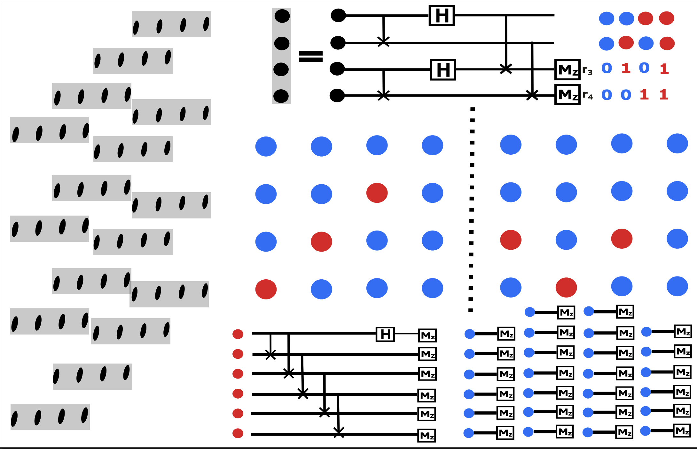

---
categories:
- Quantum Information
- Shadow Tomography
date: '2026-01-19'
execute:
  enabled: false
format:
  html:
    code-fold: true
jupyter: python3
lang: en
title: Multiple-copy Shadow tomography
keep-ipynb: false
bibliography: ../Lowerbounds/refs.bib
---

# Non-local Pauli shadow tomography

We have proved the inefficiency of single-copy strategy while an
efficient two-copy Bell strategy exists. In analogy, we try to break the
lower bound in the last section by extending the single-copy shadow
tomography method into the multi-copy case.

::: {#thm-nonlocal-pauli-shadow .callout-important icon="false"}
## (Non-local Pauli Shadow Tomography)
Let $\mathcal{P}_n$ be the $n$-qubit Pauli group. Let
$\mathbb{P}^{d}_{\pi}$ be the permutation operator on $2k$ replica of
$n$-qubits ($d = 2^n$) and $\pi =(\mathrm{odds})(\mathrm{even})$ is
2-cycle permutation on odd labels $(1,3,5,\cdots,2k-1)$ and even labels
$(2,4,\cdots,2k)$ respectively. For any $P \in \mathcal{P}_n$, define
the operator:
$A_P =\mathrm{sym}_{\pi}\left[P^{\otimes 2} \otimes (I^{\otimes 2})^{\otimes (k-1)} \right] \cdot \mathbb{P}^{d}_{\pi}$.
The family of observables $\mathcal{A} = \{A_P\}_{P \in \mathcal{P}_n}$
is a commuting family, i.e., $[A_P, A_Q] = 0$ for all
$P, Q \in \mathcal{P}_n$. Furthermore, its expectation value on
$\rho^{\otimes 2k}$ is
$\mathrm{tr}(A_P \rho^{\otimes 2k}) = [\mathrm{tr}(P\rho^k)]^2$.
Therefore, a single projective measurement in the common eigenbasis of
$\mathcal{A}$ allows for the simultaneous estimation of
$|\mathrm{tr}(P\rho^k)|$ for all $P \in \mathcal{P}_n$.
:::

::: {.callout-note collapse="true"}
## Proof (Click to expand)

We first prove the commutativity of the family $\mathcal{A}$.
Let
$S_P = \mathrm{sym}_{\pi}\left[P^{\otimes 2} \otimes (I^{\otimes 2})^{\otimes (k-1)} \right]$
and abbreviate $\pi = \mathbb{P}^d_{\pi}$. The operators are
$A_P = S_P \pi$ and $A_Q = S_Q \pi$. First, $\pi$ commutes with
$S_P, \forall P \in \mathcal{P}$ since $S_P$ is symmetrized under repeat
operation of $\pi$. Now, the commutator $[A_P, A_Q]$ became:
$$\begin{align*}
        [A_P, A_Q] &= (S_P \pi) (S_Q \pi) - (S_Q \pi) (S_P \pi) \\
        &= S_P (S_Q \pi) \pi - S_Q (S_P \pi) \pi \quad \text{(since $\pi$ commutes with $S_P$ and $S_Q$)} \\
        &= [S_P, S_Q]\pi^2.
\end{align*}$$ Finally, we show that $[S_P, S_Q] = 0$. This is because
each term within
$S_P = \mathrm{sym}_{\pi}\left[P^{\otimes 2} \otimes (I^{\otimes 2})^{\otimes (k-1)} \right]$
and
$S_Q = \mathrm{sym}_{\pi}\left[Q^{\otimes 2} \otimes (I^{\otimes 2})^{\otimes (k-1)} \right]$
either have commutators of operators on disjoint subsystems or have
two-replica terms with
$[P^{\otimes 2}, Q^{\otimes 2}] = [P \otimes P, Q \otimes Q] = 0$. Thus
we have $[S_P, S_Q] = 0$ for all Pauli operators $P, Q$ . Thus,
$[S_P, S_Q] = \mathbf{0}$, which implies $[A_P, A_Q] = \mathbf{0}$. We
now calculate $$\begin{align*}
        \mathrm{tr}(A_P \rho^{\otimes 2k}) &= \mathrm{tr}[\mathrm{sym}_{\pi}(P^{\otimes 2} \otimes \mathbb{I}^{\otimes 2k-2}) \pi \rho^{\otimes 2k}] = \mathrm{tr}[(P^{\otimes 2} \otimes \mathbb{I}^{\otimes 2k-2}) \pi \rho^{\otimes 2k}]\\
        &=\mathrm{tr}[(P\rho \otimes \rho^{\otimes k-1}) \mathbb{P}^{d}_{(\mathrm{odds})} \otimes (P\rho \otimes \rho^{\otimes k-1}) \mathbb{P}^{d}_{(\mathrm{even})}]\\
        &=[\mathrm{tr}(P\rho^k)]^2
\end{align*}$$ Thus, measuring the commuting family $\{A_P\}$
simultaneously yields estimates for $|\mathrm{tr}(P\rho^k)|$ for all
$P \in \mathcal{P}_n$. ◻
:::

::: {#lem-signal-estim .callout-important icon="false"}
## (Signal Estimation)
If we can estimate
$|\mathrm{tr}(P \rho^k)|, \forall P \in \mathcal{O} \subset \mathcal{P}_n$
within constant additive error $\varepsilon$, then using a
$\mathcal{O}(\varepsilon^{-4}\log(|\mathcal{O}|))$ times $k$-replica
strategy with $k \cdot n$ ancilla qubits, we can construct an estimator
$E_P$ such that $|E_P - \mathrm{tr}(P \rho^{k})| \leq 3\varepsilon$.
:::

::: {.callout-note collapse="true"}
## Proof (Click to expand)
 Denoting
$f_P = |\mathrm{tr}(P \rho^k)|$. We then construct the quantum state
$\sigma$ such that
$\left||\mathrm{tr}(P \sigma^k)|- f_P\right| \leq \varepsilon$. Such a
state $\sigma$ always exist and can be constructed if we knew an
$\varepsilon$ additive error estimator for
$\{f_P\}_{P \in \mathcal{O}}$, but might cannot be found computationally
efficient. Then we estimate
$\mathrm{tr}(\rho^k P)\cdot \mathrm{tr}(\sigma^k P)$ by measuring the
commuting family $\{A_P\}_{P\in \mathcal{O}}$ on state
$\rho^{\otimes k} \otimes \sigma^{\otimes k}$ for
$\mathcal{O}(\varepsilon^{-4}\log(|\mathcal{O}|))$ times. This will give
us an estimator $g_P$ such that
$|g_P - \mathrm{tr}(\rho^k P)\cdot \mathrm{tr}(\sigma^k P)|\leq \varepsilon^2$.
Now we set $E_P = 0$ if $f_P \leq \varepsilon$ and
$E_P = g_P/\mathrm{tr}(P \sigma^k)$ if else. We thus noted that:
$$\begin{align*}
        \text{If~} f_P < 2\varepsilon, \quad  |E_P - \mathrm{tr}(P \rho^k)| &= |\mathrm{tr}(P \rho^k)| \leq ||\mathrm{tr}(P \rho^k)| - f_P| + |f_P| \leq 3\varepsilon \\
        \text{If~} f_P \geq 2\varepsilon, \quad |E_P - \mathrm{tr}(P \rho^k)| &=   
            |g_P/\mathrm{tr}(P \sigma^k) -\mathrm{tr}(P \rho^k)| \\
            &= \frac{|g_P - \mathrm{tr}(P \sigma^k) \cdot \mathrm{tr}(P \rho^k)|}{|\mathrm{tr}(P \sigma^k)|}\\
            &\leq  \frac{|g_P - \mathrm{tr}(P \sigma^k) \cdot \mathrm{tr}(P \rho^k)|}{f_P - \varepsilon}  \leq \frac{\varepsilon^2}{2\varepsilon - \varepsilon} \leq 3\varepsilon.
\end{align*}$$ 
:::

### Examples: non-linear Pauli shadow

::: {#lem-4copy-strategy .callout-important icon="false"}
## (4-Copy Measurement Strategy for $k=2$)
For the case $k = 2$, there exists a measurement protocol on 4 copies of the quantum state that can estimate the commutants $A_{\mathbf{r}}$ through a shared eigenbasis measurement. The eigenbasis states $\ket{\Psi^{s}_{(\mathbf{a}, \mathbf{b})}}$ with eigenvalues $\lambda_{(s,\mathbf{a},\mathbf{b})} :=s \cdot 2^{-1}[(-1)^{[\mathbf{r}, \mathbf{a}]} + (-1)^{[\mathbf{r}, \mathbf{b}]}]$ (where $s = \pm 1$) can be measured using a combination of local gates, computational basis measurements, and GHZ measurements.
:::

::: {.callout-note collapse="true"}
## Construction and Proof (Click to expand)

**Step 1: Define the commutants**

For $k = 2$, the commutants we choose writes
$\{A_{\mathbf{r}} := {2}^{-1}{(\sigma_{\mathbf{r}}\sigma_{\mathbf{r}}\mathbb{I}_n\mathbb{I}_n + \mathbb{I}_n\mathbb{I}_n\sigma_{\mathbf{r}}\sigma_{\mathbf{r}})} \mathrm{S}_{13}\mathrm{S}_{24}\}_{\mathbf{r} \in \mathbb{F}_2^{2n}}$.

**Step 2: Construct the eigenbasis**

Since $\sigma_{\mathbf{r}} \otimes \sigma_{\mathbf{r}} \ket{\Phi_{\mathbf{a}}} = (-1)^{[\mathbf{r},\mathbf{a}]}\ket{\Phi_{\mathbf{a}}}$, the shared eigenbasis of $\mathcal{A}$ has the form:
$$
\begin{align*}
   \ket{\Psi^{s}_{(\mathbf{a}, \mathbf{b})}}&=
   \begin{cases}
    {2^{-1/2}}\left[{\ket{\Phi_{\mathbf{a}_x \mathbf{a}_z}} \otimes \ket{\Phi_{\mathbf{b}_x\mathbf{b}_z} }+s \ket{\Phi_{\mathbf{b}_x \mathbf{b}_z}} \otimes \ket{\Phi_{\mathbf{a}_x\mathbf{a}_z}}}\right] & \text{if~} \mathbf{a} < \mathbf{b}, \\
    \ket{\Phi_{\mathbf{a}_x \mathbf{a}_z}}\ket{\Phi_{\mathbf{a}_x \mathbf{a}_z}}& \text{if~} \mathbf{a} = \mathbf{b}.
\end{cases}
\end{align*}
$$
with eigenvalues $\lambda_{(s,\mathbf{a},\mathbf{b})} :=s \cdot 2^{-1}[(-1)^{[\mathbf{r}, \mathbf{a}]} + (-1)^{[\mathbf{r}, \mathbf{b}]}]$ and $s = \pm 1$.

**Step 3: Measurement protocol**

After implementing the measurement
$\left\{\ket{\Psi^{s}_{(\mathbf{a}, \mathbf{b})}} \bra{\Psi^{s}_{(\mathbf{a}, \mathbf{b})}}\right\}_{s \in \{+,-\}, \mathbf{a},\mathbf{b} \in \mathbb{F}_2^{2n}}$
for $T$ times and recording the results
$\{(s_t,\mathbf{a}_t, \mathbf{b}_t)\}_{t = 1}^{T}$, the average of
$A_{\mathbf{r}} = \sum \lambda_{(\pm,\mathbf{a},\mathbf{b})} \ket{\Psi^{\pm}_{(\mathbf{a}, \mathbf{b})}} \bra{\Psi^{\pm}_{(\mathbf{a}, \mathbf{b})}}$
can then be estimated by calculating the estimator
$T^{-1}\sum_{t = 1}^{T} \lambda_{(s_t, \mathbf{a}_t,\mathbf{b}_t)}$. To
realize such a measurement, we refer to construction
in [@liu2024auxiliary] and noted that 
$$
\begin{align*}
    \ket{\Psi^{s}_{\mathbf{a}, \mathbf{b}}}&= \mathrm{CNOT}_{34}\mathrm{CNOT}_{12}\mathrm{H}_3\mathrm{H}_1 \cdot
\begin{cases}
    2^{-1/2} \left[{\ket{\mathbf{a}_x \mathbf{a}_z\mathbf{b}_x\mathbf{b}_z} +s \ket{\mathbf{b}_x \mathbf{b}_z\mathbf{a}_x\mathbf{a}_z}}\right] &\text{if~} \mathbf{a} < \mathbf{b}\\
    \ket{\mathbf{a}_x \mathbf{a}_z\mathbf{b}_x\mathbf{b}_z}&\text{if~} \mathbf{a} = \mathbf{b}
\end{cases},\\
&= \mathrm{CNOT}_{34}\mathrm{CNOT}_{12}\mathrm{H}_3\mathrm{H}_1 \mathrm{CNOT}_{13}\mathrm{CNOT}_{24}\cdot
\begin{cases}
    2^{-1/2} \left[{\ket{\mathbf{a}_x \mathbf{a}_z} +s \ket{\mathbf{b}_x \mathbf{b}_z}} \right]\ket{\mathbf{a} + \mathbf{b}} &\text{if~} \mathbf{a} < \mathbf{b}\\
    \ket{\mathbf{a}_x \mathbf{a}_z} \ket{\mathbf{0} \mathbf{0}}&\text{if~} \mathbf{a} = \mathbf{b}
\end{cases},\\
&= \mathrm{CNOT}_{34}\mathrm{CNOT}_{12}\mathrm{H}_3\mathrm{H}_1 \mathrm{CNOT}_{13}\mathrm{CNOT}_{24}\cdot
\begin{cases}
    2^{-1/2} \left[{\ket{\mathbf{a}^{I}} +s \ket{\bar{\mathbf{a}}^{I}}}\right] \ket{\mathbf{a}^{E}}\ket{\mathbf{a} + \mathbf{b}} &\text{if~} \mathbf{a} < \mathbf{b}\\
    \ket{\mathbf{a}_x \mathbf{a}_z} \ket{\mathbf{0} \mathbf{0}}&\text{if~} \mathbf{a} = \mathbf{b}
\end{cases}.
\end{align*}
$$

This disentangles the qubits on the third and fourth copies. Thus, we can locally implement the gate sequence $\mathrm{CNOT}_{13}\mathrm{CNOT}_{24}\mathrm{H}_3\mathrm{H}_1\mathrm{CNOT}_{12}\mathrm{CNOT}_{34}$ and then measure the 3rd and 4th copies in the computational basis $\ket{\mathbf{s}_{3}\mathbf{s}_4}$.

**Step 5: Extract measurement outcomes**

The computational basis measurement gives the difference of vectors $\mathbf{a}$ and $\mathbf{b}$ through:
$$
\mathbf{s}_{3} = \mathbf{a}_x + \mathbf{b}_x,\quad \mathbf{s}_{4} = \mathbf{a}_z + \mathbf{b}_z
$$

This information indicates a partition of the 1st and 2nd copies of qubits $\{1,\cdots,2n\} = E \cup I$, where:
- $E := \{i \in [2n]| a_i = b_i\}$ (equal indices)
- $I:= \{i \in [2n]| \bar{a}_i = b_i\} := \{i_1<i_2<\cdots<i_{|I|}\}$ (inverted indices)

We then implement:
1. Computational basis measurement $\ket{\mathbf{s}^{E}}$ on qubits in set $E$
2. GHZ state measurement $s^{I}$ on qubits in set $I$, formalized by the circuit:

$$
\begin{align*}
    \frac{1}{\sqrt{2}} \left[{\ket{\mathbf{a}^{I}} + s\ket{\bar{\mathbf{a}}^{I}}} \right] &= 
    \begin{cases}
        \frac{1}{\sqrt{2}} \left(\bigotimes_{i \in I} X_i + Z_{i_1}\right) \ket{\bar{\mathbf{a}}^{I}}  &\text{if~} s = -1,\\
        \frac{1}{\sqrt{2}} \left(\bigotimes_{i \in I} X_i + Z_{i_1}\right) \ket{{\mathbf{a}}^{I}}  &\text{if~} s = +1,
    \end{cases}\\
    &=\left(\prod_{i = i_1}^{i_{|I|-1}}\mathrm{CNOT}_{i,i+1}\right)^{\dagger} H_{i_1} \left(\prod_{i = i_1}^{i_{|I|-1}}\mathrm{CNOT}_{i,i+1}\right) \begin{cases}\ket{\bar{\mathbf{a}}^{I}} &\text{if~}s = -1,\\\ket{{\mathbf{a}}^{I}} &\text{if~}s = 1.\end{cases}
\end{align*}
$$ 
Here we use the fact that since $\mathbf{a}< \mathbf{b}$,
we have $a_{i_1} = 0$. This then gives the $\mathbf{a}$ vector through
$\mathbf{a}^{E} = {\mathbf{s}^{E}}$ and
$s = +1, \mathbf{a}^{I} = {s}^{I}$ if $a_{i_1} = 0$,
$s = -1, \mathbf{a}^{I} = \bar{s}^{I}$ if $a_{i_1} = 1$.
:::

## Examples: A General construction
The construction above is useful in generalization to general non-linear
shadow [@liu2024auxiliary]. To get a classical shadow of $\hat{\rho^t}$,
analogically, we sample
$h(\mathbf b,V):=\mathcal{M}^{-1}(V^\dagger \ket{\mathbf b}\!\bra{\mathbf b}V)$
with pseudo-probability
$\text{Pr}(V)\cdot\text{Pr}(\mathbf b|V): = \text{Pr}(V)\cdot\bra{\mathbf b} V \rho^t V^\dagger\ket{\mathbf b}$.
This gives the result
$\mathbb{E}_{V \sim \mathcal{U}}\sum_{\mathbf b}\mathcal{M}^{-1}(V^\dagger \ket{\mathbf b}\!\bra{\mathbf b}V) \bra{\mathbf b} V \rho^t V^\dagger\ket{\mathbf b} = \rho^{t}$.
But
$\text{Pr}(\mathbf b|V): = \bra{\mathbf b} V \rho^t V^\dagger\ket{\mathbf b}$
is not a valid probability distribution. Fortunately, it can be
effectively realized based on the estimator of
$\bra{\mathbf b} V \rho^t V^\dagger\ket{\mathbf b}$ in
Lemma (gen_swap_est)
operator
$\{\ket{\mathbf b}\!\bra{\mathbf b}\}_{\mathbf b \in \{0,1\}^{n}}$ is
mutually commutant and the operator set $\{Q_{\mathbf b}\}_{\mathbf b}$,
where
$Q_{\mathbf{b}}:=\text{sym}(\ket{\mathbf b}\!\bra{\mathbf b}) = t^{-1} \sum_{i =1}^{t} \ket{\mathbf{b}}\!\bra{\mathbf{b}}_i$
fully distinguished the spectrum of $\text{SWAP}_t^{\otimes n}$. We use
the common eigenvectors $\ket{\psi_{\mathbf x}}$ of the operator set
$\{\text{SWAP}_{t}^{\otimes n}\}\cup \{Q_{\mathbf b}\}_{\mathbf b \in \{0,1\}^n}$
and calculates 
$$
\begin{align*}
\bra{\mathbf b} V \rho^t V^\dagger\ket{\mathbf b} =f(\mathbf{x})\text{Pr}(\mathbf b | \mathbf x)\text{Pr}(\mathbf x | \mathbf V) , \text{~where~}\left\{\begin{aligned} &f(\mathbf{x}):= \bra{\psi_{\mathbf x}}\text{SWAP}_{t}^{\otimes n}\ket{\psi_{\mathbf x}}, \\ &\text{Pr}(\mathbf b | \mathbf x):=\bra{\psi_{\mathbf x}}Q_{\mathbf b}\ket{\psi_{\mathbf x}},\\ &\text{Pr}(\mathbf x | \mathbf V):=\bra{\psi_{\mathbf x}}(V\rho V^\dagger)^{\otimes t}\ket{\psi_{\mathbf x}}.\end{aligned}\right. 
\end{align*}
$$ 
Here $\mathbf{x} \in \mathbb{F}_2^{n\cdot t}$ labeled
different eigenvectors. Then sampling $h(\mathbf b,V)$ with
pseudo-probability $\bra{\mathbf b} V \rho^t V^\dagger\ket{\mathbf b}$
then is equivalent to sample $f(\mathbf{x})h(\mathbf b,V)$ with
probability
$\text{Pr}(\mathbf b | \mathbf x)\text{Pr}(\mathbf x | \mathbf V)\text{Pr}(V)$.
If we can build an efficient quantum circuit
$\mathcal{R}\ket{\mathbf x} = \ket{\psi_{\mathbf x}}$, this sampling can
be realized. Based on this, we first give the form of common
eigenvectors $\ket{\psi_{\mathbf x}}$ and then discuss the efficient
implementation of $\mathcal{R}$. Because
$(\text{SWAP}_{t})^{t} = \mathbb{I}$, $\text{SWAP}_t$ must have
eigenvalue $e^{i2\pi/t}$. This conclusion generalized to
@lem-eigvec-qswap below.

::: {#lem-eigvec-qswap .callout-important icon="false"}
## (Common Eigenvectors of SWAP and QSWAP)
Given
$\mathbf{z} = (\mathbf{z}_1,\cdots,\mathbf{z}_t) \in (\{0,1\}^{n})^t$
with set
$[\mathbf{z}]:= \{\mathbf z,\tau(\mathbf z),\cdots,\tau^{|[\mathbf z]|-1}(\mathbf z)\}$,
where the $t$-cyclic permutation $\tau$ satisfied
$\tau\circ(\mathbf{z}_1,\cdots,\mathbf{z}_t) = (\mathbf{z}_{\tau(1)},\cdots,\mathbf{z}_{\tau(t)})=(\mathbf{z}_t,\mathbf{z}_1\cdots,\mathbf{z}_{t-1})$,
the operators
$\{\text{SWAP}_{t}^{\otimes n}\}\cup \{Q_{\mathbf b}\}_{\mathbf b \in \{0,1\}^n}$
have common eigenvectors labeled by
$[\mathbf{z}],k =0,\cdots, |[\mathbf{z}]|-1$ as
$\ket{\Psi_{[\mathbf z]}^{k}} = \sqrt{|[\mathbf{z}]|^{-1}} \sum_{r = 0}^{|[\mathbf{z}]| - 1}e^{\frac{(2\pi i)rk}{|[\mathbf{z}]|}} \ket{\tau^{r}(\mathbf z)},$
with eigenvalue
$\{e^{-2k\pi i/|[\mathbf{z}]|}\} \cup \{t^{-1}\cdot \# (\mathbf{b} = \mathbf{z}_i)\}.$
:::

::: {.callout-note collapse="true"}
## Proof (Click to expand)

*Proof.* This can be proved by direct calculation. $$\begin{align*}
        &\text{SWAP}_{t}^{\otimes n} \ket{\Psi_{[\mathbf z]}^{k}} = \sqrt{|[\mathbf{z}]|^{-1}} \sum_{r = 0}^{|[\mathbf{z}]| - 1}e^{\frac{(2\pi i)rk}{|[\mathbf{z}]|}} \ket{\tau^{r+1}(\mathbf z)} = e^{-2k\pi i/|[\mathbf{z}]|}\ket{\Psi_{[\mathbf z]}^{k}}.\\
        &Q_{\mathbf b}\ket{\Psi_{[\mathbf z]}^{k}} = \sqrt{|[\mathbf{z}]|^{-1}} \sum_{r = 0}^{|[\mathbf{z}]| - 1}e^{\frac{(2\pi i)rk}{|[\mathbf{z}]|}} Q_{\mathbf b}\ket{\tau^{r}(\mathbf z)} = t^{-1}\cdot \# (\mathbf{b} = \mathbf{z}_i) \ket{\Psi_{[\mathbf z]}^{k}}.
\end{align*}$$ ◻
:::

Take $t = 2$, the eigenvectors writes
$\{\ket{\mathbf{s}\mathbf{s}}\}_{\mathbf{s} \in \mathbb{F}_2^{n}} \cup \{\sqrt{2^{-1}}(\ket{\mathbf{s}_1{\mathbf{s}_2}}+\ket{{\mathbf{s}_2}\mathbf{s}_1}), \sqrt{2^{-1}}(\ket{\mathbf{s}_1{\mathbf{s}_2}}-\ket{{\mathbf{s}_2}\mathbf{s}_1})\}_{\mathbf{s}_1\neq \mathbf{s}_2 \in \mathbb{F}_2^n}$,
which counts $2^n + 2^n(2^n - 1)$ numbers of linearly independent basis,
thus being complete. This leads us to find circuit that transform the
$2n$-qubits computational basis into these bases. Specifically,
$$\begin{align*}
    \mathcal{R} \ket{\mathbf{s}_1 \mathbf{s}_2} = 
    \left\{
        \begin{aligned} 
        &\ket{\mathbf{s}_1 \mathbf{s}_2} &&\text{~if~} \mathbf{s}_1 = \mathbf{s}_2 \\
        &\sqrt{2^{-1}}(\ket{\mathbf{s}_1{\mathbf{s}_2}}+\ket{{\mathbf{s}_2}\mathbf{s}_1}) &&\text{~if~} \mathbf{s}_1 < \mathbf{s}_2 \\
        &\sqrt{2^{-1}}(-\ket{\mathbf{s}_1{\mathbf{s}_2}}+\ket{{\mathbf{s}_2}\mathbf{s}_1}) &&\text{~if~} \mathbf{s}_1 > \mathbf{s}_2.  
        \end{aligned}
        \right.
\end{align*}$$ This pinned down the measurement cirucit by two steps:
(i).Check whether $\mathbf{s}_1 = \mathbf{s}_2$ by transversal CNOT
gates, (ii).On the different parts, with length $l < n$ and most
significant position $p_{m}$, implements
$\bar{H}:= \sqrt{2^{-1}} (X^{\otimes l} +Z_{p_m})$ on those qubits. The
step(ii) involved non-local operation within one of the copies. This is
why we named it non-local multi-copy (**NLMC**) shadow.

#### Efficiency analysis. {#efficiency-analysis. .unnumbered}

As summarized in @lem-var-nonlocal-shadow, the variance of **NLMC** shadow to estimate $\text{tr}(O \rho^t)$ with unitary sampled
from $V \sim \mathcal{E}$ is upper bounded by the variance of
single-copy shadow to estimate $\text{tr}(O \rho)$ with the same unitary
ensemble $V$. This means that if $O$ is (i).low weight Pauli operators
or (ii)low rank operators, **NLMC** shadow will have $\text{poly}(n)$
sample complexity by taking
$\mathcal{E} = \text{Cliff}_{n}, \text{Cliff}(2)^{\otimes n}$
separately, which is exponentially faster compared to single copy shadow
tomography in
Eq.[\[eq:singlecp_shadow_nonlinear\]](#eq:singlecp_shadow_nonlinear){reference-type="eqref"
reference="eq:singlecp_shadow_nonlinear"}.

::: {#lem-var-nonlocal-shadow .callout-important icon="false"}
## (Variance of Non-local Pauli Shadow)
Given
$(\mathbf x, \mathbf b, V)$ sampled from distribution
$\text{Pr}(\mathbf b | \mathbf x)\text{Pr}(\mathbf x | V)\text{Pr}(V)$,
the random variable
$\hat{o}_t(\mathbf x, \mathbf b, V) := \text{tr}\left(\mathcal{M}^{-1}(V^\dagger \ket{\mathbf b}\!\bra{\mathbf b}V) O\right)\cdot f(\mathbf x)$
is an unbiased estimator for $\text{tr}(O\rho^t)$. The variance of this
estimator satisfied $$\begin{align*}
     \mathbb{E}_{\mathbf x, \mathbf b, V} \hat{o}_t^2 \leq \mathbb{E}_{V \sim \text{Pr}(V)} \sum_{\mathbb{b}} \bra{\mathbf{b}}V\rho V^\dagger \ket{\mathbf b} \text{tr}^2\left(O \mathcal{M}^{-1}\left(V^\dagger \ket{\mathbf b}\!\bra{\mathbf b}V\right)\right).
\end{align*}$$ Here the RHS related to the variance to estimate
$\text{tr}(O \rho)$ with unitary ensemble $V \sim \text{Pr}(V)$.
:::

::: {.callout-note collapse="true"}
## Proof (Click to expand)

*Proof.* To show the unbiasedness, according to
Eq.[\[eq:tpower_shadow\]](#eq:tpower_shadow){reference-type="eqref"
reference="eq:tpower_shadow"}, we noted that $$\begin{align*}
        \mathbb{E}_{V \sim \mathcal{E}} \mathbb{E}_{(\mathbf{x},\mathbf{b}) \sim \text{Pr}(\mathbf{b}|\mathbf{x})\text{Pr}(\mathbf{x}|V)}f(\mathbf x) \cdot V^\dagger \ket{\mathbf b}\!\bra{\mathbf b}V = \mathbb{E}_{V \sim \mathcal{E}}\bra{\mathbf b} V \rho^t V^\dagger\ket{\mathbf b} \cdot V^\dagger \ket{\mathbf b}\!\bra{\mathbf b}V = \mathcal{M}(\rho^t).
\end{align*}$$ ◻
:::

# Local k-copy 3-design shadow.

Now we consider the case that we can put $\rho^{\otimes k}$ in quantum
memory and then implement randomized k-qubits Clifford gate
$U = {U_i}^{\otimes n}$ with $U_i \in \mathbf{D}_{3}(2^k)$ the
$k$-qubits gate and forms $3$-design. After this, we measured each qubit
in the computational basis.

::: {#lem-LC-shadow-kcopy .callout-important icon="false"}
## (Local k-Copy Shadow Variance)
In the case of local k-copy randomized measurements on $\rho^{\otimes k}$, let the
observable $O^{(k)}$ acting on $n\cdot k$ qubits have decomposition
$O^{(k)} = \sum_{W} \alpha_{W} W$, where $W = \bigotimes_{i=1}^n W_i$
and $W_i \in \{I,X,Y,Z\}^{\otimes k}$. Denoting $\mathcal{C}(W)$ as the
set of $k$-qubit Pauli operator that commute with $W$ and
$\delta_{e,S} = 1$ iff $e\in S$, we define a function
$R:\mathcal{P}_k^{\otimes n} \to \mathbb{R}$ as 
$$
\begin{align*}
        R(W,W') &= \prod_{i = 1}^n r(W_i,W'_i), r(W_i,W'_i) \\
        &:= \begin{cases}
            1 &\text{if~}W_i = \mathbb{I}_k \text{~or~}W'_i = \mathbb{I}_k ,\\
            (2^k+1) \cdot \frac{2^{k-1}\delta_{W_i,W'_i} +\delta_{W_i, \mathcal{C}(W'_i)\backslash \mathbb{I}_k } }{2^{k-1}+1} &\text{if~}W_i \neq \mathbb{I}_k \text{~and~} W'_i \neq \mathbb{I}_k .
        \end{cases}
\end{align*}
$$
 we have
$\langle (\hat{o}^{(k)})^2 \rangle_{\rho} =\text{tr} \left(\rho^{\otimes k} \cdot \mathbf{V}(O^{(k)}) \right)$,
where
$\mathbf{V}(O^{(k)}) := \sum_{W,W'}\alpha_W \alpha_{W'} R(W,W')W W'$.
Specifically, if we take a local operator
$O^{(k)} = \bigotimes_{i = 1}^n \left(\sum_{W_i \in \mathcal{P}_k}\alpha_{W_i} W_i\right)$,
we have
$\mathbf{V}(O^{(k)}) :=\bigotimes_{i = 1}^n  \sum_{W_i,W_i'}\alpha_{W_i} \alpha_{W_i'} r(W_i,W_i')W_i W_i'$.
:::

::: {.callout-note collapse="true"}
## Proof (Click to expand)

*Proof.* By
Lemma (onsite_2design)
$\mathcal{D}_{1/(2^k + 1)}^{-1}(\cdot) = (2^k + 1)(\cdot) - \text{tr}(\cdot) \mathbb{I}_k$
constitute an unbiased estimator of $\rho^{\otimes k}$ through the
transformation
$\hat{\rho}^{\otimes k} =\mathcal{M}^{-1}(U^\dagger \ket{\mathbf r}\!\bra{\mathbf r} U)=\bigotimes_{i =1}^n\left((2^k + 1)U_i^{\dagger} \ket{\mathbf{r}_{i}}\bra{\mathbf{r}_{i}} U_i - \mathbb{I}_k\right).$
The second moment is given by
$\langle (\hat{o}^{(2)})^2 \rangle_{\rho} =\mathbb{E}_{U \sim \mathbf{D}_3(2^k)^{\otimes n}}\sum_{\mathbf r}\bra{\mathbf r}U \rho^{\otimes k} U^\dagger \ket{\mathbf{r}} \bra{\mathbf r}U\mathcal{M}^{-1}(O^{(k)}) U^\dagger\ket{\mathbf r}^2$.
Similar to the proof in
Lemma (LC_shadow)
the Pauli product basis $W_i \in \{I,X,Y,Z\}^{\otimes k}$ that supports
on those k qubits located at site $i$. By denoting $W = W_1\cdots W_n$,
we have $O^{(k)} = \sum_{W} \alpha_{W} W$. According to
Lemma (onsite_2design)
$\mathcal{M}^{-1}$ acts locally as
$\mathcal{M}_i^{-1}(W_i) = g(W_i) W_i$, where the scaling factor
$g(W_i)$ is determined by
$g(W_i) = \begin{cases} (2^k+1) & \text{if~} W_i \neq \mathbb{I}_k \\ 1 &\text{if~} W_i = \mathbb{I}_k \end{cases}.$
Use this decomposition and again supposed
$\rho^{\otimes k} = \sum_{s} \beta_s \bigotimes_{i=1}^n \rho_i^{(s)}$,
where $\rho_i^{(s)} \in \mathcal{D}(\mathcal{H}_k)$, the result involves
averaging over the k-qubit 3-design $U_i \sim \mathbf{D}_3(2^k)$ as:
$$
\begin{align*}
        \langle (\hat{o}^{(k)})^2 \rangle_{\rho} &= \sum_{W,W'}\alpha_{W}\alpha_{W'}\sum_{s}\beta_s\prod_{i = 1}^n g(W_i)g(W'_i)\sum_{\mathbf{r}_i \in \{0,1\}^k} \left[({\rho}^{(s)}_i \otimes W_i \otimes W'_i) \cdot \mathbb{E}_{U_i} U_i^{\otimes 3}\ket{\mathbf{r}_i}\!\bra{\mathbf{r}_i}^{\otimes 3}U_i^{\otimes 3,\dagger}\right] \\
        &= \sum_{W,W'}\alpha_{W}\alpha_{W'}\sum_s \beta_s\prod_{i = 1}^n 2^k p \cdot g(W_i)g({W'}_i) \Bigl[ \text{tr}(W_i)\text{tr}(W'_i)\text{tr}({\rho}^{(s)}_i) + \text{tr}({\rho}^{(s)}_i W_i)\text{tr}(W'_i) \notag\\
        & \qquad\qquad\qquad + \text{tr}(W_i)\text{tr}({\rho}^{(s)}_i W'_i)+\text{tr}({\rho}^{(s)}_i)\text{tr}(W_iW'_i) + \text{tr}(W_i {\rho}^{(s)}_i W'_i) + \text{tr}(W'_i {\rho}^{(s)}_i W_i) \Bigr].
\end{align*}
$$

Here we use the fact that the term $\ket{E} :=U_i\ket{\mathbf{r}_i}$ is
average over the 3-design states, yielding terms based on the formula
$\mathbb{E} [E^{\otimes 3}] ={d^{-1}(d+1)^{-1}(d+2)^{-1}} \sum_{\pi \in S_3} \mathbb{P}_{\pi}^{(d)}$
according to
Lemma (state_trajectory)
site is $p = 1/(2^k \cdot (2^k+1) \cdot (2^k+2))$. We evaluate the
expression by considering terms for each site $i$, analogous to the
single-copy proof of
Lemma (LC_shadow)
$$\begin{align*}
        \langle (\hat{o}^{(2)})^2 \rangle_{\rho} &= 
        \sum_{W,W'}\alpha_{W}\alpha_{W'}\sum_{s}\beta_s\prod_{i = 1}^n 2^k p \cdot \begin{cases}
         1\cdot 1\cdot [2^{2k}+3\cdot 2^k+2]\text{tr}{\rho}^{(s)}_i  &\text{if~} W_i=W_i' = \mathbb I_k,\\
         1 \cdot (2^k+1) \cdot[2^k + 2]\cdot \text{tr}({\rho}^{(s)}_i W'_i)&\text{if~} W_i = \mathbb I_k \neq W'_i,\\
         (2^k+1) \cdot 1 \cdot[2^k + 2]\cdot \text{tr}({\rho}^{(s)}_i W_i)&\text{if~} W'_i = \mathbb I_k \neq W_i,\\
         (2^k+1)^2 \cdot[2^k\delta_{W_i, W'_i}\text{tr}{\rho}^{(s)}_i  + \text{tr}({\rho}^{(s)}_i\{W_i,W_i'\})]&\text{if~} W_i, W'_i \neq \mathbb I_k.
     \end{cases}\\
    %  &=\sum_{W,W'}\alpha_{W}\alpha_{W'}\sum_{s}\beta_s\prod_{i = 1}^n \begin{cases}
    %     \text{tr}{\rho}^{(s)}_i  &\text{if~} W_i=W_i' = \mathbb I_k,\\
    %      \text{tr}({\rho}^{(s)}_i W'_i)&\text{if~} W_i = \mathbb I_k\neq W'_i,\\
    %      \text{tr}({\rho}^{(s)}_i W_i)&\text{if~} W'_i = \mathbb I_k\neq W_i,\\
    %     \frac{2^k+1}{2^k+2} \cdot\text{tr}\left[(2^k\delta_{W_i, W'_i}\mathbb{I}_k  +2\delta_{W_i, \mathcal{C}(W'_i)\backslash \mathbb{I}_k}  W_iW_i'){\rho}^{(s)}_i\right]&\text{if~} W_i, W'_i \neq \mathbb I_k.
    %  \end{cases}\\
     &= \sum_{W,W'}\alpha_{W}\alpha_{W'}\cdot \sum_{s}\beta_s\prod_{i = 1}^n \begin{cases}
        \text{tr}({\rho}^{(s)}_i W_iW'_i)  &\text{if~} W_i=W_i' = \mathbb I_k,\\
         \text{tr}({\rho}^{(s)}_i W_i W'_i)&\text{if~} W_i = \mathbb I_k\neq W'_i,\\
         \text{tr}({\rho}^{(s)}_i W_i W'_i)&\text{if~} W'_i = \mathbb I_k\neq W_i,\\
         \frac{2^k+1}{2^k+2} \cdot\text{tr}\left[{\rho}^{(s)}_i(2^k\delta_{W_i, W'_i}+2\delta_{W_i, \mathcal{C}(W'_i)\backslash \mathbb{I}_k})W_iW_i'\right]&\text{if~} W_i, W'_i \neq \mathbb I_k.
     \end{cases}\\
     &=\text{tr}\left( \rho^{\otimes k}\cdot \sum_{W,W' \in \mathcal{P}_k^{\otimes n}} \alpha_{W}\alpha_{W'} R(W,W') W W'\right).
\end{align*}$$ To prove the second equality, we first defined
$\mathcal{C}(W)$ as the set of k-qubit Pauli operator that commute with
$W$ and $\delta_{e,S} = 1$ iff $e\in S$, otherwise $\delta(e,S) = 0$.
Then we use the fact that $$\begin{align*}
        \forall W_i, W'_i \neq \mathbb I_k, \text{tr}({\rho}^{(s)}_i\{W_i,W_i'\}) = \begin{cases}0 \!\!\!&\text{if~} W'_i \notin \mathcal{C}(W_i)\backslash \mathbb{I}_k\\2\text{tr}(\tilde{\rho}^{(s)}_i W_iW'_i)  \!\!\!&\text{if~} W_i \in \mathcal{C}(W'_i)\backslash \mathbb{I}_k \end{cases} = 2\delta_{W_i, \mathcal{C}(W'_i)\backslash \mathbb{I}_k} \text{tr}(\tilde{\rho}^{(s)}_i W_iW'_i),
\end{align*}$$ In the last equality, we use the definition
$$\begin{align*}
    R(W,W') &= \prod_{i = 1}^n r(W_i,W'_i),  r(W_i,W'_i) 
    &:= \begin{cases}
        1 &\text{if~}W_i = \mathbb{I}_k \text{~or~}W'_i = \mathbb{I}_k ,\\
        (2^k+1) \cdot \frac{2^{k-1}\delta_{W_i,W'_i} +\delta_{W_i, \mathcal{C}(W'_i)\backslash \mathbb{I}_k } }{2^{k-1}+1} &\text{if~}W_i \neq \mathbb{I}_k \text{~and~} W'_i \neq \mathbb{I}_k .
    \end{cases}
\end{align*}$$ ◻
:::

The inherient difference between the single-copy local Clifford strategy
contained in the term $\delta_{W_i, \mathcal{C}(W'_i)}$. In the
single-copy case, the center of $P_i \in \{X,Y,Z\}$ satisfied
$\mathcal{C}(P_i) = \{P_i, \mathbb{I}\}$. However, for example, for the
two-qubit Pauli operators, more terms involved. We denote the $n$-qubit
Pauli operators as
$\sigma_{\mathbf{r}} = \bigotimes_{i=1}^n \sigma_{{r}_{x,i},{r}_{z,i}} \in \mathcal{P}_n$
with
$\mathbf{r} = (\mathbf{r}_x = ({r}_{x,1},\cdots,{r}_{x,n}),\mathbf{r}_z = ({r}_{z,1},\cdots,{r}_{z,n})) \in (\mathbb{F}_2^n)^2$
and
$\{\sigma_{00},\sigma_{01},\sigma_{10},\sigma_{11}\} = \{\mathbb{I}, Z,X,Y = iXZ\}$.
We denote $a \oplus b = a + b \mathrm{~mod~}2 = a + b - 2a\cdot b$ and
$\mathbf{a} \odot \mathbf{b} = (a_1\cdot b_1,\cdots,a_n\cdot b_n)$ with
$a,b \in \{0,1\}$. In the following, we follow the Pauli multiplication
rule as proved below 
$$
\begin{align*}
         \sigma_{\mathbf{s}}\sigma_{\mathbf{s}'} &= \bigotimes_{j = 1}^n i^{s_{x,j} s_{z,j}} X^{s_{x,j}}Z^{s_{z,j}} \cdot i^{s'_{x,j} s'_{z,j}} X^{s'_{x,j}}Z^{s'_{z,j}} \\
         &=  \bigotimes_{j = 1}^n X^{s_{x,j}+s_{x,j}'}Z^{s_{z,j}+s_{z,j}'} (-1)^{s_{z,j}\cdot s_{x,j}'} \cdot i^{s_{x,j}s_{z,j}+s_{x,j}'s_{z,j}'} \notag \\
         &= \sigma_{\mathbf{s}\oplus \mathbf{s}'} (-i)^{(\mathbf{s}_x+ \mathbf{s}_x'-2\mathbf{s}_x\odot\mathbf{s}_x')(\mathbf{s}_z+\mathbf{s}_z' - 2\mathbf{s}_z\odot\mathbf{s}_z')} i^{\mathbf{s}_x\mathbf{s}_z + \mathbf{s}_x'\mathbf{s}_z'}(i)^{2\mathbf{s}_z\mathbf{s}_x'} \\
         &=i^{\mathbf{s}_x'\mathbf{s}_z - \mathbf{s}_z'\mathbf{s}_x} (-1)^{(\mathbf{s}_x + \mathbf{s}_x') \cdot (\mathbf{s}_z \odot \mathbf{s}_z') + (\mathbf{s}_z + \mathbf{s}_z') \cdot (\mathbf{s}_x \odot \mathbf{s}_x')}\sigma_{\mathbf{s}+ \mathbf{s}'} := i^{\mathbf{s}' J \mathbf{s}} (-1)^{d(\mathbf{s},\mathbf{s}')}\sigma_{\mathbf{s}+ \mathbf{s}'} .
\end{align*}
$$
Defined
$[\mathbf{s}', \mathbf{s}]:= \mathbf{s}_x'\cdot \mathbf{s}_z - \mathbf{s}_z'\cdot \mathbf{s}_x \text{~mod~} 2$
as the binary symplectic product. Use this rule, we calculate
$\sigma_{\mathbf{s}}\cdot \sigma_{\mathbf{s}'}=i^{2\mathbf{s}_x'\cdot \mathbf{s}_z - 2\mathbf{s}_z'\cdot \mathbf{s}_x }  (\sigma_{\mathbf{s}'} \cdot \sigma_{\mathbf{s}}) \Rightarrow [\mathbf{s}, \mathbf{s}'] = 0,$
and show that
$\mathcal{C}(\sigma_{\mathbf{u}} )\backslash \mathbb{I}_k= \{\sigma_{\mathbf{v}}|\mathbf{v}\in \mathbb{F}_2^k,\mathbf{v}\neq \mathbf{0},[\mathbf{v},\mathbf{u}] = 0\}.$
This means that
$\delta_{\sigma_{\mathbf{s},\mathcal{C}(\sigma_{\mathbf{s}'} )\backslash \mathbb{I}_k}} = \delta_{\mathbf{s}, \{\mathbf{v}\in \mathbb{F}_2^k|\mathbf{v}\neq \mathbf{0},[\mathbf{v},\mathbf{s}'] = 0\}} = {\left(1 + (-1)^{[\mathbf{s},\mathbf{s}']}\right)}/{2}$
and 
$$
\begin{align*}
&r({\mathbf{s}},{\mathbf{s}'}):=r(\sigma_{\mathbf{s}},\sigma_{\mathbf{s}'}) := \begin{cases}
            1 &\text{if~}\mathbf{s} = \mathbf{0}\text{~or~}\mathbf{s}' = \mathbf{0} ,\\
            \frac{2^k+1}{2^{k}+2} \cdot \left[2^{k}\delta_{\mathbf{s},\mathbf{s}'} +1+ (-1)^{[\mathbf{s}',\mathbf{s}]}\right]  &\text{if~}\mathbf{s} \neq \mathbf{0}\text{~and~}\mathbf{s}' \neq \mathbf{0} .
        \end{cases}
\end{align*}
$$

A generalization of the variance operator $\mathbf{V}(O^{(k)})$ is to
applied it to two operators $O_\alpha,O_\beta$, as defined below:

::: {#def-cov-oper .callout-note icon="false"}
## Definition (Covariance Operator)
Given two operators with decomposition
$O_\alpha = \sum_{W} \alpha_{W} W, O_\beta = \sum_{W} \beta_{W} W$ with
$W \in \{\mathbb{I},X,Y,Z\}^{\otimes k}$, the we defined the covariance
operator as $$\begin{align*}
        \mathbf{V}(O_\alpha,O_\beta) = \sum_{W,W'} \alpha_{W} \beta_{W'} R(W,W') WW',
\end{align*}$$ where $R(W,W')$ is defined in
@lem-LC-shadow-kcopy
:::

The covariance operator is important due to the Lemma below

::: {#lem-covariance-decomp .callout-important icon="false"}
## (Covariance Decomposition)
Given a k-copy operator
$O = \lambda_{\alpha} O_{\alpha} + \lambda_{\beta} O_{\beta}$, we have
$$\begin{align*}
        \mathbf{V}(O,O) = \lambda_{\alpha}^2 \mathbf{V}(O_{\alpha},O_{\alpha}) + 2 \lambda_{\alpha} \lambda_{\beta} \mathbf{V}(O_{\alpha},O_{\beta}) + \lambda_{\beta}^2 \mathbf{V}(O_{\beta},O_{\beta}).
\end{align*}$$
:::

::: {.callout-note collapse="true"}
## Proof (Click to expand)

Supposed the decomposition
$O_\alpha = \sum_{W} \alpha_{W} W, O_\beta = \sum_{W} \beta_{W} W$, we
noted that 
$$
\begin{align*}
        \mathbf{V}(O,O) &=  \sum_{W,W'} (\lambda_{\alpha}\alpha_{W} + \lambda_{\beta} \beta_{W})(\lambda_{\alpha}\alpha_{W'} + \lambda_{\beta} \beta_{W'}) R(W,W') WW',\\
        &=  \sum_{W,W'} \lambda^2_{\alpha}\alpha_{W}\alpha_{W'}R(W,W') WW' +\sum_{W,W'}  \lambda_{\alpha}\lambda_{\beta} \alpha_{W}\beta_{W'}R(W,W') WW' \notag\\
        & +\sum_{W,W'}  \lambda_{\beta} \lambda_{\alpha}\beta_{W}\alpha_{W'}R(W,W') WW' + \sum_{W,W'} \lambda^2_{\beta}\beta_{W}\beta_{W'}R(W,W') WW'\\
        &=\lambda_{\alpha}^2 \mathbf{V}(O_{\alpha},O_{\alpha}) + 2 \lambda_{\alpha} \lambda_{\beta} \mathbf{V}(O_{\alpha},O_{\beta}) + \lambda_{\beta}^2 \mathbf{V}(O_{\beta},O_{\beta}).
\end{align*}
$$
 Here at the last line, we use @def-cov-oper and the fact that $R(W,W') = R(W',W)$. ◻
:::

### Application to $\text{tr}(O \rho^k)$.

A critical application of this local multi-copy shadow is to use it to
estimate the non-linear term $\text{tr}(O \rho^k)$ for arbitrary
operator $O \in \text{Herm}(\mathcal{H}_n)$. In the case of $k  =2$,
$\text{tr}((O \otimes \mathbb{I}_n) \text{SWAP}^{\otimes n}\cdot (\rho \otimes \rho))$
is an unbiased estimator for $\text{tr}(O \rho^2)$. If we decomposed the
operator $O$ on the Pauli basis, it turns out
$(O \otimes \mathbb{I}_n)\text{SWAP}^{\otimes n} = \sum_{\mathbf{r} \in \mathbb{F}_2^{2n}} (\sigma_{\mathbf{r}} \otimes  \mathbb{I}_n)\text{SWAP}^{\otimes n}:= \sum_{\mathbf{r} \in \mathbb{F}_2^{2n}} O_{\mathbf{r}}$
Here below we use
@lem-LC-shadow-kcopy
of $O_{\mathbf{r}}$ explicitly.

::: {#lem-covar-pauli .callout-important icon="false"}
## (Covariance Operator of Non-local Pauli Shadow)
For the $k=2$ local shadow, consider the observable $O_{\mathbf{r}}= (\sigma_{\mathbf{r}} \otimes \mathbb{I}_n) \cdot \text{SWAP}^{\otimes n}$ where $\sigma_{\mathbf{r}} = \bigotimes_{j=1}^n \sigma_{\mathbf{r}_j}$ is an $n$-qubit Pauli operator with $\mathbf{r} = (\mathbf{r}_1, \ldots, \mathbf{r}_n) \in (\mathbb{F}_2^2)^n$. Let $\text{wt}(\sigma_{\mathbf{r}})$ denote the Pauli weight (number of non-identity single-qubit factors). Then the covariance operator factorizes as $\mathbf{V}(O_{\mathbf{r}}, O_{\mathbf{r}'}) = \bigotimes_{j = 1}^n v(\mathbf{r}_j, \mathbf{r}_j')$ with
$$
    \begin{align}
        v(\mathbf{r}_j, \mathbf{r}_j') = 
        \left\{\begin{aligned}
            &\frac{5}{6}\left(\sigma_{\mathbf{r}_j}\otimes \sigma_{\mathbf{r}'_j} +\sigma_{\mathbf{r}'_j}\otimes \sigma_{\mathbf{r}_j} \right)\text{~if~} \mathbf{r}_j, \mathbf{r}_j'  \neq \mathbf{0},\\
            &\frac{11\mathbb{I}_4}{3} \hspace{5em}\text{~if~} \mathbf{r}_j=\mathbf{r}_j'= \mathbf{0}, \\
            &\left(\frac{1}{2}\mathbb{I}_2 \otimes \sigma_{\mathbf{r}_j}+ \frac{5}{6}\sigma_{\mathbf{r}_j}\otimes\mathbb{I}_2\right) \text{~if~} \mathbf{r}'_j = \mathbf{0},  \mathbf{r}_j\neq \mathbf{0},\\
            &\left(\frac{1}{2}\mathbb{I}_2 \otimes \sigma_{\mathbf{r}'_j} + \frac{5}{6}\sigma_{\mathbf{r}'_j}\otimes\mathbb{I}_2\right)\text{~if~} \mathbf{r}_j = \mathbf{0},  \mathbf{r}'_j\neq \mathbf{0}.
        \end{aligned}\right.
    \end{align}
$$
In particular, $\mathbf{V}(O_{\mathbf{r}},O_{\mathbf{r}}) =  \left({11}/{3}\right)^{n}\cdot \left({5}/{11}\right)^{\text{wt}(\sigma_{\mathbf{r}})} \sigma_{\mathbf{r}} \otimes \sigma_{\mathbf{r}}.$
:::

::: {.callout-note collapse="true"}
## Proof (Click to expand)

**Step 1: Pauli expansion of the observable.**
We express the observable using the identity $\text{SWAP} = 2^{-1}\sum_{\mathbf{p} \in \mathbb{F}_2^{2}} \sigma_{\mathbf{p}} \otimes \sigma_{\mathbf{p}}$, which extends to $\text{SWAP}^{\otimes n} = 2^{-n}\sum_{\mathbf{p} \in (\mathbb{F}_2^{2})^n} \sigma_{\mathbf{p}} \otimes \sigma_{\mathbf{p}}$. This gives the Pauli decomposition:
$$
\begin{align}
    O_{\mathbf{r}}=  2^{-n}\sum_{\mathbf{p} \in (\mathbb{F}_2^{2})^n} \sigma_{\mathbf{r}}\sigma_{\mathbf{p}}\otimes \sigma_{\mathbf{p}},\quad O_{\mathbf{r}'}=  2^{-n}\sum_{\mathbf{p}' \in (\mathbb{F}_2^{2})^n} \sigma_{\mathbf{r}'}\sigma_{\mathbf{p}'}\otimes \sigma_{\mathbf{p}'}.
\end{align}
$$
The operators $O_{\mathbf{r}}, O_{\mathbf{r}'}$ admit a local decomposition with $W_j \propto \sigma_{\mathbf{r}_j + \mathbf{p}_j} \otimes \sigma_{\mathbf{p}_j}$ and $W'_j \propto \sigma_{\mathbf{r}'_j + \mathbf{p}'_j} \otimes \sigma_{\mathbf{p}'_j}$. Below we suppress the site index $j$ for clarity.

**Step 2: Applying the covariance operator definition.**
By @def-cov-oper, the covariance operator involves the rescaling function $r(W,W')$ from @lem-LC-shadow-kcopy. For $k=2$, when both $W_j, W'_j \neq \mathbb{I}_2$:
$$
r(W_j,W'_j) = 5 \cdot \frac{2\delta_{W_j,W'_j} + \delta_{W_j, \mathcal{C}(W'_j)\setminus \mathbb{I}_2}}{3}.
$$
For Pauli operators, two non-identity Paulis either commute ($[\mathbf{a},\mathbf{b}] = 0$) or anticommute ($[\mathbf{a},\mathbf{b}] = 1$), where $[\mathbf{a},\mathbf{b}] := a_1 b_2 + a_2 b_1 \mod 2$ is the symplectic inner product. This gives:
$$
r(\sigma_\mathbf{a} \otimes \sigma_\mathbf{b}, \sigma_\mathbf{c} \otimes \sigma_\mathbf{d}) = \frac{5}{3}\left[2\delta_{\mathbf{a},\mathbf{c}}\delta_{\mathbf{b},\mathbf{d}} + \frac{1 + (-1)^{[\mathbf{a},\mathbf{c}]+[\mathbf{b},\mathbf{d}]}}{2}\right], \quad \text{if } \mathbf{a}\mathbf{b}, \mathbf{c}\mathbf{d} \neq \mathbf{00}.
$$

Using Pauli commutation $\sigma^{\otimes 2}_{\mathbf{p}}\sigma^{\otimes 2}_{\mathbf{p}'} = (-1)^{[\mathbf{p},\mathbf{p}']}\sigma^{\otimes 2}_{\mathbf{p}+\mathbf{p}'}$ (up to phase), the covariance operator factorizes:
$$
  \begin{align*}
        &\mathbf{V}(O_{\mathbf{r}}, O_{\mathbf{r}'}) = 4^{-n} \bigotimes_{j=1}^n \left(\sum_{\mathbf{p}, \mathbf{p}'} (-1)^{[\mathbf{p},\mathbf{r}']}r\left((\mathbf{r}+\mathbf{p})\mathbf{p},(\mathbf{r}'+\mathbf{p}')\mathbf{p}'\right)\sigma_{\mathbf{r}} \sigma_{\mathbf{r}'}\sigma_{\mathbf{p}} \sigma_{\mathbf{p}'} \otimes \sigma_{\mathbf{p}}\sigma_{\mathbf{p}'} \right) \\
        &=4^{-n} \bigotimes_{j=1}^n \left(\sum_{\mathbf{p}, \mathbf{p}'} (-1)^{[\mathbf{p},\mathbf{r}']+[\mathbf{p},\mathbf{p}']}r\left((\mathbf{r}+\mathbf{p})\mathbf{p},(\mathbf{r}'+\mathbf{p}')\mathbf{p}'\right)\sigma_{\mathbf{r}} \sigma_{\mathbf{r}'}\sigma_{\mathbf{p}+\mathbf{p}'}\otimes \sigma_{\mathbf{p}+\mathbf{p}'} \right) \\
        &= \bigotimes_{j=1}^n \left( \left\{\begin{aligned}
            &\frac{5}{24}\sum_{\mathbf{p}, \mathbf{p}'}(-1)^{[\mathbf{p},\mathbf{r}']+[\mathbf{p},\mathbf{p}']} \left[4\delta_{\mathbf{r},\mathbf{r}' }\delta_{\mathbf{p},\mathbf{p}' }+ 1 + (-1)^{[\mathbf{r}+\mathbf{p},\mathbf{r}'+\mathbf{p}']+[\mathbf{p},\mathbf{p}']}\right]\sigma_{\mathbf{r}} \sigma_{\mathbf{r}'}\sigma_{\mathbf{p}+\mathbf{p}'} \otimes \sigma_{\mathbf{p}+\mathbf{p}'} \text{~if~} \mathbf{r},\mathbf{r}' \neq 0\\
            &4^{-1}\sum_{\mathbf{p}, \mathbf{p}'}(-1)^{[\mathbf{p},\mathbf{p}']} r((\mathbf{r}+\mathbf{p})\mathbf{p},\mathbf{p}'\mathbf{p}')\sigma_{\mathbf{r}} \sigma_{\mathbf{p}+\mathbf{p}'} \otimes \sigma_{\mathbf{p}+\mathbf{p}'}\text{~if~} \mathbf{r}' =0\neq \mathbf{r}\\
            &4^{-1}\sum_{\mathbf{p}, \mathbf{p}'}(-1)^{[\mathbf{p},\mathbf{r}']+[\mathbf{p},\mathbf{p}']} r(\mathbf{p}\mathbf{p},(\mathbf{r}' + \mathbf{p}')\mathbf{p}') \sigma_{\mathbf{r}'}\sigma_{\mathbf{p}+\mathbf{p}'}\otimes \sigma_{\mathbf{p}+\mathbf{p}'}\text{~if~} \mathbf{r} =0\neq \mathbf{r}'\\
            &4^{-1}\sum_{\mathbf{p}, \mathbf{p}'}(-1)^{[\mathbf{p}', \mathbf{p}]} r(\mathbf{p}\mathbf{p},\mathbf{p}'\mathbf{p}')\sigma_{\mathbf{p} + \mathbf{p}'} \otimes \sigma_{\mathbf{p}+\mathbf{p}'}\text{~if~} \mathbf{r} = \mathbf{r}'  = 0
        \end{aligned}\right. \right)\\
        &:= \bigotimes_{j=1}^n v(\mathbf{r}_j, \mathbf{r}_j')
        % = \frac{5}{3} \sigma_{\mathbf{r}_j}^{\otimes 2}
    \end{align*}
$$ {#eq-mid-V-Orho2}

**Step 3: Case analysis for the local factor $v(\mathbf{r}, \mathbf{r}')$.**

*Case 1: $\mathbf{r}, \mathbf{r}' \neq \mathbf{0}$.* When both Pauli indices are non-trivial, we have $\mathbf{r}+\mathbf{p} \neq \mathbf{0}$ or $\mathbf{p} \neq \mathbf{0}$ for all $\mathbf{p}$, so we can apply the rescaling formula from @lem-LC-shadow-kcopy. The expression separates into three terms:
$$
\begin{align}
    \text{Term 1} &= \sum_{\mathbf{p}} (-1)^{[\mathbf{p},\mathbf{r}']}\cdot \frac{5}{6} \delta_{\mathbf{r},\mathbf{r}'}\sigma_{\mathbf{r}}\sigma_{\mathbf{r}'} \otimes \mathbb{I}_2 = 0, \\
    \text{Term 2} &= \sum_{\mathbf{p}, \mathbf{p}'}(-1)^{[\mathbf{p},\mathbf{r}']+[\mathbf{p},\mathbf{p}']} \frac{5}{24} \sigma_{\mathbf{r}} \sigma_{ \mathbf{r}'}\sigma_{\mathbf{p} + \mathbf{p}'} \otimes \sigma_{\mathbf{p}+\mathbf{p}'}.
\end{align}
$$
Substituting $\mathbf{u} = \mathbf{p} + \mathbf{p}'$ and using $\sum_{\mathbf{p}} (-1)^{[\mathbf{p}, \mathbf{r}'+\mathbf{u}]} = 4\delta_{\mathbf{r}',\mathbf{u}}$:
$$
\text{Term 2} = \sum_{\mathbf{u}}\delta_{\mathbf{r}',\mathbf{u}} \frac{5}{6} \sigma_{\mathbf{r}} \sigma_{ \mathbf{r}'}\sigma_{\mathbf{u}} \otimes \sigma_{\mathbf{u}} = \frac{5}{6} \sigma_{\mathbf{r}} \otimes \sigma_{\mathbf{r}'}.
$$
For Term 3 involving $(-1)^{[\mathbf{r}+\mathbf{p},\mathbf{r}'+\mathbf{p}']+[\mathbf{p},\mathbf{p}']}$, expanding and summing over $\mathbf{p}$ yields:
$$
\text{Term 3} = \sum_{\mathbf{u}}\frac{5}{6}\delta_{\mathbf{r},\mathbf{u}}(-1)^{[\mathbf{r},\mathbf{r}']+[\mathbf{r},\mathbf{u}]}\sigma_{\mathbf{r}}\sigma_{ \mathbf{r}'}\sigma_{\mathbf{u}} \otimes \sigma_{\mathbf{u}} = \frac{5}{6}\sigma_{\mathbf{r}'} \otimes \sigma_{\mathbf{r}}.
$$
Combining these:
$$
\begin{align}
   v(\mathbf{r}, \mathbf{r}') = \frac{5}{6}\left(\sigma_{\mathbf{r}}\otimes \sigma_{\mathbf{r}'} + \sigma_{\mathbf{r}'}\otimes \sigma_{\mathbf{r}} \right), \quad \text{if } \mathbf{r}, \mathbf{r}'  \neq \mathbf{0}.
\end{align}
$$ {#eq-V-case1}

*Case 2: $\mathbf{r} = \mathbf{r}' = \mathbf{0}$.* We enumerate all 16 terms with $\mathbf{p}, \mathbf{p}' \in \mathbb{F}_2^2 = \{00, 01, 10, 11\}$. The rescaling function takes values $r(\mathbf{p}\mathbf{p}, \mathbf{p}'\mathbf{p}') \in \{1, 5, 5/3\}$ depending on whether one or both arguments are $\mathbf{00}$, or whether the two Paulis commute or anticommute. Direct calculation yields:
$$
\begin{align}
    v(\mathbf{0}, \mathbf{0}) &= 4^{-1}\sum_{\mathbf{p},\mathbf{p}'} (-1)^{[\mathbf{p},\mathbf{p}']} r(\mathbf{p}\mathbf{p}, \mathbf{p}'\mathbf{p}')\sigma_{\mathbf{p}+\mathbf{p}'} \otimes \sigma_{\mathbf{p}+\mathbf{p}'} \notag \\
    &= 4\, \mathbb{I}_2^{\otimes 2} - \frac{1}{3}(X^{\otimes 2}+Z^{\otimes 2}+Y^{\otimes 2}) = \frac{11\mathbb{I}_4 + 4\Pi_{\mathrm{asym}}}{3},
\end{align}
$$
where $\Pi_{\mathrm{asym}} = (\mathbb{I}_4 - \text{SWAP})/2 = (\mathbb{I}_4 - X^{\otimes 2} - Z^{\otimes 2} - Y^{\otimes 2})/4$.

*Case 3: $\mathbf{r}' = \mathbf{0}$, $\mathbf{r} \neq \mathbf{0}$.* Naively applying @eq-V-case1 would give $v(\mathbf{r}, \mathbf{0}) = \frac{5}{6}(\sigma_{\mathbf{r}}\otimes \mathbb{I}_2 + \mathbb{I}_2\otimes \sigma_{\mathbf{r}})$. However, this overcounts when $\mathbf{p}' = \mathbf{0}$, since the rescaling function satisfies $r((\mathbf{r}+\mathbf{p})\mathbf{p}, \mathbf{0}\mathbf{0}) = 1$ rather than the non-trivial formula. The correction term is:
$$
\Delta = -\frac{1}{4}\cdot\frac{5}{6}\sum_{\mathbf{p}} 2\, \sigma_{\mathbf{r}}\sigma_{\mathbf{p}} \otimes \sigma_{\mathbf{p}} + \frac{1}{4} \sum_{\mathbf{p}} \sigma_{\mathbf{r}}\sigma_{\mathbf{p}} \otimes \sigma_{\mathbf{p}} = -\frac{1}{3}(\sigma_{\mathbf{r}} \otimes \mathbb{I}_2)\text{SWAP}.
$$
Thus:
$$
v(\mathbf{r}, \mathbf{0}) = \frac{5}{6}(\mathbb{I}_2 \otimes \sigma_{\mathbf{r}} + \sigma_{\mathbf{r}}\otimes\mathbb{I}_2) - \frac{1}{3}(\sigma_{\mathbf{r}} \otimes \mathbb{I}_2)\text{SWAP}.
$$
Using $\Pi_{\mathrm{sym}} + \Pi_{\mathrm{asym}} = \mathbb{I}_4$ and $\Pi_{\mathrm{sym}} - \Pi_{\mathrm{asym}} = \text{SWAP}$:
$$
v(\mathbf{r}, \mathbf{0}) = \left(\frac{1}{2}\Pi_{\mathrm{sym}} + \frac{7}{6}\Pi_{\mathrm{asym}}\right)(\mathbb{I}_2 \otimes \sigma_{\mathbf{r}}) + \frac{5}{6}\sigma_{\mathbf{r}}\otimes\mathbb{I}_2.
$$
By symmetry, $v(\mathbf{0}, \mathbf{r}') = \left(\frac{1}{2}\Pi_{\mathrm{sym}} + \frac{7}{6}\Pi_{\mathrm{asym}}\right)(\mathbb{I}_2 \otimes \sigma_{\mathbf{r}'}) + \frac{5}{6}\sigma_{\mathbf{r}'}\otimes\mathbb{I}_2$.

**Step 4: Restriction to symmetric subspace.**
Since the input state is $\rho \otimes \rho$, which lies in the symmetric subspace, we have $\text{tr}(\rho \otimes \rho \cdot \Pi_{\mathrm{asym}}) = 0$. Therefore, terms proportional to $\Pi_{\mathrm{asym}}$ do not contribute, and we can simplify:
$$
\begin{align}
    v(\mathbf{r}_j, \mathbf{r}_j') = 
    \left\{\begin{aligned}
        &\frac{5}{6}\left(\sigma_{\mathbf{r}_j}\otimes \sigma_{\mathbf{r}'_j} +\sigma_{\mathbf{r}'_j}\otimes \sigma_{\mathbf{r}_j} \right) &\text{if } \mathbf{r}_j, \mathbf{r}_j'  \neq \mathbf{0},\\
        &\frac{11\mathbb{I}_4}{3} &\text{if } \mathbf{r}_j=\mathbf{r}_j'= \mathbf{0}, \\
        &\frac{1}{2}\mathbb{I}_2 \otimes \sigma_{\mathbf{r}_j}+ \frac{5}{6}\sigma_{\mathbf{r}_j}\otimes\mathbb{I}_2 &\text{if } \mathbf{r}'_j = \mathbf{0},  \mathbf{r}_j\neq \mathbf{0},\\
        &\frac{1}{2}\mathbb{I}_2 \otimes \sigma_{\mathbf{r}'_j} + \frac{5}{6}\sigma_{\mathbf{r}'_j}\otimes\mathbb{I}_2 &\text{if } \mathbf{r}_j = \mathbf{0},  \mathbf{r}'_j\neq \mathbf{0}.
    \end{aligned}\right.
\end{align}
$$

**Step 5: Diagonal case $\mathbf{r} = \mathbf{r}'$.**
When $\mathbf{r} = \mathbf{r}'$, each local factor simplifies to:
$$
v(\mathbf{r}_j, \mathbf{r}_j) = \begin{cases} \frac{5}{3}\sigma_{\mathbf{r}_j}^{\otimes 2} & \text{if } \sigma_{\mathbf{r}_j} \neq \mathbb{I}_2, \\ \frac{11}{3}\mathbb{I}_4 & \text{if } \sigma_{\mathbf{r}_j} = \mathbb{I}_2. \end{cases}
$$
Hence:
$$
\mathbf{V}(O_\mathbf{r},O_\mathbf{r}) = \bigotimes_{j=1}^n v(\mathbf{r}_j, \mathbf{r}_j) = \left(\frac{11}{3}\right)^{n}\left(\frac{5}{11}\right)^{\text{wt}(\sigma_{\mathbf{r}})}\sigma_{\mathbf{r}}^{\otimes 2}. \quad \square
$$
:::

We consider the estimation of the simplest operator
$O^{(2)} = \text{SWAP}^{\otimes n} = 2^{-n}(\mathbb{I}\mathbb{I}+XX+YY+ZZ)^{\otimes n}$.
Based on @lem-covar-pauli, $\text{Var}=(11/3)^n$, which still requires exponentially large sampling
numbers. For the single copy local Clifford shadow, the variance is
calculated through: 
$$
\begin{align*}
    &\hspace{-1.5cm}\mathbf{V}:= \sum_{W,W' \in \mathcal{P}_2^{\otimes n}} \alpha_{W}\alpha_{W'} R(W,W') W W'= 4^{-n}\bigotimes_{i =1}^n \left(\sum_{W_i,W_i' \in \{\mathbb{I}\mathbb{I},XX,YY,ZZ\}} R(W_i,W'_i) W_i W_i'\right).\notag\\
   = 4^{-n} &\left( \mathbb{I}\mathbb{I}+XX+YY+ZZ+ XX+9\mathbb{I}\mathbb{I} + YY + 9\mathbb{I}\mathbb{I} +ZZ+ 9\mathbb{I}\mathbb{I}\right)^{\otimes n}\notag\\
  & \hspace{-1.15cm}= \left(7 \mathbb{I}\mathbb{I} + \frac{1}{2}(XX+YY+ZZ)\right)^{\otimes n}= \left(\frac{13\mathbb{I}\mathbb{I}+2\text{SWAP}}{2}\right)^{\otimes n} = \left(\frac{11\mathbb{I}\mathbb{I}+ 4\Pi_{\mathrm{sym}}}{2}\right)^{\otimes n}. 
\end{align*}
$$
 This gives the variance scaling of $7.5^n$, which being
improved to $4.67^n$ in the 2-replica local shadow. Noted that the
purity estimation strategy using Bell measurements already reach the
$\mathcal{O}(1)$ sampling complexity.

:::{.callout-important}
## Question:
Can this be generalized to the high-rank case?
:::

::: {.callout-note collapse="true"}
## Proof (Click to expand)
In generalized $\text{tr}(O \rho^2)$ to the high-rank case
$\text{tr}(O \rho^k)$, we first write the decomposition of $k$-cycle
permutation as 
$$
\begin{align*}
    \text{SWAP}_{(1\cdots k)} = 2^{-k+1}\sum_{\mathbf{p}^{(i)} \in \mathbb{F}_2^2} \sigma_{\mathbf{p}^{(1)}}\otimes \left(\sigma_{\mathbf{p}^{(1)}} \sigma_{\mathbf{p}^{(2)}}\right)\otimes \left(\sigma_{\mathbf{p}^{(2)}} \sigma_{\mathbf{p}^{(3)}}\right)\otimes \cdots \otimes \left(\sigma_{\mathbf{p}^{(k-1)}} \sigma_{\mathbf{p}^{(k)}}\right),
\end{align*}
$$
 This gives the decomposition of the estimator
$O^{(k)} := \sigma_{\mathbf{r}} \otimes \mathbb{I}_{n}^{\otimes (k-1)} \cdot \text{SWAP}^{\otimes n}$
on $k$-copies of $n$-qubits states as 
$$\begin{align*}
    O^{(k)} &= 2^{-(k-1)n}\sum_{\mathbf{p}^{(l>0)} \in \mathbb{F}_2^{2n}}  (\sigma_{\mathbf{r}}\sigma_{\mathbf{p}^{(1)}})\otimes \left(\sigma_{\mathbf{p}^{(1)}} \sigma_{\mathbf{p}^{(2)}}\right)\otimes \left(\sigma_{\mathbf{p}^{(2)}} \sigma_{\mathbf{p}^{(3)}}\right)\otimes \cdots \otimes \left(\sigma_{\mathbf{p}^{(k-2)}} \sigma_{\mathbf{p}^{(k-1)}}\right)\otimes \sigma_{\mathbf{p}^{(k-1)}} \notag \\
    &= \sum_{\mathbf{p}^{(l>0)} \in \mathbb{F}_2^{2n}}2^{-k+1}\cdot i^{ \sum_{l =1}^{k-1}\mathbf{p}^{(l)}J \mathbf{p}^{(l-1)}} \sigma_{\mathbf{r} + \mathbf{p}^{(1)}} \otimes \sigma_{\mathbf{p}^{(1)} + \mathbf{p}^{(2)}} \otimes \cdots \otimes \sigma_{\mathbf{p}^{(k-2)} + \mathbf{p}^{(k-1)}} \otimes \sigma_{\mathbf{p}^{(k-1)} }
\end{align*}$$
Here we denote $\mathbf{r}= \mathbf{p}^{(0)}$. This means
that this operator satisfied the local decomposition
$W_{j} = \sigma_{\mathbf{u}}$ with
$\mathbf{u}(\mathbf{p}_j^{(m)}) = (\mathbf{r}_j + \mathbf{p}^{(1)}_j,\mathbf{p}^{(1)}_j+\mathbf{p}^{(2)}_j, \cdots, \mathbf{p}^{(k-2)}_j+\mathbf{p}^{(k-1)}_j,\mathbf{p}^{(k-1)}_j) \in (\mathbb{F}_{2}^{2})^k$
and
$\alpha_{W_j} = 2^{-k+1}i^{ \sum_{l =1}^{k-1}\mathbf{p}_j^{(l)}J \mathbf{p}_j^{(l-1)}}$
for
$\mathbf{p}_j^{(m)}, \forall j = 1,\cdots,n, \forall m = 1,\cdots,k-1$
ranging around $\mathbb{F}_{2}^2$. To simplify the notation, we set two
of such a vector $\mathbf{u}(\mathbf{p}_j^{(m)})$ and
$\mathbf{v}(\mathbf{q}_j^{(m)})$ and abbreviate their $j$ index. Use
@lem-LC-shadow-kcopy
as $$\begin{align*}
    \mathbf{V}(O^{(k)}) &= \bigotimes_{j =1}^n \left(\sum_{\mathbf{u},\mathbf{v}}4^{-k+1}i^{ \sum_{l =1}^{k-1}\mathbf{p}^{(l)}J \mathbf{p}^{(l-1)}}\cdot i^{ \sum_{l =1}^{k-1}\mathbf{q}^{(l)}J \mathbf{q}^{(l-1)}} r(\mathbf{u},\mathbf{v})\sigma_{\mathbf{u}}\sigma_{\mathbf{v}}\right)\\
    &=\bigotimes_{j =1}^n \left(\sum_{\mathbf{u},\mathbf{v}}4^{-k+1}i^{ \sum_{l =1}^{k-1}\mathbf{p}^{(l)}J \mathbf{p}^{(l-1)}+\sum_{l =1}^{k-1}\mathbf{q}^{(l)}J \mathbf{q}^{(l-1)} + \mathbf{v} J{\mathbf{u}}} r(\mathbf{u},\mathbf{v})\sigma_{\mathbf{u} + \mathbf{v}}\right)\\
    &=\bigotimes_{j =1}^n 
    \left(\left\{ \begin{aligned}
        &\sum_{\mathbf{u},\mathbf{v}}4^{-k+1}i^{m(\mathbf{u},\mathbf{v})} \frac{2^k + 1}{2^k + 2} \left[2^k \delta_{\mathbf{u}, \mathbf{v}} + 1 + (-1)^{[\mathbf{v}, \mathbf{u}]}\right]\sigma_{\mathbf{u} + \mathbf{v}} \text{~if~}\mathbf{r} \neq 0\\
        &\left.\sum_{\mathbf{u},\mathbf{v}}4^{-k+1}i^{m(\mathbf{u},\mathbf{v})} r(\mathbf{u},\mathbf{v})\sigma_{\mathbf{u} + \mathbf{v}} \right|_{\mathbf{r} = 0}
    \end{aligned}\right.\right) 
\end{align*}$$ Here in the last equality, we use the rescaling formula from @lem-LC-shadow-kcopy and the fact that $\mathbf{u}=0$ or
$\mathbf{v}=0$ can only happen if $\mathbf{r}_j = 0$. Thus, in the case
of $\mathbf{r}_j \neq 0$, we have
$r(\mathbf{u},\mathbf{v})= (2^k + 1)(2^k + 2)^{-1} \left[2^k \delta_{\mathbf{p}, \mathbf{q}} + 1 + (-1)^{[\mathbf{v}, \mathbf{u}]}\right]$.
We simplified the first line of
Eq.[\[eq:trrhok_Var_op\]](#eq:trrhok_Var_op){reference-type="eqref"
reference="eq:trrhok_Var_op"} term-by-term below. For the first term
$\sum_{\mathbf{u},\mathbf{v}}2^{2-k}(2^k + 1)(2^k +2)^{-1} i^{m(\mathbf{u}, \mathbf{v})} \delta_{\mathbf{u}, \mathbf{v}} \sigma_{\mathbf{u}+ \mathbf{v}}$.
This gives the result 
$$
\begin{align*}
    \text{The 1st term} &= \sum_{\mathbf{u}} 2^{2-k}(2^k + 1)(2^k +2)^{-1} i^{m(\mathbf{u},\mathbf{u})} \mathbb{I}_k = 2^{2-k}(2^k + 1)(2^k +2)^{-1} \left(\sum_{\mathbf{p}^{(l>0)}} (-1)^{\sum_{l =1}^{k-1}\left[\mathbf{p}^{(l)},\mathbf{p}^{(l-1)}\right]} \right) \mathbb{I}_k  \notag \\
    &= \left\{\begin{aligned}
        &\frac{2(2^k + 1)}{2^k +2} \mathbb{I}_k &\text{~if~} k \text{~is odd},\\ 
        &0 &\text{~if~} k \text{~is even}.
    \end{aligned}\right.
\end{align*}
$$ Here in the second line we evaluate the coefficient in two
cases $k = 2s+1$ and $k = 2s+2$, as shown below: 
$$
\begin{align*}
    \left.\sum_{\mathbf{p}^{(l>0)}} (-1)^{\sum_{l =1}^{k-1}\left[\mathbf{p}^{(l)},\mathbf{p}^{(l-1)}\right]} \right|_{p^{(0)} = \mathbf{r}_j}&= \sum_{\mathbf{p}^{(l>2)} } \sum_{\mathbf{p}^{(2)} \in \mathbb{F}_2^{2}}\left(\sum_{\mathbf{p}^{(1)} \in \mathbb{F}_2^{2}}(-1)^{\left[\mathbf{p}^{(1)},\mathbf{p}^{(2)}+\mathbf{p}^{(0)}\right]} \right)(-1)^{\sum_{l =3}^{k-1}\left[\mathbf{p}^{(l)},\mathbf{p}^{(l-1)}\right]} \notag\\
    &=\sum_{\mathbf{p}^{(l>2)} } \sum_{\mathbf{p}^{(2)} \in \mathbb{F}_2^{2}}\left(4\delta_{\mathbf{p}^{(2)},\mathbf{p}^{(0)}} \right)(-1)^{\sum_{l =3}^{k-1}\left[\mathbf{p}^{(l)},\mathbf{p}^{(l-1)}\right]} \notag \\
    &= 4 \left.\sum_{\mathbf{p}^{(l>2)}} (-1)^{\sum_{l =3}^{k-1}\left[\mathbf{p}^{(l)},\mathbf{p}^{(l-1)}\right]} \right|_{p^{(2)} = \mathbf{r}_j}=4^s\left.\sum_{\mathbf{p}^{(l>2s)}} (-1)^{\sum_{l =2s+1}^{k-1}\left[\mathbf{p}^{(l)},\mathbf{p}^{(l-1)}\right]} \right|_{p^{(2s)} = \mathbf{r}_j}\notag \\
    & =\left\{\begin{aligned} 
        &4^s \text{~if~} k = 2s+1,\\
        &4^s \sum_{\mathbf{p}^{(2s+1)}} (-1)^{\left[\mathbf{p}^{(2s+1)}, \mathbf{r}_j\right]} = 0 \text{~if~} k = 2s+2
    \end{aligned}\right.=\left\{\begin{aligned}2^{k-1} \text{~if~} k \text{~is odd},\\ 0 \text{~if~} k \text{~is even}.\end{aligned}\right.
\end{align*}
$$ 
For the second term in the first line of
Eq.[\[eq:trrhok_Var_op\]](#eq:trrhok_Var_op){reference-type="eqref"
reference="eq:trrhok_Var_op"},
$\sum_{\mathbf{u},\mathbf{v}} 4^{-k +1} i^{m(\mathbf{u},\mathbf{v})}(2^k + 1)(2^k+2)^{-1} \sigma_{\mathbf{u}+\mathbf{v}}$,
we replace all the $\{\mathbf{q}_j^{(m)}\}$ variable by
$\{\mathbf{w}_j^{(m)}\}$ defined as
$\mathbf{w}^{(m)}_j := \mathbf{p}^{(m)}_j+\mathbf{q}^{(m)}_j$. Then the
phase term $m(\mathbf{u},\mathbf{v})$ satisfied: 
$$
\begin{align*}
    &m(\mathbf{u},\mathbf{v}):= \sum_{l =1}^{k-1}\left(\mathbf{p}^{(l)}J \mathbf{p}^{(l-1)}+\mathbf{q}^{(l)}J \mathbf{q}^{(l-1)}\right) + \mathbf{v} J{\mathbf{u}} \notag\\
    &=\sum_{l =1}^{k-1}\left[\mathbf{p}^{(l)}J \mathbf{p}^{(l-1)}+\mathbf{q}^{(l)}J \mathbf{q}^{(l-1)} + \left(\mathbf{q}^{(l)}+\mathbf{q}^{(l-1)}\right)J \left(\mathbf{p}^{(l)}+\mathbf{p}^{(l-1)}\right) \right]+ \mathbf{q}^{(k-1)}J \mathbf{p}^{(k-1)}\notag\\
    &=\sum_{l =1}^{k-1}\left[\mathbf{p}^{(l)}J \mathbf{p}^{(l-1)}+\left(\mathbf{w}^{(l)} - \mathbf{p}^{(l)}\right)J \left(\mathbf{w}^{(l-1)} - \mathbf{p}^{(l-1)}\right) + \left(\mathbf{w}^{(l)}+\mathbf{w}^{(l-1)}\right)J \left(\mathbf{p}^{(l)}+\mathbf{p}^{(l-1)}\right) \right]+ \mathbf{w}^{(k-1)}J \mathbf{p}^{(k-1)} \notag\\
    &=\sum_{l =1}^{k-1}\left[2\mathbf{p}^{(l)}J\mathbf{p}^{(l-1)} + 2\mathbf{w}^{(l-1)}J\mathbf{p}^{(l)} + 2\mathbf{w}^{(l-1)}J\mathbf{p}^{(l-1)} - \mathbf{w}^{(l-1)}J\mathbf{p}^{(l-1)}+ \mathbf{w}^{(l)}J\mathbf{p}^{(l)}  + \mathbf{w}^{(l)}J\mathbf{w}^{(l-1)}\right]+ \mathbf{w}^{(k-1)}J \mathbf{p}^{(k-1)} \notag\\
    &= \sum_{l =1}^{k-1}2\left(\mathbf{p}^{(l)} + \mathbf{w}^{(l-1)}\right) J \left(\mathbf{p}^{(l-1)}+ \mathbf{p}^{(l)}\right)+ \sum_{l=1}^{k-1}\left(\mathbf{w}^{(l)} J \mathbf{p}^{(l)} - \mathbf{w}^{(l-1)} J \mathbf{p}^{(l-1)}\right) + \sum_{l =1}^{k-1} \mathbf{w}^{(l)} J \mathbf{w}^{(l-1)} +\mathbf{w}^{(k-1)}J \mathbf{p}^{(k-1)}\notag\\
    &= \sum_{l =1}^{k-1}2\left(\mathbf{p}^{(l)} + \mathbf{w}^{(l-1)}\right) J \left(\mathbf{p}^{(l-1)}+ \mathbf{p}^{(l)}\right) +2\mathbf{w}^{(k-1)}J \mathbf{p}^{(k-1)}+ \sum_{l =1}^{k-1} \mathbf{w}^{(l)} J \mathbf{w}^{(l-1)} .
\end{align*}
$$
 Notice that
$\mathbf{u}_j + \mathbf{v}_j = (\mathbf{w}^{(1)}_j,\mathbf{w}^{(1)}_j+\mathbf{w}^{(2)}_j, \cdots, \mathbf{w}^{(k-2)}_j+\mathbf{w}^{(k-1)}_j,\mathbf{w}^{(k-1)}_j)$,
we denoting
$\sigma_{\mathbf{w}} = \sigma_{\mathbf{w}^{(1)}} \otimes \sigma_{\mathbf{w}^{(1)} + \mathbf{w}^{(2)}} \otimes  \sigma_{\mathbf{w}^{(k-2)} + \mathbf{w}^{(k-1)}} \otimes \sigma_{\mathbf{w}^{(k-1)}}$.
This then simplified the second term into 
$$
\begin{align*}
    \text{The 2nd term} = 4^{-k +1}\frac{2^k + 1}{2^k+2} \left(\sum_{\mathbf{p}^{(l>0)}}  (-1)^{\sum_{l =1}^{k-1}\left[\mathbf{p}^{(l)} + \mathbf{w}^{(l-1)},\mathbf{p}^{(l-1)}+ \mathbf{p}^{(l)}\right] +\left[\mathbf{w}^{(k-1)},\mathbf{p}^{(k-1)}\right]} \right)\sum_{\mathbf{w}^{(l>0)}}  i^{\sum_{l =1}^{k-1} \mathbf{w}^{(l)} J \mathbf{w}^{(l-1)}}\sigma_{\mathbf{w}}
\end{align*}
$$
 Here in the second line we evaluate the coefficient in the
bracket below 
$$
\begin{align*}
    \sum_{\mathbf{p}^{(l>0)}}  (-1)^{\sum_{l =1}^{k-1}\left[\mathbf{p}^{(l)} + \mathbf{w}^{(l-1)},\mathbf{p}^{(l-1)}+ \mathbf{p}^{(l)}\right] +\left[\mathbf{w}^{(k-1)},\mathbf{p}^{(k-1)}\right]} &= \sum_{\mathbf{p}^{(l>0)}}  (-1)^{\sum_{l =1}^{k-1}\left[\mathbf{p}^{(l)},\mathbf{p}^{(l-1)}+\mathbf{w}^{(l-1)}\right]+\sum_{l =1}^{k}\left[\mathbf{w}^{(l-1)},\mathbf{p}^{(l-1)}\right]} \notag\\
    &= \sum_{\mathbf{p}^{(l>0)}}  (-1)^{\sum_{l =1}^{k-1}\left[\mathbf{p}^{l},\mathbf{p}^{l-1}+\mathbf{w}^{l} + \mathbf{w}^{l-1}\right] }
\end{align*}
$$
:::

## Application to estimate weighted purity.

Local 2-copy 3-design shadow is worse because it is too universal. As a
generalization of purity, in the following we consider a set of weighted
purity operators and show that the Local 2-copy 3-design shadow has
exponentially sampling supremacy compared to the Bell sampling method.

::: {#lem-max-variance .callout-important icon="false"}
## (Maximum Variance of Observable)
Let $O$ be a Hermitian operator with the maximum and minimum eigenvalues
$\lambda_{\text{max}}$ and $\lambda_{\text{min}}$. Then its variance
$\text{Var}_{\rho}(O) := \langle O^2 \rangle_{\rho} - \langle O \rangle_{\rho}^2$
satisfied
$\sup_{\rho \in \mathcal{D}(\mathcal{H}_n)}\text{Var}_{\rho}(O) = \left( {(\lambda_{\text{max}} - \lambda_{\text{min}})}/{2} \right)^2$.
This maximum is achieved at pure state such as
$|\psi\rangle = \frac{1}{\sqrt{2}}(|\psi_{\text{max}}\rangle + |\psi_{\text{min}}\rangle)$.
:::

::: {.callout-note collapse="true"}
## Proof (Click to expand)
The variance of an observable $O$ with respect to a quantum
state $\rho$ is defined as We first show that the function
$f(\rho):= \text{Var}_{\rho}(O)$ is a concave function of $\rho$. Use
the fact that
$[(1 - \theta)x_1 + \theta x_2]^2 \geq (1- \theta)x_1^2 + \theta x_2^2$
due to the convexity of function $g(x) = x^2$, we have $$\begin{align*}
        f((1- \theta)\rho + \theta \sigma) - (1- \theta)f(\rho) - \theta f(\sigma) = -\left[(1- \theta)\text{tr}(O\rho) + \theta \text{tr}(O\sigma)\right]^2 + (1- \theta)\left[\text{tr}(O\rho)\right]^2 + \theta \left[\text{tr}(O\sigma)\right]^2 \leq 0, \notag
\end{align*}$$ which showed the concavity of $f(\rho)$. The maximum value
of a concave function over a convex set is attained at an extreme point.
Therefore, the problem reduces to maximizing the variance over all pure
states
$|\psi\rangle,  \text{Var}_{\psi}(O) = \langle\psi|O^2|\psi\rangle - (\langle\psi|O|\psi\rangle)^2$.
Let $\{|\lambda_i\rangle\}$ be the orthonormal eigenbasis of $O$ with
corresponding eigenvalues $\{\lambda_i\}$, and express pure state
$|\psi\rangle$ in this basis as
$|\psi\rangle = \sum_i c_i |\lambda_i\rangle$, where
$\{p_i:=|c_i|^2\}_i$ forms a valid probability. Then
$\text{Var}(O) = \sum_i p_i \lambda_i^2 - \left(\sum_i p_i \lambda_i\right)^2 = \sum_{i} p_i(\lambda_i - \bar{\lambda})^2$.
Keeping $\bar \lambda$ unchanged, we should concentrate $p_i$ on the
most extreme values available $\lambda_{\text{max}}$ and
$\lambda_{\text{min}}$. Let us consider a distribution where probability
$p$ is assigned to $\lambda_{\text{max}}$ and $1-p$ to
$\lambda_{\text{min}}$. The variance for this distribution is
$\mathbf{V}(p) = [p\lambda_{\text{max}}^2 + (1-p)\lambda_{\text{min}}^2] - [p\lambda_{\text{max}} + (1-p)\lambda_{\text{min}}]^2$.
Assuming $\lambda_{\text{max}} \neq \lambda_{\text{min}}$, we can find
the maximum by differentiate with respect to $p$ and find $p=1/2$. This
corresponds to an equal mixture of the minimum and maximum eigenvalues.
Substituting $p=1/2$ back into the variance expression gives
$$\begin{align*}
    \text{Var}_{\text{max}}(O) &= \left[\frac{1}{2}\lambda_{\text{max}}^2 + \frac{1}{2}\lambda_{\text{min}}^2\right] - \left[\frac{1}{2}\lambda_{\text{max}} + \frac{1}{2}\lambda_{\text{min}}\right]^2 = \left( \frac{\lambda_{\text{max}} - \lambda_{\text{min}}}{2} \right)^2.
\end{align*}$$ ◻
:::

::: {#lem-superm-2copy-shadow .callout-important icon="false"}
## (Supremum of 2-Copy Shadow Variance)
Given even numbers of qubits $n$ and the local operator
$O_{\alpha}^{(2)}:= \left[2^{-1}\mathbb{I}^{\otimes 2} + (\alpha/2) \cdot(X^{\otimes 2}+Y^{\otimes 2}+Z^{\otimes 2})\right]^{\otimes n}$,
we can estimate $\text{tr}(O^{(2)}_{\alpha} \rho^{\otimes 2})$ using the
local 2-copy 3-design shadow and the Bell sampling, with variance
$\text{Var}_{\mathrm{s}}(\rho ,\alpha)$ and
$\text{Var}_{\mathrm{b}}(\rho ,\alpha)$ separately. They satisfied
$$\begin{align*}
        \sup_{\rho \in \mathcal{D}(\mathcal{H}_n)}\text{Var}_{\mathrm{s}}(\rho ,\alpha) &= \left[{(35\alpha^2 + 6 \alpha +3)}/{12}\right]^n - \min \{[(1+ \alpha)/2]^{2n},[(1- 3\alpha)/2]^{2n} \},\\
        \sup_{\rho \in \mathcal{D}(\mathcal{H}_n)}\text{Var}_{b}(\rho,\alpha) &= 4^{-1}\left[[(1+ \alpha)/2]^{n}-[(1- 3\alpha)/2]^{n}\right]^2,\\
        \sup_{\rho \in \mathcal{D}(\mathcal{H}_n)} \left[ \text{Var}_{b}(\rho,\alpha) - \text{Var}_{s}(\rho,\alpha) \right] &= \max \{[(1+ \alpha)/2]^{2n},[(1- 3\alpha)/2]^{2n} \}-\left[\frac{35\alpha^2 + 6\alpha +3}{12}\right]^{n}.
\end{align*}$$ If $\alpha \in [-3,0]$, then
$\exists \rho \in \mathcal{D}(\mathcal{H}_n) \text{~s.t.~}\text{Var}_{b}(\rho,\alpha)\geq  \text{Var}_{s}(\rho,\alpha)$.
:::

::: {.callout-note collapse="true"}
## Proof (Click to expand)

*Proof.* To show whether $O_\alpha^{(2)}$ can be estimated by Bell
sampling method, we noted that it is diagonal under Bell basis. Because
$O_\alpha^{(2)}$ is a local operator, we can set
$O_\alpha^{(2)} = \bigotimes_{i=1}^n \sum_{s_i} v_{s_i}\ket{\Phi_{s_i}}\!\bra{\Phi_{s_i}}$
with $s_i = (a_x^{(i)}a_z^{(i)}) \in\{00,01,10,11\}$. Use the identity
$$\begin{align*}
        \ket{\Phi_{a_x^{(i)}a_z^{(i)}}}\!\bra{\Phi_{a_x^{(i)}a_z^{(i)}}} =\frac{\mathbb{I}\mathbb{I} + (-1)^{a_x^{(i)}} XX - (-1)^{a_x^{(i)}+a_z^{(i)}}YY + (-1)^{a_z^{(i)}} ZZ}{4},
\end{align*}$$ we conclude that
$\mathbf{v}:= (v_{00},v_{10},v_{11},v_{01})$ must satisfy the identity
below in order to estimate $O_\alpha^{(2)}$ unbiasedly: $$\begin{align*}
        \frac{1}{4} \begin{pmatrix}
            1&1&-1&1\\
            1&1&1&-1\\
            1&-1&-1&-1\\
            1&-1&1&1
        \end{pmatrix}\mathbf{v} = \frac{1}{2} \begin{pmatrix}
            1\\ \alpha \\ \alpha \\ \alpha
        \end{pmatrix} \Rightarrow \mathbf{v} =  \frac{1}{2}\begin{pmatrix}
           1+ \alpha \\ 1+ \alpha \\ 1- 3\alpha \\ 1+ \alpha
        \end{pmatrix}.
\end{align*}$$ Thus, $O^{(2)}_{\alpha}$ is an operator diagonal on Bell
basis, with eigenvalue $\{[(1+ \alpha)/2],[(1- 3\alpha)/2] \}^{n}$.
Because $n$ is even, we have
$\{\lambda_{\max}, \lambda_{\min}\} = \{[(1+ \alpha)/2]^n,[(1- 3\alpha)/2]^n \}$.
Then based on @lem-max-variance, the variance of this estimator satisfies $$\begin{align*}
        \sup_{\rho \in \mathcal{D}(\mathcal{H}_n)}\text{Var}_{b}(\rho,\alpha) &= 4^{-1}\left[[(1+ \alpha)/2]^{n}-[(1- 3\alpha)/2]^{n}\right]^2,
\end{align*}$$ To prove the variance of the shadow method, based on
@lem-LC-shadow-kcopy
the variance operator $\mathbf{V}$ as $$\begin{align*}
        &\mathbf{V}:= \sum_{W,W' \in \mathcal{P}_2^{\otimes n}} \alpha_{W}\alpha_{W'} R(W,W') W W'= 4^{-n}\bigotimes_{i =1}^n \left(\sum_{W_i,W_i' \in \{\mathbb{I}\mathbb{I},XX,YY,ZZ\}} R(W_i,W'_i) \alpha_{W_i} \alpha_{W_i'}W_i W_i'\right).\notag\\
       &= 4^{-n}\left( \mathbb{I}\mathbb{I}+\alpha XX+ \alpha YY+ \alpha ZZ + \alpha XX+5 \alpha^2 \mathbb{I}\mathbb{I} -\frac{5}{3} \alpha^2 ZZ -\frac{5}{3} \alpha^2 YY\right.\notag\\
       &\hspace{1.5cm}\left.+ \alpha YY - \frac{5}{3}\alpha^2 ZZ + 5\alpha^2 \mathbb{I}\mathbb{I}-\frac{5}{3}\alpha^2 XX + \alpha ZZ-\frac{5}{3}\alpha^2 YY- \frac{5}{3}\alpha^2 XX+ 5\alpha^2 \mathbb{I}\mathbb{I}\right)^{\otimes n}\notag\\
      & = \left(\frac{1 + 15\alpha^2}{4}\mathbb{I}\mathbb{I} - \frac{2 \alpha - \frac{10}{3}\alpha^2}{4}(XX+YY+ZZ)\right)^{\otimes n} = \left(\frac{35\alpha^2 + 6\alpha +3}{12}\mathbb{I}^{\otimes 2} + \frac{10 \alpha^2 - 6\alpha}{3} \Pi_{\mathrm{asym}}\right)^{\otimes n}.
\end{align*}$$ Here in the second line we use
$\alpha_{W} = \prod_{i =1}^n \alpha_{W_i}$, with
$\alpha_{W_i} = \begin{cases}\alpha/2 &\text{if~} W_i = \mathbb{I}^{\otimes 2},\\ 1/2 &\text{if~} W_i = XX,YY,ZZ.\end{cases}$
In the last equality we use the fact that
$\Pi_{\mathrm{asym}} = (\mathbb{I}_2 - \text{SWAP})/2 = {(\mathbb{I}_2 - XX-YY-ZZ)}/{4}$.
Then use the fact that the input state is symmetric,
$\text{tr}(\rho \otimes \rho \cdot \prod_{\mathrm{asym}}^{\otimes t} \otimes \mathbb{I}_2^{\otimes(n-t)}) = 0$.
According to
@lem-LC-shadow-kcopy
takes the value
$\langle (\hat{o}^{(k)})^2 \rangle_{\rho} = \text{tr}(\rho \otimes \rho \cdot \mathbf{V}) = \left[{(35\alpha^2 + 6 \alpha +3)}/{12}\right]^n$,
which leads to the result
$\text{Var}_s(\rho,\alpha) = \left[{(35\alpha^2 + 6 \alpha +3)}/{12}\right]^n - \langle O_\alpha^{(2)} \rangle_{\rho}^2$.
Again use the convexity of $\langle O_\alpha^{(2)} \rangle_{\rho}^2$
with respect to $\rho$, we conclude that $$\begin{align*}
        \sup_{\rho \in \mathcal{D}(\mathcal{H}_n)}\text{Var}_{\mathrm{s}}(\rho ,\alpha) &= \left[{(35\alpha^2 + 6 \alpha +3)}/{12}\right]^n - \min \{[(1+ \alpha)/2]^{2n},[(1- 3\alpha)/2]^{2n} \}.
\end{align*}$$ To compare this two variance on the same state $\rho$, we
first express the Bell sampling variance in terms of second moment
average as $$\begin{align*}
        \text{Var}_{\mathrm b}(\rho,\alpha) &=\sum_{\mathbf{s} \in \mathbb{F}_2^{2n}}\text{tr}\left(\rho \otimes \rho\cdot \bigotimes_{i=1}^n\ket{\Phi_{s_i}}\!\bra{\Phi_{s_i}}\right) \prod_{i=1}^n v_{{s}_i}^2 -\langle O^{(2)} \rangle_{\rho}^2 = \text{tr}(\rho^{\otimes 2} \left(O^{(2)}_{\alpha}\right)^2) -\langle O_\alpha^{(2)} \rangle_{\rho}^2.
\end{align*}$$ Here $\left(O^{(2)}_{\alpha}\right)^2$ is again an
operator diagonal on the Bell basis with eigenvalue
$\{[(1+ \alpha)/2]^2,[(1- 3\alpha)/2]^2 \}^{n}$. We then conclude that
$$\begin{align*}
            \sup_{\rho \in \mathcal{D}(\mathcal{H}_n)} \left[ \text{Var}_{b}(\rho,\alpha) - \text{Var}_{s}(\rho,\alpha) \right] &=\sup_{\rho \in \mathcal{D}(\mathcal{H}_n)} \text{tr}(\rho^{\otimes 2} \left(O^{(2)}_{\alpha}\right)^2)  - \left[\frac{35\alpha^2 + 6\alpha +3}{12}\right]^{n} \\
            &= \max \{[(1+ \alpha)/2]^{2n},[(1- 3\alpha)/2]^{2n} \}-\left[\frac{35\alpha^2 + 6\alpha +3}{12}\right]^{n} \geq 0.
\end{align*}$$ We conclude that in the region $\alpha \in [-3,0]$, this
inequality is satisfied, which means that $O_\alpha^{(2)}$ can be more
efficient estimated by local 2-copy shadows for certain density matrix
$\rho^{\otimes 2}$ in this case. ◻
:::

This estimation task in @lem-superm-2copy-shadow is motivated by the non-linear property
$L_{\gamma}(\rho):= \sum_{P \in \mathcal{P}_n }\gamma^{\mathrm{wt}(P)}\text{tr}(P \rho P \rho)$.
We find its two-copy estimator as stated by @lem-otoc-nonlinear below.

::: {#lem-otoc-nonlinear .callout-important icon="false"}
## (OTOC Non-linear Estimator)
The non-linear value $L_\gamma(\rho)$ has a two-copy unbiased estimator $$\begin{align*}
        \hat{L}_{\gamma}^{(2)}:= \left[\frac{3\gamma + 1}{2} \mathbb{I}^{\otimes 2} + \frac{1 - \gamma}{2}(X^{\otimes 2} + Y^{\otimes 2} + Z^{\otimes 2})\right]^{\otimes n} .
\end{align*}$$
:::

::: {.callout-note collapse="true"}
## Proof (Click to expand)

*Proof.* Use the fact that
$\text{SWAP} = 2^{-1}(\mathbb{I}^{\otimes 2} + X^{\otimes 2} + Y^{\otimes 2} + Z^{\otimes 2})$,
we noted that $$\begin{align*}
        \left[\frac{3\gamma + 1}{4} \mathbb{I}^{\otimes 2} + \frac{1 - \gamma}{2}(X^{\otimes 2} + Y^{\otimes 2} + Z^{\otimes 2})\right]\cdot \text{SWAP}   &= \frac{3\gamma + 1}{4} \mathbb{I}^{\otimes 2} + \frac{1 - \gamma}{4}X^{\otimes 2} + \frac{1 - \gamma}{4}Y^{\otimes 2} + \frac{1 - \gamma}{4}Z^{\otimes 2}\notag\\
        &+\frac{3\gamma + 1}{4} X^{\otimes 2} + \frac{1 - \gamma}{4}\mathbb{I}^{\otimes 2} - \frac{1 - \gamma}{4}Z^{\otimes 2} - \frac{1 - \gamma}{4}Y^{\otimes 2}\notag\\
        &+\frac{3\gamma + 1}{4} Y^{\otimes 2} - \frac{1 - \gamma}{4}Z^{\otimes 2} + \frac{1 - \gamma}{4}\mathbb{I}^{\otimes 2} - \frac{1 - \gamma}{4}X^{\otimes 2}\notag\\
        &+\frac{3\gamma + 1}{4} {Z}^{\otimes 2} - \frac{1 - \gamma}{4}Y^{\otimes 2} -\frac{1 - \gamma}{4}X^{\otimes 2} + \frac{1 - \gamma}{4}\mathbb{I}^{\otimes 2}\notag\\
        &=\mathbb{I}^{\otimes 2}+{\gamma}({X}^{\otimes 2}+{Y}^{\otimes 2}+{Z}^{\otimes 2}).
\end{align*}$$ Based on the fact that
$\text{tr}(\text{SWAP}^{\otimes n} \rho \otimes \sigma) = \text{tr}(\rho \cdot \sigma)$,
we conclude that $$\begin{align*}
        \text{tr}(\hat{L}^{(2)} \cdot \rho \otimes \rho) &=  \text{tr}\left( \text{SWAP}^{\otimes n}\cdot (\rho \otimes \rho) \cdot \left[ \mathbb{I}^{\otimes 2}+{\gamma}({X}^{\otimes 2}+{Y}^{\otimes 2}+{Z}^{\otimes 2})\right]^{\otimes n}\right) \\
        &=\text{tr}\left( \text{SWAP}^{\otimes n} \cdot (\rho \otimes \rho) \sum_{P \in \{\mathbb{I},X,Y,Z\}^{\otimes n}}\gamma^{\text{wt}(P)} P \otimes P\right)\\
        &= \sum_{P \in \mathcal{P}_n }\gamma^{\mathrm{wt}(P)}\text{tr}(\rho P \rho P ) = L_{\gamma}(\rho).
\end{align*}$$ ◻
:::

<figure id="fig:comp_shadow_bell" data-latex-placement="htbp!">

<figcaption>The comparison of Bell sampling estiamtion method and the
two-copy shadow method. </figcaption>
</figure>

Noticed that $\hat{L}_{\gamma} = (3\gamma+1)^n {O}_{\alpha}^{(2)}$ with
$\alpha = {(1-\gamma)}/{(3\gamma + 1)}$. Use @lem-superm-2copy-shadow, we conclude that the variance of Bell sampling methods and 2-copy local 3-design shadow are separately
shown below. We compared these variance in
Figure [1.1](#fig:comp_shadow_bell){reference-type="ref"
reference="fig:comp_shadow_bell"}. $$\begin{align*}
    &\sup_{\rho}\text{Var}_s(\hat L_{\gamma}) =  (3\gamma+1)^{2n} \cdot \left[\left[{(35\alpha^2 + 6 \alpha +3)}/{12}\right]^n - \min \{[(1+ \alpha)/2]^{2n},[(1- 3\alpha)/2]^{2n} \}\right],\\
    &\sup_{\rho}\text{Var}_b(\hat L_{\gamma}) = 4^{-1}(3\gamma+1)^{2n}\left[[(1+ \alpha)/2]^{n}-[(1- 3\alpha)/2]^{n}\right]^2 \\
    &\sup_{\rho}\left[\text{Var}_b(\hat L_{\gamma}) -\text{Var}_s(\hat L_{\gamma}) \right] = (3\gamma+1)^{2n}\left[\max \{[(1+ \alpha)/2]^{2n},[(1- 3\alpha)/2]^{2n} \}-\left[\frac{35\alpha^2 + 6\alpha +3}{12}\right]^{n}\right].
\end{align*}$$

::: {#lem-super-nonli .callout-important icon="false"}
## (Shadow vs Bell Sampling Comparison)
To estimate $L_{\gamma}(\rho):= \sum_{P \in \mathcal{P}_n }\gamma^{\mathrm{wt}(P)}\text{tr}(P \rho P \rho)$
for $\gamma>1$ or $\gamma < -0.5$, there exist density matrix $\rho$,
such as
$\rho = \psi^{\otimes n}, \ket{\psi} = \sqrt{2^{-1}}(i\ket{01}-i\ket{10})$,
such that the local 2-copy 2-design shadow strategy is better than the
Bell sampling method.
:::

# local 2-copy entanglement-fixed shadow

Now we consider the unitary ensemble $\mathcal{U}_\theta^{\otimes n}$.
For $i$-th qubit pair $\bar A_1 \bar A_2$, we first independently select
single qubit gates $R_1,R_2 \sim \text{Haar}(2)$ and implement
$R_1 \otimes R_2$ on the first qubit $\bar A_1$ and the second qubit
$\bar A_2$. Then we implement the two-qubit unitary $$\begin{align*}
  U_\theta =  \begin{pmatrix}
    \sin \theta &0             &0             &\cos \theta\\
    0           &\sqrt{2^{-1}} &\sqrt{2^{-1}} &0          \\
    0           &\sqrt{2^{-1}} &-\sqrt{2^{-1}}&0          \\
    \cos \theta &0             &0             &-\sin \theta
   \end{pmatrix}.
\end{align*}$$ and measured on the computational basis to get result
$\mathbf{r} = (\mathbf{r}_1,\cdots,\mathbf{r}_n) \in (\mathbb{F}_2^{2})^{n}$.
Follow the same proof procedure in
Lemma (onsite_2design)
channel $\mathcal{M}$ as $$\begin{align*}
    \mathcal{M}(\otimes_{i = 1}^n \rho_i) 
    &=\mathbb{E}_{\substack{U = \bigotimes_{i=1}^n\text{U}_i \\ \text{U}_i \sim \mathcal{U}_{\theta_i}}} \sum_{\mathbf{r} \in \mathbb{F}_2^{2n}} \bra{{\mathbf r}} \text{U} (\otimes_{i = 1}^n \rho_i) \text{U}^{\dagger} \ket{{\mathbf r}} \cdot \text{U}^{\dagger} \ket{{\mathbf r}}\!\bra{{\mathbf r}} \text{U} \notag\\
    &= \text{tr}_{\bar A}\left( \bigotimes_{i = 1}^n\left( \rho_i^{(\bar A)}\otimes \mathbb{I}_2^{(A)}\right) \cdot \bigotimes_{i = 1}^n \sum_{\mathbf{r}_i \in \mathbb{F}_2^2} \mathbb{E}_{\substack{\text{U}_i \sim \mathcal{U}_{\theta_i}}}  (\text{U}_i^{\dagger} \ket{\mathbf{r}_{i}}\bra{\mathbf{r}_{i}} \text{U}_i)^{(\bar A)} \otimes (\text{U}_i^{\dagger} \ket{\mathbf{r}_{i}}\!\bra{\mathbf{r}_{i}} \text{U}_i)^{(A)} \right)\notag\\
    &=\bigotimes_{i = 1}^n \text{tr}_{\bar A}\left( \left(\begin{aligned}&\rho_i^{(\bar A)}\\&\bigotimes \\ &\mathbb{I}_2^{(A)}\end{aligned}\right) \cdot  \sum_{\mathbf{r}_i \in \mathbb{F}_2^2} \mathbb{E}_{\substack{\text{R} \sim \text{Haar}(2)}}  
    \left(\begin{aligned}(\text{R}_1\otimes \text{R}_2)^{\dagger} \ket{\phi_{\mathbf{r}_{i}}^{\theta_i}}&\!\bra{\phi_{\mathbf{r}_{i}}^{\theta_i}} (\text{R}_1\otimes \text{R}_2)^{(\bar A)}\\ &\bigotimes \\(\text{R}_1\otimes \text{R}_2)^{\dagger} \ket{\phi_{\mathbf{r}_{i}}^{\theta_i}}&\!\bra{\phi_{\mathbf{r}_{i}}^{\theta_i}} (\text{R}_1\otimes \text{R}_2)^{(A)} \end{aligned}\right)
    \right) \notag \\
    &= \bigotimes_{i = 1}^n \sum_{\mathbf{r}_i \in \mathbb{F}_2^2}\text{tr}\left( \ket{\phi_{\mathbf{r}_{i}}^{\theta_i}}\!\bra{\phi_{\mathbf{r}_{i}}^{\theta_i}}^{(\bar A)} \otimes \ket{\phi_{\mathbf{r}_{i}}^{\theta_i}}\!\bra{\phi_{\mathbf{r}_{i}}^{\theta_i}}^{(A)}\cdot B_{\mathbf{v}}\right) \text{tr}_{\bar A} \left( \rho_i^{(\bar A)} \otimes \mathbb{I}_2^{( A)} \cdot B_{\mathbf u}\right) \text{Wg}^2(|\mathbf u - \mathbf v|,2). \notag
\end{align*}$$ Here in the third line we use the definition
$U_i = U_{\theta_i} \cdot (R_1 \otimes R_2),\ket{\phi_{\mathbf{r}_{i}}^{\theta_i}}:= U_{\theta_i}^\dagger\ket{\mathbf{r}_{i}}$.
In the last line we use
Lemma (2-foldWein)
$B_\mathbf{v} = \text{SWAP}_{\bar A_1,A_1}^{v_1} \otimes \text{SWAP}_{\bar A_2,A_2}^{v_2}$
and $\text{Wg}^2(w,2) =\left\{\begin{aligned}
    {1}/{9} &\text{~if~} w = 0\\
     -{1}/{18} &\text{~if~} w = 1\\
     {1}/{36} &\text{~if~} w = 2.
\end{aligned}\right.$. Calculation shows that $$\begin{align*}
    &\sum_{\mathbf{r}_i \in \mathbb{F}_2^2}\text{tr}\left( \ket{\phi_{\mathbf{r}_{i}}^{\theta_i}}\!\bra{\phi_{\mathbf{r}_{i}}^{\theta_i}}^{(\bar A)} \otimes \ket{\phi_{\mathbf{r}_{i}}^{\theta_i}}\!\bra{\phi_{\mathbf{r}_{i}}^{\theta_i}}^{(A)}\cdot B_{\mathbf{v}}\right) = \left\{\begin{aligned}
        &\qquad 4 &\text{~if~} \mathbf{v} = (0,0),(1,1),\\
        &2 + \cos^2 (2 \theta_i)&\text{~if~} \mathbf{v} = (0,1),(1,0),
    \end{aligned}\right. \\
    &\text{tr}_{\bar A} \left( \rho_i^{(\bar A)} \otimes \mathbb{I}_2^{( A)} \cdot B_{\mathbf u}\right) = \left\{\begin{aligned}
        &\rho_i^{(1)} \otimes \mathbb{I}^{(2)}&\text{~if~} \mathbf{u} = (1,0),\quad&\mathbb{I}^{(1)}\otimes\rho_i^{(2)} &\text{~if~} \mathbf{u} = (0,1),\\
        &\rho_i&\text{~if~} \mathbf{u} = (1,1),\quad&\text{tr}\rho_i \cdot \mathbb{I}_2&\text{~if~} \mathbf{u} = (0,0).
    \end{aligned}\right.
\end{align*}$$ Combining these two equations gives the channel outputs,
as $$\begin{align*}
    \mathcal{M}(\otimes_{i = 1}^n \rho_i) &= \bigotimes_{i = 1}^n \left[ 4 \cdot \left[\frac{1}{9}\text{tr}\rho_i \cdot \mathbb{I}_2 -\frac{1}{18} \mathbb{I}^{(1)}\otimes\rho_i^{(2)} -\frac{1}{18} \rho_i^{(1)} \otimes \mathbb{I}^{(2)} + \frac{1}{36}\rho_i\right]\right.\\
    &+(2 + \cos^2(2 \theta_i)) \cdot \left[-\frac{1}{18}\text{tr}\rho_i \cdot \mathbb{I}_2 + \frac{1}{9}\mathbb{I}^{(1)}\otimes\rho_i^{(2)} + \frac{1}{36}\rho_i^{(1)} \otimes \mathbb{I}^{(2)}  -\frac{1}{18}\rho_i\right]\\
    &+(2 + \cos^2(2 \theta_i)) \cdot \left[-\frac{1}{18}\text{tr}\rho_i \cdot \mathbb{I}_2 + \frac{1}{36}\mathbb{I}^{(1)}\otimes\rho_i^{(2)} + \frac{1}{9}\rho_i^{(1)} \otimes \mathbb{I}^{(2)} -\frac{1}{18}\rho_i\right]\\
    &\left.+4 \cdot \left[\frac{1}{36}\text{tr}\rho_i \cdot \mathbb{I}_2 -\frac{1}{18} \mathbb{I}^{(1)}\otimes\rho_i^{(2)} -\frac{1}{18} \rho_i^{(1)} \otimes \mathbb{I}^{(2)} + \frac{1}{9}\rho_i\right] \right]\\
    &= \bigotimes_{i = 1}^n\left[\frac{3 - \cos^2(2\theta_i)}{9}(\text{tr}\rho_i \cdot \mathbb{I}_2 + \rho_i) + \frac{5\cos^2(2\theta_i) -6}{36}(\mathbb{I}^{(1)}\otimes\rho_i^{(2)}+ \rho_i^{(1)} \otimes \mathbb{I}^{(2)})\right]\\
    &=\bigotimes_{i = 1}^n\left[p_1\text{tr}\rho_i \cdot \frac{\mathbb{I}_2}{4} + p_2\rho_i + p_3\cdot \frac{(\mathbb{I}^{(1)}/2)\otimes\rho_i^{(2)}+ \rho_i^{(1)} \otimes (\mathbb{I}^{(2)}/2)}{2}\right].
\end{align*}$$ where we defined the distribution
$\left\{\begin{aligned}p_1 &= \frac{12 - 4\cos^2(2\theta_i)}{9}, \\ p_2 &= \frac{3 - \cos^2(2\theta_i)}{9},\\ p_3&= \frac{5\cos^2(2\theta_i) -6}{9}<0. \end{aligned}\right.$
This channel is separable
$\mathcal{M} = \mathcal{M}_{\theta_i}^{\otimes n}$ and generate no
entanglement between different site $i$. But the negativity of $p_3$
shows the inherent entangled property of channel $\mathcal{M}_{\theta}$
between the first and the second copy. Now we calculate its inverse
point-wisely, by first suggesting that $$\begin{align*}
    \rho := \mathcal{M}_{\theta}^{-1}(\sigma) &= q_1 \text{tr} \sigma \cdot \frac{\mathbb{I}_2}{4} + q_2 \sigma + \frac{q_3}{2} (\mathbb{I}^{(1)}/2)\otimes\sigma^{(2)} + \frac{q_3}{2} \sigma^{(1)}\otimes(\mathbb{I}^{(2)}/2). \\
    \text{tr}\rho &=  (q_1 + q_2 + q_3) \cdot \text{tr} \sigma,\\
     \rho^{(1)} &= (q_1 + q_3/2)\text{tr}\sigma\cdot(\mathbb{I}^{(1)}/2) + (q_2 + q_3/2) \sigma^{(1)},\\
     \rho^{(2)} &= (q_1 + q_3/2)\text{tr}\sigma\cdot(\mathbb{I}^{(2)}/2) + (q_2 + q_3/2) \sigma^{(2)}.
\end{align*}$$ Plug these equations into
Eq.[\[eq:ent_rest_channel\]](#eq:ent_rest_channel){reference-type="eqref"
reference="eq:ent_rest_channel"}, and use the identity
$\mathcal{M}_{\theta}\left(\mathcal{M}_{\theta}^{-1}(\sigma)\right) = \sigma$,
we get the equation: $$\begin{align*}
    \sigma = &p_1\text{tr}\rho \cdot \frac{\mathbb{I}_2}{4}+ p_2\rho + \frac{p_3}{2}\cdot {(\mathbb{I}^{(1)}/2)\otimes\rho^{(2)}}+ \frac{p_3}{2}\rho^{(1)} \otimes (\mathbb{I}^{(2)}/2) \\
    = &p_1(q_1 + q_2 + q_3) \cdot \text{tr} \sigma \cdot (\mathbb{I}_2/4) \notag\\
    &+ p_2q_1 \text{tr} \sigma \cdot (\mathbb{I}_2/4) + p_2q_2 \sigma + p_2\frac{q_3}{2} (\mathbb{I}^{(1)}/2)\otimes\sigma^{(2)} + p_2\frac{q_3}{2} \sigma^{(1)}\otimes(\mathbb{I}^{(2)}/2)\notag \\
    &+ ({p_3}/{2})(q_1 + q_3/2)\text{tr}\sigma\cdot(\mathbb{I}_2/4)  + ({p_3}/{2})(q_2 + q_3/2) (\mathbb{I}^{(1)}/2)\otimes\sigma^{(2)}\notag\\
    &+ ({p_3}/{2})(q_1 + q_3/2)\text{tr}\sigma\cdot(\mathbb{I}_2/4) + ({p_3}/{2})(q_2 + q_3/2) \sigma^{(1)} \otimes (\mathbb{I}^{(2)}/2)\\
    =&\left[p_1(q_1 + q_2 + q_3) + p_2q_1 +p_3(q_1 + q_3/2)\right]\text{tr} \sigma \cdot (\mathbb{I}_2/4) + p_2q_2 \sigma \notag\\
    &+ \left[({p_3}/{2})(q_2 + q_3/2) + p_2\frac{q_3}{2} \right]\left((\mathbb{I}^{(1)}/2)\otimes\sigma^{(2)} +\sigma^{(1)} \otimes (\mathbb{I}^{(2)}/2)\right),
\end{align*}$$ which leads to $\left\{\begin{aligned}
    &(p_1+ p_2+p_3)q_1 + p_1q_2 + (p_1+ p_3/2)q_3 = 0,\\
    &p_2q_2 = 1,\\
    &p_3q_2 + (p_3/2 + p_2)q_3 = 0.
\end{aligned}\right.$. Use the fact that $\left\{\begin{aligned}
    &p_2+p_3/2 = \cos^2(2\theta)/6,\\
    &p_1 + p_3/2 =1 - \cos^2(2\theta)/6,
\end{aligned}\right.$ we get the final result $$\begin{align*}
    \left\{\begin{aligned}
        &q_1 = -\frac{p_1q_2 + (p_1+ p_3/2)q_3}{p_1+ p_2+p_3} = -4 + \frac{6 - 5\cos^2(2\theta)}{3 - \cos^2(2\theta)} - \frac{6- 5\cos^2(2\theta)}{3 - \cos^2 (2\theta)} \cdot \frac{6}{\cos^2 (2\theta) },\\
        &q_2 =\frac{1}{p_2}= \frac{9}{3 - \cos^2(2\theta_i)},\quad q_3 = - \frac{p_3}{p_3/2 + p_2}q_2 = \frac{6- 5\cos^2(2\theta)}{3 - \cos^2 (2\theta)} \cdot \frac{6}{\cos^2 (2\theta) }.
    \end{aligned}\right.
\end{align*}$$ If we decomposed the inputs into two-qubits Pauli operator
$W_i \in \{\mathbb{I},X,Y,Z\}^{\otimes 2}$, we get the result
$$\begin{align*}
    \mathcal{M}^{-1}_{\theta}(W_i) = f_{\theta}(W_i) W_i,  f_{\theta}(W_i) = \begin{cases}
        1& \text{~if~} W_i = \mathbb{I}_2,\\
        {6}/{\cos^2(2\theta)}& \text{~if~} W_i = \mathbb{I} \otimes P,P\otimes\mathbb{I},  \\
        {9}/{(3 - \cos^2(2\theta))}& \text{~if~} W_i = P \otimes Q.
    \end{cases}
\end{align*}$$ Noted that when $\theta = \pi /4$, which implements local
randomized Bell measurements, the inverse channel does not exist. When
$\theta = 0$, the inverse channel exists and writes $$\begin{align*}
    \mathcal{M}^{-1}(\otimes_{i=1}^n O_i) =\bigotimes_{i=1}^n \left[ -\frac{13}{2} \text{tr} O_i \cdot \frac{\mathbb{I}_2}{4} + \frac{9}{2}O_i + \frac{3}{2}\left(O_i^{(1)} \otimes \frac{\mathbb{I}}{2} + \frac{\mathbb{I}}{2} \otimes  O_i^{(2)}\right)\right].
\end{align*}$$ Similarly, we first noted that given a local observable
$O = \otimes_{i=1}^n O_i$ that supports on local two-copy states
$\otimes_{i=1}^n\rho_i$, we can calculate the variance of the estimator
as 
$$
\begin{align*}
        \langle \hat{o}^2 \rangle_{\rho} &=\mathbb{E}_{U \sim \mathcal{U}_\theta^{\otimes n}}\sum_{\mathbf b \in \mathbb{F}_2^{2n}}\bra{\mathbf b}U {\rho} U^\dagger \ket{\mathbf{b}} \bra{\mathbf b}U{\mathcal{M}}^{-1}({O}) U^\dagger\ket{\mathbf b}^2\\
        &=\prod_{i = 1}^n \text{tr}
        \left( \left(\begin{aligned}&\qquad\rho_i\\&\quad\bigotimes \\ &\mathcal{M}_{\theta_i}^{-1}({O_i})\\ &\quad\bigotimes \\ &\mathcal{M}_{\theta_i}^{-1}({O_i})\end{aligned}\right) \cdot  \sum_{\mathbf{r}_i \in \mathbb{F}_2^2} \mathbb{E}_{\substack{\text{R} \sim \text{Haar}(2)}}  
        \left(\begin{aligned}(\text{R}_1\otimes \text{R}_2)^{\dagger} \ket{\phi_{\mathbf{r}_{i}}^{\theta_i}}&\!\bra{\phi_{\mathbf{r}_{i}}^{\theta_i}} (\text{R}_1\otimes \text{R}_2)\\ &\otimes \\(\text{R}_1\otimes \text{R}_2)^{\dagger} \ket{\phi_{\mathbf{r}_{i}}^{\theta_i}}&\!\bra{\phi_{\mathbf{r}_{i}}^{\theta_i}} (\text{R}_1\otimes \text{R}_2)\\ &\otimes \\(\text{R}_1\otimes \text{R}_2)^{\dagger} \ket{\phi_{\mathbf{r}_{i}}^{\theta_i}}&\!\bra{\phi_{\mathbf{r}_{i}}^{\theta_i}} (\text{R}_1\otimes \text{R}_2) \end{aligned}\right)
        \right) \\
        &=\prod_{i = 1}^n \text{tr}\left(\rho_i \otimes \mathcal{M}_{\theta_i}^{-1}(O_i) \otimes \mathcal{M}_{\theta_i}^{-1}(O_i)\cdot B_{\mathbf{v}}\right) \cdot \sum_{\mathbf{r}_i \in \mathbb{F}_2^2}\text{tr}\left(\ket{\phi_{\mathbf{r}_{i}}^{\theta_i}}\!\bra{\phi_{\mathbf{r}_{i}}^{\theta_i}}^{\otimes 3} B_{\mathbf{u}}\right)\cdot \mathrm{Wg}^{n=2}(\mathbf{v}\mathbf{u}^{-1},d = 2).
\end{align*}
$$
Here in the last line $\mathbf{u},\mathbf{v} \in (S_3)^2$.
Explicit calculation shows that 

$$
\begin{align*}
        &\sum_{\mathbf{r}_i \in \mathbb{F}_2^2}\text{tr}\left(\ket{\phi_{\mathbf{r}_{i}}^{\theta_i}}\!\bra{\phi_{\mathbf{r}_{i}}^{\theta_i}}^{\otimes 3} B_{\mathbf{u}}\right) = 
        \left\{\begin{aligned}
            &4\text{~if~} u_1\cdot u_2 \in [1^3] \\
            &2 + \cos^2(2\theta)\text{~if~} u_1\cdot u_2  \in [21] \\
            &\frac{5 - 3 \sin^2(2\theta)}{2}\text{~if~} u_1\cdot u_2  \in [3]. 
        \end{aligned}\right.\\
        &\mathrm{Wg}^{2}(\mathbf{v}\mathbf{u}^{-1},d = 2) = \left\{\begin{aligned}
            &\frac{17^2}{144^2}\text{~if~} \mathbf{v}\mathbf{u}^{-1} \in ([1^3],[1^3]) ,\quad \frac{17}{144^2}\text{~if~} \mathbf{v}\mathbf{u}^{-1}  \in ([21],[1^3]),([1^3],[21]) \\
            &\frac{-17\cdot 7}{144^2}\text{~if~} \mathbf{v}\mathbf{u}^{-1}  \in ([3],[1^3]),([1^3],[3]) ,\quad \frac{1}{144^2}\text{~if~} \mathbf{v}\mathbf{u}^{-1}  \in ([21],[21]) \\
            &\frac{-7}{144^2}\text{~if~} \mathbf{v}\mathbf{u}^{-1}  \in ([21],[3]),([3],[21]) ,\quad \frac{49}{144^2}\text{~if~} \mathbf{v}\mathbf{u}^{-1}  \in ([3],[3]).
        \end{aligned}\right.
\end{align*}
$$

# Random Shifted Bell sampling

## Bell measurement and its restriction
Contrast to conclusion in the last section, we noted that the purity estimation strategy using Bell measurements already reach the $\mathcal{O}(1)$ sampling complexity.
Bell measurement is a two-copy local measurement strategy.
 The Bell measurement projector satisfied
$$
\begin{align}
    \ket{\Phi_{00}}\!\bra{\Phi_{00}}&:= \frac{(II + XX - YY + ZZ)}{4},\ket{\Phi_{10}}\!\bra{\Phi_{10}}:= \frac{(II + XX + YY - ZZ)}{4},\\
    \ket{\Phi_{01}}\!\bra{\Phi_{01}}&:= \frac{(II - XX + YY + ZZ)}{4},\ket{\Phi_{11}}\!\bra{\Phi_{11}}:= \frac{(II - XX - YY - ZZ)}{4}.
\end{align}
$$
Thus, in terms of sympletic representation, we have $\ket{\Phi_{\mathbf{r}}}\!\bra{\Phi_{\mathbf{r}}} = 4^{-n}\sum_{\mathbf{p}} (-1)^{[\mathbf{r}, \mathbf{p}] + \mathbf{p}_x\cdot \mathbf{p}_z}\sigma_{\mathbf{p}} \otimes \sigma_{\mathbf{p}} $ and
$$
\begin{align}
    \mathcal{M}_{I}(\rho^{\otimes 2}) &= 16^{-n}\sum_{\mathbf{r}}  \sum_{\mathbf{p},\mathbf{q}} (-1)^{[\mathbf{r}, \mathbf{p} + \mathbf{q}] + \mathbf{p}_x\cdot \mathbf{p}_z +  \mathbf{q}_x\cdot \mathbf{q}_z}\mathrm{tr}\left[(\sigma_{\mathbf{p}} \otimes \sigma_{\mathbf{p}})\cdot\rho^{\otimes 2}\right] \sigma_{\mathbf{q}} \otimes \sigma_{\mathbf{q}}\\
    &= 4^{-n}\sum_{\mathbf{p}}\mathrm{tr}\left[(\sigma_{\mathbf{p}} \otimes \sigma_{\mathbf{p}})\cdot\rho^{\otimes 2}\right]\sigma_{\mathbf{p}} \otimes \sigma_{\mathbf{p}}.
\end{align}
$$

In the langurage of shadow tomography, this channel on the two-replica space $\mathcal{H}(d^2)$ is not invertible since $\mathcal{M}_{I}(\sigma_{\mathbf{p}} \otimes \sigma_{\mathbf{q}}) = 0$ if $\mathbf{p} \neq \mathbf{q}$. 
However, if we restrained on the operator subspace spanned by $\mathbf{S}:=\mathrm{span}\{\sigma_{\mathbf{p} }\otimes \sigma_{\mathbf{p}}\}_{\mathbf{p} \in \mathbb{F}_2^{2n}}$, this channel takes itself as the inverse.
Then given an operator $O = \sum_{\mathbf{p}} \alpha_{\mathbf{p}} \sigma_{\mathbf{p}} \otimes \sigma_{\mathbf{p}}$, we use Bell measurment result $\{\mathbf{r}\}$ to construct the shadow estimator $\hat{o}(\mathbf{r}) = \mathrm{tr}\left[\mathcal{M}_{I}^{-1,\dagger}[O] \ket{\Phi_{\mathbf{r}}}\!\bra{{\Phi_{\mathbf{r}}}}\right]= \mathrm{tr}\left[O \ket{\Phi_{\mathbf{r}}}\!\bra{{\Phi_{\mathbf{r}}}}\right]$. This estimator has variance $\mathrm{tr}(\rho O^2) - \mathrm{tr}^2(\rho O) \leq \left[(\lambda_{\max}(O) - \lambda_{\min}(O))/2\right]^2$, as shown by the lemma below:

::: {#lem-max-variance-bell .callout-note icon="false"}
## (Maximum Variance - Bell Shadow)
Let $O$ be a Hermitian operator with the maximum and minimum eigenvalues $\lambda_{\text{max}}$ and $\lambda_{\text{min}}$. Then its variance $\text{Var}_{\rho}(O) := \langle O^2 \rangle_{\rho} - \langle O \rangle_{\rho}^2$ satisfies $\sup_{\rho \in \mathcal{D}(\mathcal{H}_n)}\text{Var}_{\rho}(O) = \left( {(\lambda_{\text{max}} - \lambda_{\text{min}})}/{2} \right)^2$. This maximum is achieved at pure state such as $|\psi\rangle = \frac{1}{\sqrt{2}}(|\psi_{\text{max}}\rangle + |\psi_{\text{min}}\rangle)$.
:::

:::{.callout-note collapse="true"}
## Proof
    The variance of an observable $O$ with respect to a quantum state $\rho$ is defined as
    We first show that the function $f(\rho):= \text{Var}_{\rho}(O)$ is a concave function of $\rho$. Use the fact that $[(1 - \theta)x_1 + \theta x_2]^2 \geq (1- \theta)x_1^2 + \theta x_2^2$ due to the convexity of function $g(x) = x^2$, we have
    \begin{align}
        f((1- \theta)\rho + \theta \sigma) - (1- \theta)f(\rho) - \theta f(\sigma) = -\left[(1- \theta)\text{tr}(O\rho) + \theta \text{tr}(O\sigma)\right]^2 + (1- \theta)\left[\text{tr}(O\rho)\right]^2 + \theta \left[\text{tr}(O\sigma)\right]^2 \leq 0, \notag
    \end{align}
    which showed the concavity of $f(\rho)$.
    The maximum value of a concave function over a convex set is attained at an extreme point. Therefore, the problem reduces to maximizing the variance over all pure states $|\psi\rangle,  \text{Var}_{\psi}(O) = \langle\psi|O^2|\psi\rangle - (\langle\psi|O|\psi\rangle)^2 $.
    Let $\{|\lambda_i\rangle\}$ be the orthonormal eigenbasis of $O$ with corresponding eigenvalues $\{\lambda_i\}$, and express pure state $|\psi\rangle$ in this basis as $|\psi\rangle = \sum_i c_i |\lambda_i\rangle$, where $\{p_i:=|c_i|^2\}_i$ forms a valid probability. Then
    $ \text{Var}(O) = \sum_i p_i \lambda_i^2 - \left(\sum_i p_i \lambda_i\right)^2 = \sum_{i} p_i(\lambda_i - \bar{\lambda})^2 $.
    Keeping $\bar \lambda$ unchanged, we should concentrate $p_i$ on the most extreme values available $\lambda_{\text{max}}$ and $\lambda_{\text{min}}$. Let us consider a distribution where probability $p$ is assigned to $\lambda_{\text{max}}$ and $1-p$ to $\lambda_{\text{min}}$. The variance for this distribution is $ \mathbf{V}(p) = [p\lambda_{\text{max}}^2 + (1-p)\lambda_{\text{min}}^2] - [p\lambda_{\text{max}} + (1-p)\lambda_{\text{min}}]^2 $. 
    Assuming $\lambda_{\text{max}} \neq \lambda_{\text{min}}$, we can find the maximum by differentiate with respect to $p$ and find $p=1/2$. This corresponds to an equal mixture of the minimum and maximum eigenvalues.
    Substituting $p=1/2$ back into the variance expression gives 
    \begin{align}
    \text{Var}_{\text{max}}(O) &= \left[\frac{1}{2}\lambda_{\text{max}}^2 + \frac{1}{2}\lambda_{\text{min}}^2\right] - \left[\frac{1}{2}\lambda_{\text{max}} + \frac{1}{2}\lambda_{\text{min}}\right]^2 = \left( \frac{\lambda_{\text{max}} - \lambda_{\text{min}}}{2} \right)^2.
    \end{align}
:::
This means that Bell shadow can effeciently estimates operators $O = \sum_{\mathbf{p}} \alpha_{\mathbf{p}} \sigma_{\mathbf{p}} \otimes \sigma_{\mathbf{p}}$ with bounded $\infty$-norm $\|O\|_{\infty}$.
This include the SWAP operator and single Pauli operator $P \otimes P$, which estimates critical values for $\mathrm{tr}(\rho^2)$ and $|\mathrm{tr}(P \rho)|^2$. Their estimator writes 
$$
\begin{align}
    &\hat{o}_{\mathrm{swap}}(\mathbf{r}) = \mathrm{tr}\left[\mathrm{SWAP}^{\otimes n} \ket{\Phi_{\mathbf{r}}}\!\bra{{\Phi_{\mathbf{r}}}}\right] = 2^{-n}\sum_{\mathbf{p}_x,\mathbf{p}_z} (-1)^{\mathbf{r}_z\mathbf{p}_x + (\mathbf{r}_x + \mathbf{p}_x)\mathbf{p}_z} = (-1)^{\mathbf{r}_z \mathbf{r}_x},\\
&\hat{o}_{\mathbf{q}}(\mathbf{r}) =\mathrm{tr}\left[\sigma_{\mathbf{q}} \otimes \sigma_{\mathbf{q}} \ket{\Phi_{\mathbf{r}}}\!\bra{{\Phi_{\mathbf{r}}}}\right] =(-1)^{[\mathbf{r}, \mathbf{q}] + \mathbf{q}_x\cdot \mathbf{q}_z},
\end{align}
$$
respectively. Both of them are bounded within $[-1,1]$, thus induces two effecient estimation algorithm according to the Hoffding inequality.

:::{.callout-note icon="false"}
## Algorithm 1: Estimation of $\text{tr}(\rho^2)$
This algorithm estimates the purity of an $n$-qubit density matrix $\rho$ using Bell measurements.

Require: $n$-qubits density matrix $\rho$

Ensure: Estimates $\text{tr}(\rho^2)$ within $\varepsilon$ additive error and confidence $1 -\delta$.

1. Implement $N \sim 4 \ln(2/\delta)/\varepsilon^2$ times Bell measurement and get the result $\mathbf{r}_1, \cdots, \mathbf{r}_N$.
2. For each result $\mathbf{r}_i$, denotes $s_i =\mathbf{r}_{i,x}\cdot \mathbf{r}_{i,z}$, which indicates the number of Bell measurement result $(11)$.
3. **Return** ${M}(\rho) = \sum_{i = 1}^N(-1)^{s_i}/{N}$.
:::

:::{.callout-note icon="false"}
## Algorithm 2: Estimation of $|\text{tr}(\rho P)|^2$
This algorithm estimates the squared expectation values of a set of Pauli operators.
Require: $n$-qubit density matrix $\rho$ and a set of target Pauli operator $\{\sigma_{\mathbf{y}^{(1)}},\cdots,\sigma_{\mathbf{y}^{(M)}}\}$.

Ensure: Collect enough classical information such that $\forall i, |\text{tr}(\rho \sigma_{\mathbf{y}^{(i)}})|^2$ can be estimated within $\varepsilon$ additive error and $1 - \delta$ success rate.

1. Implements $N \sim 4 \ln(2M/\delta)/\varepsilon^2$ times Bell measurement and restore the result $\mathbf{r}_1, \cdots, \mathbf{r}_N$ with $\mathbf{r}_i \in \mathbb{F}_2^{2n}$.
2. To estimate $|\text{tr}(\rho \sigma_{\mathbf{y}})|^2$, take the xz decomposition of $\mathbf y = (\mathbf{y}_x, \mathbf{y}_z)$.
3. Calculate the average and **Return** $R =({1}/{N})\cdot\sum_{i = 1}^N(-1)^{[\mathbf r_i, \mathbf y]+\mathbf y_{x} \cdot \mathbf y_z}$.
:::

## A non-adaptive randomized strategy
Unfortunately, for operators out of $\mathbf{S}$ such as
$$
\begin{align}
    O_{\mathbf{q}}:=(\sigma_{\mathbf{q}} \otimes \mathbb{I}_n) \cdot \mathrm{SWAP}^{\otimes n}=2^{-n}\sum_{\mathbf{p}}\sigma_{\mathbf{q}}\sigma_{\mathbf{p}} \otimes \sigma_{\mathbf{p}},
\end{align}
$$
which is a critical observable that investigate the value of $\mathrm{tr}(\sigma_{\mathbf{r}}\rho^2)$, Bell sampling lost its capacity.
We consider the case $\mathbf{q}_i \neq 0, \forall i = 1,\cdots,n$, otherwise we reorder the terms in $\sigma_{\mathbf{q}}$ such that $O = (\sigma_{\mathbf{q}'} \otimes \mathbb{I}_{n'}) \cdot \mathrm{SWAP}^{\otimes n'} \otimes \mathrm{SWAP}^{\otimes (n -n')} $, and run algorithms $\mathcal{A}$ on the first $n'$ qubits and Bell measurement strategy on the last $(n-n')$ qubits.
Given $\mathbf{p}$, we defined the index set $ A_{\mathbf{p}}:=\{i\in \{1,\cdots,n\}|\mathbf{p}_i \notin \{\mathbf{q}_i,\mathbf{0}\}\}$. For $i\in A_{\mathbf{p}}$, the Pauli operator $\sigma_{\mathbf{p}_i}$ and $\sigma_{\mathbf{q}_i}$ are anti-commute. 
We can then construct $L_\mathbf{q}:= \bigotimes_{i\in A_{\mathbf{p}}} e^{i\frac{\pi}{4} \sigma_{\mathbf{q}_i}} $ and conclude that $ i\sigma_{\mathbf{q}} \sigma_{\mathbf{p}} =L_\mathbf{q}\sigma_{\mathbf{p}}L_\mathbf{q}^\dagger$ on the index set $A_{\mathbf{p}}$.
Unfortunately, for the rest indexes  $\bar{A}_{\mathbf{p}}:= \{i \in \{1,\cdots,n\}| \mathbf{p}_i=\mathbf{q}_i\text{~or~} \mathbf{0}\}$ ,  there exists no local Clifford that realizes $\sigma_{\mathbf{p}_i} \otimes \sigma_{\mathbf{p}_i} \to \sigma_{\mathbf{q}_i}\sigma_{\mathbf{p}_i} \otimes \sigma_{\mathbf{p}_i}$. 
In this case, we can separate $\bar{A}_{\mathbf{p}}$ into two parts $R_{\mathbf{p}}:=\{i| \mathbf{p}_i = \mathbf{q}_i\}$ and $L_{\mathbf{p}}:=\{i| \mathbf{p}_i = \mathbf{0}\}$ and conclude that
$$
\begin{align}
\label{eq:2rep_decomp_Prho2}
    O = 2^{-n}\sum_{\mathbf{p}}\sigma_{\mathbf{q}}\sigma_{\mathbf{p}} \otimes \sigma_{\mathbf{p}}= 2^{-n}\sum_{\mathbf{p}} \bigotimes_{i \in A_{\mathbf{p}}} (-iL_{\mathbf{q}_i} \sigma_{\mathbf{p}_i}L_{\mathbf{q}_i}^{\dagger} \otimes \sigma_{\mathbf{p}_i}) \bigotimes_{i \in R_{\mathbf{p}}} (\mathbb{I} \otimes \sigma_{\mathbf{q}_i}) \bigotimes_{i \in L_{\mathbf{p}}} (\sigma_{\mathbf{q}_i} \otimes \mathbb{I})
\end{align}
$$

For the first part $A_{\mathbf{p}}$, we conjugate one side of Bell projector by local Clifford operation $L$ and defined the shifted Bell sampling projector
$$
\begin{align}
    (L \otimes \mathbb{I}_n)\ket{\Phi_{\mathbf{r}}}\!\bra{\Phi_{\mathbf{r}}}(L^\dagger \otimes \mathbb{I}_n) = 4^{-n}\sum_{\mathbf{p}} (-1)^{[\mathbf{r}, \mathbf{p}] + \mathbf{p}_x\cdot \mathbf{p}_z}(L\sigma_{\mathbf{p}}L^{\dagger}) \otimes \sigma_{\mathbf{p}},
\end{align}
$$
 This then extends the Bell decoherence channel in Eq.\eqref{eq:Bell_deco} into the shifted one:
$$
\begin{align}
    \mathcal{M}_{L}(\rho^{\otimes 2}) = 4^{-n}\sum_{\mathbf{p}}\mathrm{tr}\left[\left[(L\sigma_{\mathbf{p}}L^{\dagger}) \otimes \sigma_{\mathbf{p}}\right]\cdot\rho^{\otimes 2}\right](L\sigma_{\mathbf{p}}L^{\dagger}) \otimes \sigma_{\mathbf{p}}.
\end{align}
$$
For the rest part $R_{\mathbf{p}},L_{\mathbf{p}}$, we have to extract the information of insymmetric Pauli operator $\mathbb{I} \otimes \sigma_{\mathbf{q}}, \sigma_{\mathbf{q}} \otimes \mathbb{I}$, which is prohibitive for local conjugated Bell measurement.
To overcome this, we implement the $\sigma_{\mathbf{q}_i}$ Pauli measurements on the position $i$.
This measurement constitutes the Pauli decoherence channel
$$
\begin{align}
    \Lambda_{i}(\cdot ) = (1/2)\mathbb{I}\cdot\mathrm{tr}(\cdot) + (1/2)\mathrm{tr}\left[\sigma_{\mathbf{q}_i} (\cdot)\right] \sigma_{\mathbf{q}_i}.
\end{align}
$$
In the observable in Eq.~\eqref{eq:2rep_decomp_Prho2}, we average all possible separation.
Since the $\sigma_{\mathbf{q}_i}$ Pauli measurements is incompatiable to the Bell measurment,  this indicates the naive strategy that uniformly selects a separation $A \cup ([n]/A)$ and then implements single-copy $\sigma_{\mathbf q}$ Pauli measurement on positions $[n]/A$ and $L_{\mathbf q}$ conjugated Bell measurement on positions $A$.

  Notice that the measurement of operator $\sigma_{\mathbf{q}_i}$ with result ${r}_i \in \{0,1\}$ forms the $n$-qubit decoherence channel $\Lambda_{\mathbf{q}}(\rho) = \bigotimes_{i= 1}^{n} \Lambda_{i}(\rho)$, where $\Lambda_{i}(\cdot ) = (1/2)\mathbb{I}\cdot\mathrm{tr}(\cdot) + (1/2)\mathrm{tr}\left[\sigma_{\mathbf{q}_i} (\cdot)\right] \sigma_{\mathbf{q}_i}$. 
  We also denote the channel $\mathcal{B}_i$ as the localized shifted Bell decoherence channel as 
$$
  \begin{align}
    \mathcal{B}_{i}(\cdot) = 4^{-1}\sum_{\mathbf{p}_i \in \{00,01,10,11\}}\mathrm{tr}\left[\left[(L_{\mathbf{q}_i}\sigma_{\mathbf{p}_i}L_{\mathbf{q}_i}^{\dagger}) \otimes \sigma_{\mathbf{p}_i}\right](\cdot) \right](L_{\mathbf{q}_i}\sigma_{\mathbf{p}_i}L_{\mathbf{q}_i}^{\dagger}) \otimes \sigma_{\mathbf{p}_i}.
\end{align}
$$
 Then locallly, the shadow channel $\mathcal{M}$ induced by strategies is the tensor products of $\mathcal{M}_i = ({1}/{2}) \mathcal{B}_i + (1/2)\Lambda^{\otimes 2}_{i}$.
we noted that
$$
  \begin{align}
      \left\{
      \begin{aligned}
      &\mathcal{M}_i(\sigma_{\mathbf{q}_i} \otimes \mathbb{I}) = (1/2)\cdot \sigma_{\mathbf{q}_i} \otimes \mathbb{I},\quad \mathcal{M}_i( \mathbb{I}\otimes\sigma_{\mathbf{q}_i}) =(1/2)\cdot \mathbb{I}\otimes\sigma_{\mathbf{q}_i}, \\
      &\mathcal{M}_i\left[(L_{\mathbf{q}_i}\sigma_{\mathbf{p}_i}L_{\mathbf{q}_i}^{\dagger}) \otimes \sigma_{\mathbf{p}_i}\right]=(1/2)\cdot(L_{\mathbf{q}_i}\sigma_{\mathbf{p}_i}L_{\mathbf{q}_i}^{\dagger}) \otimes \sigma_{\mathbf{p}_i},\forall \mathbf{p}_i \notin \{\mathbf{q}_i,\mathbf{0}\}.\\
      \end{aligned}
      \right.
  \end{align}
  $$
    Then we conclude that $\mathcal{M}^{-1}(O) = 2^n O$ .
    Noted that
$$
    \begin{align}
        &\mathrm{tr}\left[(L_{\mathbf{q}_i} \otimes \mathbb{I})\Phi_{\mathbf{r}_i}(L^\dagger_{\mathbf{q}_i} \otimes \mathbb{I}) \cdot (\sigma_{\mathbf{q}_i} \otimes \mathbb{I})\cdot \mathrm{SWAP}\right] \\
        &= 4^{-1}\sum_{\mathbf{u}_i} (-1)^{[\mathbf{r}_i, \mathbf{u}_i] +{u}_x\cdot {u}_z}\mathrm{tr}\left[(L_{\mathbf{q}_i} \otimes \mathbb{I})\sigma_{\mathbf{u}_i} \otimes \sigma_{\mathbf{u}_i} (L^\dagger_{\mathbf{q}_i} \otimes \mathbb{I}) \cdot (\sigma_{\mathbf{q}_i} \otimes \mathbb{I})\cdot \mathrm{SWAP}\right]\\
        &=4^{-1}\sum_{\mathbf{u}_i} (-1)^{[\mathbf{r}_i, \mathbf{u}_i] +{u}_x\cdot {u}_z}\mathrm{tr}\left[L_{\mathbf{q}_i} \sigma_{\mathbf{u}_i} L_{\mathbf{q}_i}^\dagger \sigma_{\mathbf{q}_i}\sigma_{\mathbf{u}_i}\right]=-(i/2)\cdot \sum_{\mathbf{u}_i \notin \{\mathbf{0}, \mathbf{q}_i\}} (-1)^{[\mathbf{r}_i, \mathbf{u}_i] + u_xu_z}.\\
        &\mathrm{tr}\left[\left(\frac{ \mathbb{I} + r_{i,x} \sigma_{\mathbf{q}_i}}{2}\right)\otimes  \left(\frac{ \mathbb{I} + r_{i,z} \sigma_{\mathbf{q}_i}}{2}\right)\cdot (\sigma_{\mathbf{q}_i} \otimes \mathbb{I})\cdot \mathrm{SWAP}\right]=|\mathbf{r}_i|/2.
    \end{align}
$$
    We got the estimator
$$
    \begin{align}
        \hat{o}(\{t_i,\mathbf{r}_i\}) =\prod_{i, t_i= 0}\left[-i\cdot \sum_{\mathbf{u}_i \notin \{\mathbf{0}, \mathbf{q}_i\}} (-1)^{[\mathbf{r}_i, \mathbf{u}_i] + u_xu_z} \right]\cdot \prod_{i, t_i= 1}|\mathbf{r}_i|  .
    \end{align}
$$
The variance of this estimator is exponentially large since both weight $|\mathbf{r}_i|$ and summation $\sum_{\mathbf{u}_i \notin \{\mathbf{0}, \mathbf{q}_i\}} (-1)^{[\mathbf{r}_i, \mathbf{u}_i] + u_xu_z} $ range from $[-2,2]$, which gives exponentially large variance.

# Lower bounds
## Non-linear shadows.

For the non-linear Pauli shadow $\mathrm{tr}(\rho^2P)$, we proved
similar reduction by substitutes $P$ into
$O_P := 2^{-1}(P \otimes \mathbb{I} +\mathbb{I}\otimes P)\cdot \mathrm{SWAP}^{\otimes n}$,
as shown below:

::: {#lem-shadow-discrimination .callout-important icon="false"}
## (Shadow to Discrimination Reduction)
Suppose an algorithm gets classical shadow for $\{\mathrm{tr}(P\rho^{2})\}_{P \in \mathcal{O}}$ with additive error $\varepsilon$ and constant success rate $1- \delta$ using $2N$ copies. Then with the same success rate, its result can be used to discriminate mixed state ensemble $\mathcal{E}_1 = \{\left(\mathbb{I}_{2n} + 3\varepsilon (P\otimes \mathbb{I}) \cdot O_P\right)/2^{2n}\}_{P \in \mathcal{O}}$ from the maximally mixed state $\mathbb{I}_{2n}/2^{2n}$.
:::

::: {#lem-shadow-ensemble-discrimination .callout-important icon="false"}
## (Shadow to Ensemble Discrimination)
Suppose an algorithm gets classical shadow for $\{\mathrm{tr}(P\rho^{2})\}_{P \in \mathcal{O}}$ with additive error $\varepsilon$ and constant success rate $1- \delta$. Then with the same success rate, its result can be used to discriminate mixed state ensemble $\mathcal{E}_1 = \{\left(\mathbb{I} + 3\varepsilon P\right)/d\}_{P \in \mathcal{O}}$ from the ensemble 
$$
\begin{align*}
        \mathcal{E}_2 := \left\{\mathrm{Cl}^\dagger \left(\frac{\mathbb{I} + 3\varepsilon Z}{2} \otimes \psi \right) \mathrm{Cl}\right\}_{\mathrm{Cl} \in \mathrm{Cliff}_{n}(\mathcal{O}), \psi \sim \mathrm{Haar}_{n-1}},
\end{align*}
$$ where $\mathrm{Cl} \in \mathrm{Cliff}_{n}(\mathcal{O})$
includes all possible Clifford gates that map $Z \otimes \mathbb{I}$ to
$P \in \mathcal{O}$.
:::

::: {.callout-note collapse="true"}
## Proof (Click to expand)

Supposed we design an algorithm that estimates
$\{\mathrm{tr}(P\rho^{2})\}_{P \in \mathcal{O}}$ with
$\varepsilon$-additive error and $1 - \delta$ correction rate. Then for
mixed state $\rho_0 = (\mathbb{I} + 3 \varepsilon P_0)/d$ in
$\mathcal{E} _1$, estimation gives result
$\mathrm{tr}(P_0\rho^{2}) = 6d^{-1}\varepsilon$ and vanish for others.
For state
$\rho = \mathrm{Cl}_0^\dagger \left(\frac{\mathbb{I} + 3\varepsilon Z}{2} \otimes \psi \right) \mathrm{Cl}_0$
in $\mathcal{E}_2$, we take $P_0 \in \mathcal{O}$ such that
$\mathrm{Cl}_0 P_0 \mathrm{Cl}_0^\dagger = Z \otimes \mathbb{I}_{n-1}$.
The estimation of $\mathrm{tr}(P_0\rho^{2})$ then gives the result
$$
\begin{align*}
        \mathrm{tr}(P_0\rho^{2}) &= \mathrm{tr}\left(P_0\mathrm{Cl}_0^\dagger \cdot\left(\frac{\mathbb{I} + 3\varepsilon Z}{2} \right)^2\otimes \psi \cdot \mathrm{Cl}_0\right) \\
        &= \mathrm{tr}\left[\left(Z\cdot\frac{(1 + 9\varepsilon^2)\mathbb{I} + 6\varepsilon Z}{4} \right)\otimes (\mathbb{I}_{n-1} \cdot \psi) \right]
        = 3 \varepsilon.
\end{align*}
$$
 Considering the $\varepsilon$ additive error, we can then
discriminate $\mathcal{E}_1$ and $\mathcal{E}_2$ by choosing
$\varepsilon_{\mathrm{th}} \in [(6d^{-1} + 1)\varepsilon, 2 \varepsilon]$
and checking whether there exists $P_0 \in \mathcal{O}$ with
$\mathrm{tr}(P_0\rho^{2}) > \varepsilon_{\mathrm{th}}$. ◻
:::

In the discussion of strategy with replica restriction $k < 4$, we are
free to replace $\psi \sim \mathrm{Haar}_{n-1}$ to
$\psi \sim \mathrm{Cliff}_{n-1}$. If we further choose
$\mathcal{O} = \mathcal{P}_n$ as all Pauli operators, the ensemble in
Eq.[\[eq:nshd_red_ensem\]](#eq:nshd_red_ensem){reference-type="eqref"
reference="eq:nshd_red_ensem"} can be further simplified as:
$$\begin{align*}
    \mathcal{E}_2^* := \left\{(1 + 3\varepsilon)/2\ket{0_L}\!\bra{0_L} + (1 - 3\varepsilon)/2\ket{1_L}\!\bra{1_L}\right\}_{\{\ket{0_L},\ket{1_L}\} \in C_{n}},
\end{align*}$$

