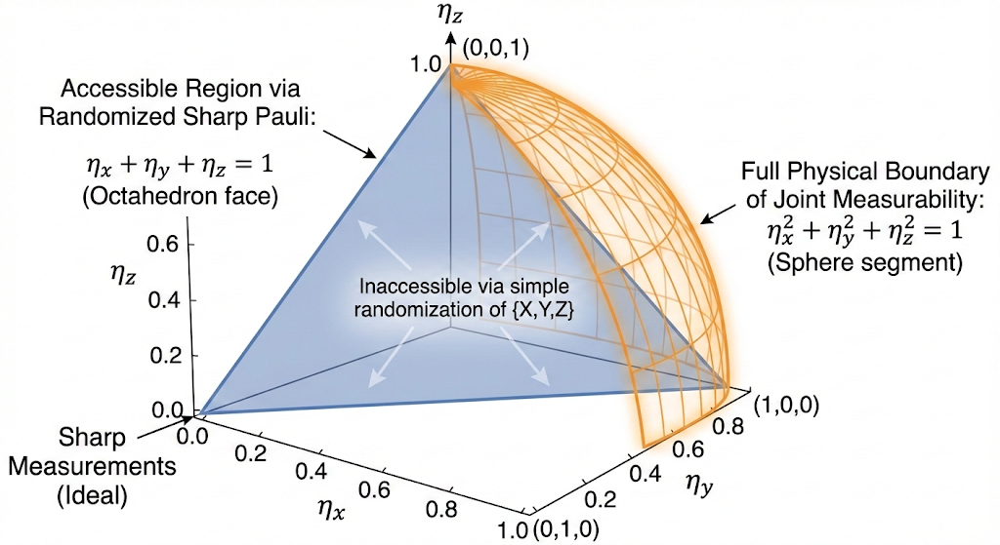

# Summary and Questions

This note develops the quantum resource theory @gour2018resource for the compatibility of quantum instruments.

We will show that:

1. Although sharp Pauli measurements $\{X,Y,Z\}$ are not jointly measurable, unsharp Pauli measurements are jointly measurable.
2. The joint POVMs for unsharp Pauli measurements is equivalent to biased local Clifford classical shadows in the noise-free case.
3. Joint POVMs for unsharp Pauli measurements has advantage in the noisy case.

::: {.callout-important icon="false"}
## Question: 2-Replica Joint Measurability
What if we discuss the JM and find the unsharp version for 2-replica local case $\{I,X,Y,Z\}^{\otimes 2}$? This will introduce a biased 2-replica local strategy. Would this have advantage compared to the 1-replica case?
:::

::: {.callout-tip icon="false" collapse="true"}
## Discussion
- Use SDP to analysis the calculation complexity for some useful subset: $\{(XI)\cdot SWAP,(YI)\cdot SWAP,(ZI)\cdot SWAP,SWAP\}$.
:::

# Compatibility and Joint Measurability

::: {#def-compatibility .callout-note icon="false"}
## Definition: Compatibility
A collection of instruments $\{I_{a|x}\}_{a,x}$ is **compatible** if there exists a single parent instrument $\{\mathcal{M}_\lambda\}_\lambda$ and a conditional probability distribution $p(a|x,\lambda)$ such that
$$
I_{a|x}(\rho) = \sum_\lambda p(a|x, \lambda)\, \mathcal{M}_\lambda(\rho)
$$ {#eq-compatibility}
for all input states $\rho$, settings $x$, and outcomes $a$.
:::

The parent instrument $\mathcal{M}_\lambda$ performs the actual quantum measurement. The setting $x$ only routes the classical label $\lambda$ through the stochastic map $p(a|x,\lambda)$ without ever touching the quantum state again.

::: {#def-joint-measurability .callout-note icon="false"}
## Definition: Joint Measurability
A set of POVMs $\{E_{a|x}\}$ is **jointly measurable** if there exists a parent POVM $\{G_\lambda\}$ such that
$$
E_{a|x} = \sum_\lambda p(a|x,\lambda)\,G_\lambda
$$
:::

We then can prove that this definition is covered by the instrument compatibility.

::: {#lem-instrument-povm .callout-note icon="false"}
## Lemma: Instrument Compatibility Implies Joint Measurability
For entanglement-breaking instruments $I_{a|x}(\rho) = \operatorname{tr}(E_{a|x}\,\rho)\,\sigma_{a|x}$, if the instruments are compatible then the underlying POVMs $\{E_{a|x}\}_a$ are jointly measurable. In particular, the prepared states $\sigma_{a|x}$ play no role: the trace operation annihilates them.
:::

::: {.callout-note collapse="true"}
## Proof (Click to expand)

Assume the instruments are compatible with parent instrument $\mathcal{M}_\lambda$. Take the trace of both sides of @eq-compatibility:
$$
\operatorname{tr}(I_{a|x}(\rho)) = \sum_\lambda p(a|x,\lambda)\,\operatorname{tr}(\mathcal{M}_\lambda(\rho)).
$$
The left side evaluates to $\operatorname{tr}(E_{a|x}\,\rho)\,\operatorname{tr}(\sigma_{a|x}) = \operatorname{tr}(E_{a|x}\,\rho)$ since $\sigma_{a|x}$ is normalized. Writing $\operatorname{tr}(\mathcal{M}_\lambda(\rho)) = \operatorname{tr}(G_\lambda\,\rho)$ for the parent POVM elements $G_\lambda$, we obtain
$$
\operatorname{tr}(E_{a|x}\,\rho) = \operatorname{tr}\!\left(\sum_\lambda p(a|x,\lambda)\,G_\lambda\;\rho\right) \quad \forall\,\rho,
$$
which forces $E_{a|x} = \sum_\lambda p(a|x,\lambda)\,G_\lambda$. This is exactly joint measurability. $\blacksquare$
:::

# Toy Example: $\{X,Y,Z\}$

In this section, we applied the compatibility theory to the toy example of $\{X,Y,Z\}$ set of Pauli measurements.
Given a set of POVMs $M_{(c, \pm)} := \frac{1}{3} |\pm_c\rangle\langle\pm_c|$ where $c \in \{X, Y, Z\}$.
Can we say that $\{M_{(c, \pm)}\}$ constitutes a parent POVMs for $\{E_{a|x}\}$, given $x \in \{X,Y,Z\}$ denotes the measurement setting and $a \in \{+,-\}$ denotes the measurement outcome?
The answer is no!

## Sharp Pauli measurements are not jointly measurable

To get the intuition, we can write, for example,
$$
E_{+|X} = 3 \cdot M_{(X,+)} =\sum_{(c, s)} p(+|X, (c, s))\, M_{(c, s)}, \text{for~} p(+|X, (c, \pm)) =3 \delta_{c,X}\delta_{s, +},
$$
we notice that $p(+|X, (c, \pm)) > 1$ and this is not a valid probability distribution.

::: {#lem-sharp-incompatible .callout-note icon="false"}
## Lemma: Sharp Non-commuting Measurements Are Incompatible
If two instruments have sharp (rank-1 projective) POVM elements $E_{a|x}$ that do not commute, then no parent instrument exists.
:::

::: {.callout-note collapse="true"}
## Proof (Click to expand)

Suppose for contradiction that a parent POVM $\{G_\lambda\}$ exists with $E_{a|x} = \sum_\lambda p(a|x,\lambda)\,G_\lambda$. Consider a rank-1 projector $E_{0|0} = |0\rangle\!\langle 0|$. Since $|0\rangle\!\langle 0|$ is rank-1 and equals a sum of positive operators $p(0|0,\lambda)\,G_\lambda$, every contributing $G_\lambda$ (with $p(0|0,\lambda)>0$) must satisfy $G_\lambda \propto |0\rangle\!\langle 0|$.

Now consider $E_{+|1} = |+\rangle\!\langle +| = \sum_\lambda p(+|1,\lambda)\,G_\lambda$. By the same rank-1 argument, every contributing $G_\lambda$ must satisfy $G_\lambda \propto |+\rangle\!\langle +|$.

For any $\lambda$ where both $p(0|0,\lambda)>0$ and $p(+|1,\lambda)>0$, we need $G_\lambda$ proportional to both $|0\rangle\!\langle 0|$ and $|+\rangle\!\langle +|$ simultaneously. Since these are distinct rank-1 projectors, the only possibility is $G_\lambda = 0$. Repeating for all outcome pairs forces every $G_\lambda = 0$, contradicting $\sum_\lambda G_\lambda = I$. $\blacksquare$
:::

## Unsharp Pauli measurements are jointly measurable

While we proved that $M_{(c, \pm)}$ cannot be a parent POVM for the sharp Pauli measurements, it is the perfect parent POVM for a set of unsharp Pauli measurements, which is defined as:
$$E^{1/3}_{a|x = P} = \frac{\mathbb{I} + a P/3}{2}, P \in \{X, Y, Z\}$$
In this case, for example, we conclude that
$$
E^{1/3}_{+|X} = 1 \cdot M_{(X,+)} + 0 \cdot M_{(X,-)} + 0.5 \sum_{s=\pm} M_{(Y,s)} + 0.5 \sum_{s=\pm} M_{(Z,s)}.
$$
This observation actually has a more general form:

::: {#thm-unsharp-pauli-joint-measurability .callout-important icon="false"}
## Theorem: Unsharp Pauli Measurements Are Jointly Measurable
Define the noisy **unsharp** versions of Pauli measurements as $E^{\eta_x}_{a|x = X} = (1/2)\cdot (\mathbb{I} + a \eta_x X)$, $E^{\eta_y}_{a|x = Y} = (1/2)\cdot (\mathbb{I} + a \eta_y Y )$  and $E^{\eta_z}_{a|x = Z} = (1/2)\cdot (\mathbb{I}+a\eta_z Z)$, with outcomes $a\in \{+,-\}$  and $0 \leq \eta_x, \eta_y, \eta_z \leq 1$.
The triple is jointly measurable if and only if $(\eta_x)^2 + (\eta_y)^2 +(\eta_z)^2 \leq 1$. The corresponding joint measurement, whose marginals are the unsharp Pauli observables, is  $G(x, y, z) = \frac{1}{8}(\mathbb{I} + x\eta_x X + y\eta_y Y + z\eta_z Z)$.
:::

::: {.callout-note collapse="true"}
## Proof (Click to expand)

**Step 1: Normalization (Sufficiency)**
To be a valid POVM, the elements must sum to the identity matrix. Summing over all 8 possible outcomes $(x,y,z \in \{+,-\})$:
$$\sum_{x,y,z} G(x,y,z) = \frac{1}{8} \sum_{x,y,z} (\mathbb{I} + x\eta_x X + y\eta_y Y + z\eta_z Z)$$
Because $\sum_{x \in \{+,-\}} x = 0$ (and similarly for $y$ and $z$), all the Pauli terms perfectly cancel out. Since there are $2^3 = 8$ terms in the sum, we get the identity matrix $\mathbb{I}$.

**Step 2: Positivity (Sufficiency)**
A valid POVM requires $G(x,y,z) \geq 0$. To find the eigenvalues of $G(x,y,z)$, we first look at the Pauli sum $M = x\eta_x X + y\eta_y Y + z\eta_z Z$.
Because the Pauli matrices anticommute ($\{X,Y\}=0$, etc.), squaring $M$ gives:
$$M^2 = (x^2\eta_x^2 + y^2\eta_y^2 + z^2\eta_z^2)\mathbb{I} = (\eta_x^2 + \eta_y^2 + \eta_z^2)\mathbb{I}$$
This means the eigenvalues of $M$ are $\pm \sqrt{\eta_x^2 + \eta_y^2 + \eta_z^2}$.
Therefore, the eigenvalues of $G(x,y,z)$ are:
$$\lambda_{\pm} = \frac{1}{8} \left( 1 \pm \sqrt{\eta_x^2 + \eta_y^2 + \eta_z^2} \right)$$
For $G(x,y,z) \geq 0$, the minimum eigenvalue must be non-negative. This shows that if $\eta_x^2 + \eta_y^2 + \eta_z^2 \leq 1$, the constructed $G(x,y,z)$ is strictly positive semi-definite.

**Step 3: Recovering the Marginals (Sufficiency)**
To find the marginal probability of measuring $x$, we sum over the other variables $y$ and $z$:
$$\sum_{y,z} G(x,y,z) = \frac{1}{8} \sum_{y,z} (\mathbb{I} + x\eta_x X + y\eta_y Y + z\eta_z Z)$$
Again, the $y$ and $z$ terms cancel out. There are $2^2 = 4$ terms in this sum, leaving:
$$ \frac{1}{8} (4\mathbb{I} + 4x\eta_x X) = \frac{1}{2}(\mathbb{I} + x\eta_x X) = E^{\eta_x}_{a|x = X}$$
By symmetry, summing over the other pairs identically recovers $E^{\eta_y}_{a|x = Y}$ and $E^{\eta_z}_{a|x = Z}$. This completes the "if" direction.

**Step 4: Necessity (The "Only If" direction)**
Arbitrary POVM on single qubits can be coarse-grained to $M(x, y, z)$ as a 8-outcome measurement.
Suppose there exists an arbitrary joint measurement $M(x,y,z) \geq 0$ yielding the correct unsharp Pauli marginals.
We can construct a symmetrized POVM $\widetilde{M}(x,y,z)$ by applying the transformations of the Pauli group that independently flip the signs of $X, Y,$ and $Z$.
Thus all non-Pauli cross-terms vanish and $M$ reduces to $G(x,y,z)$ with parameters $\eta_x, \eta_y, \eta_z$.
As shown in Step 2, $G(x,y,z) \geq 0$ inevitably requires $\eta_x^2 + \eta_y^2 + \eta_z^2 \leq 1$. This proves the necessity. $\blacksquare$
:::

## Realization of joint measurement

One concern is, how to implement the $8$-outcome joint measurement $G(x, y, z)$?
The answer is, we can implement it by randomly choosing for local non-Pauli basis. To show this, we first noted that it is sufficient to consider the case $\eta_x^2+\eta_y^2+\eta_z^2 = 1$ since the general case can be obtained by mixing these realizations with random guessing.
In the case $\eta_x^2+\eta_y^2+\eta_z^2 = 1$, we can implement the 8-outcome measurement $G(x, y, z) = \frac{1}{8}(\mathbb{I} + x\eta_x X + y\eta_y Y + z\eta_z Z)$ by randomly choosing for local non-Pauli basis.
Instead of a single 8-outcome measurement, your physical hardware performs a two-step randomized procedure:

::: {.callout-note icon="false"}
## Algorithm (Joint measurement implementation)
1. Roll a 4-sided die to pick an axis $j \in \{1, 2, 3, 4\}$ with probability $p_j = 1/4$.
2. Measure the projective observable $P_j(\pm) = \frac{1}{2}(I \pm e_j \cdot \sigma)$ to get a physical outcome $s' \in \{+1, -1\}$, where $e_j$ are shown below.
3. Output the result $(x,y,z)$ based on the die roll $j$ and the physical outcome $s'$:
    - If the die rolls $j=1$, where $e_1 = (\eta_x, \eta_y, \eta_z)$:
        - If measured $s' = +1 \implies$ Output $(x,y,z) = (+1, +1, +1)$
        - If measured $s' = -1 \implies$ Output $(x,y,z) = (-1, -1, -1)$
    - If the die rolls $j=2$, where $e_2 = (\eta_x, \eta_y, -\eta_z)$:
        - If measured $s' = +1 \implies$ Output $(x,y,z) = (+1, +1, -1)$
        - If measured $s' = -1 \implies$ Output $(x,y,z) = (-1, -1, +1)$
    - If the die rolls $j=3$, where $e_3 = (\eta_x, -\eta_y, \eta_z)$:
        - If measured $s' = +1 \implies$ Output $(x,y,z) = (+1, -1, +1)$
        - If measured $s' = -1 \implies$ Output $(x,y,z) = (-1, +1, -1)$
    - If the die rolls $j=4$, where $e_4 = (\eta_x, -\eta_y, -\eta_z)$:
        - If measured $s' = +1 \implies$ Output $(x,y,z) = (+1, -1, -1)$
        - If measured $s' = -1 \implies$ Output $(x,y,z) = (-1, +1, +1)$
:::

We note that the randomized implementation of $G(x, y, z)$ is similar to the locally-biased classical shadow.
Consider the case we randomly choose a Pauli basis from $\{X,Y,Z\}$ with probability $p_x, p_y, p_z$ such that $p_x + p_y + p_z = 1$ and then measure the Pauli observable respectively.
By steps below:

::: {.callout-note icon="false"}
## Algorithm (Locally-biased classical shadow)
- If the die rolls $x$:
    - If measured $s' = +1 \implies$ Output $(x,y,z) = (+1, \pm 1, \pm 1)$ with $1/4$ probability
    - If measured $s' = -1 \implies$ Output $(x,y,z) = (-1, \pm 1, \pm 1)$ with $1/4$ probability
- If the die rolls $y$:
    - If measured $s' = +1 \implies$ Output $(x,y,z) = (\pm 1, +1, \pm 1)$ with $1/4$ probability
    - If measured $s' = -1 \implies$ Output $(x,y,z) = (\pm 1, -1, \pm 1)$ with $1/4$ probability
- If the die rolls $z$:
    - If measured $s' = +1 \implies$ Output $(x,y,z) = (\pm 1, \pm 1, +1)$ with $1/4$ probability
    - If measured $s' = -1 \implies$ Output $(x,y,z) = (\pm 1, \pm 1, -1)$ with $1/4$ probability
:::

We can realize the joint measurement:
$$
G(x,y,z) = \frac{1}{4} p_x \left(\frac{\mathbb{I} + xX}{2}\right) + \frac{1}{4} p_y \left(\frac{\mathbb{I} + yY}{2}\right) + \frac{1}{4} p_z \left(\frac{\mathbb{I} + zZ}{2}\right).
$$

## Unsharpness vs. variance

After proving that $E^{\eta_x}_{a|X}, E^{\eta_y}_{a|Y}, E^{\eta_z}_{a|Z}$ are jointly measurable, we want to use $N$ times of joint measurement results $\{(x_i,y_i,z_i)\}_{i=1}^N$ to estimate $\{\mathrm{tr}(\rho X), \mathrm{tr}(\rho Y), \mathrm{tr}(\rho Z)\}$. Note that

$$
E^{\eta_x}_{+|X} - E^{\eta_x}_{-|X} = \eta_x X,\quad E^{\eta_y}_{+|Y} - E^{\eta_y}_{-|Y} = \eta_y Y,\quad E^{\eta_z}_{+|Z} - E^{\eta_z}_{-|Z} = \eta_z Z.
$$
This means that $\mathrm{tr}(\rho X) = \eta_x^{-1}\sum_{i=1}^N (-1)^{x_i}$ with second moment $\eta_x^{-2}$ and so on so forth for $y,z$ tags.

We comparing this second moment with that of classical shadow in estimating $\{X,Y,Z\}$ on single qubit. The average channel is satisfied $\Lambda^{-1,\dagger}(X) = {p_x}^{-1} X$ and estimator $\mathrm{tr}(\Lambda^{-1,\dagger}(X) U^\dagger\ket{b}\!\bra{b}U) = {p_x}^{-1} \delta_{U,H}$. The second moment is $p_x \cdot p_x^{-2} = p_x^{-1}$.

Therefore, even if we implement the same strategy as described in Algorithm (Locally-biased classical shadow) with $p_x,p_y,p_z$, the joint measurement  method use worse post-processing strategy such that its variance counts $p_x^{-2}$ while the classical shadow counts $p_x^{-1}$.

However, given a set of observables $\{O_i\}_{i=1}^L$ that can be efficiently estimated by certain classical shadow strategy, there must exists a joint measurement method that reach the same efficiency. This means that a better 6-outcomes joint measurement strategy exists:
$$
\mathcal{G}_{\text{CS}} = \{p_x \frac{\mathbb{I} \pm X}{2}, p_y \frac{\mathbb{I} \pm Y}{2}, p_z \frac{\mathbb{I} \pm Z}{2}\} \to \{(x,\pm),(y,\pm),(z,\pm)\}
$$

# Toy Example: $\{P,Q\}$

Consider the simplest observable set $\mathcal{O} = \{P,Q\}$ where $P,Q$ are both Pauli observables. Estimation of those two observables correspond to two-outcome POVMs $\{M_1 := \mathbb{I} - M_0, M_0\}$ and $\{N_1 := \mathbb{I} - N_0, N_0\}$ given $M_0 = \frac{\mathbb{I} - P}{2}$ and $N_0 = \frac{\mathbb{I} + Q}{2}$ (so outcome index $0$ for $P$ corresponds to the $-1$ eigenstate, while outcome index $0$ for $Q$ corresponds to the $+1$ eigenstate; this asymmetric labeling is chosen so that the first-index of $G_{j,k}$ is the $P$-direction and the dual discrimination states take the form $\rho^{(M)}_j \propto \mathbb{I}+(-1)^{j+1}P$, consistent with the SDP dual below).

## Homogeneous compatibility robustness and its SDP form

In the previous section, we notice that although sharp Pauli measurements are not jointly measurable, unsharp Pauli measurements are jointly measurable.
This inspires @heinosaari2015noise to define a rigorous measure for compatibility on arbitrary operator set $\{O_k\}_{k=1}^L$ by mixing $O_k$ with $\mathbb{I}$.
The existence of joint measurement then reduced to the existence of $G_{j,k}$ such that

::: {#lem-comp2SDP .callout-note icon="false"}
## Lemma: Compatibility Robustness to SDP
Given two Pauli observables $\mathcal{O} = \{P,Q\}$ and real symmetric 2 × 2 matrix $\mathbf{a}= (a_{ij}\geq 0)$ with positive elements and  $\mu > 0$ is a small positive number. There exist joint measurement for unsharp Pauli measurements $\{E_{P}(\mathbf{a}), \mathbb{I} - E_{P}(\mathbf{a}) \}$ and $\{E_{Q}(\mathbf{a}), \mathbb{I} - E_{Q}(\mathbf{a}) \}$ with
$$
\begin{align*}
&E_{P}(\mathbf{a}) =\frac{1 + 2 \mu (a_{11} + a_{10})}{1 + \mu \sum_{ij} a_{ij}} \frac{\mathbb{I}}{2} + \frac{1}{1 + \mu \sum_{ij} a_{ij}} \frac{P}{2}\\
&E_{Q}(\mathbf{a}) =\frac{1 + 2 \mu (a_{11} + a_{10})}{1 + \mu \sum_{ij} a_{ij}} \frac{\mathbb{I}}{2} + \frac{1}{1 + \mu \sum_{ij} a_{ij}} \frac{Q}{2}
\end{align*}
$$
if and only if there exist a four matrix  $\{G_{00}, G_{01}, G_{10}, G_{11}\}$ such that
$$
\begin{align}
& \sum_{k} G_{j,k} = M_j, \quad \sum_{j} G_{j,k} = N_k, \quad G_{j,k} + \mu a_{j,k} \mathbb{I} \geq 0.
\end{align}
$${#eq-restriction}
:::

::: {.callout-note collapse="true"}
## Proof (Click to expand)
The $\Leftarrow$ direction:
Construct matrix $R_{j,k} = \frac{G_{j,k} + \mu a_{j,k} \mathbb{I}}{1 + \mu \sum_{ij} a_{ij}}$, then we have
$$
\begin{align}
&\sum_{j,k} R_{j,k} = \mathbb{I},\quad \sum_{k} R_{0,k} = E_{P}(\mathbf{a}), \quad \sum_{j} R_{j,0} = E_{Q}(\mathbf{a}), R_{j,k} \geq 0.
\end{align}
$$
This is a valid POVM.
The $\Rightarrow$ direction is trivial.
:::

We note that:

- In the homogeneous case, i.e. $a_{ij} = a$ for all $i,j$, the above condition reduced to @thm-unsharp-pauli-joint-measurability above.
- In the case of $\mu = 0$, the unsharp Pauli measurements reduces to the sharp Pauli measurements no matter how the value of $a_{ij}$ is.

Thus the sharpest measurement is achieved by the optimization problem $\min_{G_{j,k}} \mu$ subject to @eq-restriction given a fixed $a_{j,k}>0$, and then take the minimum over all $a_{j,k}>0$ to get the sharpest measurement.
$$
\boxed{
\begin{align*}
\text{Minimize:} \quad & \mu \\
\text{Subject to:} \quad & \sum_{k=0}^1 G_{j,k} = M_j \quad \forall j \in \{0,1\} \\
& \sum_{j=0}^1 G_{j,k} = N_k \quad \forall k \in \{0,1\} \\
& G_{j,k} + \mu a_{j,k} \mathbb{I} \geq 0 \quad \forall j,k \in \{0,1\}
\end{align*}
}
$$ {#eq-optimization}

Here $M_0 = \frac{\mathbb{I} - P}{2}, M_1 = \frac{\mathbb{I} + P}{2}$, $N_0 = \frac{\mathbb{I} + Q}{2}, N_1 = \frac{\mathbb{I} - Q}{2}$.

::: {#lem-optimization-dual .callout-note icon="false"}
## Lemma: Optimization Dual
The dual problem of @eq-optimization is:
$$
\begin{align}
\mu = \text{Maximize:} \quad & -\sum_{j=0}^1 \text{Tr}(A_j M_j) - \sum_{k=0}^1 \text{Tr}(B_k N_k) \\
\text{Subject to:} \quad & A_j + B_k \geq 0 \quad \forall j,k \in \{0,1\} \\
& \sum_{j,k \in \{0,1\}} a_{j,k} \text{Tr}(A_j + B_k) = 1 \\
& A_j, B_k \text{ are Hermitian matrices}
\end{align}
$${#eq-dual-optimization}
By strong duality (Slater's condition holds since $G_{j,k} = \frac{1}{4}\mathbb{I}$, $\mu = \max_{j,k}(d^{-1}/a_{j,k})$ is strictly feasible), the dual optimal equals the primal optimal $\mu \geq 0$.
:::

::: {.callout-note collapse="true"}
## Proof (Click to expand)
To find the dual, we introduce Lagrange multipliers (dual variables) for each constraint: (i) Hermitian matrices $X_j$ for the marginal constraints on $P$, (ii) Hermitian matrices $Y_k$ for the marginal constraints on $Q$, (iii) Positive Semi-Definite (PSD) matrices $Z_{j,k} \geq 0$ for the inequality constraints.The Lagrangian $L(G, \mu, X, Y, Z)$ is:
$$
L = \mu + \sum_{j=0}^1 \text{Tr}\left[X_j \left( M_j - \sum_k G_{j,k} \right)\right] + \sum_{k=0}^1 \text{Tr}\left[Y_k \left( N_k - \sum_j G_{j,k} \right)\right] - \sum_{j,k} \text{Tr}\left[Z_{j,k} \left( G_{j,k} + \mu a_{j,k} \mathbb{I} \right)\right]
$$
Let's rearrange the terms to isolate the primal variables $G_{j,k}$ and $\mu$:
$$
L = \mu \left( 1 - \sum_{j,k} a_{j,k} \text{Tr}[Z_{j,k}] \right) - \sum_{j,k} \text{Tr}\left[ G_{j,k} (X_j + Y_k + Z_{j,k}) \right] + \sum_j \text{Tr}[X_j M_j] + \sum_k \text{Tr}[Y_k N_k]
$$

The dual objective function $g(X, Y, Z)$ is found by taking the infimum of $L$ over the unconstrained primal variables $G_{j,k}$ and $\mu$. To prevent the infimum from going to $-\infty$, the coefficients attached to $G_{j,k}$ and $\mu$ must exactly equal zero:
$$
\begin{align}
&1 - \sum_{j,k} a_{j,k} \text{Tr}[Z_{j,k}] = 0 \implies \sum_{j,k} a_{j,k} \text{Tr}[Z_{j,k}] = 1,\\
&X_j + Y_k + Z_{j,k} = 0 \implies Z_{j,k} = -(X_j + Y_k)
\end{align}
$$
By setting $A_j = -X_j$ and $B_k = -Y_k$, and use the fact that $Z_{j,k} \geq 0$, we get the dual problem:
$$
\begin{align}
\mu =\max_{A_j, B_k} & -\sum_{j=0}^1 \text{Tr}(A_j M_j) - \sum_{k=0}^1 \text{Tr}(B_k N_k) \\
\text{Subject to:} \quad & A_j + B_k \geq 0 \quad \forall j,k \in \{0,1\} \\
& \sum_{j,k \in \{0,1\}} a_{j,k} \text{Tr}(A_j + B_k) = 1 \\
& A_j, B_k \text{ are Hermitian matrices}
\end{align}
$$
:::

## Inhomogeneous compatibility robustness to SDP

It is unnecessary to always use $\mathbb{I}$ mixedness to cancel the non-compatibility. In @skrzypczyk2019all, the authors use arbitrary $N_{a|x}$ mixed with $M_{a|x}$ to cancel the non-compatibility:
$$
\begin{align*}
r N_{a|x} + M_{a|x} &= (1 + r)\sum_{\lambda} p(a|x,\lambda) G_\lambda, \forall a,x.\\
 &\Rightarrow (1 + r)\sum_{\lambda} p(a|x,\lambda) G_\lambda \geq M_{a|x} \quad \forall a,x.
\end{align*}
$$
In our case, $x = P,Q$ and $a = +1,-1$. Thus $G_{\lambda}$ can be coarse-grained into $G_{00}, G_{01}, G_{10}, G_{11}$ as: $G_{j,k} = \sum_\lambda p(a_P=j, a_Q=k | \lambda) G_\lambda$, where,
$$
\begin{align*}
p(a|P, \lambda) = \sum_{a_Q \in \{0, 1\}} p(a_P = a, a_Q | \lambda),  \quad p(a|Q, \lambda) = \sum_{a_P \in \{0, 1\}} p(a_P, a_Q = a | \lambda).
\end{align*}
$$
Then
$$
\begin{align*}
\sum_\lambda p(a|P, \lambda) G_\lambda &= \sum_\lambda \left( \sum_{a_Q} p(a, a_Q | \lambda) \right) G_\lambda \\
&= \sum_{a_Q} \left( \sum_\lambda p(a, a_Q | \lambda) G_\lambda \right) = \sum_{a_Q} G_{a, a_Q}.
\end{align*}
$$
By denoting the super-normalization factor as $s = 1+r$ and defining the super-normalized POVM elements $\tilde{G}_{ij} = s G_{ij}$ , we can completely eliminate $\lambda$ and formulate the exact Primal SDP for the Robustness of Incompatibility:
$$
\boxed{
\begin{align*}
\text{Minimize:} \quad & s \\
\text{Subject to:} \quad & \sum_{k = 0}^{1}\tilde{G}_{j,k} \geq M_{j} \quad \forall j \in \{0,1\} \\
& \sum_{j = 0}^{1}\tilde{G}_{j,k} \geq N_{k} \quad \forall k \in \{0,1\} \\
& \sum_{i,j \in \{0,1\}} \tilde{G}_{ij} = s\mathbb{I} \\
& \tilde{G}_{ij} \geq 0 \quad \forall i,j \in \{0,1\}
\end{align*}
}
$$
Once the SDP is solved for $s^*$, the minimum noise robustness is directly obtained as $r^* = s^* - 1$.

::: {#lem-dual-discrimination .callout-note icon="false"}
## Lemma: Dual Discrimination
By finding the dual problem, the generalized compatibility robustness of $\{P,Q\}$ is equivalent to the problem of finding the best mixed ensemble $\mathcal{E} = \mathcal{E}_P = \{\rho_0,\rho_1\} \cup \mathcal{E}_Q := \{\sigma_0,\sigma_1\}$ such that:

- (i). Given $P,Q$ specified, using the $\{M_0, M_1\}$ or $\{N_0, N_1\}$ measurements to discriminate the index $0$ or $1$.
- (ii). Without getting the information that the state is coming from $\mathcal{E}_P$ or $\mathcal{E}_Q$, distinguish index $0$ or $1$.

Case (i) has $1 +s^*$ times better success rate than case (ii).
:::

::: {.callout-note collapse="true"}
## Proof (Derivation of General RoI Dual)
We introduce Lagrange multipliers: positive semi-definite (PSD) matrices $A_j \geq 0$ and $B_k \geq 0$ for the inequality constraints ($\sum \tilde{G} \geq M_j$ and $\sum \tilde{G} \geq N_k$), a Hermitian matrix $W$ for the equality constraint $\sum \tilde{G}_{j,k} = s\mathbb{I}$, and PSD matrices $Z_{j,k} \geq 0$ for the positivity $\tilde{G}_{j,k} \geq 0$.
The Lagrangian $L(\tilde{G}, s, A, B, W, Z)$ is formulated by relaxing the constraints:

$$
\begin{align*}
L = s &+ \sum_{j=0}^1 \text{Tr}\left[A_j \left( M_j - \sum_k \tilde{G}_{j,k} \right)\right] + \sum_{k=0}^1 \text{Tr}\left[B_k \left( N_k - \sum_j \tilde{G}_{j,k} \right)\right] \\
&+ \text{Tr}\left[W \left( \sum_{j,k} \tilde{G}_{j,k} - s \mathbb{I} \right)\right] - \sum_{j,k} \text{Tr}\left[Z_{j,k} \tilde{G}_{j,k}\right]
\end{align*}
$$
Rearranging terms to isolate the unconstrained primal variables $s$ and $\tilde{G}_{j,k}$:

$$
\begin{align*}
L = s \big( 1 - \text{Tr}[W] \big) &+ \sum_{j,k} \text{Tr}\left[ \tilde{G}_{j,k} (W - A_j - B_k - Z_{j,k}) \right] \\
&+ \sum_j \text{Tr}[A_j M_j] + \sum_k \text{Tr}[B_k N_k]
\end{align*}
$$
To find the dual objective function, we take the infimum of $L$ over the unconstrained variables $s$ and $\tilde{G}_{j,k}$:

1. For $s$ (unconstrained), we must have $1 - \text{Tr}[W] = 0 \implies \text{Tr}(W) = 1$.
2. For $\tilde{G}_{j,k}$ (unconstrained), we must have $W - A_j - B_k - Z_{j,k} = 0 \implies Z_{j,k} = W - A_j - B_k$.
3. Since $Z_{j,k} \geq 0$, this implies $A_j + B_k \leq W$.
Because $A_j \geq 0$ and $B_k \geq 0$ inherently from the primal inequality constraints, we naturally get $W \geq A_j + B_k \geq 0$. Since $W$ is positive semi-definite and $\text{Tr}(W) = 1$, $W$ is strictly a valid density matrix!
According to weak duality, the dual problem maximizes this infimum. This yields the beautiful and clean dual problem:

$$
\boxed{
\begin{align*}
\text{Maximize:} \quad & \sum_{j=0}^1 \text{Tr}(A_j M_j) + \sum_{k=0}^1 \text{Tr}(B_k N_k) \\
\text{Subject to:} \quad & A_j + B_k \leq W \quad \forall j,k \in \{0,1\} \\
& A_j \geq 0, \quad B_k \geq 0 \quad \forall j,k \in \{0,1\} \\
& \text{Tr}(W) = 1 \\
& A_j, B_k, W \text{ are Hermitian matrices}
\end{align*}
}
$$

Surprisingly, we will find that the dual problem is equivalent to a quantum state discrimination problem under the restriction that only $P,Q$ measurements are allowed.
 To see this, we set up mixed ensemble $\mathcal{E}$ as:

- Mixed set $\{\rho^{(M)}_j = \frac{A_j}{\text{Tr}(A_j)}\}_{j=0}^1$ and $\{\rho^{(N)}_k = \frac{B_k}{\text{Tr}(B_k)}\}_{k=0}^1$.
- A classical distribution on each mixed state $p(M, j) = \frac{\text{Tr}(A_j)}{N^*}, \quad p(N, k) = \frac{\text{Tr}(B_k)}{N^*}$, with $N^* = \sum_{j=0}^1 \text{Tr}(A_j) + \sum_{k=0}^1 \text{Tr}(B_k)$.

Question left is how to re-interpret the restriction $A_i + B_k \leq W$ and $\mathrm{tr}(W) < 1$ in terms of the properties of those two mixed state ensembles.

Consider the case Alice implement a unified POVMs $G_{j,k}$ with $j,k$ as the index indicates state for ensemble $\mathcal{M}$ and $\mathcal{N}$ respectively.
Using the fact $A_j = N^* p(M,j) \rho^{(M)}_j$ and $B_k = N^* p(N,k) \rho^{(N)}_k$, the success rate is:
$$
\begin{align*}
P_{\text{succ}}^{\text{comp}} = \sum_{j,k} \left[ p(M,j) \mathrm{tr}(\rho^{(M)}_j G_{j,k}) + p(N,k) \mathrm{tr}(\rho^{(N)}_k G_{j,k}) \right] \\
= \sum_{j,k} \mathrm{tr} \left[ \left( \frac{A_j}{N^*} + \frac{B_k}{N^*} \right) G_{j,k} \right] = \frac{1}{N^*} \sum_{j,k} \mathrm{tr} \left[ (A_j + B_k) G_{j,k} \right]\\
 \leq \frac{1}{N^*} \sum_{j,k} \mathrm{tr} \left[ W G_{j,k} \right] = \frac{1}{N^*}.
\end{align*}
$$
Thus, the two restrictions can be rewritten as the statement of $N^*$-hardness:

 **Without getting the information that the state is coming from $\mathcal{M}$ or $\mathcal{N}$, nobody can distinguish index $j,k$ with probability better than $\frac{1}{N^*}$.**

Now, we can set up a communication game as finding the best mixed state in the mixed ensemble $\mathcal{E}$ that Alice have maximal winning probability.

- Bob prepares ensemble $\mathcal{E}$ that has the $N^*$-hardness.
- Bob sends the prepared quantum state to Alice, and tells Alice which ensemble the state belongs to (i.e., tells her the label is $M$ or $N$), but not the specific index ($j$ or $k$).
- Based on the side-information $\{M,N\}$, Alice implement $\{M_0, M_1\}$ or $\{N_0, N_1\}$ measurements to discriminate the index $j$ or $k$. In other word:
    - When Bob tells her that the state comes from ensemble $M$, she uses device $M$ to measure, and if the result is $j$, she guesses $j$.
    - When Bob tells her that the state comes from ensemble $N$, she uses device $N$ to measure, and if the result is $k$, she guesses $k$.

Her winning probability counts:
$$
\begin{align*}
P_{\text{succ}}^{\text{incomp}} &= \sum_j p(M, j) \text{Tr}(\rho^{(M)}_j M_j) + \sum_k p(N, k) \text{Tr}(\rho^{(N)}_k N_k) \\
&= \sum_j \frac{\text{Tr}(A_j)}{N^*} \text{Tr}\left( \frac{A_j}{\text{Tr}(A_j)} M_j \right) + \sum_k \frac{\text{Tr}(B_k)}{N^*} \text{Tr}\left( \frac{B_k}{\text{Tr}(B_k)} N_k \right) \\
&= \frac{1}{N^*} \left[ \sum_j \text{Tr}(A_j M_j) + \sum_k \text{Tr}(B_k N_k) \right] = \frac{1 + s^*}{N^*},
\end{align*}
$$
which is exactly the maximized function of the dual problem.
:::

::: {.callout-important icon="false"}
## Question: Discrimination Hardness Under Restricted Measurements
We notice that in previous research, the hardness to estimate a set of Pauli observables $\{P_i\}_{i=1}^L$ is related to the discrimination problem $\{\rho_i = \frac{\mathbb{I} + 3\varepsilon P_i}{2^n}\}_{i=1}^L$. Can we show that the discrimination problem $\{\rho_i = \frac{\mathbb{I} + 3\varepsilon P_i}{2^n}\}_{i=1}^L$ is indeed hardest in the case only $P,Q$ measurement are allowed?
:::

:::{#lem-opt_distasks .callout-important icon="false"}
## Lemma: Optimal Discrimination Tasks
Given $n$-qubit anticommuting Pauli observables $P,Q$ ($\{P,Q\}=0$), the optimal discrimination tasks are $\mathcal{E}_{P} = \{\frac{\mathbb{I} \pm 3\varepsilon P}{2^n}\}$ and $\mathcal{E}_{Q} = \{\frac{\mathbb{I} \pm 3\varepsilon Q}{2^n}\}$ for $\varepsilon \in [0,1/3]$, with generalized compatibility robustness
$$
s^*(\varepsilon) = \frac{2(1+3\varepsilon)}{2 + 3\sqrt{2}\,\varepsilon}.
$$
The maximum is achieved at $\varepsilon = 1/3$ (eigenspace projectors), giving $s^* = 4 - 2\sqrt{2}$.
:::
::: {.callout-note collapse="true"}
## Proof (Click to expand)

**Step 1: Reduction to effective single-qubit problem.**
Since $\{P,Q\}=0$, there exists a Clifford unitary $U$ such that $UPU^\dagger = X_1 \otimes \mathbb{I}_{\text{rest}}$ and $UQU^\dagger = Z_1 \otimes \mathbb{I}_{\text{rest}}$. The dual SDP is unitarily invariant, so we work in this frame. Averaging the dual variables over the $(n-1)$-qubit Pauli group on qubits $2,\ldots,n$ (which preserves the objective by convexity) projects onto the factorized form
$$
A_j = a_j \otimes \frac{\mathbb{I}_{2^{n-1}}}{2^{n-1}},\quad B_k = b_k \otimes \frac{\mathbb{I}_{2^{n-1}}}{2^{n-1}}, \quad W = w \otimes \frac{\mathbb{I}_{2^{n-1}}}{2^{n-1}},
$$
where $a_j, b_k, w$ are effective single-qubit operators with $\text{Tr}(w) = 1$.
Since $M_j = \frac{\mathbb{I}_2 \pm X}{2}\otimes \mathbb{I}_{\text{rest}}$, the traces factor: $\text{Tr}(A_j M_j) = \text{Tr}_1(a_j m_j)$ with $m_j = \frac{\mathbb{I}_2 \pm X}{2}$, and similarly for $B_k, N_k$. The constraints $A_j + B_k \leq W$ also reduce to $a_j + b_k \leq w$. Thus the $n$-qubit dual SDP is equivalent to the single-qubit dual SDP with effective variables $(a_j, b_k, w)$.

**Step 2: Symmetry reduction.**
Applying the single-qubit Pauli group symmetry: conjugation by $Z$ flips $X \to -X$, swapping $m_0 \leftrightarrow m_1$; combined with relabeling $a_0 \leftrightarrow a_1$ this forces $a_j \in \text{span}\{\mathbb{I}_2, X\}$. Similarly $b_k \in \text{span}\{\mathbb{I}_2, Z\}$ and $w = \mathbb{I}_2/2$. Write:
$$
a_0 = \tfrac{1}{2}(\alpha\mathbb{I}_2 - \gamma X),\; a_1 = \tfrac{1}{2}(\alpha\mathbb{I}_2 + \gamma X),\; b_0 = \tfrac{1}{2}(\beta\mathbb{I}_2 + \delta Z),\; b_1 = \tfrac{1}{2}(\beta\mathbb{I}_2 - \delta Z),
$$
with $\alpha \geq \gamma \geq 0$ and $\beta \geq \delta \geq 0$.

**Step 3: Objective and constraints.**
Using $\text{Tr}(X^2) = \text{Tr}(\mathbb{I}_2) = 2$ and $\text{Tr}(X) = 0$:
$$
\text{Tr}_1(a_0 m_0) = \frac{1}{4}\text{Tr}\big((\alpha\mathbb{I} - \gamma X)(\mathbb{I} - X)\big) = \frac{\alpha+\gamma}{2},
$$
and similarly for the other three terms. The dual objective is $s^* = (\alpha+\gamma) + (\beta+\delta)$.

For the constraint $a_j + b_k \leq \mathbb{I}_2/2$, the tightest case is:
$$
a_0 + b_0 = \tfrac{1}{2}\big((\alpha+\beta)\mathbb{I} - \gamma X + \delta Z\big).
$$
Since $\{X,Z\}=0$, we have $(-\gamma X+\delta Z)^2 = (\gamma^2+\delta^2)\mathbb{I}$, giving eigenvalues $\pm\sqrt{\gamma^2+\delta^2}$. The constraint becomes:
$$
\alpha + \beta + \sqrt{\gamma^2+\delta^2} \leq 1.
$$

**Step 4: Optimization.**
Maximize $(\alpha+\gamma) + (\beta+\delta)$ subject to $\alpha+\beta+\sqrt{\gamma^2+\delta^2} \leq 1$ with $\alpha \geq \gamma \geq 0$, $\beta \geq \delta \geq 0$. Increasing $\gamma$ by $\varepsilon'$ costs only $\frac{\gamma}{\sqrt{\gamma^2+\delta^2}}\varepsilon' \leq \varepsilon'$ in the constraint (via reducing $\alpha$), while gaining $\varepsilon'$ in the objective. So it is optimal to set $\gamma = \alpha$ and $\delta = \beta$.

At the boundary, we maximize $2(\gamma+\delta)$ subject to $\gamma + \delta + \sqrt{\gamma^2+\delta^2} \leq 1$. By Cauchy--Schwarz, $\sqrt{\gamma^2+\delta^2} \geq (\gamma+\delta)/\sqrt{2}$ with equality iff $\gamma = \delta$. Setting $\gamma = \delta$:
$$
\gamma(2+\sqrt{2}) \leq 1 \implies \gamma = \frac{1}{2+\sqrt{2}}, \quad s^* = 4\gamma = \frac{4}{2+\sqrt{2}} = 4 - 2\sqrt{2}.
$$

**Step 5: Identification with $3\varepsilon$ parametrization.**
At the optimum, $\alpha = \gamma = \beta = \delta = \frac{1}{2+\sqrt{2}}$. The effective single-qubit discrimination states are $\frac{\mathbb{I}_2 \pm X}{2}$, so the $n$-qubit discrimination states from @lem-dual-discrimination are:
$$
\rho^{(M)}_j = \frac{\mathbb{I}_2 + (-1)^{j+1} X}{2} \otimes \frac{\mathbb{I}_{2^{n-1}}}{2^{n-1}} = \frac{\mathbb{I}_{2^n} + (-1)^{j+1} P}{2^n},
$$
and similarly $\rho^{(N)}_k = \frac{\mathbb{I}_{2^n} + (-1)^{k} Q}{2^n}$.
More generally, for sharpness parameter $\eta = 3\varepsilon \in [0,1]$, the states are $\frac{\mathbb{I} \pm 3\varepsilon P}{2^n}$ and $\frac{\mathbb{I} \pm 3\varepsilon Q}{2^n}$, giving:
$$
s^*(\varepsilon) = \frac{2(1+3\varepsilon)}{2+3\sqrt{2}\,\varepsilon}.
$$
Since $\frac{ds^*}{d\varepsilon} = \frac{6(2-\sqrt{2})}{(2+3\sqrt{2}\,\varepsilon)^2} > 0$, the robustness is strictly increasing in $\varepsilon$. The maximum at $\varepsilon = 1/3$ gives $s^* = 4 - 2\sqrt{2}$, confirming that the discrimination problem $\mathcal{E}_P = \{\frac{\mathbb{I} \pm 3\varepsilon P}{2^n}\}$ is indeed hardest at maximal sharpness. Note that $s^*$ is independent of $n$: the Hilbert space dimension cancels in the reduction to the effective single-qubit problem. $\blacksquare$
:::

## Post-processing and realization in the generalized robustness case

t.b.c.

# Hamiltonian Estimation with Unsharp Pauli Measurements

The target is that Hamiltonian with Pauli strings $H = \sum_{i} \mu_i P_i$ might be exponentially hard to estimate under the term-by-term Pauli measurements but can be estimated efficiently through the joint measurement.
This is absolutely true for $[P_i,P_j] = 0$ but not for $[P_i,P_j] \neq 0$.
Now we know that even for the case of $[P_i,P_j] \neq 0$, $\{E^{\eta_x}_{a|x = X}, E^{\eta_y}_{a|x = Y}, E^{\eta_z}_{a|x = Z}\}$ are jointly measurable through the implementation of this algorithm above if and only if $\eta_x^2+\eta_y^2+\eta_z^2 \leq 1$.
The only left question is, how can we use unsharp Pauli measurements to estimate the Hamiltonian $H = \sum_{i} \mu_i P_i$ efficiently?
