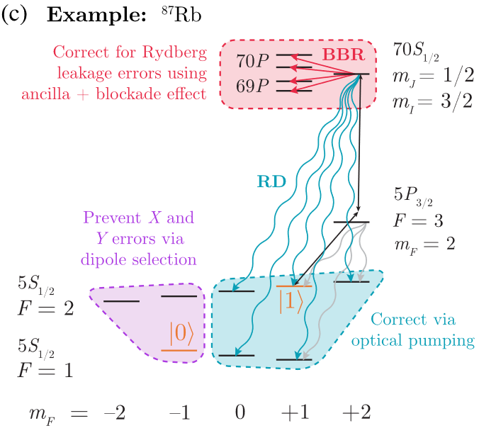
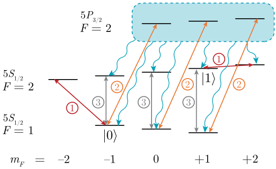

[← Back to Index](index.qmd)

# Overview

Rydberg gate fidelity is limited by a hierarchy of noise sources: laser phase and amplitude noise, motional dephasing (Doppler and thermal Stark), and intrinsic Rydberg state decay (spontaneous emission and blackbody radiation). Understanding these as quantum channels is essential for the interface with quantum error correction. A key advantage of alkaline-earth species ($^{88}$Sr) is that atom loss during Rydberg excitation produces a detectable **erasure error**, which is more benign than Pauli errors of the same rate.

---

# Phase Noise {#sec-phase-noise}

## Transformation to Stochastic Detuning

Laser phase noise $\phi_n(t)$ enters the two-photon Hamiltonian (see [Two-Qubit Gates](two_qubit_gates.qmd) @eq-two-photon-H) via modified noise-laden laser phases $\phi_1(t) \to \phi_1(t) + \phi_{1n}(t)$, $\phi_2(t) \to \phi_2(t) + \phi_{2n}(t)$.

Applying the noise-modified frame transformation

$$
U_n(t) = \exp\!\bigl(i\omega_g t|g\rangle\langle g| + i[(\omega_e - \Delta)t + \phi_{1n}(t)]|e\rangle\langle e| + i[(\omega_r - \delta)t + \phi_{1n}(t) + \phi_{2n}(t)]|r\rangle\langle r|\bigr)
$$

and expanding to first order in $\dot\phi_{in} \ll \omega_{r,e,g}$, the phase noise becomes an additional stochastic detuning on the Rydberg state:

$$
\delta(t) \;\to\; \delta - \dot\phi_{1n}(t) - \dot\phi_{2n}(t).
$$ {#eq-phase-noise-detuning}

This is the central result: **phase noise is equivalent to a time-dependent detuning** applied to the Rydberg drive.

## Power Spectral Density

The phase noise is characterized by its PSD $S_{\delta\nu}(f) = f^2 S_\phi(f)$. A realistic model for a PDH-locked laser has the form (from [Laser Systems](laser_systems.qmd) @eq-PSD):

$$
S_{\delta\nu}(f) = h_0 + \sum_g \frac{s_g f_g^2}{\sqrt{8\pi}\,\sigma_g}\,e^{-(f-f_g)^2/2\sigma_g^2} + \text{(negative $f$ term)},
$$

where the servo bumps at $f_g$ produce the most damaging contribution when $f_g/(\Omega/2\pi) \sim 1$ (noise frequency comparable to the Rabi frequency).

## Noise Simulation via Frequency Mixing

Given $S_{\delta\nu}(f)$, a realization of the stochastic detuning is generated as

$$
\dot\phi_n(t) = -\sum_j 4\pi f_j\sqrt{S_{\delta\nu}(f_j)\,\Delta f}\,\sin(2\pi f_j t + \varphi_j),
$$

where $\varphi_j \sim \mathcal{U}[0, 2\pi]$ are independent random phases and $\Delta f$ is the frequency resolution [@PhysRevA.107.042611]. Monte-Carlo averaging over noise realizations gives the gate infidelity as a function of noise parameters.

## Benchmarking: Servo Bump Sensitivity

To validate the noise simulation, one benchmarks $n\pi$-pulse fidelity against the servo bump center $f_g$, using parameters: $\Omega = 2\pi \times 1$ MHz, $h_0 = 0$, $f_g \in (0.1, 4)\times\Omega/2\pi$, $\sigma_g = 1400$ Hz, and $s_g = \sqrt{8\pi}\,\sigma_g\,h_g/f_{g0}^2$ with $h_g = 1100$, $f_{g0} = 10^6$. The result (@fig-servo-btm) shows that gate fidelity degrades most when the servo bump frequency $f_g$ is comparable to the Rabi frequency $\Omega/2\pi$.

![Benchmark of $n\pi$-pulse fidelity as a function of the servo bump noise center $f_g$. The infidelity peaks when $f_g \sim \Omega/2\pi$, confirming that noise at the Rabi frequency is most damaging. This reproduces the results of Jiang et al. [@PhysRevA.107.042611].](Figures/servo_btm.png){#fig-servo-btm width=85%}

---

# Amplitude Noise and Thermal Effects {#sec-amp-noise}

## Amplitude Noise

Laser intensity fluctuations enter as $(1 + \varepsilon)\Omega_{\rm max}$ with $\varepsilon$ a random variable. The first-order perturbation theory and robust pulse design are covered in [Two-Qubit Gates](two_qubit_gates.qmd#sec-robust). For typical trap experiments, amplitude noise contributes an infidelity $\sim \varepsilon_{\rm rms}^2$ where $\varepsilon_{\rm rms} \lesssim 10^{-2}$ for well-stabilized systems.

## Doppler Broadening

At temperature $T$ (post sideband-cooling, typically $T \sim 5\,\mu$K), the thermal velocity spread is $v_{\rm rms} = \sqrt{k_BT/m}$. For a laser with wavevector $k$ (direction of excitation), the Doppler-shifted detuning is

$$
\delta_D = k\,v_z,
$$

where $v_z$ is the projection of the thermal velocity onto the laser axis. For $^{87}$Rb at $T = 5\,\mu$K and the 420 nm laser, $\delta_D/2\pi \sim k v_{\rm rms}/(2\pi) \approx 15$ kHz. With typical gate Rabi frequencies $\Omega/2\pi \sim 1$ MHz, the Doppler contribution to infidelity is $\sim(\delta_D/\Omega)^2 \lesssim 10^{-4}$ — subdominant but non-negligible at the $10^{-3}$ level for sideband-heated or hotter samples.

## Differential AC Stark Shift

For $^{87}$Rb (no magic wavelength), the tweezer laser induces different light shifts on $|0\rangle$ and $|1\rangle$, creating an effective detuning $\delta_{\rm AC}$ that varies with tweezer intensity fluctuations and site-to-site inhomogeneity. Error-robust pulses [@PRXQuantum.4.020336] suppress sensitivity to $\delta_{\rm AC}$ at first order.

---

# Rydberg State Decay: Quantum Channels {#sec-decay-channels}

## Blackbody Radiation (BBR) Transitions

During the gate, the atom transiently occupies the Rydberg state $|r\rangle$. BBR (see [Rydberg Properties](rydberg_properties.qmd#sec-lifetime)) can transfer the atom to a nearby Rydberg state $|r'\rangle$ with rate $\Gamma_{r \to r'}$. The Kraus operators for this channel are [@PhysRevX.12.021049]:

$$
M_{r'} = \sqrt{P_{r'}}\,|r'\rangle\langle 1|, \qquad M_0 = \sqrt{1 - \sum_{r'} P_{r'}}\,\proj{1} + \sum_{n\neq 1}\proj{n},
$$ {#eq-BBR-kraus}

where $P_{r'}$ is the probability of transferring from the Rydberg state to $|r'\rangle$ during the gate time. For $n=70$ at room temperature, $P_{r'} \sim \Gamma_{bb}\,T_{\rm gate} \sim 10^{-3}$ for typical gate times $T_{\rm gate} \sim 0.5\,\mu$s.

## Spontaneous Emission

The Rydberg state decays to ground-state levels via spontaneous emission. The relevant error channel involves decay from $|r\rangle$ to the computational qubit states $|1\rangle$, $|0\rangle$, or to non-computational states $|f\rangle$ (other hyperfine sublevels). The Kraus operators are [@PhysRevX.12.021049]:

$$
M_0 = \proj{r} + \alpha\proj{1} + \beta\proj{0}, \quad
M_1 = p_1\proj{1}, \quad
M_2 = p_2\proj{0}, \quad
M_f = p_f\,|f\rangle\langle 1|.
$$ {#eq-spont-kraus}

Decay to $|f\rangle$ is a **leakage error** (outside the computational basis).

---

# Full Master Equation Simulation {#sec-lindblad}

## Non-Hermitian Effective Hamiltonian

To account for all decay channels simultaneously, the master equation is

$$
\frac{\partial\rho}{\partial t} = \frac{-i}{\hbar}[H(t),\rho] + \sum_\mu\!\left(M_\mu\rho M_\mu^\dagger - \frac{1}{2}M_\mu^\dagger M_\mu\rho - \frac{1}{2}\rho M_\mu^\dagger M_\mu\right),
$$ {#eq-Lindblad}

equivalently written with the non-Hermitian effective Hamiltonian

$$
H_{\rm eff}(t) = H(t) - i\frac{\hbar}{2}\sum_\mu M_\mu^\dagger M_\mu.
$$ {#eq-Heff}

## Two-Atom Approximation

For spontaneous emission on individual atoms (no collective decay), the single-atom effective Hamiltonian is $H_{{\rm eff},1}(t) = H_s(t) - i\frac{\hbar}{2}\sum_j \Gamma_j\proj{j}$. Since the decay channels act independently on each atom, the two-atom effective Hamiltonian is additive:

$$
H_{\rm eff}^{(2)}(t) = H_{{\rm eff},1}(t) \otimes \mathbb{I} + \mathbb{I} \otimes H_{{\rm eff},1}(t),
$$ {#eq-Heff-2atom}

so the two-atom propagator factorizes as $U_{\rm eff}(t) = U_{{\rm eff},1}(t) \otimes U_{{\rm eff},1}(t)$, reducing the computation to the single-atom level.

## Kraus Channel from Propagator Integration

Defining $\sigma(t) = U_{\rm eff}^{-1}(t)\rho\,U_{\rm eff}^{-1,\dagger}(t)$ and expanding to first order in $\Gamma_{j\to i}$, the gate channel is

$$
\rho(T) = U_{\rm eff}(T)\rho(0)U_{\rm eff}^\dagger(T) + \sum_{j,i}\Gamma_{j\to i}\int_0^T d\tau\; \rho_{\rho(0)}^{H_\tau}(T) + \mathcal{O}(\Gamma^2),
$$ {#eq-channel}

where $H_\tau$ denotes the same Hamiltonian evolution with a "measurement-and-replacement" quantum jump $|i\rangle\langle j|\otimes\mathbb{I}$ inserted at time $\tau$. This gives the full Kraus channel including all single-atom decay events during the gate.

## State Expansion During the Gate

For the 7-level Rb system (states $|0\rangle, |1\rangle, |2\rangle, |3\rangle, |4\rangle, |5\rangle, |6\rangle$ corresponding to the qubit, intermediate, Rydberg, and garbage Rydberg states), the input state $|\phi(0)\rangle = a|00\rangle + b|01\rangle + c|10\rangle + d|11\rangle$ evolves to

$$
\begin{aligned}
|\phi(\tau)\rangle &= a|00\rangle + b\sum_{s=1}^{6}\beta_s(\tau)|0s\rangle + c\sum_{s=1}^{6}\beta_s(\tau)|s0\rangle \\
&\quad + d\sum_{s_1,s_2=1}^{6}\alpha_{s_1 s_2}(\tau)|s_1 s_2\rangle.
\end{aligned}
$$ {#eq-state-expansion}

## Quantum Jump Analysis

Consider the quantum jump $\mathbb{I}\otimes|L_g\rangle\langle 2|$ (decay of one atom from intermediate state $|2\rangle$ to leakage ground state $|L_g\rangle$). Projecting:

$$
(\mathbb{I}\otimes|L_g\rangle\langle 2|)|\phi(\tau)\rangle = d\sum_{s_1=1}^{6}\alpha_{s_1,2}(\tau)|s_1 L_g\rangle + b\,\beta_2(\tau)|0 L_g\rangle.
$$

The projected state then evolves for the remaining time $T - \tau$. For the $|0 L_g\rangle$ component, the large detuning leaves it unchanged. The other components with $s_1 \neq 0$ evolve among the excited states and eventually return to $|11\rangle$ (erasure conversion). Integrating over the jump time and averaging:

$$
\int_0^T d\tau\;\rho_\phi^{H_\tau}(\tau) = d^2\sum_{s_1}\left(\int_0^T d\tau\;|\alpha_{s_1,2}(\tau)|^2\right)|11\rangle\langle 11| + b^2\left(\int_0^T d\tau\;|\beta_2(\tau)|^2\right)|01\rangle\langle 01|.
$$

## Full 7-Operator Kraus Channel

Applying this analysis to all possible quantum jumps — decay from states $\{2,3,4,5,6\}$ to $\{L_g, |1\rangle\}$ (leakage/computational ground states) and from $\{5,6\}$ to $\{L_r\}$ (leakage Rydberg states), plus decay to $|0\rangle$ — gives the complete Kraus channel. Define $P_{|q\rangle,|j\rangle} = \int_0^T d\tau\;|\text{occupancy of } |j\rangle \text{ with input } |q\rangle|^2$ as the cumulative probability that one atom is in state $|j\rangle$ during the gate with input $|q\rangle$. The 7 Kraus operators are:

$$
\begin{aligned}
M_{11\to11} &= \sqrt{\sum_{\substack{j\in\{2,3,4,5,6\}\to\{L_g,1\} \\ j\in\{5,6\}\to\{L_r\}}} 2\Gamma_{j\to i}\,P_{|11\rangle,|j\rangle}}\;|11\rangle\langle 11|, \\
M_{01\to01} &= \sqrt{\sum_{\substack{j\in\{2,3,4,5,6\}\to\{L_g,1\} \\ j\in\{5,6\}\to\{L_r\}}} \Gamma_{j\to i}\,P_{|01\rangle,|j\rangle}}\;|01\rangle\langle 01|, \\
M_{10\to10} &= \sqrt{\sum_{\substack{j\in\{2,3,4,5,6\}\to\{L_g,1\} \\ j\in\{5,6\}\to\{L_r\}}} \Gamma_{j\to i}\,P_{|01\rangle,|j\rangle}}\;|10\rangle\langle 10|, \\
M_{11\to10} &= \sqrt{\sum_{j\in\{2,3,4,5,6\}\to\{0\}} \Gamma_{j\to i}\,P_{|11\rangle,|j\rangle}}\;|10\rangle\langle 11|, \\
M_{11\to01} &= \sqrt{\sum_{j\in\{2,3,4,5,6\}\to\{0\}} \Gamma_{j\to i}\,P_{|11\rangle,|j\rangle}}\;|01\rangle\langle 11|, \\
M_{10\to00} &= \sqrt{\sum_{j\in\{2,3,4,5,6\}\to\{0\}} \Gamma_{j\to i}\,P_{|10\rangle,|j\rangle}}\;|00\rangle\langle 10|, \\
M_{01\to00} &= \sqrt{\sum_{j\in\{2,3,4,5,6\}\to\{0\}} \Gamma_{j\to i}\,P_{|01\rangle,|j\rangle}}\;|00\rangle\langle 01|.
\end{aligned}
$$ {#eq-full-kraus}

The first three operators describe diagonal (dephasing/loss) errors; the last four describe off-diagonal errors where one qubit decays to $|0\rangle$. The key insight is that decay to leakage states ($L_g, L_r$) contributes to erasure-detectable errors, while decay back to computational states contributes to Pauli errors.

---

# Erasure Conversion {#sec-erasure}

## Concept

A key advantage of $^{88}$Sr (and other alkaline-earth atoms) for fault-tolerant quantum computing is **erasure conversion** [@Wu_2022; @PhysRevX.12.021049]. During a Rydberg gate, atoms that decay to non-computational states (leaked Rydberg states, dark ground states outside $\{|g\rangle, |c\rangle\}$) are **absent** from the tweezer, or are in states distinguishable from the computational basis by fluorescence. This atom loss is a detectable event: an **erasure error** at a known location, rather than an unknown Pauli error.

:::{#def-erasure .callout-note icon="false"}
## Definition: Erasure error

An **erasure error** at site $i$ is an error whose location is known — the qubit has been lost or is in a detectable non-computational state. It is equivalent to a depolarizing channel on the known qubit conditioned on a detection flag:

$$
\mathcal{E}_{\rm erasure}(\rho) = (1-p)\rho + p\,\frac{\mathbb{I}}{2}\;\otimes\;\delta_{\rm flag},
$$

where the detection flag signals the error location.
:::

## Advantage Over Pauli Errors

For surface codes, the **threshold for erasure errors is approximately twice** that for depolarizing errors: $p_{\rm erasure}^{\rm threshold} \approx 50\%$ vs. $p_{\rm Pauli}^{\rm threshold} \approx 1\%$. An erasure error at a known site can be corrected by a decoder with perfect side information (see the Union-Find decoder in the [QEC](../QEC/) topic [@Delfosse_2020]).

## Fraction of Errors Converted to Erasures

In a Rydberg gate, atom loss from the $|r\rangle$ state to:
- Leak Rydberg states (via BBR): produces an atom in a distinguishable Rydberg state, detected by its absence during the next imaging step.
- Non-computational ground states $|f\rangle$: produces an atom in a dark state, distinguishable from both $|g\rangle$ and $|c\rangle$ by fluorescence.

For $^{88}$Sr, the long-lived $|{^3P_0}\rangle$ clock state (the qubit state $|c\rangle$) is distinguishable from the Rydberg state by its lack of Rydberg-manifold response. Decay to other ground states (e.g., $|{^3P_2}\rangle$) is also detectable. The conversion efficiency $\eta = P_{\rm erasure}/(P_{\rm erasure} + P_{\rm Pauli})$ can approach $\eta > 0.9$ for optimized gate parameters, dramatically improving logical error rates at the surface code level.

::: {layout-ncol=2}
{#fig-erasure1}

{#fig-erasure2}

Erasure conversion in $^{87}$Rb atoms: detection of leaked atoms and the resulting error budget.
:::

---

# Gate Error Simulation Results {#sec-gate-sim}

Numerical simulation of the full 7-level Hamiltonian with all noise sources (phase noise, spontaneous emission, BBR, Doppler broadening) produces detailed error statistics.

::: {layout-ncol=2}
{#fig-cz-error}

{#fig-thermo}

Gate error statistics from Monte Carlo simulation of the CZ gate protocol.
:::

::: {layout-ncol=2}
{#fig-mid-occ}

{#fig-ryd-occ}

Intermediate and Rydberg state occupancy profiles during the gate protocol.
:::
