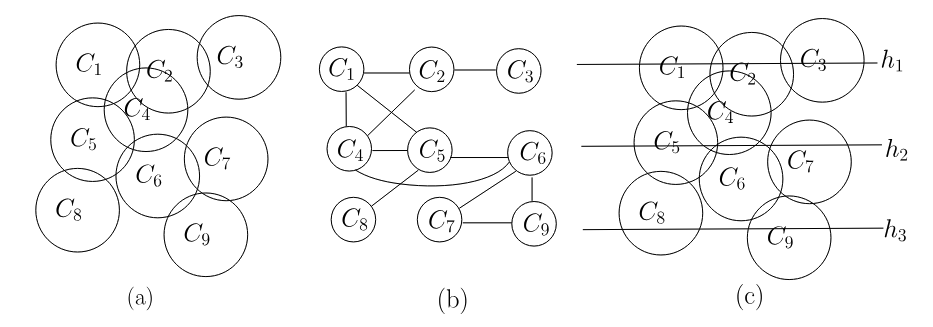

---
categories:
- Readings
date: '2026-07-06'
description: 'SOTA algorithm and PTAS for WMIS'
lang: en
title: SOTA algorithm and PTAS for WMIS
bibliography: refs.bib
---

# Strip approximation
The strip unit disk graphs (SUDG) is defined as disks $C_i, i \in [n]$ of diameter $1$ and
centers $c_i=(x_i,y_i)$ lying in the horizontal strip $H=\mathbb{R}\times[0,1]$.
We label the disk center (the vertex on the graph) as $x_j < x_k$ iff $1\le j<k\le n$.
An important structure of SUDG is that the "right end" properties is sufficient to check the independent relations, as summarized in @udgstrip

:::{#lem-udgstrip .callout-important icon="false"}
Let $C_1,C_2,C_3,C_4$ be strip-UD.
Assume that $x_1<x_2<x_3<x_4$, if $C_1,C_2,C_3$ are pairwise non-intersecting and
$C_2,C_3,C_4$ are pairwise non-intersecting, then $C_1$ and $C_4$ are non-intersecting.
:::

:::{.callout-note collapse="true"}
## Proof (Click to expand)
(t.b.c.)
:::

This property induces an efficient DP algorithm for its WMIS.
Define $\mathcal{I}_{j,k}$ as all the independent set that contains $j<k$ as the maximum label.
We also use $\mathcal{I}_{0,j}$ indicates the IS solution that contains single vertex $j$ only.
Define $\mu[j,k] := \max_{S\in \mathcal{I}_{j,k}}w(S)$, it is easy to see that the optimal solution for strip-UDG satisfied 
$$
\mathrm{OPT}=\max_{0\le j<k\le m}\mu[j,k].
$$
Then it is sufficient to design an efficient algorithm for each $\max_{1\le j<k\le n}\mu[j,k]$

:::{#lem-stripdp .callout-important icon="false"}
Given $1\le i < j < k\le n$, then
$$
\begin{align}
\mu[j,k]=\begin{cases}
w_k+ \displaystyle \max_{\substack{0\le i<j\\i=0\ \text{or}\ C_i\cap C_k=\varnothing}} \mu[i,j], &C_j\cap C_k=\varnothing,\\[1.2em]
-\infty, & C_j\cap C_k\neq\varnothing.
\end{cases}
\end{align}
$$
:::

:::{.callout-note collapse="true"}
## Proof (Click to expand)
Supposed $C_j\cap C_k=\varnothing$. 
Use @udgstrip, we noted that $S_{i,j}\cup\{k\}\in\mathcal I_{j,k}$ for all $i$ satisfied 
$$
0 <i<j, C_i\cap C_k=\varnothing \quad \text{or} \quad  i=0
$$
Tbus we have
$$
\mu[j,k]\ge
w_k+\max_{\substack{0\le i<j\\ i=0\ \text{or}\ C_i\cap C_k=\varnothing}}\mu[i,j].
$$
For the other side, denote the optimal independent set as
$$
S^\star\in\mathcal I_{j,k}, \quad w(S^\star)=\mu[j,k].
$$
Then we conclude that
$$
\begin{align}
\mu[j,k]
&=w(S^\star\setminus\{k\})+w_k \le \mu[i,j]+w_k\\
&\le
w_k+
\max_{\substack{0\le i'<j\\
i'=0\ \text{or}\ C_{i'}\cap C_k=\varnothing}}
\mu[i',j].
\end{align}
$$
where in the second inquality we use the fact that $S^\star\setminus\{k\}\in\mathcal I_{i,j}$ and $\mu[i,j]$ is the optimal one.
:::

Then to solve WMIS on general udg, we split the udg into strips $H_1,\cdots,H_n$ with WMIS on that strip as $I_1,\cdots,I_n$. Further denote
$$
I_{\mathrm{odd}} = I_1\cup I_3\cup I_5\cup\cdots, \quad I_{\mathrm{even}} = I_2\cup I_4\cup I_6\cup\cdots.
$$
and use the fact that the subset of WMIS is WMIS on the subset, we conclude:
$$
|I_{\mathrm{odd}}|+|I_{\mathrm{even}}| \ge |\mathrm{OPT}_{\mathrm{odd}}| + |\mathrm{OPT}_{\mathrm{even}}| = |\mathrm{OPT}|.
$$
This indicates tha maximum of $I_{\mathrm{odd}}$ and $I_{\mathrm{even}}$ at least gives a $\varepsilon = 1/2$ approximation.

# PTA

The strip approximation can be generalized. 
Instead of splitting into odd/even, we remove colomns with label $j mod d = 0$.
For example, in the case $k = 3$, we build up three different strip splitting:
$$
\begin{align}
&H_{p0} = H_{2,3,4} \cup H_{6,7,8}  \cup \cdots , \quad H_{p1} = H_{1} \cup H_{3,4,5}  \cup \cdots ,\\
H_{p2} = H_{1,2} \cup H_{4,5,6}  \cup \cdots , \quad H_{p3} = H_{1,2,3} \cup H_{5,6,7}  \cup \cdots .
\end{align}
$$
If ones can solve the WMIS on $H_{l,m,n}$, then union of them constitues an approximation of the optimal result.

:::{#lem-udgkstrip .callout-important icon="false"}
Given the $k$-strip splitting of a unit-disk graph with $k + 1$ phases, then the maximum WMIS $I^*$ among them satisfies $|I^*| \ge \frac{k}{k+1}|OPT|$.
:::

:::{.callout-note collapse="true"}
## Proof (Click to expand)
(t.b.c.)
:::

However, the left blcok, such as $H_{2,3,4}$ in the example, is not a unit strip, thus @lem-udgstrip don't applied.
